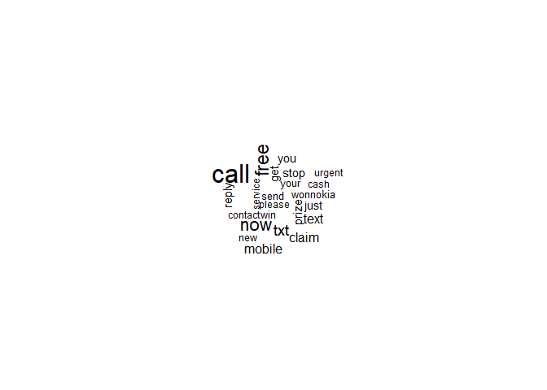

spam detection
================
Purity
05/07/2020

## R Markdown

This is an R Markdown document. Markdown is a simple formatting syntax
for authoring HTML, PDF, and MS Word documents. For more details on
using R Markdown see <http://rmarkdown.rstudio.com>.

When you click the **Knit** button a document will be generated that
includes both content as well as the output of any embedded R code
chunks within the document. You can embed an R code chunk like this:

``` r
#check the structure
str(sms_raw)
```

    ## 'data.frame':    5572 obs. of  5 variables:
    ##  $ v1 : chr  "ham" "ham" "spam" "ham" ...
    ##  $ v2 : chr  "Go until jurong point, crazy.. Available only in bugis n great world la e buffet... Cine there got amore wat..." "Ok lar... Joking wif u oni..." "Free entry in 2 a wkly comp to win FA Cup final tkts 21st May 2005. Text FA to 87121 to receive entry question("| __truncated__ "U dun say so early hor... U c already then say..." ...
    ##  $ X  : chr  "" "" "" "" ...
    ##  $ X.1: chr  "" "" "" "" ...
    ##  $ X.2: chr  "" "" "" "" ...

``` r
#change the type or v1 into caartegorical variable
sms_raw$v1<-as.factor(sms_raw$v1)
```

``` r
#study the target variable
table(sms_raw$v1)
```

    ## 
    ##  ham spam 
    ## 4825  747

``` r
#use the text mining package to preprocess data for analysis
library(tm)
```

    ## Warning: package 'tm' was built under R version 3.6.3

    ## Loading required package: NLP

``` r
#first create a corpus for each single string
sms_corpus <- VCorpus(VectorSource(sms_raw$v2))
sms_corpus
```

    ## <<VCorpus>>
    ## Metadata:  corpus specific: 0, document level (indexed): 0
    ## Content:  documents: 5572

``` r
lapply(sms_corpus[4:7], as.character)
```

    ## $`4`
    ## [1] "U dun say so early hor... U c already then say..."
    ## 
    ## $`5`
    ## [1] "Nah I don't think he goes to usf, he lives around here though"
    ## 
    ## $`6`
    ## [1] "FreeMsg Hey there darling it's been 3 week's now and no word back! I'd like some fun you up for it still? Tb ok! XxX std chgs to send, å£1.50 to rcv"
    ## 
    ## $`7`
    ## [1] "Even my brother is not like to speak with me. They treat me like aids patent."

``` r
#next we do text cleaning
#convert each text to lower for uniformity so that "Word" will not be different as "word"
corpus_clean <- tm_map(sms_corpus, content_transformer(tolower))
#next we remove numbers
corpus_clean <- tm_map(corpus_clean, removeNumbers)
inspect(corpus_clean)
```

    ## <<VCorpus>>
    ## Metadata:  corpus specific: 0, document level (indexed): 0
    ## Content:  documents: 5572
    ## 
    ## [[1]]
    ## <<PlainTextDocument>>
    ## Metadata:  7
    ## Content:  chars: 111
    ## 
    ## [[2]]
    ## <<PlainTextDocument>>
    ## Metadata:  7
    ## Content:  chars: 29
    ## 
    ## [[3]]
    ## <<PlainTextDocument>>
    ## Metadata:  7
    ## Content:  chars: 130
    ## 
    ## [[4]]
    ## <<PlainTextDocument>>
    ## Metadata:  7
    ## Content:  chars: 49
    ## 
    ## [[5]]
    ## <<PlainTextDocument>>
    ## Metadata:  7
    ## Content:  chars: 61
    ## 
    ## [[6]]
    ## <<PlainTextDocument>>
    ## Metadata:  7
    ## Content:  chars: 144
    ## 
    ## [[7]]
    ## <<PlainTextDocument>>
    ## Metadata:  7
    ## Content:  chars: 77
    ## 
    ## [[8]]
    ## <<PlainTextDocument>>
    ## Metadata:  7
    ## Content:  chars: 159
    ## 
    ## [[9]]
    ## <<PlainTextDocument>>
    ## Metadata:  7
    ## Content:  chars: 139
    ## 
    ## [[10]]
    ## <<PlainTextDocument>>
    ## Metadata:  7
    ## Content:  chars: 141
    ## 
    ## [[11]]
    ## <<PlainTextDocument>>
    ## Metadata:  7
    ## Content:  chars: 109
    ## 
    ## [[12]]
    ## <<PlainTextDocument>>
    ## Metadata:  7
    ## Content:  chars: 114
    ## 
    ## [[13]]
    ## <<PlainTextDocument>>
    ## Metadata:  7
    ## Content:  chars: 136
    ## 
    ## [[14]]
    ## <<PlainTextDocument>>
    ## Metadata:  7
    ## Content:  chars: 196
    ## 
    ## [[15]]
    ## <<PlainTextDocument>>
    ## Metadata:  7
    ## Content:  chars: 35
    ## 
    ## [[16]]
    ## <<PlainTextDocument>>
    ## Metadata:  7
    ## Content:  chars: 149
    ## 
    ## [[17]]
    ## <<PlainTextDocument>>
    ## Metadata:  7
    ## Content:  chars: 26
    ## 
    ## [[18]]
    ## <<PlainTextDocument>>
    ## Metadata:  7
    ## Content:  chars: 80
    ## 
    ## [[19]]
    ## <<PlainTextDocument>>
    ## Metadata:  7
    ## Content:  chars: 58
    ## 
    ## [[20]]
    ## <<PlainTextDocument>>
    ## Metadata:  7
    ## Content:  chars: 133
    ## 
    ## [[21]]
    ## <<PlainTextDocument>>
    ## Metadata:  7
    ## Content:  chars: 41
    ## 
    ## [[22]]
    ## <<PlainTextDocument>>
    ## Metadata:  7
    ## Content:  chars: 48
    ## 
    ## [[23]]
    ## <<PlainTextDocument>>
    ## Metadata:  7
    ## Content:  chars: 53
    ## 
    ## [[24]]
    ## <<PlainTextDocument>>
    ## Metadata:  7
    ## Content:  chars: 87
    ## 
    ## [[25]]
    ## <<PlainTextDocument>>
    ## Metadata:  7
    ## Content:  chars: 57
    ## 
    ## [[26]]
    ## <<PlainTextDocument>>
    ## Metadata:  7
    ## Content:  chars: 144
    ## 
    ## [[27]]
    ## <<PlainTextDocument>>
    ## Metadata:  7
    ## Content:  chars: 30
    ## 
    ## [[28]]
    ## <<PlainTextDocument>>
    ## Metadata:  7
    ## Content:  chars: 134
    ## 
    ## [[29]]
    ## <<PlainTextDocument>>
    ## Metadata:  7
    ## Content:  chars: 75
    ## 
    ## [[30]]
    ## <<PlainTextDocument>>
    ## Metadata:  7
    ## Content:  chars: 64
    ## 
    ## [[31]]
    ## <<PlainTextDocument>>
    ## Metadata:  7
    ## Content:  chars: 130
    ## 
    ## [[32]]
    ## <<PlainTextDocument>>
    ## Metadata:  7
    ## Content:  chars: 187
    ## 
    ## [[33]]
    ## <<PlainTextDocument>>
    ## Metadata:  7
    ## Content:  chars: 29
    ## 
    ## [[34]]
    ## <<PlainTextDocument>>
    ## Metadata:  7
    ## Content:  chars: 84
    ## 
    ## [[35]]
    ## <<PlainTextDocument>>
    ## Metadata:  7
    ## Content:  chars: 158
    ## 
    ## [[36]]
    ## <<PlainTextDocument>>
    ## Metadata:  7
    ## Content:  chars: 121
    ## 
    ## [[37]]
    ## <<PlainTextDocument>>
    ## Metadata:  7
    ## Content:  chars: 47
    ## 
    ## [[38]]
    ## <<PlainTextDocument>>
    ## Metadata:  7
    ## Content:  chars: 28
    ## 
    ## [[39]]
    ## <<PlainTextDocument>>
    ## Metadata:  7
    ## Content:  chars: 27
    ## 
    ## [[40]]
    ## <<PlainTextDocument>>
    ## Metadata:  7
    ## Content:  chars: 155
    ## 
    ## [[41]]
    ## <<PlainTextDocument>>
    ## Metadata:  7
    ## Content:  chars: 82
    ## 
    ## [[42]]
    ## <<PlainTextDocument>>
    ## Metadata:  7
    ## Content:  chars: 142
    ## 
    ## [[43]]
    ## <<PlainTextDocument>>
    ## Metadata:  7
    ## Content:  chars: 150
    ## 
    ## [[44]]
    ## <<PlainTextDocument>>
    ## Metadata:  7
    ## Content:  chars: 19
    ## 
    ## [[45]]
    ## <<PlainTextDocument>>
    ## Metadata:  7
    ## Content:  chars: 72
    ## 
    ## [[46]]
    ## <<PlainTextDocument>>
    ## Metadata:  7
    ## Content:  chars: 32
    ## 
    ## [[47]]
    ## <<PlainTextDocument>>
    ## Metadata:  7
    ## Content:  chars: 45
    ## 
    ## [[48]]
    ## <<PlainTextDocument>>
    ## Metadata:  7
    ## Content:  chars: 31
    ## 
    ## [[49]]
    ## <<PlainTextDocument>>
    ## Metadata:  7
    ## Content:  chars: 67
    ## 
    ## [[50]]
    ## <<PlainTextDocument>>
    ## Metadata:  7
    ## Content:  chars: 148
    ## 
    ## [[51]]
    ## <<PlainTextDocument>>
    ## Metadata:  7
    ## Content:  chars: 58
    ## 
    ## [[52]]
    ## <<PlainTextDocument>>
    ## Metadata:  7
    ## Content:  chars: 124
    ## 
    ## [[53]]
    ## <<PlainTextDocument>>
    ## Metadata:  7
    ## Content:  chars: 80
    ## 
    ## [[54]]
    ## <<PlainTextDocument>>
    ## Metadata:  7
    ## Content:  chars: 291
    ## 
    ## [[55]]
    ## <<PlainTextDocument>>
    ## Metadata:  7
    ## Content:  chars: 120
    ## 
    ## [[56]]
    ## <<PlainTextDocument>>
    ## Metadata:  7
    ## Content:  chars: 76
    ## 
    ## [[57]]
    ## <<PlainTextDocument>>
    ## Metadata:  7
    ## Content:  chars: 137
    ## 
    ## [[58]]
    ## <<PlainTextDocument>>
    ## Metadata:  7
    ## Content:  chars: 34
    ## 
    ## [[59]]
    ## <<PlainTextDocument>>
    ## Metadata:  7
    ## Content:  chars: 22
    ## 
    ## [[60]]
    ## <<PlainTextDocument>>
    ## Metadata:  7
    ## Content:  chars: 40
    ## 
    ## [[61]]
    ## <<PlainTextDocument>>
    ## Metadata:  7
    ## Content:  chars: 107
    ## 
    ## [[62]]
    ## <<PlainTextDocument>>
    ## Metadata:  7
    ## Content:  chars: 48
    ## 
    ## [[63]]
    ## <<PlainTextDocument>>
    ## Metadata:  7
    ## Content:  chars: 25
    ## 
    ## [[64]]
    ## <<PlainTextDocument>>
    ## Metadata:  7
    ## Content:  chars: 56
    ## 
    ## [[65]]
    ## <<PlainTextDocument>>
    ## Metadata:  7
    ## Content:  chars: 110
    ## 
    ## [[66]]
    ## <<PlainTextDocument>>
    ## Metadata:  7
    ## Content:  chars: 138
    ## 
    ## [[67]]
    ## <<PlainTextDocument>>
    ## Metadata:  7
    ## Content:  chars: 124
    ## 
    ## [[68]]
    ## <<PlainTextDocument>>
    ## Metadata:  7
    ## Content:  chars: 140
    ## 
    ## [[69]]
    ## <<PlainTextDocument>>
    ## Metadata:  7
    ## Content:  chars: 80
    ## 
    ## [[70]]
    ## <<PlainTextDocument>>
    ## Metadata:  7
    ## Content:  chars: 34
    ## 
    ## [[71]]
    ## <<PlainTextDocument>>
    ## Metadata:  7
    ## Content:  chars: 46
    ## 
    ## [[72]]
    ## <<PlainTextDocument>>
    ## Metadata:  7
    ## Content:  chars: 29
    ## 
    ## [[73]]
    ## <<PlainTextDocument>>
    ## Metadata:  7
    ## Content:  chars: 45
    ## 
    ## [[74]]
    ## <<PlainTextDocument>>
    ## Metadata:  7
    ## Content:  chars: 42
    ## 
    ## [[75]]
    ## <<PlainTextDocument>>
    ## Metadata:  7
    ## Content:  chars: 20
    ## 
    ## [[76]]
    ## <<PlainTextDocument>>
    ## Metadata:  7
    ## Content:  chars: 43
    ## 
    ## [[77]]
    ## <<PlainTextDocument>>
    ## Metadata:  7
    ## Content:  chars: 73
    ## 
    ## [[78]]
    ## <<PlainTextDocument>>
    ## Metadata:  7
    ## Content:  chars: 50
    ## 
    ## [[79]]
    ## <<PlainTextDocument>>
    ## Metadata:  7
    ## Content:  chars: 42
    ## 
    ## [[80]]
    ## <<PlainTextDocument>>
    ## Metadata:  7
    ## Content:  chars: 76
    ## 
    ## [[81]]
    ## <<PlainTextDocument>>
    ## Metadata:  7
    ## Content:  chars: 22
    ## 
    ## [[82]]
    ## <<PlainTextDocument>>
    ## Metadata:  7
    ## Content:  chars: 32
    ## 
    ## [[83]]
    ## <<PlainTextDocument>>
    ## Metadata:  7
    ## Content:  chars: 32
    ## 
    ## [[84]]
    ## <<PlainTextDocument>>
    ## Metadata:  7
    ## Content:  chars: 36
    ## 
    ## [[85]]
    ## <<PlainTextDocument>>
    ## Metadata:  7
    ## Content:  chars: 14
    ## 
    ## [[86]]
    ## <<PlainTextDocument>>
    ## Metadata:  7
    ## Content:  chars: 55
    ## 
    ## [[87]]
    ## <<PlainTextDocument>>
    ## Metadata:  7
    ## Content:  chars: 120
    ## 
    ## [[88]]
    ## <<PlainTextDocument>>
    ## Metadata:  7
    ## Content:  chars: 144
    ## 
    ## [[89]]
    ## <<PlainTextDocument>>
    ## Metadata:  7
    ## Content:  chars: 42
    ## 
    ## [[90]]
    ## <<PlainTextDocument>>
    ## Metadata:  7
    ## Content:  chars: 41
    ## 
    ## [[91]]
    ## <<PlainTextDocument>>
    ## Metadata:  7
    ## Content:  chars: 62
    ## 
    ## [[92]]
    ## <<PlainTextDocument>>
    ## Metadata:  7
    ## Content:  chars: 193
    ## 
    ## [[93]]
    ## <<PlainTextDocument>>
    ## Metadata:  7
    ## Content:  chars: 140
    ## 
    ## [[94]]
    ## <<PlainTextDocument>>
    ## Metadata:  7
    ## Content:  chars: 117
    ## 
    ## [[95]]
    ## <<PlainTextDocument>>
    ## Metadata:  7
    ## Content:  chars: 104
    ## 
    ## [[96]]
    ## <<PlainTextDocument>>
    ## Metadata:  7
    ## Content:  chars: 120
    ## 
    ## [[97]]
    ## <<PlainTextDocument>>
    ## Metadata:  7
    ## Content:  chars: 33
    ## 
    ## [[98]]
    ## <<PlainTextDocument>>
    ## Metadata:  7
    ## Content:  chars: 51
    ## 
    ## [[99]]
    ## <<PlainTextDocument>>
    ## Metadata:  7
    ## Content:  chars: 184
    ## 
    ## [[100]]
    ## <<PlainTextDocument>>
    ## Metadata:  7
    ## Content:  chars: 57
    ## 
    ## [[101]]
    ## <<PlainTextDocument>>
    ## Metadata:  7
    ## Content:  chars: 81
    ## 
    ## [[102]]
    ## <<PlainTextDocument>>
    ## Metadata:  7
    ## Content:  chars: 75
    ## 
    ## [[103]]
    ## <<PlainTextDocument>>
    ## Metadata:  7
    ## Content:  chars: 159
    ## 
    ## [[104]]
    ## <<PlainTextDocument>>
    ## Metadata:  7
    ## Content:  chars: 183
    ## 
    ## [[105]]
    ## <<PlainTextDocument>>
    ## Metadata:  7
    ## Content:  chars: 44
    ## 
    ## [[106]]
    ## <<PlainTextDocument>>
    ## Metadata:  7
    ## Content:  chars: 95
    ## 
    ## [[107]]
    ## <<PlainTextDocument>>
    ## Metadata:  7
    ## Content:  chars: 43
    ## 
    ## [[108]]
    ## <<PlainTextDocument>>
    ## Metadata:  7
    ## Content:  chars: 82
    ## 
    ## [[109]]
    ## <<PlainTextDocument>>
    ## Metadata:  7
    ## Content:  chars: 115
    ## 
    ## [[110]]
    ## <<PlainTextDocument>>
    ## Metadata:  7
    ## Content:  chars: 30
    ## 
    ## [[111]]
    ## <<PlainTextDocument>>
    ## Metadata:  7
    ## Content:  chars: 40
    ## 
    ## [[112]]
    ## <<PlainTextDocument>>
    ## Metadata:  7
    ## Content:  chars: 31
    ## 
    ## [[113]]
    ## <<PlainTextDocument>>
    ## Metadata:  7
    ## Content:  chars: 95
    ## 
    ## [[114]]
    ## <<PlainTextDocument>>
    ## Metadata:  7
    ## Content:  chars: 137
    ## 
    ## [[115]]
    ## <<PlainTextDocument>>
    ## Metadata:  7
    ## Content:  chars: 143
    ## 
    ## [[116]]
    ## <<PlainTextDocument>>
    ## Metadata:  7
    ## Content:  chars: 155
    ## 
    ## [[117]]
    ## <<PlainTextDocument>>
    ## Metadata:  7
    ## Content:  chars: 131
    ## 
    ## [[118]]
    ## <<PlainTextDocument>>
    ## Metadata:  7
    ## Content:  chars: 72
    ## 
    ## [[119]]
    ## <<PlainTextDocument>>
    ## Metadata:  7
    ## Content:  chars: 86
    ## 
    ## [[120]]
    ## <<PlainTextDocument>>
    ## Metadata:  7
    ## Content:  chars: 110
    ## 
    ## [[121]]
    ## <<PlainTextDocument>>
    ## Metadata:  7
    ## Content:  chars: 131
    ## 
    ## [[122]]
    ## <<PlainTextDocument>>
    ## Metadata:  7
    ## Content:  chars: 53
    ## 
    ## [[123]]
    ## <<PlainTextDocument>>
    ## Metadata:  7
    ## Content:  chars: 134
    ## 
    ## [[124]]
    ## <<PlainTextDocument>>
    ## Metadata:  7
    ## Content:  chars: 50
    ## 
    ## [[125]]
    ## <<PlainTextDocument>>
    ## Metadata:  7
    ## Content:  chars: 40
    ## 
    ## [[126]]
    ## <<PlainTextDocument>>
    ## Metadata:  7
    ## Content:  chars: 20
    ## 
    ## [[127]]
    ## <<PlainTextDocument>>
    ## Metadata:  7
    ## Content:  chars: 244
    ## 
    ## [[128]]
    ## <<PlainTextDocument>>
    ## Metadata:  7
    ## Content:  chars: 22
    ## 
    ## [[129]]
    ## <<PlainTextDocument>>
    ## Metadata:  7
    ## Content:  chars: 107
    ## 
    ## [[130]]
    ## <<PlainTextDocument>>
    ## Metadata:  7
    ## Content:  chars: 28
    ## 
    ## [[131]]
    ## <<PlainTextDocument>>
    ## Metadata:  7
    ## Content:  chars: 9
    ## 
    ## [[132]]
    ## <<PlainTextDocument>>
    ## Metadata:  7
    ## Content:  chars: 39
    ## 
    ## [[133]]
    ## <<PlainTextDocument>>
    ## Metadata:  7
    ## Content:  chars: 25
    ## 
    ## [[134]]
    ## <<PlainTextDocument>>
    ## Metadata:  7
    ## Content:  chars: 118
    ## 
    ## [[135]]
    ## <<PlainTextDocument>>
    ## Metadata:  7
    ## Content:  chars: 149
    ## 
    ## [[136]]
    ## <<PlainTextDocument>>
    ## Metadata:  7
    ## Content:  chars: 38
    ## 
    ## [[137]]
    ## <<PlainTextDocument>>
    ## Metadata:  7
    ## Content:  chars: 34
    ## 
    ## [[138]]
    ## <<PlainTextDocument>>
    ## Metadata:  7
    ## Content:  chars: 46
    ## 
    ## [[139]]
    ## <<PlainTextDocument>>
    ## Metadata:  7
    ## Content:  chars: 150
    ## 
    ## [[140]]
    ## <<PlainTextDocument>>
    ## Metadata:  7
    ## Content:  chars: 86
    ## 
    ## [[141]]
    ## <<PlainTextDocument>>
    ## Metadata:  7
    ## Content:  chars: 33
    ## 
    ## [[142]]
    ## <<PlainTextDocument>>
    ## Metadata:  7
    ## Content:  chars: 27
    ## 
    ## [[143]]
    ## <<PlainTextDocument>>
    ## Metadata:  7
    ## Content:  chars: 156
    ## 
    ## [[144]]
    ## <<PlainTextDocument>>
    ## Metadata:  7
    ## Content:  chars: 42
    ## 
    ## [[145]]
    ## <<PlainTextDocument>>
    ## Metadata:  7
    ## Content:  chars: 25
    ## 
    ## [[146]]
    ## <<PlainTextDocument>>
    ## Metadata:  7
    ## Content:  chars: 48
    ## 
    ## [[147]]
    ## <<PlainTextDocument>>
    ## Metadata:  7
    ## Content:  chars: 145
    ## 
    ## [[148]]
    ## <<PlainTextDocument>>
    ## Metadata:  7
    ## Content:  chars: 84
    ## 
    ## [[149]]
    ## <<PlainTextDocument>>
    ## Metadata:  7
    ## Content:  chars: 33
    ## 
    ## [[150]]
    ## <<PlainTextDocument>>
    ## Metadata:  7
    ## Content:  chars: 30
    ## 
    ## [[151]]
    ## <<PlainTextDocument>>
    ## Metadata:  7
    ## Content:  chars: 45
    ## 
    ## [[152]]
    ## <<PlainTextDocument>>
    ## Metadata:  7
    ## Content:  chars: 57
    ## 
    ## [[153]]
    ## <<PlainTextDocument>>
    ## Metadata:  7
    ## Content:  chars: 25
    ## 
    ## [[154]]
    ## <<PlainTextDocument>>
    ## Metadata:  7
    ## Content:  chars: 159
    ## 
    ## [[155]]
    ## <<PlainTextDocument>>
    ## Metadata:  7
    ## Content:  chars: 384
    ## 
    ## [[156]]
    ## <<PlainTextDocument>>
    ## Metadata:  7
    ## Content:  chars: 28
    ## 
    ## [[157]]
    ## <<PlainTextDocument>>
    ## Metadata:  7
    ## Content:  chars: 27
    ## 
    ## [[158]]
    ## <<PlainTextDocument>>
    ## Metadata:  7
    ## Content:  chars: 157
    ## 
    ## [[159]]
    ## <<PlainTextDocument>>
    ## Metadata:  7
    ## Content:  chars: 113
    ## 
    ## [[160]]
    ## <<PlainTextDocument>>
    ## Metadata:  7
    ## Content:  chars: 126
    ## 
    ## [[161]]
    ## <<PlainTextDocument>>
    ## Metadata:  7
    ## Content:  chars: 115
    ## 
    ## [[162]]
    ## <<PlainTextDocument>>
    ## Metadata:  7
    ## Content:  chars: 64
    ## 
    ## [[163]]
    ## <<PlainTextDocument>>
    ## Metadata:  7
    ## Content:  chars: 85
    ## 
    ## [[164]]
    ## <<PlainTextDocument>>
    ## Metadata:  7
    ## Content:  chars: 139
    ## 
    ## [[165]]
    ## <<PlainTextDocument>>
    ## Metadata:  7
    ## Content:  chars: 154
    ## 
    ## [[166]]
    ## <<PlainTextDocument>>
    ## Metadata:  7
    ## Content:  chars: 51
    ## 
    ## [[167]]
    ## <<PlainTextDocument>>
    ## Metadata:  7
    ## Content:  chars: 139
    ## 
    ## [[168]]
    ## <<PlainTextDocument>>
    ## Metadata:  7
    ## Content:  chars: 74
    ## 
    ## [[169]]
    ## <<PlainTextDocument>>
    ## Metadata:  7
    ## Content:  chars: 67
    ## 
    ## [[170]]
    ## <<PlainTextDocument>>
    ## Metadata:  7
    ## Content:  chars: 59
    ## 
    ## [[171]]
    ## <<PlainTextDocument>>
    ## Metadata:  7
    ## Content:  chars: 50
    ## 
    ## [[172]]
    ## <<PlainTextDocument>>
    ## Metadata:  7
    ## Content:  chars: 93
    ## 
    ## [[173]]
    ## <<PlainTextDocument>>
    ## Metadata:  7
    ## Content:  chars: 33
    ## 
    ## [[174]]
    ## <<PlainTextDocument>>
    ## Metadata:  7
    ## Content:  chars: 105
    ## 
    ## [[175]]
    ## <<PlainTextDocument>>
    ## Metadata:  7
    ## Content:  chars: 61
    ## 
    ## [[176]]
    ## <<PlainTextDocument>>
    ## Metadata:  7
    ## Content:  chars: 65
    ## 
    ## [[177]]
    ## <<PlainTextDocument>>
    ## Metadata:  7
    ## Content:  chars: 26
    ## 
    ## [[178]]
    ## <<PlainTextDocument>>
    ## Metadata:  7
    ## Content:  chars: 146
    ## 
    ## [[179]]
    ## <<PlainTextDocument>>
    ## Metadata:  7
    ## Content:  chars: 66
    ## 
    ## [[180]]
    ## <<PlainTextDocument>>
    ## Metadata:  7
    ## Content:  chars: 126
    ## 
    ## [[181]]
    ## <<PlainTextDocument>>
    ## Metadata:  7
    ## Content:  chars: 158
    ## 
    ## [[182]]
    ## <<PlainTextDocument>>
    ## Metadata:  7
    ## Content:  chars: 23
    ## 
    ## [[183]]
    ## <<PlainTextDocument>>
    ## Metadata:  7
    ## Content:  chars: 65
    ## 
    ## [[184]]
    ## <<PlainTextDocument>>
    ## Metadata:  7
    ## Content:  chars: 24
    ## 
    ## [[185]]
    ## <<PlainTextDocument>>
    ## Metadata:  7
    ## Content:  chars: 26
    ## 
    ## [[186]]
    ## <<PlainTextDocument>>
    ## Metadata:  7
    ## Content:  chars: 152
    ## 
    ## [[187]]
    ## <<PlainTextDocument>>
    ## Metadata:  7
    ## Content:  chars: 34
    ## 
    ## [[188]]
    ## <<PlainTextDocument>>
    ## Metadata:  7
    ## Content:  chars: 127
    ## 
    ## [[189]]
    ## <<PlainTextDocument>>
    ## Metadata:  7
    ## Content:  chars: 55
    ## 
    ## [[190]]
    ## <<PlainTextDocument>>
    ## Metadata:  7
    ## Content:  chars: 88
    ## 
    ## [[191]]
    ## <<PlainTextDocument>>
    ## Metadata:  7
    ## Content:  chars: 70
    ## 
    ## [[192]]
    ## <<PlainTextDocument>>
    ## Metadata:  7
    ## Content:  chars: 185
    ## 
    ## [[193]]
    ## <<PlainTextDocument>>
    ## Metadata:  7
    ## Content:  chars: 37
    ## 
    ## [[194]]
    ## <<PlainTextDocument>>
    ## Metadata:  7
    ## Content:  chars: 111
    ## 
    ## [[195]]
    ## <<PlainTextDocument>>
    ## Metadata:  7
    ## Content:  chars: 91
    ## 
    ## [[196]]
    ## <<PlainTextDocument>>
    ## Metadata:  7
    ## Content:  chars: 28
    ## 
    ## [[197]]
    ## <<PlainTextDocument>>
    ## Metadata:  7
    ## Content:  chars: 28
    ## 
    ## [[198]]
    ## <<PlainTextDocument>>
    ## Metadata:  7
    ## Content:  chars: 63
    ## 
    ## [[199]]
    ## <<PlainTextDocument>>
    ## Metadata:  7
    ## Content:  chars: 131
    ## 
    ## [[200]]
    ## <<PlainTextDocument>>
    ## Metadata:  7
    ## Content:  chars: 40
    ## 
    ## [[201]]
    ## <<PlainTextDocument>>
    ## Metadata:  7
    ## Content:  chars: 28
    ## 
    ## [[202]]
    ## <<PlainTextDocument>>
    ## Metadata:  7
    ## Content:  chars: 84
    ## 
    ## [[203]]
    ## <<PlainTextDocument>>
    ## Metadata:  7
    ## Content:  chars: 174
    ## 
    ## [[204]]
    ## <<PlainTextDocument>>
    ## Metadata:  7
    ## Content:  chars: 24
    ## 
    ## [[205]]
    ## <<PlainTextDocument>>
    ## Metadata:  7
    ## Content:  chars: 23
    ## 
    ## [[206]]
    ## <<PlainTextDocument>>
    ## Metadata:  7
    ## Content:  chars: 64
    ## 
    ## [[207]]
    ## <<PlainTextDocument>>
    ## Metadata:  7
    ## Content:  chars: 155
    ## 
    ## [[208]]
    ## <<PlainTextDocument>>
    ## Metadata:  7
    ## Content:  chars: 28
    ## 
    ## [[209]]
    ## <<PlainTextDocument>>
    ## Metadata:  7
    ## Content:  chars: 86
    ## 
    ## [[210]]
    ## <<PlainTextDocument>>
    ## Metadata:  7
    ## Content:  chars: 39
    ## 
    ## [[211]]
    ## <<PlainTextDocument>>
    ## Metadata:  7
    ## Content:  chars: 73
    ## 
    ## [[212]]
    ## <<PlainTextDocument>>
    ## Metadata:  7
    ## Content:  chars: 26
    ## 
    ## [[213]]
    ## <<PlainTextDocument>>
    ## Metadata:  7
    ## Content:  chars: 23
    ## 
    ## [[214]]
    ## <<PlainTextDocument>>
    ## Metadata:  7
    ## Content:  chars: 24
    ## 
    ## [[215]]
    ## <<PlainTextDocument>>
    ## Metadata:  7
    ## Content:  chars: 31
    ## 
    ## [[216]]
    ## <<PlainTextDocument>>
    ## Metadata:  7
    ## Content:  chars: 58
    ## 
    ## [[217]]
    ## <<PlainTextDocument>>
    ## Metadata:  7
    ## Content:  chars: 48
    ## 
    ## [[218]]
    ## <<PlainTextDocument>>
    ## Metadata:  7
    ## Content:  chars: 41
    ## 
    ## [[219]]
    ## <<PlainTextDocument>>
    ## Metadata:  7
    ## Content:  chars: 31
    ## 
    ## [[220]]
    ## <<PlainTextDocument>>
    ## Metadata:  7
    ## Content:  chars: 159
    ## 
    ## [[221]]
    ## <<PlainTextDocument>>
    ## Metadata:  7
    ## Content:  chars: 25
    ## 
    ## [[222]]
    ## <<PlainTextDocument>>
    ## Metadata:  7
    ## Content:  chars: 161
    ## 
    ## [[223]]
    ## <<PlainTextDocument>>
    ## Metadata:  7
    ## Content:  chars: 22
    ## 
    ## [[224]]
    ## <<PlainTextDocument>>
    ## Metadata:  7
    ## Content:  chars: 119
    ## 
    ## [[225]]
    ## <<PlainTextDocument>>
    ## Metadata:  7
    ## Content:  chars: 112
    ## 
    ## [[226]]
    ## <<PlainTextDocument>>
    ## Metadata:  7
    ## Content:  chars: 69
    ## 
    ## [[227]]
    ## <<PlainTextDocument>>
    ## Metadata:  7
    ## Content:  chars: 135
    ## 
    ## [[228]]
    ## <<PlainTextDocument>>
    ## Metadata:  7
    ## Content:  chars: 30
    ## 
    ## [[229]]
    ## <<PlainTextDocument>>
    ## Metadata:  7
    ## Content:  chars: 165
    ## 
    ## [[230]]
    ## <<PlainTextDocument>>
    ## Metadata:  7
    ## Content:  chars: 34
    ## 
    ## [[231]]
    ## <<PlainTextDocument>>
    ## Metadata:  7
    ## Content:  chars: 109
    ## 
    ## [[232]]
    ## <<PlainTextDocument>>
    ## Metadata:  7
    ## Content:  chars: 37
    ## 
    ## [[233]]
    ## <<PlainTextDocument>>
    ## Metadata:  7
    ## Content:  chars: 33
    ## 
    ## [[234]]
    ## <<PlainTextDocument>>
    ## Metadata:  7
    ## Content:  chars: 48
    ## 
    ## [[235]]
    ## <<PlainTextDocument>>
    ## Metadata:  7
    ## Content:  chars: 150
    ## 
    ## [[236]]
    ## <<PlainTextDocument>>
    ## Metadata:  7
    ## Content:  chars: 50
    ## 
    ## [[237]]
    ## <<PlainTextDocument>>
    ## Metadata:  7
    ## Content:  chars: 65
    ## 
    ## [[238]]
    ## <<PlainTextDocument>>
    ## Metadata:  7
    ## Content:  chars: 38
    ## 
    ## [[239]]
    ## <<PlainTextDocument>>
    ## Metadata:  7
    ## Content:  chars: 145
    ## 
    ## [[240]]
    ## <<PlainTextDocument>>
    ## Metadata:  7
    ## Content:  chars: 121
    ## 
    ## [[241]]
    ## <<PlainTextDocument>>
    ## Metadata:  7
    ## Content:  chars: 51
    ## 
    ## [[242]]
    ## <<PlainTextDocument>>
    ## Metadata:  7
    ## Content:  chars: 45
    ## 
    ## [[243]]
    ## <<PlainTextDocument>>
    ## Metadata:  7
    ## Content:  chars: 83
    ## 
    ## [[244]]
    ## <<PlainTextDocument>>
    ## Metadata:  7
    ## Content:  chars: 154
    ## 
    ## [[245]]
    ## <<PlainTextDocument>>
    ## Metadata:  7
    ## Content:  chars: 37
    ## 
    ## [[246]]
    ## <<PlainTextDocument>>
    ## Metadata:  7
    ## Content:  chars: 78
    ## 
    ## [[247]]
    ## <<PlainTextDocument>>
    ## Metadata:  7
    ## Content:  chars: 30
    ## 
    ## [[248]]
    ## <<PlainTextDocument>>
    ## Metadata:  7
    ## Content:  chars: 30
    ## 
    ## [[249]]
    ## <<PlainTextDocument>>
    ## Metadata:  7
    ## Content:  chars: 146
    ## 
    ## [[250]]
    ## <<PlainTextDocument>>
    ## Metadata:  7
    ## Content:  chars: 128
    ## 
    ## [[251]]
    ## <<PlainTextDocument>>
    ## Metadata:  7
    ## Content:  chars: 43
    ## 
    ## [[252]]
    ## <<PlainTextDocument>>
    ## Metadata:  7
    ## Content:  chars: 179
    ## 
    ## [[253]]
    ## <<PlainTextDocument>>
    ## Metadata:  7
    ## Content:  chars: 27
    ## 
    ## [[254]]
    ## <<PlainTextDocument>>
    ## Metadata:  7
    ## Content:  chars: 177
    ## 
    ## [[255]]
    ## <<PlainTextDocument>>
    ## Metadata:  7
    ## Content:  chars: 38
    ## 
    ## [[256]]
    ## <<PlainTextDocument>>
    ## Metadata:  7
    ## Content:  chars: 97
    ## 
    ## [[257]]
    ## <<PlainTextDocument>>
    ## Metadata:  7
    ## Content:  chars: 43
    ## 
    ## [[258]]
    ## <<PlainTextDocument>>
    ## Metadata:  7
    ## Content:  chars: 36
    ## 
    ## [[259]]
    ## <<PlainTextDocument>>
    ## Metadata:  7
    ## Content:  chars: 140
    ## 
    ## [[260]]
    ## <<PlainTextDocument>>
    ## Metadata:  7
    ## Content:  chars: 74
    ## 
    ## [[261]]
    ## <<PlainTextDocument>>
    ## Metadata:  7
    ## Content:  chars: 3
    ## 
    ## [[262]]
    ## <<PlainTextDocument>>
    ## Metadata:  7
    ## Content:  chars: 85
    ## 
    ## [[263]]
    ## <<PlainTextDocument>>
    ## Metadata:  7
    ## Content:  chars: 41
    ## 
    ## [[264]]
    ## <<PlainTextDocument>>
    ## Metadata:  7
    ## Content:  chars: 108
    ## 
    ## [[265]]
    ## <<PlainTextDocument>>
    ## Metadata:  7
    ## Content:  chars: 26
    ## 
    ## [[266]]
    ## <<PlainTextDocument>>
    ## Metadata:  7
    ## Content:  chars: 35
    ## 
    ## [[267]]
    ## <<PlainTextDocument>>
    ## Metadata:  7
    ## Content:  chars: 47
    ## 
    ## [[268]]
    ## <<PlainTextDocument>>
    ## Metadata:  7
    ## Content:  chars: 140
    ## 
    ## [[269]]
    ## <<PlainTextDocument>>
    ## Metadata:  7
    ## Content:  chars: 47
    ## 
    ## [[270]]
    ## <<PlainTextDocument>>
    ## Metadata:  7
    ## Content:  chars: 133
    ## 
    ## [[271]]
    ## <<PlainTextDocument>>
    ## Metadata:  7
    ## Content:  chars: 53
    ## 
    ## [[272]]
    ## <<PlainTextDocument>>
    ## Metadata:  7
    ## Content:  chars: 147
    ## 
    ## [[273]]
    ## <<PlainTextDocument>>
    ## Metadata:  7
    ## Content:  chars: 143
    ## 
    ## [[274]]
    ## <<PlainTextDocument>>
    ## Metadata:  7
    ## Content:  chars: 36
    ## 
    ## [[275]]
    ## <<PlainTextDocument>>
    ## Metadata:  7
    ## Content:  chars: 31
    ## 
    ## [[276]]
    ## <<PlainTextDocument>>
    ## Metadata:  7
    ## Content:  chars: 8
    ## 
    ## [[277]]
    ## <<PlainTextDocument>>
    ## Metadata:  7
    ## Content:  chars: 38
    ## 
    ## [[278]]
    ## <<PlainTextDocument>>
    ## Metadata:  7
    ## Content:  chars: 30
    ## 
    ## [[279]]
    ## <<PlainTextDocument>>
    ## Metadata:  7
    ## Content:  chars: 47
    ## 
    ## [[280]]
    ## <<PlainTextDocument>>
    ## Metadata:  7
    ## Content:  chars: 56
    ## 
    ## [[281]]
    ## <<PlainTextDocument>>
    ## Metadata:  7
    ## Content:  chars: 22
    ## 
    ## [[282]]
    ## <<PlainTextDocument>>
    ## Metadata:  7
    ## Content:  chars: 19
    ## 
    ## [[283]]
    ## <<PlainTextDocument>>
    ## Metadata:  7
    ## Content:  chars: 29
    ## 
    ## [[284]]
    ## <<PlainTextDocument>>
    ## Metadata:  7
    ## Content:  chars: 7
    ## 
    ## [[285]]
    ## <<PlainTextDocument>>
    ## Metadata:  7
    ## Content:  chars: 121
    ## 
    ## [[286]]
    ## <<PlainTextDocument>>
    ## Metadata:  7
    ## Content:  chars: 58
    ## 
    ## [[287]]
    ## <<PlainTextDocument>>
    ## Metadata:  7
    ## Content:  chars: 4
    ## 
    ## [[288]]
    ## <<PlainTextDocument>>
    ## Metadata:  7
    ## Content:  chars: 147
    ## 
    ## [[289]]
    ## <<PlainTextDocument>>
    ## Metadata:  7
    ## Content:  chars: 160
    ## 
    ## [[290]]
    ## <<PlainTextDocument>>
    ## Metadata:  7
    ## Content:  chars: 152
    ## 
    ## [[291]]
    ## <<PlainTextDocument>>
    ## Metadata:  7
    ## Content:  chars: 37
    ## 
    ## [[292]]
    ## <<PlainTextDocument>>
    ## Metadata:  7
    ## Content:  chars: 55
    ## 
    ## [[293]]
    ## <<PlainTextDocument>>
    ## Metadata:  7
    ## Content:  chars: 20
    ## 
    ## [[294]]
    ## <<PlainTextDocument>>
    ## Metadata:  7
    ## Content:  chars: 22
    ## 
    ## [[295]]
    ## <<PlainTextDocument>>
    ## Metadata:  7
    ## Content:  chars: 50
    ## 
    ## [[296]]
    ## <<PlainTextDocument>>
    ## Metadata:  7
    ## Content:  chars: 146
    ## 
    ## [[297]]
    ## <<PlainTextDocument>>
    ## Metadata:  7
    ## Content:  chars: 67
    ## 
    ## [[298]]
    ## <<PlainTextDocument>>
    ## Metadata:  7
    ## Content:  chars: 153
    ## 
    ## [[299]]
    ## <<PlainTextDocument>>
    ## Metadata:  7
    ## Content:  chars: 51
    ## 
    ## [[300]]
    ## <<PlainTextDocument>>
    ## Metadata:  7
    ## Content:  chars: 67
    ## 
    ## [[301]]
    ## <<PlainTextDocument>>
    ## Metadata:  7
    ## Content:  chars: 88
    ## 
    ## [[302]]
    ## <<PlainTextDocument>>
    ## Metadata:  7
    ## Content:  chars: 157
    ## 
    ## [[303]]
    ## <<PlainTextDocument>>
    ## Metadata:  7
    ## Content:  chars: 91
    ## 
    ## [[304]]
    ## <<PlainTextDocument>>
    ## Metadata:  7
    ## Content:  chars: 24
    ## 
    ## [[305]]
    ## <<PlainTextDocument>>
    ## Metadata:  7
    ## Content:  chars: 138
    ## 
    ## [[306]]
    ## <<PlainTextDocument>>
    ## Metadata:  7
    ## Content:  chars: 57
    ## 
    ## [[307]]
    ## <<PlainTextDocument>>
    ## Metadata:  7
    ## Content:  chars: 26
    ## 
    ## [[308]]
    ## <<PlainTextDocument>>
    ## Metadata:  7
    ## Content:  chars: 71
    ## 
    ## [[309]]
    ## <<PlainTextDocument>>
    ## Metadata:  7
    ## Content:  chars: 133
    ## 
    ## [[310]]
    ## <<PlainTextDocument>>
    ## Metadata:  7
    ## Content:  chars: 55
    ## 
    ## [[311]]
    ## <<PlainTextDocument>>
    ## Metadata:  7
    ## Content:  chars: 153
    ## 
    ## [[312]]
    ## <<PlainTextDocument>>
    ## Metadata:  7
    ## Content:  chars: 116
    ## 
    ## [[313]]
    ## <<PlainTextDocument>>
    ## Metadata:  7
    ## Content:  chars: 119
    ## 
    ## [[314]]
    ## <<PlainTextDocument>>
    ## Metadata:  7
    ## Content:  chars: 140
    ## 
    ## [[315]]
    ## <<PlainTextDocument>>
    ## Metadata:  7
    ## Content:  chars: 41
    ## 
    ## [[316]]
    ## <<PlainTextDocument>>
    ## Metadata:  7
    ## Content:  chars: 26
    ## 
    ## [[317]]
    ## <<PlainTextDocument>>
    ## Metadata:  7
    ## Content:  chars: 118
    ## 
    ## [[318]]
    ## <<PlainTextDocument>>
    ## Metadata:  7
    ## Content:  chars: 46
    ## 
    ## [[319]]
    ## <<PlainTextDocument>>
    ## Metadata:  7
    ## Content:  chars: 144
    ## 
    ## [[320]]
    ## <<PlainTextDocument>>
    ## Metadata:  7
    ## Content:  chars: 23
    ## 
    ## [[321]]
    ## <<PlainTextDocument>>
    ## Metadata:  7
    ## Content:  chars: 51
    ## 
    ## [[322]]
    ## <<PlainTextDocument>>
    ## Metadata:  7
    ## Content:  chars: 62
    ## 
    ## [[323]]
    ## <<PlainTextDocument>>
    ## Metadata:  7
    ## Content:  chars: 103
    ## 
    ## [[324]]
    ## <<PlainTextDocument>>
    ## Metadata:  7
    ## Content:  chars: 157
    ## 
    ## [[325]]
    ## <<PlainTextDocument>>
    ## Metadata:  7
    ## Content:  chars: 30
    ## 
    ## [[326]]
    ## <<PlainTextDocument>>
    ## Metadata:  7
    ## Content:  chars: 32
    ## 
    ## [[327]]
    ## <<PlainTextDocument>>
    ## Metadata:  7
    ## Content:  chars: 31
    ## 
    ## [[328]]
    ## <<PlainTextDocument>>
    ## Metadata:  7
    ## Content:  chars: 79
    ## 
    ## [[329]]
    ## <<PlainTextDocument>>
    ## Metadata:  7
    ## Content:  chars: 32
    ## 
    ## [[330]]
    ## <<PlainTextDocument>>
    ## Metadata:  7
    ## Content:  chars: 86
    ## 
    ## [[331]]
    ## <<PlainTextDocument>>
    ## Metadata:  7
    ## Content:  chars: 22
    ## 
    ## [[332]]
    ## <<PlainTextDocument>>
    ## Metadata:  7
    ## Content:  chars: 76
    ## 
    ## [[333]]
    ## <<PlainTextDocument>>
    ## Metadata:  7
    ## Content:  chars: 116
    ## 
    ## [[334]]
    ## <<PlainTextDocument>>
    ## Metadata:  7
    ## Content:  chars: 232
    ## 
    ## [[335]]
    ## <<PlainTextDocument>>
    ## Metadata:  7
    ## Content:  chars: 136
    ## 
    ## [[336]]
    ## <<PlainTextDocument>>
    ## Metadata:  7
    ## Content:  chars: 45
    ## 
    ## [[337]]
    ## <<PlainTextDocument>>
    ## Metadata:  7
    ## Content:  chars: 57
    ## 
    ## [[338]]
    ## <<PlainTextDocument>>
    ## Metadata:  7
    ## Content:  chars: 26
    ## 
    ## [[339]]
    ## <<PlainTextDocument>>
    ## Metadata:  7
    ## Content:  chars: 22
    ## 
    ## [[340]]
    ## <<PlainTextDocument>>
    ## Metadata:  7
    ## Content:  chars: 41
    ## 
    ## [[341]]
    ## <<PlainTextDocument>>
    ## Metadata:  7
    ## Content:  chars: 28
    ## 
    ## [[342]]
    ## <<PlainTextDocument>>
    ## Metadata:  7
    ## Content:  chars: 147
    ## 
    ## [[343]]
    ## <<PlainTextDocument>>
    ## Metadata:  7
    ## Content:  chars: 29
    ## 
    ## [[344]]
    ## <<PlainTextDocument>>
    ## Metadata:  7
    ## Content:  chars: 34
    ## 
    ## [[345]]
    ## <<PlainTextDocument>>
    ## Metadata:  7
    ## Content:  chars: 52
    ## 
    ## [[346]]
    ## <<PlainTextDocument>>
    ## Metadata:  7
    ## Content:  chars: 33
    ## 
    ## [[347]]
    ## <<PlainTextDocument>>
    ## Metadata:  7
    ## Content:  chars: 85
    ## 
    ## [[348]]
    ## <<PlainTextDocument>>
    ## Metadata:  7
    ## Content:  chars: 31
    ## 
    ## [[349]]
    ## <<PlainTextDocument>>
    ## Metadata:  7
    ## Content:  chars: 103
    ## 
    ## [[350]]
    ## <<PlainTextDocument>>
    ## Metadata:  7
    ## Content:  chars: 78
    ## 
    ## [[351]]
    ## <<PlainTextDocument>>
    ## Metadata:  7
    ## Content:  chars: 50
    ## 
    ## [[352]]
    ## <<PlainTextDocument>>
    ## Metadata:  7
    ## Content:  chars: 63
    ## 
    ## [[353]]
    ## <<PlainTextDocument>>
    ## Metadata:  7
    ## Content:  chars: 148
    ## 
    ## [[354]]
    ## <<PlainTextDocument>>
    ## Metadata:  7
    ## Content:  chars: 129
    ## 
    ## [[355]]
    ## <<PlainTextDocument>>
    ## Metadata:  7
    ## Content:  chars: 44
    ## 
    ## [[356]]
    ## <<PlainTextDocument>>
    ## Metadata:  7
    ## Content:  chars: 202
    ## 
    ## [[357]]
    ## <<PlainTextDocument>>
    ## Metadata:  7
    ## Content:  chars: 128
    ## 
    ## [[358]]
    ## <<PlainTextDocument>>
    ## Metadata:  7
    ## Content:  chars: 120
    ## 
    ## [[359]]
    ## <<PlainTextDocument>>
    ## Metadata:  7
    ## Content:  chars: 168
    ## 
    ## [[360]]
    ## <<PlainTextDocument>>
    ## Metadata:  7
    ## Content:  chars: 85
    ## 
    ## [[361]]
    ## <<PlainTextDocument>>
    ## Metadata:  7
    ## Content:  chars: 38
    ## 
    ## [[362]]
    ## <<PlainTextDocument>>
    ## Metadata:  7
    ## Content:  chars: 15
    ## 
    ## [[363]]
    ## <<PlainTextDocument>>
    ## Metadata:  7
    ## Content:  chars: 31
    ## 
    ## [[364]]
    ## <<PlainTextDocument>>
    ## Metadata:  7
    ## Content:  chars: 88
    ## 
    ## [[365]]
    ## <<PlainTextDocument>>
    ## Metadata:  7
    ## Content:  chars: 160
    ## 
    ## [[366]]
    ## <<PlainTextDocument>>
    ## Metadata:  7
    ## Content:  chars: 50
    ## 
    ## [[367]]
    ## <<PlainTextDocument>>
    ## Metadata:  7
    ## Content:  chars: 147
    ## 
    ## [[368]]
    ## <<PlainTextDocument>>
    ## Metadata:  7
    ## Content:  chars: 112
    ## 
    ## [[369]]
    ## <<PlainTextDocument>>
    ## Metadata:  7
    ## Content:  chars: 26
    ## 
    ## [[370]]
    ## <<PlainTextDocument>>
    ## Metadata:  7
    ## Content:  chars: 31
    ## 
    ## [[371]]
    ## <<PlainTextDocument>>
    ## Metadata:  7
    ## Content:  chars: 129
    ## 
    ## [[372]]
    ## <<PlainTextDocument>>
    ## Metadata:  7
    ## Content:  chars: 34
    ## 
    ## [[373]]
    ## <<PlainTextDocument>>
    ## Metadata:  7
    ## Content:  chars: 54
    ## 
    ## [[374]]
    ## <<PlainTextDocument>>
    ## Metadata:  7
    ## Content:  chars: 162
    ## 
    ## [[375]]
    ## <<PlainTextDocument>>
    ## Metadata:  7
    ## Content:  chars: 143
    ## 
    ## [[376]]
    ## <<PlainTextDocument>>
    ## Metadata:  7
    ## Content:  chars: 23
    ## 
    ## [[377]]
    ## <<PlainTextDocument>>
    ## Metadata:  7
    ## Content:  chars: 53
    ## 
    ## [[378]]
    ## <<PlainTextDocument>>
    ## Metadata:  7
    ## Content:  chars: 131
    ## 
    ## [[379]]
    ## <<PlainTextDocument>>
    ## Metadata:  7
    ## Content:  chars: 36
    ## 
    ## [[380]]
    ## <<PlainTextDocument>>
    ## Metadata:  7
    ## Content:  chars: 143
    ## 
    ## [[381]]
    ## <<PlainTextDocument>>
    ## Metadata:  7
    ## Content:  chars: 300
    ## 
    ## [[382]]
    ## <<PlainTextDocument>>
    ## Metadata:  7
    ## Content:  chars: 59
    ## 
    ## [[383]]
    ## <<PlainTextDocument>>
    ## Metadata:  7
    ## Content:  chars: 42
    ## 
    ## [[384]]
    ## <<PlainTextDocument>>
    ## Metadata:  7
    ## Content:  chars: 38
    ## 
    ## [[385]]
    ## <<PlainTextDocument>>
    ## Metadata:  7
    ## Content:  chars: 133
    ## 
    ## [[386]]
    ## <<PlainTextDocument>>
    ## Metadata:  7
    ## Content:  chars: 21
    ## 
    ## [[387]]
    ## <<PlainTextDocument>>
    ## Metadata:  7
    ## Content:  chars: 31
    ## 
    ## [[388]]
    ## <<PlainTextDocument>>
    ## Metadata:  7
    ## Content:  chars: 30
    ## 
    ## [[389]]
    ## <<PlainTextDocument>>
    ## Metadata:  7
    ## Content:  chars: 139
    ## 
    ## [[390]]
    ## <<PlainTextDocument>>
    ## Metadata:  7
    ## Content:  chars: 47
    ## 
    ## [[391]]
    ## <<PlainTextDocument>>
    ## Metadata:  7
    ## Content:  chars: 25
    ## 
    ## [[392]]
    ## <<PlainTextDocument>>
    ## Metadata:  7
    ## Content:  chars: 80
    ## 
    ## [[393]]
    ## <<PlainTextDocument>>
    ## Metadata:  7
    ## Content:  chars: 22
    ## 
    ## [[394]]
    ## <<PlainTextDocument>>
    ## Metadata:  7
    ## Content:  chars: 115
    ## 
    ## [[395]]
    ## <<PlainTextDocument>>
    ## Metadata:  7
    ## Content:  chars: 53
    ## 
    ## [[396]]
    ## <<PlainTextDocument>>
    ## Metadata:  7
    ## Content:  chars: 102
    ## 
    ## [[397]]
    ## <<PlainTextDocument>>
    ## Metadata:  7
    ## Content:  chars: 117
    ## 
    ## [[398]]
    ## <<PlainTextDocument>>
    ## Metadata:  7
    ## Content:  chars: 221
    ## 
    ## [[399]]
    ## <<PlainTextDocument>>
    ## Metadata:  7
    ## Content:  chars: 204
    ## 
    ## [[400]]
    ## <<PlainTextDocument>>
    ## Metadata:  7
    ## Content:  chars: 114
    ## 
    ## [[401]]
    ## <<PlainTextDocument>>
    ## Metadata:  7
    ## Content:  chars: 130
    ## 
    ## [[402]]
    ## <<PlainTextDocument>>
    ## Metadata:  7
    ## Content:  chars: 39
    ## 
    ## [[403]]
    ## <<PlainTextDocument>>
    ## Metadata:  7
    ## Content:  chars: 36
    ## 
    ## [[404]]
    ## <<PlainTextDocument>>
    ## Metadata:  7
    ## Content:  chars: 48
    ## 
    ## [[405]]
    ## <<PlainTextDocument>>
    ## Metadata:  7
    ## Content:  chars: 77
    ## 
    ## [[406]]
    ## <<PlainTextDocument>>
    ## Metadata:  7
    ## Content:  chars: 60
    ## 
    ## [[407]]
    ## <<PlainTextDocument>>
    ## Metadata:  7
    ## Content:  chars: 168
    ## 
    ## [[408]]
    ## <<PlainTextDocument>>
    ## Metadata:  7
    ## Content:  chars: 51
    ## 
    ## [[409]]
    ## <<PlainTextDocument>>
    ## Metadata:  7
    ## Content:  chars: 22
    ## 
    ## [[410]]
    ## <<PlainTextDocument>>
    ## Metadata:  7
    ## Content:  chars: 152
    ## 
    ## [[411]]
    ## <<PlainTextDocument>>
    ## Metadata:  7
    ## Content:  chars: 75
    ## 
    ## [[412]]
    ## <<PlainTextDocument>>
    ## Metadata:  7
    ## Content:  chars: 30
    ## 
    ## [[413]]
    ## <<PlainTextDocument>>
    ## Metadata:  7
    ## Content:  chars: 95
    ## 
    ## [[414]]
    ## <<PlainTextDocument>>
    ## Metadata:  7
    ## Content:  chars: 24
    ## 
    ## [[415]]
    ## <<PlainTextDocument>>
    ## Metadata:  7
    ## Content:  chars: 30
    ## 
    ## [[416]]
    ## <<PlainTextDocument>>
    ## Metadata:  7
    ## Content:  chars: 35
    ## 
    ## [[417]]
    ## <<PlainTextDocument>>
    ## Metadata:  7
    ## Content:  chars: 29
    ## 
    ## [[418]]
    ## <<PlainTextDocument>>
    ## Metadata:  7
    ## Content:  chars: 97
    ## 
    ## [[419]]
    ## <<PlainTextDocument>>
    ## Metadata:  7
    ## Content:  chars: 66
    ## 
    ## [[420]]
    ## <<PlainTextDocument>>
    ## Metadata:  7
    ## Content:  chars: 128
    ## 
    ## [[421]]
    ## <<PlainTextDocument>>
    ## Metadata:  7
    ## Content:  chars: 48
    ## 
    ## [[422]]
    ## <<PlainTextDocument>>
    ## Metadata:  7
    ## Content:  chars: 143
    ## 
    ## [[423]]
    ## <<PlainTextDocument>>
    ## Metadata:  7
    ## Content:  chars: 24
    ## 
    ## [[424]]
    ## <<PlainTextDocument>>
    ## Metadata:  7
    ## Content:  chars: 116
    ## 
    ## [[425]]
    ## <<PlainTextDocument>>
    ## Metadata:  7
    ## Content:  chars: 239
    ## 
    ## [[426]]
    ## <<PlainTextDocument>>
    ## Metadata:  7
    ## Content:  chars: 25
    ## 
    ## [[427]]
    ## <<PlainTextDocument>>
    ## Metadata:  7
    ## Content:  chars: 27
    ## 
    ## [[428]]
    ## <<PlainTextDocument>>
    ## Metadata:  7
    ## Content:  chars: 37
    ## 
    ## [[429]]
    ## <<PlainTextDocument>>
    ## Metadata:  7
    ## Content:  chars: 68
    ## 
    ## [[430]]
    ## <<PlainTextDocument>>
    ## Metadata:  7
    ## Content:  chars: 150
    ## 
    ## [[431]]
    ## <<PlainTextDocument>>
    ## Metadata:  7
    ## Content:  chars: 24
    ## 
    ## [[432]]
    ## <<PlainTextDocument>>
    ## Metadata:  7
    ## Content:  chars: 80
    ## 
    ## [[433]]
    ## <<PlainTextDocument>>
    ## Metadata:  7
    ## Content:  chars: 124
    ## 
    ## [[434]]
    ## <<PlainTextDocument>>
    ## Metadata:  7
    ## Content:  chars: 25
    ## 
    ## [[435]]
    ## <<PlainTextDocument>>
    ## Metadata:  7
    ## Content:  chars: 73
    ## 
    ## [[436]]
    ## <<PlainTextDocument>>
    ## Metadata:  7
    ## Content:  chars: 89
    ## 
    ## [[437]]
    ## <<PlainTextDocument>>
    ## Metadata:  7
    ## Content:  chars: 58
    ## 
    ## [[438]]
    ## <<PlainTextDocument>>
    ## Metadata:  7
    ## Content:  chars: 36
    ## 
    ## [[439]]
    ## <<PlainTextDocument>>
    ## Metadata:  7
    ## Content:  chars: 74
    ## 
    ## [[440]]
    ## <<PlainTextDocument>>
    ## Metadata:  7
    ## Content:  chars: 47
    ## 
    ## [[441]]
    ## <<PlainTextDocument>>
    ## Metadata:  7
    ## Content:  chars: 104
    ## 
    ## [[442]]
    ## <<PlainTextDocument>>
    ## Metadata:  7
    ## Content:  chars: 38
    ## 
    ## [[443]]
    ## <<PlainTextDocument>>
    ## Metadata:  7
    ## Content:  chars: 69
    ## 
    ## [[444]]
    ## <<PlainTextDocument>>
    ## Metadata:  7
    ## Content:  chars: 22
    ## 
    ## [[445]]
    ## <<PlainTextDocument>>
    ## Metadata:  7
    ## Content:  chars: 66
    ## 
    ## [[446]]
    ## <<PlainTextDocument>>
    ## Metadata:  7
    ## Content:  chars: 94
    ## 
    ## [[447]]
    ## <<PlainTextDocument>>
    ## Metadata:  7
    ## Content:  chars: 70
    ## 
    ## [[448]]
    ## <<PlainTextDocument>>
    ## Metadata:  7
    ## Content:  chars: 73
    ## 
    ## [[449]]
    ## <<PlainTextDocument>>
    ## Metadata:  7
    ## Content:  chars: 42
    ## 
    ## [[450]]
    ## <<PlainTextDocument>>
    ## Metadata:  7
    ## Content:  chars: 15
    ## 
    ## [[451]]
    ## <<PlainTextDocument>>
    ## Metadata:  7
    ## Content:  chars: 13
    ## 
    ## [[452]]
    ## <<PlainTextDocument>>
    ## Metadata:  7
    ## Content:  chars: 45
    ## 
    ## [[453]]
    ## <<PlainTextDocument>>
    ## Metadata:  7
    ## Content:  chars: 57
    ## 
    ## [[454]]
    ## <<PlainTextDocument>>
    ## Metadata:  7
    ## Content:  chars: 105
    ## 
    ## [[455]]
    ## <<PlainTextDocument>>
    ## Metadata:  7
    ## Content:  chars: 145
    ## 
    ## [[456]]
    ## <<PlainTextDocument>>
    ## Metadata:  7
    ## Content:  chars: 47
    ## 
    ## [[457]]
    ## <<PlainTextDocument>>
    ## Metadata:  7
    ## Content:  chars: 117
    ## 
    ## [[458]]
    ## <<PlainTextDocument>>
    ## Metadata:  7
    ## Content:  chars: 158
    ## 
    ## [[459]]
    ## <<PlainTextDocument>>
    ## Metadata:  7
    ## Content:  chars: 76
    ## 
    ## [[460]]
    ## <<PlainTextDocument>>
    ## Metadata:  7
    ## Content:  chars: 142
    ## 
    ## [[461]]
    ## <<PlainTextDocument>>
    ## Metadata:  7
    ## Content:  chars: 62
    ## 
    ## [[462]]
    ## <<PlainTextDocument>>
    ## Metadata:  7
    ## Content:  chars: 71
    ## 
    ## [[463]]
    ## <<PlainTextDocument>>
    ## Metadata:  7
    ## Content:  chars: 162
    ## 
    ## [[464]]
    ## <<PlainTextDocument>>
    ## Metadata:  7
    ## Content:  chars: 29
    ## 
    ## [[465]]
    ## <<PlainTextDocument>>
    ## Metadata:  7
    ## Content:  chars: 29
    ## 
    ## [[466]]
    ## <<PlainTextDocument>>
    ## Metadata:  7
    ## Content:  chars: 148
    ## 
    ## [[467]]
    ## <<PlainTextDocument>>
    ## Metadata:  7
    ## Content:  chars: 83
    ## 
    ## [[468]]
    ## <<PlainTextDocument>>
    ## Metadata:  7
    ## Content:  chars: 37
    ## 
    ## [[469]]
    ## <<PlainTextDocument>>
    ## Metadata:  7
    ## Content:  chars: 42
    ## 
    ## [[470]]
    ## <<PlainTextDocument>>
    ## Metadata:  7
    ## Content:  chars: 45
    ## 
    ## [[471]]
    ## <<PlainTextDocument>>
    ## Metadata:  7
    ## Content:  chars: 137
    ## 
    ## [[472]]
    ## <<PlainTextDocument>>
    ## Metadata:  7
    ## Content:  chars: 50
    ## 
    ## [[473]]
    ## <<PlainTextDocument>>
    ## Metadata:  7
    ## Content:  chars: 297
    ## 
    ## [[474]]
    ## <<PlainTextDocument>>
    ## Metadata:  7
    ## Content:  chars: 146
    ## 
    ## [[475]]
    ## <<PlainTextDocument>>
    ## Metadata:  7
    ## Content:  chars: 123
    ## 
    ## [[476]]
    ## <<PlainTextDocument>>
    ## Metadata:  7
    ## Content:  chars: 51
    ## 
    ## [[477]]
    ## <<PlainTextDocument>>
    ## Metadata:  7
    ## Content:  chars: 28
    ## 
    ## [[478]]
    ## <<PlainTextDocument>>
    ## Metadata:  7
    ## Content:  chars: 34
    ## 
    ## [[479]]
    ## <<PlainTextDocument>>
    ## Metadata:  7
    ## Content:  chars: 45
    ## 
    ## [[480]]
    ## <<PlainTextDocument>>
    ## Metadata:  7
    ## Content:  chars: 81
    ## 
    ## [[481]]
    ## <<PlainTextDocument>>
    ## Metadata:  7
    ## Content:  chars: 28
    ## 
    ## [[482]]
    ## <<PlainTextDocument>>
    ## Metadata:  7
    ## Content:  chars: 90
    ## 
    ## [[483]]
    ## <<PlainTextDocument>>
    ## Metadata:  7
    ## Content:  chars: 18
    ## 
    ## [[484]]
    ## <<PlainTextDocument>>
    ## Metadata:  7
    ## Content:  chars: 54
    ## 
    ## [[485]]
    ## <<PlainTextDocument>>
    ## Metadata:  7
    ## Content:  chars: 55
    ## 
    ## [[486]]
    ## <<PlainTextDocument>>
    ## Metadata:  7
    ## Content:  chars: 44
    ## 
    ## [[487]]
    ## <<PlainTextDocument>>
    ## Metadata:  7
    ## Content:  chars: 132
    ## 
    ## [[488]]
    ## <<PlainTextDocument>>
    ## Metadata:  7
    ## Content:  chars: 40
    ## 
    ## [[489]]
    ## <<PlainTextDocument>>
    ## Metadata:  7
    ## Content:  chars: 105
    ## 
    ## [[490]]
    ## <<PlainTextDocument>>
    ## Metadata:  7
    ## Content:  chars: 50
    ## 
    ## [[491]]
    ## <<PlainTextDocument>>
    ## Metadata:  7
    ## Content:  chars: 120
    ## 
    ## [[492]]
    ## <<PlainTextDocument>>
    ## Metadata:  7
    ## Content:  chars: 136
    ## 
    ## [[493]]
    ## <<PlainTextDocument>>
    ## Metadata:  7
    ## Content:  chars: 32
    ## 
    ## [[494]]
    ## <<PlainTextDocument>>
    ## Metadata:  7
    ## Content:  chars: 34
    ## 
    ## [[495]]
    ## <<PlainTextDocument>>
    ## Metadata:  7
    ## Content:  chars: 32
    ## 
    ## [[496]]
    ## <<PlainTextDocument>>
    ## Metadata:  7
    ## Content:  chars: 16
    ## 
    ## [[497]]
    ## <<PlainTextDocument>>
    ## Metadata:  7
    ## Content:  chars: 67
    ## 
    ## [[498]]
    ## <<PlainTextDocument>>
    ## Metadata:  7
    ## Content:  chars: 55
    ## 
    ## [[499]]
    ## <<PlainTextDocument>>
    ## Metadata:  7
    ## Content:  chars: 42
    ## 
    ## [[500]]
    ## <<PlainTextDocument>>
    ## Metadata:  7
    ## Content:  chars: 23
    ## 
    ## [[501]]
    ## <<PlainTextDocument>>
    ## Metadata:  7
    ## Content:  chars: 148
    ## 
    ## [[502]]
    ## <<PlainTextDocument>>
    ## Metadata:  7
    ## Content:  chars: 21
    ## 
    ## [[503]]
    ## <<PlainTextDocument>>
    ## Metadata:  7
    ## Content:  chars: 23
    ## 
    ## [[504]]
    ## <<PlainTextDocument>>
    ## Metadata:  7
    ## Content:  chars: 40
    ## 
    ## [[505]]
    ## <<PlainTextDocument>>
    ## Metadata:  7
    ## Content:  chars: 129
    ## 
    ## [[506]]
    ## <<PlainTextDocument>>
    ## Metadata:  7
    ## Content:  chars: 116
    ## 
    ## [[507]]
    ## <<PlainTextDocument>>
    ## Metadata:  7
    ## Content:  chars: 62
    ## 
    ## [[508]]
    ## <<PlainTextDocument>>
    ## Metadata:  7
    ## Content:  chars: 166
    ## 
    ## [[509]]
    ## <<PlainTextDocument>>
    ## Metadata:  7
    ## Content:  chars: 24
    ## 
    ## [[510]]
    ## <<PlainTextDocument>>
    ## Metadata:  7
    ## Content:  chars: 127
    ## 
    ## [[511]]
    ## <<PlainTextDocument>>
    ## Metadata:  7
    ## Content:  chars: 98
    ## 
    ## [[512]]
    ## <<PlainTextDocument>>
    ## Metadata:  7
    ## Content:  chars: 45
    ## 
    ## [[513]]
    ## <<PlainTextDocument>>
    ## Metadata:  7
    ## Content:  chars: 23
    ## 
    ## [[514]]
    ## <<PlainTextDocument>>
    ## Metadata:  7
    ## Content:  chars: 25
    ## 
    ## [[515]]
    ## <<PlainTextDocument>>
    ## Metadata:  7
    ## Content:  chars: 130
    ## 
    ## [[516]]
    ## <<PlainTextDocument>>
    ## Metadata:  7
    ## Content:  chars: 26
    ## 
    ## [[517]]
    ## <<PlainTextDocument>>
    ## Metadata:  7
    ## Content:  chars: 136
    ## 
    ## [[518]]
    ## <<PlainTextDocument>>
    ## Metadata:  7
    ## Content:  chars: 89
    ## 
    ## [[519]]
    ## <<PlainTextDocument>>
    ## Metadata:  7
    ## Content:  chars: 168
    ## 
    ## [[520]]
    ## <<PlainTextDocument>>
    ## Metadata:  7
    ## Content:  chars: 117
    ## 
    ## [[521]]
    ## <<PlainTextDocument>>
    ## Metadata:  7
    ## Content:  chars: 46
    ## 
    ## [[522]]
    ## <<PlainTextDocument>>
    ## Metadata:  7
    ## Content:  chars: 26
    ## 
    ## [[523]]
    ## <<PlainTextDocument>>
    ## Metadata:  7
    ## Content:  chars: 28
    ## 
    ## [[524]]
    ## <<PlainTextDocument>>
    ## Metadata:  7
    ## Content:  chars: 32
    ## 
    ## [[525]]
    ## <<PlainTextDocument>>
    ## Metadata:  7
    ## Content:  chars: 121
    ## 
    ## [[526]]
    ## <<PlainTextDocument>>
    ## Metadata:  7
    ## Content:  chars: 56
    ## 
    ## [[527]]
    ## <<PlainTextDocument>>
    ## Metadata:  7
    ## Content:  chars: 136
    ## 
    ## [[528]]
    ## <<PlainTextDocument>>
    ## Metadata:  7
    ## Content:  chars: 42
    ## 
    ## [[529]]
    ## <<PlainTextDocument>>
    ## Metadata:  7
    ## Content:  chars: 106
    ## 
    ## [[530]]
    ## <<PlainTextDocument>>
    ## Metadata:  7
    ## Content:  chars: 36
    ## 
    ## [[531]]
    ## <<PlainTextDocument>>
    ## Metadata:  7
    ## Content:  chars: 106
    ## 
    ## [[532]]
    ## <<PlainTextDocument>>
    ## Metadata:  7
    ## Content:  chars: 50
    ## 
    ## [[533]]
    ## <<PlainTextDocument>>
    ## Metadata:  7
    ## Content:  chars: 33
    ## 
    ## [[534]]
    ## <<PlainTextDocument>>
    ## Metadata:  7
    ## Content:  chars: 15
    ## 
    ## [[535]]
    ## <<PlainTextDocument>>
    ## Metadata:  7
    ## Content:  chars: 176
    ## 
    ## [[536]]
    ## <<PlainTextDocument>>
    ## Metadata:  7
    ## Content:  chars: 160
    ## 
    ## [[537]]
    ## <<PlainTextDocument>>
    ## Metadata:  7
    ## Content:  chars: 63
    ## 
    ## [[538]]
    ## <<PlainTextDocument>>
    ## Metadata:  7
    ## Content:  chars: 84
    ## 
    ## [[539]]
    ## <<PlainTextDocument>>
    ## Metadata:  7
    ## Content:  chars: 84
    ## 
    ## [[540]]
    ## <<PlainTextDocument>>
    ## Metadata:  7
    ## Content:  chars: 57
    ## 
    ## [[541]]
    ## <<PlainTextDocument>>
    ## Metadata:  7
    ## Content:  chars: 90
    ## 
    ## [[542]]
    ## <<PlainTextDocument>>
    ## Metadata:  7
    ## Content:  chars: 169
    ## 
    ## [[543]]
    ## <<PlainTextDocument>>
    ## Metadata:  7
    ## Content:  chars: 76
    ## 
    ## [[544]]
    ## <<PlainTextDocument>>
    ## Metadata:  7
    ## Content:  chars: 46
    ## 
    ## [[545]]
    ## <<PlainTextDocument>>
    ## Metadata:  7
    ## Content:  chars: 130
    ## 
    ## [[546]]
    ## <<PlainTextDocument>>
    ## Metadata:  7
    ## Content:  chars: 23
    ## 
    ## [[547]]
    ## <<PlainTextDocument>>
    ## Metadata:  7
    ## Content:  chars: 149
    ## 
    ## [[548]]
    ## <<PlainTextDocument>>
    ## Metadata:  7
    ## Content:  chars: 32
    ## 
    ## [[549]]
    ## <<PlainTextDocument>>
    ## Metadata:  7
    ## Content:  chars: 22
    ## 
    ## [[550]]
    ## <<PlainTextDocument>>
    ## Metadata:  7
    ## Content:  chars: 100
    ## 
    ## [[551]]
    ## <<PlainTextDocument>>
    ## Metadata:  7
    ## Content:  chars: 281
    ## 
    ## [[552]]
    ## <<PlainTextDocument>>
    ## Metadata:  7
    ## Content:  chars: 54
    ## 
    ## [[553]]
    ## <<PlainTextDocument>>
    ## Metadata:  7
    ## Content:  chars: 120
    ## 
    ## [[554]]
    ## <<PlainTextDocument>>
    ## Metadata:  7
    ## Content:  chars: 138
    ## 
    ## [[555]]
    ## <<PlainTextDocument>>
    ## Metadata:  7
    ## Content:  chars: 135
    ## 
    ## [[556]]
    ## <<PlainTextDocument>>
    ## Metadata:  7
    ## Content:  chars: 66
    ## 
    ## [[557]]
    ## <<PlainTextDocument>>
    ## Metadata:  7
    ## Content:  chars: 40
    ## 
    ## [[558]]
    ## <<PlainTextDocument>>
    ## Metadata:  7
    ## Content:  chars: 40
    ## 
    ## [[559]]
    ## <<PlainTextDocument>>
    ## Metadata:  7
    ## Content:  chars: 70
    ## 
    ## [[560]]
    ## <<PlainTextDocument>>
    ## Metadata:  7
    ## Content:  chars: 160
    ## 
    ## [[561]]
    ## <<PlainTextDocument>>
    ## Metadata:  7
    ## Content:  chars: 26
    ## 
    ## [[562]]
    ## <<PlainTextDocument>>
    ## Metadata:  7
    ## Content:  chars: 31
    ## 
    ## [[563]]
    ## <<PlainTextDocument>>
    ## Metadata:  7
    ## Content:  chars: 51
    ## 
    ## [[564]]
    ## <<PlainTextDocument>>
    ## Metadata:  7
    ## Content:  chars: 138
    ## 
    ## [[565]]
    ## <<PlainTextDocument>>
    ## Metadata:  7
    ## Content:  chars: 146
    ## 
    ## [[566]]
    ## <<PlainTextDocument>>
    ## Metadata:  7
    ## Content:  chars: 101
    ## 
    ## [[567]]
    ## <<PlainTextDocument>>
    ## Metadata:  7
    ## Content:  chars: 45
    ## 
    ## [[568]]
    ## <<PlainTextDocument>>
    ## Metadata:  7
    ## Content:  chars: 142
    ## 
    ## [[569]]
    ## <<PlainTextDocument>>
    ## Metadata:  7
    ## Content:  chars: 92
    ## 
    ## [[570]]
    ## <<PlainTextDocument>>
    ## Metadata:  7
    ## Content:  chars: 26
    ## 
    ## [[571]]
    ## <<PlainTextDocument>>
    ## Metadata:  7
    ## Content:  chars: 132
    ## 
    ## [[572]]
    ## <<PlainTextDocument>>
    ## Metadata:  7
    ## Content:  chars: 37
    ## 
    ## [[573]]
    ## <<PlainTextDocument>>
    ## Metadata:  7
    ## Content:  chars: 22
    ## 
    ## [[574]]
    ## <<PlainTextDocument>>
    ## Metadata:  7
    ## Content:  chars: 22
    ## 
    ## [[575]]
    ## <<PlainTextDocument>>
    ## Metadata:  7
    ## Content:  chars: 32
    ## 
    ## [[576]]
    ## <<PlainTextDocument>>
    ## Metadata:  7
    ## Content:  chars: 50
    ## 
    ## [[577]]
    ## <<PlainTextDocument>>
    ## Metadata:  7
    ## Content:  chars: 109
    ## 
    ## [[578]]
    ## <<PlainTextDocument>>
    ## Metadata:  7
    ## Content:  chars: 34
    ## 
    ## [[579]]
    ## <<PlainTextDocument>>
    ## Metadata:  7
    ## Content:  chars: 85
    ## 
    ## [[580]]
    ## <<PlainTextDocument>>
    ## Metadata:  7
    ## Content:  chars: 140
    ## 
    ## [[581]]
    ## <<PlainTextDocument>>
    ## Metadata:  7
    ## Content:  chars: 51
    ## 
    ## [[582]]
    ## <<PlainTextDocument>>
    ## Metadata:  7
    ## Content:  chars: 46
    ## 
    ## [[583]]
    ## <<PlainTextDocument>>
    ## Metadata:  7
    ## Content:  chars: 132
    ## 
    ## [[584]]
    ## <<PlainTextDocument>>
    ## Metadata:  7
    ## Content:  chars: 63
    ## 
    ## [[585]]
    ## <<PlainTextDocument>>
    ## Metadata:  7
    ## Content:  chars: 95
    ## 
    ## [[586]]
    ## <<PlainTextDocument>>
    ## Metadata:  7
    ## Content:  chars: 68
    ## 
    ## [[587]]
    ## <<PlainTextDocument>>
    ## Metadata:  7
    ## Content:  chars: 110
    ## 
    ## [[588]]
    ## <<PlainTextDocument>>
    ## Metadata:  7
    ## Content:  chars: 55
    ## 
    ## [[589]]
    ## <<PlainTextDocument>>
    ## Metadata:  7
    ## Content:  chars: 27
    ## 
    ## [[590]]
    ## <<PlainTextDocument>>
    ## Metadata:  7
    ## Content:  chars: 34
    ## 
    ## [[591]]
    ## <<PlainTextDocument>>
    ## Metadata:  7
    ## Content:  chars: 103
    ## 
    ## [[592]]
    ## <<PlainTextDocument>>
    ## Metadata:  7
    ## Content:  chars: 123
    ## 
    ## [[593]]
    ## <<PlainTextDocument>>
    ## Metadata:  7
    ## Content:  chars: 108
    ## 
    ## [[594]]
    ## <<PlainTextDocument>>
    ## Metadata:  7
    ## Content:  chars: 24
    ## 
    ## [[595]]
    ## <<PlainTextDocument>>
    ## Metadata:  7
    ## Content:  chars: 147
    ## 
    ## [[596]]
    ## <<PlainTextDocument>>
    ## Metadata:  7
    ## Content:  chars: 24
    ## 
    ## [[597]]
    ## <<PlainTextDocument>>
    ## Metadata:  7
    ## Content:  chars: 29
    ## 
    ## [[598]]
    ## <<PlainTextDocument>>
    ## Metadata:  7
    ## Content:  chars: 75
    ## 
    ## [[599]]
    ## <<PlainTextDocument>>
    ## Metadata:  7
    ## Content:  chars: 87
    ## 
    ## [[600]]
    ## <<PlainTextDocument>>
    ## Metadata:  7
    ## Content:  chars: 38
    ## 
    ## [[601]]
    ## <<PlainTextDocument>>
    ## Metadata:  7
    ## Content:  chars: 104
    ## 
    ## [[602]]
    ## <<PlainTextDocument>>
    ## Metadata:  7
    ## Content:  chars: 59
    ## 
    ## [[603]]
    ## <<PlainTextDocument>>
    ## Metadata:  7
    ## Content:  chars: 38
    ## 
    ## [[604]]
    ## <<PlainTextDocument>>
    ## Metadata:  7
    ## Content:  chars: 38
    ## 
    ## [[605]]
    ## <<PlainTextDocument>>
    ## Metadata:  7
    ## Content:  chars: 22
    ## 
    ## [[606]]
    ## <<PlainTextDocument>>
    ## Metadata:  7
    ## Content:  chars: 25
    ## 
    ## [[607]]
    ## <<PlainTextDocument>>
    ## Metadata:  7
    ## Content:  chars: 108
    ## 
    ## [[608]]
    ## <<PlainTextDocument>>
    ## Metadata:  7
    ## Content:  chars: 87
    ## 
    ## [[609]]
    ## <<PlainTextDocument>>
    ## Metadata:  7
    ## Content:  chars: 19
    ## 
    ## [[610]]
    ## <<PlainTextDocument>>
    ## Metadata:  7
    ## Content:  chars: 66
    ## 
    ## [[611]]
    ## <<PlainTextDocument>>
    ## Metadata:  7
    ## Content:  chars: 129
    ## 
    ## [[612]]
    ## <<PlainTextDocument>>
    ## Metadata:  7
    ## Content:  chars: 155
    ## 
    ## [[613]]
    ## <<PlainTextDocument>>
    ## Metadata:  7
    ## Content:  chars: 22
    ## 
    ## [[614]]
    ## <<PlainTextDocument>>
    ## Metadata:  7
    ## Content:  chars: 104
    ## 
    ## [[615]]
    ## <<PlainTextDocument>>
    ## Metadata:  7
    ## Content:  chars: 65
    ## 
    ## [[616]]
    ## <<PlainTextDocument>>
    ## Metadata:  7
    ## Content:  chars: 148
    ## 
    ## [[617]]
    ## <<PlainTextDocument>>
    ## Metadata:  7
    ## Content:  chars: 137
    ## 
    ## [[618]]
    ## <<PlainTextDocument>>
    ## Metadata:  7
    ## Content:  chars: 25
    ## 
    ## [[619]]
    ## <<PlainTextDocument>>
    ## Metadata:  7
    ## Content:  chars: 60
    ## 
    ## [[620]]
    ## <<PlainTextDocument>>
    ## Metadata:  7
    ## Content:  chars: 103
    ## 
    ## [[621]]
    ## <<PlainTextDocument>>
    ## Metadata:  7
    ## Content:  chars: 37
    ## 
    ## [[622]]
    ## <<PlainTextDocument>>
    ## Metadata:  7
    ## Content:  chars: 58
    ## 
    ## [[623]]
    ## <<PlainTextDocument>>
    ## Metadata:  7
    ## Content:  chars: 87
    ## 
    ## [[624]]
    ## <<PlainTextDocument>>
    ## Metadata:  7
    ## Content:  chars: 58
    ## 
    ## [[625]]
    ## <<PlainTextDocument>>
    ## Metadata:  7
    ## Content:  chars: 123
    ## 
    ## [[626]]
    ## <<PlainTextDocument>>
    ## Metadata:  7
    ## Content:  chars: 66
    ## 
    ## [[627]]
    ## <<PlainTextDocument>>
    ## Metadata:  7
    ## Content:  chars: 66
    ## 
    ## [[628]]
    ## <<PlainTextDocument>>
    ## Metadata:  7
    ## Content:  chars: 101
    ## 
    ## [[629]]
    ## <<PlainTextDocument>>
    ## Metadata:  7
    ## Content:  chars: 120
    ## 
    ## [[630]]
    ## <<PlainTextDocument>>
    ## Metadata:  7
    ## Content:  chars: 129
    ## 
    ## [[631]]
    ## <<PlainTextDocument>>
    ## Metadata:  7
    ## Content:  chars: 35
    ## 
    ## [[632]]
    ## <<PlainTextDocument>>
    ## Metadata:  7
    ## Content:  chars: 8
    ## 
    ## [[633]]
    ## <<PlainTextDocument>>
    ## Metadata:  7
    ## Content:  chars: 62
    ## 
    ## [[634]]
    ## <<PlainTextDocument>>
    ## Metadata:  7
    ## Content:  chars: 58
    ## 
    ## [[635]]
    ## <<PlainTextDocument>>
    ## Metadata:  7
    ## Content:  chars: 136
    ## 
    ## [[636]]
    ## <<PlainTextDocument>>
    ## Metadata:  7
    ## Content:  chars: 20
    ## 
    ## [[637]]
    ## <<PlainTextDocument>>
    ## Metadata:  7
    ## Content:  chars: 100
    ## 
    ## [[638]]
    ## <<PlainTextDocument>>
    ## Metadata:  7
    ## Content:  chars: 51
    ## 
    ## [[639]]
    ## <<PlainTextDocument>>
    ## Metadata:  7
    ## Content:  chars: 36
    ## 
    ## [[640]]
    ## <<PlainTextDocument>>
    ## Metadata:  7
    ## Content:  chars: 53
    ## 
    ## [[641]]
    ## <<PlainTextDocument>>
    ## Metadata:  7
    ## Content:  chars: 88
    ## 
    ## [[642]]
    ## <<PlainTextDocument>>
    ## Metadata:  7
    ## Content:  chars: 133
    ## 
    ## [[643]]
    ## <<PlainTextDocument>>
    ## Metadata:  7
    ## Content:  chars: 36
    ## 
    ## [[644]]
    ## <<PlainTextDocument>>
    ## Metadata:  7
    ## Content:  chars: 37
    ## 
    ## [[645]]
    ## <<PlainTextDocument>>
    ## Metadata:  7
    ## Content:  chars: 127
    ## 
    ## [[646]]
    ## <<PlainTextDocument>>
    ## Metadata:  7
    ## Content:  chars: 92
    ## 
    ## [[647]]
    ## <<PlainTextDocument>>
    ## Metadata:  7
    ## Content:  chars: 80
    ## 
    ## [[648]]
    ## <<PlainTextDocument>>
    ## Metadata:  7
    ## Content:  chars: 107
    ## 
    ## [[649]]
    ## <<PlainTextDocument>>
    ## Metadata:  7
    ## Content:  chars: 35
    ## 
    ## [[650]]
    ## <<PlainTextDocument>>
    ## Metadata:  7
    ## Content:  chars: 73
    ## 
    ## [[651]]
    ## <<PlainTextDocument>>
    ## Metadata:  7
    ## Content:  chars: 66
    ## 
    ## [[652]]
    ## <<PlainTextDocument>>
    ## Metadata:  7
    ## Content:  chars: 119
    ## 
    ## [[653]]
    ## <<PlainTextDocument>>
    ## Metadata:  7
    ## Content:  chars: 65
    ## 
    ## [[654]]
    ## <<PlainTextDocument>>
    ## Metadata:  7
    ## Content:  chars: 26
    ## 
    ## [[655]]
    ## <<PlainTextDocument>>
    ## Metadata:  7
    ## Content:  chars: 28
    ## 
    ## [[656]]
    ## <<PlainTextDocument>>
    ## Metadata:  7
    ## Content:  chars: 45
    ## 
    ## [[657]]
    ## <<PlainTextDocument>>
    ## Metadata:  7
    ## Content:  chars: 157
    ## 
    ## [[658]]
    ## <<PlainTextDocument>>
    ## Metadata:  7
    ## Content:  chars: 36
    ## 
    ## [[659]]
    ## <<PlainTextDocument>>
    ## Metadata:  7
    ## Content:  chars: 94
    ## 
    ## [[660]]
    ## <<PlainTextDocument>>
    ## Metadata:  7
    ## Content:  chars: 38
    ## 
    ## [[661]]
    ## <<PlainTextDocument>>
    ## Metadata:  7
    ## Content:  chars: 139
    ## 
    ## [[662]]
    ## <<PlainTextDocument>>
    ## Metadata:  7
    ## Content:  chars: 22
    ## 
    ## [[663]]
    ## <<PlainTextDocument>>
    ## Metadata:  7
    ## Content:  chars: 57
    ## 
    ## [[664]]
    ## <<PlainTextDocument>>
    ## Metadata:  7
    ## Content:  chars: 43
    ## 
    ## [[665]]
    ## <<PlainTextDocument>>
    ## Metadata:  7
    ## Content:  chars: 61
    ## 
    ## [[666]]
    ## <<PlainTextDocument>>
    ## Metadata:  7
    ## Content:  chars: 56
    ## 
    ## [[667]]
    ## <<PlainTextDocument>>
    ## Metadata:  7
    ## Content:  chars: 54
    ## 
    ## [[668]]
    ## <<PlainTextDocument>>
    ## Metadata:  7
    ## Content:  chars: 37
    ## 
    ## [[669]]
    ## <<PlainTextDocument>>
    ## Metadata:  7
    ## Content:  chars: 25
    ## 
    ## [[670]]
    ## <<PlainTextDocument>>
    ## Metadata:  7
    ## Content:  chars: 21
    ## 
    ## [[671]]
    ## <<PlainTextDocument>>
    ## Metadata:  7
    ## Content:  chars: 36
    ## 
    ## [[672]]
    ## <<PlainTextDocument>>
    ## Metadata:  7
    ## Content:  chars: 38
    ## 
    ## [[673]]
    ## <<PlainTextDocument>>
    ## Metadata:  7
    ## Content:  chars: 133
    ## 
    ## [[674]]
    ## <<PlainTextDocument>>
    ## Metadata:  7
    ## Content:  chars: 153
    ## 
    ## [[675]]
    ## <<PlainTextDocument>>
    ## Metadata:  7
    ## Content:  chars: 46
    ## 
    ## [[676]]
    ## <<PlainTextDocument>>
    ## Metadata:  7
    ## Content:  chars: 34
    ## 
    ## [[677]]
    ## <<PlainTextDocument>>
    ## Metadata:  7
    ## Content:  chars: 80
    ## 
    ## [[678]]
    ## <<PlainTextDocument>>
    ## Metadata:  7
    ## Content:  chars: 68
    ## 
    ## [[679]]
    ## <<PlainTextDocument>>
    ## Metadata:  7
    ## Content:  chars: 24
    ## 
    ## [[680]]
    ## <<PlainTextDocument>>
    ## Metadata:  7
    ## Content:  chars: 108
    ## 
    ## [[681]]
    ## <<PlainTextDocument>>
    ## Metadata:  7
    ## Content:  chars: 46
    ## 
    ## [[682]]
    ## <<PlainTextDocument>>
    ## Metadata:  7
    ## Content:  chars: 28
    ## 
    ## [[683]]
    ## <<PlainTextDocument>>
    ## Metadata:  7
    ## Content:  chars: 21
    ## 
    ## [[684]]
    ## <<PlainTextDocument>>
    ## Metadata:  7
    ## Content:  chars: 144
    ## 
    ## [[685]]
    ## <<PlainTextDocument>>
    ## Metadata:  7
    ## Content:  chars: 86
    ## 
    ## [[686]]
    ## <<PlainTextDocument>>
    ## Metadata:  7
    ## Content:  chars: 30
    ## 
    ## [[687]]
    ## <<PlainTextDocument>>
    ## Metadata:  7
    ## Content:  chars: 142
    ## 
    ## [[688]]
    ## <<PlainTextDocument>>
    ## Metadata:  7
    ## Content:  chars: 169
    ## 
    ## [[689]]
    ## <<PlainTextDocument>>
    ## Metadata:  7
    ## Content:  chars: 42
    ## 
    ## [[690]]
    ## <<PlainTextDocument>>
    ## Metadata:  7
    ## Content:  chars: 88
    ## 
    ## [[691]]
    ## <<PlainTextDocument>>
    ## Metadata:  7
    ## Content:  chars: 18
    ## 
    ## [[692]]
    ## <<PlainTextDocument>>
    ## Metadata:  7
    ## Content:  chars: 94
    ## 
    ## [[693]]
    ## <<PlainTextDocument>>
    ## Metadata:  7
    ## Content:  chars: 76
    ## 
    ## [[694]]
    ## <<PlainTextDocument>>
    ## Metadata:  7
    ## Content:  chars: 73
    ## 
    ## [[695]]
    ## <<PlainTextDocument>>
    ## Metadata:  7
    ## Content:  chars: 92
    ## 
    ## [[696]]
    ## <<PlainTextDocument>>
    ## Metadata:  7
    ## Content:  chars: 36
    ## 
    ## [[697]]
    ## <<PlainTextDocument>>
    ## Metadata:  7
    ## Content:  chars: 54
    ## 
    ## [[698]]
    ## <<PlainTextDocument>>
    ## Metadata:  7
    ## Content:  chars: 78
    ## 
    ## [[699]]
    ## <<PlainTextDocument>>
    ## Metadata:  7
    ## Content:  chars: 30
    ## 
    ## [[700]]
    ## <<PlainTextDocument>>
    ## Metadata:  7
    ## Content:  chars: 40
    ## 
    ## [[701]]
    ## <<PlainTextDocument>>
    ## Metadata:  7
    ## Content:  chars: 29
    ## 
    ## [[702]]
    ## <<PlainTextDocument>>
    ## Metadata:  7
    ## Content:  chars: 22
    ## 
    ## [[703]]
    ## <<PlainTextDocument>>
    ## Metadata:  7
    ## Content:  chars: 77
    ## 
    ## [[704]]
    ## <<PlainTextDocument>>
    ## Metadata:  7
    ## Content:  chars: 109
    ## 
    ## [[705]]
    ## <<PlainTextDocument>>
    ## Metadata:  7
    ## Content:  chars: 75
    ## 
    ## [[706]]
    ## <<PlainTextDocument>>
    ## Metadata:  7
    ## Content:  chars: 76
    ## 
    ## [[707]]
    ## <<PlainTextDocument>>
    ## Metadata:  7
    ## Content:  chars: 30
    ## 
    ## [[708]]
    ## <<PlainTextDocument>>
    ## Metadata:  7
    ## Content:  chars: 47
    ## 
    ## [[709]]
    ## <<PlainTextDocument>>
    ## Metadata:  7
    ## Content:  chars: 154
    ## 
    ## [[710]]
    ## <<PlainTextDocument>>
    ## Metadata:  7
    ## Content:  chars: 144
    ## 
    ## [[711]]
    ## <<PlainTextDocument>>
    ## Metadata:  7
    ## Content:  chars: 267
    ## 
    ## [[712]]
    ## <<PlainTextDocument>>
    ## Metadata:  7
    ## Content:  chars: 195
    ## 
    ## [[713]]
    ## <<PlainTextDocument>>
    ## Metadata:  7
    ## Content:  chars: 21
    ## 
    ## [[714]]
    ## <<PlainTextDocument>>
    ## Metadata:  7
    ## Content:  chars: 125
    ## 
    ## [[715]]
    ## <<PlainTextDocument>>
    ## Metadata:  7
    ## Content:  chars: 48
    ## 
    ## [[716]]
    ## <<PlainTextDocument>>
    ## Metadata:  7
    ## Content:  chars: 39
    ## 
    ## [[717]]
    ## <<PlainTextDocument>>
    ## Metadata:  7
    ## Content:  chars: 116
    ## 
    ## [[718]]
    ## <<PlainTextDocument>>
    ## Metadata:  7
    ## Content:  chars: 117
    ## 
    ## [[719]]
    ## <<PlainTextDocument>>
    ## Metadata:  7
    ## Content:  chars: 125
    ## 
    ## [[720]]
    ## <<PlainTextDocument>>
    ## Metadata:  7
    ## Content:  chars: 162
    ## 
    ## [[721]]
    ## <<PlainTextDocument>>
    ## Metadata:  7
    ## Content:  chars: 29
    ## 
    ## [[722]]
    ## <<PlainTextDocument>>
    ## Metadata:  7
    ## Content:  chars: 38
    ## 
    ## [[723]]
    ## <<PlainTextDocument>>
    ## Metadata:  7
    ## Content:  chars: 25
    ## 
    ## [[724]]
    ## <<PlainTextDocument>>
    ## Metadata:  7
    ## Content:  chars: 40
    ## 
    ## [[725]]
    ## <<PlainTextDocument>>
    ## Metadata:  7
    ## Content:  chars: 226
    ## 
    ## [[726]]
    ## <<PlainTextDocument>>
    ## Metadata:  7
    ## Content:  chars: 70
    ## 
    ## [[727]]
    ## <<PlainTextDocument>>
    ## Metadata:  7
    ## Content:  chars: 139
    ## 
    ## [[728]]
    ## <<PlainTextDocument>>
    ## Metadata:  7
    ## Content:  chars: 46
    ## 
    ## [[729]]
    ## <<PlainTextDocument>>
    ## Metadata:  7
    ## Content:  chars: 63
    ## 
    ## [[730]]
    ## <<PlainTextDocument>>
    ## Metadata:  7
    ## Content:  chars: 17
    ## 
    ## [[731]]
    ## <<PlainTextDocument>>
    ## Metadata:  7
    ## Content:  chars: 97
    ## 
    ## [[732]]
    ## <<PlainTextDocument>>
    ## Metadata:  7
    ## Content:  chars: 41
    ## 
    ## [[733]]
    ## <<PlainTextDocument>>
    ## Metadata:  7
    ## Content:  chars: 80
    ## 
    ## [[734]]
    ## <<PlainTextDocument>>
    ## Metadata:  7
    ## Content:  chars: 137
    ## 
    ## [[735]]
    ## <<PlainTextDocument>>
    ## Metadata:  7
    ## Content:  chars: 103
    ## 
    ## [[736]]
    ## <<PlainTextDocument>>
    ## Metadata:  7
    ## Content:  chars: 29
    ## 
    ## [[737]]
    ## <<PlainTextDocument>>
    ## Metadata:  7
    ## Content:  chars: 51
    ## 
    ## [[738]]
    ## <<PlainTextDocument>>
    ## Metadata:  7
    ## Content:  chars: 134
    ## 
    ## [[739]]
    ## <<PlainTextDocument>>
    ## Metadata:  7
    ## Content:  chars: 25
    ## 
    ## [[740]]
    ## <<PlainTextDocument>>
    ## Metadata:  7
    ## Content:  chars: 149
    ## 
    ## [[741]]
    ## <<PlainTextDocument>>
    ## Metadata:  7
    ## Content:  chars: 38
    ## 
    ## [[742]]
    ## <<PlainTextDocument>>
    ## Metadata:  7
    ## Content:  chars: 62
    ## 
    ## [[743]]
    ## <<PlainTextDocument>>
    ## Metadata:  7
    ## Content:  chars: 179
    ## 
    ## [[744]]
    ## <<PlainTextDocument>>
    ## Metadata:  7
    ## Content:  chars: 34
    ## 
    ## [[745]]
    ## <<PlainTextDocument>>
    ## Metadata:  7
    ## Content:  chars: 47
    ## 
    ## [[746]]
    ## <<PlainTextDocument>>
    ## Metadata:  7
    ## Content:  chars: 37
    ## 
    ## [[747]]
    ## <<PlainTextDocument>>
    ## Metadata:  7
    ## Content:  chars: 110
    ## 
    ## [[748]]
    ## <<PlainTextDocument>>
    ## Metadata:  7
    ## Content:  chars: 113
    ## 
    ## [[749]]
    ## <<PlainTextDocument>>
    ## Metadata:  7
    ## Content:  chars: 101
    ## 
    ## [[750]]
    ## <<PlainTextDocument>>
    ## Metadata:  7
    ## Content:  chars: 42
    ## 
    ## [[751]]
    ## <<PlainTextDocument>>
    ## Metadata:  7
    ## Content:  chars: 100
    ## 
    ## [[752]]
    ## <<PlainTextDocument>>
    ## Metadata:  7
    ## Content:  chars: 65
    ## 
    ## [[753]]
    ## <<PlainTextDocument>>
    ## Metadata:  7
    ## Content:  chars: 27
    ## 
    ## [[754]]
    ## <<PlainTextDocument>>
    ## Metadata:  7
    ## Content:  chars: 31
    ## 
    ## [[755]]
    ## <<PlainTextDocument>>
    ## Metadata:  7
    ## Content:  chars: 82
    ## 
    ## [[756]]
    ## <<PlainTextDocument>>
    ## Metadata:  7
    ## Content:  chars: 23
    ## 
    ## [[757]]
    ## <<PlainTextDocument>>
    ## Metadata:  7
    ## Content:  chars: 59
    ## 
    ## [[758]]
    ## <<PlainTextDocument>>
    ## Metadata:  7
    ## Content:  chars: 133
    ## 
    ## [[759]]
    ## <<PlainTextDocument>>
    ## Metadata:  7
    ## Content:  chars: 33
    ## 
    ## [[760]]
    ## <<PlainTextDocument>>
    ## Metadata:  7
    ## Content:  chars: 95
    ## 
    ## [[761]]
    ## <<PlainTextDocument>>
    ## Metadata:  7
    ## Content:  chars: 80
    ## 
    ## [[762]]
    ## <<PlainTextDocument>>
    ## Metadata:  7
    ## Content:  chars: 135
    ## 
    ## [[763]]
    ## <<PlainTextDocument>>
    ## Metadata:  7
    ## Content:  chars: 128
    ## 
    ## [[764]]
    ## <<PlainTextDocument>>
    ## Metadata:  7
    ## Content:  chars: 151
    ## 
    ## [[765]]
    ## <<PlainTextDocument>>
    ## Metadata:  7
    ## Content:  chars: 75
    ## 
    ## [[766]]
    ## <<PlainTextDocument>>
    ## Metadata:  7
    ## Content:  chars: 126
    ## 
    ## [[767]]
    ## <<PlainTextDocument>>
    ## Metadata:  7
    ## Content:  chars: 102
    ## 
    ## [[768]]
    ## <<PlainTextDocument>>
    ## Metadata:  7
    ## Content:  chars: 22
    ## 
    ## [[769]]
    ## <<PlainTextDocument>>
    ## Metadata:  7
    ## Content:  chars: 51
    ## 
    ## [[770]]
    ## <<PlainTextDocument>>
    ## Metadata:  7
    ## Content:  chars: 137
    ## 
    ## [[771]]
    ## <<PlainTextDocument>>
    ## Metadata:  7
    ## Content:  chars: 58
    ## 
    ## [[772]]
    ## <<PlainTextDocument>>
    ## Metadata:  7
    ## Content:  chars: 88
    ## 
    ## [[773]]
    ## <<PlainTextDocument>>
    ## Metadata:  7
    ## Content:  chars: 81
    ## 
    ## [[774]]
    ## <<PlainTextDocument>>
    ## Metadata:  7
    ## Content:  chars: 57
    ## 
    ## [[775]]
    ## <<PlainTextDocument>>
    ## Metadata:  7
    ## Content:  chars: 26
    ## 
    ## [[776]]
    ## <<PlainTextDocument>>
    ## Metadata:  7
    ## Content:  chars: 32
    ## 
    ## [[777]]
    ## <<PlainTextDocument>>
    ## Metadata:  7
    ## Content:  chars: 145
    ## 
    ## [[778]]
    ## <<PlainTextDocument>>
    ## Metadata:  7
    ## Content:  chars: 122
    ## 
    ## [[779]]
    ## <<PlainTextDocument>>
    ## Metadata:  7
    ## Content:  chars: 143
    ## 
    ## [[780]]
    ## <<PlainTextDocument>>
    ## Metadata:  7
    ## Content:  chars: 23
    ## 
    ## [[781]]
    ## <<PlainTextDocument>>
    ## Metadata:  7
    ## Content:  chars: 127
    ## 
    ## [[782]]
    ## <<PlainTextDocument>>
    ## Metadata:  7
    ## Content:  chars: 92
    ## 
    ## [[783]]
    ## <<PlainTextDocument>>
    ## Metadata:  7
    ## Content:  chars: 8
    ## 
    ## [[784]]
    ## <<PlainTextDocument>>
    ## Metadata:  7
    ## Content:  chars: 88
    ## 
    ## [[785]]
    ## <<PlainTextDocument>>
    ## Metadata:  7
    ## Content:  chars: 64
    ## 
    ## [[786]]
    ## <<PlainTextDocument>>
    ## Metadata:  7
    ## Content:  chars: 71
    ## 
    ## [[787]]
    ## <<PlainTextDocument>>
    ## Metadata:  7
    ## Content:  chars: 117
    ## 
    ## [[788]]
    ## <<PlainTextDocument>>
    ## Metadata:  7
    ## Content:  chars: 126
    ## 
    ## [[789]]
    ## <<PlainTextDocument>>
    ## Metadata:  7
    ## Content:  chars: 128
    ## 
    ## [[790]]
    ## <<PlainTextDocument>>
    ## Metadata:  7
    ## Content:  chars: 28
    ## 
    ## [[791]]
    ## <<PlainTextDocument>>
    ## Metadata:  7
    ## Content:  chars: 150
    ## 
    ## [[792]]
    ## <<PlainTextDocument>>
    ## Metadata:  7
    ## Content:  chars: 30
    ## 
    ## [[793]]
    ## <<PlainTextDocument>>
    ## Metadata:  7
    ## Content:  chars: 72
    ## 
    ## [[794]]
    ## <<PlainTextDocument>>
    ## Metadata:  7
    ## Content:  chars: 70
    ## 
    ## [[795]]
    ## <<PlainTextDocument>>
    ## Metadata:  7
    ## Content:  chars: 94
    ## 
    ## [[796]]
    ## <<PlainTextDocument>>
    ## Metadata:  7
    ## Content:  chars: 48
    ## 
    ## [[797]]
    ## <<PlainTextDocument>>
    ## Metadata:  7
    ## Content:  chars: 147
    ## 
    ## [[798]]
    ## <<PlainTextDocument>>
    ## Metadata:  7
    ## Content:  chars: 98
    ## 
    ## [[799]]
    ## <<PlainTextDocument>>
    ## Metadata:  7
    ## Content:  chars: 30
    ## 
    ## [[800]]
    ## <<PlainTextDocument>>
    ## Metadata:  7
    ## Content:  chars: 43
    ## 
    ## [[801]]
    ## <<PlainTextDocument>>
    ## Metadata:  7
    ## Content:  chars: 136
    ## 
    ## [[802]]
    ## <<PlainTextDocument>>
    ## Metadata:  7
    ## Content:  chars: 71
    ## 
    ## [[803]]
    ## <<PlainTextDocument>>
    ## Metadata:  7
    ## Content:  chars: 143
    ## 
    ## [[804]]
    ## <<PlainTextDocument>>
    ## Metadata:  7
    ## Content:  chars: 114
    ## 
    ## [[805]]
    ## <<PlainTextDocument>>
    ## Metadata:  7
    ## Content:  chars: 24
    ## 
    ## [[806]]
    ## <<PlainTextDocument>>
    ## Metadata:  7
    ## Content:  chars: 21
    ## 
    ## [[807]]
    ## <<PlainTextDocument>>
    ## Metadata:  7
    ## Content:  chars: 48
    ## 
    ## [[808]]
    ## <<PlainTextDocument>>
    ## Metadata:  7
    ## Content:  chars: 33
    ## 
    ## [[809]]
    ## <<PlainTextDocument>>
    ## Metadata:  7
    ## Content:  chars: 44
    ## 
    ## [[810]]
    ## <<PlainTextDocument>>
    ## Metadata:  7
    ## Content:  chars: 47
    ## 
    ## [[811]]
    ## <<PlainTextDocument>>
    ## Metadata:  7
    ## Content:  chars: 26
    ## 
    ## [[812]]
    ## <<PlainTextDocument>>
    ## Metadata:  7
    ## Content:  chars: 112
    ## 
    ## [[813]]
    ## <<PlainTextDocument>>
    ## Metadata:  7
    ## Content:  chars: 131
    ## 
    ## [[814]]
    ## <<PlainTextDocument>>
    ## Metadata:  7
    ## Content:  chars: 19
    ## 
    ## [[815]]
    ## <<PlainTextDocument>>
    ## Metadata:  7
    ## Content:  chars: 127
    ## 
    ## [[816]]
    ## <<PlainTextDocument>>
    ## Metadata:  7
    ## Content:  chars: 48
    ## 
    ## [[817]]
    ## <<PlainTextDocument>>
    ## Metadata:  7
    ## Content:  chars: 107
    ## 
    ## [[818]]
    ## <<PlainTextDocument>>
    ## Metadata:  7
    ## Content:  chars: 38
    ## 
    ## [[819]]
    ## <<PlainTextDocument>>
    ## Metadata:  7
    ## Content:  chars: 27
    ## 
    ## [[820]]
    ## <<PlainTextDocument>>
    ## Metadata:  7
    ## Content:  chars: 127
    ## 
    ## [[821]]
    ## <<PlainTextDocument>>
    ## Metadata:  7
    ## Content:  chars: 131
    ## 
    ## [[822]]
    ## <<PlainTextDocument>>
    ## Metadata:  7
    ## Content:  chars: 23
    ## 
    ## [[823]]
    ## <<PlainTextDocument>>
    ## Metadata:  7
    ## Content:  chars: 138
    ## 
    ## [[824]]
    ## <<PlainTextDocument>>
    ## Metadata:  7
    ## Content:  chars: 141
    ## 
    ## [[825]]
    ## <<PlainTextDocument>>
    ## Metadata:  7
    ## Content:  chars: 25
    ## 
    ## [[826]]
    ## <<PlainTextDocument>>
    ## Metadata:  7
    ## Content:  chars: 42
    ## 
    ## [[827]]
    ## <<PlainTextDocument>>
    ## Metadata:  7
    ## Content:  chars: 27
    ## 
    ## [[828]]
    ## <<PlainTextDocument>>
    ## Metadata:  7
    ## Content:  chars: 22
    ## 
    ## [[829]]
    ## <<PlainTextDocument>>
    ## Metadata:  7
    ## Content:  chars: 98
    ## 
    ## [[830]]
    ## <<PlainTextDocument>>
    ## Metadata:  7
    ## Content:  chars: 89
    ## 
    ## [[831]]
    ## <<PlainTextDocument>>
    ## Metadata:  7
    ## Content:  chars: 122
    ## 
    ## [[832]]
    ## <<PlainTextDocument>>
    ## Metadata:  7
    ## Content:  chars: 128
    ## 
    ## [[833]]
    ## <<PlainTextDocument>>
    ## Metadata:  7
    ## Content:  chars: 147
    ## 
    ## [[834]]
    ## <<PlainTextDocument>>
    ## Metadata:  7
    ## Content:  chars: 215
    ## 
    ## [[835]]
    ## <<PlainTextDocument>>
    ## Metadata:  7
    ## Content:  chars: 26
    ## 
    ## [[836]]
    ## <<PlainTextDocument>>
    ## Metadata:  7
    ## Content:  chars: 66
    ## 
    ## [[837]]
    ## <<PlainTextDocument>>
    ## Metadata:  7
    ## Content:  chars: 132
    ## 
    ## [[838]]
    ## <<PlainTextDocument>>
    ## Metadata:  7
    ## Content:  chars: 372
    ## 
    ## [[839]]
    ## <<PlainTextDocument>>
    ## Metadata:  7
    ## Content:  chars: 141
    ## 
    ## [[840]]
    ## <<PlainTextDocument>>
    ## Metadata:  7
    ## Content:  chars: 137
    ## 
    ## [[841]]
    ## <<PlainTextDocument>>
    ## Metadata:  7
    ## Content:  chars: 80
    ## 
    ## [[842]]
    ## <<PlainTextDocument>>
    ## Metadata:  7
    ## Content:  chars: 73
    ## 
    ## [[843]]
    ## <<PlainTextDocument>>
    ## Metadata:  7
    ## Content:  chars: 76
    ## 
    ## [[844]]
    ## <<PlainTextDocument>>
    ## Metadata:  7
    ## Content:  chars: 126
    ## 
    ## [[845]]
    ## <<PlainTextDocument>>
    ## Metadata:  7
    ## Content:  chars: 24
    ## 
    ## [[846]]
    ## <<PlainTextDocument>>
    ## Metadata:  7
    ## Content:  chars: 231
    ## 
    ## [[847]]
    ## <<PlainTextDocument>>
    ## Metadata:  7
    ## Content:  chars: 87
    ## 
    ## [[848]]
    ## <<PlainTextDocument>>
    ## Metadata:  7
    ## Content:  chars: 72
    ## 
    ## [[849]]
    ## <<PlainTextDocument>>
    ## Metadata:  7
    ## Content:  chars: 105
    ## 
    ## [[850]]
    ## <<PlainTextDocument>>
    ## Metadata:  7
    ## Content:  chars: 136
    ## 
    ## [[851]]
    ## <<PlainTextDocument>>
    ## Metadata:  7
    ## Content:  chars: 53
    ## 
    ## [[852]]
    ## <<PlainTextDocument>>
    ## Metadata:  7
    ## Content:  chars: 58
    ## 
    ## [[853]]
    ## <<PlainTextDocument>>
    ## Metadata:  7
    ## Content:  chars: 54
    ## 
    ## [[854]]
    ## <<PlainTextDocument>>
    ## Metadata:  7
    ## Content:  chars: 117
    ## 
    ## [[855]]
    ## <<PlainTextDocument>>
    ## Metadata:  7
    ## Content:  chars: 88
    ## 
    ## [[856]]
    ## <<PlainTextDocument>>
    ## Metadata:  7
    ## Content:  chars: 139
    ## 
    ## [[857]]
    ## <<PlainTextDocument>>
    ## Metadata:  7
    ## Content:  chars: 29
    ## 
    ## [[858]]
    ## <<PlainTextDocument>>
    ## Metadata:  7
    ## Content:  chars: 136
    ## 
    ## [[859]]
    ## <<PlainTextDocument>>
    ## Metadata:  7
    ## Content:  chars: 23
    ## 
    ## [[860]]
    ## <<PlainTextDocument>>
    ## Metadata:  7
    ## Content:  chars: 39
    ## 
    ## [[861]]
    ## <<PlainTextDocument>>
    ## Metadata:  7
    ## Content:  chars: 35
    ## 
    ## [[862]]
    ## <<PlainTextDocument>>
    ## Metadata:  7
    ## Content:  chars: 24
    ## 
    ## [[863]]
    ## <<PlainTextDocument>>
    ## Metadata:  7
    ## Content:  chars: 95
    ## 
    ## [[864]]
    ## <<PlainTextDocument>>
    ## Metadata:  7
    ## Content:  chars: 73
    ## 
    ## [[865]]
    ## <<PlainTextDocument>>
    ## Metadata:  7
    ## Content:  chars: 45
    ## 
    ## [[866]]
    ## <<PlainTextDocument>>
    ## Metadata:  7
    ## Content:  chars: 146
    ## 
    ## [[867]]
    ## <<PlainTextDocument>>
    ## Metadata:  7
    ## Content:  chars: 159
    ## 
    ## [[868]]
    ## <<PlainTextDocument>>
    ## Metadata:  7
    ## Content:  chars: 115
    ## 
    ## [[869]]
    ## <<PlainTextDocument>>
    ## Metadata:  7
    ## Content:  chars: 134
    ## 
    ## [[870]]
    ## <<PlainTextDocument>>
    ## Metadata:  7
    ## Content:  chars: 140
    ## 
    ## [[871]]
    ## <<PlainTextDocument>>
    ## Metadata:  7
    ## Content:  chars: 92
    ## 
    ## [[872]]
    ## <<PlainTextDocument>>
    ## Metadata:  7
    ## Content:  chars: 102
    ## 
    ## [[873]]
    ## <<PlainTextDocument>>
    ## Metadata:  7
    ## Content:  chars: 31
    ## 
    ## [[874]]
    ## <<PlainTextDocument>>
    ## Metadata:  7
    ## Content:  chars: 77
    ## 
    ## [[875]]
    ## <<PlainTextDocument>>
    ## Metadata:  7
    ## Content:  chars: 139
    ## 
    ## [[876]]
    ## <<PlainTextDocument>>
    ## Metadata:  7
    ## Content:  chars: 130
    ## 
    ## [[877]]
    ## <<PlainTextDocument>>
    ## Metadata:  7
    ## Content:  chars: 44
    ## 
    ## [[878]]
    ## <<PlainTextDocument>>
    ## Metadata:  7
    ## Content:  chars: 129
    ## 
    ## [[879]]
    ## <<PlainTextDocument>>
    ## Metadata:  7
    ## Content:  chars: 120
    ## 
    ## [[880]]
    ## <<PlainTextDocument>>
    ## Metadata:  7
    ## Content:  chars: 129
    ## 
    ## [[881]]
    ## <<PlainTextDocument>>
    ## Metadata:  7
    ## Content:  chars: 127
    ## 
    ## [[882]]
    ## <<PlainTextDocument>>
    ## Metadata:  7
    ## Content:  chars: 275
    ## 
    ## [[883]]
    ## <<PlainTextDocument>>
    ## Metadata:  7
    ## Content:  chars: 78
    ## 
    ## [[884]]
    ## <<PlainTextDocument>>
    ## Metadata:  7
    ## Content:  chars: 27
    ## 
    ## [[885]]
    ## <<PlainTextDocument>>
    ## Metadata:  7
    ## Content:  chars: 79
    ## 
    ## [[886]]
    ## <<PlainTextDocument>>
    ## Metadata:  7
    ## Content:  chars: 24
    ## 
    ## [[887]]
    ## <<PlainTextDocument>>
    ## Metadata:  7
    ## Content:  chars: 52
    ## 
    ## [[888]]
    ## <<PlainTextDocument>>
    ## Metadata:  7
    ## Content:  chars: 68
    ## 
    ## [[889]]
    ## <<PlainTextDocument>>
    ## Metadata:  7
    ## Content:  chars: 24
    ## 
    ## [[890]]
    ## <<PlainTextDocument>>
    ## Metadata:  7
    ## Content:  chars: 44
    ## 
    ## [[891]]
    ## <<PlainTextDocument>>
    ## Metadata:  7
    ## Content:  chars: 24
    ## 
    ## [[892]]
    ## <<PlainTextDocument>>
    ## Metadata:  7
    ## Content:  chars: 55
    ## 
    ## [[893]]
    ## <<PlainTextDocument>>
    ## Metadata:  7
    ## Content:  chars: 62
    ## 
    ## [[894]]
    ## <<PlainTextDocument>>
    ## Metadata:  7
    ## Content:  chars: 103
    ## 
    ## [[895]]
    ## <<PlainTextDocument>>
    ## Metadata:  7
    ## Content:  chars: 87
    ## 
    ## [[896]]
    ## <<PlainTextDocument>>
    ## Metadata:  7
    ## Content:  chars: 150
    ## 
    ## [[897]]
    ## <<PlainTextDocument>>
    ## Metadata:  7
    ## Content:  chars: 49
    ## 
    ## [[898]]
    ## <<PlainTextDocument>>
    ## Metadata:  7
    ## Content:  chars: 154
    ## 
    ## [[899]]
    ## <<PlainTextDocument>>
    ## Metadata:  7
    ## Content:  chars: 56
    ## 
    ## [[900]]
    ## <<PlainTextDocument>>
    ## Metadata:  7
    ## Content:  chars: 120
    ## 
    ## [[901]]
    ## <<PlainTextDocument>>
    ## Metadata:  7
    ## Content:  chars: 126
    ## 
    ## [[902]]
    ## <<PlainTextDocument>>
    ## Metadata:  7
    ## Content:  chars: 43
    ## 
    ## [[903]]
    ## <<PlainTextDocument>>
    ## Metadata:  7
    ## Content:  chars: 77
    ## 
    ## [[904]]
    ## <<PlainTextDocument>>
    ## Metadata:  7
    ## Content:  chars: 49
    ## 
    ## [[905]]
    ## <<PlainTextDocument>>
    ## Metadata:  7
    ## Content:  chars: 84
    ## 
    ## [[906]]
    ## <<PlainTextDocument>>
    ## Metadata:  7
    ## Content:  chars: 49
    ## 
    ## [[907]]
    ## <<PlainTextDocument>>
    ## Metadata:  7
    ## Content:  chars: 157
    ## 
    ## [[908]]
    ## <<PlainTextDocument>>
    ## Metadata:  7
    ## Content:  chars: 79
    ## 
    ## [[909]]
    ## <<PlainTextDocument>>
    ## Metadata:  7
    ## Content:  chars: 31
    ## 
    ## [[910]]
    ## <<PlainTextDocument>>
    ## Metadata:  7
    ## Content:  chars: 127
    ## 
    ## [[911]]
    ## <<PlainTextDocument>>
    ## Metadata:  7
    ## Content:  chars: 146
    ## 
    ## [[912]]
    ## <<PlainTextDocument>>
    ## Metadata:  7
    ## Content:  chars: 23
    ## 
    ## [[913]]
    ## <<PlainTextDocument>>
    ## Metadata:  7
    ## Content:  chars: 160
    ## 
    ## [[914]]
    ## <<PlainTextDocument>>
    ## Metadata:  7
    ## Content:  chars: 62
    ## 
    ## [[915]]
    ## <<PlainTextDocument>>
    ## Metadata:  7
    ## Content:  chars: 39
    ## 
    ## [[916]]
    ## <<PlainTextDocument>>
    ## Metadata:  7
    ## Content:  chars: 67
    ## 
    ## [[917]]
    ## <<PlainTextDocument>>
    ## Metadata:  7
    ## Content:  chars: 73
    ## 
    ## [[918]]
    ## <<PlainTextDocument>>
    ## Metadata:  7
    ## Content:  chars: 148
    ## 
    ## [[919]]
    ## <<PlainTextDocument>>
    ## Metadata:  7
    ## Content:  chars: 88
    ## 
    ## [[920]]
    ## <<PlainTextDocument>>
    ## Metadata:  7
    ## Content:  chars: 37
    ## 
    ## [[921]]
    ## <<PlainTextDocument>>
    ## Metadata:  7
    ## Content:  chars: 23
    ## 
    ## [[922]]
    ## <<PlainTextDocument>>
    ## Metadata:  7
    ## Content:  chars: 56
    ## 
    ## [[923]]
    ## <<PlainTextDocument>>
    ## Metadata:  7
    ## Content:  chars: 53
    ## 
    ## [[924]]
    ## <<PlainTextDocument>>
    ## Metadata:  7
    ## Content:  chars: 73
    ## 
    ## [[925]]
    ## <<PlainTextDocument>>
    ## Metadata:  7
    ## Content:  chars: 80
    ## 
    ## [[926]]
    ## <<PlainTextDocument>>
    ## Metadata:  7
    ## Content:  chars: 44
    ## 
    ## [[927]]
    ## <<PlainTextDocument>>
    ## Metadata:  7
    ## Content:  chars: 91
    ## 
    ## [[928]]
    ## <<PlainTextDocument>>
    ## Metadata:  7
    ## Content:  chars: 35
    ## 
    ## [[929]]
    ## <<PlainTextDocument>>
    ## Metadata:  7
    ## Content:  chars: 23
    ## 
    ## [[930]]
    ## <<PlainTextDocument>>
    ## Metadata:  7
    ## Content:  chars: 123
    ## 
    ## [[931]]
    ## <<PlainTextDocument>>
    ## Metadata:  7
    ## Content:  chars: 105
    ## 
    ## [[932]]
    ## <<PlainTextDocument>>
    ## Metadata:  7
    ## Content:  chars: 103
    ## 
    ## [[933]]
    ## <<PlainTextDocument>>
    ## Metadata:  7
    ## Content:  chars: 34
    ## 
    ## [[934]]
    ## <<PlainTextDocument>>
    ## Metadata:  7
    ## Content:  chars: 77
    ## 
    ## [[935]]
    ## <<PlainTextDocument>>
    ## Metadata:  7
    ## Content:  chars: 135
    ## 
    ## [[936]]
    ## <<PlainTextDocument>>
    ## Metadata:  7
    ## Content:  chars: 26
    ## 
    ## [[937]]
    ## <<PlainTextDocument>>
    ## Metadata:  7
    ## Content:  chars: 47
    ## 
    ## [[938]]
    ## <<PlainTextDocument>>
    ## Metadata:  7
    ## Content:  chars: 24
    ## 
    ## [[939]]
    ## <<PlainTextDocument>>
    ## Metadata:  7
    ## Content:  chars: 121
    ## 
    ## [[940]]
    ## <<PlainTextDocument>>
    ## Metadata:  7
    ## Content:  chars: 133
    ## 
    ## [[941]]
    ## <<PlainTextDocument>>
    ## Metadata:  7
    ## Content:  chars: 126
    ## 
    ## [[942]]
    ## <<PlainTextDocument>>
    ## Metadata:  7
    ## Content:  chars: 78
    ## 
    ## [[943]]
    ## <<PlainTextDocument>>
    ## Metadata:  7
    ## Content:  chars: 129
    ## 
    ## [[944]]
    ## <<PlainTextDocument>>
    ## Metadata:  7
    ## Content:  chars: 116
    ## 
    ## [[945]]
    ## <<PlainTextDocument>>
    ## Metadata:  7
    ## Content:  chars: 221
    ## 
    ## [[946]]
    ## <<PlainTextDocument>>
    ## Metadata:  7
    ## Content:  chars: 59
    ## 
    ## [[947]]
    ## <<PlainTextDocument>>
    ## Metadata:  7
    ## Content:  chars: 109
    ## 
    ## [[948]]
    ## <<PlainTextDocument>>
    ## Metadata:  7
    ## Content:  chars: 143
    ## 
    ## [[949]]
    ## <<PlainTextDocument>>
    ## Metadata:  7
    ## Content:  chars: 24
    ## 
    ## [[950]]
    ## <<PlainTextDocument>>
    ## Metadata:  7
    ## Content:  chars: 38
    ## 
    ## [[951]]
    ## <<PlainTextDocument>>
    ## Metadata:  7
    ## Content:  chars: 42
    ## 
    ## [[952]]
    ## <<PlainTextDocument>>
    ## Metadata:  7
    ## Content:  chars: 24
    ## 
    ## [[953]]
    ## <<PlainTextDocument>>
    ## Metadata:  7
    ## Content:  chars: 159
    ## 
    ## [[954]]
    ## <<PlainTextDocument>>
    ## Metadata:  7
    ## Content:  chars: 47
    ## 
    ## [[955]]
    ## <<PlainTextDocument>>
    ## Metadata:  7
    ## Content:  chars: 41
    ## 
    ## [[956]]
    ## <<PlainTextDocument>>
    ## Metadata:  7
    ## Content:  chars: 120
    ## 
    ## [[957]]
    ## <<PlainTextDocument>>
    ## Metadata:  7
    ## Content:  chars: 126
    ## 
    ## [[958]]
    ## <<PlainTextDocument>>
    ## Metadata:  7
    ## Content:  chars: 26
    ## 
    ## [[959]]
    ## <<PlainTextDocument>>
    ## Metadata:  7
    ## Content:  chars: 114
    ## 
    ## [[960]]
    ## <<PlainTextDocument>>
    ## Metadata:  7
    ## Content:  chars: 7
    ## 
    ## [[961]]
    ## <<PlainTextDocument>>
    ## Metadata:  7
    ## Content:  chars: 34
    ## 
    ## [[962]]
    ## <<PlainTextDocument>>
    ## Metadata:  7
    ## Content:  chars: 139
    ## 
    ## [[963]]
    ## <<PlainTextDocument>>
    ## Metadata:  7
    ## Content:  chars: 92
    ## 
    ## [[964]]
    ## <<PlainTextDocument>>
    ## Metadata:  7
    ## Content:  chars: 90
    ## 
    ## [[965]]
    ## <<PlainTextDocument>>
    ## Metadata:  7
    ## Content:  chars: 22
    ## 
    ## [[966]]
    ## <<PlainTextDocument>>
    ## Metadata:  7
    ## Content:  chars: 85
    ## 
    ## [[967]]
    ## <<PlainTextDocument>>
    ## Metadata:  7
    ## Content:  chars: 63
    ## 
    ## [[968]]
    ## <<PlainTextDocument>>
    ## Metadata:  7
    ## Content:  chars: 220
    ## 
    ## [[969]]
    ## <<PlainTextDocument>>
    ## Metadata:  7
    ## Content:  chars: 41
    ## 
    ## [[970]]
    ## <<PlainTextDocument>>
    ## Metadata:  7
    ## Content:  chars: 56
    ## 
    ## [[971]]
    ## <<PlainTextDocument>>
    ## Metadata:  7
    ## Content:  chars: 87
    ## 
    ## [[972]]
    ## <<PlainTextDocument>>
    ## Metadata:  7
    ## Content:  chars: 31
    ## 
    ## [[973]]
    ## <<PlainTextDocument>>
    ## Metadata:  7
    ## Content:  chars: 37
    ## 
    ## [[974]]
    ## <<PlainTextDocument>>
    ## Metadata:  7
    ## Content:  chars: 28
    ## 
    ## [[975]]
    ## <<PlainTextDocument>>
    ## Metadata:  7
    ## Content:  chars: 24
    ## 
    ## [[976]]
    ## <<PlainTextDocument>>
    ## Metadata:  7
    ## Content:  chars: 117
    ## 
    ## [[977]]
    ## <<PlainTextDocument>>
    ## Metadata:  7
    ## Content:  chars: 22
    ## 
    ## [[978]]
    ## <<PlainTextDocument>>
    ## Metadata:  7
    ## Content:  chars: 210
    ## 
    ## [[979]]
    ## <<PlainTextDocument>>
    ## Metadata:  7
    ## Content:  chars: 50
    ## 
    ## [[980]]
    ## <<PlainTextDocument>>
    ## Metadata:  7
    ## Content:  chars: 49
    ## 
    ## [[981]]
    ## <<PlainTextDocument>>
    ## Metadata:  7
    ## Content:  chars: 87
    ## 
    ## [[982]]
    ## <<PlainTextDocument>>
    ## Metadata:  7
    ## Content:  chars: 61
    ## 
    ## [[983]]
    ## <<PlainTextDocument>>
    ## Metadata:  7
    ## Content:  chars: 128
    ## 
    ## [[984]]
    ## <<PlainTextDocument>>
    ## Metadata:  7
    ## Content:  chars: 54
    ## 
    ## [[985]]
    ## <<PlainTextDocument>>
    ## Metadata:  7
    ## Content:  chars: 28
    ## 
    ## [[986]]
    ## <<PlainTextDocument>>
    ## Metadata:  7
    ## Content:  chars: 49
    ## 
    ## [[987]]
    ## <<PlainTextDocument>>
    ## Metadata:  7
    ## Content:  chars: 53
    ## 
    ## [[988]]
    ## <<PlainTextDocument>>
    ## Metadata:  7
    ## Content:  chars: 145
    ## 
    ## [[989]]
    ## <<PlainTextDocument>>
    ## Metadata:  7
    ## Content:  chars: 139
    ## 
    ## [[990]]
    ## <<PlainTextDocument>>
    ## Metadata:  7
    ## Content:  chars: 53
    ## 
    ## [[991]]
    ## <<PlainTextDocument>>
    ## Metadata:  7
    ## Content:  chars: 10
    ## 
    ## [[992]]
    ## <<PlainTextDocument>>
    ## Metadata:  7
    ## Content:  chars: 140
    ## 
    ## [[993]]
    ## <<PlainTextDocument>>
    ## Metadata:  7
    ## Content:  chars: 73
    ## 
    ## [[994]]
    ## <<PlainTextDocument>>
    ## Metadata:  7
    ## Content:  chars: 129
    ## 
    ## [[995]]
    ## <<PlainTextDocument>>
    ## Metadata:  7
    ## Content:  chars: 33
    ## 
    ## [[996]]
    ## <<PlainTextDocument>>
    ## Metadata:  7
    ## Content:  chars: 47
    ## 
    ## [[997]]
    ## <<PlainTextDocument>>
    ## Metadata:  7
    ## Content:  chars: 72
    ## 
    ## [[998]]
    ## <<PlainTextDocument>>
    ## Metadata:  7
    ## Content:  chars: 148
    ## 
    ## [[999]]
    ## <<PlainTextDocument>>
    ## Metadata:  7
    ## Content:  chars: 106
    ## 
    ## [[1000]]
    ## <<PlainTextDocument>>
    ## Metadata:  7
    ## Content:  chars: 41
    ## 
    ## [[1001]]
    ## <<PlainTextDocument>>
    ## Metadata:  7
    ## Content:  chars: 23
    ## 
    ## [[1002]]
    ## <<PlainTextDocument>>
    ## Metadata:  7
    ## Content:  chars: 127
    ## 
    ## [[1003]]
    ## <<PlainTextDocument>>
    ## Metadata:  7
    ## Content:  chars: 104
    ## 
    ## [[1004]]
    ## <<PlainTextDocument>>
    ## Metadata:  7
    ## Content:  chars: 45
    ## 
    ## [[1005]]
    ## <<PlainTextDocument>>
    ## Metadata:  7
    ## Content:  chars: 26
    ## 
    ## [[1006]]
    ## <<PlainTextDocument>>
    ## Metadata:  7
    ## Content:  chars: 37
    ## 
    ## [[1007]]
    ## <<PlainTextDocument>>
    ## Metadata:  7
    ## Content:  chars: 137
    ## 
    ## [[1008]]
    ## <<PlainTextDocument>>
    ## Metadata:  7
    ## Content:  chars: 129
    ## 
    ## [[1009]]
    ## <<PlainTextDocument>>
    ## Metadata:  7
    ## Content:  chars: 63
    ## 
    ## [[1010]]
    ## <<PlainTextDocument>>
    ## Metadata:  7
    ## Content:  chars: 108
    ## 
    ## [[1011]]
    ## <<PlainTextDocument>>
    ## Metadata:  7
    ## Content:  chars: 93
    ## 
    ## [[1012]]
    ## <<PlainTextDocument>>
    ## Metadata:  7
    ## Content:  chars: 43
    ## 
    ## [[1013]]
    ## <<PlainTextDocument>>
    ## Metadata:  7
    ## Content:  chars: 46
    ## 
    ## [[1014]]
    ## <<PlainTextDocument>>
    ## Metadata:  7
    ## Content:  chars: 56
    ## 
    ## [[1015]]
    ## <<PlainTextDocument>>
    ## Metadata:  7
    ## Content:  chars: 37
    ## 
    ## [[1016]]
    ## <<PlainTextDocument>>
    ## Metadata:  7
    ## Content:  chars: 124
    ## 
    ## [[1017]]
    ## <<PlainTextDocument>>
    ## Metadata:  7
    ## Content:  chars: 139
    ## 
    ## [[1018]]
    ## <<PlainTextDocument>>
    ## Metadata:  7
    ## Content:  chars: 38
    ## 
    ## [[1019]]
    ## <<PlainTextDocument>>
    ## Metadata:  7
    ## Content:  chars: 53
    ## 
    ## [[1020]]
    ## <<PlainTextDocument>>
    ## Metadata:  7
    ## Content:  chars: 31
    ## 
    ## [[1021]]
    ## <<PlainTextDocument>>
    ## Metadata:  7
    ## Content:  chars: 224
    ## 
    ## [[1022]]
    ## <<PlainTextDocument>>
    ## Metadata:  7
    ## Content:  chars: 134
    ## 
    ## [[1023]]
    ## <<PlainTextDocument>>
    ## Metadata:  7
    ## Content:  chars: 24
    ## 
    ## [[1024]]
    ## <<PlainTextDocument>>
    ## Metadata:  7
    ## Content:  chars: 24
    ## 
    ## [[1025]]
    ## <<PlainTextDocument>>
    ## Metadata:  7
    ## Content:  chars: 52
    ## 
    ## [[1026]]
    ## <<PlainTextDocument>>
    ## Metadata:  7
    ## Content:  chars: 48
    ## 
    ## [[1027]]
    ## <<PlainTextDocument>>
    ## Metadata:  7
    ## Content:  chars: 28
    ## 
    ## [[1028]]
    ## <<PlainTextDocument>>
    ## Metadata:  7
    ## Content:  chars: 43
    ## 
    ## [[1029]]
    ## <<PlainTextDocument>>
    ## Metadata:  7
    ## Content:  chars: 49
    ## 
    ## [[1030]]
    ## <<PlainTextDocument>>
    ## Metadata:  7
    ## Content:  chars: 26
    ## 
    ## [[1031]]
    ## <<PlainTextDocument>>
    ## Metadata:  7
    ## Content:  chars: 58
    ## 
    ## [[1032]]
    ## <<PlainTextDocument>>
    ## Metadata:  7
    ## Content:  chars: 17
    ## 
    ## [[1033]]
    ## <<PlainTextDocument>>
    ## Metadata:  7
    ## Content:  chars: 25
    ## 
    ## [[1034]]
    ## <<PlainTextDocument>>
    ## Metadata:  7
    ## Content:  chars: 127
    ## 
    ## [[1035]]
    ## <<PlainTextDocument>>
    ## Metadata:  7
    ## Content:  chars: 100
    ## 
    ## [[1036]]
    ## <<PlainTextDocument>>
    ## Metadata:  7
    ## Content:  chars: 157
    ## 
    ## [[1037]]
    ## <<PlainTextDocument>>
    ## Metadata:  7
    ## Content:  chars: 34
    ## 
    ## [[1038]]
    ## <<PlainTextDocument>>
    ## Metadata:  7
    ## Content:  chars: 128
    ## 
    ## [[1039]]
    ## <<PlainTextDocument>>
    ## Metadata:  7
    ## Content:  chars: 143
    ## 
    ## [[1040]]
    ## <<PlainTextDocument>>
    ## Metadata:  7
    ## Content:  chars: 51
    ## 
    ## [[1041]]
    ## <<PlainTextDocument>>
    ## Metadata:  7
    ## Content:  chars: 60
    ## 
    ## [[1042]]
    ## <<PlainTextDocument>>
    ## Metadata:  7
    ## Content:  chars: 30
    ## 
    ## [[1043]]
    ## <<PlainTextDocument>>
    ## Metadata:  7
    ## Content:  chars: 41
    ## 
    ## [[1044]]
    ## <<PlainTextDocument>>
    ## Metadata:  7
    ## Content:  chars: 102
    ## 
    ## [[1045]]
    ## <<PlainTextDocument>>
    ## Metadata:  7
    ## Content:  chars: 84
    ## 
    ## [[1046]]
    ## <<PlainTextDocument>>
    ## Metadata:  7
    ## Content:  chars: 19
    ## 
    ## [[1047]]
    ## <<PlainTextDocument>>
    ## Metadata:  7
    ## Content:  chars: 112
    ## 
    ## [[1048]]
    ## <<PlainTextDocument>>
    ## Metadata:  7
    ## Content:  chars: 94
    ## 
    ## [[1049]]
    ## <<PlainTextDocument>>
    ## Metadata:  7
    ## Content:  chars: 77
    ## 
    ## [[1050]]
    ## <<PlainTextDocument>>
    ## Metadata:  7
    ## Content:  chars: 124
    ## 
    ## [[1051]]
    ## <<PlainTextDocument>>
    ## Metadata:  7
    ## Content:  chars: 40
    ## 
    ## [[1052]]
    ## <<PlainTextDocument>>
    ## Metadata:  7
    ## Content:  chars: 45
    ## 
    ## [[1053]]
    ## <<PlainTextDocument>>
    ## Metadata:  7
    ## Content:  chars: 136
    ## 
    ## [[1054]]
    ## <<PlainTextDocument>>
    ## Metadata:  7
    ## Content:  chars: 46
    ## 
    ## [[1055]]
    ## <<PlainTextDocument>>
    ## Metadata:  7
    ## Content:  chars: 154
    ## 
    ## [[1056]]
    ## <<PlainTextDocument>>
    ## Metadata:  7
    ## Content:  chars: 24
    ## 
    ## [[1057]]
    ## <<PlainTextDocument>>
    ## Metadata:  7
    ## Content:  chars: 17
    ## 
    ## [[1058]]
    ## <<PlainTextDocument>>
    ## Metadata:  7
    ## Content:  chars: 17
    ## 
    ## [[1059]]
    ## <<PlainTextDocument>>
    ## Metadata:  7
    ## Content:  chars: 84
    ## 
    ## [[1060]]
    ## <<PlainTextDocument>>
    ## Metadata:  7
    ## Content:  chars: 138
    ## 
    ## [[1061]]
    ## <<PlainTextDocument>>
    ## Metadata:  7
    ## Content:  chars: 63
    ## 
    ## [[1062]]
    ## <<PlainTextDocument>>
    ## Metadata:  7
    ## Content:  chars: 154
    ## 
    ## [[1063]]
    ## <<PlainTextDocument>>
    ## Metadata:  7
    ## Content:  chars: 122
    ## 
    ## [[1064]]
    ## <<PlainTextDocument>>
    ## Metadata:  7
    ## Content:  chars: 138
    ## 
    ## [[1065]]
    ## <<PlainTextDocument>>
    ## Metadata:  7
    ## Content:  chars: 50
    ## 
    ## [[1066]]
    ## <<PlainTextDocument>>
    ## Metadata:  7
    ## Content:  chars: 24
    ## 
    ## [[1067]]
    ## <<PlainTextDocument>>
    ## Metadata:  7
    ## Content:  chars: 44
    ## 
    ## [[1068]]
    ## <<PlainTextDocument>>
    ## Metadata:  7
    ## Content:  chars: 65
    ## 
    ## [[1069]]
    ## <<PlainTextDocument>>
    ## Metadata:  7
    ## Content:  chars: 117
    ## 
    ## [[1070]]
    ## <<PlainTextDocument>>
    ## Metadata:  7
    ## Content:  chars: 21
    ## 
    ## [[1071]]
    ## <<PlainTextDocument>>
    ## Metadata:  7
    ## Content:  chars: 47
    ## 
    ## [[1072]]
    ## <<PlainTextDocument>>
    ## Metadata:  7
    ## Content:  chars: 139
    ## 
    ## [[1073]]
    ## <<PlainTextDocument>>
    ## Metadata:  7
    ## Content:  chars: 85
    ## 
    ## [[1074]]
    ## <<PlainTextDocument>>
    ## Metadata:  7
    ## Content:  chars: 135
    ## 
    ## [[1075]]
    ## <<PlainTextDocument>>
    ## Metadata:  7
    ## Content:  chars: 39
    ## 
    ## [[1076]]
    ## <<PlainTextDocument>>
    ## Metadata:  7
    ## Content:  chars: 83
    ## 
    ## [[1077]]
    ## <<PlainTextDocument>>
    ## Metadata:  7
    ## Content:  chars: 44
    ## 
    ## [[1078]]
    ## <<PlainTextDocument>>
    ## Metadata:  7
    ## Content:  chars: 28
    ## 
    ## [[1079]]
    ## <<PlainTextDocument>>
    ## Metadata:  7
    ## Content:  chars: 24
    ## 
    ## [[1080]]
    ## <<PlainTextDocument>>
    ## Metadata:  7
    ## Content:  chars: 66
    ## 
    ## [[1081]]
    ## <<PlainTextDocument>>
    ## Metadata:  7
    ## Content:  chars: 67
    ## 
    ## [[1082]]
    ## <<PlainTextDocument>>
    ## Metadata:  7
    ## Content:  chars: 33
    ## 
    ## [[1083]]
    ## <<PlainTextDocument>>
    ## Metadata:  7
    ## Content:  chars: 24
    ## 
    ## [[1084]]
    ## <<PlainTextDocument>>
    ## Metadata:  7
    ## Content:  chars: 119
    ## 
    ## [[1085]]
    ## <<PlainTextDocument>>
    ## Metadata:  7
    ## Content:  chars: 910
    ## 
    ## [[1086]]
    ## <<PlainTextDocument>>
    ## Metadata:  7
    ## Content:  chars: 155
    ## 
    ## [[1087]]
    ## <<PlainTextDocument>>
    ## Metadata:  7
    ## Content:  chars: 35
    ## 
    ## [[1088]]
    ## <<PlainTextDocument>>
    ## Metadata:  7
    ## Content:  chars: 24
    ## 
    ## [[1089]]
    ## <<PlainTextDocument>>
    ## Metadata:  7
    ## Content:  chars: 125
    ## 
    ## [[1090]]
    ## <<PlainTextDocument>>
    ## Metadata:  7
    ## Content:  chars: 53
    ## 
    ## [[1091]]
    ## <<PlainTextDocument>>
    ## Metadata:  7
    ## Content:  chars: 123
    ## 
    ## [[1092]]
    ## <<PlainTextDocument>>
    ## Metadata:  7
    ## Content:  chars: 72
    ## 
    ## [[1093]]
    ## <<PlainTextDocument>>
    ## Metadata:  7
    ## Content:  chars: 19
    ## 
    ## [[1094]]
    ## <<PlainTextDocument>>
    ## Metadata:  7
    ## Content:  chars: 188
    ## 
    ## [[1095]]
    ## <<PlainTextDocument>>
    ## Metadata:  7
    ## Content:  chars: 71
    ## 
    ## [[1096]]
    ## <<PlainTextDocument>>
    ## Metadata:  7
    ## Content:  chars: 23
    ## 
    ## [[1097]]
    ## <<PlainTextDocument>>
    ## Metadata:  7
    ## Content:  chars: 133
    ## 
    ## [[1098]]
    ## <<PlainTextDocument>>
    ## Metadata:  7
    ## Content:  chars: 160
    ## 
    ## [[1099]]
    ## <<PlainTextDocument>>
    ## Metadata:  7
    ## Content:  chars: 73
    ## 
    ## [[1100]]
    ## <<PlainTextDocument>>
    ## Metadata:  7
    ## Content:  chars: 106
    ## 
    ## [[1101]]
    ## <<PlainTextDocument>>
    ## Metadata:  7
    ## Content:  chars: 80
    ## 
    ## [[1102]]
    ## <<PlainTextDocument>>
    ## Metadata:  7
    ## Content:  chars: 105
    ## 
    ## [[1103]]
    ## <<PlainTextDocument>>
    ## Metadata:  7
    ## Content:  chars: 43
    ## 
    ## [[1104]]
    ## <<PlainTextDocument>>
    ## Metadata:  7
    ## Content:  chars: 67
    ## 
    ## [[1105]]
    ## <<PlainTextDocument>>
    ## Metadata:  7
    ## Content:  chars: 157
    ## 
    ## [[1106]]
    ## <<PlainTextDocument>>
    ## Metadata:  7
    ## Content:  chars: 32
    ## 
    ## [[1107]]
    ## <<PlainTextDocument>>
    ## Metadata:  7
    ## Content:  chars: 159
    ## 
    ## [[1108]]
    ## <<PlainTextDocument>>
    ## Metadata:  7
    ## Content:  chars: 140
    ## 
    ## [[1109]]
    ## <<PlainTextDocument>>
    ## Metadata:  7
    ## Content:  chars: 101
    ## 
    ## [[1110]]
    ## <<PlainTextDocument>>
    ## Metadata:  7
    ## Content:  chars: 31
    ## 
    ## [[1111]]
    ## <<PlainTextDocument>>
    ## Metadata:  7
    ## Content:  chars: 23
    ## 
    ## [[1112]]
    ## <<PlainTextDocument>>
    ## Metadata:  7
    ## Content:  chars: 57
    ## 
    ## [[1113]]
    ## <<PlainTextDocument>>
    ## Metadata:  7
    ## Content:  chars: 37
    ## 
    ## [[1114]]
    ## <<PlainTextDocument>>
    ## Metadata:  7
    ## Content:  chars: 61
    ## 
    ## [[1115]]
    ## <<PlainTextDocument>>
    ## Metadata:  7
    ## Content:  chars: 60
    ## 
    ## [[1116]]
    ## <<PlainTextDocument>>
    ## Metadata:  7
    ## Content:  chars: 54
    ## 
    ## [[1117]]
    ## <<PlainTextDocument>>
    ## Metadata:  7
    ## Content:  chars: 69
    ## 
    ## [[1118]]
    ## <<PlainTextDocument>>
    ## Metadata:  7
    ## Content:  chars: 43
    ## 
    ## [[1119]]
    ## <<PlainTextDocument>>
    ## Metadata:  7
    ## Content:  chars: 70
    ## 
    ## [[1120]]
    ## <<PlainTextDocument>>
    ## Metadata:  7
    ## Content:  chars: 134
    ## 
    ## [[1121]]
    ## <<PlainTextDocument>>
    ## Metadata:  7
    ## Content:  chars: 40
    ## 
    ## [[1122]]
    ## <<PlainTextDocument>>
    ## Metadata:  7
    ## Content:  chars: 136
    ## 
    ## [[1123]]
    ## <<PlainTextDocument>>
    ## Metadata:  7
    ## Content:  chars: 36
    ## 
    ## [[1124]]
    ## <<PlainTextDocument>>
    ## Metadata:  7
    ## Content:  chars: 35
    ## 
    ## [[1125]]
    ## <<PlainTextDocument>>
    ## Metadata:  7
    ## Content:  chars: 33
    ## 
    ## [[1126]]
    ## <<PlainTextDocument>>
    ## Metadata:  7
    ## Content:  chars: 141
    ## 
    ## [[1127]]
    ## <<PlainTextDocument>>
    ## Metadata:  7
    ## Content:  chars: 79
    ## 
    ## [[1128]]
    ## <<PlainTextDocument>>
    ## Metadata:  7
    ## Content:  chars: 114
    ## 
    ## [[1129]]
    ## <<PlainTextDocument>>
    ## Metadata:  7
    ## Content:  chars: 93
    ## 
    ## [[1130]]
    ## <<PlainTextDocument>>
    ## Metadata:  7
    ## Content:  chars: 64
    ## 
    ## [[1131]]
    ## <<PlainTextDocument>>
    ## Metadata:  7
    ## Content:  chars: 25
    ## 
    ## [[1132]]
    ## <<PlainTextDocument>>
    ## Metadata:  7
    ## Content:  chars: 22
    ## 
    ## [[1133]]
    ## <<PlainTextDocument>>
    ## Metadata:  7
    ## Content:  chars: 35
    ## 
    ## [[1134]]
    ## <<PlainTextDocument>>
    ## Metadata:  7
    ## Content:  chars: 155
    ## 
    ## [[1135]]
    ## <<PlainTextDocument>>
    ## Metadata:  7
    ## Content:  chars: 57
    ## 
    ## [[1136]]
    ## <<PlainTextDocument>>
    ## Metadata:  7
    ## Content:  chars: 31
    ## 
    ## [[1137]]
    ## <<PlainTextDocument>>
    ## Metadata:  7
    ## Content:  chars: 108
    ## 
    ## [[1138]]
    ## <<PlainTextDocument>>
    ## Metadata:  7
    ## Content:  chars: 24
    ## 
    ## [[1139]]
    ## <<PlainTextDocument>>
    ## Metadata:  7
    ## Content:  chars: 17
    ## 
    ## [[1140]]
    ## <<PlainTextDocument>>
    ## Metadata:  7
    ## Content:  chars: 152
    ## 
    ## [[1141]]
    ## <<PlainTextDocument>>
    ## Metadata:  7
    ## Content:  chars: 41
    ## 
    ## [[1142]]
    ## <<PlainTextDocument>>
    ## Metadata:  7
    ## Content:  chars: 142
    ## 
    ## [[1143]]
    ## <<PlainTextDocument>>
    ## Metadata:  7
    ## Content:  chars: 80
    ## 
    ## [[1144]]
    ## <<PlainTextDocument>>
    ## Metadata:  7
    ## Content:  chars: 85
    ## 
    ## [[1145]]
    ## <<PlainTextDocument>>
    ## Metadata:  7
    ## Content:  chars: 114
    ## 
    ## [[1146]]
    ## <<PlainTextDocument>>
    ## Metadata:  7
    ## Content:  chars: 99
    ## 
    ## [[1147]]
    ## <<PlainTextDocument>>
    ## Metadata:  7
    ## Content:  chars: 25
    ## 
    ## [[1148]]
    ## <<PlainTextDocument>>
    ## Metadata:  7
    ## Content:  chars: 45
    ## 
    ## [[1149]]
    ## <<PlainTextDocument>>
    ## Metadata:  7
    ## Content:  chars: 70
    ## 
    ## [[1150]]
    ## <<PlainTextDocument>>
    ## Metadata:  7
    ## Content:  chars: 22
    ## 
    ## [[1151]]
    ## <<PlainTextDocument>>
    ## Metadata:  7
    ## Content:  chars: 43
    ## 
    ## [[1152]]
    ## <<PlainTextDocument>>
    ## Metadata:  7
    ## Content:  chars: 22
    ## 
    ## [[1153]]
    ## <<PlainTextDocument>>
    ## Metadata:  7
    ## Content:  chars: 22
    ## 
    ## [[1154]]
    ## <<PlainTextDocument>>
    ## Metadata:  7
    ## Content:  chars: 123
    ## 
    ## [[1155]]
    ## <<PlainTextDocument>>
    ## Metadata:  7
    ## Content:  chars: 72
    ## 
    ## [[1156]]
    ## <<PlainTextDocument>>
    ## Metadata:  7
    ## Content:  chars: 91
    ## 
    ## [[1157]]
    ## <<PlainTextDocument>>
    ## Metadata:  7
    ## Content:  chars: 70
    ## 
    ## [[1158]]
    ## <<PlainTextDocument>>
    ## Metadata:  7
    ## Content:  chars: 140
    ## 
    ## [[1159]]
    ## <<PlainTextDocument>>
    ## Metadata:  7
    ## Content:  chars: 31
    ## 
    ## [[1160]]
    ## <<PlainTextDocument>>
    ## Metadata:  7
    ## Content:  chars: 48
    ## 
    ## [[1161]]
    ## <<PlainTextDocument>>
    ## Metadata:  7
    ## Content:  chars: 40
    ## 
    ## [[1162]]
    ## <<PlainTextDocument>>
    ## Metadata:  7
    ## Content:  chars: 23
    ## 
    ## [[1163]]
    ## <<PlainTextDocument>>
    ## Metadata:  7
    ## Content:  chars: 130
    ## 
    ## [[1164]]
    ## <<PlainTextDocument>>
    ## Metadata:  7
    ## Content:  chars: 145
    ## 
    ## [[1165]]
    ## <<PlainTextDocument>>
    ## Metadata:  7
    ## Content:  chars: 54
    ## 
    ## [[1166]]
    ## <<PlainTextDocument>>
    ## Metadata:  7
    ## Content:  chars: 43
    ## 
    ## [[1167]]
    ## <<PlainTextDocument>>
    ## Metadata:  7
    ## Content:  chars: 30
    ## 
    ## [[1168]]
    ## <<PlainTextDocument>>
    ## Metadata:  7
    ## Content:  chars: 39
    ## 
    ## [[1169]]
    ## <<PlainTextDocument>>
    ## Metadata:  7
    ## Content:  chars: 71
    ## 
    ## [[1170]]
    ## <<PlainTextDocument>>
    ## Metadata:  7
    ## Content:  chars: 145
    ## 
    ## [[1171]]
    ## <<PlainTextDocument>>
    ## Metadata:  7
    ## Content:  chars: 73
    ## 
    ## [[1172]]
    ## <<PlainTextDocument>>
    ## Metadata:  7
    ## Content:  chars: 151
    ## 
    ## [[1173]]
    ## <<PlainTextDocument>>
    ## Metadata:  7
    ## Content:  chars: 23
    ## 
    ## [[1174]]
    ## <<PlainTextDocument>>
    ## Metadata:  7
    ## Content:  chars: 26
    ## 
    ## [[1175]]
    ## <<PlainTextDocument>>
    ## Metadata:  7
    ## Content:  chars: 58
    ## 
    ## [[1176]]
    ## <<PlainTextDocument>>
    ## Metadata:  7
    ## Content:  chars: 148
    ## 
    ## [[1177]]
    ## <<PlainTextDocument>>
    ## Metadata:  7
    ## Content:  chars: 165
    ## 
    ## [[1178]]
    ## <<PlainTextDocument>>
    ## Metadata:  7
    ## Content:  chars: 26
    ## 
    ## [[1179]]
    ## <<PlainTextDocument>>
    ## Metadata:  7
    ## Content:  chars: 66
    ## 
    ## [[1180]]
    ## <<PlainTextDocument>>
    ## Metadata:  7
    ## Content:  chars: 35
    ## 
    ## [[1181]]
    ## <<PlainTextDocument>>
    ## Metadata:  7
    ## Content:  chars: 26
    ## 
    ## [[1182]]
    ## <<PlainTextDocument>>
    ## Metadata:  7
    ## Content:  chars: 26
    ## 
    ## [[1183]]
    ## <<PlainTextDocument>>
    ## Metadata:  7
    ## Content:  chars: 49
    ## 
    ## [[1184]]
    ## <<PlainTextDocument>>
    ## Metadata:  7
    ## Content:  chars: 38
    ## 
    ## [[1185]]
    ## <<PlainTextDocument>>
    ## Metadata:  7
    ## Content:  chars: 36
    ## 
    ## [[1186]]
    ## <<PlainTextDocument>>
    ## Metadata:  7
    ## Content:  chars: 18
    ## 
    ## [[1187]]
    ## <<PlainTextDocument>>
    ## Metadata:  7
    ## Content:  chars: 48
    ## 
    ## [[1188]]
    ## <<PlainTextDocument>>
    ## Metadata:  7
    ## Content:  chars: 68
    ## 
    ## [[1189]]
    ## <<PlainTextDocument>>
    ## Metadata:  7
    ## Content:  chars: 73
    ## 
    ## [[1190]]
    ## <<PlainTextDocument>>
    ## Metadata:  7
    ## Content:  chars: 49
    ## 
    ## [[1191]]
    ## <<PlainTextDocument>>
    ## Metadata:  7
    ## Content:  chars: 13
    ## 
    ## [[1192]]
    ## <<PlainTextDocument>>
    ## Metadata:  7
    ## Content:  chars: 63
    ## 
    ## [[1193]]
    ## <<PlainTextDocument>>
    ## Metadata:  7
    ## Content:  chars: 133
    ## 
    ## [[1194]]
    ## <<PlainTextDocument>>
    ## Metadata:  7
    ## Content:  chars: 137
    ## 
    ## [[1195]]
    ## <<PlainTextDocument>>
    ## Metadata:  7
    ## Content:  chars: 13
    ## 
    ## [[1196]]
    ## <<PlainTextDocument>>
    ## Metadata:  7
    ## Content:  chars: 37
    ## 
    ## [[1197]]
    ## <<PlainTextDocument>>
    ## Metadata:  7
    ## Content:  chars: 74
    ## 
    ## [[1198]]
    ## <<PlainTextDocument>>
    ## Metadata:  7
    ## Content:  chars: 48
    ## 
    ## [[1199]]
    ## <<PlainTextDocument>>
    ## Metadata:  7
    ## Content:  chars: 137
    ## 
    ## [[1200]]
    ## <<PlainTextDocument>>
    ## Metadata:  7
    ## Content:  chars: 164
    ## 
    ## [[1201]]
    ## <<PlainTextDocument>>
    ## Metadata:  7
    ## Content:  chars: 40
    ## 
    ## [[1202]]
    ## <<PlainTextDocument>>
    ## Metadata:  7
    ## Content:  chars: 20
    ## 
    ## [[1203]]
    ## <<PlainTextDocument>>
    ## Metadata:  7
    ## Content:  chars: 60
    ## 
    ## [[1204]]
    ## <<PlainTextDocument>>
    ## Metadata:  7
    ## Content:  chars: 61
    ## 
    ## [[1205]]
    ## <<PlainTextDocument>>
    ## Metadata:  7
    ## Content:  chars: 128
    ## 
    ## [[1206]]
    ## <<PlainTextDocument>>
    ## Metadata:  7
    ## Content:  chars: 130
    ## 
    ## [[1207]]
    ## <<PlainTextDocument>>
    ## Metadata:  7
    ## Content:  chars: 138
    ## 
    ## [[1208]]
    ## <<PlainTextDocument>>
    ## Metadata:  7
    ## Content:  chars: 37
    ## 
    ## [[1209]]
    ## <<PlainTextDocument>>
    ## Metadata:  7
    ## Content:  chars: 31
    ## 
    ## [[1210]]
    ## <<PlainTextDocument>>
    ## Metadata:  7
    ## Content:  chars: 27
    ## 
    ## [[1211]]
    ## <<PlainTextDocument>>
    ## Metadata:  7
    ## Content:  chars: 40
    ## 
    ## [[1212]]
    ## <<PlainTextDocument>>
    ## Metadata:  7
    ## Content:  chars: 49
    ## 
    ## [[1213]]
    ## <<PlainTextDocument>>
    ## Metadata:  7
    ## Content:  chars: 52
    ## 
    ## [[1214]]
    ## <<PlainTextDocument>>
    ## Metadata:  7
    ## Content:  chars: 124
    ## 
    ## [[1215]]
    ## <<PlainTextDocument>>
    ## Metadata:  7
    ## Content:  chars: 63
    ## 
    ## [[1216]]
    ## <<PlainTextDocument>>
    ## Metadata:  7
    ## Content:  chars: 85
    ## 
    ## [[1217]]
    ## <<PlainTextDocument>>
    ## Metadata:  7
    ## Content:  chars: 38
    ## 
    ## [[1218]]
    ## <<PlainTextDocument>>
    ## Metadata:  7
    ## Content:  chars: 70
    ## 
    ## [[1219]]
    ## <<PlainTextDocument>>
    ## Metadata:  7
    ## Content:  chars: 55
    ## 
    ## [[1220]]
    ## <<PlainTextDocument>>
    ## Metadata:  7
    ## Content:  chars: 118
    ## 
    ## [[1221]]
    ## <<PlainTextDocument>>
    ## Metadata:  7
    ## Content:  chars: 129
    ## 
    ## [[1222]]
    ## <<PlainTextDocument>>
    ## Metadata:  7
    ## Content:  chars: 22
    ## 
    ## [[1223]]
    ## <<PlainTextDocument>>
    ## Metadata:  7
    ## Content:  chars: 43
    ## 
    ## [[1224]]
    ## <<PlainTextDocument>>
    ## Metadata:  7
    ## Content:  chars: 46
    ## 
    ## [[1225]]
    ## <<PlainTextDocument>>
    ## Metadata:  7
    ## Content:  chars: 126
    ## 
    ## [[1226]]
    ## <<PlainTextDocument>>
    ## Metadata:  7
    ## Content:  chars: 74
    ## 
    ## [[1227]]
    ## <<PlainTextDocument>>
    ## Metadata:  7
    ## Content:  chars: 144
    ## 
    ## [[1228]]
    ## <<PlainTextDocument>>
    ## Metadata:  7
    ## Content:  chars: 43
    ## 
    ## [[1229]]
    ## <<PlainTextDocument>>
    ## Metadata:  7
    ## Content:  chars: 102
    ## 
    ## [[1230]]
    ## <<PlainTextDocument>>
    ## Metadata:  7
    ## Content:  chars: 31
    ## 
    ## [[1231]]
    ## <<PlainTextDocument>>
    ## Metadata:  7
    ## Content:  chars: 76
    ## 
    ## [[1232]]
    ## <<PlainTextDocument>>
    ## Metadata:  7
    ## Content:  chars: 51
    ## 
    ## [[1233]]
    ## <<PlainTextDocument>>
    ## Metadata:  7
    ## Content:  chars: 26
    ## 
    ## [[1234]]
    ## <<PlainTextDocument>>
    ## Metadata:  7
    ## Content:  chars: 34
    ## 
    ## [[1235]]
    ## <<PlainTextDocument>>
    ## Metadata:  7
    ## Content:  chars: 126
    ## 
    ## [[1236]]
    ## <<PlainTextDocument>>
    ## Metadata:  7
    ## Content:  chars: 127
    ## 
    ## [[1237]]
    ## <<PlainTextDocument>>
    ## Metadata:  7
    ## Content:  chars: 24
    ## 
    ## [[1238]]
    ## <<PlainTextDocument>>
    ## Metadata:  7
    ## Content:  chars: 33
    ## 
    ## [[1239]]
    ## <<PlainTextDocument>>
    ## Metadata:  7
    ## Content:  chars: 63
    ## 
    ## [[1240]]
    ## <<PlainTextDocument>>
    ## Metadata:  7
    ## Content:  chars: 96
    ## 
    ## [[1241]]
    ## <<PlainTextDocument>>
    ## Metadata:  7
    ## Content:  chars: 52
    ## 
    ## [[1242]]
    ## <<PlainTextDocument>>
    ## Metadata:  7
    ## Content:  chars: 59
    ## 
    ## [[1243]]
    ## <<PlainTextDocument>>
    ## Metadata:  7
    ## Content:  chars: 52
    ## 
    ## [[1244]]
    ## <<PlainTextDocument>>
    ## Metadata:  7
    ## Content:  chars: 45
    ## 
    ## [[1245]]
    ## <<PlainTextDocument>>
    ## Metadata:  7
    ## Content:  chars: 33
    ## 
    ## [[1246]]
    ## <<PlainTextDocument>>
    ## Metadata:  7
    ## Content:  chars: 53
    ## 
    ## [[1247]]
    ## <<PlainTextDocument>>
    ## Metadata:  7
    ## Content:  chars: 109
    ## 
    ## [[1248]]
    ## <<PlainTextDocument>>
    ## Metadata:  7
    ## Content:  chars: 60
    ## 
    ## [[1249]]
    ## <<PlainTextDocument>>
    ## Metadata:  7
    ## Content:  chars: 148
    ## 
    ## [[1250]]
    ## <<PlainTextDocument>>
    ## Metadata:  7
    ## Content:  chars: 55
    ## 
    ## [[1251]]
    ## <<PlainTextDocument>>
    ## Metadata:  7
    ## Content:  chars: 84
    ## 
    ## [[1252]]
    ## <<PlainTextDocument>>
    ## Metadata:  7
    ## Content:  chars: 70
    ## 
    ## [[1253]]
    ## <<PlainTextDocument>>
    ## Metadata:  7
    ## Content:  chars: 87
    ## 
    ## [[1254]]
    ## <<PlainTextDocument>>
    ## Metadata:  7
    ## Content:  chars: 84
    ## 
    ## [[1255]]
    ## <<PlainTextDocument>>
    ## Metadata:  7
    ## Content:  chars: 26
    ## 
    ## [[1256]]
    ## <<PlainTextDocument>>
    ## Metadata:  7
    ## Content:  chars: 58
    ## 
    ## [[1257]]
    ## <<PlainTextDocument>>
    ## Metadata:  7
    ## Content:  chars: 46
    ## 
    ## [[1258]]
    ## <<PlainTextDocument>>
    ## Metadata:  7
    ## Content:  chars: 43
    ## 
    ## [[1259]]
    ## <<PlainTextDocument>>
    ## Metadata:  7
    ## Content:  chars: 24
    ## 
    ## [[1260]]
    ## <<PlainTextDocument>>
    ## Metadata:  7
    ## Content:  chars: 97
    ## 
    ## [[1261]]
    ## <<PlainTextDocument>>
    ## Metadata:  7
    ## Content:  chars: 70
    ## 
    ## [[1262]]
    ## <<PlainTextDocument>>
    ## Metadata:  7
    ## Content:  chars: 179
    ## 
    ## [[1263]]
    ## <<PlainTextDocument>>
    ## Metadata:  7
    ## Content:  chars: 93
    ## 
    ## [[1264]]
    ## <<PlainTextDocument>>
    ## Metadata:  7
    ## Content:  chars: 54
    ## 
    ## [[1265]]
    ## <<PlainTextDocument>>
    ## Metadata:  7
    ## Content:  chars: 26
    ## 
    ## [[1266]]
    ## <<PlainTextDocument>>
    ## Metadata:  7
    ## Content:  chars: 155
    ## 
    ## [[1267]]
    ## <<PlainTextDocument>>
    ## Metadata:  7
    ## Content:  chars: 47
    ## 
    ## [[1268]]
    ## <<PlainTextDocument>>
    ## Metadata:  7
    ## Content:  chars: 48
    ## 
    ## [[1269]]
    ## <<PlainTextDocument>>
    ## Metadata:  7
    ## Content:  chars: 127
    ## 
    ## [[1270]]
    ## <<PlainTextDocument>>
    ## Metadata:  7
    ## Content:  chars: 40
    ## 
    ## [[1271]]
    ## <<PlainTextDocument>>
    ## Metadata:  7
    ## Content:  chars: 81
    ## 
    ## [[1272]]
    ## <<PlainTextDocument>>
    ## Metadata:  7
    ## Content:  chars: 116
    ## 
    ## [[1273]]
    ## <<PlainTextDocument>>
    ## Metadata:  7
    ## Content:  chars: 5
    ## 
    ## [[1274]]
    ## <<PlainTextDocument>>
    ## Metadata:  7
    ## Content:  chars: 61
    ## 
    ## [[1275]]
    ## <<PlainTextDocument>>
    ## Metadata:  7
    ## Content:  chars: 81
    ## 
    ## [[1276]]
    ## <<PlainTextDocument>>
    ## Metadata:  7
    ## Content:  chars: 19
    ## 
    ## [[1277]]
    ## <<PlainTextDocument>>
    ## Metadata:  7
    ## Content:  chars: 13
    ## 
    ## [[1278]]
    ## <<PlainTextDocument>>
    ## Metadata:  7
    ## Content:  chars: 37
    ## 
    ## [[1279]]
    ## <<PlainTextDocument>>
    ## Metadata:  7
    ## Content:  chars: 63
    ## 
    ## [[1280]]
    ## <<PlainTextDocument>>
    ## Metadata:  7
    ## Content:  chars: 67
    ## 
    ## [[1281]]
    ## <<PlainTextDocument>>
    ## Metadata:  7
    ## Content:  chars: 55
    ## 
    ## [[1282]]
    ## <<PlainTextDocument>>
    ## Metadata:  7
    ## Content:  chars: 45
    ## 
    ## [[1283]]
    ## <<PlainTextDocument>>
    ## Metadata:  7
    ## Content:  chars: 160
    ## 
    ## [[1284]]
    ## <<PlainTextDocument>>
    ## Metadata:  7
    ## Content:  chars: 25
    ## 
    ## [[1285]]
    ## <<PlainTextDocument>>
    ## Metadata:  7
    ## Content:  chars: 28
    ## 
    ## [[1286]]
    ## <<PlainTextDocument>>
    ## Metadata:  7
    ## Content:  chars: 40
    ## 
    ## [[1287]]
    ## <<PlainTextDocument>>
    ## Metadata:  7
    ## Content:  chars: 156
    ## 
    ## [[1288]]
    ## <<PlainTextDocument>>
    ## Metadata:  7
    ## Content:  chars: 138
    ## 
    ## [[1289]]
    ## <<PlainTextDocument>>
    ## Metadata:  7
    ## Content:  chars: 24
    ## 
    ## [[1290]]
    ## <<PlainTextDocument>>
    ## Metadata:  7
    ## Content:  chars: 62
    ## 
    ## [[1291]]
    ## <<PlainTextDocument>>
    ## Metadata:  7
    ## Content:  chars: 60
    ## 
    ## [[1292]]
    ## <<PlainTextDocument>>
    ## Metadata:  7
    ## Content:  chars: 86
    ## 
    ## [[1293]]
    ## <<PlainTextDocument>>
    ## Metadata:  7
    ## Content:  chars: 174
    ## 
    ## [[1294]]
    ## <<PlainTextDocument>>
    ## Metadata:  7
    ## Content:  chars: 48
    ## 
    ## [[1295]]
    ## <<PlainTextDocument>>
    ## Metadata:  7
    ## Content:  chars: 48
    ## 
    ## [[1296]]
    ## <<PlainTextDocument>>
    ## Metadata:  7
    ## Content:  chars: 25
    ## 
    ## [[1297]]
    ## <<PlainTextDocument>>
    ## Metadata:  7
    ## Content:  chars: 54
    ## 
    ## [[1298]]
    ## <<PlainTextDocument>>
    ## Metadata:  7
    ## Content:  chars: 37
    ## 
    ## [[1299]]
    ## <<PlainTextDocument>>
    ## Metadata:  7
    ## Content:  chars: 46
    ## 
    ## [[1300]]
    ## <<PlainTextDocument>>
    ## Metadata:  7
    ## Content:  chars: 64
    ## 
    ## [[1301]]
    ## <<PlainTextDocument>>
    ## Metadata:  7
    ## Content:  chars: 133
    ## 
    ## [[1302]]
    ## <<PlainTextDocument>>
    ## Metadata:  7
    ## Content:  chars: 36
    ## 
    ## [[1303]]
    ## <<PlainTextDocument>>
    ## Metadata:  7
    ## Content:  chars: 129
    ## 
    ## [[1304]]
    ## <<PlainTextDocument>>
    ## Metadata:  7
    ## Content:  chars: 51
    ## 
    ## [[1305]]
    ## <<PlainTextDocument>>
    ## Metadata:  7
    ## Content:  chars: 48
    ## 
    ## [[1306]]
    ## <<PlainTextDocument>>
    ## Metadata:  7
    ## Content:  chars: 62
    ## 
    ## [[1307]]
    ## <<PlainTextDocument>>
    ## Metadata:  7
    ## Content:  chars: 148
    ## 
    ## [[1308]]
    ## <<PlainTextDocument>>
    ## Metadata:  7
    ## Content:  chars: 149
    ## 
    ## [[1309]]
    ## <<PlainTextDocument>>
    ## Metadata:  7
    ## Content:  chars: 48
    ## 
    ## [[1310]]
    ## <<PlainTextDocument>>
    ## Metadata:  7
    ## Content:  chars: 39
    ## 
    ## [[1311]]
    ## <<PlainTextDocument>>
    ## Metadata:  7
    ## Content:  chars: 103
    ## 
    ## [[1312]]
    ## <<PlainTextDocument>>
    ## Metadata:  7
    ## Content:  chars: 83
    ## 
    ## [[1313]]
    ## <<PlainTextDocument>>
    ## Metadata:  7
    ## Content:  chars: 83
    ## 
    ## [[1314]]
    ## <<PlainTextDocument>>
    ## Metadata:  7
    ## Content:  chars: 39
    ## 
    ## [[1315]]
    ## <<PlainTextDocument>>
    ## Metadata:  7
    ## Content:  chars: 121
    ## 
    ## [[1316]]
    ## <<PlainTextDocument>>
    ## Metadata:  7
    ## Content:  chars: 152
    ## 
    ## [[1317]]
    ## <<PlainTextDocument>>
    ## Metadata:  7
    ## Content:  chars: 36
    ## 
    ## [[1318]]
    ## <<PlainTextDocument>>
    ## Metadata:  7
    ## Content:  chars: 138
    ## 
    ## [[1319]]
    ## <<PlainTextDocument>>
    ## Metadata:  7
    ## Content:  chars: 5
    ## 
    ## [[1320]]
    ## <<PlainTextDocument>>
    ## Metadata:  7
    ## Content:  chars: 30
    ## 
    ## [[1321]]
    ## <<PlainTextDocument>>
    ## Metadata:  7
    ## Content:  chars: 57
    ## 
    ## [[1322]]
    ## <<PlainTextDocument>>
    ## Metadata:  7
    ## Content:  chars: 54
    ## 
    ## [[1323]]
    ## <<PlainTextDocument>>
    ## Metadata:  7
    ## Content:  chars: 34
    ## 
    ## [[1324]]
    ## <<PlainTextDocument>>
    ## Metadata:  7
    ## Content:  chars: 81
    ## 
    ## [[1325]]
    ## <<PlainTextDocument>>
    ## Metadata:  7
    ## Content:  chars: 138
    ## 
    ## [[1326]]
    ## <<PlainTextDocument>>
    ## Metadata:  7
    ## Content:  chars: 35
    ## 
    ## [[1327]]
    ## <<PlainTextDocument>>
    ## Metadata:  7
    ## Content:  chars: 31
    ## 
    ## [[1328]]
    ## <<PlainTextDocument>>
    ## Metadata:  7
    ## Content:  chars: 115
    ## 
    ## [[1329]]
    ## <<PlainTextDocument>>
    ## Metadata:  7
    ## Content:  chars: 47
    ## 
    ## [[1330]]
    ## <<PlainTextDocument>>
    ## Metadata:  7
    ## Content:  chars: 94
    ## 
    ## [[1331]]
    ## <<PlainTextDocument>>
    ## Metadata:  7
    ## Content:  chars: 27
    ## 
    ## [[1332]]
    ## <<PlainTextDocument>>
    ## Metadata:  7
    ## Content:  chars: 28
    ## 
    ## [[1333]]
    ## <<PlainTextDocument>>
    ## Metadata:  7
    ## Content:  chars: 41
    ## 
    ## [[1334]]
    ## <<PlainTextDocument>>
    ## Metadata:  7
    ## Content:  chars: 42
    ## 
    ## [[1335]]
    ## <<PlainTextDocument>>
    ## Metadata:  7
    ## Content:  chars: 150
    ## 
    ## [[1336]]
    ## <<PlainTextDocument>>
    ## Metadata:  7
    ## Content:  chars: 162
    ## 
    ## [[1337]]
    ## <<PlainTextDocument>>
    ## Metadata:  7
    ## Content:  chars: 81
    ## 
    ## [[1338]]
    ## <<PlainTextDocument>>
    ## Metadata:  7
    ## Content:  chars: 45
    ## 
    ## [[1339]]
    ## <<PlainTextDocument>>
    ## Metadata:  7
    ## Content:  chars: 56
    ## 
    ## [[1340]]
    ## <<PlainTextDocument>>
    ## Metadata:  7
    ## Content:  chars: 41
    ## 
    ## [[1341]]
    ## <<PlainTextDocument>>
    ## Metadata:  7
    ## Content:  chars: 23
    ## 
    ## [[1342]]
    ## <<PlainTextDocument>>
    ## Metadata:  7
    ## Content:  chars: 111
    ## 
    ## [[1343]]
    ## <<PlainTextDocument>>
    ## Metadata:  7
    ## Content:  chars: 38
    ## 
    ## [[1344]]
    ## <<PlainTextDocument>>
    ## Metadata:  7
    ## Content:  chars: 160
    ## 
    ## [[1345]]
    ## <<PlainTextDocument>>
    ## Metadata:  7
    ## Content:  chars: 32
    ## 
    ## [[1346]]
    ## <<PlainTextDocument>>
    ## Metadata:  7
    ## Content:  chars: 47
    ## 
    ## [[1347]]
    ## <<PlainTextDocument>>
    ## Metadata:  7
    ## Content:  chars: 82
    ## 
    ## [[1348]]
    ## <<PlainTextDocument>>
    ## Metadata:  7
    ## Content:  chars: 25
    ## 
    ## [[1349]]
    ## <<PlainTextDocument>>
    ## Metadata:  7
    ## Content:  chars: 51
    ## 
    ## [[1350]]
    ## <<PlainTextDocument>>
    ## Metadata:  7
    ## Content:  chars: 134
    ## 
    ## [[1351]]
    ## <<PlainTextDocument>>
    ## Metadata:  7
    ## Content:  chars: 22
    ## 
    ## [[1352]]
    ## <<PlainTextDocument>>
    ## Metadata:  7
    ## Content:  chars: 30
    ## 
    ## [[1353]]
    ## <<PlainTextDocument>>
    ## Metadata:  7
    ## Content:  chars: 120
    ## 
    ## [[1354]]
    ## <<PlainTextDocument>>
    ## Metadata:  7
    ## Content:  chars: 53
    ## 
    ## [[1355]]
    ## <<PlainTextDocument>>
    ## Metadata:  7
    ## Content:  chars: 83
    ## 
    ## [[1356]]
    ## <<PlainTextDocument>>
    ## Metadata:  7
    ## Content:  chars: 24
    ## 
    ## [[1357]]
    ## <<PlainTextDocument>>
    ## Metadata:  7
    ## Content:  chars: 81
    ## 
    ## [[1358]]
    ## <<PlainTextDocument>>
    ## Metadata:  7
    ## Content:  chars: 152
    ## 
    ## [[1359]]
    ## <<PlainTextDocument>>
    ## Metadata:  7
    ## Content:  chars: 130
    ## 
    ## [[1360]]
    ## <<PlainTextDocument>>
    ## Metadata:  7
    ## Content:  chars: 326
    ## 
    ## [[1361]]
    ## <<PlainTextDocument>>
    ## Metadata:  7
    ## Content:  chars: 49
    ## 
    ## [[1362]]
    ## <<PlainTextDocument>>
    ## Metadata:  7
    ## Content:  chars: 64
    ## 
    ## [[1363]]
    ## <<PlainTextDocument>>
    ## Metadata:  7
    ## Content:  chars: 29
    ## 
    ## [[1364]]
    ## <<PlainTextDocument>>
    ## Metadata:  7
    ## Content:  chars: 207
    ## 
    ## [[1365]]
    ## <<PlainTextDocument>>
    ## Metadata:  7
    ## Content:  chars: 114
    ## 
    ## [[1366]]
    ## <<PlainTextDocument>>
    ## Metadata:  7
    ## Content:  chars: 78
    ## 
    ## [[1367]]
    ## <<PlainTextDocument>>
    ## Metadata:  7
    ## Content:  chars: 47
    ## 
    ## [[1368]]
    ## <<PlainTextDocument>>
    ## Metadata:  7
    ## Content:  chars: 108
    ## 
    ## [[1369]]
    ## <<PlainTextDocument>>
    ## Metadata:  7
    ## Content:  chars: 36
    ## 
    ## [[1370]]
    ## <<PlainTextDocument>>
    ## Metadata:  7
    ## Content:  chars: 32
    ## 
    ## [[1371]]
    ## <<PlainTextDocument>>
    ## Metadata:  7
    ## Content:  chars: 50
    ## 
    ## [[1372]]
    ## <<PlainTextDocument>>
    ## Metadata:  7
    ## Content:  chars: 80
    ## 
    ## [[1373]]
    ## <<PlainTextDocument>>
    ## Metadata:  7
    ## Content:  chars: 136
    ## 
    ## [[1374]]
    ## <<PlainTextDocument>>
    ## Metadata:  7
    ## Content:  chars: 126
    ## 
    ## [[1375]]
    ## <<PlainTextDocument>>
    ## Metadata:  7
    ## Content:  chars: 123
    ## 
    ## [[1376]]
    ## <<PlainTextDocument>>
    ## Metadata:  7
    ## Content:  chars: 23
    ## 
    ## [[1377]]
    ## <<PlainTextDocument>>
    ## Metadata:  7
    ## Content:  chars: 40
    ## 
    ## [[1378]]
    ## <<PlainTextDocument>>
    ## Metadata:  7
    ## Content:  chars: 142
    ## 
    ## [[1379]]
    ## <<PlainTextDocument>>
    ## Metadata:  7
    ## Content:  chars: 25
    ## 
    ## [[1380]]
    ## <<PlainTextDocument>>
    ## Metadata:  7
    ## Content:  chars: 129
    ## 
    ## [[1381]]
    ## <<PlainTextDocument>>
    ## Metadata:  7
    ## Content:  chars: 22
    ## 
    ## [[1382]]
    ## <<PlainTextDocument>>
    ## Metadata:  7
    ## Content:  chars: 155
    ## 
    ## [[1383]]
    ## <<PlainTextDocument>>
    ## Metadata:  7
    ## Content:  chars: 72
    ## 
    ## [[1384]]
    ## <<PlainTextDocument>>
    ## Metadata:  7
    ## Content:  chars: 203
    ## 
    ## [[1385]]
    ## <<PlainTextDocument>>
    ## Metadata:  7
    ## Content:  chars: 277
    ## 
    ## [[1386]]
    ## <<PlainTextDocument>>
    ## Metadata:  7
    ## Content:  chars: 115
    ## 
    ## [[1387]]
    ## <<PlainTextDocument>>
    ## Metadata:  7
    ## Content:  chars: 26
    ## 
    ## [[1388]]
    ## <<PlainTextDocument>>
    ## Metadata:  7
    ## Content:  chars: 138
    ## 
    ## [[1389]]
    ## <<PlainTextDocument>>
    ## Metadata:  7
    ## Content:  chars: 46
    ## 
    ## [[1390]]
    ## <<PlainTextDocument>>
    ## Metadata:  7
    ## Content:  chars: 114
    ## 
    ## [[1391]]
    ## <<PlainTextDocument>>
    ## Metadata:  7
    ## Content:  chars: 155
    ## 
    ## [[1392]]
    ## <<PlainTextDocument>>
    ## Metadata:  7
    ## Content:  chars: 35
    ## 
    ## [[1393]]
    ## <<PlainTextDocument>>
    ## Metadata:  7
    ## Content:  chars: 81
    ## 
    ## [[1394]]
    ## <<PlainTextDocument>>
    ## Metadata:  7
    ## Content:  chars: 7
    ## 
    ## [[1395]]
    ## <<PlainTextDocument>>
    ## Metadata:  7
    ## Content:  chars: 35
    ## 
    ## [[1396]]
    ## <<PlainTextDocument>>
    ## Metadata:  7
    ## Content:  chars: 73
    ## 
    ## [[1397]]
    ## <<PlainTextDocument>>
    ## Metadata:  7
    ## Content:  chars: 24
    ## 
    ## [[1398]]
    ## <<PlainTextDocument>>
    ## Metadata:  7
    ## Content:  chars: 47
    ## 
    ## [[1399]]
    ## <<PlainTextDocument>>
    ## Metadata:  7
    ## Content:  chars: 48
    ## 
    ## [[1400]]
    ## <<PlainTextDocument>>
    ## Metadata:  7
    ## Content:  chars: 155
    ## 
    ## [[1401]]
    ## <<PlainTextDocument>>
    ## Metadata:  7
    ## Content:  chars: 93
    ## 
    ## [[1402]]
    ## <<PlainTextDocument>>
    ## Metadata:  7
    ## Content:  chars: 99
    ## 
    ## [[1403]]
    ## <<PlainTextDocument>>
    ## Metadata:  7
    ## Content:  chars: 155
    ## 
    ## [[1404]]
    ## <<PlainTextDocument>>
    ## Metadata:  7
    ## Content:  chars: 48
    ## 
    ## [[1405]]
    ## <<PlainTextDocument>>
    ## Metadata:  7
    ## Content:  chars: 42
    ## 
    ## [[1406]]
    ## <<PlainTextDocument>>
    ## Metadata:  7
    ## Content:  chars: 24
    ## 
    ## [[1407]]
    ## <<PlainTextDocument>>
    ## Metadata:  7
    ## Content:  chars: 161
    ## 
    ## [[1408]]
    ## <<PlainTextDocument>>
    ## Metadata:  7
    ## Content:  chars: 30
    ## 
    ## [[1409]]
    ## <<PlainTextDocument>>
    ## Metadata:  7
    ## Content:  chars: 44
    ## 
    ## [[1410]]
    ## <<PlainTextDocument>>
    ## Metadata:  7
    ## Content:  chars: 24
    ## 
    ## [[1411]]
    ## <<PlainTextDocument>>
    ## Metadata:  7
    ## Content:  chars: 34
    ## 
    ## [[1412]]
    ## <<PlainTextDocument>>
    ## Metadata:  7
    ## Content:  chars: 144
    ## 
    ## [[1413]]
    ## <<PlainTextDocument>>
    ## Metadata:  7
    ## Content:  chars: 179
    ## 
    ## [[1414]]
    ## <<PlainTextDocument>>
    ## Metadata:  7
    ## Content:  chars: 127
    ## 
    ## [[1415]]
    ## <<PlainTextDocument>>
    ## Metadata:  7
    ## Content:  chars: 52
    ## 
    ## [[1416]]
    ## <<PlainTextDocument>>
    ## Metadata:  7
    ## Content:  chars: 82
    ## 
    ## [[1417]]
    ## <<PlainTextDocument>>
    ## Metadata:  7
    ## Content:  chars: 39
    ## 
    ## [[1418]]
    ## <<PlainTextDocument>>
    ## Metadata:  7
    ## Content:  chars: 80
    ## 
    ## [[1419]]
    ## <<PlainTextDocument>>
    ## Metadata:  7
    ## Content:  chars: 35
    ## 
    ## [[1420]]
    ## <<PlainTextDocument>>
    ## Metadata:  7
    ## Content:  chars: 82
    ## 
    ## [[1421]]
    ## <<PlainTextDocument>>
    ## Metadata:  7
    ## Content:  chars: 41
    ## 
    ## [[1422]]
    ## <<PlainTextDocument>>
    ## Metadata:  7
    ## Content:  chars: 27
    ## 
    ## [[1423]]
    ## <<PlainTextDocument>>
    ## Metadata:  7
    ## Content:  chars: 133
    ## 
    ## [[1424]]
    ## <<PlainTextDocument>>
    ## Metadata:  7
    ## Content:  chars: 32
    ## 
    ## [[1425]]
    ## <<PlainTextDocument>>
    ## Metadata:  7
    ## Content:  chars: 33
    ## 
    ## [[1426]]
    ## <<PlainTextDocument>>
    ## Metadata:  7
    ## Content:  chars: 41
    ## 
    ## [[1427]]
    ## <<PlainTextDocument>>
    ## Metadata:  7
    ## Content:  chars: 5
    ## 
    ## [[1428]]
    ## <<PlainTextDocument>>
    ## Metadata:  7
    ## Content:  chars: 125
    ## 
    ## [[1429]]
    ## <<PlainTextDocument>>
    ## Metadata:  7
    ## Content:  chars: 153
    ## 
    ## [[1430]]
    ## <<PlainTextDocument>>
    ## Metadata:  7
    ## Content:  chars: 71
    ## 
    ## [[1431]]
    ## <<PlainTextDocument>>
    ## Metadata:  7
    ## Content:  chars: 141
    ## 
    ## [[1432]]
    ## <<PlainTextDocument>>
    ## Metadata:  7
    ## Content:  chars: 124
    ## 
    ## [[1433]]
    ## <<PlainTextDocument>>
    ## Metadata:  7
    ## Content:  chars: 38
    ## 
    ## [[1434]]
    ## <<PlainTextDocument>>
    ## Metadata:  7
    ## Content:  chars: 63
    ## 
    ## [[1435]]
    ## <<PlainTextDocument>>
    ## Metadata:  7
    ## Content:  chars: 47
    ## 
    ## [[1436]]
    ## <<PlainTextDocument>>
    ## Metadata:  7
    ## Content:  chars: 22
    ## 
    ## [[1437]]
    ## <<PlainTextDocument>>
    ## Metadata:  7
    ## Content:  chars: 115
    ## 
    ## [[1438]]
    ## <<PlainTextDocument>>
    ## Metadata:  7
    ## Content:  chars: 70
    ## 
    ## [[1439]]
    ## <<PlainTextDocument>>
    ## Metadata:  7
    ## Content:  chars: 34
    ## 
    ## [[1440]]
    ## <<PlainTextDocument>>
    ## Metadata:  7
    ## Content:  chars: 72
    ## 
    ## [[1441]]
    ## <<PlainTextDocument>>
    ## Metadata:  7
    ## Content:  chars: 134
    ## 
    ## [[1442]]
    ## <<PlainTextDocument>>
    ## Metadata:  7
    ## Content:  chars: 26
    ## 
    ## [[1443]]
    ## <<PlainTextDocument>>
    ## Metadata:  7
    ## Content:  chars: 38
    ## 
    ## [[1444]]
    ## <<PlainTextDocument>>
    ## Metadata:  7
    ## Content:  chars: 116
    ## 
    ## [[1445]]
    ## <<PlainTextDocument>>
    ## Metadata:  7
    ## Content:  chars: 25
    ## 
    ## [[1446]]
    ## <<PlainTextDocument>>
    ## Metadata:  7
    ## Content:  chars: 27
    ## 
    ## [[1447]]
    ## <<PlainTextDocument>>
    ## Metadata:  7
    ## Content:  chars: 156
    ## 
    ## [[1448]]
    ## <<PlainTextDocument>>
    ## Metadata:  7
    ## Content:  chars: 107
    ## 
    ## [[1449]]
    ## <<PlainTextDocument>>
    ## Metadata:  7
    ## Content:  chars: 132
    ## 
    ## [[1450]]
    ## <<PlainTextDocument>>
    ## Metadata:  7
    ## Content:  chars: 12
    ## 
    ## [[1451]]
    ## <<PlainTextDocument>>
    ## Metadata:  7
    ## Content:  chars: 25
    ## 
    ## [[1452]]
    ## <<PlainTextDocument>>
    ## Metadata:  7
    ## Content:  chars: 65
    ## 
    ## [[1453]]
    ## <<PlainTextDocument>>
    ## Metadata:  7
    ## Content:  chars: 33
    ## 
    ## [[1454]]
    ## <<PlainTextDocument>>
    ## Metadata:  7
    ## Content:  chars: 23
    ## 
    ## [[1455]]
    ## <<PlainTextDocument>>
    ## Metadata:  7
    ## Content:  chars: 53
    ## 
    ## [[1456]]
    ## <<PlainTextDocument>>
    ## Metadata:  7
    ## Content:  chars: 147
    ## 
    ## [[1457]]
    ## <<PlainTextDocument>>
    ## Metadata:  7
    ## Content:  chars: 104
    ## 
    ## [[1458]]
    ## <<PlainTextDocument>>
    ## Metadata:  7
    ## Content:  chars: 135
    ## 
    ## [[1459]]
    ## <<PlainTextDocument>>
    ## Metadata:  7
    ## Content:  chars: 148
    ## 
    ## [[1460]]
    ## <<PlainTextDocument>>
    ## Metadata:  7
    ## Content:  chars: 80
    ## 
    ## [[1461]]
    ## <<PlainTextDocument>>
    ## Metadata:  7
    ## Content:  chars: 144
    ## 
    ## [[1462]]
    ## <<PlainTextDocument>>
    ## Metadata:  7
    ## Content:  chars: 51
    ## 
    ## [[1463]]
    ## <<PlainTextDocument>>
    ## Metadata:  7
    ## Content:  chars: 118
    ## 
    ## [[1464]]
    ## <<PlainTextDocument>>
    ## Metadata:  7
    ## Content:  chars: 114
    ## 
    ## [[1465]]
    ## <<PlainTextDocument>>
    ## Metadata:  7
    ## Content:  chars: 130
    ## 
    ## [[1466]]
    ## <<PlainTextDocument>>
    ## Metadata:  7
    ## Content:  chars: 132
    ## 
    ## [[1467]]
    ## <<PlainTextDocument>>
    ## Metadata:  7
    ## Content:  chars: 174
    ## 
    ## [[1468]]
    ## <<PlainTextDocument>>
    ## Metadata:  7
    ## Content:  chars: 42
    ## 
    ## [[1469]]
    ## <<PlainTextDocument>>
    ## Metadata:  7
    ## Content:  chars: 143
    ## 
    ## [[1470]]
    ## <<PlainTextDocument>>
    ## Metadata:  7
    ## Content:  chars: 145
    ## 
    ## [[1471]]
    ## <<PlainTextDocument>>
    ## Metadata:  7
    ## Content:  chars: 37
    ## 
    ## [[1472]]
    ## <<PlainTextDocument>>
    ## Metadata:  7
    ## Content:  chars: 61
    ## 
    ## [[1473]]
    ## <<PlainTextDocument>>
    ## Metadata:  7
    ## Content:  chars: 74
    ## 
    ## [[1474]]
    ## <<PlainTextDocument>>
    ## Metadata:  7
    ## Content:  chars: 93
    ## 
    ## [[1475]]
    ## <<PlainTextDocument>>
    ## Metadata:  7
    ## Content:  chars: 141
    ## 
    ## [[1476]]
    ## <<PlainTextDocument>>
    ## Metadata:  7
    ## Content:  chars: 85
    ## 
    ## [[1477]]
    ## <<PlainTextDocument>>
    ## Metadata:  7
    ## Content:  chars: 76
    ## 
    ## [[1478]]
    ## <<PlainTextDocument>>
    ## Metadata:  7
    ## Content:  chars: 33
    ## 
    ## [[1479]]
    ## <<PlainTextDocument>>
    ## Metadata:  7
    ## Content:  chars: 90
    ## 
    ## [[1480]]
    ## <<PlainTextDocument>>
    ## Metadata:  7
    ## Content:  chars: 146
    ## 
    ## [[1481]]
    ## <<PlainTextDocument>>
    ## Metadata:  7
    ## Content:  chars: 33
    ## 
    ## [[1482]]
    ## <<PlainTextDocument>>
    ## Metadata:  7
    ## Content:  chars: 32
    ## 
    ## [[1483]]
    ## <<PlainTextDocument>>
    ## Metadata:  7
    ## Content:  chars: 5
    ## 
    ## [[1484]]
    ## <<PlainTextDocument>>
    ## Metadata:  7
    ## Content:  chars: 149
    ## 
    ## [[1485]]
    ## <<PlainTextDocument>>
    ## Metadata:  7
    ## Content:  chars: 22
    ## 
    ## [[1486]]
    ## <<PlainTextDocument>>
    ## Metadata:  7
    ## Content:  chars: 132
    ## 
    ## [[1487]]
    ## <<PlainTextDocument>>
    ## Metadata:  7
    ## Content:  chars: 154
    ## 
    ## [[1488]]
    ## <<PlainTextDocument>>
    ## Metadata:  7
    ## Content:  chars: 31
    ## 
    ## [[1489]]
    ## <<PlainTextDocument>>
    ## Metadata:  7
    ## Content:  chars: 51
    ## 
    ## [[1490]]
    ## <<PlainTextDocument>>
    ## Metadata:  7
    ## Content:  chars: 18
    ## 
    ## [[1491]]
    ## <<PlainTextDocument>>
    ## Metadata:  7
    ## Content:  chars: 172
    ## 
    ## [[1492]]
    ## <<PlainTextDocument>>
    ## Metadata:  7
    ## Content:  chars: 117
    ## 
    ## [[1493]]
    ## <<PlainTextDocument>>
    ## Metadata:  7
    ## Content:  chars: 76
    ## 
    ## [[1494]]
    ## <<PlainTextDocument>>
    ## Metadata:  7
    ## Content:  chars: 78
    ## 
    ## [[1495]]
    ## <<PlainTextDocument>>
    ## Metadata:  7
    ## Content:  chars: 112
    ## 
    ## [[1496]]
    ## <<PlainTextDocument>>
    ## Metadata:  7
    ## Content:  chars: 58
    ## 
    ## [[1497]]
    ## <<PlainTextDocument>>
    ## Metadata:  7
    ## Content:  chars: 158
    ## 
    ## [[1498]]
    ## <<PlainTextDocument>>
    ## Metadata:  7
    ## Content:  chars: 60
    ## 
    ## [[1499]]
    ## <<PlainTextDocument>>
    ## Metadata:  7
    ## Content:  chars: 154
    ## 
    ## [[1500]]
    ## <<PlainTextDocument>>
    ## Metadata:  7
    ## Content:  chars: 152
    ## 
    ## [[1501]]
    ## <<PlainTextDocument>>
    ## Metadata:  7
    ## Content:  chars: 34
    ## 
    ## [[1502]]
    ## <<PlainTextDocument>>
    ## Metadata:  7
    ## Content:  chars: 99
    ## 
    ## [[1503]]
    ## <<PlainTextDocument>>
    ## Metadata:  7
    ## Content:  chars: 26
    ## 
    ## [[1504]]
    ## <<PlainTextDocument>>
    ## Metadata:  7
    ## Content:  chars: 31
    ## 
    ## [[1505]]
    ## <<PlainTextDocument>>
    ## Metadata:  7
    ## Content:  chars: 26
    ## 
    ## [[1506]]
    ## <<PlainTextDocument>>
    ## Metadata:  7
    ## Content:  chars: 64
    ## 
    ## [[1507]]
    ## <<PlainTextDocument>>
    ## Metadata:  7
    ## Content:  chars: 121
    ## 
    ## [[1508]]
    ## <<PlainTextDocument>>
    ## Metadata:  7
    ## Content:  chars: 179
    ## 
    ## [[1509]]
    ## <<PlainTextDocument>>
    ## Metadata:  7
    ## Content:  chars: 56
    ## 
    ## [[1510]]
    ## <<PlainTextDocument>>
    ## Metadata:  7
    ## Content:  chars: 148
    ## 
    ## [[1511]]
    ## <<PlainTextDocument>>
    ## Metadata:  7
    ## Content:  chars: 90
    ## 
    ## [[1512]]
    ## <<PlainTextDocument>>
    ## Metadata:  7
    ## Content:  chars: 110
    ## 
    ## [[1513]]
    ## <<PlainTextDocument>>
    ## Metadata:  7
    ## Content:  chars: 458
    ## 
    ## [[1514]]
    ## <<PlainTextDocument>>
    ## Metadata:  7
    ## Content:  chars: 36
    ## 
    ## [[1515]]
    ## <<PlainTextDocument>>
    ## Metadata:  7
    ## Content:  chars: 28
    ## 
    ## [[1516]]
    ## <<PlainTextDocument>>
    ## Metadata:  7
    ## Content:  chars: 33
    ## 
    ## [[1517]]
    ## <<PlainTextDocument>>
    ## Metadata:  7
    ## Content:  chars: 51
    ## 
    ## [[1518]]
    ## <<PlainTextDocument>>
    ## Metadata:  7
    ## Content:  chars: 157
    ## 
    ## [[1519]]
    ## <<PlainTextDocument>>
    ## Metadata:  7
    ## Content:  chars: 45
    ## 
    ## [[1520]]
    ## <<PlainTextDocument>>
    ## Metadata:  7
    ## Content:  chars: 37
    ## 
    ## [[1521]]
    ## <<PlainTextDocument>>
    ## Metadata:  7
    ## Content:  chars: 136
    ## 
    ## [[1522]]
    ## <<PlainTextDocument>>
    ## Metadata:  7
    ## Content:  chars: 39
    ## 
    ## [[1523]]
    ## <<PlainTextDocument>>
    ## Metadata:  7
    ## Content:  chars: 94
    ## 
    ## [[1524]]
    ## <<PlainTextDocument>>
    ## Metadata:  7
    ## Content:  chars: 15
    ## 
    ## [[1525]]
    ## <<PlainTextDocument>>
    ## Metadata:  7
    ## Content:  chars: 29
    ## 
    ## [[1526]]
    ## <<PlainTextDocument>>
    ## Metadata:  7
    ## Content:  chars: 32
    ## 
    ## [[1527]]
    ## <<PlainTextDocument>>
    ## Metadata:  7
    ## Content:  chars: 152
    ## 
    ## [[1528]]
    ## <<PlainTextDocument>>
    ## Metadata:  7
    ## Content:  chars: 29
    ## 
    ## [[1529]]
    ## <<PlainTextDocument>>
    ## Metadata:  7
    ## Content:  chars: 36
    ## 
    ## [[1530]]
    ## <<PlainTextDocument>>
    ## Metadata:  7
    ## Content:  chars: 54
    ## 
    ## [[1531]]
    ## <<PlainTextDocument>>
    ## Metadata:  7
    ## Content:  chars: 29
    ## 
    ## [[1532]]
    ## <<PlainTextDocument>>
    ## Metadata:  7
    ## Content:  chars: 47
    ## 
    ## [[1533]]
    ## <<PlainTextDocument>>
    ## Metadata:  7
    ## Content:  chars: 172
    ## 
    ## [[1534]]
    ## <<PlainTextDocument>>
    ## Metadata:  7
    ## Content:  chars: 32
    ## 
    ## [[1535]]
    ## <<PlainTextDocument>>
    ## Metadata:  7
    ## Content:  chars: 22
    ## 
    ## [[1536]]
    ## <<PlainTextDocument>>
    ## Metadata:  7
    ## Content:  chars: 134
    ## 
    ## [[1537]]
    ## <<PlainTextDocument>>
    ## Metadata:  7
    ## Content:  chars: 91
    ## 
    ## [[1538]]
    ## <<PlainTextDocument>>
    ## Metadata:  7
    ## Content:  chars: 53
    ## 
    ## [[1539]]
    ## <<PlainTextDocument>>
    ## Metadata:  7
    ## Content:  chars: 24
    ## 
    ## [[1540]]
    ## <<PlainTextDocument>>
    ## Metadata:  7
    ## Content:  chars: 121
    ## 
    ## [[1541]]
    ## <<PlainTextDocument>>
    ## Metadata:  7
    ## Content:  chars: 36
    ## 
    ## [[1542]]
    ## <<PlainTextDocument>>
    ## Metadata:  7
    ## Content:  chars: 212
    ## 
    ## [[1543]]
    ## <<PlainTextDocument>>
    ## Metadata:  7
    ## Content:  chars: 25
    ## 
    ## [[1544]]
    ## <<PlainTextDocument>>
    ## Metadata:  7
    ## Content:  chars: 151
    ## 
    ## [[1545]]
    ## <<PlainTextDocument>>
    ## Metadata:  7
    ## Content:  chars: 59
    ## 
    ## [[1546]]
    ## <<PlainTextDocument>>
    ## Metadata:  7
    ## Content:  chars: 155
    ## 
    ## [[1547]]
    ## <<PlainTextDocument>>
    ## Metadata:  7
    ## Content:  chars: 37
    ## 
    ## [[1548]]
    ## <<PlainTextDocument>>
    ## Metadata:  7
    ## Content:  chars: 79
    ## 
    ## [[1549]]
    ## <<PlainTextDocument>>
    ## Metadata:  7
    ## Content:  chars: 24
    ## 
    ## [[1550]]
    ## <<PlainTextDocument>>
    ## Metadata:  7
    ## Content:  chars: 50
    ## 
    ## [[1551]]
    ## <<PlainTextDocument>>
    ## Metadata:  7
    ## Content:  chars: 75
    ## 
    ## [[1552]]
    ## <<PlainTextDocument>>
    ## Metadata:  7
    ## Content:  chars: 41
    ## 
    ## [[1553]]
    ## <<PlainTextDocument>>
    ## Metadata:  7
    ## Content:  chars: 8
    ## 
    ## [[1554]]
    ## <<PlainTextDocument>>
    ## Metadata:  7
    ## Content:  chars: 36
    ## 
    ## [[1555]]
    ## <<PlainTextDocument>>
    ## Metadata:  7
    ## Content:  chars: 31
    ## 
    ## [[1556]]
    ## <<PlainTextDocument>>
    ## Metadata:  7
    ## Content:  chars: 71
    ## 
    ## [[1557]]
    ## <<PlainTextDocument>>
    ## Metadata:  7
    ## Content:  chars: 127
    ## 
    ## [[1558]]
    ## <<PlainTextDocument>>
    ## Metadata:  7
    ## Content:  chars: 14
    ## 
    ## [[1559]]
    ## <<PlainTextDocument>>
    ## Metadata:  7
    ## Content:  chars: 97
    ## 
    ## [[1560]]
    ## <<PlainTextDocument>>
    ## Metadata:  7
    ## Content:  chars: 72
    ## 
    ## [[1561]]
    ## <<PlainTextDocument>>
    ## Metadata:  7
    ## Content:  chars: 92
    ## 
    ## [[1562]]
    ## <<PlainTextDocument>>
    ## Metadata:  7
    ## Content:  chars: 62
    ## 
    ## [[1563]]
    ## <<PlainTextDocument>>
    ## Metadata:  7
    ## Content:  chars: 58
    ## 
    ## [[1564]]
    ## <<PlainTextDocument>>
    ## Metadata:  7
    ## Content:  chars: 46
    ## 
    ## [[1565]]
    ## <<PlainTextDocument>>
    ## Metadata:  7
    ## Content:  chars: 25
    ## 
    ## [[1566]]
    ## <<PlainTextDocument>>
    ## Metadata:  7
    ## Content:  chars: 142
    ## 
    ## [[1567]]
    ## <<PlainTextDocument>>
    ## Metadata:  7
    ## Content:  chars: 29
    ## 
    ## [[1568]]
    ## <<PlainTextDocument>>
    ## Metadata:  7
    ## Content:  chars: 31
    ## 
    ## [[1569]]
    ## <<PlainTextDocument>>
    ## Metadata:  7
    ## Content:  chars: 153
    ## 
    ## [[1570]]
    ## <<PlainTextDocument>>
    ## Metadata:  7
    ## Content:  chars: 37
    ## 
    ## [[1571]]
    ## <<PlainTextDocument>>
    ## Metadata:  7
    ## Content:  chars: 63
    ## 
    ## [[1572]]
    ## <<PlainTextDocument>>
    ## Metadata:  7
    ## Content:  chars: 33
    ## 
    ## [[1573]]
    ## <<PlainTextDocument>>
    ## Metadata:  7
    ## Content:  chars: 117
    ## 
    ## [[1574]]
    ## <<PlainTextDocument>>
    ## Metadata:  7
    ## Content:  chars: 132
    ## 
    ## [[1575]]
    ## <<PlainTextDocument>>
    ## Metadata:  7
    ## Content:  chars: 103
    ## 
    ## [[1576]]
    ## <<PlainTextDocument>>
    ## Metadata:  7
    ## Content:  chars: 58
    ## 
    ## [[1577]]
    ## <<PlainTextDocument>>
    ## Metadata:  7
    ## Content:  chars: 62
    ## 
    ## [[1578]]
    ## <<PlainTextDocument>>
    ## Metadata:  7
    ## Content:  chars: 184
    ## 
    ## [[1579]]
    ## <<PlainTextDocument>>
    ## Metadata:  7
    ## Content:  chars: 607
    ## 
    ## [[1580]]
    ## <<PlainTextDocument>>
    ## Metadata:  7
    ## Content:  chars: 61
    ## 
    ## [[1581]]
    ## <<PlainTextDocument>>
    ## Metadata:  7
    ## Content:  chars: 62
    ## 
    ## [[1582]]
    ## <<PlainTextDocument>>
    ## Metadata:  7
    ## Content:  chars: 64
    ## 
    ## [[1583]]
    ## <<PlainTextDocument>>
    ## Metadata:  7
    ## Content:  chars: 46
    ## 
    ## [[1584]]
    ## <<PlainTextDocument>>
    ## Metadata:  7
    ## Content:  chars: 92
    ## 
    ## [[1585]]
    ## <<PlainTextDocument>>
    ## Metadata:  7
    ## Content:  chars: 22
    ## 
    ## [[1586]]
    ## <<PlainTextDocument>>
    ## Metadata:  7
    ## Content:  chars: 337
    ## 
    ## [[1587]]
    ## <<PlainTextDocument>>
    ## Metadata:  7
    ## Content:  chars: 86
    ## 
    ## [[1588]]
    ## <<PlainTextDocument>>
    ## Metadata:  7
    ## Content:  chars: 159
    ## 
    ## [[1589]]
    ## <<PlainTextDocument>>
    ## Metadata:  7
    ## Content:  chars: 29
    ## 
    ## [[1590]]
    ## <<PlainTextDocument>>
    ## Metadata:  7
    ## Content:  chars: 105
    ## 
    ## [[1591]]
    ## <<PlainTextDocument>>
    ## Metadata:  7
    ## Content:  chars: 147
    ## 
    ## [[1592]]
    ## <<PlainTextDocument>>
    ## Metadata:  7
    ## Content:  chars: 30
    ## 
    ## [[1593]]
    ## <<PlainTextDocument>>
    ## Metadata:  7
    ## Content:  chars: 52
    ## 
    ## [[1594]]
    ## <<PlainTextDocument>>
    ## Metadata:  7
    ## Content:  chars: 107
    ## 
    ## [[1595]]
    ## <<PlainTextDocument>>
    ## Metadata:  7
    ## Content:  chars: 152
    ## 
    ## [[1596]]
    ## <<PlainTextDocument>>
    ## Metadata:  7
    ## Content:  chars: 43
    ## 
    ## [[1597]]
    ## <<PlainTextDocument>>
    ## Metadata:  7
    ## Content:  chars: 137
    ## 
    ## [[1598]]
    ## <<PlainTextDocument>>
    ## Metadata:  7
    ## Content:  chars: 120
    ## 
    ## [[1599]]
    ## <<PlainTextDocument>>
    ## Metadata:  7
    ## Content:  chars: 35
    ## 
    ## [[1600]]
    ## <<PlainTextDocument>>
    ## Metadata:  7
    ## Content:  chars: 47
    ## 
    ## [[1601]]
    ## <<PlainTextDocument>>
    ## Metadata:  7
    ## Content:  chars: 25
    ## 
    ## [[1602]]
    ## <<PlainTextDocument>>
    ## Metadata:  7
    ## Content:  chars: 127
    ## 
    ## [[1603]]
    ## <<PlainTextDocument>>
    ## Metadata:  7
    ## Content:  chars: 25
    ## 
    ## [[1604]]
    ## <<PlainTextDocument>>
    ## Metadata:  7
    ## Content:  chars: 141
    ## 
    ## [[1605]]
    ## <<PlainTextDocument>>
    ## Metadata:  7
    ## Content:  chars: 127
    ## 
    ## [[1606]]
    ## <<PlainTextDocument>>
    ## Metadata:  7
    ## Content:  chars: 24
    ## 
    ## [[1607]]
    ## <<PlainTextDocument>>
    ## Metadata:  7
    ## Content:  chars: 43
    ## 
    ## [[1608]]
    ## <<PlainTextDocument>>
    ## Metadata:  7
    ## Content:  chars: 95
    ## 
    ## [[1609]]
    ## <<PlainTextDocument>>
    ## Metadata:  7
    ## Content:  chars: 152
    ## 
    ## [[1610]]
    ## <<PlainTextDocument>>
    ## Metadata:  7
    ## Content:  chars: 37
    ## 
    ## [[1611]]
    ## <<PlainTextDocument>>
    ## Metadata:  7
    ## Content:  chars: 32
    ## 
    ## [[1612]]
    ## <<PlainTextDocument>>
    ## Metadata:  7
    ## Content:  chars: 0
    ## 
    ## [[1613]]
    ## <<PlainTextDocument>>
    ## Metadata:  7
    ## Content:  chars: 140
    ## 
    ## [[1614]]
    ## <<PlainTextDocument>>
    ## Metadata:  7
    ## Content:  chars: 27
    ## 
    ## [[1615]]
    ## <<PlainTextDocument>>
    ## Metadata:  7
    ## Content:  chars: 55
    ## 
    ## [[1616]]
    ## <<PlainTextDocument>>
    ## Metadata:  7
    ## Content:  chars: 28
    ## 
    ## [[1617]]
    ## <<PlainTextDocument>>
    ## Metadata:  7
    ## Content:  chars: 121
    ## 
    ## [[1618]]
    ## <<PlainTextDocument>>
    ## Metadata:  7
    ## Content:  chars: 29
    ## 
    ## [[1619]]
    ## <<PlainTextDocument>>
    ## Metadata:  7
    ## Content:  chars: 114
    ## 
    ## [[1620]]
    ## <<PlainTextDocument>>
    ## Metadata:  7
    ## Content:  chars: 39
    ## 
    ## [[1621]]
    ## <<PlainTextDocument>>
    ## Metadata:  7
    ## Content:  chars: 154
    ## 
    ## [[1622]]
    ## <<PlainTextDocument>>
    ## Metadata:  7
    ## Content:  chars: 148
    ## 
    ## [[1623]]
    ## <<PlainTextDocument>>
    ## Metadata:  7
    ## Content:  chars: 120
    ## 
    ## [[1624]]
    ## <<PlainTextDocument>>
    ## Metadata:  7
    ## Content:  chars: 44
    ## 
    ## [[1625]]
    ## <<PlainTextDocument>>
    ## Metadata:  7
    ## Content:  chars: 63
    ## 
    ## [[1626]]
    ## <<PlainTextDocument>>
    ## Metadata:  7
    ## Content:  chars: 156
    ## 
    ## [[1627]]
    ## <<PlainTextDocument>>
    ## Metadata:  7
    ## Content:  chars: 25
    ## 
    ## [[1628]]
    ## <<PlainTextDocument>>
    ## Metadata:  7
    ## Content:  chars: 124
    ## 
    ## [[1629]]
    ## <<PlainTextDocument>>
    ## Metadata:  7
    ## Content:  chars: 41
    ## 
    ## [[1630]]
    ## <<PlainTextDocument>>
    ## Metadata:  7
    ## Content:  chars: 83
    ## 
    ## [[1631]]
    ## <<PlainTextDocument>>
    ## Metadata:  7
    ## Content:  chars: 43
    ## 
    ## [[1632]]
    ## <<PlainTextDocument>>
    ## Metadata:  7
    ## Content:  chars: 72
    ## 
    ## [[1633]]
    ## <<PlainTextDocument>>
    ## Metadata:  7
    ## Content:  chars: 158
    ## 
    ## [[1634]]
    ## <<PlainTextDocument>>
    ## Metadata:  7
    ## Content:  chars: 47
    ## 
    ## [[1635]]
    ## <<PlainTextDocument>>
    ## Metadata:  7
    ## Content:  chars: 142
    ## 
    ## [[1636]]
    ## <<PlainTextDocument>>
    ## Metadata:  7
    ## Content:  chars: 159
    ## 
    ## [[1637]]
    ## <<PlainTextDocument>>
    ## Metadata:  7
    ## Content:  chars: 165
    ## 
    ## [[1638]]
    ## <<PlainTextDocument>>
    ## Metadata:  7
    ## Content:  chars: 90
    ## 
    ## [[1639]]
    ## <<PlainTextDocument>>
    ## Metadata:  7
    ## Content:  chars: 37
    ## 
    ## [[1640]]
    ## <<PlainTextDocument>>
    ## Metadata:  7
    ## Content:  chars: 134
    ## 
    ## [[1641]]
    ## <<PlainTextDocument>>
    ## Metadata:  7
    ## Content:  chars: 41
    ## 
    ## [[1642]]
    ## <<PlainTextDocument>>
    ## Metadata:  7
    ## Content:  chars: 136
    ## 
    ## [[1643]]
    ## <<PlainTextDocument>>
    ## Metadata:  7
    ## Content:  chars: 24
    ## 
    ## [[1644]]
    ## <<PlainTextDocument>>
    ## Metadata:  7
    ## Content:  chars: 35
    ## 
    ## [[1645]]
    ## <<PlainTextDocument>>
    ## Metadata:  7
    ## Content:  chars: 25
    ## 
    ## [[1646]]
    ## <<PlainTextDocument>>
    ## Metadata:  7
    ## Content:  chars: 30
    ## 
    ## [[1647]]
    ## <<PlainTextDocument>>
    ## Metadata:  7
    ## Content:  chars: 36
    ## 
    ## [[1648]]
    ## <<PlainTextDocument>>
    ## Metadata:  7
    ## Content:  chars: 132
    ## 
    ## [[1649]]
    ## <<PlainTextDocument>>
    ## Metadata:  7
    ## Content:  chars: 156
    ## 
    ## [[1650]]
    ## <<PlainTextDocument>>
    ## Metadata:  7
    ## Content:  chars: 30
    ## 
    ## [[1651]]
    ## <<PlainTextDocument>>
    ## Metadata:  7
    ## Content:  chars: 118
    ## 
    ## [[1652]]
    ## <<PlainTextDocument>>
    ## Metadata:  7
    ## Content:  chars: 82
    ## 
    ## [[1653]]
    ## <<PlainTextDocument>>
    ## Metadata:  7
    ## Content:  chars: 100
    ## 
    ## [[1654]]
    ## <<PlainTextDocument>>
    ## Metadata:  7
    ## Content:  chars: 147
    ## 
    ## [[1655]]
    ## <<PlainTextDocument>>
    ## Metadata:  7
    ## Content:  chars: 75
    ## 
    ## [[1656]]
    ## <<PlainTextDocument>>
    ## Metadata:  7
    ## Content:  chars: 21
    ## 
    ## [[1657]]
    ## <<PlainTextDocument>>
    ## Metadata:  7
    ## Content:  chars: 90
    ## 
    ## [[1658]]
    ## <<PlainTextDocument>>
    ## Metadata:  7
    ## Content:  chars: 61
    ## 
    ## [[1659]]
    ## <<PlainTextDocument>>
    ## Metadata:  7
    ## Content:  chars: 113
    ## 
    ## [[1660]]
    ## <<PlainTextDocument>>
    ## Metadata:  7
    ## Content:  chars: 28
    ## 
    ## [[1661]]
    ## <<PlainTextDocument>>
    ## Metadata:  7
    ## Content:  chars: 42
    ## 
    ## [[1662]]
    ## <<PlainTextDocument>>
    ## Metadata:  7
    ## Content:  chars: 75
    ## 
    ## [[1663]]
    ## <<PlainTextDocument>>
    ## Metadata:  7
    ## Content:  chars: 141
    ## 
    ## [[1664]]
    ## <<PlainTextDocument>>
    ## Metadata:  7
    ## Content:  chars: 27
    ## 
    ## [[1665]]
    ## <<PlainTextDocument>>
    ## Metadata:  7
    ## Content:  chars: 14
    ## 
    ## [[1666]]
    ## <<PlainTextDocument>>
    ## Metadata:  7
    ## Content:  chars: 129
    ## 
    ## [[1667]]
    ## <<PlainTextDocument>>
    ## Metadata:  7
    ## Content:  chars: 73
    ## 
    ## [[1668]]
    ## <<PlainTextDocument>>
    ## Metadata:  7
    ## Content:  chars: 88
    ## 
    ## [[1669]]
    ## <<PlainTextDocument>>
    ## Metadata:  7
    ## Content:  chars: 27
    ## 
    ## [[1670]]
    ## <<PlainTextDocument>>
    ## Metadata:  7
    ## Content:  chars: 75
    ## 
    ## [[1671]]
    ## <<PlainTextDocument>>
    ## Metadata:  7
    ## Content:  chars: 10
    ## 
    ## [[1672]]
    ## <<PlainTextDocument>>
    ## Metadata:  7
    ## Content:  chars: 23
    ## 
    ## [[1673]]
    ## <<PlainTextDocument>>
    ## Metadata:  7
    ## Content:  chars: 140
    ## 
    ## [[1674]]
    ## <<PlainTextDocument>>
    ## Metadata:  7
    ## Content:  chars: 67
    ## 
    ## [[1675]]
    ## <<PlainTextDocument>>
    ## Metadata:  7
    ## Content:  chars: 25
    ## 
    ## [[1676]]
    ## <<PlainTextDocument>>
    ## Metadata:  7
    ## Content:  chars: 81
    ## 
    ## [[1677]]
    ## <<PlainTextDocument>>
    ## Metadata:  7
    ## Content:  chars: 50
    ## 
    ## [[1678]]
    ## <<PlainTextDocument>>
    ## Metadata:  7
    ## Content:  chars: 40
    ## 
    ## [[1679]]
    ## <<PlainTextDocument>>
    ## Metadata:  7
    ## Content:  chars: 156
    ## 
    ## [[1680]]
    ## <<PlainTextDocument>>
    ## Metadata:  7
    ## Content:  chars: 124
    ## 
    ## [[1681]]
    ## <<PlainTextDocument>>
    ## Metadata:  7
    ## Content:  chars: 18
    ## 
    ## [[1682]]
    ## <<PlainTextDocument>>
    ## Metadata:  7
    ## Content:  chars: 6
    ## 
    ## [[1683]]
    ## <<PlainTextDocument>>
    ## Metadata:  7
    ## Content:  chars: 125
    ## 
    ## [[1684]]
    ## <<PlainTextDocument>>
    ## Metadata:  7
    ## Content:  chars: 46
    ## 
    ## [[1685]]
    ## <<PlainTextDocument>>
    ## Metadata:  7
    ## Content:  chars: 29
    ## 
    ## [[1686]]
    ## <<PlainTextDocument>>
    ## Metadata:  7
    ## Content:  chars: 35
    ## 
    ## [[1687]]
    ## <<PlainTextDocument>>
    ## Metadata:  7
    ## Content:  chars: 153
    ## 
    ## [[1688]]
    ## <<PlainTextDocument>>
    ## Metadata:  7
    ## Content:  chars: 96
    ## 
    ## [[1689]]
    ## <<PlainTextDocument>>
    ## Metadata:  7
    ## Content:  chars: 32
    ## 
    ## [[1690]]
    ## <<PlainTextDocument>>
    ## Metadata:  7
    ## Content:  chars: 23
    ## 
    ## [[1691]]
    ## <<PlainTextDocument>>
    ## Metadata:  7
    ## Content:  chars: 118
    ## 
    ## [[1692]]
    ## <<PlainTextDocument>>
    ## Metadata:  7
    ## Content:  chars: 42
    ## 
    ## [[1693]]
    ## <<PlainTextDocument>>
    ## Metadata:  7
    ## Content:  chars: 99
    ## 
    ## [[1694]]
    ## <<PlainTextDocument>>
    ## Metadata:  7
    ## Content:  chars: 95
    ## 
    ## [[1695]]
    ## <<PlainTextDocument>>
    ## Metadata:  7
    ## Content:  chars: 74
    ## 
    ## [[1696]]
    ## <<PlainTextDocument>>
    ## Metadata:  7
    ## Content:  chars: 72
    ## 
    ## [[1697]]
    ## <<PlainTextDocument>>
    ## Metadata:  7
    ## Content:  chars: 76
    ## 
    ## [[1698]]
    ## <<PlainTextDocument>>
    ## Metadata:  7
    ## Content:  chars: 60
    ## 
    ## [[1699]]
    ## <<PlainTextDocument>>
    ## Metadata:  7
    ## Content:  chars: 143
    ## 
    ## [[1700]]
    ## <<PlainTextDocument>>
    ## Metadata:  7
    ## Content:  chars: 5
    ## 
    ## [[1701]]
    ## <<PlainTextDocument>>
    ## Metadata:  7
    ## Content:  chars: 31
    ## 
    ## [[1702]]
    ## <<PlainTextDocument>>
    ## Metadata:  7
    ## Content:  chars: 77
    ## 
    ## [[1703]]
    ## <<PlainTextDocument>>
    ## Metadata:  7
    ## Content:  chars: 31
    ## 
    ## [[1704]]
    ## <<PlainTextDocument>>
    ## Metadata:  7
    ## Content:  chars: 25
    ## 
    ## [[1705]]
    ## <<PlainTextDocument>>
    ## Metadata:  7
    ## Content:  chars: 126
    ## 
    ## [[1706]]
    ## <<PlainTextDocument>>
    ## Metadata:  7
    ## Content:  chars: 71
    ## 
    ## [[1707]]
    ## <<PlainTextDocument>>
    ## Metadata:  7
    ## Content:  chars: 75
    ## 
    ## [[1708]]
    ## <<PlainTextDocument>>
    ## Metadata:  7
    ## Content:  chars: 68
    ## 
    ## [[1709]]
    ## <<PlainTextDocument>>
    ## Metadata:  7
    ## Content:  chars: 144
    ## 
    ## [[1710]]
    ## <<PlainTextDocument>>
    ## Metadata:  7
    ## Content:  chars: 59
    ## 
    ## [[1711]]
    ## <<PlainTextDocument>>
    ## Metadata:  7
    ## Content:  chars: 60
    ## 
    ## [[1712]]
    ## <<PlainTextDocument>>
    ## Metadata:  7
    ## Content:  chars: 49
    ## 
    ## [[1713]]
    ## <<PlainTextDocument>>
    ## Metadata:  7
    ## Content:  chars: 66
    ## 
    ## [[1714]]
    ## <<PlainTextDocument>>
    ## Metadata:  7
    ## Content:  chars: 123
    ## 
    ## [[1715]]
    ## <<PlainTextDocument>>
    ## Metadata:  7
    ## Content:  chars: 24
    ## 
    ## [[1716]]
    ## <<PlainTextDocument>>
    ## Metadata:  7
    ## Content:  chars: 58
    ## 
    ## [[1717]]
    ## <<PlainTextDocument>>
    ## Metadata:  7
    ## Content:  chars: 106
    ## 
    ## [[1718]]
    ## <<PlainTextDocument>>
    ## Metadata:  7
    ## Content:  chars: 128
    ## 
    ## [[1719]]
    ## <<PlainTextDocument>>
    ## Metadata:  7
    ## Content:  chars: 53
    ## 
    ## [[1720]]
    ## <<PlainTextDocument>>
    ## Metadata:  7
    ## Content:  chars: 73
    ## 
    ## [[1721]]
    ## <<PlainTextDocument>>
    ## Metadata:  7
    ## Content:  chars: 148
    ## 
    ## [[1722]]
    ## <<PlainTextDocument>>
    ## Metadata:  7
    ## Content:  chars: 144
    ## 
    ## [[1723]]
    ## <<PlainTextDocument>>
    ## Metadata:  7
    ## Content:  chars: 63
    ## 
    ## [[1724]]
    ## <<PlainTextDocument>>
    ## Metadata:  7
    ## Content:  chars: 151
    ## 
    ## [[1725]]
    ## <<PlainTextDocument>>
    ## Metadata:  7
    ## Content:  chars: 38
    ## 
    ## [[1726]]
    ## <<PlainTextDocument>>
    ## Metadata:  7
    ## Content:  chars: 67
    ## 
    ## [[1727]]
    ## <<PlainTextDocument>>
    ## Metadata:  7
    ## Content:  chars: 129
    ## 
    ## [[1728]]
    ## <<PlainTextDocument>>
    ## Metadata:  7
    ## Content:  chars: 24
    ## 
    ## [[1729]]
    ## <<PlainTextDocument>>
    ## Metadata:  7
    ## Content:  chars: 135
    ## 
    ## [[1730]]
    ## <<PlainTextDocument>>
    ## Metadata:  7
    ## Content:  chars: 34
    ## 
    ## [[1731]]
    ## <<PlainTextDocument>>
    ## Metadata:  7
    ## Content:  chars: 27
    ## 
    ## [[1732]]
    ## <<PlainTextDocument>>
    ## Metadata:  7
    ## Content:  chars: 55
    ## 
    ## [[1733]]
    ## <<PlainTextDocument>>
    ## Metadata:  7
    ## Content:  chars: 27
    ## 
    ## [[1734]]
    ## <<PlainTextDocument>>
    ## Metadata:  7
    ## Content:  chars: 201
    ## 
    ## [[1735]]
    ## <<PlainTextDocument>>
    ## Metadata:  7
    ## Content:  chars: 39
    ## 
    ## [[1736]]
    ## <<PlainTextDocument>>
    ## Metadata:  7
    ## Content:  chars: 36
    ## 
    ## [[1737]]
    ## <<PlainTextDocument>>
    ## Metadata:  7
    ## Content:  chars: 23
    ## 
    ## [[1738]]
    ## <<PlainTextDocument>>
    ## Metadata:  7
    ## Content:  chars: 51
    ## 
    ## [[1739]]
    ## <<PlainTextDocument>>
    ## Metadata:  7
    ## Content:  chars: 34
    ## 
    ## [[1740]]
    ## <<PlainTextDocument>>
    ## Metadata:  7
    ## Content:  chars: 34
    ## 
    ## [[1741]]
    ## <<PlainTextDocument>>
    ## Metadata:  7
    ## Content:  chars: 130
    ## 
    ## [[1742]]
    ## <<PlainTextDocument>>
    ## Metadata:  7
    ## Content:  chars: 74
    ## 
    ## [[1743]]
    ## <<PlainTextDocument>>
    ## Metadata:  7
    ## Content:  chars: 145
    ## 
    ## [[1744]]
    ## <<PlainTextDocument>>
    ## Metadata:  7
    ## Content:  chars: 32
    ## 
    ## [[1745]]
    ## <<PlainTextDocument>>
    ## Metadata:  7
    ## Content:  chars: 137
    ## 
    ## [[1746]]
    ## <<PlainTextDocument>>
    ## Metadata:  7
    ## Content:  chars: 159
    ## 
    ## [[1747]]
    ## <<PlainTextDocument>>
    ## Metadata:  7
    ## Content:  chars: 86
    ## 
    ## [[1748]]
    ## <<PlainTextDocument>>
    ## Metadata:  7
    ## Content:  chars: 32
    ## 
    ## [[1749]]
    ## <<PlainTextDocument>>
    ## Metadata:  7
    ## Content:  chars: 166
    ## 
    ## [[1750]]
    ## <<PlainTextDocument>>
    ## Metadata:  7
    ## Content:  chars: 22
    ## 
    ## [[1751]]
    ## <<PlainTextDocument>>
    ## Metadata:  7
    ## Content:  chars: 26
    ## 
    ## [[1752]]
    ## <<PlainTextDocument>>
    ## Metadata:  7
    ## Content:  chars: 91
    ## 
    ## [[1753]]
    ## <<PlainTextDocument>>
    ## Metadata:  7
    ## Content:  chars: 37
    ## 
    ## [[1754]]
    ## <<PlainTextDocument>>
    ## Metadata:  7
    ## Content:  chars: 46
    ## 
    ## [[1755]]
    ## <<PlainTextDocument>>
    ## Metadata:  7
    ## Content:  chars: 62
    ## 
    ## [[1756]]
    ## <<PlainTextDocument>>
    ## Metadata:  7
    ## Content:  chars: 39
    ## 
    ## [[1757]]
    ## <<PlainTextDocument>>
    ## Metadata:  7
    ## Content:  chars: 50
    ## 
    ## [[1758]]
    ## <<PlainTextDocument>>
    ## Metadata:  7
    ## Content:  chars: 35
    ## 
    ## [[1759]]
    ## <<PlainTextDocument>>
    ## Metadata:  7
    ## Content:  chars: 21
    ## 
    ## [[1760]]
    ## <<PlainTextDocument>>
    ## Metadata:  7
    ## Content:  chars: 106
    ## 
    ## [[1761]]
    ## <<PlainTextDocument>>
    ## Metadata:  7
    ## Content:  chars: 38
    ## 
    ## [[1762]]
    ## <<PlainTextDocument>>
    ## Metadata:  7
    ## Content:  chars: 205
    ## 
    ## [[1763]]
    ## <<PlainTextDocument>>
    ## Metadata:  7
    ## Content:  chars: 158
    ## 
    ## [[1764]]
    ## <<PlainTextDocument>>
    ## Metadata:  7
    ## Content:  chars: 67
    ## 
    ## [[1765]]
    ## <<PlainTextDocument>>
    ## Metadata:  7
    ## Content:  chars: 120
    ## 
    ## [[1766]]
    ## <<PlainTextDocument>>
    ## Metadata:  7
    ## Content:  chars: 115
    ## 
    ## [[1767]]
    ## <<PlainTextDocument>>
    ## Metadata:  7
    ## Content:  chars: 146
    ## 
    ## [[1768]]
    ## <<PlainTextDocument>>
    ## Metadata:  7
    ## Content:  chars: 26
    ## 
    ## [[1769]]
    ## <<PlainTextDocument>>
    ## Metadata:  7
    ## Content:  chars: 68
    ## 
    ## [[1770]]
    ## <<PlainTextDocument>>
    ## Metadata:  7
    ## Content:  chars: 121
    ## 
    ## [[1771]]
    ## <<PlainTextDocument>>
    ## Metadata:  7
    ## Content:  chars: 61
    ## 
    ## [[1772]]
    ## <<PlainTextDocument>>
    ## Metadata:  7
    ## Content:  chars: 33
    ## 
    ## [[1773]]
    ## <<PlainTextDocument>>
    ## Metadata:  7
    ## Content:  chars: 156
    ## 
    ## [[1774]]
    ## <<PlainTextDocument>>
    ## Metadata:  7
    ## Content:  chars: 41
    ## 
    ## [[1775]]
    ## <<PlainTextDocument>>
    ## Metadata:  7
    ## Content:  chars: 49
    ## 
    ## [[1776]]
    ## <<PlainTextDocument>>
    ## Metadata:  7
    ## Content:  chars: 41
    ## 
    ## [[1777]]
    ## <<PlainTextDocument>>
    ## Metadata:  7
    ## Content:  chars: 22
    ## 
    ## [[1778]]
    ## <<PlainTextDocument>>
    ## Metadata:  7
    ## Content:  chars: 149
    ## 
    ## [[1779]]
    ## <<PlainTextDocument>>
    ## Metadata:  7
    ## Content:  chars: 145
    ## 
    ## [[1780]]
    ## <<PlainTextDocument>>
    ## Metadata:  7
    ## Content:  chars: 145
    ## 
    ## [[1781]]
    ## <<PlainTextDocument>>
    ## Metadata:  7
    ## Content:  chars: 129
    ## 
    ## [[1782]]
    ## <<PlainTextDocument>>
    ## Metadata:  7
    ## Content:  chars: 22
    ## 
    ## [[1783]]
    ## <<PlainTextDocument>>
    ## Metadata:  7
    ## Content:  chars: 53
    ## 
    ## [[1784]]
    ## <<PlainTextDocument>>
    ## Metadata:  7
    ## Content:  chars: 62
    ## 
    ## [[1785]]
    ## <<PlainTextDocument>>
    ## Metadata:  7
    ## Content:  chars: 159
    ## 
    ## [[1786]]
    ## <<PlainTextDocument>>
    ## Metadata:  7
    ## Content:  chars: 34
    ## 
    ## [[1787]]
    ## <<PlainTextDocument>>
    ## Metadata:  7
    ## Content:  chars: 151
    ## 
    ## [[1788]]
    ## <<PlainTextDocument>>
    ## Metadata:  7
    ## Content:  chars: 26
    ## 
    ## [[1789]]
    ## <<PlainTextDocument>>
    ## Metadata:  7
    ## Content:  chars: 27
    ## 
    ## [[1790]]
    ## <<PlainTextDocument>>
    ## Metadata:  7
    ## Content:  chars: 52
    ## 
    ## [[1791]]
    ## <<PlainTextDocument>>
    ## Metadata:  7
    ## Content:  chars: 100
    ## 
    ## [[1792]]
    ## <<PlainTextDocument>>
    ## Metadata:  7
    ## Content:  chars: 161
    ## 
    ## [[1793]]
    ## <<PlainTextDocument>>
    ## Metadata:  7
    ## Content:  chars: 127
    ## 
    ## [[1794]]
    ## <<PlainTextDocument>>
    ## Metadata:  7
    ## Content:  chars: 39
    ## 
    ## [[1795]]
    ## <<PlainTextDocument>>
    ## Metadata:  7
    ## Content:  chars: 32
    ## 
    ## [[1796]]
    ## <<PlainTextDocument>>
    ## Metadata:  7
    ## Content:  chars: 158
    ## 
    ## [[1797]]
    ## <<PlainTextDocument>>
    ## Metadata:  7
    ## Content:  chars: 120
    ## 
    ## [[1798]]
    ## <<PlainTextDocument>>
    ## Metadata:  7
    ## Content:  chars: 42
    ## 
    ## [[1799]]
    ## <<PlainTextDocument>>
    ## Metadata:  7
    ## Content:  chars: 46
    ## 
    ## [[1800]]
    ## <<PlainTextDocument>>
    ## Metadata:  7
    ## Content:  chars: 44
    ## 
    ## [[1801]]
    ## <<PlainTextDocument>>
    ## Metadata:  7
    ## Content:  chars: 123
    ## 
    ## [[1802]]
    ## <<PlainTextDocument>>
    ## Metadata:  7
    ## Content:  chars: 24
    ## 
    ## [[1803]]
    ## <<PlainTextDocument>>
    ## Metadata:  7
    ## Content:  chars: 29
    ## 
    ## [[1804]]
    ## <<PlainTextDocument>>
    ## Metadata:  7
    ## Content:  chars: 34
    ## 
    ## [[1805]]
    ## <<PlainTextDocument>>
    ## Metadata:  7
    ## Content:  chars: 29
    ## 
    ## [[1806]]
    ## <<PlainTextDocument>>
    ## Metadata:  7
    ## Content:  chars: 47
    ## 
    ## [[1807]]
    ## <<PlainTextDocument>>
    ## Metadata:  7
    ## Content:  chars: 135
    ## 
    ## [[1808]]
    ## <<PlainTextDocument>>
    ## Metadata:  7
    ## Content:  chars: 47
    ## 
    ## [[1809]]
    ## <<PlainTextDocument>>
    ## Metadata:  7
    ## Content:  chars: 115
    ## 
    ## [[1810]]
    ## <<PlainTextDocument>>
    ## Metadata:  7
    ## Content:  chars: 37
    ## 
    ## [[1811]]
    ## <<PlainTextDocument>>
    ## Metadata:  7
    ## Content:  chars: 64
    ## 
    ## [[1812]]
    ## <<PlainTextDocument>>
    ## Metadata:  7
    ## Content:  chars: 82
    ## 
    ## [[1813]]
    ## <<PlainTextDocument>>
    ## Metadata:  7
    ## Content:  chars: 121
    ## 
    ## [[1814]]
    ## <<PlainTextDocument>>
    ## Metadata:  7
    ## Content:  chars: 24
    ## 
    ## [[1815]]
    ## <<PlainTextDocument>>
    ## Metadata:  7
    ## Content:  chars: 89
    ## 
    ## [[1816]]
    ## <<PlainTextDocument>>
    ## Metadata:  7
    ## Content:  chars: 66
    ## 
    ## [[1817]]
    ## <<PlainTextDocument>>
    ## Metadata:  7
    ## Content:  chars: 44
    ## 
    ## [[1818]]
    ## <<PlainTextDocument>>
    ## Metadata:  7
    ## Content:  chars: 32
    ## 
    ## [[1819]]
    ## <<PlainTextDocument>>
    ## Metadata:  7
    ## Content:  chars: 28
    ## 
    ## [[1820]]
    ## <<PlainTextDocument>>
    ## Metadata:  7
    ## Content:  chars: 37
    ## 
    ## [[1821]]
    ## <<PlainTextDocument>>
    ## Metadata:  7
    ## Content:  chars: 76
    ## 
    ## [[1822]]
    ## <<PlainTextDocument>>
    ## Metadata:  7
    ## Content:  chars: 150
    ## 
    ## [[1823]]
    ## <<PlainTextDocument>>
    ## Metadata:  7
    ## Content:  chars: 45
    ## 
    ## [[1824]]
    ## <<PlainTextDocument>>
    ## Metadata:  7
    ## Content:  chars: 84
    ## 
    ## [[1825]]
    ## <<PlainTextDocument>>
    ## Metadata:  7
    ## Content:  chars: 24
    ## 
    ## [[1826]]
    ## <<PlainTextDocument>>
    ## Metadata:  7
    ## Content:  chars: 119
    ## 
    ## [[1827]]
    ## <<PlainTextDocument>>
    ## Metadata:  7
    ## Content:  chars: 332
    ## 
    ## [[1828]]
    ## <<PlainTextDocument>>
    ## Metadata:  7
    ## Content:  chars: 80
    ## 
    ## [[1829]]
    ## <<PlainTextDocument>>
    ## Metadata:  7
    ## Content:  chars: 24
    ## 
    ## [[1830]]
    ## <<PlainTextDocument>>
    ## Metadata:  7
    ## Content:  chars: 138
    ## 
    ## [[1831]]
    ## <<PlainTextDocument>>
    ## Metadata:  7
    ## Content:  chars: 34
    ## 
    ## [[1832]]
    ## <<PlainTextDocument>>
    ## Metadata:  7
    ## Content:  chars: 65
    ## 
    ## [[1833]]
    ## <<PlainTextDocument>>
    ## Metadata:  7
    ## Content:  chars: 27
    ## 
    ## [[1834]]
    ## <<PlainTextDocument>>
    ## Metadata:  7
    ## Content:  chars: 24
    ## 
    ## [[1835]]
    ## <<PlainTextDocument>>
    ## Metadata:  7
    ## Content:  chars: 53
    ## 
    ## [[1836]]
    ## <<PlainTextDocument>>
    ## Metadata:  7
    ## Content:  chars: 28
    ## 
    ## [[1837]]
    ## <<PlainTextDocument>>
    ## Metadata:  7
    ## Content:  chars: 22
    ## 
    ## [[1838]]
    ## <<PlainTextDocument>>
    ## Metadata:  7
    ## Content:  chars: 23
    ## 
    ## [[1839]]
    ## <<PlainTextDocument>>
    ## Metadata:  7
    ## Content:  chars: 137
    ## 
    ## [[1840]]
    ## <<PlainTextDocument>>
    ## Metadata:  7
    ## Content:  chars: 188
    ## 
    ## [[1841]]
    ## <<PlainTextDocument>>
    ## Metadata:  7
    ## Content:  chars: 75
    ## 
    ## [[1842]]
    ## <<PlainTextDocument>>
    ## Metadata:  7
    ## Content:  chars: 23
    ## 
    ## [[1843]]
    ## <<PlainTextDocument>>
    ## Metadata:  7
    ## Content:  chars: 29
    ## 
    ## [[1844]]
    ## <<PlainTextDocument>>
    ## Metadata:  7
    ## Content:  chars: 37
    ## 
    ## [[1845]]
    ## <<PlainTextDocument>>
    ## Metadata:  7
    ## Content:  chars: 40
    ## 
    ## [[1846]]
    ## <<PlainTextDocument>>
    ## Metadata:  7
    ## Content:  chars: 93
    ## 
    ## [[1847]]
    ## <<PlainTextDocument>>
    ## Metadata:  7
    ## Content:  chars: 107
    ## 
    ## [[1848]]
    ## <<PlainTextDocument>>
    ## Metadata:  7
    ## Content:  chars: 134
    ## 
    ## [[1849]]
    ## <<PlainTextDocument>>
    ## Metadata:  7
    ## Content:  chars: 52
    ## 
    ## [[1850]]
    ## <<PlainTextDocument>>
    ## Metadata:  7
    ## Content:  chars: 69
    ## 
    ## [[1851]]
    ## <<PlainTextDocument>>
    ## Metadata:  7
    ## Content:  chars: 54
    ## 
    ## [[1852]]
    ## <<PlainTextDocument>>
    ## Metadata:  7
    ## Content:  chars: 44
    ## 
    ## [[1853]]
    ## <<PlainTextDocument>>
    ## Metadata:  7
    ## Content:  chars: 135
    ## 
    ## [[1854]]
    ## <<PlainTextDocument>>
    ## Metadata:  7
    ## Content:  chars: 98
    ## 
    ## [[1855]]
    ## <<PlainTextDocument>>
    ## Metadata:  7
    ## Content:  chars: 89
    ## 
    ## [[1856]]
    ## <<PlainTextDocument>>
    ## Metadata:  7
    ## Content:  chars: 50
    ## 
    ## [[1857]]
    ## <<PlainTextDocument>>
    ## Metadata:  7
    ## Content:  chars: 163
    ## 
    ## [[1858]]
    ## <<PlainTextDocument>>
    ## Metadata:  7
    ## Content:  chars: 135
    ## 
    ## [[1859]]
    ## <<PlainTextDocument>>
    ## Metadata:  7
    ## Content:  chars: 32
    ## 
    ## [[1860]]
    ## <<PlainTextDocument>>
    ## Metadata:  7
    ## Content:  chars: 41
    ## 
    ## [[1861]]
    ## <<PlainTextDocument>>
    ## Metadata:  7
    ## Content:  chars: 58
    ## 
    ## [[1862]]
    ## <<PlainTextDocument>>
    ## Metadata:  7
    ## Content:  chars: 50
    ## 
    ## [[1863]]
    ## <<PlainTextDocument>>
    ## Metadata:  7
    ## Content:  chars: 790
    ## 
    ## [[1864]]
    ## <<PlainTextDocument>>
    ## Metadata:  7
    ## Content:  chars: 34
    ## 
    ## [[1865]]
    ## <<PlainTextDocument>>
    ## Metadata:  7
    ## Content:  chars: 35
    ## 
    ## [[1866]]
    ## <<PlainTextDocument>>
    ## Metadata:  7
    ## Content:  chars: 100
    ## 
    ## [[1867]]
    ## <<PlainTextDocument>>
    ## Metadata:  7
    ## Content:  chars: 46
    ## 
    ## [[1868]]
    ## <<PlainTextDocument>>
    ## Metadata:  7
    ## Content:  chars: 183
    ## 
    ## [[1869]]
    ## <<PlainTextDocument>>
    ## Metadata:  7
    ## Content:  chars: 71
    ## 
    ## [[1870]]
    ## <<PlainTextDocument>>
    ## Metadata:  7
    ## Content:  chars: 30
    ## 
    ## [[1871]]
    ## <<PlainTextDocument>>
    ## Metadata:  7
    ## Content:  chars: 34
    ## 
    ## [[1872]]
    ## <<PlainTextDocument>>
    ## Metadata:  7
    ## Content:  chars: 74
    ## 
    ## [[1873]]
    ## <<PlainTextDocument>>
    ## Metadata:  7
    ## Content:  chars: 55
    ## 
    ## [[1874]]
    ## <<PlainTextDocument>>
    ## Metadata:  7
    ## Content:  chars: 109
    ## 
    ## [[1875]]
    ## <<PlainTextDocument>>
    ## Metadata:  7
    ## Content:  chars: 84
    ## 
    ## [[1876]]
    ## <<PlainTextDocument>>
    ## Metadata:  7
    ## Content:  chars: 143
    ## 
    ## [[1877]]
    ## <<PlainTextDocument>>
    ## Metadata:  7
    ## Content:  chars: 33
    ## 
    ## [[1878]]
    ## <<PlainTextDocument>>
    ## Metadata:  7
    ## Content:  chars: 97
    ## 
    ## [[1879]]
    ## <<PlainTextDocument>>
    ## Metadata:  7
    ## Content:  chars: 33
    ## 
    ## [[1880]]
    ## <<PlainTextDocument>>
    ## Metadata:  7
    ## Content:  chars: 120
    ## 
    ## [[1881]]
    ## <<PlainTextDocument>>
    ## Metadata:  7
    ## Content:  chars: 63
    ## 
    ## [[1882]]
    ## <<PlainTextDocument>>
    ## Metadata:  7
    ## Content:  chars: 23
    ## 
    ## [[1883]]
    ## <<PlainTextDocument>>
    ## Metadata:  7
    ## Content:  chars: 32
    ## 
    ## [[1884]]
    ## <<PlainTextDocument>>
    ## Metadata:  7
    ## Content:  chars: 128
    ## 
    ## [[1885]]
    ## <<PlainTextDocument>>
    ## Metadata:  7
    ## Content:  chars: 45
    ## 
    ## [[1886]]
    ## <<PlainTextDocument>>
    ## Metadata:  7
    ## Content:  chars: 62
    ## 
    ## [[1887]]
    ## <<PlainTextDocument>>
    ## Metadata:  7
    ## Content:  chars: 135
    ## 
    ## [[1888]]
    ## <<PlainTextDocument>>
    ## Metadata:  7
    ## Content:  chars: 129
    ## 
    ## [[1889]]
    ## <<PlainTextDocument>>
    ## Metadata:  7
    ## Content:  chars: 85
    ## 
    ## [[1890]]
    ## <<PlainTextDocument>>
    ## Metadata:  7
    ## Content:  chars: 31
    ## 
    ## [[1891]]
    ## <<PlainTextDocument>>
    ## Metadata:  7
    ## Content:  chars: 89
    ## 
    ## [[1892]]
    ## <<PlainTextDocument>>
    ## Metadata:  7
    ## Content:  chars: 63
    ## 
    ## [[1893]]
    ## <<PlainTextDocument>>
    ## Metadata:  7
    ## Content:  chars: 134
    ## 
    ## [[1894]]
    ## <<PlainTextDocument>>
    ## Metadata:  7
    ## Content:  chars: 28
    ## 
    ## [[1895]]
    ## <<PlainTextDocument>>
    ## Metadata:  7
    ## Content:  chars: 149
    ## 
    ## [[1896]]
    ## <<PlainTextDocument>>
    ## Metadata:  7
    ## Content:  chars: 41
    ## 
    ## [[1897]]
    ## <<PlainTextDocument>>
    ## Metadata:  7
    ## Content:  chars: 109
    ## 
    ## [[1898]]
    ## <<PlainTextDocument>>
    ## Metadata:  7
    ## Content:  chars: 53
    ## 
    ## [[1899]]
    ## <<PlainTextDocument>>
    ## Metadata:  7
    ## Content:  chars: 30
    ## 
    ## [[1900]]
    ## <<PlainTextDocument>>
    ## Metadata:  7
    ## Content:  chars: 27
    ## 
    ## [[1901]]
    ## <<PlainTextDocument>>
    ## Metadata:  7
    ## Content:  chars: 79
    ## 
    ## [[1902]]
    ## <<PlainTextDocument>>
    ## Metadata:  7
    ## Content:  chars: 22
    ## 
    ## [[1903]]
    ## <<PlainTextDocument>>
    ## Metadata:  7
    ## Content:  chars: 40
    ## 
    ## [[1904]]
    ## <<PlainTextDocument>>
    ## Metadata:  7
    ## Content:  chars: 124
    ## 
    ## [[1905]]
    ## <<PlainTextDocument>>
    ## Metadata:  7
    ## Content:  chars: 59
    ## 
    ## [[1906]]
    ## <<PlainTextDocument>>
    ## Metadata:  7
    ## Content:  chars: 54
    ## 
    ## [[1907]]
    ## <<PlainTextDocument>>
    ## Metadata:  7
    ## Content:  chars: 84
    ## 
    ## [[1908]]
    ## <<PlainTextDocument>>
    ## Metadata:  7
    ## Content:  chars: 15
    ## 
    ## [[1909]]
    ## <<PlainTextDocument>>
    ## Metadata:  7
    ## Content:  chars: 106
    ## 
    ## [[1910]]
    ## <<PlainTextDocument>>
    ## Metadata:  7
    ## Content:  chars: 30
    ## 
    ## [[1911]]
    ## <<PlainTextDocument>>
    ## Metadata:  7
    ## Content:  chars: 108
    ## 
    ## [[1912]]
    ## <<PlainTextDocument>>
    ## Metadata:  7
    ## Content:  chars: 91
    ## 
    ## [[1913]]
    ## <<PlainTextDocument>>
    ## Metadata:  7
    ## Content:  chars: 87
    ## 
    ## [[1914]]
    ## <<PlainTextDocument>>
    ## Metadata:  7
    ## Content:  chars: 16
    ## 
    ## [[1915]]
    ## <<PlainTextDocument>>
    ## Metadata:  7
    ## Content:  chars: 136
    ## 
    ## [[1916]]
    ## <<PlainTextDocument>>
    ## Metadata:  7
    ## Content:  chars: 51
    ## 
    ## [[1917]]
    ## <<PlainTextDocument>>
    ## Metadata:  7
    ## Content:  chars: 50
    ## 
    ## [[1918]]
    ## <<PlainTextDocument>>
    ## Metadata:  7
    ## Content:  chars: 63
    ## 
    ## [[1919]]
    ## <<PlainTextDocument>>
    ## Metadata:  7
    ## Content:  chars: 34
    ## 
    ## [[1920]]
    ## <<PlainTextDocument>>
    ## Metadata:  7
    ## Content:  chars: 158
    ## 
    ## [[1921]]
    ## <<PlainTextDocument>>
    ## Metadata:  7
    ## Content:  chars: 29
    ## 
    ## [[1922]]
    ## <<PlainTextDocument>>
    ## Metadata:  7
    ## Content:  chars: 41
    ## 
    ## [[1923]]
    ## <<PlainTextDocument>>
    ## Metadata:  7
    ## Content:  chars: 66
    ## 
    ## [[1924]]
    ## <<PlainTextDocument>>
    ## Metadata:  7
    ## Content:  chars: 90
    ## 
    ## [[1925]]
    ## <<PlainTextDocument>>
    ## Metadata:  7
    ## Content:  chars: 2
    ## 
    ## [[1926]]
    ## <<PlainTextDocument>>
    ## Metadata:  7
    ## Content:  chars: 66
    ## 
    ## [[1927]]
    ## <<PlainTextDocument>>
    ## Metadata:  7
    ## Content:  chars: 135
    ## 
    ## [[1928]]
    ## <<PlainTextDocument>>
    ## Metadata:  7
    ## Content:  chars: 30
    ## 
    ## [[1929]]
    ## <<PlainTextDocument>>
    ## Metadata:  7
    ## Content:  chars: 117
    ## 
    ## [[1930]]
    ## <<PlainTextDocument>>
    ## Metadata:  7
    ## Content:  chars: 117
    ## 
    ## [[1931]]
    ## <<PlainTextDocument>>
    ## Metadata:  7
    ## Content:  chars: 35
    ## 
    ## [[1932]]
    ## <<PlainTextDocument>>
    ## Metadata:  7
    ## Content:  chars: 35
    ## 
    ## [[1933]]
    ## <<PlainTextDocument>>
    ## Metadata:  7
    ## Content:  chars: 25
    ## 
    ## [[1934]]
    ## <<PlainTextDocument>>
    ## Metadata:  7
    ## Content:  chars: 23
    ## 
    ## [[1935]]
    ## <<PlainTextDocument>>
    ## Metadata:  7
    ## Content:  chars: 32
    ## 
    ## [[1936]]
    ## <<PlainTextDocument>>
    ## Metadata:  7
    ## Content:  chars: 76
    ## 
    ## [[1937]]
    ## <<PlainTextDocument>>
    ## Metadata:  7
    ## Content:  chars: 45
    ## 
    ## [[1938]]
    ## <<PlainTextDocument>>
    ## Metadata:  7
    ## Content:  chars: 106
    ## 
    ## [[1939]]
    ## <<PlainTextDocument>>
    ## Metadata:  7
    ## Content:  chars: 55
    ## 
    ## [[1940]]
    ## <<PlainTextDocument>>
    ## Metadata:  7
    ## Content:  chars: 141
    ## 
    ## [[1941]]
    ## <<PlainTextDocument>>
    ## Metadata:  7
    ## Content:  chars: 123
    ## 
    ## [[1942]]
    ## <<PlainTextDocument>>
    ## Metadata:  7
    ## Content:  chars: 136
    ## 
    ## [[1943]]
    ## <<PlainTextDocument>>
    ## Metadata:  7
    ## Content:  chars: 46
    ## 
    ## [[1944]]
    ## <<PlainTextDocument>>
    ## Metadata:  7
    ## Content:  chars: 119
    ## 
    ## [[1945]]
    ## <<PlainTextDocument>>
    ## Metadata:  7
    ## Content:  chars: 72
    ## 
    ## [[1946]]
    ## <<PlainTextDocument>>
    ## Metadata:  7
    ## Content:  chars: 53
    ## 
    ## [[1947]]
    ## <<PlainTextDocument>>
    ## Metadata:  7
    ## Content:  chars: 54
    ## 
    ## [[1948]]
    ## <<PlainTextDocument>>
    ## Metadata:  7
    ## Content:  chars: 49
    ## 
    ## [[1949]]
    ## <<PlainTextDocument>>
    ## Metadata:  7
    ## Content:  chars: 51
    ## 
    ## [[1950]]
    ## <<PlainTextDocument>>
    ## Metadata:  7
    ## Content:  chars: 28
    ## 
    ## [[1951]]
    ## <<PlainTextDocument>>
    ## Metadata:  7
    ## Content:  chars: 37
    ## 
    ## [[1952]]
    ## <<PlainTextDocument>>
    ## Metadata:  7
    ## Content:  chars: 67
    ## 
    ## [[1953]]
    ## <<PlainTextDocument>>
    ## Metadata:  7
    ## Content:  chars: 40
    ## 
    ## [[1954]]
    ## <<PlainTextDocument>>
    ## Metadata:  7
    ## Content:  chars: 92
    ## 
    ## [[1955]]
    ## <<PlainTextDocument>>
    ## Metadata:  7
    ## Content:  chars: 30
    ## 
    ## [[1956]]
    ## <<PlainTextDocument>>
    ## Metadata:  7
    ## Content:  chars: 68
    ## 
    ## [[1957]]
    ## <<PlainTextDocument>>
    ## Metadata:  7
    ## Content:  chars: 46
    ## 
    ## [[1958]]
    ## <<PlainTextDocument>>
    ## Metadata:  7
    ## Content:  chars: 86
    ## 
    ## [[1959]]
    ## <<PlainTextDocument>>
    ## Metadata:  7
    ## Content:  chars: 95
    ## 
    ## [[1960]]
    ## <<PlainTextDocument>>
    ## Metadata:  7
    ## Content:  chars: 23
    ## 
    ## [[1961]]
    ## <<PlainTextDocument>>
    ## Metadata:  7
    ## Content:  chars: 134
    ## 
    ## [[1962]]
    ## <<PlainTextDocument>>
    ## Metadata:  7
    ## Content:  chars: 34
    ## 
    ## [[1963]]
    ## <<PlainTextDocument>>
    ## Metadata:  7
    ## Content:  chars: 60
    ## 
    ## [[1964]]
    ## <<PlainTextDocument>>
    ## Metadata:  7
    ## Content:  chars: 59
    ## 
    ## [[1965]]
    ## <<PlainTextDocument>>
    ## Metadata:  7
    ## Content:  chars: 158
    ## 
    ## [[1966]]
    ## <<PlainTextDocument>>
    ## Metadata:  7
    ## Content:  chars: 73
    ## 
    ## [[1967]]
    ## <<PlainTextDocument>>
    ## Metadata:  7
    ## Content:  chars: 76
    ## 
    ## [[1968]]
    ## <<PlainTextDocument>>
    ## Metadata:  7
    ## Content:  chars: 65
    ## 
    ## [[1969]]
    ## <<PlainTextDocument>>
    ## Metadata:  7
    ## Content:  chars: 57
    ## 
    ## [[1970]]
    ## <<PlainTextDocument>>
    ## Metadata:  7
    ## Content:  chars: 107
    ## 
    ## [[1971]]
    ## <<PlainTextDocument>>
    ## Metadata:  7
    ## Content:  chars: 14
    ## 
    ## [[1972]]
    ## <<PlainTextDocument>>
    ## Metadata:  7
    ## Content:  chars: 27
    ## 
    ## [[1973]]
    ## <<PlainTextDocument>>
    ## Metadata:  7
    ## Content:  chars: 143
    ## 
    ## [[1974]]
    ## <<PlainTextDocument>>
    ## Metadata:  7
    ## Content:  chars: 53
    ## 
    ## [[1975]]
    ## <<PlainTextDocument>>
    ## Metadata:  7
    ## Content:  chars: 52
    ## 
    ## [[1976]]
    ## <<PlainTextDocument>>
    ## Metadata:  7
    ## Content:  chars: 31
    ## 
    ## [[1977]]
    ## <<PlainTextDocument>>
    ## Metadata:  7
    ## Content:  chars: 39
    ## 
    ## [[1978]]
    ## <<PlainTextDocument>>
    ## Metadata:  7
    ## Content:  chars: 92
    ## 
    ## [[1979]]
    ## <<PlainTextDocument>>
    ## Metadata:  7
    ## Content:  chars: 83
    ## 
    ## [[1980]]
    ## <<PlainTextDocument>>
    ## Metadata:  7
    ## Content:  chars: 34
    ## 
    ## [[1981]]
    ## <<PlainTextDocument>>
    ## Metadata:  7
    ## Content:  chars: 22
    ## 
    ## [[1982]]
    ## <<PlainTextDocument>>
    ## Metadata:  7
    ## Content:  chars: 89
    ## 
    ## [[1983]]
    ## <<PlainTextDocument>>
    ## Metadata:  7
    ## Content:  chars: 61
    ## 
    ## [[1984]]
    ## <<PlainTextDocument>>
    ## Metadata:  7
    ## Content:  chars: 150
    ## 
    ## [[1985]]
    ## <<PlainTextDocument>>
    ## Metadata:  7
    ## Content:  chars: 129
    ## 
    ## [[1986]]
    ## <<PlainTextDocument>>
    ## Metadata:  7
    ## Content:  chars: 122
    ## 
    ## [[1987]]
    ## <<PlainTextDocument>>
    ## Metadata:  7
    ## Content:  chars: 24
    ## 
    ## [[1988]]
    ## <<PlainTextDocument>>
    ## Metadata:  7
    ## Content:  chars: 32
    ## 
    ## [[1989]]
    ## <<PlainTextDocument>>
    ## Metadata:  7
    ## Content:  chars: 22
    ## 
    ## [[1990]]
    ## <<PlainTextDocument>>
    ## Metadata:  7
    ## Content:  chars: 49
    ## 
    ## [[1991]]
    ## <<PlainTextDocument>>
    ## Metadata:  7
    ## Content:  chars: 108
    ## 
    ## [[1992]]
    ## <<PlainTextDocument>>
    ## Metadata:  7
    ## Content:  chars: 119
    ## 
    ## [[1993]]
    ## <<PlainTextDocument>>
    ## Metadata:  7
    ## Content:  chars: 109
    ## 
    ## [[1994]]
    ## <<PlainTextDocument>>
    ## Metadata:  7
    ## Content:  chars: 34
    ## 
    ## [[1995]]
    ## <<PlainTextDocument>>
    ## Metadata:  7
    ## Content:  chars: 38
    ## 
    ## [[1996]]
    ## <<PlainTextDocument>>
    ## Metadata:  7
    ## Content:  chars: 26
    ## 
    ## [[1997]]
    ## <<PlainTextDocument>>
    ## Metadata:  7
    ## Content:  chars: 32
    ## 
    ## [[1998]]
    ## <<PlainTextDocument>>
    ## Metadata:  7
    ## Content:  chars: 30
    ## 
    ## [[1999]]
    ## <<PlainTextDocument>>
    ## Metadata:  7
    ## Content:  chars: 117
    ## 
    ## [[2000]]
    ## <<PlainTextDocument>>
    ## Metadata:  7
    ## Content:  chars: 45
    ## 
    ## [[2001]]
    ## <<PlainTextDocument>>
    ## Metadata:  7
    ## Content:  chars: 53
    ## 
    ## [[2002]]
    ## <<PlainTextDocument>>
    ## Metadata:  7
    ## Content:  chars: 38
    ## 
    ## [[2003]]
    ## <<PlainTextDocument>>
    ## Metadata:  7
    ## Content:  chars: 143
    ## 
    ## [[2004]]
    ## <<PlainTextDocument>>
    ## Metadata:  7
    ## Content:  chars: 80
    ## 
    ## [[2005]]
    ## <<PlainTextDocument>>
    ## Metadata:  7
    ## Content:  chars: 54
    ## 
    ## [[2006]]
    ## <<PlainTextDocument>>
    ## Metadata:  7
    ## Content:  chars: 62
    ## 
    ## [[2007]]
    ## <<PlainTextDocument>>
    ## Metadata:  7
    ## Content:  chars: 51
    ## 
    ## [[2008]]
    ## <<PlainTextDocument>>
    ## Metadata:  7
    ## Content:  chars: 79
    ## 
    ## [[2009]]
    ## <<PlainTextDocument>>
    ## Metadata:  7
    ## Content:  chars: 36
    ## 
    ## [[2010]]
    ## <<PlainTextDocument>>
    ## Metadata:  7
    ## Content:  chars: 431
    ## 
    ## [[2011]]
    ## <<PlainTextDocument>>
    ## Metadata:  7
    ## Content:  chars: 62
    ## 
    ## [[2012]]
    ## <<PlainTextDocument>>
    ## Metadata:  7
    ## Content:  chars: 374
    ## 
    ## [[2013]]
    ## <<PlainTextDocument>>
    ## Metadata:  7
    ## Content:  chars: 160
    ## 
    ## [[2014]]
    ## <<PlainTextDocument>>
    ## Metadata:  7
    ## Content:  chars: 101
    ## 
    ## [[2015]]
    ## <<PlainTextDocument>>
    ## Metadata:  7
    ## Content:  chars: 52
    ## 
    ## [[2016]]
    ## <<PlainTextDocument>>
    ## Metadata:  7
    ## Content:  chars: 136
    ## 
    ## [[2017]]
    ## <<PlainTextDocument>>
    ## Metadata:  7
    ## Content:  chars: 42
    ## 
    ## [[2018]]
    ## <<PlainTextDocument>>
    ## Metadata:  7
    ## Content:  chars: 63
    ## 
    ## [[2019]]
    ## <<PlainTextDocument>>
    ## Metadata:  7
    ## Content:  chars: 22
    ## 
    ## [[2020]]
    ## <<PlainTextDocument>>
    ## Metadata:  7
    ## Content:  chars: 36
    ## 
    ## [[2021]]
    ## <<PlainTextDocument>>
    ## Metadata:  7
    ## Content:  chars: 49
    ## 
    ## [[2022]]
    ## <<PlainTextDocument>>
    ## Metadata:  7
    ## Content:  chars: 83
    ## 
    ## [[2023]]
    ## <<PlainTextDocument>>
    ## Metadata:  7
    ## Content:  chars: 144
    ## 
    ## [[2024]]
    ## <<PlainTextDocument>>
    ## Metadata:  7
    ## Content:  chars: 84
    ## 
    ## [[2025]]
    ## <<PlainTextDocument>>
    ## Metadata:  7
    ## Content:  chars: 39
    ## 
    ## [[2026]]
    ## <<PlainTextDocument>>
    ## Metadata:  7
    ## Content:  chars: 76
    ## 
    ## [[2027]]
    ## <<PlainTextDocument>>
    ## Metadata:  7
    ## Content:  chars: 53
    ## 
    ## [[2028]]
    ## <<PlainTextDocument>>
    ## Metadata:  7
    ## Content:  chars: 91
    ## 
    ## [[2029]]
    ## <<PlainTextDocument>>
    ## Metadata:  7
    ## Content:  chars: 37
    ## 
    ## [[2030]]
    ## <<PlainTextDocument>>
    ## Metadata:  7
    ## Content:  chars: 38
    ## 
    ## [[2031]]
    ## <<PlainTextDocument>>
    ## Metadata:  7
    ## Content:  chars: 75
    ## 
    ## [[2032]]
    ## <<PlainTextDocument>>
    ## Metadata:  7
    ## Content:  chars: 62
    ## 
    ## [[2033]]
    ## <<PlainTextDocument>>
    ## Metadata:  7
    ## Content:  chars: 59
    ## 
    ## [[2034]]
    ## <<PlainTextDocument>>
    ## Metadata:  7
    ## Content:  chars: 23
    ## 
    ## [[2035]]
    ## <<PlainTextDocument>>
    ## Metadata:  7
    ## Content:  chars: 37
    ## 
    ## [[2036]]
    ## <<PlainTextDocument>>
    ## Metadata:  7
    ## Content:  chars: 45
    ## 
    ## [[2037]]
    ## <<PlainTextDocument>>
    ## Metadata:  7
    ## Content:  chars: 51
    ## 
    ## [[2038]]
    ## <<PlainTextDocument>>
    ## Metadata:  7
    ## Content:  chars: 24
    ## 
    ## [[2039]]
    ## <<PlainTextDocument>>
    ## Metadata:  7
    ## Content:  chars: 43
    ## 
    ## [[2040]]
    ## <<PlainTextDocument>>
    ## Metadata:  7
    ## Content:  chars: 122
    ## 
    ## [[2041]]
    ## <<PlainTextDocument>>
    ## Metadata:  7
    ## Content:  chars: 43
    ## 
    ## [[2042]]
    ## <<PlainTextDocument>>
    ## Metadata:  7
    ## Content:  chars: 36
    ## 
    ## [[2043]]
    ## <<PlainTextDocument>>
    ## Metadata:  7
    ## Content:  chars: 45
    ## 
    ## [[2044]]
    ## <<PlainTextDocument>>
    ## Metadata:  7
    ## Content:  chars: 139
    ## 
    ## [[2045]]
    ## <<PlainTextDocument>>
    ## Metadata:  7
    ## Content:  chars: 35
    ## 
    ## [[2046]]
    ## <<PlainTextDocument>>
    ## Metadata:  7
    ## Content:  chars: 59
    ## 
    ## [[2047]]
    ## <<PlainTextDocument>>
    ## Metadata:  7
    ## Content:  chars: 32
    ## 
    ## [[2048]]
    ## <<PlainTextDocument>>
    ## Metadata:  7
    ## Content:  chars: 50
    ## 
    ## [[2049]]
    ## <<PlainTextDocument>>
    ## Metadata:  7
    ## Content:  chars: 27
    ## 
    ## [[2050]]
    ## <<PlainTextDocument>>
    ## Metadata:  7
    ## Content:  chars: 39
    ## 
    ## [[2051]]
    ## <<PlainTextDocument>>
    ## Metadata:  7
    ## Content:  chars: 37
    ## 
    ## [[2052]]
    ## <<PlainTextDocument>>
    ## Metadata:  7
    ## Content:  chars: 83
    ## 
    ## [[2053]]
    ## <<PlainTextDocument>>
    ## Metadata:  7
    ## Content:  chars: 131
    ## 
    ## [[2054]]
    ## <<PlainTextDocument>>
    ## Metadata:  7
    ## Content:  chars: 121
    ## 
    ## [[2055]]
    ## <<PlainTextDocument>>
    ## Metadata:  7
    ## Content:  chars: 45
    ## 
    ## [[2056]]
    ## <<PlainTextDocument>>
    ## Metadata:  7
    ## Content:  chars: 32
    ## 
    ## [[2057]]
    ## <<PlainTextDocument>>
    ## Metadata:  7
    ## Content:  chars: 52
    ## 
    ## [[2058]]
    ## <<PlainTextDocument>>
    ## Metadata:  7
    ## Content:  chars: 39
    ## 
    ## [[2059]]
    ## <<PlainTextDocument>>
    ## Metadata:  7
    ## Content:  chars: 32
    ## 
    ## [[2060]]
    ## <<PlainTextDocument>>
    ## Metadata:  7
    ## Content:  chars: 52
    ## 
    ## [[2061]]
    ## <<PlainTextDocument>>
    ## Metadata:  7
    ## Content:  chars: 40
    ## 
    ## [[2062]]
    ## <<PlainTextDocument>>
    ## Metadata:  7
    ## Content:  chars: 96
    ## 
    ## [[2063]]
    ## <<PlainTextDocument>>
    ## Metadata:  7
    ## Content:  chars: 31
    ## 
    ## [[2064]]
    ## <<PlainTextDocument>>
    ## Metadata:  7
    ## Content:  chars: 131
    ## 
    ## [[2065]]
    ## <<PlainTextDocument>>
    ## Metadata:  7
    ## Content:  chars: 276
    ## 
    ## [[2066]]
    ## <<PlainTextDocument>>
    ## Metadata:  7
    ## Content:  chars: 51
    ## 
    ## [[2067]]
    ## <<PlainTextDocument>>
    ## Metadata:  7
    ## Content:  chars: 26
    ## 
    ## [[2068]]
    ## <<PlainTextDocument>>
    ## Metadata:  7
    ## Content:  chars: 36
    ## 
    ## [[2069]]
    ## <<PlainTextDocument>>
    ## Metadata:  7
    ## Content:  chars: 99
    ## 
    ## [[2070]]
    ## <<PlainTextDocument>>
    ## Metadata:  7
    ## Content:  chars: 143
    ## 
    ## [[2071]]
    ## <<PlainTextDocument>>
    ## Metadata:  7
    ## Content:  chars: 145
    ## 
    ## [[2072]]
    ## <<PlainTextDocument>>
    ## Metadata:  7
    ## Content:  chars: 44
    ## 
    ## [[2073]]
    ## <<PlainTextDocument>>
    ## Metadata:  7
    ## Content:  chars: 23
    ## 
    ## [[2074]]
    ## <<PlainTextDocument>>
    ## Metadata:  7
    ## Content:  chars: 138
    ## 
    ## [[2075]]
    ## <<PlainTextDocument>>
    ## Metadata:  7
    ## Content:  chars: 63
    ## 
    ## [[2076]]
    ## <<PlainTextDocument>>
    ## Metadata:  7
    ## Content:  chars: 60
    ## 
    ## [[2077]]
    ## <<PlainTextDocument>>
    ## Metadata:  7
    ## Content:  chars: 41
    ## 
    ## [[2078]]
    ## <<PlainTextDocument>>
    ## Metadata:  7
    ## Content:  chars: 129
    ## 
    ## [[2079]]
    ## <<PlainTextDocument>>
    ## Metadata:  7
    ## Content:  chars: 25
    ## 
    ## [[2080]]
    ## <<PlainTextDocument>>
    ## Metadata:  7
    ## Content:  chars: 27
    ## 
    ## [[2081]]
    ## <<PlainTextDocument>>
    ## Metadata:  7
    ## Content:  chars: 42
    ## 
    ## [[2082]]
    ## <<PlainTextDocument>>
    ## Metadata:  7
    ## Content:  chars: 40
    ## 
    ## [[2083]]
    ## <<PlainTextDocument>>
    ## Metadata:  7
    ## Content:  chars: 17
    ## 
    ## [[2084]]
    ## <<PlainTextDocument>>
    ## Metadata:  7
    ## Content:  chars: 81
    ## 
    ## [[2085]]
    ## <<PlainTextDocument>>
    ## Metadata:  7
    ## Content:  chars: 38
    ## 
    ## [[2086]]
    ## <<PlainTextDocument>>
    ## Metadata:  7
    ## Content:  chars: 48
    ## 
    ## [[2087]]
    ## <<PlainTextDocument>>
    ## Metadata:  7
    ## Content:  chars: 35
    ## 
    ## [[2088]]
    ## <<PlainTextDocument>>
    ## Metadata:  7
    ## Content:  chars: 13
    ## 
    ## [[2089]]
    ## <<PlainTextDocument>>
    ## Metadata:  7
    ## Content:  chars: 140
    ## 
    ## [[2090]]
    ## <<PlainTextDocument>>
    ## Metadata:  7
    ## Content:  chars: 363
    ## 
    ## [[2091]]
    ## <<PlainTextDocument>>
    ## Metadata:  7
    ## Content:  chars: 40
    ## 
    ## [[2092]]
    ## <<PlainTextDocument>>
    ## Metadata:  7
    ## Content:  chars: 47
    ## 
    ## [[2093]]
    ## <<PlainTextDocument>>
    ## Metadata:  7
    ## Content:  chars: 154
    ## 
    ## [[2094]]
    ## <<PlainTextDocument>>
    ## Metadata:  7
    ## Content:  chars: 143
    ## 
    ## [[2095]]
    ## <<PlainTextDocument>>
    ## Metadata:  7
    ## Content:  chars: 110
    ## 
    ## [[2096]]
    ## <<PlainTextDocument>>
    ## Metadata:  7
    ## Content:  chars: 31
    ## 
    ## [[2097]]
    ## <<PlainTextDocument>>
    ## Metadata:  7
    ## Content:  chars: 11
    ## 
    ## [[2098]]
    ## <<PlainTextDocument>>
    ## Metadata:  7
    ## Content:  chars: 44
    ## 
    ## [[2099]]
    ## <<PlainTextDocument>>
    ## Metadata:  7
    ## Content:  chars: 86
    ## 
    ## [[2100]]
    ## <<PlainTextDocument>>
    ## Metadata:  7
    ## Content:  chars: 143
    ## 
    ## [[2101]]
    ## <<PlainTextDocument>>
    ## Metadata:  7
    ## Content:  chars: 47
    ## 
    ## [[2102]]
    ## <<PlainTextDocument>>
    ## Metadata:  7
    ## Content:  chars: 61
    ## 
    ## [[2103]]
    ## <<PlainTextDocument>>
    ## Metadata:  7
    ## Content:  chars: 24
    ## 
    ## [[2104]]
    ## <<PlainTextDocument>>
    ## Metadata:  7
    ## Content:  chars: 95
    ## 
    ## [[2105]]
    ## <<PlainTextDocument>>
    ## Metadata:  7
    ## Content:  chars: 134
    ## 
    ## [[2106]]
    ## <<PlainTextDocument>>
    ## Metadata:  7
    ## Content:  chars: 23
    ## 
    ## [[2107]]
    ## <<PlainTextDocument>>
    ## Metadata:  7
    ## Content:  chars: 32
    ## 
    ## [[2108]]
    ## <<PlainTextDocument>>
    ## Metadata:  7
    ## Content:  chars: 175
    ## 
    ## [[2109]]
    ## <<PlainTextDocument>>
    ## Metadata:  7
    ## Content:  chars: 134
    ## 
    ## [[2110]]
    ## <<PlainTextDocument>>
    ## Metadata:  7
    ## Content:  chars: 38
    ## 
    ## [[2111]]
    ## <<PlainTextDocument>>
    ## Metadata:  7
    ## Content:  chars: 35
    ## 
    ## [[2112]]
    ## <<PlainTextDocument>>
    ## Metadata:  7
    ## Content:  chars: 145
    ## 
    ## [[2113]]
    ## <<PlainTextDocument>>
    ## Metadata:  7
    ## Content:  chars: 136
    ## 
    ## [[2114]]
    ## <<PlainTextDocument>>
    ## Metadata:  7
    ## Content:  chars: 51
    ## 
    ## [[2115]]
    ## <<PlainTextDocument>>
    ## Metadata:  7
    ## Content:  chars: 158
    ## 
    ## [[2116]]
    ## <<PlainTextDocument>>
    ## Metadata:  7
    ## Content:  chars: 107
    ## 
    ## [[2117]]
    ## <<PlainTextDocument>>
    ## Metadata:  7
    ## Content:  chars: 38
    ## 
    ## [[2118]]
    ## <<PlainTextDocument>>
    ## Metadata:  7
    ## Content:  chars: 60
    ## 
    ## [[2119]]
    ## <<PlainTextDocument>>
    ## Metadata:  7
    ## Content:  chars: 146
    ## 
    ## [[2120]]
    ## <<PlainTextDocument>>
    ## Metadata:  7
    ## Content:  chars: 37
    ## 
    ## [[2121]]
    ## <<PlainTextDocument>>
    ## Metadata:  7
    ## Content:  chars: 156
    ## 
    ## [[2122]]
    ## <<PlainTextDocument>>
    ## Metadata:  7
    ## Content:  chars: 185
    ## 
    ## [[2123]]
    ## <<PlainTextDocument>>
    ## Metadata:  7
    ## Content:  chars: 28
    ## 
    ## [[2124]]
    ## <<PlainTextDocument>>
    ## Metadata:  7
    ## Content:  chars: 129
    ## 
    ## [[2125]]
    ## <<PlainTextDocument>>
    ## Metadata:  7
    ## Content:  chars: 159
    ## 
    ## [[2126]]
    ## <<PlainTextDocument>>
    ## Metadata:  7
    ## Content:  chars: 79
    ## 
    ## [[2127]]
    ## <<PlainTextDocument>>
    ## Metadata:  7
    ## Content:  chars: 40
    ## 
    ## [[2128]]
    ## <<PlainTextDocument>>
    ## Metadata:  7
    ## Content:  chars: 113
    ## 
    ## [[2129]]
    ## <<PlainTextDocument>>
    ## Metadata:  7
    ## Content:  chars: 30
    ## 
    ## [[2130]]
    ## <<PlainTextDocument>>
    ## Metadata:  7
    ## Content:  chars: 42
    ## 
    ## [[2131]]
    ## <<PlainTextDocument>>
    ## Metadata:  7
    ## Content:  chars: 41
    ## 
    ## [[2132]]
    ## <<PlainTextDocument>>
    ## Metadata:  7
    ## Content:  chars: 113
    ## 
    ## [[2133]]
    ## <<PlainTextDocument>>
    ## Metadata:  7
    ## Content:  chars: 120
    ## 
    ## [[2134]]
    ## <<PlainTextDocument>>
    ## Metadata:  7
    ## Content:  chars: 382
    ## 
    ## [[2135]]
    ## <<PlainTextDocument>>
    ## Metadata:  7
    ## Content:  chars: 87
    ## 
    ## [[2136]]
    ## <<PlainTextDocument>>
    ## Metadata:  7
    ## Content:  chars: 49
    ## 
    ## [[2137]]
    ## <<PlainTextDocument>>
    ## Metadata:  7
    ## Content:  chars: 27
    ## 
    ## [[2138]]
    ## <<PlainTextDocument>>
    ## Metadata:  7
    ## Content:  chars: 28
    ## 
    ## [[2139]]
    ## <<PlainTextDocument>>
    ## Metadata:  7
    ## Content:  chars: 26
    ## 
    ## [[2140]]
    ## <<PlainTextDocument>>
    ## Metadata:  7
    ## Content:  chars: 49
    ## 
    ## [[2141]]
    ## <<PlainTextDocument>>
    ## Metadata:  7
    ## Content:  chars: 39
    ## 
    ## [[2142]]
    ## <<PlainTextDocument>>
    ## Metadata:  7
    ## Content:  chars: 38
    ## 
    ## [[2143]]
    ## <<PlainTextDocument>>
    ## Metadata:  7
    ## Content:  chars: 31
    ## 
    ## [[2144]]
    ## <<PlainTextDocument>>
    ## Metadata:  7
    ## Content:  chars: 161
    ## 
    ## [[2145]]
    ## <<PlainTextDocument>>
    ## Metadata:  7
    ## Content:  chars: 137
    ## 
    ## [[2146]]
    ## <<PlainTextDocument>>
    ## Metadata:  7
    ## Content:  chars: 158
    ## 
    ## [[2147]]
    ## <<PlainTextDocument>>
    ## Metadata:  7
    ## Content:  chars: 25
    ## 
    ## [[2148]]
    ## <<PlainTextDocument>>
    ## Metadata:  7
    ## Content:  chars: 150
    ## 
    ## [[2149]]
    ## <<PlainTextDocument>>
    ## Metadata:  7
    ## Content:  chars: 22
    ## 
    ## [[2150]]
    ## <<PlainTextDocument>>
    ## Metadata:  7
    ## Content:  chars: 34
    ## 
    ## [[2151]]
    ## <<PlainTextDocument>>
    ## Metadata:  7
    ## Content:  chars: 45
    ## 
    ## [[2152]]
    ## <<PlainTextDocument>>
    ## Metadata:  7
    ## Content:  chars: 70
    ## 
    ## [[2153]]
    ## <<PlainTextDocument>>
    ## Metadata:  7
    ## Content:  chars: 77
    ## 
    ## [[2154]]
    ## <<PlainTextDocument>>
    ## Metadata:  7
    ## Content:  chars: 32
    ## 
    ## [[2155]]
    ## <<PlainTextDocument>>
    ## Metadata:  7
    ## Content:  chars: 49
    ## 
    ## [[2156]]
    ## <<PlainTextDocument>>
    ## Metadata:  7
    ## Content:  chars: 30
    ## 
    ## [[2157]]
    ## <<PlainTextDocument>>
    ## Metadata:  7
    ## Content:  chars: 114
    ## 
    ## [[2158]]
    ## <<PlainTextDocument>>
    ## Metadata:  7
    ## Content:  chars: 586
    ## 
    ## [[2159]]
    ## <<PlainTextDocument>>
    ## Metadata:  7
    ## Content:  chars: 114
    ## 
    ## [[2160]]
    ## <<PlainTextDocument>>
    ## Metadata:  7
    ## Content:  chars: 127
    ## 
    ## [[2161]]
    ## <<PlainTextDocument>>
    ## Metadata:  7
    ## Content:  chars: 113
    ## 
    ## [[2162]]
    ## <<PlainTextDocument>>
    ## Metadata:  7
    ## Content:  chars: 50
    ## 
    ## [[2163]]
    ## <<PlainTextDocument>>
    ## Metadata:  7
    ## Content:  chars: 136
    ## 
    ## [[2164]]
    ## <<PlainTextDocument>>
    ## Metadata:  7
    ## Content:  chars: 158
    ## 
    ## [[2165]]
    ## <<PlainTextDocument>>
    ## Metadata:  7
    ## Content:  chars: 56
    ## 
    ## [[2166]]
    ## <<PlainTextDocument>>
    ## Metadata:  7
    ## Content:  chars: 28
    ## 
    ## [[2167]]
    ## <<PlainTextDocument>>
    ## Metadata:  7
    ## Content:  chars: 39
    ## 
    ## [[2168]]
    ## <<PlainTextDocument>>
    ## Metadata:  7
    ## Content:  chars: 32
    ## 
    ## [[2169]]
    ## <<PlainTextDocument>>
    ## Metadata:  7
    ## Content:  chars: 37
    ## 
    ## [[2170]]
    ## <<PlainTextDocument>>
    ## Metadata:  7
    ## Content:  chars: 130
    ## 
    ## [[2171]]
    ## <<PlainTextDocument>>
    ## Metadata:  7
    ## Content:  chars: 62
    ## 
    ## [[2172]]
    ## <<PlainTextDocument>>
    ## Metadata:  7
    ## Content:  chars: 29
    ## 
    ## [[2173]]
    ## <<PlainTextDocument>>
    ## Metadata:  7
    ## Content:  chars: 48
    ## 
    ## [[2174]]
    ## <<PlainTextDocument>>
    ## Metadata:  7
    ## Content:  chars: 59
    ## 
    ## [[2175]]
    ## <<PlainTextDocument>>
    ## Metadata:  7
    ## Content:  chars: 29
    ## 
    ## [[2176]]
    ## <<PlainTextDocument>>
    ## Metadata:  7
    ## Content:  chars: 24
    ## 
    ## [[2177]]
    ## <<PlainTextDocument>>
    ## Metadata:  7
    ## Content:  chars: 31
    ## 
    ## [[2178]]
    ## <<PlainTextDocument>>
    ## Metadata:  7
    ## Content:  chars: 37
    ## 
    ## [[2179]]
    ## <<PlainTextDocument>>
    ## Metadata:  7
    ## Content:  chars: 193
    ## 
    ## [[2180]]
    ## <<PlainTextDocument>>
    ## Metadata:  7
    ## Content:  chars: 45
    ## 
    ## [[2181]]
    ## <<PlainTextDocument>>
    ## Metadata:  7
    ## Content:  chars: 154
    ## 
    ## [[2182]]
    ## <<PlainTextDocument>>
    ## Metadata:  7
    ## Content:  chars: 3
    ## 
    ## [[2183]]
    ## <<PlainTextDocument>>
    ## Metadata:  7
    ## Content:  chars: 32
    ## 
    ## [[2184]]
    ## <<PlainTextDocument>>
    ## Metadata:  7
    ## Content:  chars: 131
    ## 
    ## [[2185]]
    ## <<PlainTextDocument>>
    ## Metadata:  7
    ## Content:  chars: 52
    ## 
    ## [[2186]]
    ## <<PlainTextDocument>>
    ## Metadata:  7
    ## Content:  chars: 142
    ## 
    ## [[2187]]
    ## <<PlainTextDocument>>
    ## Metadata:  7
    ## Content:  chars: 104
    ## 
    ## [[2188]]
    ## <<PlainTextDocument>>
    ## Metadata:  7
    ## Content:  chars: 43
    ## 
    ## [[2189]]
    ## <<PlainTextDocument>>
    ## Metadata:  7
    ## Content:  chars: 132
    ## 
    ## [[2190]]
    ## <<PlainTextDocument>>
    ## Metadata:  7
    ## Content:  chars: 71
    ## 
    ## [[2191]]
    ## <<PlainTextDocument>>
    ## Metadata:  7
    ## Content:  chars: 100
    ## 
    ## [[2192]]
    ## <<PlainTextDocument>>
    ## Metadata:  7
    ## Content:  chars: 54
    ## 
    ## [[2193]]
    ## <<PlainTextDocument>>
    ## Metadata:  7
    ## Content:  chars: 107
    ## 
    ## [[2194]]
    ## <<PlainTextDocument>>
    ## Metadata:  7
    ## Content:  chars: 77
    ## 
    ## [[2195]]
    ## <<PlainTextDocument>>
    ## Metadata:  7
    ## Content:  chars: 42
    ## 
    ## [[2196]]
    ## <<PlainTextDocument>>
    ## Metadata:  7
    ## Content:  chars: 132
    ## 
    ## [[2197]]
    ## <<PlainTextDocument>>
    ## Metadata:  7
    ## Content:  chars: 42
    ## 
    ## [[2198]]
    ## <<PlainTextDocument>>
    ## Metadata:  7
    ## Content:  chars: 22
    ## 
    ## [[2199]]
    ## <<PlainTextDocument>>
    ## Metadata:  7
    ## Content:  chars: 29
    ## 
    ## [[2200]]
    ## <<PlainTextDocument>>
    ## Metadata:  7
    ## Content:  chars: 38
    ## 
    ## [[2201]]
    ## <<PlainTextDocument>>
    ## Metadata:  7
    ## Content:  chars: 54
    ## 
    ## [[2202]]
    ## <<PlainTextDocument>>
    ## Metadata:  7
    ## Content:  chars: 55
    ## 
    ## [[2203]]
    ## <<PlainTextDocument>>
    ## Metadata:  7
    ## Content:  chars: 66
    ## 
    ## [[2204]]
    ## <<PlainTextDocument>>
    ## Metadata:  7
    ## Content:  chars: 65
    ## 
    ## [[2205]]
    ## <<PlainTextDocument>>
    ## Metadata:  7
    ## Content:  chars: 93
    ## 
    ## [[2206]]
    ## <<PlainTextDocument>>
    ## Metadata:  7
    ## Content:  chars: 132
    ## 
    ## [[2207]]
    ## <<PlainTextDocument>>
    ## Metadata:  7
    ## Content:  chars: 129
    ## 
    ## [[2208]]
    ## <<PlainTextDocument>>
    ## Metadata:  7
    ## Content:  chars: 112
    ## 
    ## [[2209]]
    ## <<PlainTextDocument>>
    ## Metadata:  7
    ## Content:  chars: 135
    ## 
    ## [[2210]]
    ## <<PlainTextDocument>>
    ## Metadata:  7
    ## Content:  chars: 22
    ## 
    ## [[2211]]
    ## <<PlainTextDocument>>
    ## Metadata:  7
    ## Content:  chars: 68
    ## 
    ## [[2212]]
    ## <<PlainTextDocument>>
    ## Metadata:  7
    ## Content:  chars: 118
    ## 
    ## [[2213]]
    ## <<PlainTextDocument>>
    ## Metadata:  7
    ## Content:  chars: 58
    ## 
    ## [[2214]]
    ## <<PlainTextDocument>>
    ## Metadata:  7
    ## Content:  chars: 59
    ## 
    ## [[2215]]
    ## <<PlainTextDocument>>
    ## Metadata:  7
    ## Content:  chars: 54
    ## 
    ## [[2216]]
    ## <<PlainTextDocument>>
    ## Metadata:  7
    ## Content:  chars: 45
    ## 
    ## [[2217]]
    ## <<PlainTextDocument>>
    ## Metadata:  7
    ## Content:  chars: 65
    ## 
    ## [[2218]]
    ## <<PlainTextDocument>>
    ## Metadata:  7
    ## Content:  chars: 67
    ## 
    ## [[2219]]
    ## <<PlainTextDocument>>
    ## Metadata:  7
    ## Content:  chars: 77
    ## 
    ## [[2220]]
    ## <<PlainTextDocument>>
    ## Metadata:  7
    ## Content:  chars: 132
    ## 
    ## [[2221]]
    ## <<PlainTextDocument>>
    ## Metadata:  7
    ## Content:  chars: 76
    ## 
    ## [[2222]]
    ## <<PlainTextDocument>>
    ## Metadata:  7
    ## Content:  chars: 77
    ## 
    ## [[2223]]
    ## <<PlainTextDocument>>
    ## Metadata:  7
    ## Content:  chars: 175
    ## 
    ## [[2224]]
    ## <<PlainTextDocument>>
    ## Metadata:  7
    ## Content:  chars: 140
    ## 
    ## [[2225]]
    ## <<PlainTextDocument>>
    ## Metadata:  7
    ## Content:  chars: 77
    ## 
    ## [[2226]]
    ## <<PlainTextDocument>>
    ## Metadata:  7
    ## Content:  chars: 102
    ## 
    ## [[2227]]
    ## <<PlainTextDocument>>
    ## Metadata:  7
    ## Content:  chars: 39
    ## 
    ## [[2228]]
    ## <<PlainTextDocument>>
    ## Metadata:  7
    ## Content:  chars: 32
    ## 
    ## [[2229]]
    ## <<PlainTextDocument>>
    ## Metadata:  7
    ## Content:  chars: 30
    ## 
    ## [[2230]]
    ## <<PlainTextDocument>>
    ## Metadata:  7
    ## Content:  chars: 108
    ## 
    ## [[2231]]
    ## <<PlainTextDocument>>
    ## Metadata:  7
    ## Content:  chars: 141
    ## 
    ## [[2232]]
    ## <<PlainTextDocument>>
    ## Metadata:  7
    ## Content:  chars: 129
    ## 
    ## [[2233]]
    ## <<PlainTextDocument>>
    ## Metadata:  7
    ## Content:  chars: 58
    ## 
    ## [[2234]]
    ## <<PlainTextDocument>>
    ## Metadata:  7
    ## Content:  chars: 28
    ## 
    ## [[2235]]
    ## <<PlainTextDocument>>
    ## Metadata:  7
    ## Content:  chars: 77
    ## 
    ## [[2236]]
    ## <<PlainTextDocument>>
    ## Metadata:  7
    ## Content:  chars: 134
    ## 
    ## [[2237]]
    ## <<PlainTextDocument>>
    ## Metadata:  7
    ## Content:  chars: 88
    ## 
    ## [[2238]]
    ## <<PlainTextDocument>>
    ## Metadata:  7
    ## Content:  chars: 127
    ## 
    ## [[2239]]
    ## <<PlainTextDocument>>
    ## Metadata:  7
    ## Content:  chars: 110
    ## 
    ## [[2240]]
    ## <<PlainTextDocument>>
    ## Metadata:  7
    ## Content:  chars: 51
    ## 
    ## [[2241]]
    ## <<PlainTextDocument>>
    ## Metadata:  7
    ## Content:  chars: 30
    ## 
    ## [[2242]]
    ## <<PlainTextDocument>>
    ## Metadata:  7
    ## Content:  chars: 25
    ## 
    ## [[2243]]
    ## <<PlainTextDocument>>
    ## Metadata:  7
    ## Content:  chars: 95
    ## 
    ## [[2244]]
    ## <<PlainTextDocument>>
    ## Metadata:  7
    ## Content:  chars: 64
    ## 
    ## [[2245]]
    ## <<PlainTextDocument>>
    ## Metadata:  7
    ## Content:  chars: 23
    ## 
    ## [[2246]]
    ## <<PlainTextDocument>>
    ## Metadata:  7
    ## Content:  chars: 70
    ## 
    ## [[2247]]
    ## <<PlainTextDocument>>
    ## Metadata:  7
    ## Content:  chars: 180
    ## 
    ## [[2248]]
    ## <<PlainTextDocument>>
    ## Metadata:  7
    ## Content:  chars: 137
    ## 
    ## [[2249]]
    ## <<PlainTextDocument>>
    ## Metadata:  7
    ## Content:  chars: 31
    ## 
    ## [[2250]]
    ## <<PlainTextDocument>>
    ## Metadata:  7
    ## Content:  chars: 140
    ## 
    ## [[2251]]
    ## <<PlainTextDocument>>
    ## Metadata:  7
    ## Content:  chars: 113
    ## 
    ## [[2252]]
    ## <<PlainTextDocument>>
    ## Metadata:  7
    ## Content:  chars: 109
    ## 
    ## [[2253]]
    ## <<PlainTextDocument>>
    ## Metadata:  7
    ## Content:  chars: 36
    ## 
    ## [[2254]]
    ## <<PlainTextDocument>>
    ## Metadata:  7
    ## Content:  chars: 28
    ## 
    ## [[2255]]
    ## <<PlainTextDocument>>
    ## Metadata:  7
    ## Content:  chars: 23
    ## 
    ## [[2256]]
    ## <<PlainTextDocument>>
    ## Metadata:  7
    ## Content:  chars: 45
    ## 
    ## [[2257]]
    ## <<PlainTextDocument>>
    ## Metadata:  7
    ## Content:  chars: 54
    ## 
    ## [[2258]]
    ## <<PlainTextDocument>>
    ## Metadata:  7
    ## Content:  chars: 39
    ## 
    ## [[2259]]
    ## <<PlainTextDocument>>
    ## Metadata:  7
    ## Content:  chars: 154
    ## 
    ## [[2260]]
    ## <<PlainTextDocument>>
    ## Metadata:  7
    ## Content:  chars: 36
    ## 
    ## [[2261]]
    ## <<PlainTextDocument>>
    ## Metadata:  7
    ## Content:  chars: 147
    ## 
    ## [[2262]]
    ## <<PlainTextDocument>>
    ## Metadata:  7
    ## Content:  chars: 63
    ## 
    ## [[2263]]
    ## <<PlainTextDocument>>
    ## Metadata:  7
    ## Content:  chars: 36
    ## 
    ## [[2264]]
    ## <<PlainTextDocument>>
    ## Metadata:  7
    ## Content:  chars: 137
    ## 
    ## [[2265]]
    ## <<PlainTextDocument>>
    ## Metadata:  7
    ## Content:  chars: 71
    ## 
    ## [[2266]]
    ## <<PlainTextDocument>>
    ## Metadata:  7
    ## Content:  chars: 51
    ## 
    ## [[2267]]
    ## <<PlainTextDocument>>
    ## Metadata:  7
    ## Content:  chars: 107
    ## 
    ## [[2268]]
    ## <<PlainTextDocument>>
    ## Metadata:  7
    ## Content:  chars: 17
    ## 
    ## [[2269]]
    ## <<PlainTextDocument>>
    ## Metadata:  7
    ## Content:  chars: 22
    ## 
    ## [[2270]]
    ## <<PlainTextDocument>>
    ## Metadata:  7
    ## Content:  chars: 22
    ## 
    ## [[2271]]
    ## <<PlainTextDocument>>
    ## Metadata:  7
    ## Content:  chars: 26
    ## 
    ## [[2272]]
    ## <<PlainTextDocument>>
    ## Metadata:  7
    ## Content:  chars: 144
    ## 
    ## [[2273]]
    ## <<PlainTextDocument>>
    ## Metadata:  7
    ## Content:  chars: 62
    ## 
    ## [[2274]]
    ## <<PlainTextDocument>>
    ## Metadata:  7
    ## Content:  chars: 22
    ## 
    ## [[2275]]
    ## <<PlainTextDocument>>
    ## Metadata:  7
    ## Content:  chars: 89
    ## 
    ## [[2276]]
    ## <<PlainTextDocument>>
    ## Metadata:  7
    ## Content:  chars: 42
    ## 
    ## [[2277]]
    ## <<PlainTextDocument>>
    ## Metadata:  7
    ## Content:  chars: 28
    ## 
    ## [[2278]]
    ## <<PlainTextDocument>>
    ## Metadata:  7
    ## Content:  chars: 135
    ## 
    ## [[2279]]
    ## <<PlainTextDocument>>
    ## Metadata:  7
    ## Content:  chars: 71
    ## 
    ## [[2280]]
    ## <<PlainTextDocument>>
    ## Metadata:  7
    ## Content:  chars: 33
    ## 
    ## [[2281]]
    ## <<PlainTextDocument>>
    ## Metadata:  7
    ## Content:  chars: 27
    ## 
    ## [[2282]]
    ## <<PlainTextDocument>>
    ## Metadata:  7
    ## Content:  chars: 52
    ## 
    ## [[2283]]
    ## <<PlainTextDocument>>
    ## Metadata:  7
    ## Content:  chars: 29
    ## 
    ## [[2284]]
    ## <<PlainTextDocument>>
    ## Metadata:  7
    ## Content:  chars: 33
    ## 
    ## [[2285]]
    ## <<PlainTextDocument>>
    ## Metadata:  7
    ## Content:  chars: 23
    ## 
    ## [[2286]]
    ## <<PlainTextDocument>>
    ## Metadata:  7
    ## Content:  chars: 85
    ## 
    ## [[2287]]
    ## <<PlainTextDocument>>
    ## Metadata:  7
    ## Content:  chars: 101
    ## 
    ## [[2288]]
    ## <<PlainTextDocument>>
    ## Metadata:  7
    ## Content:  chars: 109
    ## 
    ## [[2289]]
    ## <<PlainTextDocument>>
    ## Metadata:  7
    ## Content:  chars: 27
    ## 
    ## [[2290]]
    ## <<PlainTextDocument>>
    ## Metadata:  7
    ## Content:  chars: 144
    ## 
    ## [[2291]]
    ## <<PlainTextDocument>>
    ## Metadata:  7
    ## Content:  chars: 56
    ## 
    ## [[2292]]
    ## <<PlainTextDocument>>
    ## Metadata:  7
    ## Content:  chars: 44
    ## 
    ## [[2293]]
    ## <<PlainTextDocument>>
    ## Metadata:  7
    ## Content:  chars: 26
    ## 
    ## [[2294]]
    ## <<PlainTextDocument>>
    ## Metadata:  7
    ## Content:  chars: 90
    ## 
    ## [[2295]]
    ## <<PlainTextDocument>>
    ## Metadata:  7
    ## Content:  chars: 36
    ## 
    ## [[2296]]
    ## <<PlainTextDocument>>
    ## Metadata:  7
    ## Content:  chars: 125
    ## 
    ## [[2297]]
    ## <<PlainTextDocument>>
    ## Metadata:  7
    ## Content:  chars: 161
    ## 
    ## [[2298]]
    ## <<PlainTextDocument>>
    ## Metadata:  7
    ## Content:  chars: 25
    ## 
    ## [[2299]]
    ## <<PlainTextDocument>>
    ## Metadata:  7
    ## Content:  chars: 69
    ## 
    ## [[2300]]
    ## <<PlainTextDocument>>
    ## Metadata:  7
    ## Content:  chars: 136
    ## 
    ## [[2301]]
    ## <<PlainTextDocument>>
    ## Metadata:  7
    ## Content:  chars: 72
    ## 
    ## [[2302]]
    ## <<PlainTextDocument>>
    ## Metadata:  7
    ## Content:  chars: 48
    ## 
    ## [[2303]]
    ## <<PlainTextDocument>>
    ## Metadata:  7
    ## Content:  chars: 28
    ## 
    ## [[2304]]
    ## <<PlainTextDocument>>
    ## Metadata:  7
    ## Content:  chars: 66
    ## 
    ## [[2305]]
    ## <<PlainTextDocument>>
    ## Metadata:  7
    ## Content:  chars: 126
    ## 
    ## [[2306]]
    ## <<PlainTextDocument>>
    ## Metadata:  7
    ## Content:  chars: 62
    ## 
    ## [[2307]]
    ## <<PlainTextDocument>>
    ## Metadata:  7
    ## Content:  chars: 26
    ## 
    ## [[2308]]
    ## <<PlainTextDocument>>
    ## Metadata:  7
    ## Content:  chars: 128
    ## 
    ## [[2309]]
    ## <<PlainTextDocument>>
    ## Metadata:  7
    ## Content:  chars: 139
    ## 
    ## [[2310]]
    ## <<PlainTextDocument>>
    ## Metadata:  7
    ## Content:  chars: 76
    ## 
    ## [[2311]]
    ## <<PlainTextDocument>>
    ## Metadata:  7
    ## Content:  chars: 135
    ## 
    ## [[2312]]
    ## <<PlainTextDocument>>
    ## Metadata:  7
    ## Content:  chars: 140
    ## 
    ## [[2313]]
    ## <<PlainTextDocument>>
    ## Metadata:  7
    ## Content:  chars: 113
    ## 
    ## [[2314]]
    ## <<PlainTextDocument>>
    ## Metadata:  7
    ## Content:  chars: 23
    ## 
    ## [[2315]]
    ## <<PlainTextDocument>>
    ## Metadata:  7
    ## Content:  chars: 85
    ## 
    ## [[2316]]
    ## <<PlainTextDocument>>
    ## Metadata:  7
    ## Content:  chars: 34
    ## 
    ## [[2317]]
    ## <<PlainTextDocument>>
    ## Metadata:  7
    ## Content:  chars: 41
    ## 
    ## [[2318]]
    ## <<PlainTextDocument>>
    ## Metadata:  7
    ## Content:  chars: 134
    ## 
    ## [[2319]]
    ## <<PlainTextDocument>>
    ## Metadata:  7
    ## Content:  chars: 25
    ## 
    ## [[2320]]
    ## <<PlainTextDocument>>
    ## Metadata:  7
    ## Content:  chars: 30
    ## 
    ## [[2321]]
    ## <<PlainTextDocument>>
    ## Metadata:  7
    ## Content:  chars: 45
    ## 
    ## [[2322]]
    ## <<PlainTextDocument>>
    ## Metadata:  7
    ## Content:  chars: 5
    ## 
    ## [[2323]]
    ## <<PlainTextDocument>>
    ## Metadata:  7
    ## Content:  chars: 23
    ## 
    ## [[2324]]
    ## <<PlainTextDocument>>
    ## Metadata:  7
    ## Content:  chars: 93
    ## 
    ## [[2325]]
    ## <<PlainTextDocument>>
    ## Metadata:  7
    ## Content:  chars: 7
    ## 
    ## [[2326]]
    ## <<PlainTextDocument>>
    ## Metadata:  7
    ## Content:  chars: 24
    ## 
    ## [[2327]]
    ## <<PlainTextDocument>>
    ## Metadata:  7
    ## Content:  chars: 129
    ## 
    ## [[2328]]
    ## <<PlainTextDocument>>
    ## Metadata:  7
    ## Content:  chars: 139
    ## 
    ## [[2329]]
    ## <<PlainTextDocument>>
    ## Metadata:  7
    ## Content:  chars: 45
    ## 
    ## [[2330]]
    ## <<PlainTextDocument>>
    ## Metadata:  7
    ## Content:  chars: 65
    ## 
    ## [[2331]]
    ## <<PlainTextDocument>>
    ## Metadata:  7
    ## Content:  chars: 48
    ## 
    ## [[2332]]
    ## <<PlainTextDocument>>
    ## Metadata:  7
    ## Content:  chars: 18
    ## 
    ## [[2333]]
    ## <<PlainTextDocument>>
    ## Metadata:  7
    ## Content:  chars: 24
    ## 
    ## [[2334]]
    ## <<PlainTextDocument>>
    ## Metadata:  7
    ## Content:  chars: 33
    ## 
    ## [[2335]]
    ## <<PlainTextDocument>>
    ## Metadata:  7
    ## Content:  chars: 25
    ## 
    ## [[2336]]
    ## <<PlainTextDocument>>
    ## Metadata:  7
    ## Content:  chars: 51
    ## 
    ## [[2337]]
    ## <<PlainTextDocument>>
    ## Metadata:  7
    ## Content:  chars: 96
    ## 
    ## [[2338]]
    ## <<PlainTextDocument>>
    ## Metadata:  7
    ## Content:  chars: 69
    ## 
    ## [[2339]]
    ## <<PlainTextDocument>>
    ## Metadata:  7
    ## Content:  chars: 25
    ## 
    ## [[2340]]
    ## <<PlainTextDocument>>
    ## Metadata:  7
    ## Content:  chars: 108
    ## 
    ## [[2341]]
    ## <<PlainTextDocument>>
    ## Metadata:  7
    ## Content:  chars: 51
    ## 
    ## [[2342]]
    ## <<PlainTextDocument>>
    ## Metadata:  7
    ## Content:  chars: 65
    ## 
    ## [[2343]]
    ## <<PlainTextDocument>>
    ## Metadata:  7
    ## Content:  chars: 144
    ## 
    ## [[2344]]
    ## <<PlainTextDocument>>
    ## Metadata:  7
    ## Content:  chars: 136
    ## 
    ## [[2345]]
    ## <<PlainTextDocument>>
    ## Metadata:  7
    ## Content:  chars: 7
    ## 
    ## [[2346]]
    ## <<PlainTextDocument>>
    ## Metadata:  7
    ## Content:  chars: 39
    ## 
    ## [[2347]]
    ## <<PlainTextDocument>>
    ## Metadata:  7
    ## Content:  chars: 67
    ## 
    ## [[2348]]
    ## <<PlainTextDocument>>
    ## Metadata:  7
    ## Content:  chars: 30
    ## 
    ## [[2349]]
    ## <<PlainTextDocument>>
    ## Metadata:  7
    ## Content:  chars: 37
    ## 
    ## [[2350]]
    ## <<PlainTextDocument>>
    ## Metadata:  7
    ## Content:  chars: 47
    ## 
    ## [[2351]]
    ## <<PlainTextDocument>>
    ## Metadata:  7
    ## Content:  chars: 36
    ## 
    ## [[2352]]
    ## <<PlainTextDocument>>
    ## Metadata:  7
    ## Content:  chars: 108
    ## 
    ## [[2353]]
    ## <<PlainTextDocument>>
    ## Metadata:  7
    ## Content:  chars: 29
    ## 
    ## [[2354]]
    ## <<PlainTextDocument>>
    ## Metadata:  7
    ## Content:  chars: 71
    ## 
    ## [[2355]]
    ## <<PlainTextDocument>>
    ## Metadata:  7
    ## Content:  chars: 36
    ## 
    ## [[2356]]
    ## <<PlainTextDocument>>
    ## Metadata:  7
    ## Content:  chars: 281
    ## 
    ## [[2357]]
    ## <<PlainTextDocument>>
    ## Metadata:  7
    ## Content:  chars: 27
    ## 
    ## [[2358]]
    ## <<PlainTextDocument>>
    ## Metadata:  7
    ## Content:  chars: 52
    ## 
    ## [[2359]]
    ## <<PlainTextDocument>>
    ## Metadata:  7
    ## Content:  chars: 66
    ## 
    ## [[2360]]
    ## <<PlainTextDocument>>
    ## Metadata:  7
    ## Content:  chars: 131
    ## 
    ## [[2361]]
    ## <<PlainTextDocument>>
    ## Metadata:  7
    ## Content:  chars: 121
    ## 
    ## [[2362]]
    ## <<PlainTextDocument>>
    ## Metadata:  7
    ## Content:  chars: 56
    ## 
    ## [[2363]]
    ## <<PlainTextDocument>>
    ## Metadata:  7
    ## Content:  chars: 91
    ## 
    ## [[2364]]
    ## <<PlainTextDocument>>
    ## Metadata:  7
    ## Content:  chars: 154
    ## 
    ## [[2365]]
    ## <<PlainTextDocument>>
    ## Metadata:  7
    ## Content:  chars: 66
    ## 
    ## [[2366]]
    ## <<PlainTextDocument>>
    ## Metadata:  7
    ## Content:  chars: 43
    ## 
    ## [[2367]]
    ## <<PlainTextDocument>>
    ## Metadata:  7
    ## Content:  chars: 137
    ## 
    ## [[2368]]
    ## <<PlainTextDocument>>
    ## Metadata:  7
    ## Content:  chars: 123
    ## 
    ## [[2369]]
    ## <<PlainTextDocument>>
    ## Metadata:  7
    ## Content:  chars: 42
    ## 
    ## [[2370]]
    ## <<PlainTextDocument>>
    ## Metadata:  7
    ## Content:  chars: 446
    ## 
    ## [[2371]]
    ## <<PlainTextDocument>>
    ## Metadata:  7
    ## Content:  chars: 102
    ## 
    ## [[2372]]
    ## <<PlainTextDocument>>
    ## Metadata:  7
    ## Content:  chars: 88
    ## 
    ## [[2373]]
    ## <<PlainTextDocument>>
    ## Metadata:  7
    ## Content:  chars: 102
    ## 
    ## [[2374]]
    ## <<PlainTextDocument>>
    ## Metadata:  7
    ## Content:  chars: 141
    ## 
    ## [[2375]]
    ## <<PlainTextDocument>>
    ## Metadata:  7
    ## Content:  chars: 24
    ## 
    ## [[2376]]
    ## <<PlainTextDocument>>
    ## Metadata:  7
    ## Content:  chars: 92
    ## 
    ## [[2377]]
    ## <<PlainTextDocument>>
    ## Metadata:  7
    ## Content:  chars: 73
    ## 
    ## [[2378]]
    ## <<PlainTextDocument>>
    ## Metadata:  7
    ## Content:  chars: 101
    ## 
    ## [[2379]]
    ## <<PlainTextDocument>>
    ## Metadata:  7
    ## Content:  chars: 158
    ## 
    ## [[2380]]
    ## <<PlainTextDocument>>
    ## Metadata:  7
    ## Content:  chars: 482
    ## 
    ## [[2381]]
    ## <<PlainTextDocument>>
    ## Metadata:  7
    ## Content:  chars: 52
    ## 
    ## [[2382]]
    ## <<PlainTextDocument>>
    ## Metadata:  7
    ## Content:  chars: 121
    ## 
    ## [[2383]]
    ## <<PlainTextDocument>>
    ## Metadata:  7
    ## Content:  chars: 31
    ## 
    ## [[2384]]
    ## <<PlainTextDocument>>
    ## Metadata:  7
    ## Content:  chars: 22
    ## 
    ## [[2385]]
    ## <<PlainTextDocument>>
    ## Metadata:  7
    ## Content:  chars: 22
    ## 
    ## [[2386]]
    ## <<PlainTextDocument>>
    ## Metadata:  7
    ## Content:  chars: 144
    ## 
    ## [[2387]]
    ## <<PlainTextDocument>>
    ## Metadata:  7
    ## Content:  chars: 38
    ## 
    ## [[2388]]
    ## <<PlainTextDocument>>
    ## Metadata:  7
    ## Content:  chars: 22
    ## 
    ## [[2389]]
    ## <<PlainTextDocument>>
    ## Metadata:  7
    ## Content:  chars: 91
    ## 
    ## [[2390]]
    ## <<PlainTextDocument>>
    ## Metadata:  7
    ## Content:  chars: 66
    ## 
    ## [[2391]]
    ## <<PlainTextDocument>>
    ## Metadata:  7
    ## Content:  chars: 191
    ## 
    ## [[2392]]
    ## <<PlainTextDocument>>
    ## Metadata:  7
    ## Content:  chars: 27
    ## 
    ## [[2393]]
    ## <<PlainTextDocument>>
    ## Metadata:  7
    ## Content:  chars: 67
    ## 
    ## [[2394]]
    ## <<PlainTextDocument>>
    ## Metadata:  7
    ## Content:  chars: 104
    ## 
    ## [[2395]]
    ## <<PlainTextDocument>>
    ## Metadata:  7
    ## Content:  chars: 96
    ## 
    ## [[2396]]
    ## <<PlainTextDocument>>
    ## Metadata:  7
    ## Content:  chars: 38
    ## 
    ## [[2397]]
    ## <<PlainTextDocument>>
    ## Metadata:  7
    ## Content:  chars: 40
    ## 
    ## [[2398]]
    ## <<PlainTextDocument>>
    ## Metadata:  7
    ## Content:  chars: 25
    ## 
    ## [[2399]]
    ## <<PlainTextDocument>>
    ## Metadata:  7
    ## Content:  chars: 24
    ## 
    ## [[2400]]
    ## <<PlainTextDocument>>
    ## Metadata:  7
    ## Content:  chars: 26
    ## 
    ## [[2401]]
    ## <<PlainTextDocument>>
    ## Metadata:  7
    ## Content:  chars: 39
    ## 
    ## [[2402]]
    ## <<PlainTextDocument>>
    ## Metadata:  7
    ## Content:  chars: 150
    ## 
    ## [[2403]]
    ## <<PlainTextDocument>>
    ## Metadata:  7
    ## Content:  chars: 54
    ## 
    ## [[2404]]
    ## <<PlainTextDocument>>
    ## Metadata:  7
    ## Content:  chars: 73
    ## 
    ## [[2405]]
    ## <<PlainTextDocument>>
    ## Metadata:  7
    ## Content:  chars: 78
    ## 
    ## [[2406]]
    ## <<PlainTextDocument>>
    ## Metadata:  7
    ## Content:  chars: 21
    ## 
    ## [[2407]]
    ## <<PlainTextDocument>>
    ## Metadata:  7
    ## Content:  chars: 53
    ## 
    ## [[2408]]
    ## <<PlainTextDocument>>
    ## Metadata:  7
    ## Content:  chars: 433
    ## 
    ## [[2409]]
    ## <<PlainTextDocument>>
    ## Metadata:  7
    ## Content:  chars: 41
    ## 
    ## [[2410]]
    ## <<PlainTextDocument>>
    ## Metadata:  7
    ## Content:  chars: 99
    ## 
    ## [[2411]]
    ## <<PlainTextDocument>>
    ## Metadata:  7
    ## Content:  chars: 33
    ## 
    ## [[2412]]
    ## <<PlainTextDocument>>
    ## Metadata:  7
    ## Content:  chars: 27
    ## 
    ## [[2413]]
    ## <<PlainTextDocument>>
    ## Metadata:  7
    ## Content:  chars: 142
    ## 
    ## [[2414]]
    ## <<PlainTextDocument>>
    ## Metadata:  7
    ## Content:  chars: 116
    ## 
    ## [[2415]]
    ## <<PlainTextDocument>>
    ## Metadata:  7
    ## Content:  chars: 24
    ## 
    ## [[2416]]
    ## <<PlainTextDocument>>
    ## Metadata:  7
    ## Content:  chars: 75
    ## 
    ## [[2417]]
    ## <<PlainTextDocument>>
    ## Metadata:  7
    ## Content:  chars: 47
    ## 
    ## [[2418]]
    ## <<PlainTextDocument>>
    ## Metadata:  7
    ## Content:  chars: 81
    ## 
    ## [[2419]]
    ## <<PlainTextDocument>>
    ## Metadata:  7
    ## Content:  chars: 115
    ## 
    ## [[2420]]
    ## <<PlainTextDocument>>
    ## Metadata:  7
    ## Content:  chars: 134
    ## 
    ## [[2421]]
    ## <<PlainTextDocument>>
    ## Metadata:  7
    ## Content:  chars: 52
    ## 
    ## [[2422]]
    ## <<PlainTextDocument>>
    ## Metadata:  7
    ## Content:  chars: 82
    ## 
    ## [[2423]]
    ## <<PlainTextDocument>>
    ## Metadata:  7
    ## Content:  chars: 41
    ## 
    ## [[2424]]
    ## <<PlainTextDocument>>
    ## Metadata:  7
    ## Content:  chars: 22
    ## 
    ## [[2425]]
    ## <<PlainTextDocument>>
    ## Metadata:  7
    ## Content:  chars: 46
    ## 
    ## [[2426]]
    ## <<PlainTextDocument>>
    ## Metadata:  7
    ## Content:  chars: 57
    ## 
    ## [[2427]]
    ## <<PlainTextDocument>>
    ## Metadata:  7
    ## Content:  chars: 135
    ## 
    ## [[2428]]
    ## <<PlainTextDocument>>
    ## Metadata:  7
    ## Content:  chars: 45
    ## 
    ## [[2429]]
    ## <<PlainTextDocument>>
    ## Metadata:  7
    ## Content:  chars: 67
    ## 
    ## [[2430]]
    ## <<PlainTextDocument>>
    ## Metadata:  7
    ## Content:  chars: 150
    ## 
    ## [[2431]]
    ## <<PlainTextDocument>>
    ## Metadata:  7
    ## Content:  chars: 26
    ## 
    ## [[2432]]
    ## <<PlainTextDocument>>
    ## Metadata:  7
    ## Content:  chars: 100
    ## 
    ## [[2433]]
    ## <<PlainTextDocument>>
    ## Metadata:  7
    ## Content:  chars: 53
    ## 
    ## [[2434]]
    ## <<PlainTextDocument>>
    ## Metadata:  7
    ## Content:  chars: 631
    ## 
    ## [[2435]]
    ## <<PlainTextDocument>>
    ## Metadata:  7
    ## Content:  chars: 234
    ## 
    ## [[2436]]
    ## <<PlainTextDocument>>
    ## Metadata:  7
    ## Content:  chars: 26
    ## 
    ## [[2437]]
    ## <<PlainTextDocument>>
    ## Metadata:  7
    ## Content:  chars: 113
    ## 
    ## [[2438]]
    ## <<PlainTextDocument>>
    ## Metadata:  7
    ## Content:  chars: 99
    ## 
    ## [[2439]]
    ## <<PlainTextDocument>>
    ## Metadata:  7
    ## Content:  chars: 44
    ## 
    ## [[2440]]
    ## <<PlainTextDocument>>
    ## Metadata:  7
    ## Content:  chars: 74
    ## 
    ## [[2441]]
    ## <<PlainTextDocument>>
    ## Metadata:  7
    ## Content:  chars: 51
    ## 
    ## [[2442]]
    ## <<PlainTextDocument>>
    ## Metadata:  7
    ## Content:  chars: 82
    ## 
    ## [[2443]]
    ## <<PlainTextDocument>>
    ## Metadata:  7
    ## Content:  chars: 28
    ## 
    ## [[2444]]
    ## <<PlainTextDocument>>
    ## Metadata:  7
    ## Content:  chars: 85
    ## 
    ## [[2445]]
    ## <<PlainTextDocument>>
    ## Metadata:  7
    ## Content:  chars: 46
    ## 
    ## [[2446]]
    ## <<PlainTextDocument>>
    ## Metadata:  7
    ## Content:  chars: 183
    ## 
    ## [[2447]]
    ## <<PlainTextDocument>>
    ## Metadata:  7
    ## Content:  chars: 22
    ## 
    ## [[2448]]
    ## <<PlainTextDocument>>
    ## Metadata:  7
    ## Content:  chars: 109
    ## 
    ## [[2449]]
    ## <<PlainTextDocument>>
    ## Metadata:  7
    ## Content:  chars: 28
    ## 
    ## [[2450]]
    ## <<PlainTextDocument>>
    ## Metadata:  7
    ## Content:  chars: 25
    ## 
    ## [[2451]]
    ## <<PlainTextDocument>>
    ## Metadata:  7
    ## Content:  chars: 23
    ## 
    ## [[2452]]
    ## <<PlainTextDocument>>
    ## Metadata:  7
    ## Content:  chars: 74
    ## 
    ## [[2453]]
    ## <<PlainTextDocument>>
    ## Metadata:  7
    ## Content:  chars: 50
    ## 
    ## [[2454]]
    ## <<PlainTextDocument>>
    ## Metadata:  7
    ## Content:  chars: 28
    ## 
    ## [[2455]]
    ## <<PlainTextDocument>>
    ## Metadata:  7
    ## Content:  chars: 42
    ## 
    ## [[2456]]
    ## <<PlainTextDocument>>
    ## Metadata:  7
    ## Content:  chars: 88
    ## 
    ## [[2457]]
    ## <<PlainTextDocument>>
    ## Metadata:  7
    ## Content:  chars: 25
    ## 
    ## [[2458]]
    ## <<PlainTextDocument>>
    ## Metadata:  7
    ## Content:  chars: 29
    ## 
    ## [[2459]]
    ## <<PlainTextDocument>>
    ## Metadata:  7
    ## Content:  chars: 39
    ## 
    ## [[2460]]
    ## <<PlainTextDocument>>
    ## Metadata:  7
    ## Content:  chars: 46
    ## 
    ## [[2461]]
    ## <<PlainTextDocument>>
    ## Metadata:  7
    ## Content:  chars: 64
    ## 
    ## [[2462]]
    ## <<PlainTextDocument>>
    ## Metadata:  7
    ## Content:  chars: 15
    ## 
    ## [[2463]]
    ## <<PlainTextDocument>>
    ## Metadata:  7
    ## Content:  chars: 126
    ## 
    ## [[2464]]
    ## <<PlainTextDocument>>
    ## Metadata:  7
    ## Content:  chars: 105
    ## 
    ## [[2465]]
    ## <<PlainTextDocument>>
    ## Metadata:  7
    ## Content:  chars: 49
    ## 
    ## [[2466]]
    ## <<PlainTextDocument>>
    ## Metadata:  7
    ## Content:  chars: 30
    ## 
    ## [[2467]]
    ## <<PlainTextDocument>>
    ## Metadata:  7
    ## Content:  chars: 23
    ## 
    ## [[2468]]
    ## <<PlainTextDocument>>
    ## Metadata:  7
    ## Content:  chars: 84
    ## 
    ## [[2469]]
    ## <<PlainTextDocument>>
    ## Metadata:  7
    ## Content:  chars: 67
    ## 
    ## [[2470]]
    ## <<PlainTextDocument>>
    ## Metadata:  7
    ## Content:  chars: 14
    ## 
    ## [[2471]]
    ## <<PlainTextDocument>>
    ## Metadata:  7
    ## Content:  chars: 65
    ## 
    ## [[2472]]
    ## <<PlainTextDocument>>
    ## Metadata:  7
    ## Content:  chars: 37
    ## 
    ## [[2473]]
    ## <<PlainTextDocument>>
    ## Metadata:  7
    ## Content:  chars: 143
    ## 
    ## [[2474]]
    ## <<PlainTextDocument>>
    ## Metadata:  7
    ## Content:  chars: 26
    ## 
    ## [[2475]]
    ## <<PlainTextDocument>>
    ## Metadata:  7
    ## Content:  chars: 84
    ## 
    ## [[2476]]
    ## <<PlainTextDocument>>
    ## Metadata:  7
    ## Content:  chars: 29
    ## 
    ## [[2477]]
    ## <<PlainTextDocument>>
    ## Metadata:  7
    ## Content:  chars: 22
    ## 
    ## [[2478]]
    ## <<PlainTextDocument>>
    ## Metadata:  7
    ## Content:  chars: 201
    ## 
    ## [[2479]]
    ## <<PlainTextDocument>>
    ## Metadata:  7
    ## Content:  chars: 137
    ## 
    ## [[2480]]
    ## <<PlainTextDocument>>
    ## Metadata:  7
    ## Content:  chars: 112
    ## 
    ## [[2481]]
    ## <<PlainTextDocument>>
    ## Metadata:  7
    ## Content:  chars: 142
    ## 
    ## [[2482]]
    ## <<PlainTextDocument>>
    ## Metadata:  7
    ## Content:  chars: 33
    ## 
    ## [[2483]]
    ## <<PlainTextDocument>>
    ## Metadata:  7
    ## Content:  chars: 101
    ## 
    ## [[2484]]
    ## <<PlainTextDocument>>
    ## Metadata:  7
    ## Content:  chars: 45
    ## 
    ## [[2485]]
    ## <<PlainTextDocument>>
    ## Metadata:  7
    ## Content:  chars: 124
    ## 
    ## [[2486]]
    ## <<PlainTextDocument>>
    ## Metadata:  7
    ## Content:  chars: 84
    ## 
    ## [[2487]]
    ## <<PlainTextDocument>>
    ## Metadata:  7
    ## Content:  chars: 42
    ## 
    ## [[2488]]
    ## <<PlainTextDocument>>
    ## Metadata:  7
    ## Content:  chars: 78
    ## 
    ## [[2489]]
    ## <<PlainTextDocument>>
    ## Metadata:  7
    ## Content:  chars: 70
    ## 
    ## [[2490]]
    ## <<PlainTextDocument>>
    ## Metadata:  7
    ## Content:  chars: 120
    ## 
    ## [[2491]]
    ## <<PlainTextDocument>>
    ## Metadata:  7
    ## Content:  chars: 81
    ## 
    ## [[2492]]
    ## <<PlainTextDocument>>
    ## Metadata:  7
    ## Content:  chars: 42
    ## 
    ## [[2493]]
    ## <<PlainTextDocument>>
    ## Metadata:  7
    ## Content:  chars: 245
    ## 
    ## [[2494]]
    ## <<PlainTextDocument>>
    ## Metadata:  7
    ## Content:  chars: 66
    ## 
    ## [[2495]]
    ## <<PlainTextDocument>>
    ## Metadata:  7
    ## Content:  chars: 139
    ## 
    ## [[2496]]
    ## <<PlainTextDocument>>
    ## Metadata:  7
    ## Content:  chars: 126
    ## 
    ## [[2497]]
    ## <<PlainTextDocument>>
    ## Metadata:  7
    ## Content:  chars: 167
    ## 
    ## [[2498]]
    ## <<PlainTextDocument>>
    ## Metadata:  7
    ## Content:  chars: 51
    ## 
    ## [[2499]]
    ## <<PlainTextDocument>>
    ## Metadata:  7
    ## Content:  chars: 54
    ## 
    ## [[2500]]
    ## <<PlainTextDocument>>
    ## Metadata:  7
    ## Content:  chars: 31
    ## 
    ## [[2501]]
    ## <<PlainTextDocument>>
    ## Metadata:  7
    ## Content:  chars: 36
    ## 
    ## [[2502]]
    ## <<PlainTextDocument>>
    ## Metadata:  7
    ## Content:  chars: 28
    ## 
    ## [[2503]]
    ## <<PlainTextDocument>>
    ## Metadata:  7
    ## Content:  chars: 306
    ## 
    ## [[2504]]
    ## <<PlainTextDocument>>
    ## Metadata:  7
    ## Content:  chars: 202
    ## 
    ## [[2505]]
    ## <<PlainTextDocument>>
    ## Metadata:  7
    ## Content:  chars: 160
    ## 
    ## [[2506]]
    ## <<PlainTextDocument>>
    ## Metadata:  7
    ## Content:  chars: 36
    ## 
    ## [[2507]]
    ## <<PlainTextDocument>>
    ## Metadata:  7
    ## Content:  chars: 20
    ## 
    ## [[2508]]
    ## <<PlainTextDocument>>
    ## Metadata:  7
    ## Content:  chars: 6
    ## 
    ## [[2509]]
    ## <<PlainTextDocument>>
    ## Metadata:  7
    ## Content:  chars: 5
    ## 
    ## [[2510]]
    ## <<PlainTextDocument>>
    ## Metadata:  7
    ## Content:  chars: 145
    ## 
    ## [[2511]]
    ## <<PlainTextDocument>>
    ## Metadata:  7
    ## Content:  chars: 74
    ## 
    ## [[2512]]
    ## <<PlainTextDocument>>
    ## Metadata:  7
    ## Content:  chars: 19
    ## 
    ## [[2513]]
    ## <<PlainTextDocument>>
    ## Metadata:  7
    ## Content:  chars: 152
    ## 
    ## [[2514]]
    ## <<PlainTextDocument>>
    ## Metadata:  7
    ## Content:  chars: 141
    ## 
    ## [[2515]]
    ## <<PlainTextDocument>>
    ## Metadata:  7
    ## Content:  chars: 45
    ## 
    ## [[2516]]
    ## <<PlainTextDocument>>
    ## Metadata:  7
    ## Content:  chars: 54
    ## 
    ## [[2517]]
    ## <<PlainTextDocument>>
    ## Metadata:  7
    ## Content:  chars: 22
    ## 
    ## [[2518]]
    ## <<PlainTextDocument>>
    ## Metadata:  7
    ## Content:  chars: 22
    ## 
    ## [[2519]]
    ## <<PlainTextDocument>>
    ## Metadata:  7
    ## Content:  chars: 67
    ## 
    ## [[2520]]
    ## <<PlainTextDocument>>
    ## Metadata:  7
    ## Content:  chars: 42
    ## 
    ## [[2521]]
    ## <<PlainTextDocument>>
    ## Metadata:  7
    ## Content:  chars: 179
    ## 
    ## [[2522]]
    ## <<PlainTextDocument>>
    ## Metadata:  7
    ## Content:  chars: 22
    ## 
    ## [[2523]]
    ## <<PlainTextDocument>>
    ## Metadata:  7
    ## Content:  chars: 81
    ## 
    ## [[2524]]
    ## <<PlainTextDocument>>
    ## Metadata:  7
    ## Content:  chars: 22
    ## 
    ## [[2525]]
    ## <<PlainTextDocument>>
    ## Metadata:  7
    ## Content:  chars: 90
    ## 
    ## [[2526]]
    ## <<PlainTextDocument>>
    ## Metadata:  7
    ## Content:  chars: 163
    ## 
    ## [[2527]]
    ## <<PlainTextDocument>>
    ## Metadata:  7
    ## Content:  chars: 44
    ## 
    ## [[2528]]
    ## <<PlainTextDocument>>
    ## Metadata:  7
    ## Content:  chars: 158
    ## 
    ## [[2529]]
    ## <<PlainTextDocument>>
    ## Metadata:  7
    ## Content:  chars: 32
    ## 
    ## [[2530]]
    ## <<PlainTextDocument>>
    ## Metadata:  7
    ## Content:  chars: 71
    ## 
    ## [[2531]]
    ## <<PlainTextDocument>>
    ## Metadata:  7
    ## Content:  chars: 34
    ## 
    ## [[2532]]
    ## <<PlainTextDocument>>
    ## Metadata:  7
    ## Content:  chars: 104
    ## 
    ## [[2533]]
    ## <<PlainTextDocument>>
    ## Metadata:  7
    ## Content:  chars: 9
    ## 
    ## [[2534]]
    ## <<PlainTextDocument>>
    ## Metadata:  7
    ## Content:  chars: 93
    ## 
    ## [[2535]]
    ## <<PlainTextDocument>>
    ## Metadata:  7
    ## Content:  chars: 29
    ## 
    ## [[2536]]
    ## <<PlainTextDocument>>
    ## Metadata:  7
    ## Content:  chars: 155
    ## 
    ## [[2537]]
    ## <<PlainTextDocument>>
    ## Metadata:  7
    ## Content:  chars: 24
    ## 
    ## [[2538]]
    ## <<PlainTextDocument>>
    ## Metadata:  7
    ## Content:  chars: 41
    ## 
    ## [[2539]]
    ## <<PlainTextDocument>>
    ## Metadata:  7
    ## Content:  chars: 105
    ## 
    ## [[2540]]
    ## <<PlainTextDocument>>
    ## Metadata:  7
    ## Content:  chars: 32
    ## 
    ## [[2541]]
    ## <<PlainTextDocument>>
    ## Metadata:  7
    ## Content:  chars: 110
    ## 
    ## [[2542]]
    ## <<PlainTextDocument>>
    ## Metadata:  7
    ## Content:  chars: 47
    ## 
    ## [[2543]]
    ## <<PlainTextDocument>>
    ## Metadata:  7
    ## Content:  chars: 28
    ## 
    ## [[2544]]
    ## <<PlainTextDocument>>
    ## Metadata:  7
    ## Content:  chars: 30
    ## 
    ## [[2545]]
    ## <<PlainTextDocument>>
    ## Metadata:  7
    ## Content:  chars: 285
    ## 
    ## [[2546]]
    ## <<PlainTextDocument>>
    ## Metadata:  7
    ## Content:  chars: 80
    ## 
    ## [[2547]]
    ## <<PlainTextDocument>>
    ## Metadata:  7
    ## Content:  chars: 70
    ## 
    ## [[2548]]
    ## <<PlainTextDocument>>
    ## Metadata:  7
    ## Content:  chars: 86
    ## 
    ## [[2549]]
    ## <<PlainTextDocument>>
    ## Metadata:  7
    ## Content:  chars: 122
    ## 
    ## [[2550]]
    ## <<PlainTextDocument>>
    ## Metadata:  7
    ## Content:  chars: 59
    ## 
    ## [[2551]]
    ## <<PlainTextDocument>>
    ## Metadata:  7
    ## Content:  chars: 58
    ## 
    ## [[2552]]
    ## <<PlainTextDocument>>
    ## Metadata:  7
    ## Content:  chars: 21
    ## 
    ## [[2553]]
    ## <<PlainTextDocument>>
    ## Metadata:  7
    ## Content:  chars: 27
    ## 
    ## [[2554]]
    ## <<PlainTextDocument>>
    ## Metadata:  7
    ## Content:  chars: 35
    ## 
    ## [[2555]]
    ## <<PlainTextDocument>>
    ## Metadata:  7
    ## Content:  chars: 29
    ## 
    ## [[2556]]
    ## <<PlainTextDocument>>
    ## Metadata:  7
    ## Content:  chars: 137
    ## 
    ## [[2557]]
    ## <<PlainTextDocument>>
    ## Metadata:  7
    ## Content:  chars: 66
    ## 
    ## [[2558]]
    ## <<PlainTextDocument>>
    ## Metadata:  7
    ## Content:  chars: 70
    ## 
    ## [[2559]]
    ## <<PlainTextDocument>>
    ## Metadata:  7
    ## Content:  chars: 65
    ## 
    ## [[2560]]
    ## <<PlainTextDocument>>
    ## Metadata:  7
    ## Content:  chars: 94
    ## 
    ## [[2561]]
    ## <<PlainTextDocument>>
    ## Metadata:  7
    ## Content:  chars: 32
    ## 
    ## [[2562]]
    ## <<PlainTextDocument>>
    ## Metadata:  7
    ## Content:  chars: 23
    ## 
    ## [[2563]]
    ## <<PlainTextDocument>>
    ## Metadata:  7
    ## Content:  chars: 35
    ## 
    ## [[2564]]
    ## <<PlainTextDocument>>
    ## Metadata:  7
    ## Content:  chars: 55
    ## 
    ## [[2565]]
    ## <<PlainTextDocument>>
    ## Metadata:  7
    ## Content:  chars: 139
    ## 
    ## [[2566]]
    ## <<PlainTextDocument>>
    ## Metadata:  7
    ## Content:  chars: 144
    ## 
    ## [[2567]]
    ## <<PlainTextDocument>>
    ## Metadata:  7
    ## Content:  chars: 30
    ## 
    ## [[2568]]
    ## <<PlainTextDocument>>
    ## Metadata:  7
    ## Content:  chars: 28
    ## 
    ## [[2569]]
    ## <<PlainTextDocument>>
    ## Metadata:  7
    ## Content:  chars: 83
    ## 
    ## [[2570]]
    ## <<PlainTextDocument>>
    ## Metadata:  7
    ## Content:  chars: 40
    ## 
    ## [[2571]]
    ## <<PlainTextDocument>>
    ## Metadata:  7
    ## Content:  chars: 30
    ## 
    ## [[2572]]
    ## <<PlainTextDocument>>
    ## Metadata:  7
    ## Content:  chars: 61
    ## 
    ## [[2573]]
    ## <<PlainTextDocument>>
    ## Metadata:  7
    ## Content:  chars: 116
    ## 
    ## [[2574]]
    ## <<PlainTextDocument>>
    ## Metadata:  7
    ## Content:  chars: 139
    ## 
    ## [[2575]]
    ## <<PlainTextDocument>>
    ## Metadata:  7
    ## Content:  chars: 150
    ## 
    ## [[2576]]
    ## <<PlainTextDocument>>
    ## Metadata:  7
    ## Content:  chars: 36
    ## 
    ## [[2577]]
    ## <<PlainTextDocument>>
    ## Metadata:  7
    ## Content:  chars: 35
    ## 
    ## [[2578]]
    ## <<PlainTextDocument>>
    ## Metadata:  7
    ## Content:  chars: 37
    ## 
    ## [[2579]]
    ## <<PlainTextDocument>>
    ## Metadata:  7
    ## Content:  chars: 53
    ## 
    ## [[2580]]
    ## <<PlainTextDocument>>
    ## Metadata:  7
    ## Content:  chars: 46
    ## 
    ## [[2581]]
    ## <<PlainTextDocument>>
    ## Metadata:  7
    ## Content:  chars: 117
    ## 
    ## [[2582]]
    ## <<PlainTextDocument>>
    ## Metadata:  7
    ## Content:  chars: 65
    ## 
    ## [[2583]]
    ## <<PlainTextDocument>>
    ## Metadata:  7
    ## Content:  chars: 118
    ## 
    ## [[2584]]
    ## <<PlainTextDocument>>
    ## Metadata:  7
    ## Content:  chars: 36
    ## 
    ## [[2585]]
    ## <<PlainTextDocument>>
    ## Metadata:  7
    ## Content:  chars: 39
    ## 
    ## [[2586]]
    ## <<PlainTextDocument>>
    ## Metadata:  7
    ## Content:  chars: 44
    ## 
    ## [[2587]]
    ## <<PlainTextDocument>>
    ## Metadata:  7
    ## Content:  chars: 82
    ## 
    ## [[2588]]
    ## <<PlainTextDocument>>
    ## Metadata:  7
    ## Content:  chars: 23
    ## 
    ## [[2589]]
    ## <<PlainTextDocument>>
    ## Metadata:  7
    ## Content:  chars: 155
    ## 
    ## [[2590]]
    ## <<PlainTextDocument>>
    ## Metadata:  7
    ## Content:  chars: 142
    ## 
    ## [[2591]]
    ## <<PlainTextDocument>>
    ## Metadata:  7
    ## Content:  chars: 152
    ## 
    ## [[2592]]
    ## <<PlainTextDocument>>
    ## Metadata:  7
    ## Content:  chars: 44
    ## 
    ## [[2593]]
    ## <<PlainTextDocument>>
    ## Metadata:  7
    ## Content:  chars: 117
    ## 
    ## [[2594]]
    ## <<PlainTextDocument>>
    ## Metadata:  7
    ## Content:  chars: 54
    ## 
    ## [[2595]]
    ## <<PlainTextDocument>>
    ## Metadata:  7
    ## Content:  chars: 126
    ## 
    ## [[2596]]
    ## <<PlainTextDocument>>
    ## Metadata:  7
    ## Content:  chars: 129
    ## 
    ## [[2597]]
    ## <<PlainTextDocument>>
    ## Metadata:  7
    ## Content:  chars: 109
    ## 
    ## [[2598]]
    ## <<PlainTextDocument>>
    ## Metadata:  7
    ## Content:  chars: 65
    ## 
    ## [[2599]]
    ## <<PlainTextDocument>>
    ## Metadata:  7
    ## Content:  chars: 16
    ## 
    ## [[2600]]
    ## <<PlainTextDocument>>
    ## Metadata:  7
    ## Content:  chars: 50
    ## 
    ## [[2601]]
    ## <<PlainTextDocument>>
    ## Metadata:  7
    ## Content:  chars: 46
    ## 
    ## [[2602]]
    ## <<PlainTextDocument>>
    ## Metadata:  7
    ## Content:  chars: 4
    ## 
    ## [[2603]]
    ## <<PlainTextDocument>>
    ## Metadata:  7
    ## Content:  chars: 35
    ## 
    ## [[2604]]
    ## <<PlainTextDocument>>
    ## Metadata:  7
    ## Content:  chars: 95
    ## 
    ## [[2605]]
    ## <<PlainTextDocument>>
    ## Metadata:  7
    ## Content:  chars: 57
    ## 
    ## [[2606]]
    ## <<PlainTextDocument>>
    ## Metadata:  7
    ## Content:  chars: 134
    ## 
    ## [[2607]]
    ## <<PlainTextDocument>>
    ## Metadata:  7
    ## Content:  chars: 55
    ## 
    ## [[2608]]
    ## <<PlainTextDocument>>
    ## Metadata:  7
    ## Content:  chars: 62
    ## 
    ## [[2609]]
    ## <<PlainTextDocument>>
    ## Metadata:  7
    ## Content:  chars: 25
    ## 
    ## [[2610]]
    ## <<PlainTextDocument>>
    ## Metadata:  7
    ## Content:  chars: 38
    ## 
    ## [[2611]]
    ## <<PlainTextDocument>>
    ## Metadata:  7
    ## Content:  chars: 46
    ## 
    ## [[2612]]
    ## <<PlainTextDocument>>
    ## Metadata:  7
    ## Content:  chars: 141
    ## 
    ## [[2613]]
    ## <<PlainTextDocument>>
    ## Metadata:  7
    ## Content:  chars: 32
    ## 
    ## [[2614]]
    ## <<PlainTextDocument>>
    ## Metadata:  7
    ## Content:  chars: 49
    ## 
    ## [[2615]]
    ## <<PlainTextDocument>>
    ## Metadata:  7
    ## Content:  chars: 243
    ## 
    ## [[2616]]
    ## <<PlainTextDocument>>
    ## Metadata:  7
    ## Content:  chars: 40
    ## 
    ## [[2617]]
    ## <<PlainTextDocument>>
    ## Metadata:  7
    ## Content:  chars: 41
    ## 
    ## [[2618]]
    ## <<PlainTextDocument>>
    ## Metadata:  7
    ## Content:  chars: 51
    ## 
    ## [[2619]]
    ## <<PlainTextDocument>>
    ## Metadata:  7
    ## Content:  chars: 74
    ## 
    ## [[2620]]
    ## <<PlainTextDocument>>
    ## Metadata:  7
    ## Content:  chars: 149
    ## 
    ## [[2621]]
    ## <<PlainTextDocument>>
    ## Metadata:  7
    ## Content:  chars: 9
    ## 
    ## [[2622]]
    ## <<PlainTextDocument>>
    ## Metadata:  7
    ## Content:  chars: 136
    ## 
    ## [[2623]]
    ## <<PlainTextDocument>>
    ## Metadata:  7
    ## Content:  chars: 9
    ## 
    ## [[2624]]
    ## <<PlainTextDocument>>
    ## Metadata:  7
    ## Content:  chars: 24
    ## 
    ## [[2625]]
    ## <<PlainTextDocument>>
    ## Metadata:  7
    ## Content:  chars: 27
    ## 
    ## [[2626]]
    ## <<PlainTextDocument>>
    ## Metadata:  7
    ## Content:  chars: 88
    ## 
    ## [[2627]]
    ## <<PlainTextDocument>>
    ## Metadata:  7
    ## Content:  chars: 45
    ## 
    ## [[2628]]
    ## <<PlainTextDocument>>
    ## Metadata:  7
    ## Content:  chars: 115
    ## 
    ## [[2629]]
    ## <<PlainTextDocument>>
    ## Metadata:  7
    ## Content:  chars: 65
    ## 
    ## [[2630]]
    ## <<PlainTextDocument>>
    ## Metadata:  7
    ## Content:  chars: 138
    ## 
    ## [[2631]]
    ## <<PlainTextDocument>>
    ## Metadata:  7
    ## Content:  chars: 28
    ## 
    ## [[2632]]
    ## <<PlainTextDocument>>
    ## Metadata:  7
    ## Content:  chars: 123
    ## 
    ## [[2633]]
    ## <<PlainTextDocument>>
    ## Metadata:  7
    ## Content:  chars: 30
    ## 
    ## [[2634]]
    ## <<PlainTextDocument>>
    ## Metadata:  7
    ## Content:  chars: 53
    ## 
    ## [[2635]]
    ## <<PlainTextDocument>>
    ## Metadata:  7
    ## Content:  chars: 59
    ## 
    ## [[2636]]
    ## <<PlainTextDocument>>
    ## Metadata:  7
    ## Content:  chars: 44
    ## 
    ## [[2637]]
    ## <<PlainTextDocument>>
    ## Metadata:  7
    ## Content:  chars: 26
    ## 
    ## [[2638]]
    ## <<PlainTextDocument>>
    ## Metadata:  7
    ## Content:  chars: 85
    ## 
    ## [[2639]]
    ## <<PlainTextDocument>>
    ## Metadata:  7
    ## Content:  chars: 23
    ## 
    ## [[2640]]
    ## <<PlainTextDocument>>
    ## Metadata:  7
    ## Content:  chars: 27
    ## 
    ## [[2641]]
    ## <<PlainTextDocument>>
    ## Metadata:  7
    ## Content:  chars: 46
    ## 
    ## [[2642]]
    ## <<PlainTextDocument>>
    ## Metadata:  7
    ## Content:  chars: 129
    ## 
    ## [[2643]]
    ## <<PlainTextDocument>>
    ## Metadata:  7
    ## Content:  chars: 49
    ## 
    ## [[2644]]
    ## <<PlainTextDocument>>
    ## Metadata:  7
    ## Content:  chars: 126
    ## 
    ## [[2645]]
    ## <<PlainTextDocument>>
    ## Metadata:  7
    ## Content:  chars: 32
    ## 
    ## [[2646]]
    ## <<PlainTextDocument>>
    ## Metadata:  7
    ## Content:  chars: 22
    ## 
    ## [[2647]]
    ## <<PlainTextDocument>>
    ## Metadata:  7
    ## Content:  chars: 107
    ## 
    ## [[2648]]
    ## <<PlainTextDocument>>
    ## Metadata:  7
    ## Content:  chars: 46
    ## 
    ## [[2649]]
    ## <<PlainTextDocument>>
    ## Metadata:  7
    ## Content:  chars: 96
    ## 
    ## [[2650]]
    ## <<PlainTextDocument>>
    ## Metadata:  7
    ## Content:  chars: 157
    ## 
    ## [[2651]]
    ## <<PlainTextDocument>>
    ## Metadata:  7
    ## Content:  chars: 50
    ## 
    ## [[2652]]
    ## <<PlainTextDocument>>
    ## Metadata:  7
    ## Content:  chars: 63
    ## 
    ## [[2653]]
    ## <<PlainTextDocument>>
    ## Metadata:  7
    ## Content:  chars: 29
    ## 
    ## [[2654]]
    ## <<PlainTextDocument>>
    ## Metadata:  7
    ## Content:  chars: 87
    ## 
    ## [[2655]]
    ## <<PlainTextDocument>>
    ## Metadata:  7
    ## Content:  chars: 27
    ## 
    ## [[2656]]
    ## <<PlainTextDocument>>
    ## Metadata:  7
    ## Content:  chars: 33
    ## 
    ## [[2657]]
    ## <<PlainTextDocument>>
    ## Metadata:  7
    ## Content:  chars: 33
    ## 
    ## [[2658]]
    ## <<PlainTextDocument>>
    ## Metadata:  7
    ## Content:  chars: 27
    ## 
    ## [[2659]]
    ## <<PlainTextDocument>>
    ## Metadata:  7
    ## Content:  chars: 26
    ## 
    ## [[2660]]
    ## <<PlainTextDocument>>
    ## Metadata:  7
    ## Content:  chars: 5
    ## 
    ## [[2661]]
    ## <<PlainTextDocument>>
    ## Metadata:  7
    ## Content:  chars: 33
    ## 
    ## [[2662]]
    ## <<PlainTextDocument>>
    ## Metadata:  7
    ## Content:  chars: 34
    ## 
    ## [[2663]]
    ## <<PlainTextDocument>>
    ## Metadata:  7
    ## Content:  chars: 130
    ## 
    ## [[2664]]
    ## <<PlainTextDocument>>
    ## Metadata:  7
    ## Content:  chars: 142
    ## 
    ## [[2665]]
    ## <<PlainTextDocument>>
    ## Metadata:  7
    ## Content:  chars: 29
    ## 
    ## [[2666]]
    ## <<PlainTextDocument>>
    ## Metadata:  7
    ## Content:  chars: 30
    ## 
    ## [[2667]]
    ## <<PlainTextDocument>>
    ## Metadata:  7
    ## Content:  chars: 140
    ## 
    ## [[2668]]
    ## <<PlainTextDocument>>
    ## Metadata:  7
    ## Content:  chars: 34
    ## 
    ## [[2669]]
    ## <<PlainTextDocument>>
    ## Metadata:  7
    ## Content:  chars: 152
    ## 
    ## [[2670]]
    ## <<PlainTextDocument>>
    ## Metadata:  7
    ## Content:  chars: 119
    ## 
    ## [[2671]]
    ## <<PlainTextDocument>>
    ## Metadata:  7
    ## Content:  chars: 117
    ## 
    ## [[2672]]
    ## <<PlainTextDocument>>
    ## Metadata:  7
    ## Content:  chars: 45
    ## 
    ## [[2673]]
    ## <<PlainTextDocument>>
    ## Metadata:  7
    ## Content:  chars: 27
    ## 
    ## [[2674]]
    ## <<PlainTextDocument>>
    ## Metadata:  7
    ## Content:  chars: 153
    ## 
    ## [[2675]]
    ## <<PlainTextDocument>>
    ## Metadata:  7
    ## Content:  chars: 40
    ## 
    ## [[2676]]
    ## <<PlainTextDocument>>
    ## Metadata:  7
    ## Content:  chars: 136
    ## 
    ## [[2677]]
    ## <<PlainTextDocument>>
    ## Metadata:  7
    ## Content:  chars: 56
    ## 
    ## [[2678]]
    ## <<PlainTextDocument>>
    ## Metadata:  7
    ## Content:  chars: 64
    ## 
    ## [[2679]]
    ## <<PlainTextDocument>>
    ## Metadata:  7
    ## Content:  chars: 49
    ## 
    ## [[2680]]
    ## <<PlainTextDocument>>
    ## Metadata:  7
    ## Content:  chars: 133
    ## 
    ## [[2681]]
    ## <<PlainTextDocument>>
    ## Metadata:  7
    ## Content:  chars: 433
    ## 
    ## [[2682]]
    ## <<PlainTextDocument>>
    ## Metadata:  7
    ## Content:  chars: 27
    ## 
    ## [[2683]]
    ## <<PlainTextDocument>>
    ## Metadata:  7
    ## Content:  chars: 106
    ## 
    ## [[2684]]
    ## <<PlainTextDocument>>
    ## Metadata:  7
    ## Content:  chars: 66
    ## 
    ## [[2685]]
    ## <<PlainTextDocument>>
    ## Metadata:  7
    ## Content:  chars: 53
    ## 
    ## [[2686]]
    ## <<PlainTextDocument>>
    ## Metadata:  7
    ## Content:  chars: 140
    ## 
    ## [[2687]]
    ## <<PlainTextDocument>>
    ## Metadata:  7
    ## Content:  chars: 88
    ## 
    ## [[2688]]
    ## <<PlainTextDocument>>
    ## Metadata:  7
    ## Content:  chars: 4
    ## 
    ## [[2689]]
    ## <<PlainTextDocument>>
    ## Metadata:  7
    ## Content:  chars: 54
    ## 
    ## [[2690]]
    ## <<PlainTextDocument>>
    ## Metadata:  7
    ## Content:  chars: 56
    ## 
    ## [[2691]]
    ## <<PlainTextDocument>>
    ## Metadata:  7
    ## Content:  chars: 130
    ## 
    ## [[2692]]
    ## <<PlainTextDocument>>
    ## Metadata:  7
    ## Content:  chars: 24
    ## 
    ## [[2693]]
    ## <<PlainTextDocument>>
    ## Metadata:  7
    ## Content:  chars: 134
    ## 
    ## [[2694]]
    ## <<PlainTextDocument>>
    ## Metadata:  7
    ## Content:  chars: 95
    ## 
    ## [[2695]]
    ## <<PlainTextDocument>>
    ## Metadata:  7
    ## Content:  chars: 95
    ## 
    ## [[2696]]
    ## <<PlainTextDocument>>
    ## Metadata:  7
    ## Content:  chars: 52
    ## 
    ## [[2697]]
    ## <<PlainTextDocument>>
    ## Metadata:  7
    ## Content:  chars: 79
    ## 
    ## [[2698]]
    ## <<PlainTextDocument>>
    ## Metadata:  7
    ## Content:  chars: 63
    ## 
    ## [[2699]]
    ## <<PlainTextDocument>>
    ## Metadata:  7
    ## Content:  chars: 18
    ## 
    ## [[2700]]
    ## <<PlainTextDocument>>
    ## Metadata:  7
    ## Content:  chars: 73
    ## 
    ## [[2701]]
    ## <<PlainTextDocument>>
    ## Metadata:  7
    ## Content:  chars: 167
    ## 
    ## [[2702]]
    ## <<PlainTextDocument>>
    ## Metadata:  7
    ## Content:  chars: 169
    ## 
    ## [[2703]]
    ## <<PlainTextDocument>>
    ## Metadata:  7
    ## Content:  chars: 57
    ## 
    ## [[2704]]
    ## <<PlainTextDocument>>
    ## Metadata:  7
    ## Content:  chars: 55
    ## 
    ## [[2705]]
    ## <<PlainTextDocument>>
    ## Metadata:  7
    ## Content:  chars: 149
    ## 
    ## [[2706]]
    ## <<PlainTextDocument>>
    ## Metadata:  7
    ## Content:  chars: 113
    ## 
    ## [[2707]]
    ## <<PlainTextDocument>>
    ## Metadata:  7
    ## Content:  chars: 50
    ## 
    ## [[2708]]
    ## <<PlainTextDocument>>
    ## Metadata:  7
    ## Content:  chars: 146
    ## 
    ## [[2709]]
    ## <<PlainTextDocument>>
    ## Metadata:  7
    ## Content:  chars: 23
    ## 
    ## [[2710]]
    ## <<PlainTextDocument>>
    ## Metadata:  7
    ## Content:  chars: 24
    ## 
    ## [[2711]]
    ## <<PlainTextDocument>>
    ## Metadata:  7
    ## Content:  chars: 98
    ## 
    ## [[2712]]
    ## <<PlainTextDocument>>
    ## Metadata:  7
    ## Content:  chars: 179
    ## 
    ## [[2713]]
    ## <<PlainTextDocument>>
    ## Metadata:  7
    ## Content:  chars: 101
    ## 
    ## [[2714]]
    ## <<PlainTextDocument>>
    ## Metadata:  7
    ## Content:  chars: 54
    ## 
    ## [[2715]]
    ## <<PlainTextDocument>>
    ## Metadata:  7
    ## Content:  chars: 96
    ## 
    ## [[2716]]
    ## <<PlainTextDocument>>
    ## Metadata:  7
    ## Content:  chars: 59
    ## 
    ## [[2717]]
    ## <<PlainTextDocument>>
    ## Metadata:  7
    ## Content:  chars: 166
    ## 
    ## [[2718]]
    ## <<PlainTextDocument>>
    ## Metadata:  7
    ## Content:  chars: 14
    ## 
    ## [[2719]]
    ## <<PlainTextDocument>>
    ## Metadata:  7
    ## Content:  chars: 124
    ## 
    ## [[2720]]
    ## <<PlainTextDocument>>
    ## Metadata:  7
    ## Content:  chars: 46
    ## 
    ## [[2721]]
    ## <<PlainTextDocument>>
    ## Metadata:  7
    ## Content:  chars: 9
    ## 
    ## [[2722]]
    ## <<PlainTextDocument>>
    ## Metadata:  7
    ## Content:  chars: 46
    ## 
    ## [[2723]]
    ## <<PlainTextDocument>>
    ## Metadata:  7
    ## Content:  chars: 84
    ## 
    ## [[2724]]
    ## <<PlainTextDocument>>
    ## Metadata:  7
    ## Content:  chars: 71
    ## 
    ## [[2725]]
    ## <<PlainTextDocument>>
    ## Metadata:  7
    ## Content:  chars: 20
    ## 
    ## [[2726]]
    ## <<PlainTextDocument>>
    ## Metadata:  7
    ## Content:  chars: 44
    ## 
    ## [[2727]]
    ## <<PlainTextDocument>>
    ## Metadata:  7
    ## Content:  chars: 46
    ## 
    ## [[2728]]
    ## <<PlainTextDocument>>
    ## Metadata:  7
    ## Content:  chars: 35
    ## 
    ## [[2729]]
    ## <<PlainTextDocument>>
    ## Metadata:  7
    ## Content:  chars: 129
    ## 
    ## [[2730]]
    ## <<PlainTextDocument>>
    ## Metadata:  7
    ## Content:  chars: 143
    ## 
    ## [[2731]]
    ## <<PlainTextDocument>>
    ## Metadata:  7
    ## Content:  chars: 28
    ## 
    ## [[2732]]
    ## <<PlainTextDocument>>
    ## Metadata:  7
    ## Content:  chars: 53
    ## 
    ## [[2733]]
    ## <<PlainTextDocument>>
    ## Metadata:  7
    ## Content:  chars: 82
    ## 
    ## [[2734]]
    ## <<PlainTextDocument>>
    ## Metadata:  7
    ## Content:  chars: 26
    ## 
    ## [[2735]]
    ## <<PlainTextDocument>>
    ## Metadata:  7
    ## Content:  chars: 48
    ## 
    ## [[2736]]
    ## <<PlainTextDocument>>
    ## Metadata:  7
    ## Content:  chars: 29
    ## 
    ## [[2737]]
    ## <<PlainTextDocument>>
    ## Metadata:  7
    ## Content:  chars: 41
    ## 
    ## [[2738]]
    ## <<PlainTextDocument>>
    ## Metadata:  7
    ## Content:  chars: 99
    ## 
    ## [[2739]]
    ## <<PlainTextDocument>>
    ## Metadata:  7
    ## Content:  chars: 55
    ## 
    ## [[2740]]
    ## <<PlainTextDocument>>
    ## Metadata:  7
    ## Content:  chars: 22
    ## 
    ## [[2741]]
    ## <<PlainTextDocument>>
    ## Metadata:  7
    ## Content:  chars: 15
    ## 
    ## [[2742]]
    ## <<PlainTextDocument>>
    ## Metadata:  7
    ## Content:  chars: 142
    ## 
    ## [[2743]]
    ## <<PlainTextDocument>>
    ## Metadata:  7
    ## Content:  chars: 119
    ## 
    ## [[2744]]
    ## <<PlainTextDocument>>
    ## Metadata:  7
    ## Content:  chars: 154
    ## 
    ## [[2745]]
    ## <<PlainTextDocument>>
    ## Metadata:  7
    ## Content:  chars: 25
    ## 
    ## [[2746]]
    ## <<PlainTextDocument>>
    ## Metadata:  7
    ## Content:  chars: 28
    ## 
    ## [[2747]]
    ## <<PlainTextDocument>>
    ## Metadata:  7
    ## Content:  chars: 29
    ## 
    ## [[2748]]
    ## <<PlainTextDocument>>
    ## Metadata:  7
    ## Content:  chars: 28
    ## 
    ## [[2749]]
    ## <<PlainTextDocument>>
    ## Metadata:  7
    ## Content:  chars: 89
    ## 
    ## [[2750]]
    ## <<PlainTextDocument>>
    ## Metadata:  7
    ## Content:  chars: 56
    ## 
    ## [[2751]]
    ## <<PlainTextDocument>>
    ## Metadata:  7
    ## Content:  chars: 51
    ## 
    ## [[2752]]
    ## <<PlainTextDocument>>
    ## Metadata:  7
    ## Content:  chars: 36
    ## 
    ## [[2753]]
    ## <<PlainTextDocument>>
    ## Metadata:  7
    ## Content:  chars: 26
    ## 
    ## [[2754]]
    ## <<PlainTextDocument>>
    ## Metadata:  7
    ## Content:  chars: 129
    ## 
    ## [[2755]]
    ## <<PlainTextDocument>>
    ## Metadata:  7
    ## Content:  chars: 69
    ## 
    ## [[2756]]
    ## <<PlainTextDocument>>
    ## Metadata:  7
    ## Content:  chars: 21
    ## 
    ## [[2757]]
    ## <<PlainTextDocument>>
    ## Metadata:  7
    ## Content:  chars: 89
    ## 
    ## [[2758]]
    ## <<PlainTextDocument>>
    ## Metadata:  7
    ## Content:  chars: 37
    ## 
    ## [[2759]]
    ## <<PlainTextDocument>>
    ## Metadata:  7
    ## Content:  chars: 38
    ## 
    ## [[2760]]
    ## <<PlainTextDocument>>
    ## Metadata:  7
    ## Content:  chars: 102
    ## 
    ## [[2761]]
    ## <<PlainTextDocument>>
    ## Metadata:  7
    ## Content:  chars: 42
    ## 
    ## [[2762]]
    ## <<PlainTextDocument>>
    ## Metadata:  7
    ## Content:  chars: 63
    ## 
    ## [[2763]]
    ## <<PlainTextDocument>>
    ## Metadata:  7
    ## Content:  chars: 50
    ## 
    ## [[2764]]
    ## <<PlainTextDocument>>
    ## Metadata:  7
    ## Content:  chars: 163
    ## 
    ## [[2765]]
    ## <<PlainTextDocument>>
    ## Metadata:  7
    ## Content:  chars: 200
    ## 
    ## [[2766]]
    ## <<PlainTextDocument>>
    ## Metadata:  7
    ## Content:  chars: 41
    ## 
    ## [[2767]]
    ## <<PlainTextDocument>>
    ## Metadata:  7
    ## Content:  chars: 143
    ## 
    ## [[2768]]
    ## <<PlainTextDocument>>
    ## Metadata:  7
    ## Content:  chars: 38
    ## 
    ## [[2769]]
    ## <<PlainTextDocument>>
    ## Metadata:  7
    ## Content:  chars: 26
    ## 
    ## [[2770]]
    ## <<PlainTextDocument>>
    ## Metadata:  7
    ## Content:  chars: 139
    ## 
    ## [[2771]]
    ## <<PlainTextDocument>>
    ## Metadata:  7
    ## Content:  chars: 29
    ## 
    ## [[2772]]
    ## <<PlainTextDocument>>
    ## Metadata:  7
    ## Content:  chars: 16
    ## 
    ## [[2773]]
    ## <<PlainTextDocument>>
    ## Metadata:  7
    ## Content:  chars: 23
    ## 
    ## [[2774]]
    ## <<PlainTextDocument>>
    ## Metadata:  7
    ## Content:  chars: 124
    ## 
    ## [[2775]]
    ## <<PlainTextDocument>>
    ## Metadata:  7
    ## Content:  chars: 46
    ## 
    ## [[2776]]
    ## <<PlainTextDocument>>
    ## Metadata:  7
    ## Content:  chars: 31
    ## 
    ## [[2777]]
    ## <<PlainTextDocument>>
    ## Metadata:  7
    ## Content:  chars: 28
    ## 
    ## [[2778]]
    ## <<PlainTextDocument>>
    ## Metadata:  7
    ## Content:  chars: 118
    ## 
    ## [[2779]]
    ## <<PlainTextDocument>>
    ## Metadata:  7
    ## Content:  chars: 101
    ## 
    ## [[2780]]
    ## <<PlainTextDocument>>
    ## Metadata:  7
    ## Content:  chars: 29
    ## 
    ## [[2781]]
    ## <<PlainTextDocument>>
    ## Metadata:  7
    ## Content:  chars: 62
    ## 
    ## [[2782]]
    ## <<PlainTextDocument>>
    ## Metadata:  7
    ## Content:  chars: 106
    ## 
    ## [[2783]]
    ## <<PlainTextDocument>>
    ## Metadata:  7
    ## Content:  chars: 121
    ## 
    ## [[2784]]
    ## <<PlainTextDocument>>
    ## Metadata:  7
    ## Content:  chars: 43
    ## 
    ## [[2785]]
    ## <<PlainTextDocument>>
    ## Metadata:  7
    ## Content:  chars: 22
    ## 
    ## [[2786]]
    ## <<PlainTextDocument>>
    ## Metadata:  7
    ## Content:  chars: 22
    ## 
    ## [[2787]]
    ## <<PlainTextDocument>>
    ## Metadata:  7
    ## Content:  chars: 116
    ## 
    ## [[2788]]
    ## <<PlainTextDocument>>
    ## Metadata:  7
    ## Content:  chars: 77
    ## 
    ## [[2789]]
    ## <<PlainTextDocument>>
    ## Metadata:  7
    ## Content:  chars: 59
    ## 
    ## [[2790]]
    ## <<PlainTextDocument>>
    ## Metadata:  7
    ## Content:  chars: 43
    ## 
    ## [[2791]]
    ## <<PlainTextDocument>>
    ## Metadata:  7
    ## Content:  chars: 100
    ## 
    ## [[2792]]
    ## <<PlainTextDocument>>
    ## Metadata:  7
    ## Content:  chars: 124
    ## 
    ## [[2793]]
    ## <<PlainTextDocument>>
    ## Metadata:  7
    ## Content:  chars: 45
    ## 
    ## [[2794]]
    ## <<PlainTextDocument>>
    ## Metadata:  7
    ## Content:  chars: 142
    ## 
    ## [[2795]]
    ## <<PlainTextDocument>>
    ## Metadata:  7
    ## Content:  chars: 32
    ## 
    ## [[2796]]
    ## <<PlainTextDocument>>
    ## Metadata:  7
    ## Content:  chars: 69
    ## 
    ## [[2797]]
    ## <<PlainTextDocument>>
    ## Metadata:  7
    ## Content:  chars: 79
    ## 
    ## [[2798]]
    ## <<PlainTextDocument>>
    ## Metadata:  7
    ## Content:  chars: 149
    ## 
    ## [[2799]]
    ## <<PlainTextDocument>>
    ## Metadata:  7
    ## Content:  chars: 63
    ## 
    ## [[2800]]
    ## <<PlainTextDocument>>
    ## Metadata:  7
    ## Content:  chars: 155
    ## 
    ## [[2801]]
    ## <<PlainTextDocument>>
    ## Metadata:  7
    ## Content:  chars: 29
    ## 
    ## [[2802]]
    ## <<PlainTextDocument>>
    ## Metadata:  7
    ## Content:  chars: 145
    ## 
    ## [[2803]]
    ## <<PlainTextDocument>>
    ## Metadata:  7
    ## Content:  chars: 33
    ## 
    ## [[2804]]
    ## <<PlainTextDocument>>
    ## Metadata:  7
    ## Content:  chars: 22
    ## 
    ## [[2805]]
    ## <<PlainTextDocument>>
    ## Metadata:  7
    ## Content:  chars: 32
    ## 
    ## [[2806]]
    ## <<PlainTextDocument>>
    ## Metadata:  7
    ## Content:  chars: 10
    ## 
    ## [[2807]]
    ## <<PlainTextDocument>>
    ## Metadata:  7
    ## Content:  chars: 145
    ## 
    ## [[2808]]
    ## <<PlainTextDocument>>
    ## Metadata:  7
    ## Content:  chars: 61
    ## 
    ## [[2809]]
    ## <<PlainTextDocument>>
    ## Metadata:  7
    ## Content:  chars: 56
    ## 
    ## [[2810]]
    ## <<PlainTextDocument>>
    ## Metadata:  7
    ## Content:  chars: 36
    ## 
    ## [[2811]]
    ## <<PlainTextDocument>>
    ## Metadata:  7
    ## Content:  chars: 52
    ## 
    ## [[2812]]
    ## <<PlainTextDocument>>
    ## Metadata:  7
    ## Content:  chars: 163
    ## 
    ## [[2813]]
    ## <<PlainTextDocument>>
    ## Metadata:  7
    ## Content:  chars: 133
    ## 
    ## [[2814]]
    ## <<PlainTextDocument>>
    ## Metadata:  7
    ## Content:  chars: 55
    ## 
    ## [[2815]]
    ## <<PlainTextDocument>>
    ## Metadata:  7
    ## Content:  chars: 56
    ## 
    ## [[2816]]
    ## <<PlainTextDocument>>
    ## Metadata:  7
    ## Content:  chars: 68
    ## 
    ## [[2817]]
    ## <<PlainTextDocument>>
    ## Metadata:  7
    ## Content:  chars: 143
    ## 
    ## [[2818]]
    ## <<PlainTextDocument>>
    ## Metadata:  7
    ## Content:  chars: 122
    ## 
    ## [[2819]]
    ## <<PlainTextDocument>>
    ## Metadata:  7
    ## Content:  chars: 111
    ## 
    ## [[2820]]
    ## <<PlainTextDocument>>
    ## Metadata:  7
    ## Content:  chars: 127
    ## 
    ## [[2821]]
    ## <<PlainTextDocument>>
    ## Metadata:  7
    ## Content:  chars: 37
    ## 
    ## [[2822]]
    ## <<PlainTextDocument>>
    ## Metadata:  7
    ## Content:  chars: 152
    ## 
    ## [[2823]]
    ## <<PlainTextDocument>>
    ## Metadata:  7
    ## Content:  chars: 73
    ## 
    ## [[2824]]
    ## <<PlainTextDocument>>
    ## Metadata:  7
    ## Content:  chars: 47
    ## 
    ## [[2825]]
    ## <<PlainTextDocument>>
    ## Metadata:  7
    ## Content:  chars: 140
    ## 
    ## [[2826]]
    ## <<PlainTextDocument>>
    ## Metadata:  7
    ## Content:  chars: 9
    ## 
    ## [[2827]]
    ## <<PlainTextDocument>>
    ## Metadata:  7
    ## Content:  chars: 149
    ## 
    ## [[2828]]
    ## <<PlainTextDocument>>
    ## Metadata:  7
    ## Content:  chars: 44
    ## 
    ## [[2829]]
    ## <<PlainTextDocument>>
    ## Metadata:  7
    ## Content:  chars: 129
    ## 
    ## [[2830]]
    ## <<PlainTextDocument>>
    ## Metadata:  7
    ## Content:  chars: 23
    ## 
    ## [[2831]]
    ## <<PlainTextDocument>>
    ## Metadata:  7
    ## Content:  chars: 25
    ## 
    ## [[2832]]
    ## <<PlainTextDocument>>
    ## Metadata:  7
    ## Content:  chars: 35
    ## 
    ## [[2833]]
    ## <<PlainTextDocument>>
    ## Metadata:  7
    ## Content:  chars: 79
    ## 
    ## [[2834]]
    ## <<PlainTextDocument>>
    ## Metadata:  7
    ## Content:  chars: 29
    ## 
    ## [[2835]]
    ## <<PlainTextDocument>>
    ## Metadata:  7
    ## Content:  chars: 131
    ## 
    ## [[2836]]
    ## <<PlainTextDocument>>
    ## Metadata:  7
    ## Content:  chars: 28
    ## 
    ## [[2837]]
    ## <<PlainTextDocument>>
    ## Metadata:  7
    ## Content:  chars: 22
    ## 
    ## [[2838]]
    ## <<PlainTextDocument>>
    ## Metadata:  7
    ## Content:  chars: 52
    ## 
    ## [[2839]]
    ## <<PlainTextDocument>>
    ## Metadata:  7
    ## Content:  chars: 53
    ## 
    ## [[2840]]
    ## <<PlainTextDocument>>
    ## Metadata:  7
    ## Content:  chars: 131
    ## 
    ## [[2841]]
    ## <<PlainTextDocument>>
    ## Metadata:  7
    ## Content:  chars: 11
    ## 
    ## [[2842]]
    ## <<PlainTextDocument>>
    ## Metadata:  7
    ## Content:  chars: 27
    ## 
    ## [[2843]]
    ## <<PlainTextDocument>>
    ## Metadata:  7
    ## Content:  chars: 88
    ## 
    ## [[2844]]
    ## <<PlainTextDocument>>
    ## Metadata:  7
    ## Content:  chars: 164
    ## 
    ## [[2845]]
    ## <<PlainTextDocument>>
    ## Metadata:  7
    ## Content:  chars: 42
    ## 
    ## [[2846]]
    ## <<PlainTextDocument>>
    ## Metadata:  7
    ## Content:  chars: 32
    ## 
    ## [[2847]]
    ## <<PlainTextDocument>>
    ## Metadata:  7
    ## Content:  chars: 146
    ## 
    ## [[2848]]
    ## <<PlainTextDocument>>
    ## Metadata:  7
    ## Content:  chars: 586
    ## 
    ## [[2849]]
    ## <<PlainTextDocument>>
    ## Metadata:  7
    ## Content:  chars: 128
    ## 
    ## [[2850]]
    ## <<PlainTextDocument>>
    ## Metadata:  7
    ## Content:  chars: 74
    ## 
    ## [[2851]]
    ## <<PlainTextDocument>>
    ## Metadata:  7
    ## Content:  chars: 39
    ## 
    ## [[2852]]
    ## <<PlainTextDocument>>
    ## Metadata:  7
    ## Content:  chars: 26
    ## 
    ## [[2853]]
    ## <<PlainTextDocument>>
    ## Metadata:  7
    ## Content:  chars: 56
    ## 
    ## [[2854]]
    ## <<PlainTextDocument>>
    ## Metadata:  7
    ## Content:  chars: 54
    ## 
    ## [[2855]]
    ## <<PlainTextDocument>>
    ## Metadata:  7
    ## Content:  chars: 94
    ## 
    ## [[2856]]
    ## <<PlainTextDocument>>
    ## Metadata:  7
    ## Content:  chars: 276
    ## 
    ## [[2857]]
    ## <<PlainTextDocument>>
    ## Metadata:  7
    ## Content:  chars: 82
    ## 
    ## [[2858]]
    ## <<PlainTextDocument>>
    ## Metadata:  7
    ## Content:  chars: 159
    ## 
    ## [[2859]]
    ## <<PlainTextDocument>>
    ## Metadata:  7
    ## Content:  chars: 151
    ## 
    ## [[2860]]
    ## <<PlainTextDocument>>
    ## Metadata:  7
    ## Content:  chars: 60
    ## 
    ## [[2861]]
    ## <<PlainTextDocument>>
    ## Metadata:  7
    ## Content:  chars: 51
    ## 
    ## [[2862]]
    ## <<PlainTextDocument>>
    ## Metadata:  7
    ## Content:  chars: 50
    ## 
    ## [[2863]]
    ## <<PlainTextDocument>>
    ## Metadata:  7
    ## Content:  chars: 138
    ## 
    ## [[2864]]
    ## <<PlainTextDocument>>
    ## Metadata:  7
    ## Content:  chars: 104
    ## 
    ## [[2865]]
    ## <<PlainTextDocument>>
    ## Metadata:  7
    ## Content:  chars: 75
    ## 
    ## [[2866]]
    ## <<PlainTextDocument>>
    ## Metadata:  7
    ## Content:  chars: 29
    ## 
    ## [[2867]]
    ## <<PlainTextDocument>>
    ## Metadata:  7
    ## Content:  chars: 142
    ## 
    ## [[2868]]
    ## <<PlainTextDocument>>
    ## Metadata:  7
    ## Content:  chars: 40
    ## 
    ## [[2869]]
    ## <<PlainTextDocument>>
    ## Metadata:  7
    ## Content:  chars: 166
    ## 
    ## [[2870]]
    ## <<PlainTextDocument>>
    ## Metadata:  7
    ## Content:  chars: 129
    ## 
    ## [[2871]]
    ## <<PlainTextDocument>>
    ## Metadata:  7
    ## Content:  chars: 129
    ## 
    ## [[2872]]
    ## <<PlainTextDocument>>
    ## Metadata:  7
    ## Content:  chars: 15
    ## 
    ## [[2873]]
    ## <<PlainTextDocument>>
    ## Metadata:  7
    ## Content:  chars: 31
    ## 
    ## [[2874]]
    ## <<PlainTextDocument>>
    ## Metadata:  7
    ## Content:  chars: 52
    ## 
    ## [[2875]]
    ## <<PlainTextDocument>>
    ## Metadata:  7
    ## Content:  chars: 234
    ## 
    ## [[2876]]
    ## <<PlainTextDocument>>
    ## Metadata:  7
    ## Content:  chars: 50
    ## 
    ## [[2877]]
    ## <<PlainTextDocument>>
    ## Metadata:  7
    ## Content:  chars: 103
    ## 
    ## [[2878]]
    ## <<PlainTextDocument>>
    ## Metadata:  7
    ## Content:  chars: 128
    ## 
    ## [[2879]]
    ## <<PlainTextDocument>>
    ## Metadata:  7
    ## Content:  chars: 25
    ## 
    ## [[2880]]
    ## <<PlainTextDocument>>
    ## Metadata:  7
    ## Content:  chars: 136
    ## 
    ## [[2881]]
    ## <<PlainTextDocument>>
    ## Metadata:  7
    ## Content:  chars: 49
    ## 
    ## [[2882]]
    ## <<PlainTextDocument>>
    ## Metadata:  7
    ## Content:  chars: 47
    ## 
    ## [[2883]]
    ## <<PlainTextDocument>>
    ## Metadata:  7
    ## Content:  chars: 27
    ## 
    ## [[2884]]
    ## <<PlainTextDocument>>
    ## Metadata:  7
    ## Content:  chars: 77
    ## 
    ## [[2885]]
    ## <<PlainTextDocument>>
    ## Metadata:  7
    ## Content:  chars: 28
    ## 
    ## [[2886]]
    ## <<PlainTextDocument>>
    ## Metadata:  7
    ## Content:  chars: 34
    ## 
    ## [[2887]]
    ## <<PlainTextDocument>>
    ## Metadata:  7
    ## Content:  chars: 22
    ## 
    ## [[2888]]
    ## <<PlainTextDocument>>
    ## Metadata:  7
    ## Content:  chars: 95
    ## 
    ## [[2889]]
    ## <<PlainTextDocument>>
    ## Metadata:  7
    ## Content:  chars: 22
    ## 
    ## [[2890]]
    ## <<PlainTextDocument>>
    ## Metadata:  7
    ## Content:  chars: 54
    ## 
    ## [[2891]]
    ## <<PlainTextDocument>>
    ## Metadata:  7
    ## Content:  chars: 67
    ## 
    ## [[2892]]
    ## <<PlainTextDocument>>
    ## Metadata:  7
    ## Content:  chars: 71
    ## 
    ## [[2893]]
    ## <<PlainTextDocument>>
    ## Metadata:  7
    ## Content:  chars: 56
    ## 
    ## [[2894]]
    ## <<PlainTextDocument>>
    ## Metadata:  7
    ## Content:  chars: 32
    ## 
    ## [[2895]]
    ## <<PlainTextDocument>>
    ## Metadata:  7
    ## Content:  chars: 25
    ## 
    ## [[2896]]
    ## <<PlainTextDocument>>
    ## Metadata:  7
    ## Content:  chars: 146
    ## 
    ## [[2897]]
    ## <<PlainTextDocument>>
    ## Metadata:  7
    ## Content:  chars: 66
    ## 
    ## [[2898]]
    ## <<PlainTextDocument>>
    ## Metadata:  7
    ## Content:  chars: 42
    ## 
    ## [[2899]]
    ## <<PlainTextDocument>>
    ## Metadata:  7
    ## Content:  chars: 119
    ## 
    ## [[2900]]
    ## <<PlainTextDocument>>
    ## Metadata:  7
    ## Content:  chars: 55
    ## 
    ## [[2901]]
    ## <<PlainTextDocument>>
    ## Metadata:  7
    ## Content:  chars: 111
    ## 
    ## [[2902]]
    ## <<PlainTextDocument>>
    ## Metadata:  7
    ## Content:  chars: 126
    ## 
    ## [[2903]]
    ## <<PlainTextDocument>>
    ## Metadata:  7
    ## Content:  chars: 27
    ## 
    ## [[2904]]
    ## <<PlainTextDocument>>
    ## Metadata:  7
    ## Content:  chars: 139
    ## 
    ## [[2905]]
    ## <<PlainTextDocument>>
    ## Metadata:  7
    ## Content:  chars: 111
    ## 
    ## [[2906]]
    ## <<PlainTextDocument>>
    ## Metadata:  7
    ## Content:  chars: 125
    ## 
    ## [[2907]]
    ## <<PlainTextDocument>>
    ## Metadata:  7
    ## Content:  chars: 6
    ## 
    ## [[2908]]
    ## <<PlainTextDocument>>
    ## Metadata:  7
    ## Content:  chars: 142
    ## 
    ## [[2909]]
    ## <<PlainTextDocument>>
    ## Metadata:  7
    ## Content:  chars: 116
    ## 
    ## [[2910]]
    ## <<PlainTextDocument>>
    ## Metadata:  7
    ## Content:  chars: 46
    ## 
    ## [[2911]]
    ## <<PlainTextDocument>>
    ## Metadata:  7
    ## Content:  chars: 32
    ## 
    ## [[2912]]
    ## <<PlainTextDocument>>
    ## Metadata:  7
    ## Content:  chars: 89
    ## 
    ## [[2913]]
    ## <<PlainTextDocument>>
    ## Metadata:  7
    ## Content:  chars: 64
    ## 
    ## [[2914]]
    ## <<PlainTextDocument>>
    ## Metadata:  7
    ## Content:  chars: 145
    ## 
    ## [[2915]]
    ## <<PlainTextDocument>>
    ## Metadata:  7
    ## Content:  chars: 76
    ## 
    ## [[2916]]
    ## <<PlainTextDocument>>
    ## Metadata:  7
    ## Content:  chars: 47
    ## 
    ## [[2917]]
    ## <<PlainTextDocument>>
    ## Metadata:  7
    ## Content:  chars: 42
    ## 
    ## [[2918]]
    ## <<PlainTextDocument>>
    ## Metadata:  7
    ## Content:  chars: 29
    ## 
    ## [[2919]]
    ## <<PlainTextDocument>>
    ## Metadata:  7
    ## Content:  chars: 37
    ## 
    ## [[2920]]
    ## <<PlainTextDocument>>
    ## Metadata:  7
    ## Content:  chars: 84
    ## 
    ## [[2921]]
    ## <<PlainTextDocument>>
    ## Metadata:  7
    ## Content:  chars: 47
    ## 
    ## [[2922]]
    ## <<PlainTextDocument>>
    ## Metadata:  7
    ## Content:  chars: 33
    ## 
    ## [[2923]]
    ## <<PlainTextDocument>>
    ## Metadata:  7
    ## Content:  chars: 23
    ## 
    ## [[2924]]
    ## <<PlainTextDocument>>
    ## Metadata:  7
    ## Content:  chars: 67
    ## 
    ## [[2925]]
    ## <<PlainTextDocument>>
    ## Metadata:  7
    ## Content:  chars: 32
    ## 
    ## [[2926]]
    ## <<PlainTextDocument>>
    ## Metadata:  7
    ## Content:  chars: 31
    ## 
    ## [[2927]]
    ## <<PlainTextDocument>>
    ## Metadata:  7
    ## Content:  chars: 25
    ## 
    ## [[2928]]
    ## <<PlainTextDocument>>
    ## Metadata:  7
    ## Content:  chars: 11
    ## 
    ## [[2929]]
    ## <<PlainTextDocument>>
    ## Metadata:  7
    ## Content:  chars: 129
    ## 
    ## [[2930]]
    ## <<PlainTextDocument>>
    ## Metadata:  7
    ## Content:  chars: 33
    ## 
    ## [[2931]]
    ## <<PlainTextDocument>>
    ## Metadata:  7
    ## Content:  chars: 30
    ## 
    ## [[2932]]
    ## <<PlainTextDocument>>
    ## Metadata:  7
    ## Content:  chars: 169
    ## 
    ## [[2933]]
    ## <<PlainTextDocument>>
    ## Metadata:  7
    ## Content:  chars: 155
    ## 
    ## [[2934]]
    ## <<PlainTextDocument>>
    ## Metadata:  7
    ## Content:  chars: 44
    ## 
    ## [[2935]]
    ## <<PlainTextDocument>>
    ## Metadata:  7
    ## Content:  chars: 32
    ## 
    ## [[2936]]
    ## <<PlainTextDocument>>
    ## Metadata:  7
    ## Content:  chars: 137
    ## 
    ## [[2937]]
    ## <<PlainTextDocument>>
    ## Metadata:  7
    ## Content:  chars: 101
    ## 
    ## [[2938]]
    ## <<PlainTextDocument>>
    ## Metadata:  7
    ## Content:  chars: 59
    ## 
    ## [[2939]]
    ## <<PlainTextDocument>>
    ## Metadata:  7
    ## Content:  chars: 43
    ## 
    ## [[2940]]
    ## <<PlainTextDocument>>
    ## Metadata:  7
    ## Content:  chars: 36
    ## 
    ## [[2941]]
    ## <<PlainTextDocument>>
    ## Metadata:  7
    ## Content:  chars: 94
    ## 
    ## [[2942]]
    ## <<PlainTextDocument>>
    ## Metadata:  7
    ## Content:  chars: 141
    ## 
    ## [[2943]]
    ## <<PlainTextDocument>>
    ## Metadata:  7
    ## Content:  chars: 38
    ## 
    ## [[2944]]
    ## <<PlainTextDocument>>
    ## Metadata:  7
    ## Content:  chars: 89
    ## 
    ## [[2945]]
    ## <<PlainTextDocument>>
    ## Metadata:  7
    ## Content:  chars: 327
    ## 
    ## [[2946]]
    ## <<PlainTextDocument>>
    ## Metadata:  7
    ## Content:  chars: 27
    ## 
    ## [[2947]]
    ## <<PlainTextDocument>>
    ## Metadata:  7
    ## Content:  chars: 36
    ## 
    ## [[2948]]
    ## <<PlainTextDocument>>
    ## Metadata:  7
    ## Content:  chars: 86
    ## 
    ## [[2949]]
    ## <<PlainTextDocument>>
    ## Metadata:  7
    ## Content:  chars: 35
    ## 
    ## [[2950]]
    ## <<PlainTextDocument>>
    ## Metadata:  7
    ## Content:  chars: 62
    ## 
    ## [[2951]]
    ## <<PlainTextDocument>>
    ## Metadata:  7
    ## Content:  chars: 32
    ## 
    ## [[2952]]
    ## <<PlainTextDocument>>
    ## Metadata:  7
    ## Content:  chars: 24
    ## 
    ## [[2953]]
    ## <<PlainTextDocument>>
    ## Metadata:  7
    ## Content:  chars: 99
    ## 
    ## [[2954]]
    ## <<PlainTextDocument>>
    ## Metadata:  7
    ## Content:  chars: 112
    ## 
    ## [[2955]]
    ## <<PlainTextDocument>>
    ## Metadata:  7
    ## Content:  chars: 56
    ## 
    ## [[2956]]
    ## <<PlainTextDocument>>
    ## Metadata:  7
    ## Content:  chars: 26
    ## 
    ## [[2957]]
    ## <<PlainTextDocument>>
    ## Metadata:  7
    ## Content:  chars: 110
    ## 
    ## [[2958]]
    ## <<PlainTextDocument>>
    ## Metadata:  7
    ## Content:  chars: 122
    ## 
    ## [[2959]]
    ## <<PlainTextDocument>>
    ## Metadata:  7
    ## Content:  chars: 147
    ## 
    ## [[2960]]
    ## <<PlainTextDocument>>
    ## Metadata:  7
    ## Content:  chars: 32
    ## 
    ## [[2961]]
    ## <<PlainTextDocument>>
    ## Metadata:  7
    ## Content:  chars: 150
    ## 
    ## [[2962]]
    ## <<PlainTextDocument>>
    ## Metadata:  7
    ## Content:  chars: 44
    ## 
    ## [[2963]]
    ## <<PlainTextDocument>>
    ## Metadata:  7
    ## Content:  chars: 30
    ## 
    ## [[2964]]
    ## <<PlainTextDocument>>
    ## Metadata:  7
    ## Content:  chars: 135
    ## 
    ## [[2965]]
    ## <<PlainTextDocument>>
    ## Metadata:  7
    ## Content:  chars: 94
    ## 
    ## [[2966]]
    ## <<PlainTextDocument>>
    ## Metadata:  7
    ## Content:  chars: 28
    ## 
    ## [[2967]]
    ## <<PlainTextDocument>>
    ## Metadata:  7
    ## Content:  chars: 164
    ## 
    ## [[2968]]
    ## <<PlainTextDocument>>
    ## Metadata:  7
    ## Content:  chars: 38
    ## 
    ## [[2969]]
    ## <<PlainTextDocument>>
    ## Metadata:  7
    ## Content:  chars: 46
    ## 
    ## [[2970]]
    ## <<PlainTextDocument>>
    ## Metadata:  7
    ## Content:  chars: 23
    ## 
    ## [[2971]]
    ## <<PlainTextDocument>>
    ## Metadata:  7
    ## Content:  chars: 267
    ## 
    ## [[2972]]
    ## <<PlainTextDocument>>
    ## Metadata:  7
    ## Content:  chars: 65
    ## 
    ## [[2973]]
    ## <<PlainTextDocument>>
    ## Metadata:  7
    ## Content:  chars: 24
    ## 
    ## [[2974]]
    ## <<PlainTextDocument>>
    ## Metadata:  7
    ## Content:  chars: 42
    ## 
    ## [[2975]]
    ## <<PlainTextDocument>>
    ## Metadata:  7
    ## Content:  chars: 45
    ## 
    ## [[2976]]
    ## <<PlainTextDocument>>
    ## Metadata:  7
    ## Content:  chars: 53
    ## 
    ## [[2977]]
    ## <<PlainTextDocument>>
    ## Metadata:  7
    ## Content:  chars: 26
    ## 
    ## [[2978]]
    ## <<PlainTextDocument>>
    ## Metadata:  7
    ## Content:  chars: 59
    ## 
    ## [[2979]]
    ## <<PlainTextDocument>>
    ## Metadata:  7
    ## Content:  chars: 140
    ## 
    ## [[2980]]
    ## <<PlainTextDocument>>
    ## Metadata:  7
    ## Content:  chars: 140
    ## 
    ## [[2981]]
    ## <<PlainTextDocument>>
    ## Metadata:  7
    ## Content:  chars: 145
    ## 
    ## [[2982]]
    ## <<PlainTextDocument>>
    ## Metadata:  7
    ## Content:  chars: 35
    ## 
    ## [[2983]]
    ## <<PlainTextDocument>>
    ## Metadata:  7
    ## Content:  chars: 32
    ## 
    ## [[2984]]
    ## <<PlainTextDocument>>
    ## Metadata:  7
    ## Content:  chars: 142
    ## 
    ## [[2985]]
    ## <<PlainTextDocument>>
    ## Metadata:  7
    ## Content:  chars: 60
    ## 
    ## [[2986]]
    ## <<PlainTextDocument>>
    ## Metadata:  7
    ## Content:  chars: 99
    ## 
    ## [[2987]]
    ## <<PlainTextDocument>>
    ## Metadata:  7
    ## Content:  chars: 96
    ## 
    ## [[2988]]
    ## <<PlainTextDocument>>
    ## Metadata:  7
    ## Content:  chars: 30
    ## 
    ## [[2989]]
    ## <<PlainTextDocument>>
    ## Metadata:  7
    ## Content:  chars: 132
    ## 
    ## [[2990]]
    ## <<PlainTextDocument>>
    ## Metadata:  7
    ## Content:  chars: 126
    ## 
    ## [[2991]]
    ## <<PlainTextDocument>>
    ## Metadata:  7
    ## Content:  chars: 99
    ## 
    ## [[2992]]
    ## <<PlainTextDocument>>
    ## Metadata:  7
    ## Content:  chars: 41
    ## 
    ## [[2993]]
    ## <<PlainTextDocument>>
    ## Metadata:  7
    ## Content:  chars: 30
    ## 
    ## [[2994]]
    ## <<PlainTextDocument>>
    ## Metadata:  7
    ## Content:  chars: 157
    ## 
    ## [[2995]]
    ## <<PlainTextDocument>>
    ## Metadata:  7
    ## Content:  chars: 71
    ## 
    ## [[2996]]
    ## <<PlainTextDocument>>
    ## Metadata:  7
    ## Content:  chars: 112
    ## 
    ## [[2997]]
    ## <<PlainTextDocument>>
    ## Metadata:  7
    ## Content:  chars: 43
    ## 
    ## [[2998]]
    ## <<PlainTextDocument>>
    ## Metadata:  7
    ## Content:  chars: 13
    ## 
    ## [[2999]]
    ## <<PlainTextDocument>>
    ## Metadata:  7
    ## Content:  chars: 49
    ## 
    ## [[3000]]
    ## <<PlainTextDocument>>
    ## Metadata:  7
    ## Content:  chars: 47
    ## 
    ## [[3001]]
    ## <<PlainTextDocument>>
    ## Metadata:  7
    ## Content:  chars: 129
    ## 
    ## [[3002]]
    ## <<PlainTextDocument>>
    ## Metadata:  7
    ## Content:  chars: 42
    ## 
    ## [[3003]]
    ## <<PlainTextDocument>>
    ## Metadata:  7
    ## Content:  chars: 26
    ## 
    ## [[3004]]
    ## <<PlainTextDocument>>
    ## Metadata:  7
    ## Content:  chars: 79
    ## 
    ## [[3005]]
    ## <<PlainTextDocument>>
    ## Metadata:  7
    ## Content:  chars: 23
    ## 
    ## [[3006]]
    ## <<PlainTextDocument>>
    ## Metadata:  7
    ## Content:  chars: 30
    ## 
    ## [[3007]]
    ## <<PlainTextDocument>>
    ## Metadata:  7
    ## Content:  chars: 108
    ## 
    ## [[3008]]
    ## <<PlainTextDocument>>
    ## Metadata:  7
    ## Content:  chars: 145
    ## 
    ## [[3009]]
    ## <<PlainTextDocument>>
    ## Metadata:  7
    ## Content:  chars: 91
    ## 
    ## [[3010]]
    ## <<PlainTextDocument>>
    ## Metadata:  7
    ## Content:  chars: 119
    ## 
    ## [[3011]]
    ## <<PlainTextDocument>>
    ## Metadata:  7
    ## Content:  chars: 37
    ## 
    ## [[3012]]
    ## <<PlainTextDocument>>
    ## Metadata:  7
    ## Content:  chars: 75
    ## 
    ## [[3013]]
    ## <<PlainTextDocument>>
    ## Metadata:  7
    ## Content:  chars: 141
    ## 
    ## [[3014]]
    ## <<PlainTextDocument>>
    ## Metadata:  7
    ## Content:  chars: 45
    ## 
    ## [[3015]]
    ## <<PlainTextDocument>>
    ## Metadata:  7
    ## Content:  chars: 51
    ## 
    ## [[3016]]
    ## <<PlainTextDocument>>
    ## Metadata:  7
    ## Content:  chars: 460
    ## 
    ## [[3017]]
    ## <<PlainTextDocument>>
    ## Metadata:  7
    ## Content:  chars: 127
    ## 
    ## [[3018]]
    ## <<PlainTextDocument>>
    ## Metadata:  7
    ## Content:  chars: 44
    ## 
    ## [[3019]]
    ## <<PlainTextDocument>>
    ## Metadata:  7
    ## Content:  chars: 33
    ## 
    ## [[3020]]
    ## <<PlainTextDocument>>
    ## Metadata:  7
    ## Content:  chars: 72
    ## 
    ## [[3021]]
    ## <<PlainTextDocument>>
    ## Metadata:  7
    ## Content:  chars: 30
    ## 
    ## [[3022]]
    ## <<PlainTextDocument>>
    ## Metadata:  7
    ## Content:  chars: 27
    ## 
    ## [[3023]]
    ## <<PlainTextDocument>>
    ## Metadata:  7
    ## Content:  chars: 48
    ## 
    ## [[3024]]
    ## <<PlainTextDocument>>
    ## Metadata:  7
    ## Content:  chars: 90
    ## 
    ## [[3025]]
    ## <<PlainTextDocument>>
    ## Metadata:  7
    ## Content:  chars: 52
    ## 
    ## [[3026]]
    ## <<PlainTextDocument>>
    ## Metadata:  7
    ## Content:  chars: 47
    ## 
    ## [[3027]]
    ## <<PlainTextDocument>>
    ## Metadata:  7
    ## Content:  chars: 22
    ## 
    ## [[3028]]
    ## <<PlainTextDocument>>
    ## Metadata:  7
    ## Content:  chars: 41
    ## 
    ## [[3029]]
    ## <<PlainTextDocument>>
    ## Metadata:  7
    ## Content:  chars: 37
    ## 
    ## [[3030]]
    ## <<PlainTextDocument>>
    ## Metadata:  7
    ## Content:  chars: 173
    ## 
    ## [[3031]]
    ## <<PlainTextDocument>>
    ## Metadata:  7
    ## Content:  chars: 93
    ## 
    ## [[3032]]
    ## <<PlainTextDocument>>
    ## Metadata:  7
    ## Content:  chars: 69
    ## 
    ## [[3033]]
    ## <<PlainTextDocument>>
    ## Metadata:  7
    ## Content:  chars: 27
    ## 
    ## [[3034]]
    ## <<PlainTextDocument>>
    ## Metadata:  7
    ## Content:  chars: 47
    ## 
    ## [[3035]]
    ## <<PlainTextDocument>>
    ## Metadata:  7
    ## Content:  chars: 93
    ## 
    ## [[3036]]
    ## <<PlainTextDocument>>
    ## Metadata:  7
    ## Content:  chars: 32
    ## 
    ## [[3037]]
    ## <<PlainTextDocument>>
    ## Metadata:  7
    ## Content:  chars: 48
    ## 
    ## [[3038]]
    ## <<PlainTextDocument>>
    ## Metadata:  7
    ## Content:  chars: 63
    ## 
    ## [[3039]]
    ## <<PlainTextDocument>>
    ## Metadata:  7
    ## Content:  chars: 75
    ## 
    ## [[3040]]
    ## <<PlainTextDocument>>
    ## Metadata:  7
    ## Content:  chars: 295
    ## 
    ## [[3041]]
    ## <<PlainTextDocument>>
    ## Metadata:  7
    ## Content:  chars: 39
    ## 
    ## [[3042]]
    ## <<PlainTextDocument>>
    ## Metadata:  7
    ## Content:  chars: 120
    ## 
    ## [[3043]]
    ## <<PlainTextDocument>>
    ## Metadata:  7
    ## Content:  chars: 38
    ## 
    ## [[3044]]
    ## <<PlainTextDocument>>
    ## Metadata:  7
    ## Content:  chars: 167
    ## 
    ## [[3045]]
    ## <<PlainTextDocument>>
    ## Metadata:  7
    ## Content:  chars: 101
    ## 
    ## [[3046]]
    ## <<PlainTextDocument>>
    ## Metadata:  7
    ## Content:  chars: 32
    ## 
    ## [[3047]]
    ## <<PlainTextDocument>>
    ## Metadata:  7
    ## Content:  chars: 149
    ## 
    ## [[3048]]
    ## <<PlainTextDocument>>
    ## Metadata:  7
    ## Content:  chars: 40
    ## 
    ## [[3049]]
    ## <<PlainTextDocument>>
    ## Metadata:  7
    ## Content:  chars: 85
    ## 
    ## [[3050]]
    ## <<PlainTextDocument>>
    ## Metadata:  7
    ## Content:  chars: 2
    ## 
    ## [[3051]]
    ## <<PlainTextDocument>>
    ## Metadata:  7
    ## Content:  chars: 135
    ## 
    ## [[3052]]
    ## <<PlainTextDocument>>
    ## Metadata:  7
    ## Content:  chars: 49
    ## 
    ## [[3053]]
    ## <<PlainTextDocument>>
    ## Metadata:  7
    ## Content:  chars: 32
    ## 
    ## [[3054]]
    ## <<PlainTextDocument>>
    ## Metadata:  7
    ## Content:  chars: 29
    ## 
    ## [[3055]]
    ## <<PlainTextDocument>>
    ## Metadata:  7
    ## Content:  chars: 138
    ## 
    ## [[3056]]
    ## <<PlainTextDocument>>
    ## Metadata:  7
    ## Content:  chars: 24
    ## 
    ## [[3057]]
    ## <<PlainTextDocument>>
    ## Metadata:  7
    ## Content:  chars: 74
    ## 
    ## [[3058]]
    ## <<PlainTextDocument>>
    ## Metadata:  7
    ## Content:  chars: 141
    ## 
    ## [[3059]]
    ## <<PlainTextDocument>>
    ## Metadata:  7
    ## Content:  chars: 242
    ## 
    ## [[3060]]
    ## <<PlainTextDocument>>
    ## Metadata:  7
    ## Content:  chars: 40
    ## 
    ## [[3061]]
    ## <<PlainTextDocument>>
    ## Metadata:  7
    ## Content:  chars: 66
    ## 
    ## [[3062]]
    ## <<PlainTextDocument>>
    ## Metadata:  7
    ## Content:  chars: 25
    ## 
    ## [[3063]]
    ## <<PlainTextDocument>>
    ## Metadata:  7
    ## Content:  chars: 133
    ## 
    ## [[3064]]
    ## <<PlainTextDocument>>
    ## Metadata:  7
    ## Content:  chars: 26
    ## 
    ## [[3065]]
    ## <<PlainTextDocument>>
    ## Metadata:  7
    ## Content:  chars: 27
    ## 
    ## [[3066]]
    ## <<PlainTextDocument>>
    ## Metadata:  7
    ## Content:  chars: 116
    ## 
    ## [[3067]]
    ## <<PlainTextDocument>>
    ## Metadata:  7
    ## Content:  chars: 23
    ## 
    ## [[3068]]
    ## <<PlainTextDocument>>
    ## Metadata:  7
    ## Content:  chars: 38
    ## 
    ## [[3069]]
    ## <<PlainTextDocument>>
    ## Metadata:  7
    ## Content:  chars: 34
    ## 
    ## [[3070]]
    ## <<PlainTextDocument>>
    ## Metadata:  7
    ## Content:  chars: 54
    ## 
    ## [[3071]]
    ## <<PlainTextDocument>>
    ## Metadata:  7
    ## Content:  chars: 46
    ## 
    ## [[3072]]
    ## <<PlainTextDocument>>
    ## Metadata:  7
    ## Content:  chars: 22
    ## 
    ## [[3073]]
    ## <<PlainTextDocument>>
    ## Metadata:  7
    ## Content:  chars: 42
    ## 
    ## [[3074]]
    ## <<PlainTextDocument>>
    ## Metadata:  7
    ## Content:  chars: 35
    ## 
    ## [[3075]]
    ## <<PlainTextDocument>>
    ## Metadata:  7
    ## Content:  chars: 53
    ## 
    ## [[3076]]
    ## <<PlainTextDocument>>
    ## Metadata:  7
    ## Content:  chars: 112
    ## 
    ## [[3077]]
    ## <<PlainTextDocument>>
    ## Metadata:  7
    ## Content:  chars: 39
    ## 
    ## [[3078]]
    ## <<PlainTextDocument>>
    ## Metadata:  7
    ## Content:  chars: 38
    ## 
    ## [[3079]]
    ## <<PlainTextDocument>>
    ## Metadata:  7
    ## Content:  chars: 129
    ## 
    ## [[3080]]
    ## <<PlainTextDocument>>
    ## Metadata:  7
    ## Content:  chars: 67
    ## 
    ## [[3081]]
    ## <<PlainTextDocument>>
    ## Metadata:  7
    ## Content:  chars: 147
    ## 
    ## [[3082]]
    ## <<PlainTextDocument>>
    ## Metadata:  7
    ## Content:  chars: 61
    ## 
    ## [[3083]]
    ## <<PlainTextDocument>>
    ## Metadata:  7
    ## Content:  chars: 38
    ## 
    ## [[3084]]
    ## <<PlainTextDocument>>
    ## Metadata:  7
    ## Content:  chars: 78
    ## 
    ## [[3085]]
    ## <<PlainTextDocument>>
    ## Metadata:  7
    ## Content:  chars: 15
    ## 
    ## [[3086]]
    ## <<PlainTextDocument>>
    ## Metadata:  7
    ## Content:  chars: 153
    ## 
    ## [[3087]]
    ## <<PlainTextDocument>>
    ## Metadata:  7
    ## Content:  chars: 42
    ## 
    ## [[3088]]
    ## <<PlainTextDocument>>
    ## Metadata:  7
    ## Content:  chars: 155
    ## 
    ## [[3089]]
    ## <<PlainTextDocument>>
    ## Metadata:  7
    ## Content:  chars: 50
    ## 
    ## [[3090]]
    ## <<PlainTextDocument>>
    ## Metadata:  7
    ## Content:  chars: 52
    ## 
    ## [[3091]]
    ## <<PlainTextDocument>>
    ## Metadata:  7
    ## Content:  chars: 137
    ## 
    ## [[3092]]
    ## <<PlainTextDocument>>
    ## Metadata:  7
    ## Content:  chars: 54
    ## 
    ## [[3093]]
    ## <<PlainTextDocument>>
    ## Metadata:  7
    ## Content:  chars: 45
    ## 
    ## [[3094]]
    ## <<PlainTextDocument>>
    ## Metadata:  7
    ## Content:  chars: 64
    ## 
    ## [[3095]]
    ## <<PlainTextDocument>>
    ## Metadata:  7
    ## Content:  chars: 139
    ## 
    ## [[3096]]
    ## <<PlainTextDocument>>
    ## Metadata:  7
    ## Content:  chars: 110
    ## 
    ## [[3097]]
    ## <<PlainTextDocument>>
    ## Metadata:  7
    ## Content:  chars: 37
    ## 
    ## [[3098]]
    ## <<PlainTextDocument>>
    ## Metadata:  7
    ## Content:  chars: 40
    ## 
    ## [[3099]]
    ## <<PlainTextDocument>>
    ## Metadata:  7
    ## Content:  chars: 25
    ## 
    ## [[3100]]
    ## <<PlainTextDocument>>
    ## Metadata:  7
    ## Content:  chars: 113
    ## 
    ## [[3101]]
    ## <<PlainTextDocument>>
    ## Metadata:  7
    ## Content:  chars: 28
    ## 
    ## [[3102]]
    ## <<PlainTextDocument>>
    ## Metadata:  7
    ## Content:  chars: 48
    ## 
    ## [[3103]]
    ## <<PlainTextDocument>>
    ## Metadata:  7
    ## Content:  chars: 58
    ## 
    ## [[3104]]
    ## <<PlainTextDocument>>
    ## Metadata:  7
    ## Content:  chars: 66
    ## 
    ## [[3105]]
    ## <<PlainTextDocument>>
    ## Metadata:  7
    ## Content:  chars: 26
    ## 
    ## [[3106]]
    ## <<PlainTextDocument>>
    ## Metadata:  7
    ## Content:  chars: 297
    ## 
    ## [[3107]]
    ## <<PlainTextDocument>>
    ## Metadata:  7
    ## Content:  chars: 148
    ## 
    ## [[3108]]
    ## <<PlainTextDocument>>
    ## Metadata:  7
    ## Content:  chars: 148
    ## 
    ## [[3109]]
    ## <<PlainTextDocument>>
    ## Metadata:  7
    ## Content:  chars: 154
    ## 
    ## [[3110]]
    ## <<PlainTextDocument>>
    ## Metadata:  7
    ## Content:  chars: 92
    ## 
    ## [[3111]]
    ## <<PlainTextDocument>>
    ## Metadata:  7
    ## Content:  chars: 36
    ## 
    ## [[3112]]
    ## <<PlainTextDocument>>
    ## Metadata:  7
    ## Content:  chars: 35
    ## 
    ## [[3113]]
    ## <<PlainTextDocument>>
    ## Metadata:  7
    ## Content:  chars: 31
    ## 
    ## [[3114]]
    ## <<PlainTextDocument>>
    ## Metadata:  7
    ## Content:  chars: 70
    ## 
    ## [[3115]]
    ## <<PlainTextDocument>>
    ## Metadata:  7
    ## Content:  chars: 32
    ## 
    ## [[3116]]
    ## <<PlainTextDocument>>
    ## Metadata:  7
    ## Content:  chars: 35
    ## 
    ## [[3117]]
    ## <<PlainTextDocument>>
    ## Metadata:  7
    ## Content:  chars: 23
    ## 
    ## [[3118]]
    ## <<PlainTextDocument>>
    ## Metadata:  7
    ## Content:  chars: 76
    ## 
    ## [[3119]]
    ## <<PlainTextDocument>>
    ## Metadata:  7
    ## Content:  chars: 24
    ## 
    ## [[3120]]
    ## <<PlainTextDocument>>
    ## Metadata:  7
    ## Content:  chars: 41
    ## 
    ## [[3121]]
    ## <<PlainTextDocument>>
    ## Metadata:  7
    ## Content:  chars: 48
    ## 
    ## [[3122]]
    ## <<PlainTextDocument>>
    ## Metadata:  7
    ## Content:  chars: 124
    ## 
    ## [[3123]]
    ## <<PlainTextDocument>>
    ## Metadata:  7
    ## Content:  chars: 59
    ## 
    ## [[3124]]
    ## <<PlainTextDocument>>
    ## Metadata:  7
    ## Content:  chars: 53
    ## 
    ## [[3125]]
    ## <<PlainTextDocument>>
    ## Metadata:  7
    ## Content:  chars: 119
    ## 
    ## [[3126]]
    ## <<PlainTextDocument>>
    ## Metadata:  7
    ## Content:  chars: 18
    ## 
    ## [[3127]]
    ## <<PlainTextDocument>>
    ## Metadata:  7
    ## Content:  chars: 51
    ## 
    ## [[3128]]
    ## <<PlainTextDocument>>
    ## Metadata:  7
    ## Content:  chars: 122
    ## 
    ## [[3129]]
    ## <<PlainTextDocument>>
    ## Metadata:  7
    ## Content:  chars: 53
    ## 
    ## [[3130]]
    ## <<PlainTextDocument>>
    ## Metadata:  7
    ## Content:  chars: 21
    ## 
    ## [[3131]]
    ## <<PlainTextDocument>>
    ## Metadata:  7
    ## Content:  chars: 149
    ## 
    ## [[3132]]
    ## <<PlainTextDocument>>
    ## Metadata:  7
    ## Content:  chars: 155
    ## 
    ## [[3133]]
    ## <<PlainTextDocument>>
    ## Metadata:  7
    ## Content:  chars: 25
    ## 
    ## [[3134]]
    ## <<PlainTextDocument>>
    ## Metadata:  7
    ## Content:  chars: 39
    ## 
    ## [[3135]]
    ## <<PlainTextDocument>>
    ## Metadata:  7
    ## Content:  chars: 119
    ## 
    ## [[3136]]
    ## <<PlainTextDocument>>
    ## Metadata:  7
    ## Content:  chars: 104
    ## 
    ## [[3137]]
    ## <<PlainTextDocument>>
    ## Metadata:  7
    ## Content:  chars: 45
    ## 
    ## [[3138]]
    ## <<PlainTextDocument>>
    ## Metadata:  7
    ## Content:  chars: 18
    ## 
    ## [[3139]]
    ## <<PlainTextDocument>>
    ## Metadata:  7
    ## Content:  chars: 19
    ## 
    ## [[3140]]
    ## <<PlainTextDocument>>
    ## Metadata:  7
    ## Content:  chars: 140
    ## 
    ## [[3141]]
    ## <<PlainTextDocument>>
    ## Metadata:  7
    ## Content:  chars: 30
    ## 
    ## [[3142]]
    ## <<PlainTextDocument>>
    ## Metadata:  7
    ## Content:  chars: 90
    ## 
    ## [[3143]]
    ## <<PlainTextDocument>>
    ## Metadata:  7
    ## Content:  chars: 155
    ## 
    ## [[3144]]
    ## <<PlainTextDocument>>
    ## Metadata:  7
    ## Content:  chars: 45
    ## 
    ## [[3145]]
    ## <<PlainTextDocument>>
    ## Metadata:  7
    ## Content:  chars: 42
    ## 
    ## [[3146]]
    ## <<PlainTextDocument>>
    ## Metadata:  7
    ## Content:  chars: 36
    ## 
    ## [[3147]]
    ## <<PlainTextDocument>>
    ## Metadata:  7
    ## Content:  chars: 113
    ## 
    ## [[3148]]
    ## <<PlainTextDocument>>
    ## Metadata:  7
    ## Content:  chars: 140
    ## 
    ## [[3149]]
    ## <<PlainTextDocument>>
    ## Metadata:  7
    ## Content:  chars: 38
    ## 
    ## [[3150]]
    ## <<PlainTextDocument>>
    ## Metadata:  7
    ## Content:  chars: 43
    ## 
    ## [[3151]]
    ## <<PlainTextDocument>>
    ## Metadata:  7
    ## Content:  chars: 29
    ## 
    ## [[3152]]
    ## <<PlainTextDocument>>
    ## Metadata:  7
    ## Content:  chars: 123
    ## 
    ## [[3153]]
    ## <<PlainTextDocument>>
    ## Metadata:  7
    ## Content:  chars: 61
    ## 
    ## [[3154]]
    ## <<PlainTextDocument>>
    ## Metadata:  7
    ## Content:  chars: 137
    ## 
    ## [[3155]]
    ## <<PlainTextDocument>>
    ## Metadata:  7
    ## Content:  chars: 5
    ## 
    ## [[3156]]
    ## <<PlainTextDocument>>
    ## Metadata:  7
    ## Content:  chars: 33
    ## 
    ## [[3157]]
    ## <<PlainTextDocument>>
    ## Metadata:  7
    ## Content:  chars: 41
    ## 
    ## [[3158]]
    ## <<PlainTextDocument>>
    ## Metadata:  7
    ## Content:  chars: 60
    ## 
    ## [[3159]]
    ## <<PlainTextDocument>>
    ## Metadata:  7
    ## Content:  chars: 44
    ## 
    ## [[3160]]
    ## <<PlainTextDocument>>
    ## Metadata:  7
    ## Content:  chars: 32
    ## 
    ## [[3161]]
    ## <<PlainTextDocument>>
    ## Metadata:  7
    ## Content:  chars: 87
    ## 
    ## [[3162]]
    ## <<PlainTextDocument>>
    ## Metadata:  7
    ## Content:  chars: 66
    ## 
    ## [[3163]]
    ## <<PlainTextDocument>>
    ## Metadata:  7
    ## Content:  chars: 115
    ## 
    ## [[3164]]
    ## <<PlainTextDocument>>
    ## Metadata:  7
    ## Content:  chars: 148
    ## 
    ## [[3165]]
    ## <<PlainTextDocument>>
    ## Metadata:  7
    ## Content:  chars: 56
    ## 
    ## [[3166]]
    ## <<PlainTextDocument>>
    ## Metadata:  7
    ## Content:  chars: 78
    ## 
    ## [[3167]]
    ## <<PlainTextDocument>>
    ## Metadata:  7
    ## Content:  chars: 148
    ## 
    ## [[3168]]
    ## <<PlainTextDocument>>
    ## Metadata:  7
    ## Content:  chars: 55
    ## 
    ## [[3169]]
    ## <<PlainTextDocument>>
    ## Metadata:  7
    ## Content:  chars: 35
    ## 
    ## [[3170]]
    ## <<PlainTextDocument>>
    ## Metadata:  7
    ## Content:  chars: 31
    ## 
    ## [[3171]]
    ## <<PlainTextDocument>>
    ## Metadata:  7
    ## Content:  chars: 37
    ## 
    ## [[3172]]
    ## <<PlainTextDocument>>
    ## Metadata:  7
    ## Content:  chars: 59
    ## 
    ## [[3173]]
    ## <<PlainTextDocument>>
    ## Metadata:  7
    ## Content:  chars: 114
    ## 
    ## [[3174]]
    ## <<PlainTextDocument>>
    ## Metadata:  7
    ## Content:  chars: 27
    ## 
    ## [[3175]]
    ## <<PlainTextDocument>>
    ## Metadata:  7
    ## Content:  chars: 130
    ## 
    ## [[3176]]
    ## <<PlainTextDocument>>
    ## Metadata:  7
    ## Content:  chars: 55
    ## 
    ## [[3177]]
    ## <<PlainTextDocument>>
    ## Metadata:  7
    ## Content:  chars: 30
    ## 
    ## [[3178]]
    ## <<PlainTextDocument>>
    ## Metadata:  7
    ## Content:  chars: 33
    ## 
    ## [[3179]]
    ## <<PlainTextDocument>>
    ## Metadata:  7
    ## Content:  chars: 89
    ## 
    ## [[3180]]
    ## <<PlainTextDocument>>
    ## Metadata:  7
    ## Content:  chars: 59
    ## 
    ## [[3181]]
    ## <<PlainTextDocument>>
    ## Metadata:  7
    ## Content:  chars: 160
    ## 
    ## [[3182]]
    ## <<PlainTextDocument>>
    ## Metadata:  7
    ## Content:  chars: 130
    ## 
    ## [[3183]]
    ## <<PlainTextDocument>>
    ## Metadata:  7
    ## Content:  chars: 109
    ## 
    ## [[3184]]
    ## <<PlainTextDocument>>
    ## Metadata:  7
    ## Content:  chars: 52
    ## 
    ## [[3185]]
    ## <<PlainTextDocument>>
    ## Metadata:  7
    ## Content:  chars: 64
    ## 
    ## [[3186]]
    ## <<PlainTextDocument>>
    ## Metadata:  7
    ## Content:  chars: 59
    ## 
    ## [[3187]]
    ## <<PlainTextDocument>>
    ## Metadata:  7
    ## Content:  chars: 23
    ## 
    ## [[3188]]
    ## <<PlainTextDocument>>
    ## Metadata:  7
    ## Content:  chars: 134
    ## 
    ## [[3189]]
    ## <<PlainTextDocument>>
    ## Metadata:  7
    ## Content:  chars: 40
    ## 
    ## [[3190]]
    ## <<PlainTextDocument>>
    ## Metadata:  7
    ## Content:  chars: 136
    ## 
    ## [[3191]]
    ## <<PlainTextDocument>>
    ## Metadata:  7
    ## Content:  chars: 123
    ## 
    ## [[3192]]
    ## <<PlainTextDocument>>
    ## Metadata:  7
    ## Content:  chars: 35
    ## 
    ## [[3193]]
    ## <<PlainTextDocument>>
    ## Metadata:  7
    ## Content:  chars: 69
    ## 
    ## [[3194]]
    ## <<PlainTextDocument>>
    ## Metadata:  7
    ## Content:  chars: 68
    ## 
    ## [[3195]]
    ## <<PlainTextDocument>>
    ## Metadata:  7
    ## Content:  chars: 68
    ## 
    ## [[3196]]
    ## <<PlainTextDocument>>
    ## Metadata:  7
    ## Content:  chars: 49
    ## 
    ## [[3197]]
    ## <<PlainTextDocument>>
    ## Metadata:  7
    ## Content:  chars: 96
    ## 
    ## [[3198]]
    ## <<PlainTextDocument>>
    ## Metadata:  7
    ## Content:  chars: 44
    ## 
    ## [[3199]]
    ## <<PlainTextDocument>>
    ## Metadata:  7
    ## Content:  chars: 47
    ## 
    ## [[3200]]
    ## <<PlainTextDocument>>
    ## Metadata:  7
    ## Content:  chars: 50
    ## 
    ## [[3201]]
    ## <<PlainTextDocument>>
    ## Metadata:  7
    ## Content:  chars: 28
    ## 
    ## [[3202]]
    ## <<PlainTextDocument>>
    ## Metadata:  7
    ## Content:  chars: 110
    ## 
    ## [[3203]]
    ## <<PlainTextDocument>>
    ## Metadata:  7
    ## Content:  chars: 97
    ## 
    ## [[3204]]
    ## <<PlainTextDocument>>
    ## Metadata:  7
    ## Content:  chars: 46
    ## 
    ## [[3205]]
    ## <<PlainTextDocument>>
    ## Metadata:  7
    ## Content:  chars: 90
    ## 
    ## [[3206]]
    ## <<PlainTextDocument>>
    ## Metadata:  7
    ## Content:  chars: 13
    ## 
    ## [[3207]]
    ## <<PlainTextDocument>>
    ## Metadata:  7
    ## Content:  chars: 41
    ## 
    ## [[3208]]
    ## <<PlainTextDocument>>
    ## Metadata:  7
    ## Content:  chars: 65
    ## 
    ## [[3209]]
    ## <<PlainTextDocument>>
    ## Metadata:  7
    ## Content:  chars: 130
    ## 
    ## [[3210]]
    ## <<PlainTextDocument>>
    ## Metadata:  7
    ## Content:  chars: 144
    ## 
    ## [[3211]]
    ## <<PlainTextDocument>>
    ## Metadata:  7
    ## Content:  chars: 129
    ## 
    ## [[3212]]
    ## <<PlainTextDocument>>
    ## Metadata:  7
    ## Content:  chars: 33
    ## 
    ## [[3213]]
    ## <<PlainTextDocument>>
    ## Metadata:  7
    ## Content:  chars: 14
    ## 
    ## [[3214]]
    ## <<PlainTextDocument>>
    ## Metadata:  7
    ## Content:  chars: 105
    ## 
    ## [[3215]]
    ## <<PlainTextDocument>>
    ## Metadata:  7
    ## Content:  chars: 42
    ## 
    ## [[3216]]
    ## <<PlainTextDocument>>
    ## Metadata:  7
    ## Content:  chars: 140
    ## 
    ## [[3217]]
    ## <<PlainTextDocument>>
    ## Metadata:  7
    ## Content:  chars: 40
    ## 
    ## [[3218]]
    ## <<PlainTextDocument>>
    ## Metadata:  7
    ## Content:  chars: 47
    ## 
    ## [[3219]]
    ## <<PlainTextDocument>>
    ## Metadata:  7
    ## Content:  chars: 80
    ## 
    ## [[3220]]
    ## <<PlainTextDocument>>
    ## Metadata:  7
    ## Content:  chars: 72
    ## 
    ## [[3221]]
    ## <<PlainTextDocument>>
    ## Metadata:  7
    ## Content:  chars: 141
    ## 
    ## [[3222]]
    ## <<PlainTextDocument>>
    ## Metadata:  7
    ## Content:  chars: 150
    ## 
    ## [[3223]]
    ## <<PlainTextDocument>>
    ## Metadata:  7
    ## Content:  chars: 33
    ## 
    ## [[3224]]
    ## <<PlainTextDocument>>
    ## Metadata:  7
    ## Content:  chars: 33
    ## 
    ## [[3225]]
    ## <<PlainTextDocument>>
    ## Metadata:  7
    ## Content:  chars: 32
    ## 
    ## [[3226]]
    ## <<PlainTextDocument>>
    ## Metadata:  7
    ## Content:  chars: 272
    ## 
    ## [[3227]]
    ## <<PlainTextDocument>>
    ## Metadata:  7
    ## Content:  chars: 44
    ## 
    ## [[3228]]
    ## <<PlainTextDocument>>
    ## Metadata:  7
    ## Content:  chars: 114
    ## 
    ## [[3229]]
    ## <<PlainTextDocument>>
    ## Metadata:  7
    ## Content:  chars: 114
    ## 
    ## [[3230]]
    ## <<PlainTextDocument>>
    ## Metadata:  7
    ## Content:  chars: 102
    ## 
    ## [[3231]]
    ## <<PlainTextDocument>>
    ## Metadata:  7
    ## Content:  chars: 34
    ## 
    ## [[3232]]
    ## <<PlainTextDocument>>
    ## Metadata:  7
    ## Content:  chars: 73
    ## 
    ## [[3233]]
    ## <<PlainTextDocument>>
    ## Metadata:  7
    ## Content:  chars: 149
    ## 
    ## [[3234]]
    ## <<PlainTextDocument>>
    ## Metadata:  7
    ## Content:  chars: 20
    ## 
    ## [[3235]]
    ## <<PlainTextDocument>>
    ## Metadata:  7
    ## Content:  chars: 22
    ## 
    ## [[3236]]
    ## <<PlainTextDocument>>
    ## Metadata:  7
    ## Content:  chars: 92
    ## 
    ## [[3237]]
    ## <<PlainTextDocument>>
    ## Metadata:  7
    ## Content:  chars: 86
    ## 
    ## [[3238]]
    ## <<PlainTextDocument>>
    ## Metadata:  7
    ## Content:  chars: 28
    ## 
    ## [[3239]]
    ## <<PlainTextDocument>>
    ## Metadata:  7
    ## Content:  chars: 40
    ## 
    ## [[3240]]
    ## <<PlainTextDocument>>
    ## Metadata:  7
    ## Content:  chars: 90
    ## 
    ## [[3241]]
    ## <<PlainTextDocument>>
    ## Metadata:  7
    ## Content:  chars: 47
    ## 
    ## [[3242]]
    ## <<PlainTextDocument>>
    ## Metadata:  7
    ## Content:  chars: 66
    ## 
    ## [[3243]]
    ## <<PlainTextDocument>>
    ## Metadata:  7
    ## Content:  chars: 63
    ## 
    ## [[3244]]
    ## <<PlainTextDocument>>
    ## Metadata:  7
    ## Content:  chars: 144
    ## 
    ## [[3245]]
    ## <<PlainTextDocument>>
    ## Metadata:  7
    ## Content:  chars: 47
    ## 
    ## [[3246]]
    ## <<PlainTextDocument>>
    ## Metadata:  7
    ## Content:  chars: 146
    ## 
    ## [[3247]]
    ## <<PlainTextDocument>>
    ## Metadata:  7
    ## Content:  chars: 37
    ## 
    ## [[3248]]
    ## <<PlainTextDocument>>
    ## Metadata:  7
    ## Content:  chars: 41
    ## 
    ## [[3249]]
    ## <<PlainTextDocument>>
    ## Metadata:  7
    ## Content:  chars: 32
    ## 
    ## [[3250]]
    ## <<PlainTextDocument>>
    ## Metadata:  7
    ## Content:  chars: 24
    ## 
    ## [[3251]]
    ## <<PlainTextDocument>>
    ## Metadata:  7
    ## Content:  chars: 29
    ## 
    ## [[3252]]
    ## <<PlainTextDocument>>
    ## Metadata:  7
    ## Content:  chars: 49
    ## 
    ## [[3253]]
    ## <<PlainTextDocument>>
    ## Metadata:  7
    ## Content:  chars: 35
    ## 
    ## [[3254]]
    ## <<PlainTextDocument>>
    ## Metadata:  7
    ## Content:  chars: 38
    ## 
    ## [[3255]]
    ## <<PlainTextDocument>>
    ## Metadata:  7
    ## Content:  chars: 41
    ## 
    ## [[3256]]
    ## <<PlainTextDocument>>
    ## Metadata:  7
    ## Content:  chars: 118
    ## 
    ## [[3257]]
    ## <<PlainTextDocument>>
    ## Metadata:  7
    ## Content:  chars: 57
    ## 
    ## [[3258]]
    ## <<PlainTextDocument>>
    ## Metadata:  7
    ## Content:  chars: 115
    ## 
    ## [[3259]]
    ## <<PlainTextDocument>>
    ## Metadata:  7
    ## Content:  chars: 139
    ## 
    ## [[3260]]
    ## <<PlainTextDocument>>
    ## Metadata:  7
    ## Content:  chars: 51
    ## 
    ## [[3261]]
    ## <<PlainTextDocument>>
    ## Metadata:  7
    ## Content:  chars: 82
    ## 
    ## [[3262]]
    ## <<PlainTextDocument>>
    ## Metadata:  7
    ## Content:  chars: 29
    ## 
    ## [[3263]]
    ## <<PlainTextDocument>>
    ## Metadata:  7
    ## Content:  chars: 23
    ## 
    ## [[3264]]
    ## <<PlainTextDocument>>
    ## Metadata:  7
    ## Content:  chars: 72
    ## 
    ## [[3265]]
    ## <<PlainTextDocument>>
    ## Metadata:  7
    ## Content:  chars: 140
    ## 
    ## [[3266]]
    ## <<PlainTextDocument>>
    ## Metadata:  7
    ## Content:  chars: 72
    ## 
    ## [[3267]]
    ## <<PlainTextDocument>>
    ## Metadata:  7
    ## Content:  chars: 33
    ## 
    ## [[3268]]
    ## <<PlainTextDocument>>
    ## Metadata:  7
    ## Content:  chars: 111
    ## 
    ## [[3269]]
    ## <<PlainTextDocument>>
    ## Metadata:  7
    ## Content:  chars: 34
    ## 
    ## [[3270]]
    ## <<PlainTextDocument>>
    ## Metadata:  7
    ## Content:  chars: 86
    ## 
    ## [[3271]]
    ## <<PlainTextDocument>>
    ## Metadata:  7
    ## Content:  chars: 38
    ## 
    ## [[3272]]
    ## <<PlainTextDocument>>
    ## Metadata:  7
    ## Content:  chars: 121
    ## 
    ## [[3273]]
    ## <<PlainTextDocument>>
    ## Metadata:  7
    ## Content:  chars: 61
    ## 
    ## [[3274]]
    ## <<PlainTextDocument>>
    ## Metadata:  7
    ## Content:  chars: 14
    ## 
    ## [[3275]]
    ## <<PlainTextDocument>>
    ## Metadata:  7
    ## Content:  chars: 120
    ## 
    ## [[3276]]
    ## <<PlainTextDocument>>
    ## Metadata:  7
    ## Content:  chars: 78
    ## 
    ## [[3277]]
    ## <<PlainTextDocument>>
    ## Metadata:  7
    ## Content:  chars: 50
    ## 
    ## [[3278]]
    ## <<PlainTextDocument>>
    ## Metadata:  7
    ## Content:  chars: 27
    ## 
    ## [[3279]]
    ## <<PlainTextDocument>>
    ## Metadata:  7
    ## Content:  chars: 433
    ## 
    ## [[3280]]
    ## <<PlainTextDocument>>
    ## Metadata:  7
    ## Content:  chars: 79
    ## 
    ## [[3281]]
    ## <<PlainTextDocument>>
    ## Metadata:  7
    ## Content:  chars: 84
    ## 
    ## [[3282]]
    ## <<PlainTextDocument>>
    ## Metadata:  7
    ## Content:  chars: 62
    ## 
    ## [[3283]]
    ## <<PlainTextDocument>>
    ## Metadata:  7
    ## Content:  chars: 33
    ## 
    ## [[3284]]
    ## <<PlainTextDocument>>
    ## Metadata:  7
    ## Content:  chars: 68
    ## 
    ## [[3285]]
    ## <<PlainTextDocument>>
    ## Metadata:  7
    ## Content:  chars: 107
    ## 
    ## [[3286]]
    ## <<PlainTextDocument>>
    ## Metadata:  7
    ## Content:  chars: 37
    ## 
    ## [[3287]]
    ## <<PlainTextDocument>>
    ## Metadata:  7
    ## Content:  chars: 132
    ## 
    ## [[3288]]
    ## <<PlainTextDocument>>
    ## Metadata:  7
    ## Content:  chars: 121
    ## 
    ## [[3289]]
    ## <<PlainTextDocument>>
    ## Metadata:  7
    ## Content:  chars: 92
    ## 
    ## [[3290]]
    ## <<PlainTextDocument>>
    ## Metadata:  7
    ## Content:  chars: 58
    ## 
    ## [[3291]]
    ## <<PlainTextDocument>>
    ## Metadata:  7
    ## Content:  chars: 85
    ## 
    ## [[3292]]
    ## <<PlainTextDocument>>
    ## Metadata:  7
    ## Content:  chars: 38
    ## 
    ## [[3293]]
    ## <<PlainTextDocument>>
    ## Metadata:  7
    ## Content:  chars: 112
    ## 
    ## [[3294]]
    ## <<PlainTextDocument>>
    ## Metadata:  7
    ## Content:  chars: 151
    ## 
    ## [[3295]]
    ## <<PlainTextDocument>>
    ## Metadata:  7
    ## Content:  chars: 80
    ## 
    ## [[3296]]
    ## <<PlainTextDocument>>
    ## Metadata:  7
    ## Content:  chars: 78
    ## 
    ## [[3297]]
    ## <<PlainTextDocument>>
    ## Metadata:  7
    ## Content:  chars: 135
    ## 
    ## [[3298]]
    ## <<PlainTextDocument>>
    ## Metadata:  7
    ## Content:  chars: 129
    ## 
    ## [[3299]]
    ## <<PlainTextDocument>>
    ## Metadata:  7
    ## Content:  chars: 158
    ## 
    ## [[3300]]
    ## <<PlainTextDocument>>
    ## Metadata:  7
    ## Content:  chars: 35
    ## 
    ## [[3301]]
    ## <<PlainTextDocument>>
    ## Metadata:  7
    ## Content:  chars: 40
    ## 
    ## [[3302]]
    ## <<PlainTextDocument>>
    ## Metadata:  7
    ## Content:  chars: 165
    ## 
    ## [[3303]]
    ## <<PlainTextDocument>>
    ## Metadata:  7
    ## Content:  chars: 42
    ## 
    ## [[3304]]
    ## <<PlainTextDocument>>
    ## Metadata:  7
    ## Content:  chars: 153
    ## 
    ## [[3305]]
    ## <<PlainTextDocument>>
    ## Metadata:  7
    ## Content:  chars: 310
    ## 
    ## [[3306]]
    ## <<PlainTextDocument>>
    ## Metadata:  7
    ## Content:  chars: 90
    ## 
    ## [[3307]]
    ## <<PlainTextDocument>>
    ## Metadata:  7
    ## Content:  chars: 148
    ## 
    ## [[3308]]
    ## <<PlainTextDocument>>
    ## Metadata:  7
    ## Content:  chars: 50
    ## 
    ## [[3309]]
    ## <<PlainTextDocument>>
    ## Metadata:  7
    ## Content:  chars: 72
    ## 
    ## [[3310]]
    ## <<PlainTextDocument>>
    ## Metadata:  7
    ## Content:  chars: 55
    ## 
    ## [[3311]]
    ## <<PlainTextDocument>>
    ## Metadata:  7
    ## Content:  chars: 158
    ## 
    ## [[3312]]
    ## <<PlainTextDocument>>
    ## Metadata:  7
    ## Content:  chars: 54
    ## 
    ## [[3313]]
    ## <<PlainTextDocument>>
    ## Metadata:  7
    ## Content:  chars: 113
    ## 
    ## [[3314]]
    ## <<PlainTextDocument>>
    ## Metadata:  7
    ## Content:  chars: 69
    ## 
    ## [[3315]]
    ## <<PlainTextDocument>>
    ## Metadata:  7
    ## Content:  chars: 132
    ## 
    ## [[3316]]
    ## <<PlainTextDocument>>
    ## Metadata:  7
    ## Content:  chars: 77
    ## 
    ## [[3317]]
    ## <<PlainTextDocument>>
    ## Metadata:  7
    ## Content:  chars: 72
    ## 
    ## [[3318]]
    ## <<PlainTextDocument>>
    ## Metadata:  7
    ## Content:  chars: 33
    ## 
    ## [[3319]]
    ## <<PlainTextDocument>>
    ## Metadata:  7
    ## Content:  chars: 32
    ## 
    ## [[3320]]
    ## <<PlainTextDocument>>
    ## Metadata:  7
    ## Content:  chars: 91
    ## 
    ## [[3321]]
    ## <<PlainTextDocument>>
    ## Metadata:  7
    ## Content:  chars: 22
    ## 
    ## [[3322]]
    ## <<PlainTextDocument>>
    ## Metadata:  7
    ## Content:  chars: 148
    ## 
    ## [[3323]]
    ## <<PlainTextDocument>>
    ## Metadata:  7
    ## Content:  chars: 144
    ## 
    ## [[3324]]
    ## <<PlainTextDocument>>
    ## Metadata:  7
    ## Content:  chars: 126
    ## 
    ## [[3325]]
    ## <<PlainTextDocument>>
    ## Metadata:  7
    ## Content:  chars: 28
    ## 
    ## [[3326]]
    ## <<PlainTextDocument>>
    ## Metadata:  7
    ## Content:  chars: 52
    ## 
    ## [[3327]]
    ## <<PlainTextDocument>>
    ## Metadata:  7
    ## Content:  chars: 34
    ## 
    ## [[3328]]
    ## <<PlainTextDocument>>
    ## Metadata:  7
    ## Content:  chars: 125
    ## 
    ## [[3329]]
    ## <<PlainTextDocument>>
    ## Metadata:  7
    ## Content:  chars: 47
    ## 
    ## [[3330]]
    ## <<PlainTextDocument>>
    ## Metadata:  7
    ## Content:  chars: 27
    ## 
    ## [[3331]]
    ## <<PlainTextDocument>>
    ## Metadata:  7
    ## Content:  chars: 41
    ## 
    ## [[3332]]
    ## <<PlainTextDocument>>
    ## Metadata:  7
    ## Content:  chars: 127
    ## 
    ## [[3333]]
    ## <<PlainTextDocument>>
    ## Metadata:  7
    ## Content:  chars: 123
    ## 
    ## [[3334]]
    ## <<PlainTextDocument>>
    ## Metadata:  7
    ## Content:  chars: 83
    ## 
    ## [[3335]]
    ## <<PlainTextDocument>>
    ## Metadata:  7
    ## Content:  chars: 41
    ## 
    ## [[3336]]
    ## <<PlainTextDocument>>
    ## Metadata:  7
    ## Content:  chars: 28
    ## 
    ## [[3337]]
    ## <<PlainTextDocument>>
    ## Metadata:  7
    ## Content:  chars: 34
    ## 
    ## [[3338]]
    ## <<PlainTextDocument>>
    ## Metadata:  7
    ## Content:  chars: 39
    ## 
    ## [[3339]]
    ## <<PlainTextDocument>>
    ## Metadata:  7
    ## Content:  chars: 54
    ## 
    ## [[3340]]
    ## <<PlainTextDocument>>
    ## Metadata:  7
    ## Content:  chars: 90
    ## 
    ## [[3341]]
    ## <<PlainTextDocument>>
    ## Metadata:  7
    ## Content:  chars: 35
    ## 
    ## [[3342]]
    ## <<PlainTextDocument>>
    ## Metadata:  7
    ## Content:  chars: 34
    ## 
    ## [[3343]]
    ## <<PlainTextDocument>>
    ## Metadata:  7
    ## Content:  chars: 91
    ## 
    ## [[3344]]
    ## <<PlainTextDocument>>
    ## Metadata:  7
    ## Content:  chars: 52
    ## 
    ## [[3345]]
    ## <<PlainTextDocument>>
    ## Metadata:  7
    ## Content:  chars: 45
    ## 
    ## [[3346]]
    ## <<PlainTextDocument>>
    ## Metadata:  7
    ## Content:  chars: 54
    ## 
    ## [[3347]]
    ## <<PlainTextDocument>>
    ## Metadata:  7
    ## Content:  chars: 77
    ## 
    ## [[3348]]
    ## <<PlainTextDocument>>
    ## Metadata:  7
    ## Content:  chars: 22
    ## 
    ## [[3349]]
    ## <<PlainTextDocument>>
    ## Metadata:  7
    ## Content:  chars: 22
    ## 
    ## [[3350]]
    ## <<PlainTextDocument>>
    ## Metadata:  7
    ## Content:  chars: 367
    ## 
    ## [[3351]]
    ## <<PlainTextDocument>>
    ## Metadata:  7
    ## Content:  chars: 28
    ## 
    ## [[3352]]
    ## <<PlainTextDocument>>
    ## Metadata:  7
    ## Content:  chars: 82
    ## 
    ## [[3353]]
    ## <<PlainTextDocument>>
    ## Metadata:  7
    ## Content:  chars: 55
    ## 
    ## [[3354]]
    ## <<PlainTextDocument>>
    ## Metadata:  7
    ## Content:  chars: 68
    ## 
    ## [[3355]]
    ## <<PlainTextDocument>>
    ## Metadata:  7
    ## Content:  chars: 28
    ## 
    ## [[3356]]
    ## <<PlainTextDocument>>
    ## Metadata:  7
    ## Content:  chars: 115
    ## 
    ## [[3357]]
    ## <<PlainTextDocument>>
    ## Metadata:  7
    ## Content:  chars: 67
    ## 
    ## [[3358]]
    ## <<PlainTextDocument>>
    ## Metadata:  7
    ## Content:  chars: 96
    ## 
    ## [[3359]]
    ## <<PlainTextDocument>>
    ## Metadata:  7
    ## Content:  chars: 67
    ## 
    ## [[3360]]
    ## <<PlainTextDocument>>
    ## Metadata:  7
    ## Content:  chars: 25
    ## 
    ## [[3361]]
    ## <<PlainTextDocument>>
    ## Metadata:  7
    ## Content:  chars: 104
    ## 
    ## [[3362]]
    ## <<PlainTextDocument>>
    ## Metadata:  7
    ## Content:  chars: 44
    ## 
    ## [[3363]]
    ## <<PlainTextDocument>>
    ## Metadata:  7
    ## Content:  chars: 18
    ## 
    ## [[3364]]
    ## <<PlainTextDocument>>
    ## Metadata:  7
    ## Content:  chars: 47
    ## 
    ## [[3365]]
    ## <<PlainTextDocument>>
    ## Metadata:  7
    ## Content:  chars: 22
    ## 
    ## [[3366]]
    ## <<PlainTextDocument>>
    ## Metadata:  7
    ## Content:  chars: 31
    ## 
    ## [[3367]]
    ## <<PlainTextDocument>>
    ## Metadata:  7
    ## Content:  chars: 39
    ## 
    ## [[3368]]
    ## <<PlainTextDocument>>
    ## Metadata:  7
    ## Content:  chars: 40
    ## 
    ## [[3369]]
    ## <<PlainTextDocument>>
    ## Metadata:  7
    ## Content:  chars: 69
    ## 
    ## [[3370]]
    ## <<PlainTextDocument>>
    ## Metadata:  7
    ## Content:  chars: 79
    ## 
    ## [[3371]]
    ## <<PlainTextDocument>>
    ## Metadata:  7
    ## Content:  chars: 117
    ## 
    ## [[3372]]
    ## <<PlainTextDocument>>
    ## Metadata:  7
    ## Content:  chars: 38
    ## 
    ## [[3373]]
    ## <<PlainTextDocument>>
    ## Metadata:  7
    ## Content:  chars: 65
    ## 
    ## [[3374]]
    ## <<PlainTextDocument>>
    ## Metadata:  7
    ## Content:  chars: 23
    ## 
    ## [[3375]]
    ## <<PlainTextDocument>>
    ## Metadata:  7
    ## Content:  chars: 3
    ## 
    ## [[3376]]
    ## <<PlainTextDocument>>
    ## Metadata:  7
    ## Content:  chars: 151
    ## 
    ## [[3377]]
    ## <<PlainTextDocument>>
    ## Metadata:  7
    ## Content:  chars: 58
    ## 
    ## [[3378]]
    ## <<PlainTextDocument>>
    ## Metadata:  7
    ## Content:  chars: 24
    ## 
    ## [[3379]]
    ## <<PlainTextDocument>>
    ## Metadata:  7
    ## Content:  chars: 31
    ## 
    ## [[3380]]
    ## <<PlainTextDocument>>
    ## Metadata:  7
    ## Content:  chars: 33
    ## 
    ## [[3381]]
    ## <<PlainTextDocument>>
    ## Metadata:  7
    ## Content:  chars: 123
    ## 
    ## [[3382]]
    ## <<PlainTextDocument>>
    ## Metadata:  7
    ## Content:  chars: 54
    ## 
    ## [[3383]]
    ## <<PlainTextDocument>>
    ## Metadata:  7
    ## Content:  chars: 60
    ## 
    ## [[3384]]
    ## <<PlainTextDocument>>
    ## Metadata:  7
    ## Content:  chars: 144
    ## 
    ## [[3385]]
    ## <<PlainTextDocument>>
    ## Metadata:  7
    ## Content:  chars: 9
    ## 
    ## [[3386]]
    ## <<PlainTextDocument>>
    ## Metadata:  7
    ## Content:  chars: 71
    ## 
    ## [[3387]]
    ## <<PlainTextDocument>>
    ## Metadata:  7
    ## Content:  chars: 28
    ## 
    ## [[3388]]
    ## <<PlainTextDocument>>
    ## Metadata:  7
    ## Content:  chars: 40
    ## 
    ## [[3389]]
    ## <<PlainTextDocument>>
    ## Metadata:  7
    ## Content:  chars: 29
    ## 
    ## [[3390]]
    ## <<PlainTextDocument>>
    ## Metadata:  7
    ## Content:  chars: 70
    ## 
    ## [[3391]]
    ## <<PlainTextDocument>>
    ## Metadata:  7
    ## Content:  chars: 34
    ## 
    ## [[3392]]
    ## <<PlainTextDocument>>
    ## Metadata:  7
    ## Content:  chars: 31
    ## 
    ## [[3393]]
    ## <<PlainTextDocument>>
    ## Metadata:  7
    ## Content:  chars: 11
    ## 
    ## [[3394]]
    ## <<PlainTextDocument>>
    ## Metadata:  7
    ## Content:  chars: 129
    ## 
    ## [[3395]]
    ## <<PlainTextDocument>>
    ## Metadata:  7
    ## Content:  chars: 11
    ## 
    ## [[3396]]
    ## <<PlainTextDocument>>
    ## Metadata:  7
    ## Content:  chars: 110
    ## 
    ## [[3397]]
    ## <<PlainTextDocument>>
    ## Metadata:  7
    ## Content:  chars: 28
    ## 
    ## [[3398]]
    ## <<PlainTextDocument>>
    ## Metadata:  7
    ## Content:  chars: 47
    ## 
    ## [[3399]]
    ## <<PlainTextDocument>>
    ## Metadata:  7
    ## Content:  chars: 58
    ## 
    ## [[3400]]
    ## <<PlainTextDocument>>
    ## Metadata:  7
    ## Content:  chars: 138
    ## 
    ## [[3401]]
    ## <<PlainTextDocument>>
    ## Metadata:  7
    ## Content:  chars: 31
    ## 
    ## [[3402]]
    ## <<PlainTextDocument>>
    ## Metadata:  7
    ## Content:  chars: 143
    ## 
    ## [[3403]]
    ## <<PlainTextDocument>>
    ## Metadata:  7
    ## Content:  chars: 44
    ## 
    ## [[3404]]
    ## <<PlainTextDocument>>
    ## Metadata:  7
    ## Content:  chars: 63
    ## 
    ## [[3405]]
    ## <<PlainTextDocument>>
    ## Metadata:  7
    ## Content:  chars: 22
    ## 
    ## [[3406]]
    ## <<PlainTextDocument>>
    ## Metadata:  7
    ## Content:  chars: 81
    ## 
    ## [[3407]]
    ## <<PlainTextDocument>>
    ## Metadata:  7
    ## Content:  chars: 160
    ## 
    ## [[3408]]
    ## <<PlainTextDocument>>
    ## Metadata:  7
    ## Content:  chars: 136
    ## 
    ## [[3409]]
    ## <<PlainTextDocument>>
    ## Metadata:  7
    ## Content:  chars: 120
    ## 
    ## [[3410]]
    ## <<PlainTextDocument>>
    ## Metadata:  7
    ## Content:  chars: 131
    ## 
    ## [[3411]]
    ## <<PlainTextDocument>>
    ## Metadata:  7
    ## Content:  chars: 40
    ## 
    ## [[3412]]
    ## <<PlainTextDocument>>
    ## Metadata:  7
    ## Content:  chars: 52
    ## 
    ## [[3413]]
    ## <<PlainTextDocument>>
    ## Metadata:  7
    ## Content:  chars: 34
    ## 
    ## [[3414]]
    ## <<PlainTextDocument>>
    ## Metadata:  7
    ## Content:  chars: 23
    ## 
    ## [[3415]]
    ## <<PlainTextDocument>>
    ## Metadata:  7
    ## Content:  chars: 29
    ## 
    ## [[3416]]
    ## <<PlainTextDocument>>
    ## Metadata:  7
    ## Content:  chars: 48
    ## 
    ## [[3417]]
    ## <<PlainTextDocument>>
    ## Metadata:  7
    ## Content:  chars: 37
    ## 
    ## [[3418]]
    ## <<PlainTextDocument>>
    ## Metadata:  7
    ## Content:  chars: 136
    ## 
    ## [[3419]]
    ## <<PlainTextDocument>>
    ## Metadata:  7
    ## Content:  chars: 139
    ## 
    ## [[3420]]
    ## <<PlainTextDocument>>
    ## Metadata:  7
    ## Content:  chars: 138
    ## 
    ## [[3421]]
    ## <<PlainTextDocument>>
    ## Metadata:  7
    ## Content:  chars: 62
    ## 
    ## [[3422]]
    ## <<PlainTextDocument>>
    ## Metadata:  7
    ## Content:  chars: 142
    ## 
    ## [[3423]]
    ## <<PlainTextDocument>>
    ## Metadata:  7
    ## Content:  chars: 156
    ## 
    ## [[3424]]
    ## <<PlainTextDocument>>
    ## Metadata:  7
    ## Content:  chars: 140
    ## 
    ## [[3425]]
    ## <<PlainTextDocument>>
    ## Metadata:  7
    ## Content:  chars: 31
    ## 
    ## [[3426]]
    ## <<PlainTextDocument>>
    ## Metadata:  7
    ## Content:  chars: 86
    ## 
    ## [[3427]]
    ## <<PlainTextDocument>>
    ## Metadata:  7
    ## Content:  chars: 34
    ## 
    ## [[3428]]
    ## <<PlainTextDocument>>
    ## Metadata:  7
    ## Content:  chars: 58
    ## 
    ## [[3429]]
    ## <<PlainTextDocument>>
    ## Metadata:  7
    ## Content:  chars: 193
    ## 
    ## [[3430]]
    ## <<PlainTextDocument>>
    ## Metadata:  7
    ## Content:  chars: 34
    ## 
    ## [[3431]]
    ## <<PlainTextDocument>>
    ## Metadata:  7
    ## Content:  chars: 123
    ## 
    ## [[3432]]
    ## <<PlainTextDocument>>
    ## Metadata:  7
    ## Content:  chars: 93
    ## 
    ## [[3433]]
    ## <<PlainTextDocument>>
    ## Metadata:  7
    ## Content:  chars: 152
    ## 
    ## [[3434]]
    ## <<PlainTextDocument>>
    ## Metadata:  7
    ## Content:  chars: 64
    ## 
    ## [[3435]]
    ## <<PlainTextDocument>>
    ## Metadata:  7
    ## Content:  chars: 105
    ## 
    ## [[3436]]
    ## <<PlainTextDocument>>
    ## Metadata:  7
    ## Content:  chars: 51
    ## 
    ## [[3437]]
    ## <<PlainTextDocument>>
    ## Metadata:  7
    ## Content:  chars: 29
    ## 
    ## [[3438]]
    ## <<PlainTextDocument>>
    ## Metadata:  7
    ## Content:  chars: 25
    ## 
    ## [[3439]]
    ## <<PlainTextDocument>>
    ## Metadata:  7
    ## Content:  chars: 78
    ## 
    ## [[3440]]
    ## <<PlainTextDocument>>
    ## Metadata:  7
    ## Content:  chars: 30
    ## 
    ## [[3441]]
    ## <<PlainTextDocument>>
    ## Metadata:  7
    ## Content:  chars: 132
    ## 
    ## [[3442]]
    ## <<PlainTextDocument>>
    ## Metadata:  7
    ## Content:  chars: 153
    ## 
    ## [[3443]]
    ## <<PlainTextDocument>>
    ## Metadata:  7
    ## Content:  chars: 134
    ## 
    ## [[3444]]
    ## <<PlainTextDocument>>
    ## Metadata:  7
    ## Content:  chars: 44
    ## 
    ## [[3445]]
    ## <<PlainTextDocument>>
    ## Metadata:  7
    ## Content:  chars: 91
    ## 
    ## [[3446]]
    ## <<PlainTextDocument>>
    ## Metadata:  7
    ## Content:  chars: 142
    ## 
    ## [[3447]]
    ## <<PlainTextDocument>>
    ## Metadata:  7
    ## Content:  chars: 49
    ## 
    ## [[3448]]
    ## <<PlainTextDocument>>
    ## Metadata:  7
    ## Content:  chars: 54
    ## 
    ## [[3449]]
    ## <<PlainTextDocument>>
    ## Metadata:  7
    ## Content:  chars: 19
    ## 
    ## [[3450]]
    ## <<PlainTextDocument>>
    ## Metadata:  7
    ## Content:  chars: 34
    ## 
    ## [[3451]]
    ## <<PlainTextDocument>>
    ## Metadata:  7
    ## Content:  chars: 105
    ## 
    ## [[3452]]
    ## <<PlainTextDocument>>
    ## Metadata:  7
    ## Content:  chars: 24
    ## 
    ## [[3453]]
    ## <<PlainTextDocument>>
    ## Metadata:  7
    ## Content:  chars: 274
    ## 
    ## [[3454]]
    ## <<PlainTextDocument>>
    ## Metadata:  7
    ## Content:  chars: 118
    ## 
    ## [[3455]]
    ## <<PlainTextDocument>>
    ## Metadata:  7
    ## Content:  chars: 156
    ## 
    ## [[3456]]
    ## <<PlainTextDocument>>
    ## Metadata:  7
    ## Content:  chars: 28
    ## 
    ## [[3457]]
    ## <<PlainTextDocument>>
    ## Metadata:  7
    ## Content:  chars: 126
    ## 
    ## [[3458]]
    ## <<PlainTextDocument>>
    ## Metadata:  7
    ## Content:  chars: 52
    ## 
    ## [[3459]]
    ## <<PlainTextDocument>>
    ## Metadata:  7
    ## Content:  chars: 140
    ## 
    ## [[3460]]
    ## <<PlainTextDocument>>
    ## Metadata:  7
    ## Content:  chars: 129
    ## 
    ## [[3461]]
    ## <<PlainTextDocument>>
    ## Metadata:  7
    ## Content:  chars: 143
    ## 
    ## [[3462]]
    ## <<PlainTextDocument>>
    ## Metadata:  7
    ## Content:  chars: 89
    ## 
    ## [[3463]]
    ## <<PlainTextDocument>>
    ## Metadata:  7
    ## Content:  chars: 73
    ## 
    ## [[3464]]
    ## <<PlainTextDocument>>
    ## Metadata:  7
    ## Content:  chars: 8
    ## 
    ## [[3465]]
    ## <<PlainTextDocument>>
    ## Metadata:  7
    ## Content:  chars: 57
    ## 
    ## [[3466]]
    ## <<PlainTextDocument>>
    ## Metadata:  7
    ## Content:  chars: 106
    ## 
    ## [[3467]]
    ## <<PlainTextDocument>>
    ## Metadata:  7
    ## Content:  chars: 139
    ## 
    ## [[3468]]
    ## <<PlainTextDocument>>
    ## Metadata:  7
    ## Content:  chars: 56
    ## 
    ## [[3469]]
    ## <<PlainTextDocument>>
    ## Metadata:  7
    ## Content:  chars: 49
    ## 
    ## [[3470]]
    ## <<PlainTextDocument>>
    ## Metadata:  7
    ## Content:  chars: 27
    ## 
    ## [[3471]]
    ## <<PlainTextDocument>>
    ## Metadata:  7
    ## Content:  chars: 176
    ## 
    ## [[3472]]
    ## <<PlainTextDocument>>
    ## Metadata:  7
    ## Content:  chars: 92
    ## 
    ## [[3473]]
    ## <<PlainTextDocument>>
    ## Metadata:  7
    ## Content:  chars: 31
    ## 
    ## [[3474]]
    ## <<PlainTextDocument>>
    ## Metadata:  7
    ## Content:  chars: 38
    ## 
    ## [[3475]]
    ## <<PlainTextDocument>>
    ## Metadata:  7
    ## Content:  chars: 156
    ## 
    ## [[3476]]
    ## <<PlainTextDocument>>
    ## Metadata:  7
    ## Content:  chars: 66
    ## 
    ## [[3477]]
    ## <<PlainTextDocument>>
    ## Metadata:  7
    ## Content:  chars: 180
    ## 
    ## [[3478]]
    ## <<PlainTextDocument>>
    ## Metadata:  7
    ## Content:  chars: 63
    ## 
    ## [[3479]]
    ## <<PlainTextDocument>>
    ## Metadata:  7
    ## Content:  chars: 59
    ## 
    ## [[3480]]
    ## <<PlainTextDocument>>
    ## Metadata:  7
    ## Content:  chars: 25
    ## 
    ## [[3481]]
    ## <<PlainTextDocument>>
    ## Metadata:  7
    ## Content:  chars: 24
    ## 
    ## [[3482]]
    ## <<PlainTextDocument>>
    ## Metadata:  7
    ## Content:  chars: 131
    ## 
    ## [[3483]]
    ## <<PlainTextDocument>>
    ## Metadata:  7
    ## Content:  chars: 149
    ## 
    ## [[3484]]
    ## <<PlainTextDocument>>
    ## Metadata:  7
    ## Content:  chars: 164
    ## 
    ## [[3485]]
    ## <<PlainTextDocument>>
    ## Metadata:  7
    ## Content:  chars: 63
    ## 
    ## [[3486]]
    ## <<PlainTextDocument>>
    ## Metadata:  7
    ## Content:  chars: 32
    ## 
    ## [[3487]]
    ## <<PlainTextDocument>>
    ## Metadata:  7
    ## Content:  chars: 29
    ## 
    ## [[3488]]
    ## <<PlainTextDocument>>
    ## Metadata:  7
    ## Content:  chars: 35
    ## 
    ## [[3489]]
    ## <<PlainTextDocument>>
    ## Metadata:  7
    ## Content:  chars: 22
    ## 
    ## [[3490]]
    ## <<PlainTextDocument>>
    ## Metadata:  7
    ## Content:  chars: 104
    ## 
    ## [[3491]]
    ## <<PlainTextDocument>>
    ## Metadata:  7
    ## Content:  chars: 3
    ## 
    ## [[3492]]
    ## <<PlainTextDocument>>
    ## Metadata:  7
    ## Content:  chars: 126
    ## 
    ## [[3493]]
    ## <<PlainTextDocument>>
    ## Metadata:  7
    ## Content:  chars: 31
    ## 
    ## [[3494]]
    ## <<PlainTextDocument>>
    ## Metadata:  7
    ## Content:  chars: 123
    ## 
    ## [[3495]]
    ## <<PlainTextDocument>>
    ## Metadata:  7
    ## Content:  chars: 145
    ## 
    ## [[3496]]
    ## <<PlainTextDocument>>
    ## Metadata:  7
    ## Content:  chars: 75
    ## 
    ## [[3497]]
    ## <<PlainTextDocument>>
    ## Metadata:  7
    ## Content:  chars: 121
    ## 
    ## [[3498]]
    ## <<PlainTextDocument>>
    ## Metadata:  7
    ## Content:  chars: 75
    ## 
    ## [[3499]]
    ## <<PlainTextDocument>>
    ## Metadata:  7
    ## Content:  chars: 95
    ## 
    ## [[3500]]
    ## <<PlainTextDocument>>
    ## Metadata:  7
    ## Content:  chars: 150
    ## 
    ## [[3501]]
    ## <<PlainTextDocument>>
    ## Metadata:  7
    ## Content:  chars: 114
    ## 
    ## [[3502]]
    ## <<PlainTextDocument>>
    ## Metadata:  7
    ## Content:  chars: 26
    ## 
    ## [[3503]]
    ## <<PlainTextDocument>>
    ## Metadata:  7
    ## Content:  chars: 47
    ## 
    ## [[3504]]
    ## <<PlainTextDocument>>
    ## Metadata:  7
    ## Content:  chars: 25
    ## 
    ## [[3505]]
    ## <<PlainTextDocument>>
    ## Metadata:  7
    ## Content:  chars: 38
    ## 
    ## [[3506]]
    ## <<PlainTextDocument>>
    ## Metadata:  7
    ## Content:  chars: 7
    ## 
    ## [[3507]]
    ## <<PlainTextDocument>>
    ## Metadata:  7
    ## Content:  chars: 36
    ## 
    ## [[3508]]
    ## <<PlainTextDocument>>
    ## Metadata:  7
    ## Content:  chars: 184
    ## 
    ## [[3509]]
    ## <<PlainTextDocument>>
    ## Metadata:  7
    ## Content:  chars: 122
    ## 
    ## [[3510]]
    ## <<PlainTextDocument>>
    ## Metadata:  7
    ## Content:  chars: 55
    ## 
    ## [[3511]]
    ## <<PlainTextDocument>>
    ## Metadata:  7
    ## Content:  chars: 38
    ## 
    ## [[3512]]
    ## <<PlainTextDocument>>
    ## Metadata:  7
    ## Content:  chars: 29
    ## 
    ## [[3513]]
    ## <<PlainTextDocument>>
    ## Metadata:  7
    ## Content:  chars: 46
    ## 
    ## [[3514]]
    ## <<PlainTextDocument>>
    ## Metadata:  7
    ## Content:  chars: 62
    ## 
    ## [[3515]]
    ## <<PlainTextDocument>>
    ## Metadata:  7
    ## Content:  chars: 32
    ## 
    ## [[3516]]
    ## <<PlainTextDocument>>
    ## Metadata:  7
    ## Content:  chars: 194
    ## 
    ## [[3517]]
    ## <<PlainTextDocument>>
    ## Metadata:  7
    ## Content:  chars: 287
    ## 
    ## [[3518]]
    ## <<PlainTextDocument>>
    ## Metadata:  7
    ## Content:  chars: 37
    ## 
    ## [[3519]]
    ## <<PlainTextDocument>>
    ## Metadata:  7
    ## Content:  chars: 42
    ## 
    ## [[3520]]
    ## <<PlainTextDocument>>
    ## Metadata:  7
    ## Content:  chars: 69
    ## 
    ## [[3521]]
    ## <<PlainTextDocument>>
    ## Metadata:  7
    ## Content:  chars: 77
    ## 
    ## [[3522]]
    ## <<PlainTextDocument>>
    ## Metadata:  7
    ## Content:  chars: 114
    ## 
    ## [[3523]]
    ## <<PlainTextDocument>>
    ## Metadata:  7
    ## Content:  chars: 15
    ## 
    ## [[3524]]
    ## <<PlainTextDocument>>
    ## Metadata:  7
    ## Content:  chars: 49
    ## 
    ## [[3525]]
    ## <<PlainTextDocument>>
    ## Metadata:  7
    ## Content:  chars: 52
    ## 
    ## [[3526]]
    ## <<PlainTextDocument>>
    ## Metadata:  7
    ## Content:  chars: 89
    ## 
    ## [[3527]]
    ## <<PlainTextDocument>>
    ## Metadata:  7
    ## Content:  chars: 33
    ## 
    ## [[3528]]
    ## <<PlainTextDocument>>
    ## Metadata:  7
    ## Content:  chars: 125
    ## 
    ## [[3529]]
    ## <<PlainTextDocument>>
    ## Metadata:  7
    ## Content:  chars: 154
    ## 
    ## [[3530]]
    ## <<PlainTextDocument>>
    ## Metadata:  7
    ## Content:  chars: 85
    ## 
    ## [[3531]]
    ## <<PlainTextDocument>>
    ## Metadata:  7
    ## Content:  chars: 36
    ## 
    ## [[3532]]
    ## <<PlainTextDocument>>
    ## Metadata:  7
    ## Content:  chars: 134
    ## 
    ## [[3533]]
    ## <<PlainTextDocument>>
    ## Metadata:  7
    ## Content:  chars: 22
    ## 
    ## [[3534]]
    ## <<PlainTextDocument>>
    ## Metadata:  7
    ## Content:  chars: 26
    ## 
    ## [[3535]]
    ## <<PlainTextDocument>>
    ## Metadata:  7
    ## Content:  chars: 24
    ## 
    ## [[3536]]
    ## <<PlainTextDocument>>
    ## Metadata:  7
    ## Content:  chars: 96
    ## 
    ## [[3537]]
    ## <<PlainTextDocument>>
    ## Metadata:  7
    ## Content:  chars: 153
    ## 
    ## [[3538]]
    ## <<PlainTextDocument>>
    ## Metadata:  7
    ## Content:  chars: 138
    ## 
    ## [[3539]]
    ## <<PlainTextDocument>>
    ## Metadata:  7
    ## Content:  chars: 45
    ## 
    ## [[3540]]
    ## <<PlainTextDocument>>
    ## Metadata:  7
    ## Content:  chars: 68
    ## 
    ## [[3541]]
    ## <<PlainTextDocument>>
    ## Metadata:  7
    ## Content:  chars: 40
    ## 
    ## [[3542]]
    ## <<PlainTextDocument>>
    ## Metadata:  7
    ## Content:  chars: 28
    ## 
    ## [[3543]]
    ## <<PlainTextDocument>>
    ## Metadata:  7
    ## Content:  chars: 40
    ## 
    ## [[3544]]
    ## <<PlainTextDocument>>
    ## Metadata:  7
    ## Content:  chars: 84
    ## 
    ## [[3545]]
    ## <<PlainTextDocument>>
    ## Metadata:  7
    ## Content:  chars: 25
    ## 
    ## [[3546]]
    ## <<PlainTextDocument>>
    ## Metadata:  7
    ## Content:  chars: 139
    ## 
    ## [[3547]]
    ## <<PlainTextDocument>>
    ## Metadata:  7
    ## Content:  chars: 125
    ## 
    ## [[3548]]
    ## <<PlainTextDocument>>
    ## Metadata:  7
    ## Content:  chars: 72
    ## 
    ## [[3549]]
    ## <<PlainTextDocument>>
    ## Metadata:  7
    ## Content:  chars: 85
    ## 
    ## [[3550]]
    ## <<PlainTextDocument>>
    ## Metadata:  7
    ## Content:  chars: 69
    ## 
    ## [[3551]]
    ## <<PlainTextDocument>>
    ## Metadata:  7
    ## Content:  chars: 23
    ## 
    ## [[3552]]
    ## <<PlainTextDocument>>
    ## Metadata:  7
    ## Content:  chars: 25
    ## 
    ## [[3553]]
    ## <<PlainTextDocument>>
    ## Metadata:  7
    ## Content:  chars: 21
    ## 
    ## [[3554]]
    ## <<PlainTextDocument>>
    ## Metadata:  7
    ## Content:  chars: 30
    ## 
    ## [[3555]]
    ## <<PlainTextDocument>>
    ## Metadata:  7
    ## Content:  chars: 137
    ## 
    ## [[3556]]
    ## <<PlainTextDocument>>
    ## Metadata:  7
    ## Content:  chars: 28
    ## 
    ## [[3557]]
    ## <<PlainTextDocument>>
    ## Metadata:  7
    ## Content:  chars: 43
    ## 
    ## [[3558]]
    ## <<PlainTextDocument>>
    ## Metadata:  7
    ## Content:  chars: 39
    ## 
    ## [[3559]]
    ## <<PlainTextDocument>>
    ## Metadata:  7
    ## Content:  chars: 134
    ## 
    ## [[3560]]
    ## <<PlainTextDocument>>
    ## Metadata:  7
    ## Content:  chars: 83
    ## 
    ## [[3561]]
    ## <<PlainTextDocument>>
    ## Metadata:  7
    ## Content:  chars: 55
    ## 
    ## [[3562]]
    ## <<PlainTextDocument>>
    ## Metadata:  7
    ## Content:  chars: 73
    ## 
    ## [[3563]]
    ## <<PlainTextDocument>>
    ## Metadata:  7
    ## Content:  chars: 119
    ## 
    ## [[3564]]
    ## <<PlainTextDocument>>
    ## Metadata:  7
    ## Content:  chars: 47
    ## 
    ## [[3565]]
    ## <<PlainTextDocument>>
    ## Metadata:  7
    ## Content:  chars: 316
    ## 
    ## [[3566]]
    ## <<PlainTextDocument>>
    ## Metadata:  7
    ## Content:  chars: 59
    ## 
    ## [[3567]]
    ## <<PlainTextDocument>>
    ## Metadata:  7
    ## Content:  chars: 126
    ## 
    ## [[3568]]
    ## <<PlainTextDocument>>
    ## Metadata:  7
    ## Content:  chars: 42
    ## 
    ## [[3569]]
    ## <<PlainTextDocument>>
    ## Metadata:  7
    ## Content:  chars: 31
    ## 
    ## [[3570]]
    ## <<PlainTextDocument>>
    ## Metadata:  7
    ## Content:  chars: 130
    ## 
    ## [[3571]]
    ## <<PlainTextDocument>>
    ## Metadata:  7
    ## Content:  chars: 30
    ## 
    ## [[3572]]
    ## <<PlainTextDocument>>
    ## Metadata:  7
    ## Content:  chars: 36
    ## 
    ## [[3573]]
    ## <<PlainTextDocument>>
    ## Metadata:  7
    ## Content:  chars: 146
    ## 
    ## [[3574]]
    ## <<PlainTextDocument>>
    ## Metadata:  7
    ## Content:  chars: 29
    ## 
    ## [[3575]]
    ## <<PlainTextDocument>>
    ## Metadata:  7
    ## Content:  chars: 59
    ## 
    ## [[3576]]
    ## <<PlainTextDocument>>
    ## Metadata:  7
    ## Content:  chars: 154
    ## 
    ## [[3577]]
    ## <<PlainTextDocument>>
    ## Metadata:  7
    ## Content:  chars: 47
    ## 
    ## [[3578]]
    ## <<PlainTextDocument>>
    ## Metadata:  7
    ## Content:  chars: 87
    ## 
    ## [[3579]]
    ## <<PlainTextDocument>>
    ## Metadata:  7
    ## Content:  chars: 126
    ## 
    ## [[3580]]
    ## <<PlainTextDocument>>
    ## Metadata:  7
    ## Content:  chars: 128
    ## 
    ## [[3581]]
    ## <<PlainTextDocument>>
    ## Metadata:  7
    ## Content:  chars: 11
    ## 
    ## [[3582]]
    ## <<PlainTextDocument>>
    ## Metadata:  7
    ## Content:  chars: 53
    ## 
    ## [[3583]]
    ## <<PlainTextDocument>>
    ## Metadata:  7
    ## Content:  chars: 41
    ## 
    ## [[3584]]
    ## <<PlainTextDocument>>
    ## Metadata:  7
    ## Content:  chars: 120
    ## 
    ## [[3585]]
    ## <<PlainTextDocument>>
    ## Metadata:  7
    ## Content:  chars: 176
    ## 
    ## [[3586]]
    ## <<PlainTextDocument>>
    ## Metadata:  7
    ## Content:  chars: 141
    ## 
    ## [[3587]]
    ## <<PlainTextDocument>>
    ## Metadata:  7
    ## Content:  chars: 99
    ## 
    ## [[3588]]
    ## <<PlainTextDocument>>
    ## Metadata:  7
    ## Content:  chars: 72
    ## 
    ## [[3589]]
    ## <<PlainTextDocument>>
    ## Metadata:  7
    ## Content:  chars: 123
    ## 
    ## [[3590]]
    ## <<PlainTextDocument>>
    ## Metadata:  7
    ## Content:  chars: 69
    ## 
    ## [[3591]]
    ## <<PlainTextDocument>>
    ## Metadata:  7
    ## Content:  chars: 39
    ## 
    ## [[3592]]
    ## <<PlainTextDocument>>
    ## Metadata:  7
    ## Content:  chars: 17
    ## 
    ## [[3593]]
    ## <<PlainTextDocument>>
    ## Metadata:  7
    ## Content:  chars: 22
    ## 
    ## [[3594]]
    ## <<PlainTextDocument>>
    ## Metadata:  7
    ## Content:  chars: 136
    ## 
    ## [[3595]]
    ## <<PlainTextDocument>>
    ## Metadata:  7
    ## Content:  chars: 47
    ## 
    ## [[3596]]
    ## <<PlainTextDocument>>
    ## Metadata:  7
    ## Content:  chars: 38
    ## 
    ## [[3597]]
    ## <<PlainTextDocument>>
    ## Metadata:  7
    ## Content:  chars: 96
    ## 
    ## [[3598]]
    ## <<PlainTextDocument>>
    ## Metadata:  7
    ## Content:  chars: 30
    ## 
    ## [[3599]]
    ## <<PlainTextDocument>>
    ## Metadata:  7
    ## Content:  chars: 38
    ## 
    ## [[3600]]
    ## <<PlainTextDocument>>
    ## Metadata:  7
    ## Content:  chars: 25
    ## 
    ## [[3601]]
    ## <<PlainTextDocument>>
    ## Metadata:  7
    ## Content:  chars: 28
    ## 
    ## [[3602]]
    ## <<PlainTextDocument>>
    ## Metadata:  7
    ## Content:  chars: 46
    ## 
    ## [[3603]]
    ## <<PlainTextDocument>>
    ## Metadata:  7
    ## Content:  chars: 72
    ## 
    ## [[3604]]
    ## <<PlainTextDocument>>
    ## Metadata:  7
    ## Content:  chars: 41
    ## 
    ## [[3605]]
    ## <<PlainTextDocument>>
    ## Metadata:  7
    ## Content:  chars: 31
    ## 
    ## [[3606]]
    ## <<PlainTextDocument>>
    ## Metadata:  7
    ## Content:  chars: 59
    ## 
    ## [[3607]]
    ## <<PlainTextDocument>>
    ## Metadata:  7
    ## Content:  chars: 28
    ## 
    ## [[3608]]
    ## <<PlainTextDocument>>
    ## Metadata:  7
    ## Content:  chars: 30
    ## 
    ## [[3609]]
    ## <<PlainTextDocument>>
    ## Metadata:  7
    ## Content:  chars: 131
    ## 
    ## [[3610]]
    ## <<PlainTextDocument>>
    ## Metadata:  7
    ## Content:  chars: 55
    ## 
    ## [[3611]]
    ## <<PlainTextDocument>>
    ## Metadata:  7
    ## Content:  chars: 32
    ## 
    ## [[3612]]
    ## <<PlainTextDocument>>
    ## Metadata:  7
    ## Content:  chars: 138
    ## 
    ## [[3613]]
    ## <<PlainTextDocument>>
    ## Metadata:  7
    ## Content:  chars: 125
    ## 
    ## [[3614]]
    ## <<PlainTextDocument>>
    ## Metadata:  7
    ## Content:  chars: 13
    ## 
    ## [[3615]]
    ## <<PlainTextDocument>>
    ## Metadata:  7
    ## Content:  chars: 81
    ## 
    ## [[3616]]
    ## <<PlainTextDocument>>
    ## Metadata:  7
    ## Content:  chars: 155
    ## 
    ## [[3617]]
    ## <<PlainTextDocument>>
    ## Metadata:  7
    ## Content:  chars: 73
    ## 
    ## [[3618]]
    ## <<PlainTextDocument>>
    ## Metadata:  7
    ## Content:  chars: 34
    ## 
    ## [[3619]]
    ## <<PlainTextDocument>>
    ## Metadata:  7
    ## Content:  chars: 142
    ## 
    ## [[3620]]
    ## <<PlainTextDocument>>
    ## Metadata:  7
    ## Content:  chars: 84
    ## 
    ## [[3621]]
    ## <<PlainTextDocument>>
    ## Metadata:  7
    ## Content:  chars: 190
    ## 
    ## [[3622]]
    ## <<PlainTextDocument>>
    ## Metadata:  7
    ## Content:  chars: 42
    ## 
    ## [[3623]]
    ## <<PlainTextDocument>>
    ## Metadata:  7
    ## Content:  chars: 37
    ## 
    ## [[3624]]
    ## <<PlainTextDocument>>
    ## Metadata:  7
    ## Content:  chars: 38
    ## 
    ## [[3625]]
    ## <<PlainTextDocument>>
    ## Metadata:  7
    ## Content:  chars: 87
    ## 
    ## [[3626]]
    ## <<PlainTextDocument>>
    ## Metadata:  7
    ## Content:  chars: 43
    ## 
    ## [[3627]]
    ## <<PlainTextDocument>>
    ## Metadata:  7
    ## Content:  chars: 73
    ## 
    ## [[3628]]
    ## <<PlainTextDocument>>
    ## Metadata:  7
    ## Content:  chars: 65
    ## 
    ## [[3629]]
    ## <<PlainTextDocument>>
    ## Metadata:  7
    ## Content:  chars: 36
    ## 
    ## [[3630]]
    ## <<PlainTextDocument>>
    ## Metadata:  7
    ## Content:  chars: 141
    ## 
    ## [[3631]]
    ## <<PlainTextDocument>>
    ## Metadata:  7
    ## Content:  chars: 38
    ## 
    ## [[3632]]
    ## <<PlainTextDocument>>
    ## Metadata:  7
    ## Content:  chars: 27
    ## 
    ## [[3633]]
    ## <<PlainTextDocument>>
    ## Metadata:  7
    ## Content:  chars: 21
    ## 
    ## [[3634]]
    ## <<PlainTextDocument>>
    ## Metadata:  7
    ## Content:  chars: 73
    ## 
    ## [[3635]]
    ## <<PlainTextDocument>>
    ## Metadata:  7
    ## Content:  chars: 191
    ## 
    ## [[3636]]
    ## <<PlainTextDocument>>
    ## Metadata:  7
    ## Content:  chars: 102
    ## 
    ## [[3637]]
    ## <<PlainTextDocument>>
    ## Metadata:  7
    ## Content:  chars: 34
    ## 
    ## [[3638]]
    ## <<PlainTextDocument>>
    ## Metadata:  7
    ## Content:  chars: 134
    ## 
    ## [[3639]]
    ## <<PlainTextDocument>>
    ## Metadata:  7
    ## Content:  chars: 31
    ## 
    ## [[3640]]
    ## <<PlainTextDocument>>
    ## Metadata:  7
    ## Content:  chars: 154
    ## 
    ## [[3641]]
    ## <<PlainTextDocument>>
    ## Metadata:  7
    ## Content:  chars: 125
    ## 
    ## [[3642]]
    ## <<PlainTextDocument>>
    ## Metadata:  7
    ## Content:  chars: 97
    ## 
    ## [[3643]]
    ## <<PlainTextDocument>>
    ## Metadata:  7
    ## Content:  chars: 107
    ## 
    ## [[3644]]
    ## <<PlainTextDocument>>
    ## Metadata:  7
    ## Content:  chars: 27
    ## 
    ## [[3645]]
    ## <<PlainTextDocument>>
    ## Metadata:  7
    ## Content:  chars: 146
    ## 
    ## [[3646]]
    ## <<PlainTextDocument>>
    ## Metadata:  7
    ## Content:  chars: 59
    ## 
    ## [[3647]]
    ## <<PlainTextDocument>>
    ## Metadata:  7
    ## Content:  chars: 57
    ## 
    ## [[3648]]
    ## <<PlainTextDocument>>
    ## Metadata:  7
    ## Content:  chars: 135
    ## 
    ## [[3649]]
    ## <<PlainTextDocument>>
    ## Metadata:  7
    ## Content:  chars: 56
    ## 
    ## [[3650]]
    ## <<PlainTextDocument>>
    ## Metadata:  7
    ## Content:  chars: 76
    ## 
    ## [[3651]]
    ## <<PlainTextDocument>>
    ## Metadata:  7
    ## Content:  chars: 44
    ## 
    ## [[3652]]
    ## <<PlainTextDocument>>
    ## Metadata:  7
    ## Content:  chars: 46
    ## 
    ## [[3653]]
    ## <<PlainTextDocument>>
    ## Metadata:  7
    ## Content:  chars: 53
    ## 
    ## [[3654]]
    ## <<PlainTextDocument>>
    ## Metadata:  7
    ## Content:  chars: 32
    ## 
    ## [[3655]]
    ## <<PlainTextDocument>>
    ## Metadata:  7
    ## Content:  chars: 30
    ## 
    ## [[3656]]
    ## <<PlainTextDocument>>
    ## Metadata:  7
    ## Content:  chars: 55
    ## 
    ## [[3657]]
    ## <<PlainTextDocument>>
    ## Metadata:  7
    ## Content:  chars: 40
    ## 
    ## [[3658]]
    ## <<PlainTextDocument>>
    ## Metadata:  7
    ## Content:  chars: 51
    ## 
    ## [[3659]]
    ## <<PlainTextDocument>>
    ## Metadata:  7
    ## Content:  chars: 39
    ## 
    ## [[3660]]
    ## <<PlainTextDocument>>
    ## Metadata:  7
    ## Content:  chars: 43
    ## 
    ## [[3661]]
    ## <<PlainTextDocument>>
    ## Metadata:  7
    ## Content:  chars: 35
    ## 
    ## [[3662]]
    ## <<PlainTextDocument>>
    ## Metadata:  7
    ## Content:  chars: 131
    ## 
    ## [[3663]]
    ## <<PlainTextDocument>>
    ## Metadata:  7
    ## Content:  chars: 160
    ## 
    ## [[3664]]
    ## <<PlainTextDocument>>
    ## Metadata:  7
    ## Content:  chars: 47
    ## 
    ## [[3665]]
    ## <<PlainTextDocument>>
    ## Metadata:  7
    ## Content:  chars: 37
    ## 
    ## [[3666]]
    ## <<PlainTextDocument>>
    ## Metadata:  7
    ## Content:  chars: 169
    ## 
    ## [[3667]]
    ## <<PlainTextDocument>>
    ## Metadata:  7
    ## Content:  chars: 135
    ## 
    ## [[3668]]
    ## <<PlainTextDocument>>
    ## Metadata:  7
    ## Content:  chars: 33
    ## 
    ## [[3669]]
    ## <<PlainTextDocument>>
    ## Metadata:  7
    ## Content:  chars: 52
    ## 
    ## [[3670]]
    ## <<PlainTextDocument>>
    ## Metadata:  7
    ## Content:  chars: 29
    ## 
    ## [[3671]]
    ## <<PlainTextDocument>>
    ## Metadata:  7
    ## Content:  chars: 29
    ## 
    ## [[3672]]
    ## <<PlainTextDocument>>
    ## Metadata:  7
    ## Content:  chars: 98
    ## 
    ## [[3673]]
    ## <<PlainTextDocument>>
    ## Metadata:  7
    ## Content:  chars: 55
    ## 
    ## [[3674]]
    ## <<PlainTextDocument>>
    ## Metadata:  7
    ## Content:  chars: 134
    ## 
    ## [[3675]]
    ## <<PlainTextDocument>>
    ## Metadata:  7
    ## Content:  chars: 24
    ## 
    ## [[3676]]
    ## <<PlainTextDocument>>
    ## Metadata:  7
    ## Content:  chars: 54
    ## 
    ## [[3677]]
    ## <<PlainTextDocument>>
    ## Metadata:  7
    ## Content:  chars: 43
    ## 
    ## [[3678]]
    ## <<PlainTextDocument>>
    ## Metadata:  7
    ## Content:  chars: 147
    ## 
    ## [[3679]]
    ## <<PlainTextDocument>>
    ## Metadata:  7
    ## Content:  chars: 23
    ## 
    ## [[3680]]
    ## <<PlainTextDocument>>
    ## Metadata:  7
    ## Content:  chars: 51
    ## 
    ## [[3681]]
    ## <<PlainTextDocument>>
    ## Metadata:  7
    ## Content:  chars: 40
    ## 
    ## [[3682]]
    ## <<PlainTextDocument>>
    ## Metadata:  7
    ## Content:  chars: 153
    ## 
    ## [[3683]]
    ## <<PlainTextDocument>>
    ## Metadata:  7
    ## Content:  chars: 82
    ## 
    ## [[3684]]
    ## <<PlainTextDocument>>
    ## Metadata:  7
    ## Content:  chars: 26
    ## 
    ## [[3685]]
    ## <<PlainTextDocument>>
    ## Metadata:  7
    ## Content:  chars: 38
    ## 
    ## [[3686]]
    ## <<PlainTextDocument>>
    ## Metadata:  7
    ## Content:  chars: 82
    ## 
    ## [[3687]]
    ## <<PlainTextDocument>>
    ## Metadata:  7
    ## Content:  chars: 38
    ## 
    ## [[3688]]
    ## <<PlainTextDocument>>
    ## Metadata:  7
    ## Content:  chars: 26
    ## 
    ## [[3689]]
    ## <<PlainTextDocument>>
    ## Metadata:  7
    ## Content:  chars: 25
    ## 
    ## [[3690]]
    ## <<PlainTextDocument>>
    ## Metadata:  7
    ## Content:  chars: 24
    ## 
    ## [[3691]]
    ## <<PlainTextDocument>>
    ## Metadata:  7
    ## Content:  chars: 58
    ## 
    ## [[3692]]
    ## <<PlainTextDocument>>
    ## Metadata:  7
    ## Content:  chars: 46
    ## 
    ## [[3693]]
    ## <<PlainTextDocument>>
    ## Metadata:  7
    ## Content:  chars: 90
    ## 
    ## [[3694]]
    ## <<PlainTextDocument>>
    ## Metadata:  7
    ## Content:  chars: 128
    ## 
    ## [[3695]]
    ## <<PlainTextDocument>>
    ## Metadata:  7
    ## Content:  chars: 69
    ## 
    ## [[3696]]
    ## <<PlainTextDocument>>
    ## Metadata:  7
    ## Content:  chars: 30
    ## 
    ## [[3697]]
    ## <<PlainTextDocument>>
    ## Metadata:  7
    ## Content:  chars: 136
    ## 
    ## [[3698]]
    ## <<PlainTextDocument>>
    ## Metadata:  7
    ## Content:  chars: 43
    ## 
    ## [[3699]]
    ## <<PlainTextDocument>>
    ## Metadata:  7
    ## Content:  chars: 69
    ## 
    ## [[3700]]
    ## <<PlainTextDocument>>
    ## Metadata:  7
    ## Content:  chars: 42
    ## 
    ## [[3701]]
    ## <<PlainTextDocument>>
    ## Metadata:  7
    ## Content:  chars: 21
    ## 
    ## [[3702]]
    ## <<PlainTextDocument>>
    ## Metadata:  7
    ## Content:  chars: 158
    ## 
    ## [[3703]]
    ## <<PlainTextDocument>>
    ## Metadata:  7
    ## Content:  chars: 127
    ## 
    ## [[3704]]
    ## <<PlainTextDocument>>
    ## Metadata:  7
    ## Content:  chars: 38
    ## 
    ## [[3705]]
    ## <<PlainTextDocument>>
    ## Metadata:  7
    ## Content:  chars: 47
    ## 
    ## [[3706]]
    ## <<PlainTextDocument>>
    ## Metadata:  7
    ## Content:  chars: 65
    ## 
    ## [[3707]]
    ## <<PlainTextDocument>>
    ## Metadata:  7
    ## Content:  chars: 36
    ## 
    ## [[3708]]
    ## <<PlainTextDocument>>
    ## Metadata:  7
    ## Content:  chars: 96
    ## 
    ## [[3709]]
    ## <<PlainTextDocument>>
    ## Metadata:  7
    ## Content:  chars: 36
    ## 
    ## [[3710]]
    ## <<PlainTextDocument>>
    ## Metadata:  7
    ## Content:  chars: 37
    ## 
    ## [[3711]]
    ## <<PlainTextDocument>>
    ## Metadata:  7
    ## Content:  chars: 31
    ## 
    ## [[3712]]
    ## <<PlainTextDocument>>
    ## Metadata:  7
    ## Content:  chars: 18
    ## 
    ## [[3713]]
    ## <<PlainTextDocument>>
    ## Metadata:  7
    ## Content:  chars: 86
    ## 
    ## [[3714]]
    ## <<PlainTextDocument>>
    ## Metadata:  7
    ## Content:  chars: 159
    ## 
    ## [[3715]]
    ## <<PlainTextDocument>>
    ## Metadata:  7
    ## Content:  chars: 92
    ## 
    ## [[3716]]
    ## <<PlainTextDocument>>
    ## Metadata:  7
    ## Content:  chars: 39
    ## 
    ## [[3717]]
    ## <<PlainTextDocument>>
    ## Metadata:  7
    ## Content:  chars: 28
    ## 
    ## [[3718]]
    ## <<PlainTextDocument>>
    ## Metadata:  7
    ## Content:  chars: 66
    ## 
    ## [[3719]]
    ## <<PlainTextDocument>>
    ## Metadata:  7
    ## Content:  chars: 181
    ## 
    ## [[3720]]
    ## <<PlainTextDocument>>
    ## Metadata:  7
    ## Content:  chars: 35
    ## 
    ## [[3721]]
    ## <<PlainTextDocument>>
    ## Metadata:  7
    ## Content:  chars: 37
    ## 
    ## [[3722]]
    ## <<PlainTextDocument>>
    ## Metadata:  7
    ## Content:  chars: 38
    ## 
    ## [[3723]]
    ## <<PlainTextDocument>>
    ## Metadata:  7
    ## Content:  chars: 34
    ## 
    ## [[3724]]
    ## <<PlainTextDocument>>
    ## Metadata:  7
    ## Content:  chars: 138
    ## 
    ## [[3725]]
    ## <<PlainTextDocument>>
    ## Metadata:  7
    ## Content:  chars: 34
    ## 
    ## [[3726]]
    ## <<PlainTextDocument>>
    ## Metadata:  7
    ## Content:  chars: 30
    ## 
    ## [[3727]]
    ## <<PlainTextDocument>>
    ## Metadata:  7
    ## Content:  chars: 45
    ## 
    ## [[3728]]
    ## <<PlainTextDocument>>
    ## Metadata:  7
    ## Content:  chars: 135
    ## 
    ## [[3729]]
    ## <<PlainTextDocument>>
    ## Metadata:  7
    ## Content:  chars: 24
    ## 
    ## [[3730]]
    ## <<PlainTextDocument>>
    ## Metadata:  7
    ## Content:  chars: 51
    ## 
    ## [[3731]]
    ## <<PlainTextDocument>>
    ## Metadata:  7
    ## Content:  chars: 292
    ## 
    ## [[3732]]
    ## <<PlainTextDocument>>
    ## Metadata:  7
    ## Content:  chars: 28
    ## 
    ## [[3733]]
    ## <<PlainTextDocument>>
    ## Metadata:  7
    ## Content:  chars: 37
    ## 
    ## [[3734]]
    ## <<PlainTextDocument>>
    ## Metadata:  7
    ## Content:  chars: 31
    ## 
    ## [[3735]]
    ## <<PlainTextDocument>>
    ## Metadata:  7
    ## Content:  chars: 32
    ## 
    ## [[3736]]
    ## <<PlainTextDocument>>
    ## Metadata:  7
    ## Content:  chars: 49
    ## 
    ## [[3737]]
    ## <<PlainTextDocument>>
    ## Metadata:  7
    ## Content:  chars: 263
    ## 
    ## [[3738]]
    ## <<PlainTextDocument>>
    ## Metadata:  7
    ## Content:  chars: 50
    ## 
    ## [[3739]]
    ## <<PlainTextDocument>>
    ## Metadata:  7
    ## Content:  chars: 26
    ## 
    ## [[3740]]
    ## <<PlainTextDocument>>
    ## Metadata:  7
    ## Content:  chars: 39
    ## 
    ## [[3741]]
    ## <<PlainTextDocument>>
    ## Metadata:  7
    ## Content:  chars: 5
    ## 
    ## [[3742]]
    ## <<PlainTextDocument>>
    ## Metadata:  7
    ## Content:  chars: 58
    ## 
    ## [[3743]]
    ## <<PlainTextDocument>>
    ## Metadata:  7
    ## Content:  chars: 62
    ## 
    ## [[3744]]
    ## <<PlainTextDocument>>
    ## Metadata:  7
    ## Content:  chars: 70
    ## 
    ## [[3745]]
    ## <<PlainTextDocument>>
    ## Metadata:  7
    ## Content:  chars: 50
    ## 
    ## [[3746]]
    ## <<PlainTextDocument>>
    ## Metadata:  7
    ## Content:  chars: 38
    ## 
    ## [[3747]]
    ## <<PlainTextDocument>>
    ## Metadata:  7
    ## Content:  chars: 62
    ## 
    ## [[3748]]
    ## <<PlainTextDocument>>
    ## Metadata:  7
    ## Content:  chars: 152
    ## 
    ## [[3749]]
    ## <<PlainTextDocument>>
    ## Metadata:  7
    ## Content:  chars: 132
    ## 
    ## [[3750]]
    ## <<PlainTextDocument>>
    ## Metadata:  7
    ## Content:  chars: 158
    ## 
    ## [[3751]]
    ## <<PlainTextDocument>>
    ## Metadata:  7
    ## Content:  chars: 45
    ## 
    ## [[3752]]
    ## <<PlainTextDocument>>
    ## Metadata:  7
    ## Content:  chars: 22
    ## 
    ## [[3753]]
    ## <<PlainTextDocument>>
    ## Metadata:  7
    ## Content:  chars: 26
    ## 
    ## [[3754]]
    ## <<PlainTextDocument>>
    ## Metadata:  7
    ## Content:  chars: 89
    ## 
    ## [[3755]]
    ## <<PlainTextDocument>>
    ## Metadata:  7
    ## Content:  chars: 47
    ## 
    ## [[3756]]
    ## <<PlainTextDocument>>
    ## Metadata:  7
    ## Content:  chars: 48
    ## 
    ## [[3757]]
    ## <<PlainTextDocument>>
    ## Metadata:  7
    ## Content:  chars: 101
    ## 
    ## [[3758]]
    ## <<PlainTextDocument>>
    ## Metadata:  7
    ## Content:  chars: 48
    ## 
    ## [[3759]]
    ## <<PlainTextDocument>>
    ## Metadata:  7
    ## Content:  chars: 67
    ## 
    ## [[3760]]
    ## <<PlainTextDocument>>
    ## Metadata:  7
    ## Content:  chars: 30
    ## 
    ## [[3761]]
    ## <<PlainTextDocument>>
    ## Metadata:  7
    ## Content:  chars: 110
    ## 
    ## [[3762]]
    ## <<PlainTextDocument>>
    ## Metadata:  7
    ## Content:  chars: 139
    ## 
    ## [[3763]]
    ## <<PlainTextDocument>>
    ## Metadata:  7
    ## Content:  chars: 34
    ## 
    ## [[3764]]
    ## <<PlainTextDocument>>
    ## Metadata:  7
    ## Content:  chars: 65
    ## 
    ## [[3765]]
    ## <<PlainTextDocument>>
    ## Metadata:  7
    ## Content:  chars: 120
    ## 
    ## [[3766]]
    ## <<PlainTextDocument>>
    ## Metadata:  7
    ## Content:  chars: 23
    ## 
    ## [[3767]]
    ## <<PlainTextDocument>>
    ## Metadata:  7
    ## Content:  chars: 35
    ## 
    ## [[3768]]
    ## <<PlainTextDocument>>
    ## Metadata:  7
    ## Content:  chars: 22
    ## 
    ## [[3769]]
    ## <<PlainTextDocument>>
    ## Metadata:  7
    ## Content:  chars: 95
    ## 
    ## [[3770]]
    ## <<PlainTextDocument>>
    ## Metadata:  7
    ## Content:  chars: 75
    ## 
    ## [[3771]]
    ## <<PlainTextDocument>>
    ## Metadata:  7
    ## Content:  chars: 81
    ## 
    ## [[3772]]
    ## <<PlainTextDocument>>
    ## Metadata:  7
    ## Content:  chars: 37
    ## 
    ## [[3773]]
    ## <<PlainTextDocument>>
    ## Metadata:  7
    ## Content:  chars: 71
    ## 
    ## [[3774]]
    ## <<PlainTextDocument>>
    ## Metadata:  7
    ## Content:  chars: 21
    ## 
    ## [[3775]]
    ## <<PlainTextDocument>>
    ## Metadata:  7
    ## Content:  chars: 126
    ## 
    ## [[3776]]
    ## <<PlainTextDocument>>
    ## Metadata:  7
    ## Content:  chars: 24
    ## 
    ## [[3777]]
    ## <<PlainTextDocument>>
    ## Metadata:  7
    ## Content:  chars: 132
    ## 
    ## [[3778]]
    ## <<PlainTextDocument>>
    ## Metadata:  7
    ## Content:  chars: 299
    ## 
    ## [[3779]]
    ## <<PlainTextDocument>>
    ## Metadata:  7
    ## Content:  chars: 70
    ## 
    ## [[3780]]
    ## <<PlainTextDocument>>
    ## Metadata:  7
    ## Content:  chars: 23
    ## 
    ## [[3781]]
    ## <<PlainTextDocument>>
    ## Metadata:  7
    ## Content:  chars: 198
    ## 
    ## [[3782]]
    ## <<PlainTextDocument>>
    ## Metadata:  7
    ## Content:  chars: 32
    ## 
    ## [[3783]]
    ## <<PlainTextDocument>>
    ## Metadata:  7
    ## Content:  chars: 30
    ## 
    ## [[3784]]
    ## <<PlainTextDocument>>
    ## Metadata:  7
    ## Content:  chars: 39
    ## 
    ## [[3785]]
    ## <<PlainTextDocument>>
    ## Metadata:  7
    ## Content:  chars: 98
    ## 
    ## [[3786]]
    ## <<PlainTextDocument>>
    ## Metadata:  7
    ## Content:  chars: 14
    ## 
    ## [[3787]]
    ## <<PlainTextDocument>>
    ## Metadata:  7
    ## Content:  chars: 27
    ## 
    ## [[3788]]
    ## <<PlainTextDocument>>
    ## Metadata:  7
    ## Content:  chars: 152
    ## 
    ## [[3789]]
    ## <<PlainTextDocument>>
    ## Metadata:  7
    ## Content:  chars: 37
    ## 
    ## [[3790]]
    ## <<PlainTextDocument>>
    ## Metadata:  7
    ## Content:  chars: 157
    ## 
    ## [[3791]]
    ## <<PlainTextDocument>>
    ## Metadata:  7
    ## Content:  chars: 131
    ## 
    ## [[3792]]
    ## <<PlainTextDocument>>
    ## Metadata:  7
    ## Content:  chars: 54
    ## 
    ## [[3793]]
    ## <<PlainTextDocument>>
    ## Metadata:  7
    ## Content:  chars: 39
    ## 
    ## [[3794]]
    ## <<PlainTextDocument>>
    ## Metadata:  7
    ## Content:  chars: 33
    ## 
    ## [[3795]]
    ## <<PlainTextDocument>>
    ## Metadata:  7
    ## Content:  chars: 45
    ## 
    ## [[3796]]
    ## <<PlainTextDocument>>
    ## Metadata:  7
    ## Content:  chars: 144
    ## 
    ## [[3797]]
    ## <<PlainTextDocument>>
    ## Metadata:  7
    ## Content:  chars: 180
    ## 
    ## [[3798]]
    ## <<PlainTextDocument>>
    ## Metadata:  7
    ## Content:  chars: 167
    ## 
    ## [[3799]]
    ## <<PlainTextDocument>>
    ## Metadata:  7
    ## Content:  chars: 61
    ## 
    ## [[3800]]
    ## <<PlainTextDocument>>
    ## Metadata:  7
    ## Content:  chars: 144
    ## 
    ## [[3801]]
    ## <<PlainTextDocument>>
    ## Metadata:  7
    ## Content:  chars: 39
    ## 
    ## [[3802]]
    ## <<PlainTextDocument>>
    ## Metadata:  7
    ## Content:  chars: 41
    ## 
    ## [[3803]]
    ## <<PlainTextDocument>>
    ## Metadata:  7
    ## Content:  chars: 74
    ## 
    ## [[3804]]
    ## <<PlainTextDocument>>
    ## Metadata:  7
    ## Content:  chars: 204
    ## 
    ## [[3805]]
    ## <<PlainTextDocument>>
    ## Metadata:  7
    ## Content:  chars: 88
    ## 
    ## [[3806]]
    ## <<PlainTextDocument>>
    ## Metadata:  7
    ## Content:  chars: 141
    ## 
    ## [[3807]]
    ## <<PlainTextDocument>>
    ## Metadata:  7
    ## Content:  chars: 74
    ## 
    ## [[3808]]
    ## <<PlainTextDocument>>
    ## Metadata:  7
    ## Content:  chars: 37
    ## 
    ## [[3809]]
    ## <<PlainTextDocument>>
    ## Metadata:  7
    ## Content:  chars: 39
    ## 
    ## [[3810]]
    ## <<PlainTextDocument>>
    ## Metadata:  7
    ## Content:  chars: 35
    ## 
    ## [[3811]]
    ## <<PlainTextDocument>>
    ## Metadata:  7
    ## Content:  chars: 43
    ## 
    ## [[3812]]
    ## <<PlainTextDocument>>
    ## Metadata:  7
    ## Content:  chars: 36
    ## 
    ## [[3813]]
    ## <<PlainTextDocument>>
    ## Metadata:  7
    ## Content:  chars: 37
    ## 
    ## [[3814]]
    ## <<PlainTextDocument>>
    ## Metadata:  7
    ## Content:  chars: 29
    ## 
    ## [[3815]]
    ## <<PlainTextDocument>>
    ## Metadata:  7
    ## Content:  chars: 82
    ## 
    ## [[3816]]
    ## <<PlainTextDocument>>
    ## Metadata:  7
    ## Content:  chars: 32
    ## 
    ## [[3817]]
    ## <<PlainTextDocument>>
    ## Metadata:  7
    ## Content:  chars: 28
    ## 
    ## [[3818]]
    ## <<PlainTextDocument>>
    ## Metadata:  7
    ## Content:  chars: 103
    ## 
    ## [[3819]]
    ## <<PlainTextDocument>>
    ## Metadata:  7
    ## Content:  chars: 55
    ## 
    ## [[3820]]
    ## <<PlainTextDocument>>
    ## Metadata:  7
    ## Content:  chars: 67
    ## 
    ## [[3821]]
    ## <<PlainTextDocument>>
    ## Metadata:  7
    ## Content:  chars: 244
    ## 
    ## [[3822]]
    ## <<PlainTextDocument>>
    ## Metadata:  7
    ## Content:  chars: 24
    ## 
    ## [[3823]]
    ## <<PlainTextDocument>>
    ## Metadata:  7
    ## Content:  chars: 159
    ## 
    ## [[3824]]
    ## <<PlainTextDocument>>
    ## Metadata:  7
    ## Content:  chars: 159
    ## 
    ## [[3825]]
    ## <<PlainTextDocument>>
    ## Metadata:  7
    ## Content:  chars: 70
    ## 
    ## [[3826]]
    ## <<PlainTextDocument>>
    ## Metadata:  7
    ## Content:  chars: 57
    ## 
    ## [[3827]]
    ## <<PlainTextDocument>>
    ## Metadata:  7
    ## Content:  chars: 146
    ## 
    ## [[3828]]
    ## <<PlainTextDocument>>
    ## Metadata:  7
    ## Content:  chars: 139
    ## 
    ## [[3829]]
    ## <<PlainTextDocument>>
    ## Metadata:  7
    ## Content:  chars: 40
    ## 
    ## [[3830]]
    ## <<PlainTextDocument>>
    ## Metadata:  7
    ## Content:  chars: 86
    ## 
    ## [[3831]]
    ## <<PlainTextDocument>>
    ## Metadata:  7
    ## Content:  chars: 116
    ## 
    ## [[3832]]
    ## <<PlainTextDocument>>
    ## Metadata:  7
    ## Content:  chars: 3
    ## 
    ## [[3833]]
    ## <<PlainTextDocument>>
    ## Metadata:  7
    ## Content:  chars: 53
    ## 
    ## [[3834]]
    ## <<PlainTextDocument>>
    ## Metadata:  7
    ## Content:  chars: 42
    ## 
    ## [[3835]]
    ## <<PlainTextDocument>>
    ## Metadata:  7
    ## Content:  chars: 54
    ## 
    ## [[3836]]
    ## <<PlainTextDocument>>
    ## Metadata:  7
    ## Content:  chars: 30
    ## 
    ## [[3837]]
    ## <<PlainTextDocument>>
    ## Metadata:  7
    ## Content:  chars: 30
    ## 
    ## [[3838]]
    ## <<PlainTextDocument>>
    ## Metadata:  7
    ## Content:  chars: 70
    ## 
    ## [[3839]]
    ## <<PlainTextDocument>>
    ## Metadata:  7
    ## Content:  chars: 91
    ## 
    ## [[3840]]
    ## <<PlainTextDocument>>
    ## Metadata:  7
    ## Content:  chars: 62
    ## 
    ## [[3841]]
    ## <<PlainTextDocument>>
    ## Metadata:  7
    ## Content:  chars: 72
    ## 
    ## [[3842]]
    ## <<PlainTextDocument>>
    ## Metadata:  7
    ## Content:  chars: 142
    ## 
    ## [[3843]]
    ## <<PlainTextDocument>>
    ## Metadata:  7
    ## Content:  chars: 85
    ## 
    ## [[3844]]
    ## <<PlainTextDocument>>
    ## Metadata:  7
    ## Content:  chars: 66
    ## 
    ## [[3845]]
    ## <<PlainTextDocument>>
    ## Metadata:  7
    ## Content:  chars: 32
    ## 
    ## [[3846]]
    ## <<PlainTextDocument>>
    ## Metadata:  7
    ## Content:  chars: 55
    ## 
    ## [[3847]]
    ## <<PlainTextDocument>>
    ## Metadata:  7
    ## Content:  chars: 154
    ## 
    ## [[3848]]
    ## <<PlainTextDocument>>
    ## Metadata:  7
    ## Content:  chars: 58
    ## 
    ## [[3849]]
    ## <<PlainTextDocument>>
    ## Metadata:  7
    ## Content:  chars: 16
    ## 
    ## [[3850]]
    ## <<PlainTextDocument>>
    ## Metadata:  7
    ## Content:  chars: 71
    ## 
    ## [[3851]]
    ## <<PlainTextDocument>>
    ## Metadata:  7
    ## Content:  chars: 38
    ## 
    ## [[3852]]
    ## <<PlainTextDocument>>
    ## Metadata:  7
    ## Content:  chars: 44
    ## 
    ## [[3853]]
    ## <<PlainTextDocument>>
    ## Metadata:  7
    ## Content:  chars: 76
    ## 
    ## [[3854]]
    ## <<PlainTextDocument>>
    ## Metadata:  7
    ## Content:  chars: 148
    ## 
    ## [[3855]]
    ## <<PlainTextDocument>>
    ## Metadata:  7
    ## Content:  chars: 129
    ## 
    ## [[3856]]
    ## <<PlainTextDocument>>
    ## Metadata:  7
    ## Content:  chars: 32
    ## 
    ## [[3857]]
    ## <<PlainTextDocument>>
    ## Metadata:  7
    ## Content:  chars: 85
    ## 
    ## [[3858]]
    ## <<PlainTextDocument>>
    ## Metadata:  7
    ## Content:  chars: 22
    ## 
    ## [[3859]]
    ## <<PlainTextDocument>>
    ## Metadata:  7
    ## Content:  chars: 137
    ## 
    ## [[3860]]
    ## <<PlainTextDocument>>
    ## Metadata:  7
    ## Content:  chars: 38
    ## 
    ## [[3861]]
    ## <<PlainTextDocument>>
    ## Metadata:  7
    ## Content:  chars: 90
    ## 
    ## [[3862]]
    ## <<PlainTextDocument>>
    ## Metadata:  7
    ## Content:  chars: 32
    ## 
    ## [[3863]]
    ## <<PlainTextDocument>>
    ## Metadata:  7
    ## Content:  chars: 104
    ## 
    ## [[3864]]
    ## <<PlainTextDocument>>
    ## Metadata:  7
    ## Content:  chars: 198
    ## 
    ## [[3865]]
    ## <<PlainTextDocument>>
    ## Metadata:  7
    ## Content:  chars: 103
    ## 
    ## [[3866]]
    ## <<PlainTextDocument>>
    ## Metadata:  7
    ## Content:  chars: 44
    ## 
    ## [[3867]]
    ## <<PlainTextDocument>>
    ## Metadata:  7
    ## Content:  chars: 42
    ## 
    ## [[3868]]
    ## <<PlainTextDocument>>
    ## Metadata:  7
    ## Content:  chars: 61
    ## 
    ## [[3869]]
    ## <<PlainTextDocument>>
    ## Metadata:  7
    ## Content:  chars: 43
    ## 
    ## [[3870]]
    ## <<PlainTextDocument>>
    ## Metadata:  7
    ## Content:  chars: 45
    ## 
    ## [[3871]]
    ## <<PlainTextDocument>>
    ## Metadata:  7
    ## Content:  chars: 76
    ## 
    ## [[3872]]
    ## <<PlainTextDocument>>
    ## Metadata:  7
    ## Content:  chars: 61
    ## 
    ## [[3873]]
    ## <<PlainTextDocument>>
    ## Metadata:  7
    ## Content:  chars: 76
    ## 
    ## [[3874]]
    ## <<PlainTextDocument>>
    ## Metadata:  7
    ## Content:  chars: 46
    ## 
    ## [[3875]]
    ## <<PlainTextDocument>>
    ## Metadata:  7
    ## Content:  chars: 61
    ## 
    ## [[3876]]
    ## <<PlainTextDocument>>
    ## Metadata:  7
    ## Content:  chars: 22
    ## 
    ## [[3877]]
    ## <<PlainTextDocument>>
    ## Metadata:  7
    ## Content:  chars: 50
    ## 
    ## [[3878]]
    ## <<PlainTextDocument>>
    ## Metadata:  7
    ## Content:  chars: 44
    ## 
    ## [[3879]]
    ## <<PlainTextDocument>>
    ## Metadata:  7
    ## Content:  chars: 257
    ## 
    ## [[3880]]
    ## <<PlainTextDocument>>
    ## Metadata:  7
    ## Content:  chars: 159
    ## 
    ## [[3881]]
    ## <<PlainTextDocument>>
    ## Metadata:  7
    ## Content:  chars: 58
    ## 
    ## [[3882]]
    ## <<PlainTextDocument>>
    ## Metadata:  7
    ## Content:  chars: 33
    ## 
    ## [[3883]]
    ## <<PlainTextDocument>>
    ## Metadata:  7
    ## Content:  chars: 95
    ## 
    ## [[3884]]
    ## <<PlainTextDocument>>
    ## Metadata:  7
    ## Content:  chars: 89
    ## 
    ## [[3885]]
    ## <<PlainTextDocument>>
    ## Metadata:  7
    ## Content:  chars: 29
    ## 
    ## [[3886]]
    ## <<PlainTextDocument>>
    ## Metadata:  7
    ## Content:  chars: 63
    ## 
    ## [[3887]]
    ## <<PlainTextDocument>>
    ## Metadata:  7
    ## Content:  chars: 53
    ## 
    ## [[3888]]
    ## <<PlainTextDocument>>
    ## Metadata:  7
    ## Content:  chars: 34
    ## 
    ## [[3889]]
    ## <<PlainTextDocument>>
    ## Metadata:  7
    ## Content:  chars: 33
    ## 
    ## [[3890]]
    ## <<PlainTextDocument>>
    ## Metadata:  7
    ## Content:  chars: 133
    ## 
    ## [[3891]]
    ## <<PlainTextDocument>>
    ## Metadata:  7
    ## Content:  chars: 65
    ## 
    ## [[3892]]
    ## <<PlainTextDocument>>
    ## Metadata:  7
    ## Content:  chars: 128
    ## 
    ## [[3893]]
    ## <<PlainTextDocument>>
    ## Metadata:  7
    ## Content:  chars: 30
    ## 
    ## [[3894]]
    ## <<PlainTextDocument>>
    ## Metadata:  7
    ## Content:  chars: 129
    ## 
    ## [[3895]]
    ## <<PlainTextDocument>>
    ## Metadata:  7
    ## Content:  chars: 19
    ## 
    ## [[3896]]
    ## <<PlainTextDocument>>
    ## Metadata:  7
    ## Content:  chars: 104
    ## 
    ## [[3897]]
    ## <<PlainTextDocument>>
    ## Metadata:  7
    ## Content:  chars: 36
    ## 
    ## [[3898]]
    ## <<PlainTextDocument>>
    ## Metadata:  7
    ## Content:  chars: 40
    ## 
    ## [[3899]]
    ## <<PlainTextDocument>>
    ## Metadata:  7
    ## Content:  chars: 63
    ## 
    ## [[3900]]
    ## <<PlainTextDocument>>
    ## Metadata:  7
    ## Content:  chars: 4
    ## 
    ## [[3901]]
    ## <<PlainTextDocument>>
    ## Metadata:  7
    ## Content:  chars: 50
    ## 
    ## [[3902]]
    ## <<PlainTextDocument>>
    ## Metadata:  7
    ## Content:  chars: 28
    ## 
    ## [[3903]]
    ## <<PlainTextDocument>>
    ## Metadata:  7
    ## Content:  chars: 56
    ## 
    ## [[3904]]
    ## <<PlainTextDocument>>
    ## Metadata:  7
    ## Content:  chars: 102
    ## 
    ## [[3905]]
    ## <<PlainTextDocument>>
    ## Metadata:  7
    ## Content:  chars: 131
    ## 
    ## [[3906]]
    ## <<PlainTextDocument>>
    ## Metadata:  7
    ## Content:  chars: 32
    ## 
    ## [[3907]]
    ## <<PlainTextDocument>>
    ## Metadata:  7
    ## Content:  chars: 38
    ## 
    ## [[3908]]
    ## <<PlainTextDocument>>
    ## Metadata:  7
    ## Content:  chars: 86
    ## 
    ## [[3909]]
    ## <<PlainTextDocument>>
    ## Metadata:  7
    ## Content:  chars: 37
    ## 
    ## [[3910]]
    ## <<PlainTextDocument>>
    ## Metadata:  7
    ## Content:  chars: 116
    ## 
    ## [[3911]]
    ## <<PlainTextDocument>>
    ## Metadata:  7
    ## Content:  chars: 77
    ## 
    ## [[3912]]
    ## <<PlainTextDocument>>
    ## Metadata:  7
    ## Content:  chars: 75
    ## 
    ## [[3913]]
    ## <<PlainTextDocument>>
    ## Metadata:  7
    ## Content:  chars: 17
    ## 
    ## [[3914]]
    ## <<PlainTextDocument>>
    ## Metadata:  7
    ## Content:  chars: 153
    ## 
    ## [[3915]]
    ## <<PlainTextDocument>>
    ## Metadata:  7
    ## Content:  chars: 35
    ## 
    ## [[3916]]
    ## <<PlainTextDocument>>
    ## Metadata:  7
    ## Content:  chars: 13
    ## 
    ## [[3917]]
    ## <<PlainTextDocument>>
    ## Metadata:  7
    ## Content:  chars: 88
    ## 
    ## [[3918]]
    ## <<PlainTextDocument>>
    ## Metadata:  7
    ## Content:  chars: 64
    ## 
    ## [[3919]]
    ## <<PlainTextDocument>>
    ## Metadata:  7
    ## Content:  chars: 205
    ## 
    ## [[3920]]
    ## <<PlainTextDocument>>
    ## Metadata:  7
    ## Content:  chars: 149
    ## 
    ## [[3921]]
    ## <<PlainTextDocument>>
    ## Metadata:  7
    ## Content:  chars: 112
    ## 
    ## [[3922]]
    ## <<PlainTextDocument>>
    ## Metadata:  7
    ## Content:  chars: 78
    ## 
    ## [[3923]]
    ## <<PlainTextDocument>>
    ## Metadata:  7
    ## Content:  chars: 121
    ## 
    ## [[3924]]
    ## <<PlainTextDocument>>
    ## Metadata:  7
    ## Content:  chars: 25
    ## 
    ## [[3925]]
    ## <<PlainTextDocument>>
    ## Metadata:  7
    ## Content:  chars: 46
    ## 
    ## [[3926]]
    ## <<PlainTextDocument>>
    ## Metadata:  7
    ## Content:  chars: 28
    ## 
    ## [[3927]]
    ## <<PlainTextDocument>>
    ## Metadata:  7
    ## Content:  chars: 126
    ## 
    ## [[3928]]
    ## <<PlainTextDocument>>
    ## Metadata:  7
    ## Content:  chars: 46
    ## 
    ## [[3929]]
    ## <<PlainTextDocument>>
    ## Metadata:  7
    ## Content:  chars: 23
    ## 
    ## [[3930]]
    ## <<PlainTextDocument>>
    ## Metadata:  7
    ## Content:  chars: 83
    ## 
    ## [[3931]]
    ## <<PlainTextDocument>>
    ## Metadata:  7
    ## Content:  chars: 72
    ## 
    ## [[3932]]
    ## <<PlainTextDocument>>
    ## Metadata:  7
    ## Content:  chars: 30
    ## 
    ## [[3933]]
    ## <<PlainTextDocument>>
    ## Metadata:  7
    ## Content:  chars: 22
    ## 
    ## [[3934]]
    ## <<PlainTextDocument>>
    ## Metadata:  7
    ## Content:  chars: 48
    ## 
    ## [[3935]]
    ## <<PlainTextDocument>>
    ## Metadata:  7
    ## Content:  chars: 24
    ## 
    ## [[3936]]
    ## <<PlainTextDocument>>
    ## Metadata:  7
    ## Content:  chars: 46
    ## 
    ## [[3937]]
    ## <<PlainTextDocument>>
    ## Metadata:  7
    ## Content:  chars: 86
    ## 
    ## [[3938]]
    ## <<PlainTextDocument>>
    ## Metadata:  7
    ## Content:  chars: 158
    ## 
    ## [[3939]]
    ## <<PlainTextDocument>>
    ## Metadata:  7
    ## Content:  chars: 31
    ## 
    ## [[3940]]
    ## <<PlainTextDocument>>
    ## Metadata:  7
    ## Content:  chars: 25
    ## 
    ## [[3941]]
    ## <<PlainTextDocument>>
    ## Metadata:  7
    ## Content:  chars: 102
    ## 
    ## [[3942]]
    ## <<PlainTextDocument>>
    ## Metadata:  7
    ## Content:  chars: 35
    ## 
    ## [[3943]]
    ## <<PlainTextDocument>>
    ## Metadata:  7
    ## Content:  chars: 106
    ## 
    ## [[3944]]
    ## <<PlainTextDocument>>
    ## Metadata:  7
    ## Content:  chars: 44
    ## 
    ## [[3945]]
    ## <<PlainTextDocument>>
    ## Metadata:  7
    ## Content:  chars: 60
    ## 
    ## [[3946]]
    ## <<PlainTextDocument>>
    ## Metadata:  7
    ## Content:  chars: 97
    ## 
    ## [[3947]]
    ## <<PlainTextDocument>>
    ## Metadata:  7
    ## Content:  chars: 36
    ## 
    ## [[3948]]
    ## <<PlainTextDocument>>
    ## Metadata:  7
    ## Content:  chars: 71
    ## 
    ## [[3949]]
    ## <<PlainTextDocument>>
    ## Metadata:  7
    ## Content:  chars: 83
    ## 
    ## [[3950]]
    ## <<PlainTextDocument>>
    ## Metadata:  7
    ## Content:  chars: 151
    ## 
    ## [[3951]]
    ## <<PlainTextDocument>>
    ## Metadata:  7
    ## Content:  chars: 38
    ## 
    ## [[3952]]
    ## <<PlainTextDocument>>
    ## Metadata:  7
    ## Content:  chars: 82
    ## 
    ## [[3953]]
    ## <<PlainTextDocument>>
    ## Metadata:  7
    ## Content:  chars: 103
    ## 
    ## [[3954]]
    ## <<PlainTextDocument>>
    ## Metadata:  7
    ## Content:  chars: 94
    ## 
    ## [[3955]]
    ## <<PlainTextDocument>>
    ## Metadata:  7
    ## Content:  chars: 52
    ## 
    ## [[3956]]
    ## <<PlainTextDocument>>
    ## Metadata:  7
    ## Content:  chars: 84
    ## 
    ## [[3957]]
    ## <<PlainTextDocument>>
    ## Metadata:  7
    ## Content:  chars: 33
    ## 
    ## [[3958]]
    ## <<PlainTextDocument>>
    ## Metadata:  7
    ## Content:  chars: 42
    ## 
    ## [[3959]]
    ## <<PlainTextDocument>>
    ## Metadata:  7
    ## Content:  chars: 24
    ## 
    ## [[3960]]
    ## <<PlainTextDocument>>
    ## Metadata:  7
    ## Content:  chars: 54
    ## 
    ## [[3961]]
    ## <<PlainTextDocument>>
    ## Metadata:  7
    ## Content:  chars: 23
    ## 
    ## [[3962]]
    ## <<PlainTextDocument>>
    ## Metadata:  7
    ## Content:  chars: 119
    ## 
    ## [[3963]]
    ## <<PlainTextDocument>>
    ## Metadata:  7
    ## Content:  chars: 45
    ## 
    ## [[3964]]
    ## <<PlainTextDocument>>
    ## Metadata:  7
    ## Content:  chars: 37
    ## 
    ## [[3965]]
    ## <<PlainTextDocument>>
    ## Metadata:  7
    ## Content:  chars: 28
    ## 
    ## [[3966]]
    ## <<PlainTextDocument>>
    ## Metadata:  7
    ## Content:  chars: 44
    ## 
    ## [[3967]]
    ## <<PlainTextDocument>>
    ## Metadata:  7
    ## Content:  chars: 121
    ## 
    ## [[3968]]
    ## <<PlainTextDocument>>
    ## Metadata:  7
    ## Content:  chars: 73
    ## 
    ## [[3969]]
    ## <<PlainTextDocument>>
    ## Metadata:  7
    ## Content:  chars: 202
    ## 
    ## [[3970]]
    ## <<PlainTextDocument>>
    ## Metadata:  7
    ## Content:  chars: 140
    ## 
    ## [[3971]]
    ## <<PlainTextDocument>>
    ## Metadata:  7
    ## Content:  chars: 122
    ## 
    ## [[3972]]
    ## <<PlainTextDocument>>
    ## Metadata:  7
    ## Content:  chars: 12
    ## 
    ## [[3973]]
    ## <<PlainTextDocument>>
    ## Metadata:  7
    ## Content:  chars: 29
    ## 
    ## [[3974]]
    ## <<PlainTextDocument>>
    ## Metadata:  7
    ## Content:  chars: 51
    ## 
    ## [[3975]]
    ## <<PlainTextDocument>>
    ## Metadata:  7
    ## Content:  chars: 132
    ## 
    ## [[3976]]
    ## <<PlainTextDocument>>
    ## Metadata:  7
    ## Content:  chars: 35
    ## 
    ## [[3977]]
    ## <<PlainTextDocument>>
    ## Metadata:  7
    ## Content:  chars: 146
    ## 
    ## [[3978]]
    ## <<PlainTextDocument>>
    ## Metadata:  7
    ## Content:  chars: 96
    ## 
    ## [[3979]]
    ## <<PlainTextDocument>>
    ## Metadata:  7
    ## Content:  chars: 72
    ## 
    ## [[3980]]
    ## <<PlainTextDocument>>
    ## Metadata:  7
    ## Content:  chars: 13
    ## 
    ## [[3981]]
    ## <<PlainTextDocument>>
    ## Metadata:  7
    ## Content:  chars: 55
    ## 
    ## [[3982]]
    ## <<PlainTextDocument>>
    ## Metadata:  7
    ## Content:  chars: 60
    ## 
    ## [[3983]]
    ## <<PlainTextDocument>>
    ## Metadata:  7
    ## Content:  chars: 83
    ## 
    ## [[3984]]
    ## <<PlainTextDocument>>
    ## Metadata:  7
    ## Content:  chars: 111
    ## 
    ## [[3985]]
    ## <<PlainTextDocument>>
    ## Metadata:  7
    ## Content:  chars: 40
    ## 
    ## [[3986]]
    ## <<PlainTextDocument>>
    ## Metadata:  7
    ## Content:  chars: 141
    ## 
    ## [[3987]]
    ## <<PlainTextDocument>>
    ## Metadata:  7
    ## Content:  chars: 62
    ## 
    ## [[3988]]
    ## <<PlainTextDocument>>
    ## Metadata:  7
    ## Content:  chars: 104
    ## 
    ## [[3989]]
    ## <<PlainTextDocument>>
    ## Metadata:  7
    ## Content:  chars: 131
    ## 
    ## [[3990]]
    ## <<PlainTextDocument>>
    ## Metadata:  7
    ## Content:  chars: 131
    ## 
    ## [[3991]]
    ## <<PlainTextDocument>>
    ## Metadata:  7
    ## Content:  chars: 26
    ## 
    ## [[3992]]
    ## <<PlainTextDocument>>
    ## Metadata:  7
    ## Content:  chars: 53
    ## 
    ## [[3993]]
    ## <<PlainTextDocument>>
    ## Metadata:  7
    ## Content:  chars: 70
    ## 
    ## [[3994]]
    ## <<PlainTextDocument>>
    ## Metadata:  7
    ## Content:  chars: 67
    ## 
    ## [[3995]]
    ## <<PlainTextDocument>>
    ## Metadata:  7
    ## Content:  chars: 22
    ## 
    ## [[3996]]
    ## <<PlainTextDocument>>
    ## Metadata:  7
    ## Content:  chars: 63
    ## 
    ## [[3997]]
    ## <<PlainTextDocument>>
    ## Metadata:  7
    ## Content:  chars: 82
    ## 
    ## [[3998]]
    ## <<PlainTextDocument>>
    ## Metadata:  7
    ## Content:  chars: 129
    ## 
    ## [[3999]]
    ## <<PlainTextDocument>>
    ## Metadata:  7
    ## Content:  chars: 33
    ## 
    ## [[4000]]
    ## <<PlainTextDocument>>
    ## Metadata:  7
    ## Content:  chars: 140
    ## 
    ## [[4001]]
    ## <<PlainTextDocument>>
    ## Metadata:  7
    ## Content:  chars: 74
    ## 
    ## [[4002]]
    ## <<PlainTextDocument>>
    ## Metadata:  7
    ## Content:  chars: 60
    ## 
    ## [[4003]]
    ## <<PlainTextDocument>>
    ## Metadata:  7
    ## Content:  chars: 144
    ## 
    ## [[4004]]
    ## <<PlainTextDocument>>
    ## Metadata:  7
    ## Content:  chars: 220
    ## 
    ## [[4005]]
    ## <<PlainTextDocument>>
    ## Metadata:  7
    ## Content:  chars: 50
    ## 
    ## [[4006]]
    ## <<PlainTextDocument>>
    ## Metadata:  7
    ## Content:  chars: 125
    ## 
    ## [[4007]]
    ## <<PlainTextDocument>>
    ## Metadata:  7
    ## Content:  chars: 26
    ## 
    ## [[4008]]
    ## <<PlainTextDocument>>
    ## Metadata:  7
    ## Content:  chars: 162
    ## 
    ## [[4009]]
    ## <<PlainTextDocument>>
    ## Metadata:  7
    ## Content:  chars: 112
    ## 
    ## [[4010]]
    ## <<PlainTextDocument>>
    ## Metadata:  7
    ## Content:  chars: 145
    ## 
    ## [[4011]]
    ## <<PlainTextDocument>>
    ## Metadata:  7
    ## Content:  chars: 127
    ## 
    ## [[4012]]
    ## <<PlainTextDocument>>
    ## Metadata:  7
    ## Content:  chars: 30
    ## 
    ## [[4013]]
    ## <<PlainTextDocument>>
    ## Metadata:  7
    ## Content:  chars: 3
    ## 
    ## [[4014]]
    ## <<PlainTextDocument>>
    ## Metadata:  7
    ## Content:  chars: 61
    ## 
    ## [[4015]]
    ## <<PlainTextDocument>>
    ## Metadata:  7
    ## Content:  chars: 73
    ## 
    ## [[4016]]
    ## <<PlainTextDocument>>
    ## Metadata:  7
    ## Content:  chars: 39
    ## 
    ## [[4017]]
    ## <<PlainTextDocument>>
    ## Metadata:  7
    ## Content:  chars: 102
    ## 
    ## [[4018]]
    ## <<PlainTextDocument>>
    ## Metadata:  7
    ## Content:  chars: 48
    ## 
    ## [[4019]]
    ## <<PlainTextDocument>>
    ## Metadata:  7
    ## Content:  chars: 136
    ## 
    ## [[4020]]
    ## <<PlainTextDocument>>
    ## Metadata:  7
    ## Content:  chars: 34
    ## 
    ## [[4021]]
    ## <<PlainTextDocument>>
    ## Metadata:  7
    ## Content:  chars: 37
    ## 
    ## [[4022]]
    ## <<PlainTextDocument>>
    ## Metadata:  7
    ## Content:  chars: 88
    ## 
    ## [[4023]]
    ## <<PlainTextDocument>>
    ## Metadata:  7
    ## Content:  chars: 31
    ## 
    ## [[4024]]
    ## <<PlainTextDocument>>
    ## Metadata:  7
    ## Content:  chars: 22
    ## 
    ## [[4025]]
    ## <<PlainTextDocument>>
    ## Metadata:  7
    ## Content:  chars: 36
    ## 
    ## [[4026]]
    ## <<PlainTextDocument>>
    ## Metadata:  7
    ## Content:  chars: 23
    ## 
    ## [[4027]]
    ## <<PlainTextDocument>>
    ## Metadata:  7
    ## Content:  chars: 45
    ## 
    ## [[4028]]
    ## <<PlainTextDocument>>
    ## Metadata:  7
    ## Content:  chars: 42
    ## 
    ## [[4029]]
    ## <<PlainTextDocument>>
    ## Metadata:  7
    ## Content:  chars: 40
    ## 
    ## [[4030]]
    ## <<PlainTextDocument>>
    ## Metadata:  7
    ## Content:  chars: 28
    ## 
    ## [[4031]]
    ## <<PlainTextDocument>>
    ## Metadata:  7
    ## Content:  chars: 84
    ## 
    ## [[4032]]
    ## <<PlainTextDocument>>
    ## Metadata:  7
    ## Content:  chars: 52
    ## 
    ## [[4033]]
    ## <<PlainTextDocument>>
    ## Metadata:  7
    ## Content:  chars: 78
    ## 
    ## [[4034]]
    ## <<PlainTextDocument>>
    ## Metadata:  7
    ## Content:  chars: 53
    ## 
    ## [[4035]]
    ## <<PlainTextDocument>>
    ## Metadata:  7
    ## Content:  chars: 145
    ## 
    ## [[4036]]
    ## <<PlainTextDocument>>
    ## Metadata:  7
    ## Content:  chars: 23
    ## 
    ## [[4037]]
    ## <<PlainTextDocument>>
    ## Metadata:  7
    ## Content:  chars: 93
    ## 
    ## [[4038]]
    ## <<PlainTextDocument>>
    ## Metadata:  7
    ## Content:  chars: 24
    ## 
    ## [[4039]]
    ## <<PlainTextDocument>>
    ## Metadata:  7
    ## Content:  chars: 51
    ## 
    ## [[4040]]
    ## <<PlainTextDocument>>
    ## Metadata:  7
    ## Content:  chars: 22
    ## 
    ## [[4041]]
    ## <<PlainTextDocument>>
    ## Metadata:  7
    ## Content:  chars: 127
    ## 
    ## [[4042]]
    ## <<PlainTextDocument>>
    ## Metadata:  7
    ## Content:  chars: 23
    ## 
    ## [[4043]]
    ## <<PlainTextDocument>>
    ## Metadata:  7
    ## Content:  chars: 65
    ## 
    ## [[4044]]
    ## <<PlainTextDocument>>
    ## Metadata:  7
    ## Content:  chars: 21
    ## 
    ## [[4045]]
    ## <<PlainTextDocument>>
    ## Metadata:  7
    ## Content:  chars: 29
    ## 
    ## [[4046]]
    ## <<PlainTextDocument>>
    ## Metadata:  7
    ## Content:  chars: 39
    ## 
    ## [[4047]]
    ## <<PlainTextDocument>>
    ## Metadata:  7
    ## Content:  chars: 140
    ## 
    ## [[4048]]
    ## <<PlainTextDocument>>
    ## Metadata:  7
    ## Content:  chars: 66
    ## 
    ## [[4049]]
    ## <<PlainTextDocument>>
    ## Metadata:  7
    ## Content:  chars: 32
    ## 
    ## [[4050]]
    ## <<PlainTextDocument>>
    ## Metadata:  7
    ## Content:  chars: 34
    ## 
    ## [[4051]]
    ## <<PlainTextDocument>>
    ## Metadata:  7
    ## Content:  chars: 153
    ## 
    ## [[4052]]
    ## <<PlainTextDocument>>
    ## Metadata:  7
    ## Content:  chars: 23
    ## 
    ## [[4053]]
    ## <<PlainTextDocument>>
    ## Metadata:  7
    ## Content:  chars: 32
    ## 
    ## [[4054]]
    ## <<PlainTextDocument>>
    ## Metadata:  7
    ## Content:  chars: 69
    ## 
    ## [[4055]]
    ## <<PlainTextDocument>>
    ## Metadata:  7
    ## Content:  chars: 180
    ## 
    ## [[4056]]
    ## <<PlainTextDocument>>
    ## Metadata:  7
    ## Content:  chars: 255
    ## 
    ## [[4057]]
    ## <<PlainTextDocument>>
    ## Metadata:  7
    ## Content:  chars: 31
    ## 
    ## [[4058]]
    ## <<PlainTextDocument>>
    ## Metadata:  7
    ## Content:  chars: 58
    ## 
    ## [[4059]]
    ## <<PlainTextDocument>>
    ## Metadata:  7
    ## Content:  chars: 133
    ## 
    ## [[4060]]
    ## <<PlainTextDocument>>
    ## Metadata:  7
    ## Content:  chars: 140
    ## 
    ## [[4061]]
    ## <<PlainTextDocument>>
    ## Metadata:  7
    ## Content:  chars: 138
    ## 
    ## [[4062]]
    ## <<PlainTextDocument>>
    ## Metadata:  7
    ## Content:  chars: 67
    ## 
    ## [[4063]]
    ## <<PlainTextDocument>>
    ## Metadata:  7
    ## Content:  chars: 37
    ## 
    ## [[4064]]
    ## <<PlainTextDocument>>
    ## Metadata:  7
    ## Content:  chars: 122
    ## 
    ## [[4065]]
    ## <<PlainTextDocument>>
    ## Metadata:  7
    ## Content:  chars: 29
    ## 
    ## [[4066]]
    ## <<PlainTextDocument>>
    ## Metadata:  7
    ## Content:  chars: 97
    ## 
    ## [[4067]]
    ## <<PlainTextDocument>>
    ## Metadata:  7
    ## Content:  chars: 135
    ## 
    ## [[4068]]
    ## <<PlainTextDocument>>
    ## Metadata:  7
    ## Content:  chars: 139
    ## 
    ## [[4069]]
    ## <<PlainTextDocument>>
    ## Metadata:  7
    ## Content:  chars: 76
    ## 
    ## [[4070]]
    ## <<PlainTextDocument>>
    ## Metadata:  7
    ## Content:  chars: 84
    ## 
    ## [[4071]]
    ## <<PlainTextDocument>>
    ## Metadata:  7
    ## Content:  chars: 56
    ## 
    ## [[4072]]
    ## <<PlainTextDocument>>
    ## Metadata:  7
    ## Content:  chars: 95
    ## 
    ## [[4073]]
    ## <<PlainTextDocument>>
    ## Metadata:  7
    ## Content:  chars: 36
    ## 
    ## [[4074]]
    ## <<PlainTextDocument>>
    ## Metadata:  7
    ## Content:  chars: 84
    ## 
    ## [[4075]]
    ## <<PlainTextDocument>>
    ## Metadata:  7
    ## Content:  chars: 127
    ## 
    ## [[4076]]
    ## <<PlainTextDocument>>
    ## Metadata:  7
    ## Content:  chars: 98
    ## 
    ## [[4077]]
    ## <<PlainTextDocument>>
    ## Metadata:  7
    ## Content:  chars: 96
    ## 
    ## [[4078]]
    ## <<PlainTextDocument>>
    ## Metadata:  7
    ## Content:  chars: 35
    ## 
    ## [[4079]]
    ## <<PlainTextDocument>>
    ## Metadata:  7
    ## Content:  chars: 46
    ## 
    ## [[4080]]
    ## <<PlainTextDocument>>
    ## Metadata:  7
    ## Content:  chars: 276
    ## 
    ## [[4081]]
    ## <<PlainTextDocument>>
    ## Metadata:  7
    ## Content:  chars: 25
    ## 
    ## [[4082]]
    ## <<PlainTextDocument>>
    ## Metadata:  7
    ## Content:  chars: 46
    ## 
    ## [[4083]]
    ## <<PlainTextDocument>>
    ## Metadata:  7
    ## Content:  chars: 153
    ## 
    ## [[4084]]
    ## <<PlainTextDocument>>
    ## Metadata:  7
    ## Content:  chars: 74
    ## 
    ## [[4085]]
    ## <<PlainTextDocument>>
    ## Metadata:  7
    ## Content:  chars: 154
    ## 
    ## [[4086]]
    ## <<PlainTextDocument>>
    ## Metadata:  7
    ## Content:  chars: 27
    ## 
    ## [[4087]]
    ## <<PlainTextDocument>>
    ## Metadata:  7
    ## Content:  chars: 108
    ## 
    ## [[4088]]
    ## <<PlainTextDocument>>
    ## Metadata:  7
    ## Content:  chars: 63
    ## 
    ## [[4089]]
    ## <<PlainTextDocument>>
    ## Metadata:  7
    ## Content:  chars: 147
    ## 
    ## [[4090]]
    ## <<PlainTextDocument>>
    ## Metadata:  7
    ## Content:  chars: 121
    ## 
    ## [[4091]]
    ## <<PlainTextDocument>>
    ## Metadata:  7
    ## Content:  chars: 153
    ## 
    ## [[4092]]
    ## <<PlainTextDocument>>
    ## Metadata:  7
    ## Content:  chars: 70
    ## 
    ## [[4093]]
    ## <<PlainTextDocument>>
    ## Metadata:  7
    ## Content:  chars: 163
    ## 
    ## [[4094]]
    ## <<PlainTextDocument>>
    ## Metadata:  7
    ## Content:  chars: 24
    ## 
    ## [[4095]]
    ## <<PlainTextDocument>>
    ## Metadata:  7
    ## Content:  chars: 85
    ## 
    ## [[4096]]
    ## <<PlainTextDocument>>
    ## Metadata:  7
    ## Content:  chars: 47
    ## 
    ## [[4097]]
    ## <<PlainTextDocument>>
    ## Metadata:  7
    ## Content:  chars: 26
    ## 
    ## [[4098]]
    ## <<PlainTextDocument>>
    ## Metadata:  7
    ## Content:  chars: 48
    ## 
    ## [[4099]]
    ## <<PlainTextDocument>>
    ## Metadata:  7
    ## Content:  chars: 34
    ## 
    ## [[4100]]
    ## <<PlainTextDocument>>
    ## Metadata:  7
    ## Content:  chars: 24
    ## 
    ## [[4101]]
    ## <<PlainTextDocument>>
    ## Metadata:  7
    ## Content:  chars: 151
    ## 
    ## [[4102]]
    ## <<PlainTextDocument>>
    ## Metadata:  7
    ## Content:  chars: 49
    ## 
    ## [[4103]]
    ## <<PlainTextDocument>>
    ## Metadata:  7
    ## Content:  chars: 120
    ## 
    ## [[4104]]
    ## <<PlainTextDocument>>
    ## Metadata:  7
    ## Content:  chars: 48
    ## 
    ## [[4105]]
    ## <<PlainTextDocument>>
    ## Metadata:  7
    ## Content:  chars: 79
    ## 
    ## [[4106]]
    ## <<PlainTextDocument>>
    ## Metadata:  7
    ## Content:  chars: 38
    ## 
    ## [[4107]]
    ## <<PlainTextDocument>>
    ## Metadata:  7
    ## Content:  chars: 99
    ## 
    ## [[4108]]
    ## <<PlainTextDocument>>
    ## Metadata:  7
    ## Content:  chars: 29
    ## 
    ## [[4109]]
    ## <<PlainTextDocument>>
    ## Metadata:  7
    ## Content:  chars: 32
    ## 
    ## [[4110]]
    ## <<PlainTextDocument>>
    ## Metadata:  7
    ## Content:  chars: 75
    ## 
    ## [[4111]]
    ## <<PlainTextDocument>>
    ## Metadata:  7
    ## Content:  chars: 117
    ## 
    ## [[4112]]
    ## <<PlainTextDocument>>
    ## Metadata:  7
    ## Content:  chars: 25
    ## 
    ## [[4113]]
    ## <<PlainTextDocument>>
    ## Metadata:  7
    ## Content:  chars: 60
    ## 
    ## [[4114]]
    ## <<PlainTextDocument>>
    ## Metadata:  7
    ## Content:  chars: 154
    ## 
    ## [[4115]]
    ## <<PlainTextDocument>>
    ## Metadata:  7
    ## Content:  chars: 230
    ## 
    ## [[4116]]
    ## <<PlainTextDocument>>
    ## Metadata:  7
    ## Content:  chars: 27
    ## 
    ## [[4117]]
    ## <<PlainTextDocument>>
    ## Metadata:  7
    ## Content:  chars: 93
    ## 
    ## [[4118]]
    ## <<PlainTextDocument>>
    ## Metadata:  7
    ## Content:  chars: 83
    ## 
    ## [[4119]]
    ## <<PlainTextDocument>>
    ## Metadata:  7
    ## Content:  chars: 116
    ## 
    ## [[4120]]
    ## <<PlainTextDocument>>
    ## Metadata:  7
    ## Content:  chars: 126
    ## 
    ## [[4121]]
    ## <<PlainTextDocument>>
    ## Metadata:  7
    ## Content:  chars: 28
    ## 
    ## [[4122]]
    ## <<PlainTextDocument>>
    ## Metadata:  7
    ## Content:  chars: 160
    ## 
    ## [[4123]]
    ## <<PlainTextDocument>>
    ## Metadata:  7
    ## Content:  chars: 60
    ## 
    ## [[4124]]
    ## <<PlainTextDocument>>
    ## Metadata:  7
    ## Content:  chars: 153
    ## 
    ## [[4125]]
    ## <<PlainTextDocument>>
    ## Metadata:  7
    ## Content:  chars: 55
    ## 
    ## [[4126]]
    ## <<PlainTextDocument>>
    ## Metadata:  7
    ## Content:  chars: 129
    ## 
    ## [[4127]]
    ## <<PlainTextDocument>>
    ## Metadata:  7
    ## Content:  chars: 22
    ## 
    ## [[4128]]
    ## <<PlainTextDocument>>
    ## Metadata:  7
    ## Content:  chars: 42
    ## 
    ## [[4129]]
    ## <<PlainTextDocument>>
    ## Metadata:  7
    ## Content:  chars: 36
    ## 
    ## [[4130]]
    ## <<PlainTextDocument>>
    ## Metadata:  7
    ## Content:  chars: 34
    ## 
    ## [[4131]]
    ## <<PlainTextDocument>>
    ## Metadata:  7
    ## Content:  chars: 77
    ## 
    ## [[4132]]
    ## <<PlainTextDocument>>
    ## Metadata:  7
    ## Content:  chars: 147
    ## 
    ## [[4133]]
    ## <<PlainTextDocument>>
    ## Metadata:  7
    ## Content:  chars: 138
    ## 
    ## [[4134]]
    ## <<PlainTextDocument>>
    ## Metadata:  7
    ## Content:  chars: 55
    ## 
    ## [[4135]]
    ## <<PlainTextDocument>>
    ## Metadata:  7
    ## Content:  chars: 54
    ## 
    ## [[4136]]
    ## <<PlainTextDocument>>
    ## Metadata:  7
    ## Content:  chars: 34
    ## 
    ## [[4137]]
    ## <<PlainTextDocument>>
    ## Metadata:  7
    ## Content:  chars: 22
    ## 
    ## [[4138]]
    ## <<PlainTextDocument>>
    ## Metadata:  7
    ## Content:  chars: 111
    ## 
    ## [[4139]]
    ## <<PlainTextDocument>>
    ## Metadata:  7
    ## Content:  chars: 160
    ## 
    ## [[4140]]
    ## <<PlainTextDocument>>
    ## Metadata:  7
    ## Content:  chars: 81
    ## 
    ## [[4141]]
    ## <<PlainTextDocument>>
    ## Metadata:  7
    ## Content:  chars: 152
    ## 
    ## [[4142]]
    ## <<PlainTextDocument>>
    ## Metadata:  7
    ## Content:  chars: 67
    ## 
    ## [[4143]]
    ## <<PlainTextDocument>>
    ## Metadata:  7
    ## Content:  chars: 142
    ## 
    ## [[4144]]
    ## <<PlainTextDocument>>
    ## Metadata:  7
    ## Content:  chars: 48
    ## 
    ## [[4145]]
    ## <<PlainTextDocument>>
    ## Metadata:  7
    ## Content:  chars: 57
    ## 
    ## [[4146]]
    ## <<PlainTextDocument>>
    ## Metadata:  7
    ## Content:  chars: 161
    ## 
    ## [[4147]]
    ## <<PlainTextDocument>>
    ## Metadata:  7
    ## Content:  chars: 139
    ## 
    ## [[4148]]
    ## <<PlainTextDocument>>
    ## Metadata:  7
    ## Content:  chars: 149
    ## 
    ## [[4149]]
    ## <<PlainTextDocument>>
    ## Metadata:  7
    ## Content:  chars: 158
    ## 
    ## [[4150]]
    ## <<PlainTextDocument>>
    ## Metadata:  7
    ## Content:  chars: 90
    ## 
    ## [[4151]]
    ## <<PlainTextDocument>>
    ## Metadata:  7
    ## Content:  chars: 29
    ## 
    ## [[4152]]
    ## <<PlainTextDocument>>
    ## Metadata:  7
    ## Content:  chars: 22
    ## 
    ## [[4153]]
    ## <<PlainTextDocument>>
    ## Metadata:  7
    ## Content:  chars: 135
    ## 
    ## [[4154]]
    ## <<PlainTextDocument>>
    ## Metadata:  7
    ## Content:  chars: 37
    ## 
    ## [[4155]]
    ## <<PlainTextDocument>>
    ## Metadata:  7
    ## Content:  chars: 129
    ## 
    ## [[4156]]
    ## <<PlainTextDocument>>
    ## Metadata:  7
    ## Content:  chars: 92
    ## 
    ## [[4157]]
    ## <<PlainTextDocument>>
    ## Metadata:  7
    ## Content:  chars: 84
    ## 
    ## [[4158]]
    ## <<PlainTextDocument>>
    ## Metadata:  7
    ## Content:  chars: 74
    ## 
    ## [[4159]]
    ## <<PlainTextDocument>>
    ## Metadata:  7
    ## Content:  chars: 39
    ## 
    ## [[4160]]
    ## <<PlainTextDocument>>
    ## Metadata:  7
    ## Content:  chars: 63
    ## 
    ## [[4161]]
    ## <<PlainTextDocument>>
    ## Metadata:  7
    ## Content:  chars: 141
    ## 
    ## [[4162]]
    ## <<PlainTextDocument>>
    ## Metadata:  7
    ## Content:  chars: 134
    ## 
    ## [[4163]]
    ## <<PlainTextDocument>>
    ## Metadata:  7
    ## Content:  chars: 35
    ## 
    ## [[4164]]
    ## <<PlainTextDocument>>
    ## Metadata:  7
    ## Content:  chars: 35
    ## 
    ## [[4165]]
    ## <<PlainTextDocument>>
    ## Metadata:  7
    ## Content:  chars: 112
    ## 
    ## [[4166]]
    ## <<PlainTextDocument>>
    ## Metadata:  7
    ## Content:  chars: 54
    ## 
    ## [[4167]]
    ## <<PlainTextDocument>>
    ## Metadata:  7
    ## Content:  chars: 27
    ## 
    ## [[4168]]
    ## <<PlainTextDocument>>
    ## Metadata:  7
    ## Content:  chars: 124
    ## 
    ## [[4169]]
    ## <<PlainTextDocument>>
    ## Metadata:  7
    ## Content:  chars: 111
    ## 
    ## [[4170]]
    ## <<PlainTextDocument>>
    ## Metadata:  7
    ## Content:  chars: 157
    ## 
    ## [[4171]]
    ## <<PlainTextDocument>>
    ## Metadata:  7
    ## Content:  chars: 124
    ## 
    ## [[4172]]
    ## <<PlainTextDocument>>
    ## Metadata:  7
    ## Content:  chars: 22
    ## 
    ## [[4173]]
    ## <<PlainTextDocument>>
    ## Metadata:  7
    ## Content:  chars: 76
    ## 
    ## [[4174]]
    ## <<PlainTextDocument>>
    ## Metadata:  7
    ## Content:  chars: 37
    ## 
    ## [[4175]]
    ## <<PlainTextDocument>>
    ## Metadata:  7
    ## Content:  chars: 71
    ## 
    ## [[4176]]
    ## <<PlainTextDocument>>
    ## Metadata:  7
    ## Content:  chars: 74
    ## 
    ## [[4177]]
    ## <<PlainTextDocument>>
    ## Metadata:  7
    ## Content:  chars: 28
    ## 
    ## [[4178]]
    ## <<PlainTextDocument>>
    ## Metadata:  7
    ## Content:  chars: 34
    ## 
    ## [[4179]]
    ## <<PlainTextDocument>>
    ## Metadata:  7
    ## Content:  chars: 35
    ## 
    ## [[4180]]
    ## <<PlainTextDocument>>
    ## Metadata:  7
    ## Content:  chars: 66
    ## 
    ## [[4181]]
    ## <<PlainTextDocument>>
    ## Metadata:  7
    ## Content:  chars: 41
    ## 
    ## [[4182]]
    ## <<PlainTextDocument>>
    ## Metadata:  7
    ## Content:  chars: 118
    ## 
    ## [[4183]]
    ## <<PlainTextDocument>>
    ## Metadata:  7
    ## Content:  chars: 33
    ## 
    ## [[4184]]
    ## <<PlainTextDocument>>
    ## Metadata:  7
    ## Content:  chars: 82
    ## 
    ## [[4185]]
    ## <<PlainTextDocument>>
    ## Metadata:  7
    ## Content:  chars: 38
    ## 
    ## [[4186]]
    ## <<PlainTextDocument>>
    ## Metadata:  7
    ## Content:  chars: 61
    ## 
    ## [[4187]]
    ## <<PlainTextDocument>>
    ## Metadata:  7
    ## Content:  chars: 32
    ## 
    ## [[4188]]
    ## <<PlainTextDocument>>
    ## Metadata:  7
    ## Content:  chars: 62
    ## 
    ## [[4189]]
    ## <<PlainTextDocument>>
    ## Metadata:  7
    ## Content:  chars: 79
    ## 
    ## [[4190]]
    ## <<PlainTextDocument>>
    ## Metadata:  7
    ## Content:  chars: 22
    ## 
    ## [[4191]]
    ## <<PlainTextDocument>>
    ## Metadata:  7
    ## Content:  chars: 158
    ## 
    ## [[4192]]
    ## <<PlainTextDocument>>
    ## Metadata:  7
    ## Content:  chars: 37
    ## 
    ## [[4193]]
    ## <<PlainTextDocument>>
    ## Metadata:  7
    ## Content:  chars: 23
    ## 
    ## [[4194]]
    ## <<PlainTextDocument>>
    ## Metadata:  7
    ## Content:  chars: 43
    ## 
    ## [[4195]]
    ## <<PlainTextDocument>>
    ## Metadata:  7
    ## Content:  chars: 133
    ## 
    ## [[4196]]
    ## <<PlainTextDocument>>
    ## Metadata:  7
    ## Content:  chars: 108
    ## 
    ## [[4197]]
    ## <<PlainTextDocument>>
    ## Metadata:  7
    ## Content:  chars: 139
    ## 
    ## [[4198]]
    ## <<PlainTextDocument>>
    ## Metadata:  7
    ## Content:  chars: 152
    ## 
    ## [[4199]]
    ## <<PlainTextDocument>>
    ## Metadata:  7
    ## Content:  chars: 144
    ## 
    ## [[4200]]
    ## <<PlainTextDocument>>
    ## Metadata:  7
    ## Content:  chars: 23
    ## 
    ## [[4201]]
    ## <<PlainTextDocument>>
    ## Metadata:  7
    ## Content:  chars: 81
    ## 
    ## [[4202]]
    ## <<PlainTextDocument>>
    ## Metadata:  7
    ## Content:  chars: 154
    ## 
    ## [[4203]]
    ## <<PlainTextDocument>>
    ## Metadata:  7
    ## Content:  chars: 84
    ## 
    ## [[4204]]
    ## <<PlainTextDocument>>
    ## Metadata:  7
    ## Content:  chars: 54
    ## 
    ## [[4205]]
    ## <<PlainTextDocument>>
    ## Metadata:  7
    ## Content:  chars: 151
    ## 
    ## [[4206]]
    ## <<PlainTextDocument>>
    ## Metadata:  7
    ## Content:  chars: 22
    ## 
    ## [[4207]]
    ## <<PlainTextDocument>>
    ## Metadata:  7
    ## Content:  chars: 34
    ## 
    ## [[4208]]
    ## <<PlainTextDocument>>
    ## Metadata:  7
    ## Content:  chars: 68
    ## 
    ## [[4209]]
    ## <<PlainTextDocument>>
    ## Metadata:  7
    ## Content:  chars: 70
    ## 
    ## [[4210]]
    ## <<PlainTextDocument>>
    ## Metadata:  7
    ## Content:  chars: 102
    ## 
    ## [[4211]]
    ## <<PlainTextDocument>>
    ## Metadata:  7
    ## Content:  chars: 22
    ## 
    ## [[4212]]
    ## <<PlainTextDocument>>
    ## Metadata:  7
    ## Content:  chars: 61
    ## 
    ## [[4213]]
    ## <<PlainTextDocument>>
    ## Metadata:  7
    ## Content:  chars: 32
    ## 
    ## [[4214]]
    ## <<PlainTextDocument>>
    ## Metadata:  7
    ## Content:  chars: 74
    ## 
    ## [[4215]]
    ## <<PlainTextDocument>>
    ## Metadata:  7
    ## Content:  chars: 26
    ## 
    ## [[4216]]
    ## <<PlainTextDocument>>
    ## Metadata:  7
    ## Content:  chars: 29
    ## 
    ## [[4217]]
    ## <<PlainTextDocument>>
    ## Metadata:  7
    ## Content:  chars: 51
    ## 
    ## [[4218]]
    ## <<PlainTextDocument>>
    ## Metadata:  7
    ## Content:  chars: 59
    ## 
    ## [[4219]]
    ## <<PlainTextDocument>>
    ## Metadata:  7
    ## Content:  chars: 44
    ## 
    ## [[4220]]
    ## <<PlainTextDocument>>
    ## Metadata:  7
    ## Content:  chars: 76
    ## 
    ## [[4221]]
    ## <<PlainTextDocument>>
    ## Metadata:  7
    ## Content:  chars: 263
    ## 
    ## [[4222]]
    ## <<PlainTextDocument>>
    ## Metadata:  7
    ## Content:  chars: 65
    ## 
    ## [[4223]]
    ## <<PlainTextDocument>>
    ## Metadata:  7
    ## Content:  chars: 31
    ## 
    ## [[4224]]
    ## <<PlainTextDocument>>
    ## Metadata:  7
    ## Content:  chars: 73
    ## 
    ## [[4225]]
    ## <<PlainTextDocument>>
    ## Metadata:  7
    ## Content:  chars: 115
    ## 
    ## [[4226]]
    ## <<PlainTextDocument>>
    ## Metadata:  7
    ## Content:  chars: 131
    ## 
    ## [[4227]]
    ## <<PlainTextDocument>>
    ## Metadata:  7
    ## Content:  chars: 31
    ## 
    ## [[4228]]
    ## <<PlainTextDocument>>
    ## Metadata:  7
    ## Content:  chars: 24
    ## 
    ## [[4229]]
    ## <<PlainTextDocument>>
    ## Metadata:  7
    ## Content:  chars: 71
    ## 
    ## [[4230]]
    ## <<PlainTextDocument>>
    ## Metadata:  7
    ## Content:  chars: 23
    ## 
    ## [[4231]]
    ## <<PlainTextDocument>>
    ## Metadata:  7
    ## Content:  chars: 76
    ## 
    ## [[4232]]
    ## <<PlainTextDocument>>
    ## Metadata:  7
    ## Content:  chars: 24
    ## 
    ## [[4233]]
    ## <<PlainTextDocument>>
    ## Metadata:  7
    ## Content:  chars: 97
    ## 
    ## [[4234]]
    ## <<PlainTextDocument>>
    ## Metadata:  7
    ## Content:  chars: 71
    ## 
    ## [[4235]]
    ## <<PlainTextDocument>>
    ## Metadata:  7
    ## Content:  chars: 153
    ## 
    ## [[4236]]
    ## <<PlainTextDocument>>
    ## Metadata:  7
    ## Content:  chars: 146
    ## 
    ## [[4237]]
    ## <<PlainTextDocument>>
    ## Metadata:  7
    ## Content:  chars: 38
    ## 
    ## [[4238]]
    ## <<PlainTextDocument>>
    ## Metadata:  7
    ## Content:  chars: 44
    ## 
    ## [[4239]]
    ## <<PlainTextDocument>>
    ## Metadata:  7
    ## Content:  chars: 86
    ## 
    ## [[4240]]
    ## <<PlainTextDocument>>
    ## Metadata:  7
    ## Content:  chars: 155
    ## 
    ## [[4241]]
    ## <<PlainTextDocument>>
    ## Metadata:  7
    ## Content:  chars: 36
    ## 
    ## [[4242]]
    ## <<PlainTextDocument>>
    ## Metadata:  7
    ## Content:  chars: 127
    ## 
    ## [[4243]]
    ## <<PlainTextDocument>>
    ## Metadata:  7
    ## Content:  chars: 7
    ## 
    ## [[4244]]
    ## <<PlainTextDocument>>
    ## Metadata:  7
    ## Content:  chars: 71
    ## 
    ## [[4245]]
    ## <<PlainTextDocument>>
    ## Metadata:  7
    ## Content:  chars: 24
    ## 
    ## [[4246]]
    ## <<PlainTextDocument>>
    ## Metadata:  7
    ## Content:  chars: 49
    ## 
    ## [[4247]]
    ## <<PlainTextDocument>>
    ## Metadata:  7
    ## Content:  chars: 100
    ## 
    ## [[4248]]
    ## <<PlainTextDocument>>
    ## Metadata:  7
    ## Content:  chars: 74
    ## 
    ## [[4249]]
    ## <<PlainTextDocument>>
    ## Metadata:  7
    ## Content:  chars: 46
    ## 
    ## [[4250]]
    ## <<PlainTextDocument>>
    ## Metadata:  7
    ## Content:  chars: 23
    ## 
    ## [[4251]]
    ## <<PlainTextDocument>>
    ## Metadata:  7
    ## Content:  chars: 183
    ## 
    ## [[4252]]
    ## <<PlainTextDocument>>
    ## Metadata:  7
    ## Content:  chars: 118
    ## 
    ## [[4253]]
    ## <<PlainTextDocument>>
    ## Metadata:  7
    ## Content:  chars: 92
    ## 
    ## [[4254]]
    ## <<PlainTextDocument>>
    ## Metadata:  7
    ## Content:  chars: 38
    ## 
    ## [[4255]]
    ## <<PlainTextDocument>>
    ## Metadata:  7
    ## Content:  chars: 156
    ## 
    ## [[4256]]
    ## <<PlainTextDocument>>
    ## Metadata:  7
    ## Content:  chars: 87
    ## 
    ## [[4257]]
    ## <<PlainTextDocument>>
    ## Metadata:  7
    ## Content:  chars: 150
    ## 
    ## [[4258]]
    ## <<PlainTextDocument>>
    ## Metadata:  7
    ## Content:  chars: 29
    ## 
    ## [[4259]]
    ## <<PlainTextDocument>>
    ## Metadata:  7
    ## Content:  chars: 154
    ## 
    ## [[4260]]
    ## <<PlainTextDocument>>
    ## Metadata:  7
    ## Content:  chars: 45
    ## 
    ## [[4261]]
    ## <<PlainTextDocument>>
    ## Metadata:  7
    ## Content:  chars: 24
    ## 
    ## [[4262]]
    ## <<PlainTextDocument>>
    ## Metadata:  7
    ## Content:  chars: 69
    ## 
    ## [[4263]]
    ## <<PlainTextDocument>>
    ## Metadata:  7
    ## Content:  chars: 141
    ## 
    ## [[4264]]
    ## <<PlainTextDocument>>
    ## Metadata:  7
    ## Content:  chars: 114
    ## 
    ## [[4265]]
    ## <<PlainTextDocument>>
    ## Metadata:  7
    ## Content:  chars: 132
    ## 
    ## [[4266]]
    ## <<PlainTextDocument>>
    ## Metadata:  7
    ## Content:  chars: 85
    ## 
    ## [[4267]]
    ## <<PlainTextDocument>>
    ## Metadata:  7
    ## Content:  chars: 68
    ## 
    ## [[4268]]
    ## <<PlainTextDocument>>
    ## Metadata:  7
    ## Content:  chars: 32
    ## 
    ## [[4269]]
    ## <<PlainTextDocument>>
    ## Metadata:  7
    ## Content:  chars: 37
    ## 
    ## [[4270]]
    ## <<PlainTextDocument>>
    ## Metadata:  7
    ## Content:  chars: 122
    ## 
    ## [[4271]]
    ## <<PlainTextDocument>>
    ## Metadata:  7
    ## Content:  chars: 115
    ## 
    ## [[4272]]
    ## <<PlainTextDocument>>
    ## Metadata:  7
    ## Content:  chars: 19
    ## 
    ## [[4273]]
    ## <<PlainTextDocument>>
    ## Metadata:  7
    ## Content:  chars: 106
    ## 
    ## [[4274]]
    ## <<PlainTextDocument>>
    ## Metadata:  7
    ## Content:  chars: 67
    ## 
    ## [[4275]]
    ## <<PlainTextDocument>>
    ## Metadata:  7
    ## Content:  chars: 51
    ## 
    ## [[4276]]
    ## <<PlainTextDocument>>
    ## Metadata:  7
    ## Content:  chars: 40
    ## 
    ## [[4277]]
    ## <<PlainTextDocument>>
    ## Metadata:  7
    ## Content:  chars: 40
    ## 
    ## [[4278]]
    ## <<PlainTextDocument>>
    ## Metadata:  7
    ## Content:  chars: 28
    ## 
    ## [[4279]]
    ## <<PlainTextDocument>>
    ## Metadata:  7
    ## Content:  chars: 160
    ## 
    ## [[4280]]
    ## <<PlainTextDocument>>
    ## Metadata:  7
    ## Content:  chars: 139
    ## 
    ## [[4281]]
    ## <<PlainTextDocument>>
    ## Metadata:  7
    ## Content:  chars: 151
    ## 
    ## [[4282]]
    ## <<PlainTextDocument>>
    ## Metadata:  7
    ## Content:  chars: 17
    ## 
    ## [[4283]]
    ## <<PlainTextDocument>>
    ## Metadata:  7
    ## Content:  chars: 138
    ## 
    ## [[4284]]
    ## <<PlainTextDocument>>
    ## Metadata:  7
    ## Content:  chars: 60
    ## 
    ## [[4285]]
    ## <<PlainTextDocument>>
    ## Metadata:  7
    ## Content:  chars: 28
    ## 
    ## [[4286]]
    ## <<PlainTextDocument>>
    ## Metadata:  7
    ## Content:  chars: 142
    ## 
    ## [[4287]]
    ## <<PlainTextDocument>>
    ## Metadata:  7
    ## Content:  chars: 139
    ## 
    ## [[4288]]
    ## <<PlainTextDocument>>
    ## Metadata:  7
    ## Content:  chars: 80
    ## 
    ## [[4289]]
    ## <<PlainTextDocument>>
    ## Metadata:  7
    ## Content:  chars: 34
    ## 
    ## [[4290]]
    ## <<PlainTextDocument>>
    ## Metadata:  7
    ## Content:  chars: 290
    ## 
    ## [[4291]]
    ## <<PlainTextDocument>>
    ## Metadata:  7
    ## Content:  chars: 25
    ## 
    ## [[4292]]
    ## <<PlainTextDocument>>
    ## Metadata:  7
    ## Content:  chars: 5
    ## 
    ## [[4293]]
    ## <<PlainTextDocument>>
    ## Metadata:  7
    ## Content:  chars: 63
    ## 
    ## [[4294]]
    ## <<PlainTextDocument>>
    ## Metadata:  7
    ## Content:  chars: 65
    ## 
    ## [[4295]]
    ## <<PlainTextDocument>>
    ## Metadata:  7
    ## Content:  chars: 143
    ## 
    ## [[4296]]
    ## <<PlainTextDocument>>
    ## Metadata:  7
    ## Content:  chars: 70
    ## 
    ## [[4297]]
    ## <<PlainTextDocument>>
    ## Metadata:  7
    ## Content:  chars: 138
    ## 
    ## [[4298]]
    ## <<PlainTextDocument>>
    ## Metadata:  7
    ## Content:  chars: 136
    ## 
    ## [[4299]]
    ## <<PlainTextDocument>>
    ## Metadata:  7
    ## Content:  chars: 153
    ## 
    ## [[4300]]
    ## <<PlainTextDocument>>
    ## Metadata:  7
    ## Content:  chars: 104
    ## 
    ## [[4301]]
    ## <<PlainTextDocument>>
    ## Metadata:  7
    ## Content:  chars: 82
    ## 
    ## [[4302]]
    ## <<PlainTextDocument>>
    ## Metadata:  7
    ## Content:  chars: 73
    ## 
    ## [[4303]]
    ## <<PlainTextDocument>>
    ## Metadata:  7
    ## Content:  chars: 15
    ## 
    ## [[4304]]
    ## <<PlainTextDocument>>
    ## Metadata:  7
    ## Content:  chars: 77
    ## 
    ## [[4305]]
    ## <<PlainTextDocument>>
    ## Metadata:  7
    ## Content:  chars: 37
    ## 
    ## [[4306]]
    ## <<PlainTextDocument>>
    ## Metadata:  7
    ## Content:  chars: 129
    ## 
    ## [[4307]]
    ## <<PlainTextDocument>>
    ## Metadata:  7
    ## Content:  chars: 53
    ## 
    ## [[4308]]
    ## <<PlainTextDocument>>
    ## Metadata:  7
    ## Content:  chars: 63
    ## 
    ## [[4309]]
    ## <<PlainTextDocument>>
    ## Metadata:  7
    ## Content:  chars: 66
    ## 
    ## [[4310]]
    ## <<PlainTextDocument>>
    ## Metadata:  7
    ## Content:  chars: 117
    ## 
    ## [[4311]]
    ## <<PlainTextDocument>>
    ## Metadata:  7
    ## Content:  chars: 328
    ## 
    ## [[4312]]
    ## <<PlainTextDocument>>
    ## Metadata:  7
    ## Content:  chars: 40
    ## 
    ## [[4313]]
    ## <<PlainTextDocument>>
    ## Metadata:  7
    ## Content:  chars: 86
    ## 
    ## [[4314]]
    ## <<PlainTextDocument>>
    ## Metadata:  7
    ## Content:  chars: 80
    ## 
    ## [[4315]]
    ## <<PlainTextDocument>>
    ## Metadata:  7
    ## Content:  chars: 24
    ## 
    ## [[4316]]
    ## <<PlainTextDocument>>
    ## Metadata:  7
    ## Content:  chars: 111
    ## 
    ## [[4317]]
    ## <<PlainTextDocument>>
    ## Metadata:  7
    ## Content:  chars: 155
    ## 
    ## [[4318]]
    ## <<PlainTextDocument>>
    ## Metadata:  7
    ## Content:  chars: 36
    ## 
    ## [[4319]]
    ## <<PlainTextDocument>>
    ## Metadata:  7
    ## Content:  chars: 35
    ## 
    ## [[4320]]
    ## <<PlainTextDocument>>
    ## Metadata:  7
    ## Content:  chars: 112
    ## 
    ## [[4321]]
    ## <<PlainTextDocument>>
    ## Metadata:  7
    ## Content:  chars: 72
    ## 
    ## [[4322]]
    ## <<PlainTextDocument>>
    ## Metadata:  7
    ## Content:  chars: 61
    ## 
    ## [[4323]]
    ## <<PlainTextDocument>>
    ## Metadata:  7
    ## Content:  chars: 27
    ## 
    ## [[4324]]
    ## <<PlainTextDocument>>
    ## Metadata:  7
    ## Content:  chars: 30
    ## 
    ## [[4325]]
    ## <<PlainTextDocument>>
    ## Metadata:  7
    ## Content:  chars: 46
    ## 
    ## [[4326]]
    ## <<PlainTextDocument>>
    ## Metadata:  7
    ## Content:  chars: 32
    ## 
    ## [[4327]]
    ## <<PlainTextDocument>>
    ## Metadata:  7
    ## Content:  chars: 43
    ## 
    ## [[4328]]
    ## <<PlainTextDocument>>
    ## Metadata:  7
    ## Content:  chars: 140
    ## 
    ## [[4329]]
    ## <<PlainTextDocument>>
    ## Metadata:  7
    ## Content:  chars: 148
    ## 
    ## [[4330]]
    ## <<PlainTextDocument>>
    ## Metadata:  7
    ## Content:  chars: 55
    ## 
    ## [[4331]]
    ## <<PlainTextDocument>>
    ## Metadata:  7
    ## Content:  chars: 27
    ## 
    ## [[4332]]
    ## <<PlainTextDocument>>
    ## Metadata:  7
    ## Content:  chars: 35
    ## 
    ## [[4333]]
    ## <<PlainTextDocument>>
    ## Metadata:  7
    ## Content:  chars: 39
    ## 
    ## [[4334]]
    ## <<PlainTextDocument>>
    ## Metadata:  7
    ## Content:  chars: 70
    ## 
    ## [[4335]]
    ## <<PlainTextDocument>>
    ## Metadata:  7
    ## Content:  chars: 114
    ## 
    ## [[4336]]
    ## <<PlainTextDocument>>
    ## Metadata:  7
    ## Content:  chars: 68
    ## 
    ## [[4337]]
    ## <<PlainTextDocument>>
    ## Metadata:  7
    ## Content:  chars: 28
    ## 
    ## [[4338]]
    ## <<PlainTextDocument>>
    ## Metadata:  7
    ## Content:  chars: 27
    ## 
    ## [[4339]]
    ## <<PlainTextDocument>>
    ## Metadata:  7
    ## Content:  chars: 34
    ## 
    ## [[4340]]
    ## <<PlainTextDocument>>
    ## Metadata:  7
    ## Content:  chars: 66
    ## 
    ## [[4341]]
    ## <<PlainTextDocument>>
    ## Metadata:  7
    ## Content:  chars: 21
    ## 
    ## [[4342]]
    ## <<PlainTextDocument>>
    ## Metadata:  7
    ## Content:  chars: 138
    ## 
    ## [[4343]]
    ## <<PlainTextDocument>>
    ## Metadata:  7
    ## Content:  chars: 149
    ## 
    ## [[4344]]
    ## <<PlainTextDocument>>
    ## Metadata:  7
    ## Content:  chars: 49
    ## 
    ## [[4345]]
    ## <<PlainTextDocument>>
    ## Metadata:  7
    ## Content:  chars: 19
    ## 
    ## [[4346]]
    ## <<PlainTextDocument>>
    ## Metadata:  7
    ## Content:  chars: 39
    ## 
    ## [[4347]]
    ## <<PlainTextDocument>>
    ## Metadata:  7
    ## Content:  chars: 121
    ## 
    ## [[4348]]
    ## <<PlainTextDocument>>
    ## Metadata:  7
    ## Content:  chars: 113
    ## 
    ## [[4349]]
    ## <<PlainTextDocument>>
    ## Metadata:  7
    ## Content:  chars: 44
    ## 
    ## [[4350]]
    ## <<PlainTextDocument>>
    ## Metadata:  7
    ## Content:  chars: 51
    ## 
    ## [[4351]]
    ## <<PlainTextDocument>>
    ## Metadata:  7
    ## Content:  chars: 156
    ## 
    ## [[4352]]
    ## <<PlainTextDocument>>
    ## Metadata:  7
    ## Content:  chars: 33
    ## 
    ## [[4353]]
    ## <<PlainTextDocument>>
    ## Metadata:  7
    ## Content:  chars: 156
    ## 
    ## [[4354]]
    ## <<PlainTextDocument>>
    ## Metadata:  7
    ## Content:  chars: 157
    ## 
    ## [[4355]]
    ## <<PlainTextDocument>>
    ## Metadata:  7
    ## Content:  chars: 32
    ## 
    ## [[4356]]
    ## <<PlainTextDocument>>
    ## Metadata:  7
    ## Content:  chars: 46
    ## 
    ## [[4357]]
    ## <<PlainTextDocument>>
    ## Metadata:  7
    ## Content:  chars: 139
    ## 
    ## [[4358]]
    ## <<PlainTextDocument>>
    ## Metadata:  7
    ## Content:  chars: 106
    ## 
    ## [[4359]]
    ## <<PlainTextDocument>>
    ## Metadata:  7
    ## Content:  chars: 36
    ## 
    ## [[4360]]
    ## <<PlainTextDocument>>
    ## Metadata:  7
    ## Content:  chars: 117
    ## 
    ## [[4361]]
    ## <<PlainTextDocument>>
    ## Metadata:  7
    ## Content:  chars: 93
    ## 
    ## [[4362]]
    ## <<PlainTextDocument>>
    ## Metadata:  7
    ## Content:  chars: 52
    ## 
    ## [[4363]]
    ## <<PlainTextDocument>>
    ## Metadata:  7
    ## Content:  chars: 179
    ## 
    ## [[4364]]
    ## <<PlainTextDocument>>
    ## Metadata:  7
    ## Content:  chars: 39
    ## 
    ## [[4365]]
    ## <<PlainTextDocument>>
    ## Metadata:  7
    ## Content:  chars: 87
    ## 
    ## [[4366]]
    ## <<PlainTextDocument>>
    ## Metadata:  7
    ## Content:  chars: 47
    ## 
    ## [[4367]]
    ## <<PlainTextDocument>>
    ## Metadata:  7
    ## Content:  chars: 70
    ## 
    ## [[4368]]
    ## <<PlainTextDocument>>
    ## Metadata:  7
    ## Content:  chars: 119
    ## 
    ## [[4369]]
    ## <<PlainTextDocument>>
    ## Metadata:  7
    ## Content:  chars: 14
    ## 
    ## [[4370]]
    ## <<PlainTextDocument>>
    ## Metadata:  7
    ## Content:  chars: 121
    ## 
    ## [[4371]]
    ## <<PlainTextDocument>>
    ## Metadata:  7
    ## Content:  chars: 142
    ## 
    ## [[4372]]
    ## <<PlainTextDocument>>
    ## Metadata:  7
    ## Content:  chars: 125
    ## 
    ## [[4373]]
    ## <<PlainTextDocument>>
    ## Metadata:  7
    ## Content:  chars: 23
    ## 
    ## [[4374]]
    ## <<PlainTextDocument>>
    ## Metadata:  7
    ## Content:  chars: 64
    ## 
    ## [[4375]]
    ## <<PlainTextDocument>>
    ## Metadata:  7
    ## Content:  chars: 141
    ## 
    ## [[4376]]
    ## <<PlainTextDocument>>
    ## Metadata:  7
    ## Content:  chars: 134
    ## 
    ## [[4377]]
    ## <<PlainTextDocument>>
    ## Metadata:  7
    ## Content:  chars: 24
    ## 
    ## [[4378]]
    ## <<PlainTextDocument>>
    ## Metadata:  7
    ## Content:  chars: 45
    ## 
    ## [[4379]]
    ## <<PlainTextDocument>>
    ## Metadata:  7
    ## Content:  chars: 36
    ## 
    ## [[4380]]
    ## <<PlainTextDocument>>
    ## Metadata:  7
    ## Content:  chars: 101
    ## 
    ## [[4381]]
    ## <<PlainTextDocument>>
    ## Metadata:  7
    ## Content:  chars: 38
    ## 
    ## [[4382]]
    ## <<PlainTextDocument>>
    ## Metadata:  7
    ## Content:  chars: 142
    ## 
    ## [[4383]]
    ## <<PlainTextDocument>>
    ## Metadata:  7
    ## Content:  chars: 51
    ## 
    ## [[4384]]
    ## <<PlainTextDocument>>
    ## Metadata:  7
    ## Content:  chars: 162
    ## 
    ## [[4385]]
    ## <<PlainTextDocument>>
    ## Metadata:  7
    ## Content:  chars: 136
    ## 
    ## [[4386]]
    ## <<PlainTextDocument>>
    ## Metadata:  7
    ## Content:  chars: 146
    ## 
    ## [[4387]]
    ## <<PlainTextDocument>>
    ## Metadata:  7
    ## Content:  chars: 27
    ## 
    ## [[4388]]
    ## <<PlainTextDocument>>
    ## Metadata:  7
    ## Content:  chars: 41
    ## 
    ## [[4389]]
    ## <<PlainTextDocument>>
    ## Metadata:  7
    ## Content:  chars: 25
    ## 
    ## [[4390]]
    ## <<PlainTextDocument>>
    ## Metadata:  7
    ## Content:  chars: 151
    ## 
    ## [[4391]]
    ## <<PlainTextDocument>>
    ## Metadata:  7
    ## Content:  chars: 85
    ## 
    ## [[4392]]
    ## <<PlainTextDocument>>
    ## Metadata:  7
    ## Content:  chars: 30
    ## 
    ## [[4393]]
    ## <<PlainTextDocument>>
    ## Metadata:  7
    ## Content:  chars: 70
    ## 
    ## [[4394]]
    ## <<PlainTextDocument>>
    ## Metadata:  7
    ## Content:  chars: 60
    ## 
    ## [[4395]]
    ## <<PlainTextDocument>>
    ## Metadata:  7
    ## Content:  chars: 74
    ## 
    ## [[4396]]
    ## <<PlainTextDocument>>
    ## Metadata:  7
    ## Content:  chars: 61
    ## 
    ## [[4397]]
    ## <<PlainTextDocument>>
    ## Metadata:  7
    ## Content:  chars: 22
    ## 
    ## [[4398]]
    ## <<PlainTextDocument>>
    ## Metadata:  7
    ## Content:  chars: 408
    ## 
    ## [[4399]]
    ## <<PlainTextDocument>>
    ## Metadata:  7
    ## Content:  chars: 56
    ## 
    ## [[4400]]
    ## <<PlainTextDocument>>
    ## Metadata:  7
    ## Content:  chars: 30
    ## 
    ## [[4401]]
    ## <<PlainTextDocument>>
    ## Metadata:  7
    ## Content:  chars: 45
    ## 
    ## [[4402]]
    ## <<PlainTextDocument>>
    ## Metadata:  7
    ## Content:  chars: 137
    ## 
    ## [[4403]]
    ## <<PlainTextDocument>>
    ## Metadata:  7
    ## Content:  chars: 22
    ## 
    ## [[4404]]
    ## <<PlainTextDocument>>
    ## Metadata:  7
    ## Content:  chars: 38
    ## 
    ## [[4405]]
    ## <<PlainTextDocument>>
    ## Metadata:  7
    ## Content:  chars: 53
    ## 
    ## [[4406]]
    ## <<PlainTextDocument>>
    ## Metadata:  7
    ## Content:  chars: 128
    ## 
    ## [[4407]]
    ## <<PlainTextDocument>>
    ## Metadata:  7
    ## Content:  chars: 93
    ## 
    ## [[4408]]
    ## <<PlainTextDocument>>
    ## Metadata:  7
    ## Content:  chars: 283
    ## 
    ## [[4409]]
    ## <<PlainTextDocument>>
    ## Metadata:  7
    ## Content:  chars: 83
    ## 
    ## [[4410]]
    ## <<PlainTextDocument>>
    ## Metadata:  7
    ## Content:  chars: 36
    ## 
    ## [[4411]]
    ## <<PlainTextDocument>>
    ## Metadata:  7
    ## Content:  chars: 60
    ## 
    ## [[4412]]
    ## <<PlainTextDocument>>
    ## Metadata:  7
    ## Content:  chars: 36
    ## 
    ## [[4413]]
    ## <<PlainTextDocument>>
    ## Metadata:  7
    ## Content:  chars: 154
    ## 
    ## [[4414]]
    ## <<PlainTextDocument>>
    ## Metadata:  7
    ## Content:  chars: 103
    ## 
    ## [[4415]]
    ## <<PlainTextDocument>>
    ## Metadata:  7
    ## Content:  chars: 65
    ## 
    ## [[4416]]
    ## <<PlainTextDocument>>
    ## Metadata:  7
    ## Content:  chars: 149
    ## 
    ## [[4417]]
    ## <<PlainTextDocument>>
    ## Metadata:  7
    ## Content:  chars: 199
    ## 
    ## [[4418]]
    ## <<PlainTextDocument>>
    ## Metadata:  7
    ## Content:  chars: 26
    ## 
    ## [[4419]]
    ## <<PlainTextDocument>>
    ## Metadata:  7
    ## Content:  chars: 124
    ## 
    ## [[4420]]
    ## <<PlainTextDocument>>
    ## Metadata:  7
    ## Content:  chars: 30
    ## 
    ## [[4421]]
    ## <<PlainTextDocument>>
    ## Metadata:  7
    ## Content:  chars: 65
    ## 
    ## [[4422]]
    ## <<PlainTextDocument>>
    ## Metadata:  7
    ## Content:  chars: 39
    ## 
    ## [[4423]]
    ## <<PlainTextDocument>>
    ## Metadata:  7
    ## Content:  chars: 83
    ## 
    ## [[4424]]
    ## <<PlainTextDocument>>
    ## Metadata:  7
    ## Content:  chars: 42
    ## 
    ## [[4425]]
    ## <<PlainTextDocument>>
    ## Metadata:  7
    ## Content:  chars: 35
    ## 
    ## [[4426]]
    ## <<PlainTextDocument>>
    ## Metadata:  7
    ## Content:  chars: 23
    ## 
    ## [[4427]]
    ## <<PlainTextDocument>>
    ## Metadata:  7
    ## Content:  chars: 41
    ## 
    ## [[4428]]
    ## <<PlainTextDocument>>
    ## Metadata:  7
    ## Content:  chars: 71
    ## 
    ## [[4429]]
    ## <<PlainTextDocument>>
    ## Metadata:  7
    ## Content:  chars: 66
    ## 
    ## [[4430]]
    ## <<PlainTextDocument>>
    ## Metadata:  7
    ## Content:  chars: 43
    ## 
    ## [[4431]]
    ## <<PlainTextDocument>>
    ## Metadata:  7
    ## Content:  chars: 45
    ## 
    ## [[4432]]
    ## <<PlainTextDocument>>
    ## Metadata:  7
    ## Content:  chars: 116
    ## 
    ## [[4433]]
    ## <<PlainTextDocument>>
    ## Metadata:  7
    ## Content:  chars: 55
    ## 
    ## [[4434]]
    ## <<PlainTextDocument>>
    ## Metadata:  7
    ## Content:  chars: 55
    ## 
    ## [[4435]]
    ## <<PlainTextDocument>>
    ## Metadata:  7
    ## Content:  chars: 112
    ## 
    ## [[4436]]
    ## <<PlainTextDocument>>
    ## Metadata:  7
    ## Content:  chars: 166
    ## 
    ## [[4437]]
    ## <<PlainTextDocument>>
    ## Metadata:  7
    ## Content:  chars: 29
    ## 
    ## [[4438]]
    ## <<PlainTextDocument>>
    ## Metadata:  7
    ## Content:  chars: 96
    ## 
    ## [[4439]]
    ## <<PlainTextDocument>>
    ## Metadata:  7
    ## Content:  chars: 36
    ## 
    ## [[4440]]
    ## <<PlainTextDocument>>
    ## Metadata:  7
    ## Content:  chars: 49
    ## 
    ## [[4441]]
    ## <<PlainTextDocument>>
    ## Metadata:  7
    ## Content:  chars: 60
    ## 
    ## [[4442]]
    ## <<PlainTextDocument>>
    ## Metadata:  7
    ## Content:  chars: 39
    ## 
    ## [[4443]]
    ## <<PlainTextDocument>>
    ## Metadata:  7
    ## Content:  chars: 140
    ## 
    ## [[4444]]
    ## <<PlainTextDocument>>
    ## Metadata:  7
    ## Content:  chars: 30
    ## 
    ## [[4445]]
    ## <<PlainTextDocument>>
    ## Metadata:  7
    ## Content:  chars: 29
    ## 
    ## [[4446]]
    ## <<PlainTextDocument>>
    ## Metadata:  7
    ## Content:  chars: 31
    ## 
    ## [[4447]]
    ## <<PlainTextDocument>>
    ## Metadata:  7
    ## Content:  chars: 73
    ## 
    ## [[4448]]
    ## <<PlainTextDocument>>
    ## Metadata:  7
    ## Content:  chars: 25
    ## 
    ## [[4449]]
    ## <<PlainTextDocument>>
    ## Metadata:  7
    ## Content:  chars: 140
    ## 
    ## [[4450]]
    ## <<PlainTextDocument>>
    ## Metadata:  7
    ## Content:  chars: 29
    ## 
    ## [[4451]]
    ## <<PlainTextDocument>>
    ## Metadata:  7
    ## Content:  chars: 381
    ## 
    ## [[4452]]
    ## <<PlainTextDocument>>
    ## Metadata:  7
    ## Content:  chars: 69
    ## 
    ## [[4453]]
    ## <<PlainTextDocument>>
    ## Metadata:  7
    ## Content:  chars: 26
    ## 
    ## [[4454]]
    ## <<PlainTextDocument>>
    ## Metadata:  7
    ## Content:  chars: 36
    ## 
    ## [[4455]]
    ## <<PlainTextDocument>>
    ## Metadata:  7
    ## Content:  chars: 277
    ## 
    ## [[4456]]
    ## <<PlainTextDocument>>
    ## Metadata:  7
    ## Content:  chars: 68
    ## 
    ## [[4457]]
    ## <<PlainTextDocument>>
    ## Metadata:  7
    ## Content:  chars: 50
    ## 
    ## [[4458]]
    ## <<PlainTextDocument>>
    ## Metadata:  7
    ## Content:  chars: 88
    ## 
    ## [[4459]]
    ## <<PlainTextDocument>>
    ## Metadata:  7
    ## Content:  chars: 132
    ## 
    ## [[4460]]
    ## <<PlainTextDocument>>
    ## Metadata:  7
    ## Content:  chars: 237
    ## 
    ## [[4461]]
    ## <<PlainTextDocument>>
    ## Metadata:  7
    ## Content:  chars: 236
    ## 
    ## [[4462]]
    ## <<PlainTextDocument>>
    ## Metadata:  7
    ## Content:  chars: 95
    ## 
    ## [[4463]]
    ## <<PlainTextDocument>>
    ## Metadata:  7
    ## Content:  chars: 84
    ## 
    ## [[4464]]
    ## <<PlainTextDocument>>
    ## Metadata:  7
    ## Content:  chars: 43
    ## 
    ## [[4465]]
    ## <<PlainTextDocument>>
    ## Metadata:  7
    ## Content:  chars: 99
    ## 
    ## [[4466]]
    ## <<PlainTextDocument>>
    ## Metadata:  7
    ## Content:  chars: 23
    ## 
    ## [[4467]]
    ## <<PlainTextDocument>>
    ## Metadata:  7
    ## Content:  chars: 144
    ## 
    ## [[4468]]
    ## <<PlainTextDocument>>
    ## Metadata:  7
    ## Content:  chars: 26
    ## 
    ## [[4469]]
    ## <<PlainTextDocument>>
    ## Metadata:  7
    ## Content:  chars: 157
    ## 
    ## [[4470]]
    ## <<PlainTextDocument>>
    ## Metadata:  7
    ## Content:  chars: 96
    ## 
    ## [[4471]]
    ## <<PlainTextDocument>>
    ## Metadata:  7
    ## Content:  chars: 39
    ## 
    ## [[4472]]
    ## <<PlainTextDocument>>
    ## Metadata:  7
    ## Content:  chars: 46
    ## 
    ## [[4473]]
    ## <<PlainTextDocument>>
    ## Metadata:  7
    ## Content:  chars: 24
    ## 
    ## [[4474]]
    ## <<PlainTextDocument>>
    ## Metadata:  7
    ## Content:  chars: 50
    ## 
    ## [[4475]]
    ## <<PlainTextDocument>>
    ## Metadata:  7
    ## Content:  chars: 33
    ## 
    ## [[4476]]
    ## <<PlainTextDocument>>
    ## Metadata:  7
    ## Content:  chars: 73
    ## 
    ## [[4477]]
    ## <<PlainTextDocument>>
    ## Metadata:  7
    ## Content:  chars: 48
    ## 
    ## [[4478]]
    ## <<PlainTextDocument>>
    ## Metadata:  7
    ## Content:  chars: 15
    ## 
    ## [[4479]]
    ## <<PlainTextDocument>>
    ## Metadata:  7
    ## Content:  chars: 22
    ## 
    ## [[4480]]
    ## <<PlainTextDocument>>
    ## Metadata:  7
    ## Content:  chars: 51
    ## 
    ## [[4481]]
    ## <<PlainTextDocument>>
    ## Metadata:  7
    ## Content:  chars: 28
    ## 
    ## [[4482]]
    ## <<PlainTextDocument>>
    ## Metadata:  7
    ## Content:  chars: 68
    ## 
    ## [[4483]]
    ## <<PlainTextDocument>>
    ## Metadata:  7
    ## Content:  chars: 159
    ## 
    ## [[4484]]
    ## <<PlainTextDocument>>
    ## Metadata:  7
    ## Content:  chars: 44
    ## 
    ## [[4485]]
    ## <<PlainTextDocument>>
    ## Metadata:  7
    ## Content:  chars: 24
    ## 
    ## [[4486]]
    ## <<PlainTextDocument>>
    ## Metadata:  7
    ## Content:  chars: 20
    ## 
    ## [[4487]]
    ## <<PlainTextDocument>>
    ## Metadata:  7
    ## Content:  chars: 126
    ## 
    ## [[4488]]
    ## <<PlainTextDocument>>
    ## Metadata:  7
    ## Content:  chars: 40
    ## 
    ## [[4489]]
    ## <<PlainTextDocument>>
    ## Metadata:  7
    ## Content:  chars: 40
    ## 
    ## [[4490]]
    ## <<PlainTextDocument>>
    ## Metadata:  7
    ## Content:  chars: 161
    ## 
    ## [[4491]]
    ## <<PlainTextDocument>>
    ## Metadata:  7
    ## Content:  chars: 171
    ## 
    ## [[4492]]
    ## <<PlainTextDocument>>
    ## Metadata:  7
    ## Content:  chars: 28
    ## 
    ## [[4493]]
    ## <<PlainTextDocument>>
    ## Metadata:  7
    ## Content:  chars: 62
    ## 
    ## [[4494]]
    ## <<PlainTextDocument>>
    ## Metadata:  7
    ## Content:  chars: 71
    ## 
    ## [[4495]]
    ## <<PlainTextDocument>>
    ## Metadata:  7
    ## Content:  chars: 109
    ## 
    ## [[4496]]
    ## <<PlainTextDocument>>
    ## Metadata:  7
    ## Content:  chars: 135
    ## 
    ## [[4497]]
    ## <<PlainTextDocument>>
    ## Metadata:  7
    ## Content:  chars: 2
    ## 
    ## [[4498]]
    ## <<PlainTextDocument>>
    ## Metadata:  7
    ## Content:  chars: 111
    ## 
    ## [[4499]]
    ## <<PlainTextDocument>>
    ## Metadata:  7
    ## Content:  chars: 140
    ## 
    ## [[4500]]
    ## <<PlainTextDocument>>
    ## Metadata:  7
    ## Content:  chars: 17
    ## 
    ## [[4501]]
    ## <<PlainTextDocument>>
    ## Metadata:  7
    ## Content:  chars: 21
    ## 
    ## [[4502]]
    ## <<PlainTextDocument>>
    ## Metadata:  7
    ## Content:  chars: 24
    ## 
    ## [[4503]]
    ## <<PlainTextDocument>>
    ## Metadata:  7
    ## Content:  chars: 23
    ## 
    ## [[4504]]
    ## <<PlainTextDocument>>
    ## Metadata:  7
    ## Content:  chars: 74
    ## 
    ## [[4505]]
    ## <<PlainTextDocument>>
    ## Metadata:  7
    ## Content:  chars: 71
    ## 
    ## [[4506]]
    ## <<PlainTextDocument>>
    ## Metadata:  7
    ## Content:  chars: 26
    ## 
    ## [[4507]]
    ## <<PlainTextDocument>>
    ## Metadata:  7
    ## Content:  chars: 148
    ## 
    ## [[4508]]
    ## <<PlainTextDocument>>
    ## Metadata:  7
    ## Content:  chars: 24
    ## 
    ## [[4509]]
    ## <<PlainTextDocument>>
    ## Metadata:  7
    ## Content:  chars: 30
    ## 
    ## [[4510]]
    ## <<PlainTextDocument>>
    ## Metadata:  7
    ## Content:  chars: 62
    ## 
    ## [[4511]]
    ## <<PlainTextDocument>>
    ## Metadata:  7
    ## Content:  chars: 132
    ## 
    ## [[4512]]
    ## <<PlainTextDocument>>
    ## Metadata:  7
    ## Content:  chars: 43
    ## 
    ## [[4513]]
    ## <<PlainTextDocument>>
    ## Metadata:  7
    ## Content:  chars: 48
    ## 
    ## [[4514]]
    ## <<PlainTextDocument>>
    ## Metadata:  7
    ## Content:  chars: 42
    ## 
    ## [[4515]]
    ## <<PlainTextDocument>>
    ## Metadata:  7
    ## Content:  chars: 58
    ## 
    ## [[4516]]
    ## <<PlainTextDocument>>
    ## Metadata:  7
    ## Content:  chars: 140
    ## 
    ## [[4517]]
    ## <<PlainTextDocument>>
    ## Metadata:  7
    ## Content:  chars: 125
    ## 
    ## [[4518]]
    ## <<PlainTextDocument>>
    ## Metadata:  7
    ## Content:  chars: 94
    ## 
    ## [[4519]]
    ## <<PlainTextDocument>>
    ## Metadata:  7
    ## Content:  chars: 99
    ## 
    ## [[4520]]
    ## <<PlainTextDocument>>
    ## Metadata:  7
    ## Content:  chars: 94
    ## 
    ## [[4521]]
    ## <<PlainTextDocument>>
    ## Metadata:  7
    ## Content:  chars: 39
    ## 
    ## [[4522]]
    ## <<PlainTextDocument>>
    ## Metadata:  7
    ## Content:  chars: 24
    ## 
    ## [[4523]]
    ## <<PlainTextDocument>>
    ## Metadata:  7
    ## Content:  chars: 60
    ## 
    ## [[4524]]
    ## <<PlainTextDocument>>
    ## Metadata:  7
    ## Content:  chars: 22
    ## 
    ## [[4525]]
    ## <<PlainTextDocument>>
    ## Metadata:  7
    ## Content:  chars: 157
    ## 
    ## [[4526]]
    ## <<PlainTextDocument>>
    ## Metadata:  7
    ## Content:  chars: 148
    ## 
    ## [[4527]]
    ## <<PlainTextDocument>>
    ## Metadata:  7
    ## Content:  chars: 58
    ## 
    ## [[4528]]
    ## <<PlainTextDocument>>
    ## Metadata:  7
    ## Content:  chars: 117
    ## 
    ## [[4529]]
    ## <<PlainTextDocument>>
    ## Metadata:  7
    ## Content:  chars: 47
    ## 
    ## [[4530]]
    ## <<PlainTextDocument>>
    ## Metadata:  7
    ## Content:  chars: 110
    ## 
    ## [[4531]]
    ## <<PlainTextDocument>>
    ## Metadata:  7
    ## Content:  chars: 205
    ## 
    ## [[4532]]
    ## <<PlainTextDocument>>
    ## Metadata:  7
    ## Content:  chars: 73
    ## 
    ## [[4533]]
    ## <<PlainTextDocument>>
    ## Metadata:  7
    ## Content:  chars: 148
    ## 
    ## [[4534]]
    ## <<PlainTextDocument>>
    ## Metadata:  7
    ## Content:  chars: 30
    ## 
    ## [[4535]]
    ## <<PlainTextDocument>>
    ## Metadata:  7
    ## Content:  chars: 29
    ## 
    ## [[4536]]
    ## <<PlainTextDocument>>
    ## Metadata:  7
    ## Content:  chars: 152
    ## 
    ## [[4537]]
    ## <<PlainTextDocument>>
    ## Metadata:  7
    ## Content:  chars: 42
    ## 
    ## [[4538]]
    ## <<PlainTextDocument>>
    ## Metadata:  7
    ## Content:  chars: 48
    ## 
    ## [[4539]]
    ## <<PlainTextDocument>>
    ## Metadata:  7
    ## Content:  chars: 137
    ## 
    ## [[4540]]
    ## <<PlainTextDocument>>
    ## Metadata:  7
    ## Content:  chars: 105
    ## 
    ## [[4541]]
    ## <<PlainTextDocument>>
    ## Metadata:  7
    ## Content:  chars: 155
    ## 
    ## [[4542]]
    ## <<PlainTextDocument>>
    ## Metadata:  7
    ## Content:  chars: 121
    ## 
    ## [[4543]]
    ## <<PlainTextDocument>>
    ## Metadata:  7
    ## Content:  chars: 45
    ## 
    ## [[4544]]
    ## <<PlainTextDocument>>
    ## Metadata:  7
    ## Content:  chars: 35
    ## 
    ## [[4545]]
    ## <<PlainTextDocument>>
    ## Metadata:  7
    ## Content:  chars: 78
    ## 
    ## [[4546]]
    ## <<PlainTextDocument>>
    ## Metadata:  7
    ## Content:  chars: 159
    ## 
    ## [[4547]]
    ## <<PlainTextDocument>>
    ## Metadata:  7
    ## Content:  chars: 124
    ## 
    ## [[4548]]
    ## <<PlainTextDocument>>
    ## Metadata:  7
    ## Content:  chars: 49
    ## 
    ## [[4549]]
    ## <<PlainTextDocument>>
    ## Metadata:  7
    ## Content:  chars: 73
    ## 
    ## [[4550]]
    ## <<PlainTextDocument>>
    ## Metadata:  7
    ## Content:  chars: 163
    ## 
    ## [[4551]]
    ## <<PlainTextDocument>>
    ## Metadata:  7
    ## Content:  chars: 50
    ## 
    ## [[4552]]
    ## <<PlainTextDocument>>
    ## Metadata:  7
    ## Content:  chars: 139
    ## 
    ## [[4553]]
    ## <<PlainTextDocument>>
    ## Metadata:  7
    ## Content:  chars: 120
    ## 
    ## [[4554]]
    ## <<PlainTextDocument>>
    ## Metadata:  7
    ## Content:  chars: 54
    ## 
    ## [[4555]]
    ## <<PlainTextDocument>>
    ## Metadata:  7
    ## Content:  chars: 145
    ## 
    ## [[4556]]
    ## <<PlainTextDocument>>
    ## Metadata:  7
    ## Content:  chars: 23
    ## 
    ## [[4557]]
    ## <<PlainTextDocument>>
    ## Metadata:  7
    ## Content:  chars: 52
    ## 
    ## [[4558]]
    ## <<PlainTextDocument>>
    ## Metadata:  7
    ## Content:  chars: 90
    ## 
    ## [[4559]]
    ## <<PlainTextDocument>>
    ## Metadata:  7
    ## Content:  chars: 23
    ## 
    ## [[4560]]
    ## <<PlainTextDocument>>
    ## Metadata:  7
    ## Content:  chars: 24
    ## 
    ## [[4561]]
    ## <<PlainTextDocument>>
    ## Metadata:  7
    ## Content:  chars: 156
    ## 
    ## [[4562]]
    ## <<PlainTextDocument>>
    ## Metadata:  7
    ## Content:  chars: 25
    ## 
    ## [[4563]]
    ## <<PlainTextDocument>>
    ## Metadata:  7
    ## Content:  chars: 73
    ## 
    ## [[4564]]
    ## <<PlainTextDocument>>
    ## Metadata:  7
    ## Content:  chars: 34
    ## 
    ## [[4565]]
    ## <<PlainTextDocument>>
    ## Metadata:  7
    ## Content:  chars: 158
    ## 
    ## [[4566]]
    ## <<PlainTextDocument>>
    ## Metadata:  7
    ## Content:  chars: 207
    ## 
    ## [[4567]]
    ## <<PlainTextDocument>>
    ## Metadata:  7
    ## Content:  chars: 56
    ## 
    ## [[4568]]
    ## <<PlainTextDocument>>
    ## Metadata:  7
    ## Content:  chars: 112
    ## 
    ## [[4569]]
    ## <<PlainTextDocument>>
    ## Metadata:  7
    ## Content:  chars: 35
    ## 
    ## [[4570]]
    ## <<PlainTextDocument>>
    ## Metadata:  7
    ## Content:  chars: 141
    ## 
    ## [[4571]]
    ## <<PlainTextDocument>>
    ## Metadata:  7
    ## Content:  chars: 34
    ## 
    ## [[4572]]
    ## <<PlainTextDocument>>
    ## Metadata:  7
    ## Content:  chars: 30
    ## 
    ## [[4573]]
    ## <<PlainTextDocument>>
    ## Metadata:  7
    ## Content:  chars: 113
    ## 
    ## [[4574]]
    ## <<PlainTextDocument>>
    ## Metadata:  7
    ## Content:  chars: 24
    ## 
    ## [[4575]]
    ## <<PlainTextDocument>>
    ## Metadata:  7
    ## Content:  chars: 45
    ## 
    ## [[4576]]
    ## <<PlainTextDocument>>
    ## Metadata:  7
    ## Content:  chars: 100
    ## 
    ## [[4577]]
    ## <<PlainTextDocument>>
    ## Metadata:  7
    ## Content:  chars: 157
    ## 
    ## [[4578]]
    ## <<PlainTextDocument>>
    ## Metadata:  7
    ## Content:  chars: 125
    ## 
    ## [[4579]]
    ## <<PlainTextDocument>>
    ## Metadata:  7
    ## Content:  chars: 34
    ## 
    ## [[4580]]
    ## <<PlainTextDocument>>
    ## Metadata:  7
    ## Content:  chars: 142
    ## 
    ## [[4581]]
    ## <<PlainTextDocument>>
    ## Metadata:  7
    ## Content:  chars: 75
    ## 
    ## [[4582]]
    ## <<PlainTextDocument>>
    ## Metadata:  7
    ## Content:  chars: 95
    ## 
    ## [[4583]]
    ## <<PlainTextDocument>>
    ## Metadata:  7
    ## Content:  chars: 103
    ## 
    ## [[4584]]
    ## <<PlainTextDocument>>
    ## Metadata:  7
    ## Content:  chars: 77
    ## 
    ## [[4585]]
    ## <<PlainTextDocument>>
    ## Metadata:  7
    ## Content:  chars: 132
    ## 
    ## [[4586]]
    ## <<PlainTextDocument>>
    ## Metadata:  7
    ## Content:  chars: 132
    ## 
    ## [[4587]]
    ## <<PlainTextDocument>>
    ## Metadata:  7
    ## Content:  chars: 79
    ## 
    ## [[4588]]
    ## <<PlainTextDocument>>
    ## Metadata:  7
    ## Content:  chars: 229
    ## 
    ## [[4589]]
    ## <<PlainTextDocument>>
    ## Metadata:  7
    ## Content:  chars: 44
    ## 
    ## [[4590]]
    ## <<PlainTextDocument>>
    ## Metadata:  7
    ## Content:  chars: 117
    ## 
    ## [[4591]]
    ## <<PlainTextDocument>>
    ## Metadata:  7
    ## Content:  chars: 140
    ## 
    ## [[4592]]
    ## <<PlainTextDocument>>
    ## Metadata:  7
    ## Content:  chars: 70
    ## 
    ## [[4593]]
    ## <<PlainTextDocument>>
    ## Metadata:  7
    ## Content:  chars: 53
    ## 
    ## [[4594]]
    ## <<PlainTextDocument>>
    ## Metadata:  7
    ## Content:  chars: 106
    ## 
    ## [[4595]]
    ## <<PlainTextDocument>>
    ## Metadata:  7
    ## Content:  chars: 30
    ## 
    ## [[4596]]
    ## <<PlainTextDocument>>
    ## Metadata:  7
    ## Content:  chars: 86
    ## 
    ## [[4597]]
    ## <<PlainTextDocument>>
    ## Metadata:  7
    ## Content:  chars: 38
    ## 
    ## [[4598]]
    ## <<PlainTextDocument>>
    ## Metadata:  7
    ## Content:  chars: 67
    ## 
    ## [[4599]]
    ## <<PlainTextDocument>>
    ## Metadata:  7
    ## Content:  chars: 39
    ## 
    ## [[4600]]
    ## <<PlainTextDocument>>
    ## Metadata:  7
    ## Content:  chars: 95
    ## 
    ## [[4601]]
    ## <<PlainTextDocument>>
    ## Metadata:  7
    ## Content:  chars: 134
    ## 
    ## [[4602]]
    ## <<PlainTextDocument>>
    ## Metadata:  7
    ## Content:  chars: 30
    ## 
    ## [[4603]]
    ## <<PlainTextDocument>>
    ## Metadata:  7
    ## Content:  chars: 73
    ## 
    ## [[4604]]
    ## <<PlainTextDocument>>
    ## Metadata:  7
    ## Content:  chars: 34
    ## 
    ## [[4605]]
    ## <<PlainTextDocument>>
    ## Metadata:  7
    ## Content:  chars: 71
    ## 
    ## [[4606]]
    ## <<PlainTextDocument>>
    ## Metadata:  7
    ## Content:  chars: 134
    ## 
    ## [[4607]]
    ## <<PlainTextDocument>>
    ## Metadata:  7
    ## Content:  chars: 105
    ## 
    ## [[4608]]
    ## <<PlainTextDocument>>
    ## Metadata:  7
    ## Content:  chars: 35
    ## 
    ## [[4609]]
    ## <<PlainTextDocument>>
    ## Metadata:  7
    ## Content:  chars: 22
    ## 
    ## [[4610]]
    ## <<PlainTextDocument>>
    ## Metadata:  7
    ## Content:  chars: 31
    ## 
    ## [[4611]]
    ## <<PlainTextDocument>>
    ## Metadata:  7
    ## Content:  chars: 19
    ## 
    ## [[4612]]
    ## <<PlainTextDocument>>
    ## Metadata:  7
    ## Content:  chars: 54
    ## 
    ## [[4613]]
    ## <<PlainTextDocument>>
    ## Metadata:  7
    ## Content:  chars: 29
    ## 
    ## [[4614]]
    ## <<PlainTextDocument>>
    ## Metadata:  7
    ## Content:  chars: 98
    ## 
    ## [[4615]]
    ## <<PlainTextDocument>>
    ## Metadata:  7
    ## Content:  chars: 103
    ## 
    ## [[4616]]
    ## <<PlainTextDocument>>
    ## Metadata:  7
    ## Content:  chars: 22
    ## 
    ## [[4617]]
    ## <<PlainTextDocument>>
    ## Metadata:  7
    ## Content:  chars: 89
    ## 
    ## [[4618]]
    ## <<PlainTextDocument>>
    ## Metadata:  7
    ## Content:  chars: 75
    ## 
    ## [[4619]]
    ## <<PlainTextDocument>>
    ## Metadata:  7
    ## Content:  chars: 34
    ## 
    ## [[4620]]
    ## <<PlainTextDocument>>
    ## Metadata:  7
    ## Content:  chars: 27
    ## 
    ## [[4621]]
    ## <<PlainTextDocument>>
    ## Metadata:  7
    ## Content:  chars: 34
    ## 
    ## [[4622]]
    ## <<PlainTextDocument>>
    ## Metadata:  7
    ## Content:  chars: 37
    ## 
    ## [[4623]]
    ## <<PlainTextDocument>>
    ## Metadata:  7
    ## Content:  chars: 172
    ## 
    ## [[4624]]
    ## <<PlainTextDocument>>
    ## Metadata:  7
    ## Content:  chars: 52
    ## 
    ## [[4625]]
    ## <<PlainTextDocument>>
    ## Metadata:  7
    ## Content:  chars: 24
    ## 
    ## [[4626]]
    ## <<PlainTextDocument>>
    ## Metadata:  7
    ## Content:  chars: 54
    ## 
    ## [[4627]]
    ## <<PlainTextDocument>>
    ## Metadata:  7
    ## Content:  chars: 117
    ## 
    ## [[4628]]
    ## <<PlainTextDocument>>
    ## Metadata:  7
    ## Content:  chars: 144
    ## 
    ## [[4629]]
    ## <<PlainTextDocument>>
    ## Metadata:  7
    ## Content:  chars: 56
    ## 
    ## [[4630]]
    ## <<PlainTextDocument>>
    ## Metadata:  7
    ## Content:  chars: 41
    ## 
    ## [[4631]]
    ## <<PlainTextDocument>>
    ## Metadata:  7
    ## Content:  chars: 89
    ## 
    ## [[4632]]
    ## <<PlainTextDocument>>
    ## Metadata:  7
    ## Content:  chars: 34
    ## 
    ## [[4633]]
    ## <<PlainTextDocument>>
    ## Metadata:  7
    ## Content:  chars: 43
    ## 
    ## [[4634]]
    ## <<PlainTextDocument>>
    ## Metadata:  7
    ## Content:  chars: 43
    ## 
    ## [[4635]]
    ## <<PlainTextDocument>>
    ## Metadata:  7
    ## Content:  chars: 43
    ## 
    ## [[4636]]
    ## <<PlainTextDocument>>
    ## Metadata:  7
    ## Content:  chars: 26
    ## 
    ## [[4637]]
    ## <<PlainTextDocument>>
    ## Metadata:  7
    ## Content:  chars: 55
    ## 
    ## [[4638]]
    ## <<PlainTextDocument>>
    ## Metadata:  7
    ## Content:  chars: 66
    ## 
    ## [[4639]]
    ## <<PlainTextDocument>>
    ## Metadata:  7
    ## Content:  chars: 55
    ## 
    ## [[4640]]
    ## <<PlainTextDocument>>
    ## Metadata:  7
    ## Content:  chars: 49
    ## 
    ## [[4641]]
    ## <<PlainTextDocument>>
    ## Metadata:  7
    ## Content:  chars: 7
    ## 
    ## [[4642]]
    ## <<PlainTextDocument>>
    ## Metadata:  7
    ## Content:  chars: 131
    ## 
    ## [[4643]]
    ## <<PlainTextDocument>>
    ## Metadata:  7
    ## Content:  chars: 27
    ## 
    ## [[4644]]
    ## <<PlainTextDocument>>
    ## Metadata:  7
    ## Content:  chars: 28
    ## 
    ## [[4645]]
    ## <<PlainTextDocument>>
    ## Metadata:  7
    ## Content:  chars: 33
    ## 
    ## [[4646]]
    ## <<PlainTextDocument>>
    ## Metadata:  7
    ## Content:  chars: 141
    ## 
    ## [[4647]]
    ## <<PlainTextDocument>>
    ## Metadata:  7
    ## Content:  chars: 156
    ## 
    ## [[4648]]
    ## <<PlainTextDocument>>
    ## Metadata:  7
    ## Content:  chars: 38
    ## 
    ## [[4649]]
    ## <<PlainTextDocument>>
    ## Metadata:  7
    ## Content:  chars: 159
    ## 
    ## [[4650]]
    ## <<PlainTextDocument>>
    ## Metadata:  7
    ## Content:  chars: 139
    ## 
    ## [[4651]]
    ## <<PlainTextDocument>>
    ## Metadata:  7
    ## Content:  chars: 141
    ## 
    ## [[4652]]
    ## <<PlainTextDocument>>
    ## Metadata:  7
    ## Content:  chars: 22
    ## 
    ## [[4653]]
    ## <<PlainTextDocument>>
    ## Metadata:  7
    ## Content:  chars: 48
    ## 
    ## [[4654]]
    ## <<PlainTextDocument>>
    ## Metadata:  7
    ## Content:  chars: 32
    ## 
    ## [[4655]]
    ## <<PlainTextDocument>>
    ## Metadata:  7
    ## Content:  chars: 80
    ## 
    ## [[4656]]
    ## <<PlainTextDocument>>
    ## Metadata:  7
    ## Content:  chars: 26
    ## 
    ## [[4657]]
    ## <<PlainTextDocument>>
    ## Metadata:  7
    ## Content:  chars: 107
    ## 
    ## [[4658]]
    ## <<PlainTextDocument>>
    ## Metadata:  7
    ## Content:  chars: 105
    ## 
    ## [[4659]]
    ## <<PlainTextDocument>>
    ## Metadata:  7
    ## Content:  chars: 51
    ## 
    ## [[4660]]
    ## <<PlainTextDocument>>
    ## Metadata:  7
    ## Content:  chars: 56
    ## 
    ## [[4661]]
    ## <<PlainTextDocument>>
    ## Metadata:  7
    ## Content:  chars: 13
    ## 
    ## [[4662]]
    ## <<PlainTextDocument>>
    ## Metadata:  7
    ## Content:  chars: 33
    ## 
    ## [[4663]]
    ## <<PlainTextDocument>>
    ## Metadata:  7
    ## Content:  chars: 30
    ## 
    ## [[4664]]
    ## <<PlainTextDocument>>
    ## Metadata:  7
    ## Content:  chars: 31
    ## 
    ## [[4665]]
    ## <<PlainTextDocument>>
    ## Metadata:  7
    ## Content:  chars: 35
    ## 
    ## [[4666]]
    ## <<PlainTextDocument>>
    ## Metadata:  7
    ## Content:  chars: 24
    ## 
    ## [[4667]]
    ## <<PlainTextDocument>>
    ## Metadata:  7
    ## Content:  chars: 26
    ## 
    ## [[4668]]
    ## <<PlainTextDocument>>
    ## Metadata:  7
    ## Content:  chars: 47
    ## 
    ## [[4669]]
    ## <<PlainTextDocument>>
    ## Metadata:  7
    ## Content:  chars: 70
    ## 
    ## [[4670]]
    ## <<PlainTextDocument>>
    ## Metadata:  7
    ## Content:  chars: 59
    ## 
    ## [[4671]]
    ## <<PlainTextDocument>>
    ## Metadata:  7
    ## Content:  chars: 64
    ## 
    ## [[4672]]
    ## <<PlainTextDocument>>
    ## Metadata:  7
    ## Content:  chars: 134
    ## 
    ## [[4673]]
    ## <<PlainTextDocument>>
    ## Metadata:  7
    ## Content:  chars: 107
    ## 
    ## [[4674]]
    ## <<PlainTextDocument>>
    ## Metadata:  7
    ## Content:  chars: 25
    ## 
    ## [[4675]]
    ## <<PlainTextDocument>>
    ## Metadata:  7
    ## Content:  chars: 157
    ## 
    ## [[4676]]
    ## <<PlainTextDocument>>
    ## Metadata:  7
    ## Content:  chars: 24
    ## 
    ## [[4677]]
    ## <<PlainTextDocument>>
    ## Metadata:  7
    ## Content:  chars: 27
    ## 
    ## [[4678]]
    ## <<PlainTextDocument>>
    ## Metadata:  7
    ## Content:  chars: 55
    ## 
    ## [[4679]]
    ## <<PlainTextDocument>>
    ## Metadata:  7
    ## Content:  chars: 36
    ## 
    ## [[4680]]
    ## <<PlainTextDocument>>
    ## Metadata:  7
    ## Content:  chars: 66
    ## 
    ## [[4681]]
    ## <<PlainTextDocument>>
    ## Metadata:  7
    ## Content:  chars: 25
    ## 
    ## [[4682]]
    ## <<PlainTextDocument>>
    ## Metadata:  7
    ## Content:  chars: 36
    ## 
    ## [[4683]]
    ## <<PlainTextDocument>>
    ## Metadata:  7
    ## Content:  chars: 44
    ## 
    ## [[4684]]
    ## <<PlainTextDocument>>
    ## Metadata:  7
    ## Content:  chars: 160
    ## 
    ## [[4685]]
    ## <<PlainTextDocument>>
    ## Metadata:  7
    ## Content:  chars: 63
    ## 
    ## [[4686]]
    ## <<PlainTextDocument>>
    ## Metadata:  7
    ## Content:  chars: 33
    ## 
    ## [[4687]]
    ## <<PlainTextDocument>>
    ## Metadata:  7
    ## Content:  chars: 17
    ## 
    ## [[4688]]
    ## <<PlainTextDocument>>
    ## Metadata:  7
    ## Content:  chars: 40
    ## 
    ## [[4689]]
    ## <<PlainTextDocument>>
    ## Metadata:  7
    ## Content:  chars: 43
    ## 
    ## [[4690]]
    ## <<PlainTextDocument>>
    ## Metadata:  7
    ## Content:  chars: 10
    ## 
    ## [[4691]]
    ## <<PlainTextDocument>>
    ## Metadata:  7
    ## Content:  chars: 51
    ## 
    ## [[4692]]
    ## <<PlainTextDocument>>
    ## Metadata:  7
    ## Content:  chars: 154
    ## 
    ## [[4693]]
    ## <<PlainTextDocument>>
    ## Metadata:  7
    ## Content:  chars: 113
    ## 
    ## [[4694]]
    ## <<PlainTextDocument>>
    ## Metadata:  7
    ## Content:  chars: 147
    ## 
    ## [[4695]]
    ## <<PlainTextDocument>>
    ## Metadata:  7
    ## Content:  chars: 120
    ## 
    ## [[4696]]
    ## <<PlainTextDocument>>
    ## Metadata:  7
    ## Content:  chars: 50
    ## 
    ## [[4697]]
    ## <<PlainTextDocument>>
    ## Metadata:  7
    ## Content:  chars: 64
    ## 
    ## [[4698]]
    ## <<PlainTextDocument>>
    ## Metadata:  7
    ## Content:  chars: 26
    ## 
    ## [[4699]]
    ## <<PlainTextDocument>>
    ## Metadata:  7
    ## Content:  chars: 9
    ## 
    ## [[4700]]
    ## <<PlainTextDocument>>
    ## Metadata:  7
    ## Content:  chars: 127
    ## 
    ## [[4701]]
    ## <<PlainTextDocument>>
    ## Metadata:  7
    ## Content:  chars: 22
    ## 
    ## [[4702]]
    ## <<PlainTextDocument>>
    ## Metadata:  7
    ## Content:  chars: 10
    ## 
    ## [[4703]]
    ## <<PlainTextDocument>>
    ## Metadata:  7
    ## Content:  chars: 124
    ## 
    ## [[4704]]
    ## <<PlainTextDocument>>
    ## Metadata:  7
    ## Content:  chars: 32
    ## 
    ## [[4705]]
    ## <<PlainTextDocument>>
    ## Metadata:  7
    ## Content:  chars: 24
    ## 
    ## [[4706]]
    ## <<PlainTextDocument>>
    ## Metadata:  7
    ## Content:  chars: 95
    ## 
    ## [[4707]]
    ## <<PlainTextDocument>>
    ## Metadata:  7
    ## Content:  chars: 35
    ## 
    ## [[4708]]
    ## <<PlainTextDocument>>
    ## Metadata:  7
    ## Content:  chars: 58
    ## 
    ## [[4709]]
    ## <<PlainTextDocument>>
    ## Metadata:  7
    ## Content:  chars: 73
    ## 
    ## [[4710]]
    ## <<PlainTextDocument>>
    ## Metadata:  7
    ## Content:  chars: 87
    ## 
    ## [[4711]]
    ## <<PlainTextDocument>>
    ## Metadata:  7
    ## Content:  chars: 75
    ## 
    ## [[4712]]
    ## <<PlainTextDocument>>
    ## Metadata:  7
    ## Content:  chars: 64
    ## 
    ## [[4713]]
    ## <<PlainTextDocument>>
    ## Metadata:  7
    ## Content:  chars: 76
    ## 
    ## [[4714]]
    ## <<PlainTextDocument>>
    ## Metadata:  7
    ## Content:  chars: 55
    ## 
    ## [[4715]]
    ## <<PlainTextDocument>>
    ## Metadata:  7
    ## Content:  chars: 25
    ## 
    ## [[4716]]
    ## <<PlainTextDocument>>
    ## Metadata:  7
    ## Content:  chars: 112
    ## 
    ## [[4717]]
    ## <<PlainTextDocument>>
    ## Metadata:  7
    ## Content:  chars: 77
    ## 
    ## [[4718]]
    ## <<PlainTextDocument>>
    ## Metadata:  7
    ## Content:  chars: 53
    ## 
    ## [[4719]]
    ## <<PlainTextDocument>>
    ## Metadata:  7
    ## Content:  chars: 102
    ## 
    ## [[4720]]
    ## <<PlainTextDocument>>
    ## Metadata:  7
    ## Content:  chars: 79
    ## 
    ## [[4721]]
    ## <<PlainTextDocument>>
    ## Metadata:  7
    ## Content:  chars: 42
    ## 
    ## [[4722]]
    ## <<PlainTextDocument>>
    ## Metadata:  7
    ## Content:  chars: 59
    ## 
    ## [[4723]]
    ## <<PlainTextDocument>>
    ## Metadata:  7
    ## Content:  chars: 32
    ## 
    ## [[4724]]
    ## <<PlainTextDocument>>
    ## Metadata:  7
    ## Content:  chars: 148
    ## 
    ## [[4725]]
    ## <<PlainTextDocument>>
    ## Metadata:  7
    ## Content:  chars: 70
    ## 
    ## [[4726]]
    ## <<PlainTextDocument>>
    ## Metadata:  7
    ## Content:  chars: 70
    ## 
    ## [[4727]]
    ## <<PlainTextDocument>>
    ## Metadata:  7
    ## Content:  chars: 141
    ## 
    ## [[4728]]
    ## <<PlainTextDocument>>
    ## Metadata:  7
    ## Content:  chars: 124
    ## 
    ## [[4729]]
    ## <<PlainTextDocument>>
    ## Metadata:  7
    ## Content:  chars: 21
    ## 
    ## [[4730]]
    ## <<PlainTextDocument>>
    ## Metadata:  7
    ## Content:  chars: 77
    ## 
    ## [[4731]]
    ## <<PlainTextDocument>>
    ## Metadata:  7
    ## Content:  chars: 25
    ## 
    ## [[4732]]
    ## <<PlainTextDocument>>
    ## Metadata:  7
    ## Content:  chars: 36
    ## 
    ## [[4733]]
    ## <<PlainTextDocument>>
    ## Metadata:  7
    ## Content:  chars: 75
    ## 
    ## [[4734]]
    ## <<PlainTextDocument>>
    ## Metadata:  7
    ## Content:  chars: 149
    ## 
    ## [[4735]]
    ## <<PlainTextDocument>>
    ## Metadata:  7
    ## Content:  chars: 36
    ## 
    ## [[4736]]
    ## <<PlainTextDocument>>
    ## Metadata:  7
    ## Content:  chars: 48
    ## 
    ## [[4737]]
    ## <<PlainTextDocument>>
    ## Metadata:  7
    ## Content:  chars: 175
    ## 
    ## [[4738]]
    ## <<PlainTextDocument>>
    ## Metadata:  7
    ## Content:  chars: 234
    ## 
    ## [[4739]]
    ## <<PlainTextDocument>>
    ## Metadata:  7
    ## Content:  chars: 23
    ## 
    ## [[4740]]
    ## <<PlainTextDocument>>
    ## Metadata:  7
    ## Content:  chars: 105
    ## 
    ## [[4741]]
    ## <<PlainTextDocument>>
    ## Metadata:  7
    ## Content:  chars: 62
    ## 
    ## [[4742]]
    ## <<PlainTextDocument>>
    ## Metadata:  7
    ## Content:  chars: 37
    ## 
    ## [[4743]]
    ## <<PlainTextDocument>>
    ## Metadata:  7
    ## Content:  chars: 52
    ## 
    ## [[4744]]
    ## <<PlainTextDocument>>
    ## Metadata:  7
    ## Content:  chars: 22
    ## 
    ## [[4745]]
    ## <<PlainTextDocument>>
    ## Metadata:  7
    ## Content:  chars: 93
    ## 
    ## [[4746]]
    ## <<PlainTextDocument>>
    ## Metadata:  7
    ## Content:  chars: 42
    ## 
    ## [[4747]]
    ## <<PlainTextDocument>>
    ## Metadata:  7
    ## Content:  chars: 79
    ## 
    ## [[4748]]
    ## <<PlainTextDocument>>
    ## Metadata:  7
    ## Content:  chars: 132
    ## 
    ## [[4749]]
    ## <<PlainTextDocument>>
    ## Metadata:  7
    ## Content:  chars: 89
    ## 
    ## [[4750]]
    ## <<PlainTextDocument>>
    ## Metadata:  7
    ## Content:  chars: 99
    ## 
    ## [[4751]]
    ## <<PlainTextDocument>>
    ## Metadata:  7
    ## Content:  chars: 157
    ## 
    ## [[4752]]
    ## <<PlainTextDocument>>
    ## Metadata:  7
    ## Content:  chars: 62
    ## 
    ## [[4753]]
    ## <<PlainTextDocument>>
    ## Metadata:  7
    ## Content:  chars: 155
    ## 
    ## [[4754]]
    ## <<PlainTextDocument>>
    ## Metadata:  7
    ## Content:  chars: 33
    ## 
    ## [[4755]]
    ## <<PlainTextDocument>>
    ## Metadata:  7
    ## Content:  chars: 39
    ## 
    ## [[4756]]
    ## <<PlainTextDocument>>
    ## Metadata:  7
    ## Content:  chars: 156
    ## 
    ## [[4757]]
    ## <<PlainTextDocument>>
    ## Metadata:  7
    ## Content:  chars: 133
    ## 
    ## [[4758]]
    ## <<PlainTextDocument>>
    ## Metadata:  7
    ## Content:  chars: 120
    ## 
    ## [[4759]]
    ## <<PlainTextDocument>>
    ## Metadata:  7
    ## Content:  chars: 128
    ## 
    ## [[4760]]
    ## <<PlainTextDocument>>
    ## Metadata:  7
    ## Content:  chars: 56
    ## 
    ## [[4761]]
    ## <<PlainTextDocument>>
    ## Metadata:  7
    ## Content:  chars: 82
    ## 
    ## [[4762]]
    ## <<PlainTextDocument>>
    ## Metadata:  7
    ## Content:  chars: 31
    ## 
    ## [[4763]]
    ## <<PlainTextDocument>>
    ## Metadata:  7
    ## Content:  chars: 26
    ## 
    ## [[4764]]
    ## <<PlainTextDocument>>
    ## Metadata:  7
    ## Content:  chars: 83
    ## 
    ## [[4765]]
    ## <<PlainTextDocument>>
    ## Metadata:  7
    ## Content:  chars: 76
    ## 
    ## [[4766]]
    ## <<PlainTextDocument>>
    ## Metadata:  7
    ## Content:  chars: 22
    ## 
    ## [[4767]]
    ## <<PlainTextDocument>>
    ## Metadata:  7
    ## Content:  chars: 69
    ## 
    ## [[4768]]
    ## <<PlainTextDocument>>
    ## Metadata:  7
    ## Content:  chars: 42
    ## 
    ## [[4769]]
    ## <<PlainTextDocument>>
    ## Metadata:  7
    ## Content:  chars: 120
    ## 
    ## [[4770]]
    ## <<PlainTextDocument>>
    ## Metadata:  7
    ## Content:  chars: 62
    ## 
    ## [[4771]]
    ## <<PlainTextDocument>>
    ## Metadata:  7
    ## Content:  chars: 24
    ## 
    ## [[4772]]
    ## <<PlainTextDocument>>
    ## Metadata:  7
    ## Content:  chars: 158
    ## 
    ## [[4773]]
    ## <<PlainTextDocument>>
    ## Metadata:  7
    ## Content:  chars: 46
    ## 
    ## [[4774]]
    ## <<PlainTextDocument>>
    ## Metadata:  7
    ## Content:  chars: 61
    ## 
    ## [[4775]]
    ## <<PlainTextDocument>>
    ## Metadata:  7
    ## Content:  chars: 156
    ## 
    ## [[4776]]
    ## <<PlainTextDocument>>
    ## Metadata:  7
    ## Content:  chars: 53
    ## 
    ## [[4777]]
    ## <<PlainTextDocument>>
    ## Metadata:  7
    ## Content:  chars: 73
    ## 
    ## [[4778]]
    ## <<PlainTextDocument>>
    ## Metadata:  7
    ## Content:  chars: 87
    ## 
    ## [[4779]]
    ## <<PlainTextDocument>>
    ## Metadata:  7
    ## Content:  chars: 74
    ## 
    ## [[4780]]
    ## <<PlainTextDocument>>
    ## Metadata:  7
    ## Content:  chars: 58
    ## 
    ## [[4781]]
    ## <<PlainTextDocument>>
    ## Metadata:  7
    ## Content:  chars: 80
    ## 
    ## [[4782]]
    ## <<PlainTextDocument>>
    ## Metadata:  7
    ## Content:  chars: 32
    ## 
    ## [[4783]]
    ## <<PlainTextDocument>>
    ## Metadata:  7
    ## Content:  chars: 147
    ## 
    ## [[4784]]
    ## <<PlainTextDocument>>
    ## Metadata:  7
    ## Content:  chars: 51
    ## 
    ## [[4785]]
    ## <<PlainTextDocument>>
    ## Metadata:  7
    ## Content:  chars: 120
    ## 
    ## [[4786]]
    ## <<PlainTextDocument>>
    ## Metadata:  7
    ## Content:  chars: 45
    ## 
    ## [[4787]]
    ## <<PlainTextDocument>>
    ## Metadata:  7
    ## Content:  chars: 29
    ## 
    ## [[4788]]
    ## <<PlainTextDocument>>
    ## Metadata:  7
    ## Content:  chars: 155
    ## 
    ## [[4789]]
    ## <<PlainTextDocument>>
    ## Metadata:  7
    ## Content:  chars: 56
    ## 
    ## [[4790]]
    ## <<PlainTextDocument>>
    ## Metadata:  7
    ## Content:  chars: 68
    ## 
    ## [[4791]]
    ## <<PlainTextDocument>>
    ## Metadata:  7
    ## Content:  chars: 22
    ## 
    ## [[4792]]
    ## <<PlainTextDocument>>
    ## Metadata:  7
    ## Content:  chars: 21
    ## 
    ## [[4793]]
    ## <<PlainTextDocument>>
    ## Metadata:  7
    ## Content:  chars: 84
    ## 
    ## [[4794]]
    ## <<PlainTextDocument>>
    ## Metadata:  7
    ## Content:  chars: 43
    ## 
    ## [[4795]]
    ## <<PlainTextDocument>>
    ## Metadata:  7
    ## Content:  chars: 62
    ## 
    ## [[4796]]
    ## <<PlainTextDocument>>
    ## Metadata:  7
    ## Content:  chars: 121
    ## 
    ## [[4797]]
    ## <<PlainTextDocument>>
    ## Metadata:  7
    ## Content:  chars: 141
    ## 
    ## [[4798]]
    ## <<PlainTextDocument>>
    ## Metadata:  7
    ## Content:  chars: 46
    ## 
    ## [[4799]]
    ## <<PlainTextDocument>>
    ## Metadata:  7
    ## Content:  chars: 47
    ## 
    ## [[4800]]
    ## <<PlainTextDocument>>
    ## Metadata:  7
    ## Content:  chars: 151
    ## 
    ## [[4801]]
    ## <<PlainTextDocument>>
    ## Metadata:  7
    ## Content:  chars: 240
    ## 
    ## [[4802]]
    ## <<PlainTextDocument>>
    ## Metadata:  7
    ## Content:  chars: 45
    ## 
    ## [[4803]]
    ## <<PlainTextDocument>>
    ## Metadata:  7
    ## Content:  chars: 30
    ## 
    ## [[4804]]
    ## <<PlainTextDocument>>
    ## Metadata:  7
    ## Content:  chars: 114
    ## 
    ## [[4805]]
    ## <<PlainTextDocument>>
    ## Metadata:  7
    ## Content:  chars: 32
    ## 
    ## [[4806]]
    ## <<PlainTextDocument>>
    ## Metadata:  7
    ## Content:  chars: 43
    ## 
    ## [[4807]]
    ## <<PlainTextDocument>>
    ## Metadata:  7
    ## Content:  chars: 117
    ## 
    ## [[4808]]
    ## <<PlainTextDocument>>
    ## Metadata:  7
    ## Content:  chars: 110
    ## 
    ## [[4809]]
    ## <<PlainTextDocument>>
    ## Metadata:  7
    ## Content:  chars: 201
    ## 
    ## [[4810]]
    ## <<PlainTextDocument>>
    ## Metadata:  7
    ## Content:  chars: 151
    ## 
    ## [[4811]]
    ## <<PlainTextDocument>>
    ## Metadata:  7
    ## Content:  chars: 86
    ## 
    ## [[4812]]
    ## <<PlainTextDocument>>
    ## Metadata:  7
    ## Content:  chars: 46
    ## 
    ## [[4813]]
    ## <<PlainTextDocument>>
    ## Metadata:  7
    ## Content:  chars: 41
    ## 
    ## [[4814]]
    ## <<PlainTextDocument>>
    ## Metadata:  7
    ## Content:  chars: 84
    ## 
    ## [[4815]]
    ## <<PlainTextDocument>>
    ## Metadata:  7
    ## Content:  chars: 29
    ## 
    ## [[4816]]
    ## <<PlainTextDocument>>
    ## Metadata:  7
    ## Content:  chars: 97
    ## 
    ## [[4817]]
    ## <<PlainTextDocument>>
    ## Metadata:  7
    ## Content:  chars: 86
    ## 
    ## [[4818]]
    ## <<PlainTextDocument>>
    ## Metadata:  7
    ## Content:  chars: 15
    ## 
    ## [[4819]]
    ## <<PlainTextDocument>>
    ## Metadata:  7
    ## Content:  chars: 37
    ## 
    ## [[4820]]
    ## <<PlainTextDocument>>
    ## Metadata:  7
    ## Content:  chars: 69
    ## 
    ## [[4821]]
    ## <<PlainTextDocument>>
    ## Metadata:  7
    ## Content:  chars: 42
    ## 
    ## [[4822]]
    ## <<PlainTextDocument>>
    ## Metadata:  7
    ## Content:  chars: 130
    ## 
    ## [[4823]]
    ## <<PlainTextDocument>>
    ## Metadata:  7
    ## Content:  chars: 7
    ## 
    ## [[4824]]
    ## <<PlainTextDocument>>
    ## Metadata:  7
    ## Content:  chars: 111
    ## 
    ## [[4825]]
    ## <<PlainTextDocument>>
    ## Metadata:  7
    ## Content:  chars: 42
    ## 
    ## [[4826]]
    ## <<PlainTextDocument>>
    ## Metadata:  7
    ## Content:  chars: 29
    ## 
    ## [[4827]]
    ## <<PlainTextDocument>>
    ## Metadata:  7
    ## Content:  chars: 68
    ## 
    ## [[4828]]
    ## <<PlainTextDocument>>
    ## Metadata:  7
    ## Content:  chars: 62
    ## 
    ## [[4829]]
    ## <<PlainTextDocument>>
    ## Metadata:  7
    ## Content:  chars: 69
    ## 
    ## [[4830]]
    ## <<PlainTextDocument>>
    ## Metadata:  7
    ## Content:  chars: 145
    ## 
    ## [[4831]]
    ## <<PlainTextDocument>>
    ## Metadata:  7
    ## Content:  chars: 38
    ## 
    ## [[4832]]
    ## <<PlainTextDocument>>
    ## Metadata:  7
    ## Content:  chars: 46
    ## 
    ## [[4833]]
    ## <<PlainTextDocument>>
    ## Metadata:  7
    ## Content:  chars: 125
    ## 
    ## [[4834]]
    ## <<PlainTextDocument>>
    ## Metadata:  7
    ## Content:  chars: 29
    ## 
    ## [[4835]]
    ## <<PlainTextDocument>>
    ## Metadata:  7
    ## Content:  chars: 119
    ## 
    ## [[4836]]
    ## <<PlainTextDocument>>
    ## Metadata:  7
    ## Content:  chars: 33
    ## 
    ## [[4837]]
    ## <<PlainTextDocument>>
    ## Metadata:  7
    ## Content:  chars: 42
    ## 
    ## [[4838]]
    ## <<PlainTextDocument>>
    ## Metadata:  7
    ## Content:  chars: 89
    ## 
    ## [[4839]]
    ## <<PlainTextDocument>>
    ## Metadata:  7
    ## Content:  chars: 74
    ## 
    ## [[4840]]
    ## <<PlainTextDocument>>
    ## Metadata:  7
    ## Content:  chars: 107
    ## 
    ## [[4841]]
    ## <<PlainTextDocument>>
    ## Metadata:  7
    ## Content:  chars: 71
    ## 
    ## [[4842]]
    ## <<PlainTextDocument>>
    ## Metadata:  7
    ## Content:  chars: 45
    ## 
    ## [[4843]]
    ## <<PlainTextDocument>>
    ## Metadata:  7
    ## Content:  chars: 37
    ## 
    ## [[4844]]
    ## <<PlainTextDocument>>
    ## Metadata:  7
    ## Content:  chars: 122
    ## 
    ## [[4845]]
    ## <<PlainTextDocument>>
    ## Metadata:  7
    ## Content:  chars: 33
    ## 
    ## [[4846]]
    ## <<PlainTextDocument>>
    ## Metadata:  7
    ## Content:  chars: 54
    ## 
    ## [[4847]]
    ## <<PlainTextDocument>>
    ## Metadata:  7
    ## Content:  chars: 69
    ## 
    ## [[4848]]
    ## <<PlainTextDocument>>
    ## Metadata:  7
    ## Content:  chars: 43
    ## 
    ## [[4849]]
    ## <<PlainTextDocument>>
    ## Metadata:  7
    ## Content:  chars: 81
    ## 
    ## [[4850]]
    ## <<PlainTextDocument>>
    ## Metadata:  7
    ## Content:  chars: 53
    ## 
    ## [[4851]]
    ## <<PlainTextDocument>>
    ## Metadata:  7
    ## Content:  chars: 76
    ## 
    ## [[4852]]
    ## <<PlainTextDocument>>
    ## Metadata:  7
    ## Content:  chars: 22
    ## 
    ## [[4853]]
    ## <<PlainTextDocument>>
    ## Metadata:  7
    ## Content:  chars: 27
    ## 
    ## [[4854]]
    ## <<PlainTextDocument>>
    ## Metadata:  7
    ## Content:  chars: 109
    ## 
    ## [[4855]]
    ## <<PlainTextDocument>>
    ## Metadata:  7
    ## Content:  chars: 12
    ## 
    ## [[4856]]
    ## <<PlainTextDocument>>
    ## Metadata:  7
    ## Content:  chars: 44
    ## 
    ## [[4857]]
    ## <<PlainTextDocument>>
    ## Metadata:  7
    ## Content:  chars: 58
    ## 
    ## [[4858]]
    ## <<PlainTextDocument>>
    ## Metadata:  7
    ## Content:  chars: 5
    ## 
    ## [[4859]]
    ## <<PlainTextDocument>>
    ## Metadata:  7
    ## Content:  chars: 121
    ## 
    ## [[4860]]
    ## <<PlainTextDocument>>
    ## Metadata:  7
    ## Content:  chars: 79
    ## 
    ## [[4861]]
    ## <<PlainTextDocument>>
    ## Metadata:  7
    ## Content:  chars: 22
    ## 
    ## [[4862]]
    ## <<PlainTextDocument>>
    ## Metadata:  7
    ## Content:  chars: 141
    ## 
    ## [[4863]]
    ## <<PlainTextDocument>>
    ## Metadata:  7
    ## Content:  chars: 82
    ## 
    ## [[4864]]
    ## <<PlainTextDocument>>
    ## Metadata:  7
    ## Content:  chars: 58
    ## 
    ## [[4865]]
    ## <<PlainTextDocument>>
    ## Metadata:  7
    ## Content:  chars: 40
    ## 
    ## [[4866]]
    ## <<PlainTextDocument>>
    ## Metadata:  7
    ## Content:  chars: 299
    ## 
    ## [[4867]]
    ## <<PlainTextDocument>>
    ## Metadata:  7
    ## Content:  chars: 39
    ## 
    ## [[4868]]
    ## <<PlainTextDocument>>
    ## Metadata:  7
    ## Content:  chars: 92
    ## 
    ## [[4869]]
    ## <<PlainTextDocument>>
    ## Metadata:  7
    ## Content:  chars: 149
    ## 
    ## [[4870]]
    ## <<PlainTextDocument>>
    ## Metadata:  7
    ## Content:  chars: 82
    ## 
    ## [[4871]]
    ## <<PlainTextDocument>>
    ## Metadata:  7
    ## Content:  chars: 35
    ## 
    ## [[4872]]
    ## <<PlainTextDocument>>
    ## Metadata:  7
    ## Content:  chars: 62
    ## 
    ## [[4873]]
    ## <<PlainTextDocument>>
    ## Metadata:  7
    ## Content:  chars: 27
    ## 
    ## [[4874]]
    ## <<PlainTextDocument>>
    ## Metadata:  7
    ## Content:  chars: 32
    ## 
    ## [[4875]]
    ## <<PlainTextDocument>>
    ## Metadata:  7
    ## Content:  chars: 85
    ## 
    ## [[4876]]
    ## <<PlainTextDocument>>
    ## Metadata:  7
    ## Content:  chars: 124
    ## 
    ## [[4877]]
    ## <<PlainTextDocument>>
    ## Metadata:  7
    ## Content:  chars: 126
    ## 
    ## [[4878]]
    ## <<PlainTextDocument>>
    ## Metadata:  7
    ## Content:  chars: 132
    ## 
    ## [[4879]]
    ## <<PlainTextDocument>>
    ## Metadata:  7
    ## Content:  chars: 75
    ## 
    ## [[4880]]
    ## <<PlainTextDocument>>
    ## Metadata:  7
    ## Content:  chars: 92
    ## 
    ## [[4881]]
    ## <<PlainTextDocument>>
    ## Metadata:  7
    ## Content:  chars: 27
    ## 
    ## [[4882]]
    ## <<PlainTextDocument>>
    ## Metadata:  7
    ## Content:  chars: 33
    ## 
    ## [[4883]]
    ## <<PlainTextDocument>>
    ## Metadata:  7
    ## Content:  chars: 145
    ## 
    ## [[4884]]
    ## <<PlainTextDocument>>
    ## Metadata:  7
    ## Content:  chars: 113
    ## 
    ## [[4885]]
    ## <<PlainTextDocument>>
    ## Metadata:  7
    ## Content:  chars: 31
    ## 
    ## [[4886]]
    ## <<PlainTextDocument>>
    ## Metadata:  7
    ## Content:  chars: 21
    ## 
    ## [[4887]]
    ## <<PlainTextDocument>>
    ## Metadata:  7
    ## Content:  chars: 129
    ## 
    ## [[4888]]
    ## <<PlainTextDocument>>
    ## Metadata:  7
    ## Content:  chars: 166
    ## 
    ## [[4889]]
    ## <<PlainTextDocument>>
    ## Metadata:  7
    ## Content:  chars: 276
    ## 
    ## [[4890]]
    ## <<PlainTextDocument>>
    ## Metadata:  7
    ## Content:  chars: 171
    ## 
    ## [[4891]]
    ## <<PlainTextDocument>>
    ## Metadata:  7
    ## Content:  chars: 76
    ## 
    ## [[4892]]
    ## <<PlainTextDocument>>
    ## Metadata:  7
    ## Content:  chars: 157
    ## 
    ## [[4893]]
    ## <<PlainTextDocument>>
    ## Metadata:  7
    ## Content:  chars: 22
    ## 
    ## [[4894]]
    ## <<PlainTextDocument>>
    ## Metadata:  7
    ## Content:  chars: 24
    ## 
    ## [[4895]]
    ## <<PlainTextDocument>>
    ## Metadata:  7
    ## Content:  chars: 118
    ## 
    ## [[4896]]
    ## <<PlainTextDocument>>
    ## Metadata:  7
    ## Content:  chars: 43
    ## 
    ## [[4897]]
    ## <<PlainTextDocument>>
    ## Metadata:  7
    ## Content:  chars: 51
    ## 
    ## [[4898]]
    ## <<PlainTextDocument>>
    ## Metadata:  7
    ## Content:  chars: 44
    ## 
    ## [[4899]]
    ## <<PlainTextDocument>>
    ## Metadata:  7
    ## Content:  chars: 47
    ## 
    ## [[4900]]
    ## <<PlainTextDocument>>
    ## Metadata:  7
    ## Content:  chars: 128
    ## 
    ## [[4901]]
    ## <<PlainTextDocument>>
    ## Metadata:  7
    ## Content:  chars: 42
    ## 
    ## [[4902]]
    ## <<PlainTextDocument>>
    ## Metadata:  7
    ## Content:  chars: 118
    ## 
    ## [[4903]]
    ## <<PlainTextDocument>>
    ## Metadata:  7
    ## Content:  chars: 35
    ## 
    ## [[4904]]
    ## <<PlainTextDocument>>
    ## Metadata:  7
    ## Content:  chars: 415
    ## 
    ## [[4905]]
    ## <<PlainTextDocument>>
    ## Metadata:  7
    ## Content:  chars: 170
    ## 
    ## [[4906]]
    ## <<PlainTextDocument>>
    ## Metadata:  7
    ## Content:  chars: 32
    ## 
    ## [[4907]]
    ## <<PlainTextDocument>>
    ## Metadata:  7
    ## Content:  chars: 22
    ## 
    ## [[4908]]
    ## <<PlainTextDocument>>
    ## Metadata:  7
    ## Content:  chars: 40
    ## 
    ## [[4909]]
    ## <<PlainTextDocument>>
    ## Metadata:  7
    ## Content:  chars: 24
    ## 
    ## [[4910]]
    ## <<PlainTextDocument>>
    ## Metadata:  7
    ## Content:  chars: 157
    ## 
    ## [[4911]]
    ## <<PlainTextDocument>>
    ## Metadata:  7
    ## Content:  chars: 80
    ## 
    ## [[4912]]
    ## <<PlainTextDocument>>
    ## Metadata:  7
    ## Content:  chars: 27
    ## 
    ## [[4913]]
    ## <<PlainTextDocument>>
    ## Metadata:  7
    ## Content:  chars: 148
    ## 
    ## [[4914]]
    ## <<PlainTextDocument>>
    ## Metadata:  7
    ## Content:  chars: 237
    ## 
    ## [[4915]]
    ## <<PlainTextDocument>>
    ## Metadata:  7
    ## Content:  chars: 134
    ## 
    ## [[4916]]
    ## <<PlainTextDocument>>
    ## Metadata:  7
    ## Content:  chars: 33
    ## 
    ## [[4917]]
    ## <<PlainTextDocument>>
    ## Metadata:  7
    ## Content:  chars: 134
    ## 
    ## [[4918]]
    ## <<PlainTextDocument>>
    ## Metadata:  7
    ## Content:  chars: 80
    ## 
    ## [[4919]]
    ## <<PlainTextDocument>>
    ## Metadata:  7
    ## Content:  chars: 45
    ## 
    ## [[4920]]
    ## <<PlainTextDocument>>
    ## Metadata:  7
    ## Content:  chars: 48
    ## 
    ## [[4921]]
    ## <<PlainTextDocument>>
    ## Metadata:  7
    ## Content:  chars: 148
    ## 
    ## [[4922]]
    ## <<PlainTextDocument>>
    ## Metadata:  7
    ## Content:  chars: 156
    ## 
    ## [[4923]]
    ## <<PlainTextDocument>>
    ## Metadata:  7
    ## Content:  chars: 38
    ## 
    ## [[4924]]
    ## <<PlainTextDocument>>
    ## Metadata:  7
    ## Content:  chars: 48
    ## 
    ## [[4925]]
    ## <<PlainTextDocument>>
    ## Metadata:  7
    ## Content:  chars: 38
    ## 
    ## [[4926]]
    ## <<PlainTextDocument>>
    ## Metadata:  7
    ## Content:  chars: 48
    ## 
    ## [[4927]]
    ## <<PlainTextDocument>>
    ## Metadata:  7
    ## Content:  chars: 22
    ## 
    ## [[4928]]
    ## <<PlainTextDocument>>
    ## Metadata:  7
    ## Content:  chars: 98
    ## 
    ## [[4929]]
    ## <<PlainTextDocument>>
    ## Metadata:  7
    ## Content:  chars: 151
    ## 
    ## [[4930]]
    ## <<PlainTextDocument>>
    ## Metadata:  7
    ## Content:  chars: 124
    ## 
    ## [[4931]]
    ## <<PlainTextDocument>>
    ## Metadata:  7
    ## Content:  chars: 149
    ## 
    ## [[4932]]
    ## <<PlainTextDocument>>
    ## Metadata:  7
    ## Content:  chars: 36
    ## 
    ## [[4933]]
    ## <<PlainTextDocument>>
    ## Metadata:  7
    ## Content:  chars: 22
    ## 
    ## [[4934]]
    ## <<PlainTextDocument>>
    ## Metadata:  7
    ## Content:  chars: 33
    ## 
    ## [[4935]]
    ## <<PlainTextDocument>>
    ## Metadata:  7
    ## Content:  chars: 83
    ## 
    ## [[4936]]
    ## <<PlainTextDocument>>
    ## Metadata:  7
    ## Content:  chars: 24
    ## 
    ## [[4937]]
    ## <<PlainTextDocument>>
    ## Metadata:  7
    ## Content:  chars: 38
    ## 
    ## [[4938]]
    ## <<PlainTextDocument>>
    ## Metadata:  7
    ## Content:  chars: 129
    ## 
    ## [[4939]]
    ## <<PlainTextDocument>>
    ## Metadata:  7
    ## Content:  chars: 84
    ## 
    ## [[4940]]
    ## <<PlainTextDocument>>
    ## Metadata:  7
    ## Content:  chars: 45
    ## 
    ## [[4941]]
    ## <<PlainTextDocument>>
    ## Metadata:  7
    ## Content:  chars: 87
    ## 
    ## [[4942]]
    ## <<PlainTextDocument>>
    ## Metadata:  7
    ## Content:  chars: 105
    ## 
    ## [[4943]]
    ## <<PlainTextDocument>>
    ## Metadata:  7
    ## Content:  chars: 95
    ## 
    ## [[4944]]
    ## <<PlainTextDocument>>
    ## Metadata:  7
    ## Content:  chars: 86
    ## 
    ## [[4945]]
    ## <<PlainTextDocument>>
    ## Metadata:  7
    ## Content:  chars: 107
    ## 
    ## [[4946]]
    ## <<PlainTextDocument>>
    ## Metadata:  7
    ## Content:  chars: 40
    ## 
    ## [[4947]]
    ## <<PlainTextDocument>>
    ## Metadata:  7
    ## Content:  chars: 101
    ## 
    ## [[4948]]
    ## <<PlainTextDocument>>
    ## Metadata:  7
    ## Content:  chars: 137
    ## 
    ## [[4949]]
    ## <<PlainTextDocument>>
    ## Metadata:  7
    ## Content:  chars: 33
    ## 
    ## [[4950]]
    ## <<PlainTextDocument>>
    ## Metadata:  7
    ## Content:  chars: 146
    ## 
    ## [[4951]]
    ## <<PlainTextDocument>>
    ## Metadata:  7
    ## Content:  chars: 133
    ## 
    ## [[4952]]
    ## <<PlainTextDocument>>
    ## Metadata:  7
    ## Content:  chars: 136
    ## 
    ## [[4953]]
    ## <<PlainTextDocument>>
    ## Metadata:  7
    ## Content:  chars: 99
    ## 
    ## [[4954]]
    ## <<PlainTextDocument>>
    ## Metadata:  7
    ## Content:  chars: 63
    ## 
    ## [[4955]]
    ## <<PlainTextDocument>>
    ## Metadata:  7
    ## Content:  chars: 73
    ## 
    ## [[4956]]
    ## <<PlainTextDocument>>
    ## Metadata:  7
    ## Content:  chars: 146
    ## 
    ## [[4957]]
    ## <<PlainTextDocument>>
    ## Metadata:  7
    ## Content:  chars: 39
    ## 
    ## [[4958]]
    ## <<PlainTextDocument>>
    ## Metadata:  7
    ## Content:  chars: 32
    ## 
    ## [[4959]]
    ## <<PlainTextDocument>>
    ## Metadata:  7
    ## Content:  chars: 63
    ## 
    ## [[4960]]
    ## <<PlainTextDocument>>
    ## Metadata:  7
    ## Content:  chars: 41
    ## 
    ## [[4961]]
    ## <<PlainTextDocument>>
    ## Metadata:  7
    ## Content:  chars: 152
    ## 
    ## [[4962]]
    ## <<PlainTextDocument>>
    ## Metadata:  7
    ## Content:  chars: 9
    ## 
    ## [[4963]]
    ## <<PlainTextDocument>>
    ## Metadata:  7
    ## Content:  chars: 34
    ## 
    ## [[4964]]
    ## <<PlainTextDocument>>
    ## Metadata:  7
    ## Content:  chars: 148
    ## 
    ## [[4965]]
    ## <<PlainTextDocument>>
    ## Metadata:  7
    ## Content:  chars: 66
    ## 
    ## [[4966]]
    ## <<PlainTextDocument>>
    ## Metadata:  7
    ## Content:  chars: 139
    ## 
    ## [[4967]]
    ## <<PlainTextDocument>>
    ## Metadata:  7
    ## Content:  chars: 125
    ## 
    ## [[4968]]
    ## <<PlainTextDocument>>
    ## Metadata:  7
    ## Content:  chars: 133
    ## 
    ## [[4969]]
    ## <<PlainTextDocument>>
    ## Metadata:  7
    ## Content:  chars: 124
    ## 
    ## [[4970]]
    ## <<PlainTextDocument>>
    ## Metadata:  7
    ## Content:  chars: 132
    ## 
    ## [[4971]]
    ## <<PlainTextDocument>>
    ## Metadata:  7
    ## Content:  chars: 44
    ## 
    ## [[4972]]
    ## <<PlainTextDocument>>
    ## Metadata:  7
    ## Content:  chars: 42
    ## 
    ## [[4973]]
    ## <<PlainTextDocument>>
    ## Metadata:  7
    ## Content:  chars: 142
    ## 
    ## [[4974]]
    ## <<PlainTextDocument>>
    ## Metadata:  7
    ## Content:  chars: 61
    ## 
    ## [[4975]]
    ## <<PlainTextDocument>>
    ## Metadata:  7
    ## Content:  chars: 54
    ## 
    ## [[4976]]
    ## <<PlainTextDocument>>
    ## Metadata:  7
    ## Content:  chars: 54
    ## 
    ## [[4977]]
    ## <<PlainTextDocument>>
    ## Metadata:  7
    ## Content:  chars: 55
    ## 
    ## [[4978]]
    ## <<PlainTextDocument>>
    ## Metadata:  7
    ## Content:  chars: 88
    ## 
    ## [[4979]]
    ## <<PlainTextDocument>>
    ## Metadata:  7
    ## Content:  chars: 111
    ## 
    ## [[4980]]
    ## <<PlainTextDocument>>
    ## Metadata:  7
    ## Content:  chars: 22
    ## 
    ## [[4981]]
    ## <<PlainTextDocument>>
    ## Metadata:  7
    ## Content:  chars: 22
    ## 
    ## [[4982]]
    ## <<PlainTextDocument>>
    ## Metadata:  7
    ## Content:  chars: 57
    ## 
    ## [[4983]]
    ## <<PlainTextDocument>>
    ## Metadata:  7
    ## Content:  chars: 24
    ## 
    ## [[4984]]
    ## <<PlainTextDocument>>
    ## Metadata:  7
    ## Content:  chars: 125
    ## 
    ## [[4985]]
    ## <<PlainTextDocument>>
    ## Metadata:  7
    ## Content:  chars: 37
    ## 
    ## [[4986]]
    ## <<PlainTextDocument>>
    ## Metadata:  7
    ## Content:  chars: 31
    ## 
    ## [[4987]]
    ## <<PlainTextDocument>>
    ## Metadata:  7
    ## Content:  chars: 70
    ## 
    ## [[4988]]
    ## <<PlainTextDocument>>
    ## Metadata:  7
    ## Content:  chars: 25
    ## 
    ## [[4989]]
    ## <<PlainTextDocument>>
    ## Metadata:  7
    ## Content:  chars: 96
    ## 
    ## [[4990]]
    ## <<PlainTextDocument>>
    ## Metadata:  7
    ## Content:  chars: 156
    ## 
    ## [[4991]]
    ## <<PlainTextDocument>>
    ## Metadata:  7
    ## Content:  chars: 93
    ## 
    ## [[4992]]
    ## <<PlainTextDocument>>
    ## Metadata:  7
    ## Content:  chars: 27
    ## 
    ## [[4993]]
    ## <<PlainTextDocument>>
    ## Metadata:  7
    ## Content:  chars: 9
    ## 
    ## [[4994]]
    ## <<PlainTextDocument>>
    ## Metadata:  7
    ## Content:  chars: 42
    ## 
    ## [[4995]]
    ## <<PlainTextDocument>>
    ## Metadata:  7
    ## Content:  chars: 61
    ## 
    ## [[4996]]
    ## <<PlainTextDocument>>
    ## Metadata:  7
    ## Content:  chars: 51
    ## 
    ## [[4997]]
    ## <<PlainTextDocument>>
    ## Metadata:  7
    ## Content:  chars: 28
    ## 
    ## [[4998]]
    ## <<PlainTextDocument>>
    ## Metadata:  7
    ## Content:  chars: 22
    ## 
    ## [[4999]]
    ## <<PlainTextDocument>>
    ## Metadata:  7
    ## Content:  chars: 26
    ## 
    ## [[5000]]
    ## <<PlainTextDocument>>
    ## Metadata:  7
    ## Content:  chars: 78
    ## 
    ## [[5001]]
    ## <<PlainTextDocument>>
    ## Metadata:  7
    ## Content:  chars: 51
    ## 
    ## [[5002]]
    ## <<PlainTextDocument>>
    ## Metadata:  7
    ## Content:  chars: 42
    ## 
    ## [[5003]]
    ## <<PlainTextDocument>>
    ## Metadata:  7
    ## Content:  chars: 146
    ## 
    ## [[5004]]
    ## <<PlainTextDocument>>
    ## Metadata:  7
    ## Content:  chars: 247
    ## 
    ## [[5005]]
    ## <<PlainTextDocument>>
    ## Metadata:  7
    ## Content:  chars: 81
    ## 
    ## [[5006]]
    ## <<PlainTextDocument>>
    ## Metadata:  7
    ## Content:  chars: 15
    ## 
    ## [[5007]]
    ## <<PlainTextDocument>>
    ## Metadata:  7
    ## Content:  chars: 28
    ## 
    ## [[5008]]
    ## <<PlainTextDocument>>
    ## Metadata:  7
    ## Content:  chars: 28
    ## 
    ## [[5009]]
    ## <<PlainTextDocument>>
    ## Metadata:  7
    ## Content:  chars: 78
    ## 
    ## [[5010]]
    ## <<PlainTextDocument>>
    ## Metadata:  7
    ## Content:  chars: 60
    ## 
    ## [[5011]]
    ## <<PlainTextDocument>>
    ## Metadata:  7
    ## Content:  chars: 132
    ## 
    ## [[5012]]
    ## <<PlainTextDocument>>
    ## Metadata:  7
    ## Content:  chars: 59
    ## 
    ## [[5013]]
    ## <<PlainTextDocument>>
    ## Metadata:  7
    ## Content:  chars: 59
    ## 
    ## [[5014]]
    ## <<PlainTextDocument>>
    ## Metadata:  7
    ## Content:  chars: 146
    ## 
    ## [[5015]]
    ## <<PlainTextDocument>>
    ## Metadata:  7
    ## Content:  chars: 72
    ## 
    ## [[5016]]
    ## <<PlainTextDocument>>
    ## Metadata:  7
    ## Content:  chars: 46
    ## 
    ## [[5017]]
    ## <<PlainTextDocument>>
    ## Metadata:  7
    ## Content:  chars: 134
    ## 
    ## [[5018]]
    ## <<PlainTextDocument>>
    ## Metadata:  7
    ## Content:  chars: 152
    ## 
    ## [[5019]]
    ## <<PlainTextDocument>>
    ## Metadata:  7
    ## Content:  chars: 31
    ## 
    ## [[5020]]
    ## <<PlainTextDocument>>
    ## Metadata:  7
    ## Content:  chars: 66
    ## 
    ## [[5021]]
    ## <<PlainTextDocument>>
    ## Metadata:  7
    ## Content:  chars: 19
    ## 
    ## [[5022]]
    ## <<PlainTextDocument>>
    ## Metadata:  7
    ## Content:  chars: 57
    ## 
    ## [[5023]]
    ## <<PlainTextDocument>>
    ## Metadata:  7
    ## Content:  chars: 100
    ## 
    ## [[5024]]
    ## <<PlainTextDocument>>
    ## Metadata:  7
    ## Content:  chars: 22
    ## 
    ## [[5025]]
    ## <<PlainTextDocument>>
    ## Metadata:  7
    ## Content:  chars: 43
    ## 
    ## [[5026]]
    ## <<PlainTextDocument>>
    ## Metadata:  7
    ## Content:  chars: 118
    ## 
    ## [[5027]]
    ## <<PlainTextDocument>>
    ## Metadata:  7
    ## Content:  chars: 106
    ## 
    ## [[5028]]
    ## <<PlainTextDocument>>
    ## Metadata:  7
    ## Content:  chars: 67
    ## 
    ## [[5029]]
    ## <<PlainTextDocument>>
    ## Metadata:  7
    ## Content:  chars: 102
    ## 
    ## [[5030]]
    ## <<PlainTextDocument>>
    ## Metadata:  7
    ## Content:  chars: 84
    ## 
    ## [[5031]]
    ## <<PlainTextDocument>>
    ## Metadata:  7
    ## Content:  chars: 48
    ## 
    ## [[5032]]
    ## <<PlainTextDocument>>
    ## Metadata:  7
    ## Content:  chars: 43
    ## 
    ## [[5033]]
    ## <<PlainTextDocument>>
    ## Metadata:  7
    ## Content:  chars: 69
    ## 
    ## [[5034]]
    ## <<PlainTextDocument>>
    ## Metadata:  7
    ## Content:  chars: 27
    ## 
    ## [[5035]]
    ## <<PlainTextDocument>>
    ## Metadata:  7
    ## Content:  chars: 72
    ## 
    ## [[5036]]
    ## <<PlainTextDocument>>
    ## Metadata:  7
    ## Content:  chars: 146
    ## 
    ## [[5037]]
    ## <<PlainTextDocument>>
    ## Metadata:  7
    ## Content:  chars: 28
    ## 
    ## [[5038]]
    ## <<PlainTextDocument>>
    ## Metadata:  7
    ## Content:  chars: 133
    ## 
    ## [[5039]]
    ## <<PlainTextDocument>>
    ## Metadata:  7
    ## Content:  chars: 98
    ## 
    ## [[5040]]
    ## <<PlainTextDocument>>
    ## Metadata:  7
    ## Content:  chars: 120
    ## 
    ## [[5041]]
    ## <<PlainTextDocument>>
    ## Metadata:  7
    ## Content:  chars: 70
    ## 
    ## [[5042]]
    ## <<PlainTextDocument>>
    ## Metadata:  7
    ## Content:  chars: 91
    ## 
    ## [[5043]]
    ## <<PlainTextDocument>>
    ## Metadata:  7
    ## Content:  chars: 40
    ## 
    ## [[5044]]
    ## <<PlainTextDocument>>
    ## Metadata:  7
    ## Content:  chars: 109
    ## 
    ## [[5045]]
    ## <<PlainTextDocument>>
    ## Metadata:  7
    ## Content:  chars: 97
    ## 
    ## [[5046]]
    ## <<PlainTextDocument>>
    ## Metadata:  7
    ## Content:  chars: 88
    ## 
    ## [[5047]]
    ## <<PlainTextDocument>>
    ## Metadata:  7
    ## Content:  chars: 31
    ## 
    ## [[5048]]
    ## <<PlainTextDocument>>
    ## Metadata:  7
    ## Content:  chars: 88
    ## 
    ## [[5049]]
    ## <<PlainTextDocument>>
    ## Metadata:  7
    ## Content:  chars: 143
    ## 
    ## [[5050]]
    ## <<PlainTextDocument>>
    ## Metadata:  7
    ## Content:  chars: 43
    ## 
    ## [[5051]]
    ## <<PlainTextDocument>>
    ## Metadata:  7
    ## Content:  chars: 46
    ## 
    ## [[5052]]
    ## <<PlainTextDocument>>
    ## Metadata:  7
    ## Content:  chars: 111
    ## 
    ## [[5053]]
    ## <<PlainTextDocument>>
    ## Metadata:  7
    ## Content:  chars: 27
    ## 
    ## [[5054]]
    ## <<PlainTextDocument>>
    ## Metadata:  7
    ## Content:  chars: 142
    ## 
    ## [[5055]]
    ## <<PlainTextDocument>>
    ## Metadata:  7
    ## Content:  chars: 175
    ## 
    ## [[5056]]
    ## <<PlainTextDocument>>
    ## Metadata:  7
    ## Content:  chars: 42
    ## 
    ## [[5057]]
    ## <<PlainTextDocument>>
    ## Metadata:  7
    ## Content:  chars: 134
    ## 
    ## [[5058]]
    ## <<PlainTextDocument>>
    ## Metadata:  7
    ## Content:  chars: 50
    ## 
    ## [[5059]]
    ## <<PlainTextDocument>>
    ## Metadata:  7
    ## Content:  chars: 121
    ## 
    ## [[5060]]
    ## <<PlainTextDocument>>
    ## Metadata:  7
    ## Content:  chars: 30
    ## 
    ## [[5061]]
    ## <<PlainTextDocument>>
    ## Metadata:  7
    ## Content:  chars: 49
    ## 
    ## [[5062]]
    ## <<PlainTextDocument>>
    ## Metadata:  7
    ## Content:  chars: 90
    ## 
    ## [[5063]]
    ## <<PlainTextDocument>>
    ## Metadata:  7
    ## Content:  chars: 34
    ## 
    ## [[5064]]
    ## <<PlainTextDocument>>
    ## Metadata:  7
    ## Content:  chars: 30
    ## 
    ## [[5065]]
    ## <<PlainTextDocument>>
    ## Metadata:  7
    ## Content:  chars: 63
    ## 
    ## [[5066]]
    ## <<PlainTextDocument>>
    ## Metadata:  7
    ## Content:  chars: 119
    ## 
    ## [[5067]]
    ## <<PlainTextDocument>>
    ## Metadata:  7
    ## Content:  chars: 113
    ## 
    ## [[5068]]
    ## <<PlainTextDocument>>
    ## Metadata:  7
    ## Content:  chars: 26
    ## 
    ## [[5069]]
    ## <<PlainTextDocument>>
    ## Metadata:  7
    ## Content:  chars: 82
    ## 
    ## [[5070]]
    ## <<PlainTextDocument>>
    ## Metadata:  7
    ## Content:  chars: 141
    ## 
    ## [[5071]]
    ## <<PlainTextDocument>>
    ## Metadata:  7
    ## Content:  chars: 23
    ## 
    ## [[5072]]
    ## <<PlainTextDocument>>
    ## Metadata:  7
    ## Content:  chars: 111
    ## 
    ## [[5073]]
    ## <<PlainTextDocument>>
    ## Metadata:  7
    ## Content:  chars: 52
    ## 
    ## [[5074]]
    ## <<PlainTextDocument>>
    ## Metadata:  7
    ## Content:  chars: 66
    ## 
    ## [[5075]]
    ## <<PlainTextDocument>>
    ## Metadata:  7
    ## Content:  chars: 113
    ## 
    ## [[5076]]
    ## <<PlainTextDocument>>
    ## Metadata:  7
    ## Content:  chars: 62
    ## 
    ## [[5077]]
    ## <<PlainTextDocument>>
    ## Metadata:  7
    ## Content:  chars: 74
    ## 
    ## [[5078]]
    ## <<PlainTextDocument>>
    ## Metadata:  7
    ## Content:  chars: 137
    ## 
    ## [[5079]]
    ## <<PlainTextDocument>>
    ## Metadata:  7
    ## Content:  chars: 92
    ## 
    ## [[5080]]
    ## <<PlainTextDocument>>
    ## Metadata:  7
    ## Content:  chars: 29
    ## 
    ## [[5081]]
    ## <<PlainTextDocument>>
    ## Metadata:  7
    ## Content:  chars: 43
    ## 
    ## [[5082]]
    ## <<PlainTextDocument>>
    ## Metadata:  7
    ## Content:  chars: 118
    ## 
    ## [[5083]]
    ## <<PlainTextDocument>>
    ## Metadata:  7
    ## Content:  chars: 256
    ## 
    ## [[5084]]
    ## <<PlainTextDocument>>
    ## Metadata:  7
    ## Content:  chars: 50
    ## 
    ## [[5085]]
    ## <<PlainTextDocument>>
    ## Metadata:  7
    ## Content:  chars: 21
    ## 
    ## [[5086]]
    ## <<PlainTextDocument>>
    ## Metadata:  7
    ## Content:  chars: 51
    ## 
    ## [[5087]]
    ## <<PlainTextDocument>>
    ## Metadata:  7
    ## Content:  chars: 85
    ## 
    ## [[5088]]
    ## <<PlainTextDocument>>
    ## Metadata:  7
    ## Content:  chars: 94
    ## 
    ## [[5089]]
    ## <<PlainTextDocument>>
    ## Metadata:  7
    ## Content:  chars: 22
    ## 
    ## [[5090]]
    ## <<PlainTextDocument>>
    ## Metadata:  7
    ## Content:  chars: 31
    ## 
    ## [[5091]]
    ## <<PlainTextDocument>>
    ## Metadata:  7
    ## Content:  chars: 24
    ## 
    ## [[5092]]
    ## <<PlainTextDocument>>
    ## Metadata:  7
    ## Content:  chars: 46
    ## 
    ## [[5093]]
    ## <<PlainTextDocument>>
    ## Metadata:  7
    ## Content:  chars: 64
    ## 
    ## [[5094]]
    ## <<PlainTextDocument>>
    ## Metadata:  7
    ## Content:  chars: 32
    ## 
    ## [[5095]]
    ## <<PlainTextDocument>>
    ## Metadata:  7
    ## Content:  chars: 120
    ## 
    ## [[5096]]
    ## <<PlainTextDocument>>
    ## Metadata:  7
    ## Content:  chars: 36
    ## 
    ## [[5097]]
    ## <<PlainTextDocument>>
    ## Metadata:  7
    ## Content:  chars: 71
    ## 
    ## [[5098]]
    ## <<PlainTextDocument>>
    ## Metadata:  7
    ## Content:  chars: 70
    ## 
    ## [[5099]]
    ## <<PlainTextDocument>>
    ## Metadata:  7
    ## Content:  chars: 147
    ## 
    ## [[5100]]
    ## <<PlainTextDocument>>
    ## Metadata:  7
    ## Content:  chars: 166
    ## 
    ## [[5101]]
    ## <<PlainTextDocument>>
    ## Metadata:  7
    ## Content:  chars: 32
    ## 
    ## [[5102]]
    ## <<PlainTextDocument>>
    ## Metadata:  7
    ## Content:  chars: 41
    ## 
    ## [[5103]]
    ## <<PlainTextDocument>>
    ## Metadata:  7
    ## Content:  chars: 153
    ## 
    ## [[5104]]
    ## <<PlainTextDocument>>
    ## Metadata:  7
    ## Content:  chars: 98
    ## 
    ## [[5105]]
    ## <<PlainTextDocument>>
    ## Metadata:  7
    ## Content:  chars: 446
    ## 
    ## [[5106]]
    ## <<PlainTextDocument>>
    ## Metadata:  7
    ## Content:  chars: 150
    ## 
    ## [[5107]]
    ## <<PlainTextDocument>>
    ## Metadata:  7
    ## Content:  chars: 47
    ## 
    ## [[5108]]
    ## <<PlainTextDocument>>
    ## Metadata:  7
    ## Content:  chars: 55
    ## 
    ## [[5109]]
    ## <<PlainTextDocument>>
    ## Metadata:  7
    ## Content:  chars: 154
    ## 
    ## [[5110]]
    ## <<PlainTextDocument>>
    ## Metadata:  7
    ## Content:  chars: 33
    ## 
    ## [[5111]]
    ## <<PlainTextDocument>>
    ## Metadata:  7
    ## Content:  chars: 35
    ## 
    ## [[5112]]
    ## <<PlainTextDocument>>
    ## Metadata:  7
    ## Content:  chars: 27
    ## 
    ## [[5113]]
    ## <<PlainTextDocument>>
    ## Metadata:  7
    ## Content:  chars: 146
    ## 
    ## [[5114]]
    ## <<PlainTextDocument>>
    ## Metadata:  7
    ## Content:  chars: 89
    ## 
    ## [[5115]]
    ## <<PlainTextDocument>>
    ## Metadata:  7
    ## Content:  chars: 39
    ## 
    ## [[5116]]
    ## <<PlainTextDocument>>
    ## Metadata:  7
    ## Content:  chars: 150
    ## 
    ## [[5117]]
    ## <<PlainTextDocument>>
    ## Metadata:  7
    ## Content:  chars: 53
    ## 
    ## [[5118]]
    ## <<PlainTextDocument>>
    ## Metadata:  7
    ## Content:  chars: 88
    ## 
    ## [[5119]]
    ## <<PlainTextDocument>>
    ## Metadata:  7
    ## Content:  chars: 28
    ## 
    ## [[5120]]
    ## <<PlainTextDocument>>
    ## Metadata:  7
    ## Content:  chars: 43
    ## 
    ## [[5121]]
    ## <<PlainTextDocument>>
    ## Metadata:  7
    ## Content:  chars: 37
    ## 
    ## [[5122]]
    ## <<PlainTextDocument>>
    ## Metadata:  7
    ## Content:  chars: 32
    ## 
    ## [[5123]]
    ## <<PlainTextDocument>>
    ## Metadata:  7
    ## Content:  chars: 72
    ## 
    ## [[5124]]
    ## <<PlainTextDocument>>
    ## Metadata:  7
    ## Content:  chars: 30
    ## 
    ## [[5125]]
    ## <<PlainTextDocument>>
    ## Metadata:  7
    ## Content:  chars: 154
    ## 
    ## [[5126]]
    ## <<PlainTextDocument>>
    ## Metadata:  7
    ## Content:  chars: 106
    ## 
    ## [[5127]]
    ## <<PlainTextDocument>>
    ## Metadata:  7
    ## Content:  chars: 101
    ## 
    ## [[5128]]
    ## <<PlainTextDocument>>
    ## Metadata:  7
    ## Content:  chars: 31
    ## 
    ## [[5129]]
    ## <<PlainTextDocument>>
    ## Metadata:  7
    ## Content:  chars: 47
    ## 
    ## [[5130]]
    ## <<PlainTextDocument>>
    ## Metadata:  7
    ## Content:  chars: 272
    ## 
    ## [[5131]]
    ## <<PlainTextDocument>>
    ## Metadata:  7
    ## Content:  chars: 37
    ## 
    ## [[5132]]
    ## <<PlainTextDocument>>
    ## Metadata:  7
    ## Content:  chars: 70
    ## 
    ## [[5133]]
    ## <<PlainTextDocument>>
    ## Metadata:  7
    ## Content:  chars: 114
    ## 
    ## [[5134]]
    ## <<PlainTextDocument>>
    ## Metadata:  7
    ## Content:  chars: 115
    ## 
    ## [[5135]]
    ## <<PlainTextDocument>>
    ## Metadata:  7
    ## Content:  chars: 47
    ## 
    ## [[5136]]
    ## <<PlainTextDocument>>
    ## Metadata:  7
    ## Content:  chars: 27
    ## 
    ## [[5137]]
    ## <<PlainTextDocument>>
    ## Metadata:  7
    ## Content:  chars: 87
    ## 
    ## [[5138]]
    ## <<PlainTextDocument>>
    ## Metadata:  7
    ## Content:  chars: 138
    ## 
    ## [[5139]]
    ## <<PlainTextDocument>>
    ## Metadata:  7
    ## Content:  chars: 88
    ## 
    ## [[5140]]
    ## <<PlainTextDocument>>
    ## Metadata:  7
    ## Content:  chars: 227
    ## 
    ## [[5141]]
    ## <<PlainTextDocument>>
    ## Metadata:  7
    ## Content:  chars: 102
    ## 
    ## [[5142]]
    ## <<PlainTextDocument>>
    ## Metadata:  7
    ## Content:  chars: 143
    ## 
    ## [[5143]]
    ## <<PlainTextDocument>>
    ## Metadata:  7
    ## Content:  chars: 133
    ## 
    ## [[5144]]
    ## <<PlainTextDocument>>
    ## Metadata:  7
    ## Content:  chars: 87
    ## 
    ## [[5145]]
    ## <<PlainTextDocument>>
    ## Metadata:  7
    ## Content:  chars: 36
    ## 
    ## [[5146]]
    ## <<PlainTextDocument>>
    ## Metadata:  7
    ## Content:  chars: 77
    ## 
    ## [[5147]]
    ## <<PlainTextDocument>>
    ## Metadata:  7
    ## Content:  chars: 104
    ## 
    ## [[5148]]
    ## <<PlainTextDocument>>
    ## Metadata:  7
    ## Content:  chars: 151
    ## 
    ## [[5149]]
    ## <<PlainTextDocument>>
    ## Metadata:  7
    ## Content:  chars: 87
    ## 
    ## [[5150]]
    ## <<PlainTextDocument>>
    ## Metadata:  7
    ## Content:  chars: 28
    ## 
    ## [[5151]]
    ## <<PlainTextDocument>>
    ## Metadata:  7
    ## Content:  chars: 130
    ## 
    ## [[5152]]
    ## <<PlainTextDocument>>
    ## Metadata:  7
    ## Content:  chars: 79
    ## 
    ## [[5153]]
    ## <<PlainTextDocument>>
    ## Metadata:  7
    ## Content:  chars: 184
    ## 
    ## [[5154]]
    ## <<PlainTextDocument>>
    ## Metadata:  7
    ## Content:  chars: 53
    ## 
    ## [[5155]]
    ## <<PlainTextDocument>>
    ## Metadata:  7
    ## Content:  chars: 31
    ## 
    ## [[5156]]
    ## <<PlainTextDocument>>
    ## Metadata:  7
    ## Content:  chars: 85
    ## 
    ## [[5157]]
    ## <<PlainTextDocument>>
    ## Metadata:  7
    ## Content:  chars: 77
    ## 
    ## [[5158]]
    ## <<PlainTextDocument>>
    ## Metadata:  7
    ## Content:  chars: 23
    ## 
    ## [[5159]]
    ## <<PlainTextDocument>>
    ## Metadata:  7
    ## Content:  chars: 75
    ## 
    ## [[5160]]
    ## <<PlainTextDocument>>
    ## Metadata:  7
    ## Content:  chars: 28
    ## 
    ## [[5161]]
    ## <<PlainTextDocument>>
    ## Metadata:  7
    ## Content:  chars: 30
    ## 
    ## [[5162]]
    ## <<PlainTextDocument>>
    ## Metadata:  7
    ## Content:  chars: 75
    ## 
    ## [[5163]]
    ## <<PlainTextDocument>>
    ## Metadata:  7
    ## Content:  chars: 36
    ## 
    ## [[5164]]
    ## <<PlainTextDocument>>
    ## Metadata:  7
    ## Content:  chars: 23
    ## 
    ## [[5165]]
    ## <<PlainTextDocument>>
    ## Metadata:  7
    ## Content:  chars: 139
    ## 
    ## [[5166]]
    ## <<PlainTextDocument>>
    ## Metadata:  7
    ## Content:  chars: 33
    ## 
    ## [[5167]]
    ## <<PlainTextDocument>>
    ## Metadata:  7
    ## Content:  chars: 99
    ## 
    ## [[5168]]
    ## <<PlainTextDocument>>
    ## Metadata:  7
    ## Content:  chars: 24
    ## 
    ## [[5169]]
    ## <<PlainTextDocument>>
    ## Metadata:  7
    ## Content:  chars: 67
    ## 
    ## [[5170]]
    ## <<PlainTextDocument>>
    ## Metadata:  7
    ## Content:  chars: 24
    ## 
    ## [[5171]]
    ## <<PlainTextDocument>>
    ## Metadata:  7
    ## Content:  chars: 85
    ## 
    ## [[5172]]
    ## <<PlainTextDocument>>
    ## Metadata:  7
    ## Content:  chars: 28
    ## 
    ## [[5173]]
    ## <<PlainTextDocument>>
    ## Metadata:  7
    ## Content:  chars: 46
    ## 
    ## [[5174]]
    ## <<PlainTextDocument>>
    ## Metadata:  7
    ## Content:  chars: 3
    ## 
    ## [[5175]]
    ## <<PlainTextDocument>>
    ## Metadata:  7
    ## Content:  chars: 55
    ## 
    ## [[5176]]
    ## <<PlainTextDocument>>
    ## Metadata:  7
    ## Content:  chars: 93
    ## 
    ## [[5177]]
    ## <<PlainTextDocument>>
    ## Metadata:  7
    ## Content:  chars: 70
    ## 
    ## [[5178]]
    ## <<PlainTextDocument>>
    ## Metadata:  7
    ## Content:  chars: 85
    ## 
    ## [[5179]]
    ## <<PlainTextDocument>>
    ## Metadata:  7
    ## Content:  chars: 108
    ## 
    ## [[5180]]
    ## <<PlainTextDocument>>
    ## Metadata:  7
    ## Content:  chars: 101
    ## 
    ## [[5181]]
    ## <<PlainTextDocument>>
    ## Metadata:  7
    ## Content:  chars: 157
    ## 
    ## [[5182]]
    ## <<PlainTextDocument>>
    ## Metadata:  7
    ## Content:  chars: 49
    ## 
    ## [[5183]]
    ## <<PlainTextDocument>>
    ## Metadata:  7
    ## Content:  chars: 25
    ## 
    ## [[5184]]
    ## <<PlainTextDocument>>
    ## Metadata:  7
    ## Content:  chars: 35
    ## 
    ## [[5185]]
    ## <<PlainTextDocument>>
    ## Metadata:  7
    ## Content:  chars: 48
    ## 
    ## [[5186]]
    ## <<PlainTextDocument>>
    ## Metadata:  7
    ## Content:  chars: 43
    ## 
    ## [[5187]]
    ## <<PlainTextDocument>>
    ## Metadata:  7
    ## Content:  chars: 27
    ## 
    ## [[5188]]
    ## <<PlainTextDocument>>
    ## Metadata:  7
    ## Content:  chars: 18
    ## 
    ## [[5189]]
    ## <<PlainTextDocument>>
    ## Metadata:  7
    ## Content:  chars: 4
    ## 
    ## [[5190]]
    ## <<PlainTextDocument>>
    ## Metadata:  7
    ## Content:  chars: 123
    ## 
    ## [[5191]]
    ## <<PlainTextDocument>>
    ## Metadata:  7
    ## Content:  chars: 150
    ## 
    ## [[5192]]
    ## <<PlainTextDocument>>
    ## Metadata:  7
    ## Content:  chars: 22
    ## 
    ## [[5193]]
    ## <<PlainTextDocument>>
    ## Metadata:  7
    ## Content:  chars: 69
    ## 
    ## [[5194]]
    ## <<PlainTextDocument>>
    ## Metadata:  7
    ## Content:  chars: 37
    ## 
    ## [[5195]]
    ## <<PlainTextDocument>>
    ## Metadata:  7
    ## Content:  chars: 39
    ## 
    ## [[5196]]
    ## <<PlainTextDocument>>
    ## Metadata:  7
    ## Content:  chars: 132
    ## 
    ## [[5197]]
    ## <<PlainTextDocument>>
    ## Metadata:  7
    ## Content:  chars: 132
    ## 
    ## [[5198]]
    ## <<PlainTextDocument>>
    ## Metadata:  7
    ## Content:  chars: 85
    ## 
    ## [[5199]]
    ## <<PlainTextDocument>>
    ## Metadata:  7
    ## Content:  chars: 116
    ## 
    ## [[5200]]
    ## <<PlainTextDocument>>
    ## Metadata:  7
    ## Content:  chars: 42
    ## 
    ## [[5201]]
    ## <<PlainTextDocument>>
    ## Metadata:  7
    ## Content:  chars: 139
    ## 
    ## [[5202]]
    ## <<PlainTextDocument>>
    ## Metadata:  7
    ## Content:  chars: 138
    ## 
    ## [[5203]]
    ## <<PlainTextDocument>>
    ## Metadata:  7
    ## Content:  chars: 40
    ## 
    ## [[5204]]
    ## <<PlainTextDocument>>
    ## Metadata:  7
    ## Content:  chars: 23
    ## 
    ## [[5205]]
    ## <<PlainTextDocument>>
    ## Metadata:  7
    ## Content:  chars: 61
    ## 
    ## [[5206]]
    ## <<PlainTextDocument>>
    ## Metadata:  7
    ## Content:  chars: 145
    ## 
    ## [[5207]]
    ## <<PlainTextDocument>>
    ## Metadata:  7
    ## Content:  chars: 43
    ## 
    ## [[5208]]
    ## <<PlainTextDocument>>
    ## Metadata:  7
    ## Content:  chars: 109
    ## 
    ## [[5209]]
    ## <<PlainTextDocument>>
    ## Metadata:  7
    ## Content:  chars: 30
    ## 
    ## [[5210]]
    ## <<PlainTextDocument>>
    ## Metadata:  7
    ## Content:  chars: 329
    ## 
    ## [[5211]]
    ## <<PlainTextDocument>>
    ## Metadata:  7
    ## Content:  chars: 91
    ## 
    ## [[5212]]
    ## <<PlainTextDocument>>
    ## Metadata:  7
    ## Content:  chars: 31
    ## 
    ## [[5213]]
    ## <<PlainTextDocument>>
    ## Metadata:  7
    ## Content:  chars: 29
    ## 
    ## [[5214]]
    ## <<PlainTextDocument>>
    ## Metadata:  7
    ## Content:  chars: 21
    ## 
    ## [[5215]]
    ## <<PlainTextDocument>>
    ## Metadata:  7
    ## Content:  chars: 115
    ## 
    ## [[5216]]
    ## <<PlainTextDocument>>
    ## Metadata:  7
    ## Content:  chars: 40
    ## 
    ## [[5217]]
    ## <<PlainTextDocument>>
    ## Metadata:  7
    ## Content:  chars: 29
    ## 
    ## [[5218]]
    ## <<PlainTextDocument>>
    ## Metadata:  7
    ## Content:  chars: 38
    ## 
    ## [[5219]]
    ## <<PlainTextDocument>>
    ## Metadata:  7
    ## Content:  chars: 41
    ## 
    ## [[5220]]
    ## <<PlainTextDocument>>
    ## Metadata:  7
    ## Content:  chars: 51
    ## 
    ## [[5221]]
    ## <<PlainTextDocument>>
    ## Metadata:  7
    ## Content:  chars: 34
    ## 
    ## [[5222]]
    ## <<PlainTextDocument>>
    ## Metadata:  7
    ## Content:  chars: 87
    ## 
    ## [[5223]]
    ## <<PlainTextDocument>>
    ## Metadata:  7
    ## Content:  chars: 50
    ## 
    ## [[5224]]
    ## <<PlainTextDocument>>
    ## Metadata:  7
    ## Content:  chars: 40
    ## 
    ## [[5225]]
    ## <<PlainTextDocument>>
    ## Metadata:  7
    ## Content:  chars: 109
    ## 
    ## [[5226]]
    ## <<PlainTextDocument>>
    ## Metadata:  7
    ## Content:  chars: 140
    ## 
    ## [[5227]]
    ## <<PlainTextDocument>>
    ## Metadata:  7
    ## Content:  chars: 45
    ## 
    ## [[5228]]
    ## <<PlainTextDocument>>
    ## Metadata:  7
    ## Content:  chars: 71
    ## 
    ## [[5229]]
    ## <<PlainTextDocument>>
    ## Metadata:  7
    ## Content:  chars: 117
    ## 
    ## [[5230]]
    ## <<PlainTextDocument>>
    ## Metadata:  7
    ## Content:  chars: 35
    ## 
    ## [[5231]]
    ## <<PlainTextDocument>>
    ## Metadata:  7
    ## Content:  chars: 29
    ## 
    ## [[5232]]
    ## <<PlainTextDocument>>
    ## Metadata:  7
    ## Content:  chars: 142
    ## 
    ## [[5233]]
    ## <<PlainTextDocument>>
    ## Metadata:  7
    ## Content:  chars: 145
    ## 
    ## [[5234]]
    ## <<PlainTextDocument>>
    ## Metadata:  7
    ## Content:  chars: 48
    ## 
    ## [[5235]]
    ## <<PlainTextDocument>>
    ## Metadata:  7
    ## Content:  chars: 21
    ## 
    ## [[5236]]
    ## <<PlainTextDocument>>
    ## Metadata:  7
    ## Content:  chars: 98
    ## 
    ## [[5237]]
    ## <<PlainTextDocument>>
    ## Metadata:  7
    ## Content:  chars: 127
    ## 
    ## [[5238]]
    ## <<PlainTextDocument>>
    ## Metadata:  7
    ## Content:  chars: 139
    ## 
    ## [[5239]]
    ## <<PlainTextDocument>>
    ## Metadata:  7
    ## Content:  chars: 32
    ## 
    ## [[5240]]
    ## <<PlainTextDocument>>
    ## Metadata:  7
    ## Content:  chars: 42
    ## 
    ## [[5241]]
    ## <<PlainTextDocument>>
    ## Metadata:  7
    ## Content:  chars: 48
    ## 
    ## [[5242]]
    ## <<PlainTextDocument>>
    ## Metadata:  7
    ## Content:  chars: 25
    ## 
    ## [[5243]]
    ## <<PlainTextDocument>>
    ## Metadata:  7
    ## Content:  chars: 19
    ## 
    ## [[5244]]
    ## <<PlainTextDocument>>
    ## Metadata:  7
    ## Content:  chars: 133
    ## 
    ## [[5245]]
    ## <<PlainTextDocument>>
    ## Metadata:  7
    ## Content:  chars: 66
    ## 
    ## [[5246]]
    ## <<PlainTextDocument>>
    ## Metadata:  7
    ## Content:  chars: 58
    ## 
    ## [[5247]]
    ## <<PlainTextDocument>>
    ## Metadata:  7
    ## Content:  chars: 119
    ## 
    ## [[5248]]
    ## <<PlainTextDocument>>
    ## Metadata:  7
    ## Content:  chars: 52
    ## 
    ## [[5249]]
    ## <<PlainTextDocument>>
    ## Metadata:  7
    ## Content:  chars: 38
    ## 
    ## [[5250]]
    ## <<PlainTextDocument>>
    ## Metadata:  7
    ## Content:  chars: 44
    ## 
    ## [[5251]]
    ## <<PlainTextDocument>>
    ## Metadata:  7
    ## Content:  chars: 103
    ## 
    ## [[5252]]
    ## <<PlainTextDocument>>
    ## Metadata:  7
    ## Content:  chars: 99
    ## 
    ## [[5253]]
    ## <<PlainTextDocument>>
    ## Metadata:  7
    ## Content:  chars: 77
    ## 
    ## [[5254]]
    ## <<PlainTextDocument>>
    ## Metadata:  7
    ## Content:  chars: 55
    ## 
    ## [[5255]]
    ## <<PlainTextDocument>>
    ## Metadata:  7
    ## Content:  chars: 23
    ## 
    ## [[5256]]
    ## <<PlainTextDocument>>
    ## Metadata:  7
    ## Content:  chars: 21
    ## 
    ## [[5257]]
    ## <<PlainTextDocument>>
    ## Metadata:  7
    ## Content:  chars: 33
    ## 
    ## [[5258]]
    ## <<PlainTextDocument>>
    ## Metadata:  7
    ## Content:  chars: 46
    ## 
    ## [[5259]]
    ## <<PlainTextDocument>>
    ## Metadata:  7
    ## Content:  chars: 21
    ## 
    ## [[5260]]
    ## <<PlainTextDocument>>
    ## Metadata:  7
    ## Content:  chars: 82
    ## 
    ## [[5261]]
    ## <<PlainTextDocument>>
    ## Metadata:  7
    ## Content:  chars: 127
    ## 
    ## [[5262]]
    ## <<PlainTextDocument>>
    ## Metadata:  7
    ## Content:  chars: 74
    ## 
    ## [[5263]]
    ## <<PlainTextDocument>>
    ## Metadata:  7
    ## Content:  chars: 23
    ## 
    ## [[5264]]
    ## <<PlainTextDocument>>
    ## Metadata:  7
    ## Content:  chars: 65
    ## 
    ## [[5265]]
    ## <<PlainTextDocument>>
    ## Metadata:  7
    ## Content:  chars: 277
    ## 
    ## [[5266]]
    ## <<PlainTextDocument>>
    ## Metadata:  7
    ## Content:  chars: 25
    ## 
    ## [[5267]]
    ## <<PlainTextDocument>>
    ## Metadata:  7
    ## Content:  chars: 152
    ## 
    ## [[5268]]
    ## <<PlainTextDocument>>
    ## Metadata:  7
    ## Content:  chars: 44
    ## 
    ## [[5269]]
    ## <<PlainTextDocument>>
    ## Metadata:  7
    ## Content:  chars: 3
    ## 
    ## [[5270]]
    ## <<PlainTextDocument>>
    ## Metadata:  7
    ## Content:  chars: 135
    ## 
    ## [[5271]]
    ## <<PlainTextDocument>>
    ## Metadata:  7
    ## Content:  chars: 51
    ## 
    ## [[5272]]
    ## <<PlainTextDocument>>
    ## Metadata:  7
    ## Content:  chars: 44
    ## 
    ## [[5273]]
    ## <<PlainTextDocument>>
    ## Metadata:  7
    ## Content:  chars: 151
    ## 
    ## [[5274]]
    ## <<PlainTextDocument>>
    ## Metadata:  7
    ## Content:  chars: 42
    ## 
    ## [[5275]]
    ## <<PlainTextDocument>>
    ## Metadata:  7
    ## Content:  chars: 101
    ## 
    ## [[5276]]
    ## <<PlainTextDocument>>
    ## Metadata:  7
    ## Content:  chars: 29
    ## 
    ## [[5277]]
    ## <<PlainTextDocument>>
    ## Metadata:  7
    ## Content:  chars: 63
    ## 
    ## [[5278]]
    ## <<PlainTextDocument>>
    ## Metadata:  7
    ## Content:  chars: 168
    ## 
    ## [[5279]]
    ## <<PlainTextDocument>>
    ## Metadata:  7
    ## Content:  chars: 120
    ## 
    ## [[5280]]
    ## <<PlainTextDocument>>
    ## Metadata:  7
    ## Content:  chars: 125
    ## 
    ## [[5281]]
    ## <<PlainTextDocument>>
    ## Metadata:  7
    ## Content:  chars: 35
    ## 
    ## [[5282]]
    ## <<PlainTextDocument>>
    ## Metadata:  7
    ## Content:  chars: 38
    ## 
    ## [[5283]]
    ## <<PlainTextDocument>>
    ## Metadata:  7
    ## Content:  chars: 49
    ## 
    ## [[5284]]
    ## <<PlainTextDocument>>
    ## Metadata:  7
    ## Content:  chars: 31
    ## 
    ## [[5285]]
    ## <<PlainTextDocument>>
    ## Metadata:  7
    ## Content:  chars: 24
    ## 
    ## [[5286]]
    ## <<PlainTextDocument>>
    ## Metadata:  7
    ## Content:  chars: 136
    ## 
    ## [[5287]]
    ## <<PlainTextDocument>>
    ## Metadata:  7
    ## Content:  chars: 40
    ## 
    ## [[5288]]
    ## <<PlainTextDocument>>
    ## Metadata:  7
    ## Content:  chars: 113
    ## 
    ## [[5289]]
    ## <<PlainTextDocument>>
    ## Metadata:  7
    ## Content:  chars: 119
    ## 
    ## [[5290]]
    ## <<PlainTextDocument>>
    ## Metadata:  7
    ## Content:  chars: 46
    ## 
    ## [[5291]]
    ## <<PlainTextDocument>>
    ## Metadata:  7
    ## Content:  chars: 23
    ## 
    ## [[5292]]
    ## <<PlainTextDocument>>
    ## Metadata:  7
    ## Content:  chars: 47
    ## 
    ## [[5293]]
    ## <<PlainTextDocument>>
    ## Metadata:  7
    ## Content:  chars: 128
    ## 
    ## [[5294]]
    ## <<PlainTextDocument>>
    ## Metadata:  7
    ## Content:  chars: 38
    ## 
    ## [[5295]]
    ## <<PlainTextDocument>>
    ## Metadata:  7
    ## Content:  chars: 138
    ## 
    ## [[5296]]
    ## <<PlainTextDocument>>
    ## Metadata:  7
    ## Content:  chars: 51
    ## 
    ## [[5297]]
    ## <<PlainTextDocument>>
    ## Metadata:  7
    ## Content:  chars: 32
    ## 
    ## [[5298]]
    ## <<PlainTextDocument>>
    ## Metadata:  7
    ## Content:  chars: 125
    ## 
    ## [[5299]]
    ## <<PlainTextDocument>>
    ## Metadata:  7
    ## Content:  chars: 36
    ## 
    ## [[5300]]
    ## <<PlainTextDocument>>
    ## Metadata:  7
    ## Content:  chars: 55
    ## 
    ## [[5301]]
    ## <<PlainTextDocument>>
    ## Metadata:  7
    ## Content:  chars: 23
    ## 
    ## [[5302]]
    ## <<PlainTextDocument>>
    ## Metadata:  7
    ## Content:  chars: 35
    ## 
    ## [[5303]]
    ## <<PlainTextDocument>>
    ## Metadata:  7
    ## Content:  chars: 87
    ## 
    ## [[5304]]
    ## <<PlainTextDocument>>
    ## Metadata:  7
    ## Content:  chars: 71
    ## 
    ## [[5305]]
    ## <<PlainTextDocument>>
    ## Metadata:  7
    ## Content:  chars: 93
    ## 
    ## [[5306]]
    ## <<PlainTextDocument>>
    ## Metadata:  7
    ## Content:  chars: 99
    ## 
    ## [[5307]]
    ## <<PlainTextDocument>>
    ## Metadata:  7
    ## Content:  chars: 50
    ## 
    ## [[5308]]
    ## <<PlainTextDocument>>
    ## Metadata:  7
    ## Content:  chars: 23
    ## 
    ## [[5309]]
    ## <<PlainTextDocument>>
    ## Metadata:  7
    ## Content:  chars: 162
    ## 
    ## [[5310]]
    ## <<PlainTextDocument>>
    ## Metadata:  7
    ## Content:  chars: 79
    ## 
    ## [[5311]]
    ## <<PlainTextDocument>>
    ## Metadata:  7
    ## Content:  chars: 32
    ## 
    ## [[5312]]
    ## <<PlainTextDocument>>
    ## Metadata:  7
    ## Content:  chars: 145
    ## 
    ## [[5313]]
    ## <<PlainTextDocument>>
    ## Metadata:  7
    ## Content:  chars: 121
    ## 
    ## [[5314]]
    ## <<PlainTextDocument>>
    ## Metadata:  7
    ## Content:  chars: 40
    ## 
    ## [[5315]]
    ## <<PlainTextDocument>>
    ## Metadata:  7
    ## Content:  chars: 141
    ## 
    ## [[5316]]
    ## <<PlainTextDocument>>
    ## Metadata:  7
    ## Content:  chars: 27
    ## 
    ## [[5317]]
    ## <<PlainTextDocument>>
    ## Metadata:  7
    ## Content:  chars: 28
    ## 
    ## [[5318]]
    ## <<PlainTextDocument>>
    ## Metadata:  7
    ## Content:  chars: 97
    ## 
    ## [[5319]]
    ## <<PlainTextDocument>>
    ## Metadata:  7
    ## Content:  chars: 159
    ## 
    ## [[5320]]
    ## <<PlainTextDocument>>
    ## Metadata:  7
    ## Content:  chars: 28
    ## 
    ## [[5321]]
    ## <<PlainTextDocument>>
    ## Metadata:  7
    ## Content:  chars: 36
    ## 
    ## [[5322]]
    ## <<PlainTextDocument>>
    ## Metadata:  7
    ## Content:  chars: 63
    ## 
    ## [[5323]]
    ## <<PlainTextDocument>>
    ## Metadata:  7
    ## Content:  chars: 30
    ## 
    ## [[5324]]
    ## <<PlainTextDocument>>
    ## Metadata:  7
    ## Content:  chars: 26
    ## 
    ## [[5325]]
    ## <<PlainTextDocument>>
    ## Metadata:  7
    ## Content:  chars: 189
    ## 
    ## [[5326]]
    ## <<PlainTextDocument>>
    ## Metadata:  7
    ## Content:  chars: 160
    ## 
    ## [[5327]]
    ## <<PlainTextDocument>>
    ## Metadata:  7
    ## Content:  chars: 26
    ## 
    ## [[5328]]
    ## <<PlainTextDocument>>
    ## Metadata:  7
    ## Content:  chars: 29
    ## 
    ## [[5329]]
    ## <<PlainTextDocument>>
    ## Metadata:  7
    ## Content:  chars: 24
    ## 
    ## [[5330]]
    ## <<PlainTextDocument>>
    ## Metadata:  7
    ## Content:  chars: 29
    ## 
    ## [[5331]]
    ## <<PlainTextDocument>>
    ## Metadata:  7
    ## Content:  chars: 47
    ## 
    ## [[5332]]
    ## <<PlainTextDocument>>
    ## Metadata:  7
    ## Content:  chars: 71
    ## 
    ## [[5333]]
    ## <<PlainTextDocument>>
    ## Metadata:  7
    ## Content:  chars: 37
    ## 
    ## [[5334]]
    ## <<PlainTextDocument>>
    ## Metadata:  7
    ## Content:  chars: 125
    ## 
    ## [[5335]]
    ## <<PlainTextDocument>>
    ## Metadata:  7
    ## Content:  chars: 52
    ## 
    ## [[5336]]
    ## <<PlainTextDocument>>
    ## Metadata:  7
    ## Content:  chars: 192
    ## 
    ## [[5337]]
    ## <<PlainTextDocument>>
    ## Metadata:  7
    ## Content:  chars: 126
    ## 
    ## [[5338]]
    ## <<PlainTextDocument>>
    ## Metadata:  7
    ## Content:  chars: 39
    ## 
    ## [[5339]]
    ## <<PlainTextDocument>>
    ## Metadata:  7
    ## Content:  chars: 25
    ## 
    ## [[5340]]
    ## <<PlainTextDocument>>
    ## Metadata:  7
    ## Content:  chars: 35
    ## 
    ## [[5341]]
    ## <<PlainTextDocument>>
    ## Metadata:  7
    ## Content:  chars: 33
    ## 
    ## [[5342]]
    ## <<PlainTextDocument>>
    ## Metadata:  7
    ## Content:  chars: 38
    ## 
    ## [[5343]]
    ## <<PlainTextDocument>>
    ## Metadata:  7
    ## Content:  chars: 130
    ## 
    ## [[5344]]
    ## <<PlainTextDocument>>
    ## Metadata:  7
    ## Content:  chars: 77
    ## 
    ## [[5345]]
    ## <<PlainTextDocument>>
    ## Metadata:  7
    ## Content:  chars: 38
    ## 
    ## [[5346]]
    ## <<PlainTextDocument>>
    ## Metadata:  7
    ## Content:  chars: 17
    ## 
    ## [[5347]]
    ## <<PlainTextDocument>>
    ## Metadata:  7
    ## Content:  chars: 130
    ## 
    ## [[5348]]
    ## <<PlainTextDocument>>
    ## Metadata:  7
    ## Content:  chars: 132
    ## 
    ## [[5349]]
    ## <<PlainTextDocument>>
    ## Metadata:  7
    ## Content:  chars: 40
    ## 
    ## [[5350]]
    ## <<PlainTextDocument>>
    ## Metadata:  7
    ## Content:  chars: 11
    ## 
    ## [[5351]]
    ## <<PlainTextDocument>>
    ## Metadata:  7
    ## Content:  chars: 45
    ## 
    ## [[5352]]
    ## <<PlainTextDocument>>
    ## Metadata:  7
    ## Content:  chars: 66
    ## 
    ## [[5353]]
    ## <<PlainTextDocument>>
    ## Metadata:  7
    ## Content:  chars: 40
    ## 
    ## [[5354]]
    ## <<PlainTextDocument>>
    ## Metadata:  7
    ## Content:  chars: 84
    ## 
    ## [[5355]]
    ## <<PlainTextDocument>>
    ## Metadata:  7
    ## Content:  chars: 99
    ## 
    ## [[5356]]
    ## <<PlainTextDocument>>
    ## Metadata:  7
    ## Content:  chars: 145
    ## 
    ## [[5357]]
    ## <<PlainTextDocument>>
    ## Metadata:  7
    ## Content:  chars: 30
    ## 
    ## [[5358]]
    ## <<PlainTextDocument>>
    ## Metadata:  7
    ## Content:  chars: 2
    ## 
    ## [[5359]]
    ## <<PlainTextDocument>>
    ## Metadata:  7
    ## Content:  chars: 125
    ## 
    ## [[5360]]
    ## <<PlainTextDocument>>
    ## Metadata:  7
    ## Content:  chars: 124
    ## 
    ## [[5361]]
    ## <<PlainTextDocument>>
    ## Metadata:  7
    ## Content:  chars: 56
    ## 
    ## [[5362]]
    ## <<PlainTextDocument>>
    ## Metadata:  7
    ## Content:  chars: 42
    ## 
    ## [[5363]]
    ## <<PlainTextDocument>>
    ## Metadata:  7
    ## Content:  chars: 70
    ## 
    ## [[5364]]
    ## <<PlainTextDocument>>
    ## Metadata:  7
    ## Content:  chars: 47
    ## 
    ## [[5365]]
    ## <<PlainTextDocument>>
    ## Metadata:  7
    ## Content:  chars: 88
    ## 
    ## [[5366]]
    ## <<PlainTextDocument>>
    ## Metadata:  7
    ## Content:  chars: 93
    ## 
    ## [[5367]]
    ## <<PlainTextDocument>>
    ## Metadata:  7
    ## Content:  chars: 140
    ## 
    ## [[5368]]
    ## <<PlainTextDocument>>
    ## Metadata:  7
    ## Content:  chars: 135
    ## 
    ## [[5369]]
    ## <<PlainTextDocument>>
    ## Metadata:  7
    ## Content:  chars: 140
    ## 
    ## [[5370]]
    ## <<PlainTextDocument>>
    ## Metadata:  7
    ## Content:  chars: 46
    ## 
    ## [[5371]]
    ## <<PlainTextDocument>>
    ## Metadata:  7
    ## Content:  chars: 139
    ## 
    ## [[5372]]
    ## <<PlainTextDocument>>
    ## Metadata:  7
    ## Content:  chars: 38
    ## 
    ## [[5373]]
    ## <<PlainTextDocument>>
    ## Metadata:  7
    ## Content:  chars: 46
    ## 
    ## [[5374]]
    ## <<PlainTextDocument>>
    ## Metadata:  7
    ## Content:  chars: 44
    ## 
    ## [[5375]]
    ## <<PlainTextDocument>>
    ## Metadata:  7
    ## Content:  chars: 212
    ## 
    ## [[5376]]
    ## <<PlainTextDocument>>
    ## Metadata:  7
    ## Content:  chars: 51
    ## 
    ## [[5377]]
    ## <<PlainTextDocument>>
    ## Metadata:  7
    ## Content:  chars: 116
    ## 
    ## [[5378]]
    ## <<PlainTextDocument>>
    ## Metadata:  7
    ## Content:  chars: 76
    ## 
    ## [[5379]]
    ## <<PlainTextDocument>>
    ## Metadata:  7
    ## Content:  chars: 134
    ## 
    ## [[5380]]
    ## <<PlainTextDocument>>
    ## Metadata:  7
    ## Content:  chars: 80
    ## 
    ## [[5381]]
    ## <<PlainTextDocument>>
    ## Metadata:  7
    ## Content:  chars: 48
    ## 
    ## [[5382]]
    ## <<PlainTextDocument>>
    ## Metadata:  7
    ## Content:  chars: 30
    ## 
    ## [[5383]]
    ## <<PlainTextDocument>>
    ## Metadata:  7
    ## Content:  chars: 64
    ## 
    ## [[5384]]
    ## <<PlainTextDocument>>
    ## Metadata:  7
    ## Content:  chars: 88
    ## 
    ## [[5385]]
    ## <<PlainTextDocument>>
    ## Metadata:  7
    ## Content:  chars: 160
    ## 
    ## [[5386]]
    ## <<PlainTextDocument>>
    ## Metadata:  7
    ## Content:  chars: 147
    ## 
    ## [[5387]]
    ## <<PlainTextDocument>>
    ## Metadata:  7
    ## Content:  chars: 24
    ## 
    ## [[5388]]
    ## <<PlainTextDocument>>
    ## Metadata:  7
    ## Content:  chars: 101
    ## 
    ## [[5389]]
    ## <<PlainTextDocument>>
    ## Metadata:  7
    ## Content:  chars: 40
    ## 
    ## [[5390]]
    ## <<PlainTextDocument>>
    ## Metadata:  7
    ## Content:  chars: 36
    ## 
    ## [[5391]]
    ## <<PlainTextDocument>>
    ## Metadata:  7
    ## Content:  chars: 26
    ## 
    ## [[5392]]
    ## <<PlainTextDocument>>
    ## Metadata:  7
    ## Content:  chars: 23
    ## 
    ## [[5393]]
    ## <<PlainTextDocument>>
    ## Metadata:  7
    ## Content:  chars: 59
    ## 
    ## [[5394]]
    ## <<PlainTextDocument>>
    ## Metadata:  7
    ## Content:  chars: 104
    ## 
    ## [[5395]]
    ## <<PlainTextDocument>>
    ## Metadata:  7
    ## Content:  chars: 41
    ## 
    ## [[5396]]
    ## <<PlainTextDocument>>
    ## Metadata:  7
    ## Content:  chars: 49
    ## 
    ## [[5397]]
    ## <<PlainTextDocument>>
    ## Metadata:  7
    ## Content:  chars: 40
    ## 
    ## [[5398]]
    ## <<PlainTextDocument>>
    ## Metadata:  7
    ## Content:  chars: 29
    ## 
    ## [[5399]]
    ## <<PlainTextDocument>>
    ## Metadata:  7
    ## Content:  chars: 49
    ## 
    ## [[5400]]
    ## <<PlainTextDocument>>
    ## Metadata:  7
    ## Content:  chars: 45
    ## 
    ## [[5401]]
    ## <<PlainTextDocument>>
    ## Metadata:  7
    ## Content:  chars: 163
    ## 
    ## [[5402]]
    ## <<PlainTextDocument>>
    ## Metadata:  7
    ## Content:  chars: 84
    ## 
    ## [[5403]]
    ## <<PlainTextDocument>>
    ## Metadata:  7
    ## Content:  chars: 129
    ## 
    ## [[5404]]
    ## <<PlainTextDocument>>
    ## Metadata:  7
    ## Content:  chars: 40
    ## 
    ## [[5405]]
    ## <<PlainTextDocument>>
    ## Metadata:  7
    ## Content:  chars: 68
    ## 
    ## [[5406]]
    ## <<PlainTextDocument>>
    ## Metadata:  7
    ## Content:  chars: 28
    ## 
    ## [[5407]]
    ## <<PlainTextDocument>>
    ## Metadata:  7
    ## Content:  chars: 34
    ## 
    ## [[5408]]
    ## <<PlainTextDocument>>
    ## Metadata:  7
    ## Content:  chars: 162
    ## 
    ## [[5409]]
    ## <<PlainTextDocument>>
    ## Metadata:  7
    ## Content:  chars: 23
    ## 
    ## [[5410]]
    ## <<PlainTextDocument>>
    ## Metadata:  7
    ## Content:  chars: 39
    ## 
    ## [[5411]]
    ## <<PlainTextDocument>>
    ## Metadata:  7
    ## Content:  chars: 80
    ## 
    ## [[5412]]
    ## <<PlainTextDocument>>
    ## Metadata:  7
    ## Content:  chars: 36
    ## 
    ## [[5413]]
    ## <<PlainTextDocument>>
    ## Metadata:  7
    ## Content:  chars: 79
    ## 
    ## [[5414]]
    ## <<PlainTextDocument>>
    ## Metadata:  7
    ## Content:  chars: 79
    ## 
    ## [[5415]]
    ## <<PlainTextDocument>>
    ## Metadata:  7
    ## Content:  chars: 10
    ## 
    ## [[5416]]
    ## <<PlainTextDocument>>
    ## Metadata:  7
    ## Content:  chars: 90
    ## 
    ## [[5417]]
    ## <<PlainTextDocument>>
    ## Metadata:  7
    ## Content:  chars: 110
    ## 
    ## [[5418]]
    ## <<PlainTextDocument>>
    ## Metadata:  7
    ## Content:  chars: 40
    ## 
    ## [[5419]]
    ## <<PlainTextDocument>>
    ## Metadata:  7
    ## Content:  chars: 72
    ## 
    ## [[5420]]
    ## <<PlainTextDocument>>
    ## Metadata:  7
    ## Content:  chars: 82
    ## 
    ## [[5421]]
    ## <<PlainTextDocument>>
    ## Metadata:  7
    ## Content:  chars: 37
    ## 
    ## [[5422]]
    ## <<PlainTextDocument>>
    ## Metadata:  7
    ## Content:  chars: 40
    ## 
    ## [[5423]]
    ## <<PlainTextDocument>>
    ## Metadata:  7
    ## Content:  chars: 38
    ## 
    ## [[5424]]
    ## <<PlainTextDocument>>
    ## Metadata:  7
    ## Content:  chars: 22
    ## 
    ## [[5425]]
    ## <<PlainTextDocument>>
    ## Metadata:  7
    ## Content:  chars: 84
    ## 
    ## [[5426]]
    ## <<PlainTextDocument>>
    ## Metadata:  7
    ## Content:  chars: 40
    ## 
    ## [[5427]]
    ## <<PlainTextDocument>>
    ## Metadata:  7
    ## Content:  chars: 45
    ## 
    ## [[5428]]
    ## <<PlainTextDocument>>
    ## Metadata:  7
    ## Content:  chars: 95
    ## 
    ## [[5429]]
    ## <<PlainTextDocument>>
    ## Metadata:  7
    ## Content:  chars: 32
    ## 
    ## [[5430]]
    ## <<PlainTextDocument>>
    ## Metadata:  7
    ## Content:  chars: 93
    ## 
    ## [[5431]]
    ## <<PlainTextDocument>>
    ## Metadata:  7
    ## Content:  chars: 102
    ## 
    ## [[5432]]
    ## <<PlainTextDocument>>
    ## Metadata:  7
    ## Content:  chars: 34
    ## 
    ## [[5433]]
    ## <<PlainTextDocument>>
    ## Metadata:  7
    ## Content:  chars: 21
    ## 
    ## [[5434]]
    ## <<PlainTextDocument>>
    ## Metadata:  7
    ## Content:  chars: 51
    ## 
    ## [[5435]]
    ## <<PlainTextDocument>>
    ## Metadata:  7
    ## Content:  chars: 59
    ## 
    ## [[5436]]
    ## <<PlainTextDocument>>
    ## Metadata:  7
    ## Content:  chars: 33
    ## 
    ## [[5437]]
    ## <<PlainTextDocument>>
    ## Metadata:  7
    ## Content:  chars: 26
    ## 
    ## [[5438]]
    ## <<PlainTextDocument>>
    ## Metadata:  7
    ## Content:  chars: 28
    ## 
    ## [[5439]]
    ## <<PlainTextDocument>>
    ## Metadata:  7
    ## Content:  chars: 36
    ## 
    ## [[5440]]
    ## <<PlainTextDocument>>
    ## Metadata:  7
    ## Content:  chars: 43
    ## 
    ## [[5441]]
    ## <<PlainTextDocument>>
    ## Metadata:  7
    ## Content:  chars: 45
    ## 
    ## [[5442]]
    ## <<PlainTextDocument>>
    ## Metadata:  7
    ## Content:  chars: 90
    ## 
    ## [[5443]]
    ## <<PlainTextDocument>>
    ## Metadata:  7
    ## Content:  chars: 96
    ## 
    ## [[5444]]
    ## <<PlainTextDocument>>
    ## Metadata:  7
    ## Content:  chars: 148
    ## 
    ## [[5445]]
    ## <<PlainTextDocument>>
    ## Metadata:  7
    ## Content:  chars: 70
    ## 
    ## [[5446]]
    ## <<PlainTextDocument>>
    ## Metadata:  7
    ## Content:  chars: 68
    ## 
    ## [[5447]]
    ## <<PlainTextDocument>>
    ## Metadata:  7
    ## Content:  chars: 104
    ## 
    ## [[5448]]
    ## <<PlainTextDocument>>
    ## Metadata:  7
    ## Content:  chars: 37
    ## 
    ## [[5449]]
    ## <<PlainTextDocument>>
    ## Metadata:  7
    ## Content:  chars: 51
    ## 
    ## [[5450]]
    ## <<PlainTextDocument>>
    ## Metadata:  7
    ## Content:  chars: 70
    ## 
    ## [[5451]]
    ## <<PlainTextDocument>>
    ## Metadata:  7
    ## Content:  chars: 23
    ## 
    ## [[5452]]
    ## <<PlainTextDocument>>
    ## Metadata:  7
    ## Content:  chars: 251
    ## 
    ## [[5453]]
    ## <<PlainTextDocument>>
    ## Metadata:  7
    ## Content:  chars: 40
    ## 
    ## [[5454]]
    ## <<PlainTextDocument>>
    ## Metadata:  7
    ## Content:  chars: 38
    ## 
    ## [[5455]]
    ## <<PlainTextDocument>>
    ## Metadata:  7
    ## Content:  chars: 44
    ## 
    ## [[5456]]
    ## <<PlainTextDocument>>
    ## Metadata:  7
    ## Content:  chars: 101
    ## 
    ## [[5457]]
    ## <<PlainTextDocument>>
    ## Metadata:  7
    ## Content:  chars: 99
    ## 
    ## [[5458]]
    ## <<PlainTextDocument>>
    ## Metadata:  7
    ## Content:  chars: 27
    ## 
    ## [[5459]]
    ## <<PlainTextDocument>>
    ## Metadata:  7
    ## Content:  chars: 22
    ## 
    ## [[5460]]
    ## <<PlainTextDocument>>
    ## Metadata:  7
    ## Content:  chars: 120
    ## 
    ## [[5461]]
    ## <<PlainTextDocument>>
    ## Metadata:  7
    ## Content:  chars: 144
    ## 
    ## [[5462]]
    ## <<PlainTextDocument>>
    ## Metadata:  7
    ## Content:  chars: 50
    ## 
    ## [[5463]]
    ## <<PlainTextDocument>>
    ## Metadata:  7
    ## Content:  chars: 137
    ## 
    ## [[5464]]
    ## <<PlainTextDocument>>
    ## Metadata:  7
    ## Content:  chars: 16
    ## 
    ## [[5465]]
    ## <<PlainTextDocument>>
    ## Metadata:  7
    ## Content:  chars: 49
    ## 
    ## [[5466]]
    ## <<PlainTextDocument>>
    ## Metadata:  7
    ## Content:  chars: 89
    ## 
    ## [[5467]]
    ## <<PlainTextDocument>>
    ## Metadata:  7
    ## Content:  chars: 68
    ## 
    ## [[5468]]
    ## <<PlainTextDocument>>
    ## Metadata:  7
    ## Content:  chars: 151
    ## 
    ## [[5469]]
    ## <<PlainTextDocument>>
    ## Metadata:  7
    ## Content:  chars: 123
    ## 
    ## [[5470]]
    ## <<PlainTextDocument>>
    ## Metadata:  7
    ## Content:  chars: 7
    ## 
    ## [[5471]]
    ## <<PlainTextDocument>>
    ## Metadata:  7
    ## Content:  chars: 26
    ## 
    ## [[5472]]
    ## <<PlainTextDocument>>
    ## Metadata:  7
    ## Content:  chars: 3
    ## 
    ## [[5473]]
    ## <<PlainTextDocument>>
    ## Metadata:  7
    ## Content:  chars: 79
    ## 
    ## [[5474]]
    ## <<PlainTextDocument>>
    ## Metadata:  7
    ## Content:  chars: 35
    ## 
    ## [[5475]]
    ## <<PlainTextDocument>>
    ## Metadata:  7
    ## Content:  chars: 122
    ## 
    ## [[5476]]
    ## <<PlainTextDocument>>
    ## Metadata:  7
    ## Content:  chars: 54
    ## 
    ## [[5477]]
    ## <<PlainTextDocument>>
    ## Metadata:  7
    ## Content:  chars: 74
    ## 
    ## [[5478]]
    ## <<PlainTextDocument>>
    ## Metadata:  7
    ## Content:  chars: 50
    ## 
    ## [[5479]]
    ## <<PlainTextDocument>>
    ## Metadata:  7
    ## Content:  chars: 25
    ## 
    ## [[5480]]
    ## <<PlainTextDocument>>
    ## Metadata:  7
    ## Content:  chars: 60
    ## 
    ## [[5481]]
    ## <<PlainTextDocument>>
    ## Metadata:  7
    ## Content:  chars: 35
    ## 
    ## [[5482]]
    ## <<PlainTextDocument>>
    ## Metadata:  7
    ## Content:  chars: 31
    ## 
    ## [[5483]]
    ## <<PlainTextDocument>>
    ## Metadata:  7
    ## Content:  chars: 127
    ## 
    ## [[5484]]
    ## <<PlainTextDocument>>
    ## Metadata:  7
    ## Content:  chars: 79
    ## 
    ## [[5485]]
    ## <<PlainTextDocument>>
    ## Metadata:  7
    ## Content:  chars: 160
    ## 
    ## [[5486]]
    ## <<PlainTextDocument>>
    ## Metadata:  7
    ## Content:  chars: 135
    ## 
    ## [[5487]]
    ## <<PlainTextDocument>>
    ## Metadata:  7
    ## Content:  chars: 33
    ## 
    ## [[5488]]
    ## <<PlainTextDocument>>
    ## Metadata:  7
    ## Content:  chars: 132
    ## 
    ## [[5489]]
    ## <<PlainTextDocument>>
    ## Metadata:  7
    ## Content:  chars: 23
    ## 
    ## [[5490]]
    ## <<PlainTextDocument>>
    ## Metadata:  7
    ## Content:  chars: 42
    ## 
    ## [[5491]]
    ## <<PlainTextDocument>>
    ## Metadata:  7
    ## Content:  chars: 23
    ## 
    ## [[5492]]
    ## <<PlainTextDocument>>
    ## Metadata:  7
    ## Content:  chars: 64
    ## 
    ## [[5493]]
    ## <<PlainTextDocument>>
    ## Metadata:  7
    ## Content:  chars: 152
    ## 
    ## [[5494]]
    ## <<PlainTextDocument>>
    ## Metadata:  7
    ## Content:  chars: 65
    ## 
    ## [[5495]]
    ## <<PlainTextDocument>>
    ## Metadata:  7
    ## Content:  chars: 155
    ## 
    ## [[5496]]
    ## <<PlainTextDocument>>
    ## Metadata:  7
    ## Content:  chars: 118
    ## 
    ## [[5497]]
    ## <<PlainTextDocument>>
    ## Metadata:  7
    ## Content:  chars: 58
    ## 
    ## [[5498]]
    ## <<PlainTextDocument>>
    ## Metadata:  7
    ## Content:  chars: 140
    ## 
    ## [[5499]]
    ## <<PlainTextDocument>>
    ## Metadata:  7
    ## Content:  chars: 34
    ## 
    ## [[5500]]
    ## <<PlainTextDocument>>
    ## Metadata:  7
    ## Content:  chars: 44
    ## 
    ## [[5501]]
    ## <<PlainTextDocument>>
    ## Metadata:  7
    ## Content:  chars: 155
    ## 
    ## [[5502]]
    ## <<PlainTextDocument>>
    ## Metadata:  7
    ## Content:  chars: 108
    ## 
    ## [[5503]]
    ## <<PlainTextDocument>>
    ## Metadata:  7
    ## Content:  chars: 36
    ## 
    ## [[5504]]
    ## <<PlainTextDocument>>
    ## Metadata:  7
    ## Content:  chars: 82
    ## 
    ## [[5505]]
    ## <<PlainTextDocument>>
    ## Metadata:  7
    ## Content:  chars: 40
    ## 
    ## [[5506]]
    ## <<PlainTextDocument>>
    ## Metadata:  7
    ## Content:  chars: 127
    ## 
    ## [[5507]]
    ## <<PlainTextDocument>>
    ## Metadata:  7
    ## Content:  chars: 148
    ## 
    ## [[5508]]
    ## <<PlainTextDocument>>
    ## Metadata:  7
    ## Content:  chars: 38
    ## 
    ## [[5509]]
    ## <<PlainTextDocument>>
    ## Metadata:  7
    ## Content:  chars: 58
    ## 
    ## [[5510]]
    ## <<PlainTextDocument>>
    ## Metadata:  7
    ## Content:  chars: 61
    ## 
    ## [[5511]]
    ## <<PlainTextDocument>>
    ## Metadata:  7
    ## Content:  chars: 24
    ## 
    ## [[5512]]
    ## <<PlainTextDocument>>
    ## Metadata:  7
    ## Content:  chars: 39
    ## 
    ## [[5513]]
    ## <<PlainTextDocument>>
    ## Metadata:  7
    ## Content:  chars: 25
    ## 
    ## [[5514]]
    ## <<PlainTextDocument>>
    ## Metadata:  7
    ## Content:  chars: 69
    ## 
    ## [[5515]]
    ## <<PlainTextDocument>>
    ## Metadata:  7
    ## Content:  chars: 33
    ## 
    ## [[5516]]
    ## <<PlainTextDocument>>
    ## Metadata:  7
    ## Content:  chars: 245
    ## 
    ## [[5517]]
    ## <<PlainTextDocument>>
    ## Metadata:  7
    ## Content:  chars: 138
    ## 
    ## [[5518]]
    ## <<PlainTextDocument>>
    ## Metadata:  7
    ## Content:  chars: 166
    ## 
    ## [[5519]]
    ## <<PlainTextDocument>>
    ## Metadata:  7
    ## Content:  chars: 122
    ## 
    ## [[5520]]
    ## <<PlainTextDocument>>
    ## Metadata:  7
    ## Content:  chars: 56
    ## 
    ## [[5521]]
    ## <<PlainTextDocument>>
    ## Metadata:  7
    ## Content:  chars: 32
    ## 
    ## [[5522]]
    ## <<PlainTextDocument>>
    ## Metadata:  7
    ## Content:  chars: 35
    ## 
    ## [[5523]]
    ## <<PlainTextDocument>>
    ## Metadata:  7
    ## Content:  chars: 35
    ## 
    ## [[5524]]
    ## <<PlainTextDocument>>
    ## Metadata:  7
    ## Content:  chars: 23
    ## 
    ## [[5525]]
    ## <<PlainTextDocument>>
    ## Metadata:  7
    ## Content:  chars: 125
    ## 
    ## [[5526]]
    ## <<PlainTextDocument>>
    ## Metadata:  7
    ## Content:  chars: 103
    ## 
    ## [[5527]]
    ## <<PlainTextDocument>>
    ## Metadata:  7
    ## Content:  chars: 105
    ## 
    ## [[5528]]
    ## <<PlainTextDocument>>
    ## Metadata:  7
    ## Content:  chars: 68
    ## 
    ## [[5529]]
    ## <<PlainTextDocument>>
    ## Metadata:  7
    ## Content:  chars: 49
    ## 
    ## [[5530]]
    ## <<PlainTextDocument>>
    ## Metadata:  7
    ## Content:  chars: 25
    ## 
    ## [[5531]]
    ## <<PlainTextDocument>>
    ## Metadata:  7
    ## Content:  chars: 64
    ## 
    ## [[5532]]
    ## <<PlainTextDocument>>
    ## Metadata:  7
    ## Content:  chars: 60
    ## 
    ## [[5533]]
    ## <<PlainTextDocument>>
    ## Metadata:  7
    ## Content:  chars: 40
    ## 
    ## [[5534]]
    ## <<PlainTextDocument>>
    ## Metadata:  7
    ## Content:  chars: 112
    ## 
    ## [[5535]]
    ## <<PlainTextDocument>>
    ## Metadata:  7
    ## Content:  chars: 28
    ## 
    ## [[5536]]
    ## <<PlainTextDocument>>
    ## Metadata:  7
    ## Content:  chars: 329
    ## 
    ## [[5537]]
    ## <<PlainTextDocument>>
    ## Metadata:  7
    ## Content:  chars: 54
    ## 
    ## [[5538]]
    ## <<PlainTextDocument>>
    ## Metadata:  7
    ## Content:  chars: 69
    ## 
    ## [[5539]]
    ## <<PlainTextDocument>>
    ## Metadata:  7
    ## Content:  chars: 158
    ## 
    ## [[5540]]
    ## <<PlainTextDocument>>
    ## Metadata:  7
    ## Content:  chars: 26
    ## 
    ## [[5541]]
    ## <<PlainTextDocument>>
    ## Metadata:  7
    ## Content:  chars: 146
    ## 
    ## [[5542]]
    ## <<PlainTextDocument>>
    ## Metadata:  7
    ## Content:  chars: 21
    ## 
    ## [[5543]]
    ## <<PlainTextDocument>>
    ## Metadata:  7
    ## Content:  chars: 40
    ## 
    ## [[5544]]
    ## <<PlainTextDocument>>
    ## Metadata:  7
    ## Content:  chars: 38
    ## 
    ## [[5545]]
    ## <<PlainTextDocument>>
    ## Metadata:  7
    ## Content:  chars: 154
    ## 
    ## [[5546]]
    ## <<PlainTextDocument>>
    ## Metadata:  7
    ## Content:  chars: 45
    ## 
    ## [[5547]]
    ## <<PlainTextDocument>>
    ## Metadata:  7
    ## Content:  chars: 42
    ## 
    ## [[5548]]
    ## <<PlainTextDocument>>
    ## Metadata:  7
    ## Content:  chars: 158
    ## 
    ## [[5549]]
    ## <<PlainTextDocument>>
    ## Metadata:  7
    ## Content:  chars: 34
    ## 
    ## [[5550]]
    ## <<PlainTextDocument>>
    ## Metadata:  7
    ## Content:  chars: 87
    ## 
    ## [[5551]]
    ## <<PlainTextDocument>>
    ## Metadata:  7
    ## Content:  chars: 43
    ## 
    ## [[5552]]
    ## <<PlainTextDocument>>
    ## Metadata:  7
    ## Content:  chars: 51
    ## 
    ## [[5553]]
    ## <<PlainTextDocument>>
    ## Metadata:  7
    ## Content:  chars: 91
    ## 
    ## [[5554]]
    ## <<PlainTextDocument>>
    ## Metadata:  7
    ## Content:  chars: 27
    ## 
    ## [[5555]]
    ## <<PlainTextDocument>>
    ## Metadata:  7
    ## Content:  chars: 98
    ## 
    ## [[5556]]
    ## <<PlainTextDocument>>
    ## Metadata:  7
    ## Content:  chars: 149
    ## 
    ## [[5557]]
    ## <<PlainTextDocument>>
    ## Metadata:  7
    ## Content:  chars: 63
    ## 
    ## [[5558]]
    ## <<PlainTextDocument>>
    ## Metadata:  7
    ## Content:  chars: 272
    ## 
    ## [[5559]]
    ## <<PlainTextDocument>>
    ## Metadata:  7
    ## Content:  chars: 22
    ## 
    ## [[5560]]
    ## <<PlainTextDocument>>
    ## Metadata:  7
    ## Content:  chars: 66
    ## 
    ## [[5561]]
    ## <<PlainTextDocument>>
    ## Metadata:  7
    ## Content:  chars: 33
    ## 
    ## [[5562]]
    ## <<PlainTextDocument>>
    ## Metadata:  7
    ## Content:  chars: 70
    ## 
    ## [[5563]]
    ## <<PlainTextDocument>>
    ## Metadata:  7
    ## Content:  chars: 95
    ## 
    ## [[5564]]
    ## <<PlainTextDocument>>
    ## Metadata:  7
    ## Content:  chars: 18
    ## 
    ## [[5565]]
    ## <<PlainTextDocument>>
    ## Metadata:  7
    ## Content:  chars: 67
    ## 
    ## [[5566]]
    ## <<PlainTextDocument>>
    ## Metadata:  7
    ## Content:  chars: 12
    ## 
    ## [[5567]]
    ## <<PlainTextDocument>>
    ## Metadata:  7
    ## Content:  chars: 142
    ## 
    ## [[5568]]
    ## <<PlainTextDocument>>
    ## Metadata:  7
    ## Content:  chars: 140
    ## 
    ## [[5569]]
    ## <<PlainTextDocument>>
    ## Metadata:  7
    ## Content:  chars: 37
    ## 
    ## [[5570]]
    ## <<PlainTextDocument>>
    ## Metadata:  7
    ## Content:  chars: 57
    ## 
    ## [[5571]]
    ## <<PlainTextDocument>>
    ## Metadata:  7
    ## Content:  chars: 125
    ## 
    ## [[5572]]
    ## <<PlainTextDocument>>
    ## Metadata:  7
    ## Content:  chars: 26

``` r
#next we remove stop words such as but or
corpus_clean <- tm_map(corpus_clean, removeWords, stopwords())
#next we remove punctuation
corpus_clean <- tm_map(corpus_clean, removePunctuation)
#we remove white spaces and leave the single whitespace
corpus_clean <- tm_map(corpus_clean, stripWhitespace)
lapply(corpus_clean[4:7], as.character)
```

    ## $`4`
    ## [1] "u dun say early hor u c already say"
    ## 
    ## $`5`
    ## [1] "nah think goes usf lives around though"
    ## 
    ## $`6`
    ## [1] "freemsg hey darling weeks now word back like fun still tb ok xxx std chgs send å£ rcv"
    ## 
    ## $`7`
    ## [1] "even brother like speak treat like aids patent"

``` r
#next we split strings to sigle words called tokens


sms_dtm2 <- DocumentTermMatrix(sms_corpus, control = list(
  tolower = TRUE,
  removeNumbers = TRUE,
  stopwords = TRUE,
  removePunctuation = TRUE,
  stemming = TRUE
))
sms_dtm2
```

    ## <<DocumentTermMatrix (documents: 5572, terms: 6935)>>
    ## Non-/sparse entries: 43489/38598331
    ## Sparsity           : 100%
    ## Maximal term length: 40
    ## Weighting          : term frequency (tf)

``` r
#next we do data preparation spliting the data into train and test
#first split raw data
sms_raw_train <- sms_raw[1:4169, ]
sms_raw_test <- sms_raw[4170:5559, ]
#Then the document-term matrix:
 sms_dtm_train <- sms_dtm2[1:4169, ]
sms_dtm_test <- sms_dtm2[4170:5559, ]
#And finally, the corpus:
sms_corpus_train <- corpus_clean[1:4169]
sms_corpus_test <- corpus_clean[4170:5559]
#next visualize the data
#we use a wordcloud
library(wordcloud)
```

    ## Warning: package 'wordcloud' was built under R version 3.6.3

    ## Loading required package: RColorBrewer

``` r
wordcloud(sms_corpus_train, min.freq = 40, random.order= F,max.words = 40)
```

<!-- -->

``` r
#subset ham and spam to check their words in the word cloud
spam <- subset(sms_raw_train, v1 == "spam")
#Next, we'll do the same thing for the ham subset:
ham <- subset(sms_raw_train, v1 == "ham")
head(spam)
```

    ##      v1
    ## 3  spam
    ## 6  spam
    ## 9  spam
    ## 10 spam
    ## 12 spam
    ## 13 spam
    ##                                                                                                                                                                v2
    ## 3     Free entry in 2 a wkly comp to win FA Cup final tkts 21st May 2005. Text FA to 87121 to receive entry question(std txt rate)T&C's apply 08452810075over18's
    ## 6            FreeMsg Hey there darling it's been 3 week's now and no word back! I'd like some fun you up for it still? Tb ok! XxX std chgs to send, å£1.50 to rcv
    ## 9  WINNER!! As a valued network customer you have been selected to receivea å£900 prize reward! To claim call 09061701461. Claim code KL341. Valid 12 hours only.
    ## 10     Had your mobile 11 months or more? U R entitled to Update to the latest colour mobiles with camera for Free! Call The Mobile Update Co FREE on 08002986030
    ## 12                       SIX chances to win CASH! From 100 to 20,000 pounds txt> CSH11 and send to 87575. Cost 150p/day, 6days, 16+ TsandCs apply Reply HL 4 info
    ## 13   URGENT! You have won a 1 week FREE membership in our å£100,000 Prize Jackpot! Txt the word: CLAIM to No: 81010 T&C www.dbuk.net LCCLTD POBOX 4403LDNW1A7RW18
    ##    X X.1 X.2
    ## 3           
    ## 6           
    ## 9           
    ## 10          
    ## 12          
    ## 13

``` r
wordcloud(spam$v2, max.words = 40, scale = c(2, 0.5),min.freq = 40)
```

    ## Warning in tm_map.SimpleCorpus(corpus, tm::removePunctuation):
    ## transformation drops documents

    ## Warning in tm_map.SimpleCorpus(corpus, function(x) tm::removeWords(x,
    ## tm::stopwords())): transformation drops documents

<!-- -->

``` r
wordcloud(ham$v2, max.words = 40, scale = c(2, 0.5),min.freq = 40)
```

    ## Warning in tm_map.SimpleCorpus(corpus, tm::removePunctuation):
    ## transformation drops documents
    
    ## Warning in tm_map.SimpleCorpus(corpus, tm::removePunctuation):
    ## transformation drops documents

<!-- -->

``` r
#create frequent occuring words
myterms<-as.vector(findFreqTerms(sms_dtm_train, 5))
head(myterms)
```

    ## [1] "‰ûò"    "å£wk"   "abiola" "abl"    "about"  "abt"

``` r
#apply the most freq words
sms_train <- DocumentTermMatrix(sms_corpus_train,
                                list(dictionary = myterms))
sms_test <- DocumentTermMatrix(sms_corpus_test,list(dictionary = myterms))
```

``` r
convert_counts <- function(x) {
  x <- ifelse(x > 0, "Yes", "No")
}
sms_train <- apply(sms_train, MARGIN = 2, convert_counts)
sms_test <- apply(sms_test, MARGIN = 2, convert_counts)
head(sms_train)
```

    ##     Terms
    ## Docs ‰ûò  å£wk abiola abl  about abt  accept access account across activ
    ##    1 "No" "No" "No"   "No" "No"  "No" "No"   "No"   "No"    "No"   "No" 
    ##    2 "No" "No" "No"   "No" "No"  "No" "No"   "No"   "No"    "No"   "No" 
    ##    3 "No" "No" "No"   "No" "No"  "No" "No"   "No"   "No"    "No"   "No" 
    ##    4 "No" "No" "No"   "No" "No"  "No" "No"   "No"   "No"    "No"   "No" 
    ##    5 "No" "No" "No"   "No" "No"  "No" "No"   "No"   "No"    "No"   "No" 
    ##    6 "No" "No" "No"   "No" "No"  "No" "No"   "No"   "No"    "No"   "No" 
    ##     Terms
    ## Docs actual add  address admir adult advanc aft  afternoon aftr again age 
    ##    1 "No"   "No" "No"    "No"  "No"  "No"   "No" "No"      "No" "No"  "No"
    ##    2 "No"   "No" "No"    "No"  "No"  "No"   "No" "No"      "No" "No"  "No"
    ##    3 "No"   "No" "No"    "No"  "No"  "No"   "No" "No"      "No" "No"  "No"
    ##    4 "No"   "No" "No"    "No"  "No"  "No"   "No" "No"      "No" "No"  "No"
    ##    5 "No"   "No" "No"    "No"  "No"  "No"   "No" "No"      "No" "No"  "No"
    ##    6 "No"   "No" "No"    "No"  "No"  "No"   "No" "No"      "No" "No"  "No"
    ##     Terms
    ## Docs ago  ahead aight aint air  aiyah alex all  almost alon alreadi
    ##    1 "No" "No"  "No"  "No" "No" "No"  "No" "No" "No"   "No" "No"   
    ##    2 "No" "No"  "No"  "No" "No" "No"  "No" "No" "No"   "No" "No"   
    ##    3 "No" "No"  "No"  "No" "No" "No"  "No" "No" "No"   "No" "No"   
    ##    4 "No" "No"  "No"  "No" "No" "No"  "No" "No" "No"   "No" "No"   
    ##    5 "No" "No"  "No"  "No" "No" "No"  "No" "No" "No"   "No" "No"   
    ##    6 "No" "No"  "No"  "No" "No" "No"  "No" "No" "No"   "No" "No"   
    ##     Terms
    ## Docs alright alrit also alway amp  ampm angri announc anoth answer anybodi
    ##    1 "No"    "No"  "No" "No"  "No" "No" "No"  "No"    "No"  "No"   "No"   
    ##    2 "No"    "No"  "No" "No"  "No" "No" "No"  "No"    "No"  "No"   "No"   
    ##    3 "No"    "No"  "No" "No"  "No" "No" "No"  "No"    "No"  "No"   "No"   
    ##    4 "No"    "No"  "No" "No"  "No" "No" "No"  "No"    "No"  "No"   "No"   
    ##    5 "No"    "No"  "No" "No"  "No" "No" "No"  "No"    "No"  "No"   "No"   
    ##    6 "No"    "No"  "No" "No"  "No" "No" "No"  "No"    "No"  "No"   "No"   
    ##     Terms
    ## Docs anymor anyon anyth anytim anyway apart app  appli appoint appreci
    ##    1 "No"   "No"  "No"  "No"   "No"   "No"  "No" "No"  "No"    "No"   
    ##    2 "No"   "No"  "No"  "No"   "No"   "No"  "No" "No"  "No"    "No"   
    ##    3 "No"   "No"  "No"  "No"   "No"   "No"  "No" "No"  "No"    "No"   
    ##    4 "No"   "No"  "No"  "No"   "No"   "No"  "No" "No"  "No"    "No"   
    ##    5 "No"   "No"  "No"  "No"   "No"   "No"  "No" "No"  "No"    "No"   
    ##    6 "No"   "No"  "No"  "No"   "No"   "No"  "No" "No"  "No"    "No"   
    ##     Terms
    ## Docs april ard  area argument arm  around arrang arrest arriv asap ask 
    ##    1 "No"  "No" "No" "No"     "No" "No"   "No"   "No"   "No"  "No" "No"
    ##    2 "No"  "No" "No" "No"     "No" "No"   "No"   "No"   "No"  "No" "No"
    ##    3 "No"  "No" "No" "No"     "No" "No"   "No"   "No"   "No"  "No" "No"
    ##    4 "No"  "No" "No" "No"     "No" "No"   "No"   "No"   "No"  "No" "No"
    ##    5 "No"  "No" "No" "No"     "No" "Yes"  "No"   "No"   "No"  "No" "No"
    ##    6 "No"  "No" "No" "No"     "No" "No"   "No"   "No"   "No"  "No" "No"
    ##     Terms
    ## Docs askd ass  attempt auction avail ave  avoid await award away awesom
    ##    1 "No" "No" "No"    "No"    "No"  "No" "No"  "No"  "No"  "No" "No"  
    ##    2 "No" "No" "No"    "No"    "No"  "No" "No"  "No"  "No"  "No" "No"  
    ##    3 "No" "No" "No"    "No"    "No"  "No" "No"  "No"  "No"  "No" "No"  
    ##    4 "No" "No" "No"    "No"    "No"  "No" "No"  "No"  "No"  "No" "No"  
    ##    5 "No" "No" "No"    "No"    "No"  "No" "No"  "No"  "No"  "No" "No"  
    ##    6 "No" "No" "No"    "No"    "No"  "No" "No"  "No"  "No"  "No" "No"  
    ##     Terms
    ## Docs babe babi back  bad  bag  bak  balanc bank bare bath batteri bcoz
    ##    1 "No" "No" "No"  "No" "No" "No" "No"   "No" "No" "No" "No"    "No"
    ##    2 "No" "No" "No"  "No" "No" "No" "No"   "No" "No" "No" "No"    "No"
    ##    3 "No" "No" "No"  "No" "No" "No" "No"   "No" "No" "No" "No"    "No"
    ##    4 "No" "No" "No"  "No" "No" "No" "No"   "No" "No" "No" "No"    "No"
    ##    5 "No" "No" "No"  "No" "No" "No" "No"   "No" "No" "No" "No"    "No"
    ##    6 "No" "No" "Yes" "No" "No" "No" "No"   "No" "No" "No" "No"    "No"
    ##     Terms
    ## Docs bcum bday beauti becom bed  bedroom befor begin believ belli best
    ##    1 "No" "No" "No"   "No"  "No" "No"    "No"  "No"  "No"   "No"  "No"
    ##    2 "No" "No" "No"   "No"  "No" "No"    "No"  "No"  "No"   "No"  "No"
    ##    3 "No" "No" "No"   "No"  "No" "No"    "No"  "No"  "No"   "No"  "No"
    ##    4 "No" "No" "No"   "No"  "No" "No"    "No"  "No"  "No"   "No"  "No"
    ##    5 "No" "No" "No"   "No"  "No" "No"    "No"  "No"  "No"   "No"  "No"
    ##    6 "No" "No" "No"   "No"  "No" "No"    "No"  "No"  "No"   "No"  "No"
    ##     Terms
    ## Docs better bid  big  bill bird birthday bit  black blank bless blue
    ##    1 "No"   "No" "No" "No" "No" "No"     "No" "No"  "No"  "No"  "No"
    ##    2 "No"   "No" "No" "No" "No" "No"     "No" "No"  "No"  "No"  "No"
    ##    3 "No"   "No" "No" "No" "No" "No"     "No" "No"  "No"  "No"  "No"
    ##    4 "No"   "No" "No" "No" "No" "No"     "No" "No"  "No"  "No"  "No"
    ##    5 "No"   "No" "No" "No" "No" "No"     "No" "No"  "No"  "No"  "No"
    ##    6 "No"   "No" "No" "No" "No" "No"     "No" "No"  "No"  "No"  "No"
    ##     Terms
    ## Docs bluetooth bodi bold bonus boo  book bore boss bother bout bowl box 
    ##    1 "No"      "No" "No" "No"  "No" "No" "No" "No" "No"   "No" "No" "No"
    ##    2 "No"      "No" "No" "No"  "No" "No" "No" "No" "No"   "No" "No" "No"
    ##    3 "No"      "No" "No" "No"  "No" "No" "No" "No" "No"   "No" "No" "No"
    ##    4 "No"      "No" "No" "No"  "No" "No" "No" "No" "No"   "No" "No" "No"
    ##    5 "No"      "No" "No" "No"  "No" "No" "No" "No" "No"   "No" "No" "No"
    ##    6 "No"      "No" "No" "No"  "No" "No" "No" "No" "No"   "No" "No" "No"
    ##     Terms
    ## Docs boy  boytoy brand break breath brilliant bring brother bslvyl
    ##    1 "No" "No"   "No"  "No"  "No"   "No"      "No"  "No"    "No"  
    ##    2 "No" "No"   "No"  "No"  "No"   "No"      "No"  "No"    "No"  
    ##    3 "No" "No"   "No"  "No"  "No"   "No"      "No"  "No"    "No"  
    ##    4 "No" "No"   "No"  "No"  "No"   "No"      "No"  "No"    "No"  
    ##    5 "No" "No"   "No"  "No"  "No"   "No"      "No"  "No"    "No"  
    ##    6 "No" "No"   "No"  "No"  "No"   "No"      "No"  "No"    "No"  
    ##     Terms
    ## Docs btnationalr budget bugi bus  busi buy  buzz cabin cafe cal  call
    ##    1 "No"        "No"   "No" "No" "No" "No" "No" "No"  "No" "No" "No"
    ##    2 "No"        "No"   "No" "No" "No" "No" "No" "No"  "No" "No" "No"
    ##    3 "No"        "No"   "No" "No" "No" "No" "No" "No"  "No" "No" "No"
    ##    4 "No"        "No"   "No" "No" "No" "No" "No" "No"  "No" "No" "No"
    ##    5 "No"        "No"   "No" "No" "No" "No" "No" "No"  "No" "No" "No"
    ##    6 "No"        "No"   "No" "No" "No" "No" "No" "No"  "No" "No" "No"
    ##     Terms
    ## Docs caller callertun camcord came camera can  cancel cant car  card care
    ##    1 "No"   "No"      "No"    "No" "No"   "No" "No"   "No" "No" "No" "No"
    ##    2 "No"   "No"      "No"    "No" "No"   "No" "No"   "No" "No" "No" "No"
    ##    3 "No"   "No"      "No"    "No" "No"   "No" "No"   "No" "No" "No" "No"
    ##    4 "No"   "No"      "No"    "No" "No"   "No" "No"   "No" "No" "No" "No"
    ##    5 "No"   "No"      "No"    "No" "No"   "No" "No"   "No" "No" "No" "No"
    ##    6 "No"   "No"      "No"    "No" "No"   "No" "No"   "No" "No" "No" "No"
    ##     Terms
    ## Docs carlo case cash cashbal cashin catch caus chanc chang charact charg
    ##    1 "No"  "No" "No" "No"    "No"   "No"  "No" "No"  "No"  "No"    "No" 
    ##    2 "No"  "No" "No" "No"    "No"   "No"  "No" "No"  "No"  "No"    "No" 
    ##    3 "No"  "No" "No" "No"    "No"   "No"  "No" "No"  "No"  "No"    "No" 
    ##    4 "No"  "No" "No" "No"    "No"   "No"  "No" "No"  "No"  "No"    "No" 
    ##    5 "No"  "No" "No" "No"    "No"   "No"  "No" "No"  "No"  "No"    "No" 
    ##    6 "No"  "No" "No" "No"    "No"   "No"  "No" "No"  "No"  "No"    "No" 
    ##     Terms
    ## Docs chariti chat cheap check cheer chennai chikku childish children
    ##    1 "No"    "No" "No"  "No"  "No"  "No"    "No"   "No"     "No"    
    ##    2 "No"    "No" "No"  "No"  "No"  "No"    "No"   "No"     "No"    
    ##    3 "No"    "No" "No"  "No"  "No"  "No"    "No"   "No"     "No"    
    ##    4 "No"    "No" "No"  "No"  "No"  "No"    "No"   "No"     "No"    
    ##    5 "No"    "No" "No"  "No"  "No"  "No"    "No"   "No"     "No"    
    ##    6 "No"    "No" "No"  "No"  "No"  "No"    "No"   "No"     "No"    
    ##     Terms
    ## Docs chines choic choos christma cine  cinema claim class clean clear
    ##    1 "No"   "No"  "No"  "No"     "Yes" "No"   "No"  "No"  "No"  "No" 
    ##    2 "No"   "No"  "No"  "No"     "No"  "No"   "No"  "No"  "No"  "No" 
    ##    3 "No"   "No"  "No"  "No"     "No"  "No"   "No"  "No"  "No"  "No" 
    ##    4 "No"   "No"  "No"  "No"     "No"  "No"   "No"  "No"  "No"  "No" 
    ##    5 "No"   "No"  "No"  "No"     "No"  "No"   "No"  "No"  "No"  "No" 
    ##    6 "No"   "No"  "No"  "No"     "No"  "No"   "No"  "No"  "No"  "No" 
    ##     Terms
    ## Docs click clock close club code coffe coin cold colleagu collect colleg
    ##    1 "No"  "No"  "No"  "No" "No" "No"  "No" "No" "No"     "No"    "No"  
    ##    2 "No"  "No"  "No"  "No" "No" "No"  "No" "No" "No"     "No"    "No"  
    ##    3 "No"  "No"  "No"  "No" "No" "No"  "No" "No" "No"     "No"    "No"  
    ##    4 "No"  "No"  "No"  "No" "No" "No"  "No" "No" "No"     "No"    "No"  
    ##    5 "No"  "No"  "No"  "No" "No" "No"  "No" "No" "No"     "No"    "No"  
    ##    6 "No"  "No"  "No"  "No" "No" "No"  "No" "No" "No"     "No"    "No"  
    ##     Terms
    ## Docs colour come comin comp  compani competit complet complimentari comput
    ##    1 "No"   "No" "No"  "No"  "No"    "No"     "No"    "No"          "No"  
    ##    2 "No"   "No" "No"  "No"  "No"    "No"     "No"    "No"          "No"  
    ##    3 "No"   "No" "No"  "Yes" "No"    "No"     "No"    "No"          "No"  
    ##    4 "No"   "No" "No"  "No"  "No"    "No"     "No"    "No"          "No"  
    ##    5 "No"   "No" "No"  "No"  "No"    "No"     "No"    "No"          "No"  
    ##    6 "No"   "No" "No"  "No"  "No"    "No"     "No"    "No"          "No"  
    ##     Terms
    ## Docs concentr condit confirm congrat congratul connect contact content
    ##    1 "No"     "No"   "No"    "No"    "No"      "No"    "No"    "No"   
    ##    2 "No"     "No"   "No"    "No"    "No"      "No"    "No"    "No"   
    ##    3 "No"     "No"   "No"    "No"    "No"      "No"    "No"    "No"   
    ##    4 "No"     "No"   "No"    "No"    "No"      "No"    "No"    "No"   
    ##    5 "No"     "No"   "No"    "No"    "No"      "No"    "No"    "No"   
    ##    6 "No"     "No"   "No"    "No"    "No"      "No"    "No"    "No"   
    ##     Terms
    ## Docs convey cook cool copi correct cos  cost countri coupl cours cover
    ##    1 "No"   "No" "No" "No" "No"    "No" "No" "No"    "No"  "No"  "No" 
    ##    2 "No"   "No" "No" "No" "No"    "No" "No" "No"    "No"  "No"  "No" 
    ##    3 "No"   "No" "No" "No" "No"    "No" "No" "No"    "No"  "No"  "No" 
    ##    4 "No"   "No" "No" "No" "No"    "No" "No" "No"    "No"  "No"  "No" 
    ##    5 "No"   "No" "No" "No" "No"    "No" "No" "No"    "No"  "No"  "No" 
    ##    6 "No"   "No" "No" "No" "No"    "No" "No" "No"    "No"  "No"  "No" 
    ##     Terms
    ## Docs coz  crave crazi credit cri  croydon cuddl cum  cup   current custcar
    ##    1 "No" "No"  "No"  "No"   "No" "No"    "No"  "No" "No"  "No"    "No"   
    ##    2 "No" "No"  "No"  "No"   "No" "No"    "No"  "No" "No"  "No"    "No"   
    ##    3 "No" "No"  "No"  "No"   "No" "No"    "No"  "No" "Yes" "No"    "No"   
    ##    4 "No" "No"  "No"  "No"   "No" "No"    "No"  "No" "No"  "No"    "No"   
    ##    5 "No" "No"  "No"  "No"   "No" "No"    "No"  "No" "No"  "No"    "No"   
    ##    6 "No" "No"  "No"  "No"   "No" "No"    "No"  "No" "No"  "No"    "No"   
    ##     Terms
    ## Docs custom cut  cute cuz  dad  daddi dai  damn darl darlin darren dat 
    ##    1 "No"   "No" "No" "No" "No" "No"  "No" "No" "No" "No"   "No"   "No"
    ##    2 "No"   "No" "No" "No" "No" "No"  "No" "No" "No" "No"   "No"   "No"
    ##    3 "No"   "No" "No" "No" "No" "No"  "No" "No" "No" "No"   "No"   "No"
    ##    4 "No"   "No" "No" "No" "No" "No"  "No" "No" "No" "No"   "No"   "No"
    ##    5 "No"   "No" "No" "No" "No" "No"  "No" "No" "No" "No"   "No"   "No"
    ##    6 "No"   "No" "No" "No" "No" "No"  "No" "No" "No" "No"   "No"   "No"
    ##     Terms
    ## Docs date day  dead deal dear decid deep definit del  delet deliv deliveri
    ##    1 "No" "No" "No" "No" "No" "No"  "No" "No"    "No" "No"  "No"  "No"    
    ##    2 "No" "No" "No" "No" "No" "No"  "No" "No"    "No" "No"  "No"  "No"    
    ##    3 "No" "No" "No" "No" "No" "No"  "No" "No"    "No" "No"  "No"  "No"    
    ##    4 "No" "No" "No" "No" "No" "No"  "No" "No"    "No" "No"  "No"  "No"    
    ##    5 "No" "No" "No" "No" "No" "No"  "No" "No"    "No" "No"  "No"  "No"    
    ##    6 "No" "No" "No" "No" "No" "No"  "No" "No"    "No" "No"  "No"  "No"    
    ##     Terms
    ## Docs den  depend detail didnt didt die  differ difficult digit din  dinner
    ##    1 "No" "No"   "No"   "No"  "No" "No" "No"   "No"      "No"  "No" "No"  
    ##    2 "No" "No"   "No"   "No"  "No" "No" "No"   "No"      "No"  "No" "No"  
    ##    3 "No" "No"   "No"   "No"  "No" "No" "No"   "No"      "No"  "No" "No"  
    ##    4 "No" "No"   "No"   "No"  "No" "No" "No"   "No"      "No"  "No" "No"  
    ##    5 "No" "No"   "No"   "No"  "No" "No" "No"   "No"      "No"  "No" "No"  
    ##    6 "No" "No"   "No"   "No"  "No" "No" "No"   "No"      "No"  "No" "No"  
    ##     Terms
    ## Docs direct dis  discount discuss disturb dnt  doctor doesnt dog  doin
    ##    1 "No"   "No" "No"     "No"    "No"    "No" "No"   "No"   "No" "No"
    ##    2 "No"   "No" "No"     "No"    "No"    "No" "No"   "No"   "No" "No"
    ##    3 "No"   "No" "No"     "No"    "No"    "No" "No"   "No"   "No" "No"
    ##    4 "No"   "No" "No"     "No"    "No"    "No" "No"   "No"   "No" "No"
    ##    5 "No"   "No" "No"     "No"    "No"    "No" "No"   "No"   "No" "No"
    ##    6 "No"   "No" "No"     "No"    "No"    "No" "No"   "No"   "No" "No"
    ##     Terms
    ## Docs dollar don  don‰û÷t donåõt done dont door doubl down download draw
    ##    1 "No"   "No" "No"    "No"   "No" "No" "No" "No"  "No" "No"     "No"
    ##    2 "No"   "No" "No"    "No"   "No" "No" "No" "No"  "No" "No"     "No"
    ##    3 "No"   "No" "No"    "No"   "No" "No" "No" "No"  "No" "No"     "No"
    ##    4 "No"   "No" "No"    "No"   "No" "No" "No" "No"  "No" "No"     "No"
    ##    5 "No"   "No" "No"    "No"   "No" "No" "No" "No"  "No" "No"     "No"
    ##    6 "No"   "No" "No"    "No"   "No" "No" "No" "No"  "No" "No"     "No"
    ##     Terms
    ## Docs dream drink drive drop drug dude dun   dunno dvd  earli earlier easi
    ##    1 "No"  "No"  "No"  "No" "No" "No" "No"  "No"  "No" "No"  "No"    "No"
    ##    2 "No"  "No"  "No"  "No" "No" "No" "No"  "No"  "No" "No"  "No"    "No"
    ##    3 "No"  "No"  "No"  "No" "No" "No" "No"  "No"  "No" "No"  "No"    "No"
    ##    4 "No"  "No"  "No"  "No" "No" "No" "Yes" "No"  "No" "No"  "No"    "No"
    ##    5 "No"  "No"  "No"  "No" "No" "No" "No"  "No"  "No" "No"  "No"    "No"
    ##    6 "No"  "No"  "No"  "No" "No" "No" "No"  "No"  "No" "No"  "No"    "No"
    ##     Terms
    ## Docs eat  eatin either els  email embarass empti end  enemi energi england
    ##    1 "No" "No"  "No"   "No" "No"  "No"     "No"  "No" "No"  "No"   "No"   
    ##    2 "No" "No"  "No"   "No" "No"  "No"     "No"  "No" "No"  "No"   "No"   
    ##    3 "No" "No"  "No"   "No" "No"  "No"     "No"  "No" "No"  "No"   "No"   
    ##    4 "No" "No"  "No"   "No" "No"  "No"     "No"  "No" "No"  "No"   "No"   
    ##    5 "No" "No"  "No"   "No" "No"  "No"     "No"  "No" "No"  "No"   "No"   
    ##    6 "No" "No"  "No"   "No" "No"  "No"     "No"  "No" "No"  "No"   "No"   
    ##     Terms
    ## Docs enjoy enough enter entri envelop especi etc  euro eve  even ever
    ##    1 "No"  "No"   "No"  "No"  "No"    "No"   "No" "No" "No" "No" "No"
    ##    2 "No"  "No"   "No"  "No"  "No"    "No"   "No" "No" "No" "No" "No"
    ##    3 "No"  "No"   "No"  "No"  "No"    "No"   "No" "No" "No" "No" "No"
    ##    4 "No"  "No"   "No"  "No"  "No"    "No"   "No" "No" "No" "No" "No"
    ##    5 "No"  "No"   "No"  "No"  "No"    "No"   "No" "No" "No" "No" "No"
    ##    6 "No"  "No"   "No"  "No"  "No"    "No"   "No" "No" "No" "No" "No"
    ##     Terms
    ## Docs everi everyon everyth exact exam excel excit excus expect experi
    ##    1 "No"  "No"    "No"    "No"  "No" "No"  "No"  "No"  "No"   "No"  
    ##    2 "No"  "No"    "No"    "No"  "No" "No"  "No"  "No"  "No"   "No"  
    ##    3 "No"  "No"    "No"    "No"  "No" "No"  "No"  "No"  "No"   "No"  
    ##    4 "No"  "No"    "No"    "No"  "No" "No"  "No"  "No"  "No"   "No"  
    ##    5 "No"  "No"    "No"    "No"  "No" "No"  "No"  "No"  "No"   "No"  
    ##    6 "No"  "No"    "No"    "No"  "No" "No"  "No"  "No"  "No"   "No"  
    ##     Terms
    ## Docs expir extra eye  face facebook fact fall famili fanci fantasi fantast
    ##    1 "No"  "No"  "No" "No" "No"     "No" "No" "No"   "No"  "No"    "No"   
    ##    2 "No"  "No"  "No" "No" "No"     "No" "No" "No"   "No"  "No"    "No"   
    ##    3 "No"  "No"  "No" "No" "No"     "No" "No" "No"   "No"  "No"    "No"   
    ##    4 "No"  "No"  "No" "No" "No"     "No" "No" "No"   "No"  "No"    "No"   
    ##    5 "No"  "No"  "No" "No" "No"     "No" "No" "No"   "No"  "No"    "No"   
    ##    6 "No"  "No"  "No" "No" "No"     "No" "No" "No"   "No"  "No"    "No"   
    ##     Terms
    ## Docs far  fast fat  father fault feel felt fetch fight figur file fill
    ##    1 "No" "No" "No" "No"   "No"  "No" "No" "No"  "No"  "No"  "No" "No"
    ##    2 "No" "No" "No" "No"   "No"  "No" "No" "No"  "No"  "No"  "No" "No"
    ##    3 "No" "No" "No" "No"   "No"  "No" "No" "No"  "No"  "No"  "No" "No"
    ##    4 "No" "No" "No" "No"   "No"  "No" "No" "No"  "No"  "No"  "No" "No"
    ##    5 "No" "No" "No" "No"   "No"  "No" "No" "No"  "No"  "No"  "No" "No"
    ##    6 "No" "No" "No" "No"   "No"  "No" "No" "No"  "No"  "No"  "No" "No"
    ##     Terms
    ## Docs film final find fine finger finish first five fix  flight flirt
    ##    1 "No" "No"  "No" "No" "No"   "No"   "No"  "No" "No" "No"   "No" 
    ##    2 "No" "No"  "No" "No" "No"   "No"   "No"  "No" "No" "No"   "No" 
    ##    3 "No" "Yes" "No" "No" "No"   "No"   "No"  "No" "No" "No"   "No" 
    ##    4 "No" "No"  "No" "No" "No"   "No"   "No"  "No" "No" "No"   "No" 
    ##    5 "No" "No"  "No" "No" "No"   "No"   "No"  "No" "No" "No"   "No" 
    ##    6 "No" "No"  "No" "No" "No"   "No"   "No"  "No" "No" "No"   "No" 
    ##     Terms
    ## Docs flower follow fone food for  forev forget forgot forward found free 
    ##    1 "No"   "No"   "No" "No" "No" "No"  "No"   "No"   "No"    "No"  "No" 
    ##    2 "No"   "No"   "No" "No" "No" "No"  "No"   "No"   "No"    "No"  "No" 
    ##    3 "No"   "No"   "No" "No" "No" "No"  "No"   "No"   "No"    "No"  "Yes"
    ##    4 "No"   "No"   "No" "No" "No" "No"  "No"   "No"   "No"    "No"  "No" 
    ##    5 "No"   "No"   "No" "No" "No" "No"  "No"   "No"   "No"    "No"  "No" 
    ##    6 "No"   "No"   "No" "No" "No" "No"  "No"   "No"   "No"    "No"  "No" 
    ##     Terms
    ## Docs freemsg freephon fren fri  friday friend friendship frm  frnd frnds
    ##    1 "No"    "No"     "No" "No" "No"   "No"   "No"       "No" "No" "No" 
    ##    2 "No"    "No"     "No" "No" "No"   "No"   "No"       "No" "No" "No" 
    ##    3 "No"    "No"     "No" "No" "No"   "No"   "No"       "No" "No" "No" 
    ##    4 "No"    "No"     "No" "No" "No"   "No"   "No"       "No" "No" "No" 
    ##    5 "No"    "No"     "No" "No" "No"   "No"   "No"       "No" "No" "No" 
    ##    6 "Yes"   "No"     "No" "No" "No"   "No"   "No"       "No" "No" "No" 
    ##     Terms
    ## Docs fuck full fullonsmscom fun   funni futur gal  game gap  gas  gave
    ##    1 "No" "No" "No"         "No"  "No"  "No"  "No" "No" "No" "No" "No"
    ##    2 "No" "No" "No"         "No"  "No"  "No"  "No" "No" "No" "No" "No"
    ##    3 "No" "No" "No"         "No"  "No"  "No"  "No" "No" "No" "No" "No"
    ##    4 "No" "No" "No"         "No"  "No"  "No"  "No" "No" "No" "No" "No"
    ##    5 "No" "No" "No"         "No"  "No"  "No"  "No" "No" "No" "No" "No"
    ##    6 "No" "No" "No"         "Yes" "No"  "No"  "No" "No" "No" "No" "No"
    ##     Terms
    ## Docs gay  gentl get  gettin gift girl give glad god  goe  goin gone gonna
    ##    1 "No" "No"  "No" "No"   "No" "No" "No" "No" "No" "No" "No" "No" "No" 
    ##    2 "No" "No"  "No" "No"   "No" "No" "No" "No" "No" "No" "No" "No" "No" 
    ##    3 "No" "No"  "No" "No"   "No" "No" "No" "No" "No" "No" "No" "No" "No" 
    ##    4 "No" "No"  "No" "No"   "No" "No" "No" "No" "No" "No" "No" "No" "No" 
    ##    5 "No" "No"  "No" "No"   "No" "No" "No" "No" "No" "No" "No" "No" "No" 
    ##    6 "No" "No"  "No" "No"   "No" "No" "No" "No" "No" "No" "No" "No" "No" 
    ##     Terms
    ## Docs good goodmorn got   goto gotta great greet grin group guarante gud 
    ##    1 "No" "No"     "Yes" "No" "No"  "Yes" "No"  "No" "No"  "No"     "No"
    ##    2 "No" "No"     "No"  "No" "No"  "No"  "No"  "No" "No"  "No"     "No"
    ##    3 "No" "No"     "No"  "No" "No"  "No"  "No"  "No" "No"  "No"     "No"
    ##    4 "No" "No"     "No"  "No" "No"  "No"  "No"  "No" "No"  "No"     "No"
    ##    5 "No" "No"     "No"  "No" "No"  "No"  "No"  "No" "No"  "No"     "No"
    ##    6 "No" "No"     "No"  "No" "No"  "No"  "No"  "No" "No"  "No"     "No"
    ##     Terms
    ## Docs guess guy  gym  haf  haha hai  hair half hand hang happen happi hard
    ##    1 "No"  "No" "No" "No" "No" "No" "No" "No" "No" "No" "No"   "No"  "No"
    ##    2 "No"  "No" "No" "No" "No" "No" "No" "No" "No" "No" "No"   "No"  "No"
    ##    3 "No"  "No" "No" "No" "No" "No" "No" "No" "No" "No" "No"   "No"  "No"
    ##    4 "No"  "No" "No" "No" "No" "No" "No" "No" "No" "No" "No"   "No"  "No"
    ##    5 "No"  "No" "No" "No" "No" "No" "No" "No" "No" "No" "No"   "No"  "No"
    ##    6 "No"  "No" "No" "No" "No" "No" "No" "No" "No" "No" "No"   "No"  "No"
    ##     Terms
    ## Docs hav  havent head hear heard heart heavi hee  hell hello help her 
    ##    1 "No" "No"   "No" "No" "No"  "No"  "No"  "No" "No" "No"  "No" "No"
    ##    2 "No" "No"   "No" "No" "No"  "No"  "No"  "No" "No" "No"  "No" "No"
    ##    3 "No" "No"   "No" "No" "No"  "No"  "No"  "No" "No" "No"  "No" "No"
    ##    4 "No" "No"   "No" "No" "No"  "No"  "No"  "No" "No" "No"  "No" "No"
    ##    5 "No" "No"   "No" "No" "No"  "No"  "No"  "No" "No" "No"  "No" "No"
    ##    6 "No" "No"   "No" "No" "No"  "No"  "No"  "No" "No" "No"  "No" "No"
    ##     Terms
    ## Docs here hey   hgsuiteland high him  hit  hiya hmm  hmmm hmv  hol  hold
    ##    1 "No" "No"  "No"        "No" "No" "No" "No" "No" "No" "No" "No" "No"
    ##    2 "No" "No"  "No"        "No" "No" "No" "No" "No" "No" "No" "No" "No"
    ##    3 "No" "No"  "No"        "No" "No" "No" "No" "No" "No" "No" "No" "No"
    ##    4 "No" "No"  "No"        "No" "No" "No" "No" "No" "No" "No" "No" "No"
    ##    5 "No" "No"  "No"        "No" "No" "No" "No" "No" "No" "No" "No" "No"
    ##    6 "No" "Yes" "No"        "No" "No" "No" "No" "No" "No" "No" "No" "No"
    ##     Terms
    ## Docs holder holiday home honey hook hop  hope horni hospit hot  hotel hour
    ##    1 "No"   "No"    "No" "No"  "No" "No" "No" "No"  "No"   "No" "No"  "No"
    ##    2 "No"   "No"    "No" "No"  "No" "No" "No" "No"  "No"   "No" "No"  "No"
    ##    3 "No"   "No"    "No" "No"  "No" "No" "No" "No"  "No"   "No" "No"  "No"
    ##    4 "No"   "No"    "No" "No"  "No" "No" "No" "No"  "No"   "No" "No"  "No"
    ##    5 "No"   "No"    "No" "No"  "No" "No" "No" "No"  "No"   "No" "No"  "No"
    ##    6 "No"   "No"    "No" "No"  "No" "No" "No" "No"  "No"   "No" "No"  "No"
    ##     Terms
    ## Docs hous housemaid how  howev howz hrs  hug  huh  hungri hurri hurt iam 
    ##    1 "No" "No"      "No" "No"  "No" "No" "No" "No" "No"   "No"  "No" "No"
    ##    2 "No" "No"      "No" "No"  "No" "No" "No" "No" "No"   "No"  "No" "No"
    ##    3 "No" "No"      "No" "No"  "No" "No" "No" "No" "No"   "No"  "No" "No"
    ##    4 "No" "No"      "No" "No"  "No" "No" "No" "No" "No"   "No"  "No" "No"
    ##    5 "No" "No"      "No" "No"  "No" "No" "No" "No" "No"   "No"  "No" "No"
    ##    6 "No" "No"      "No" "No"  "No" "No" "No" "No" "No"   "No"  "No" "No"
    ##     Terms
    ## Docs ice  idea identifi ignor ill  imagin imma immedi import inc  inch
    ##    1 "No" "No" "No"     "No"  "No" "No"   "No" "No"   "No"   "No" "No"
    ##    2 "No" "No" "No"     "No"  "No" "No"   "No" "No"   "No"   "No" "No"
    ##    3 "No" "No" "No"     "No"  "No" "No"   "No" "No"   "No"   "No" "No"
    ##    4 "No" "No" "No"     "No"  "No" "No"   "No" "No"   "No"   "No" "No"
    ##    5 "No" "No" "No"     "No"  "No" "No"   "No" "No"   "No"   "No" "No"
    ##    6 "No" "No" "No"     "No"  "No" "No"   "No" "No"   "No"   "No" "No"
    ##     Terms
    ## Docs includ india indian info inform instead interest interview invit ipod
    ##    1 "No"   "No"  "No"   "No" "No"   "No"    "No"     "No"      "No"  "No"
    ##    2 "No"   "No"  "No"   "No" "No"   "No"    "No"     "No"      "No"  "No"
    ##    3 "No"   "No"  "No"   "No" "No"   "No"    "No"     "No"      "No"  "No"
    ##    4 "No"   "No"  "No"   "No" "No"   "No"    "No"     "No"      "No"  "No"
    ##    5 "No"   "No"  "No"   "No" "No"   "No"    "No"     "No"      "No"  "No"
    ##    6 "No"   "No"  "No"   "No" "No"   "No"    "No"     "No"      "No"  "No"
    ##     Terms
    ## Docs irrit ish  issu itself ive  izzit januari jay  job  john join joke
    ##    1 "No"  "No" "No" "No"   "No" "No"  "No"    "No" "No" "No" "No" "No"
    ##    2 "No"  "No" "No" "No"   "No" "No"  "No"    "No" "No" "No" "No" "No"
    ##    3 "No"  "No" "No" "No"   "No" "No"  "No"    "No" "No" "No" "No" "No"
    ##    4 "No"  "No" "No" "No"   "No" "No"  "No"    "No" "No" "No" "No" "No"
    ##    5 "No"  "No" "No" "No"   "No" "No"  "No"    "No" "No" "No" "No" "No"
    ##    6 "No"  "No" "No" "No"   "No" "No"  "No"    "No" "No" "No" "No" "No"
    ##     Terms
    ## Docs joy  jus  just juz  kalli kate keep kept key  kick kid  kill kind
    ##    1 "No" "No" "No" "No" "No"  "No" "No" "No" "No" "No" "No" "No" "No"
    ##    2 "No" "No" "No" "No" "No"  "No" "No" "No" "No" "No" "No" "No" "No"
    ##    3 "No" "No" "No" "No" "No"  "No" "No" "No" "No" "No" "No" "No" "No"
    ##    4 "No" "No" "No" "No" "No"  "No" "No" "No" "No" "No" "No" "No" "No"
    ##    5 "No" "No" "No" "No" "No"  "No" "No" "No" "No" "No" "No" "No" "No"
    ##    6 "No" "No" "No" "No" "No"  "No" "No" "No" "No" "No" "No" "No" "No"
    ##     Terms
    ## Docs kinda king kiss knew know knw  ladi land landlin laptop lar   last
    ##    1 "No"  "No" "No" "No" "No" "No" "No" "No" "No"    "No"   "No"  "No"
    ##    2 "No"  "No" "No" "No" "No" "No" "No" "No" "No"    "No"   "Yes" "No"
    ##    3 "No"  "No" "No" "No" "No" "No" "No" "No" "No"    "No"   "No"  "No"
    ##    4 "No"  "No" "No" "No" "No" "No" "No" "No" "No"    "No"   "No"  "No"
    ##    5 "No"  "No" "No" "No" "No" "No" "No" "No" "No"    "No"   "No"  "No"
    ##    6 "No"  "No" "No" "No" "No" "No" "No" "No" "No"    "No"   "No"  "No"
    ##     Terms
    ## Docs late later latest laugh lazi ldn  lead learn least leav lect left
    ##    1 "No" "No"  "No"   "No"  "No" "No" "No" "No"  "No"  "No" "No" "No"
    ##    2 "No" "No"  "No"   "No"  "No" "No" "No" "No"  "No"  "No" "No" "No"
    ##    3 "No" "No"  "No"   "No"  "No" "No" "No" "No"  "No"  "No" "No" "No"
    ##    4 "No" "No"  "No"   "No"  "No" "No" "No" "No"  "No"  "No" "No" "No"
    ##    5 "No" "No"  "No"   "No"  "No" "No" "No" "No"  "No"  "No" "No" "No"
    ##    6 "No" "No"  "No"   "No"  "No" "No" "No" "No"  "No"  "No" "No" "No"
    ##     Terms
    ## Docs leh  lei  lemm less lesson let  letter liao librari lick lie  life
    ##    1 "No" "No" "No" "No" "No"   "No" "No"   "No" "No"    "No" "No" "No"
    ##    2 "No" "No" "No" "No" "No"   "No" "No"   "No" "No"    "No" "No" "No"
    ##    3 "No" "No" "No" "No" "No"   "No" "No"   "No" "No"    "No" "No" "No"
    ##    4 "No" "No" "No" "No" "No"   "No" "No"   "No" "No"    "No" "No" "No"
    ##    5 "No" "No" "No" "No" "No"   "No" "No"   "No" "No"    "No" "No" "No"
    ##    6 "No" "No" "No" "No" "No"   "No" "No"   "No" "No"    "No" "No" "No"
    ##     Terms
    ## Docs lift light like  line link list listen littl live load loan local
    ##    1 "No" "No"  "No"  "No" "No" "No" "No"   "No"  "No" "No" "No" "No" 
    ##    2 "No" "No"  "No"  "No" "No" "No" "No"   "No"  "No" "No" "No" "No" 
    ##    3 "No" "No"  "No"  "No" "No" "No" "No"   "No"  "No" "No" "No" "No" 
    ##    4 "No" "No"  "No"  "No" "No" "No" "No"   "No"  "No" "No" "No" "No" 
    ##    5 "No" "No"  "No"  "No" "No" "No" "No"   "No"  "No" "No" "No" "No" 
    ##    6 "No" "No"  "Yes" "No" "No" "No" "No"   "No"  "No" "No" "No" "No" 
    ##     Terms
    ## Docs locat log  login lol  long longer look lor  lose lost lot  lovabl
    ##    1 "No"  "No" "No"  "No" "No" "No"   "No" "No" "No" "No" "No" "No"  
    ##    2 "No"  "No" "No"  "No" "No" "No"   "No" "No" "No" "No" "No" "No"  
    ##    3 "No"  "No" "No"  "No" "No" "No"   "No" "No" "No" "No" "No" "No"  
    ##    4 "No"  "No" "No"  "No" "No" "No"   "No" "No" "No" "No" "No" "No"  
    ##    5 "No"  "No" "No"  "No" "No" "No"   "No" "No" "No" "No" "No" "No"  
    ##    6 "No"  "No" "No"  "No" "No" "No"   "No" "No" "No" "No" "No" "No"  
    ##     Terms
    ## Docs love lover loverboy loyalti ltd  ltdecimalgt ltgt lttimegt luck lucki
    ##    1 "No" "No"  "No"     "No"    "No" "No"        "No" "No"     "No" "No" 
    ##    2 "No" "No"  "No"     "No"    "No" "No"        "No" "No"     "No" "No" 
    ##    3 "No" "No"  "No"     "No"    "No" "No"        "No" "No"     "No" "No" 
    ##    4 "No" "No"  "No"     "No"    "No" "No"        "No" "No"     "No" "No" 
    ##    5 "No" "No"  "No"     "No"    "No" "No"        "No" "No"     "No" "No" 
    ##    6 "No" "No"  "No"     "No"    "No" "No"        "No" "No"     "No" "No" 
    ##     Terms
    ## Docs lunch luv  made mah  mail make man  mani march mark marri marriag
    ##    1 "No"  "No" "No" "No" "No" "No" "No" "No" "No"  "No" "No"  "No"   
    ##    2 "No"  "No" "No" "No" "No" "No" "No" "No" "No"  "No" "No"  "No"   
    ##    3 "No"  "No" "No" "No" "No" "No" "No" "No" "No"  "No" "No"  "No"   
    ##    4 "No"  "No" "No" "No" "No" "No" "No" "No" "No"  "No" "No"  "No"   
    ##    5 "No"  "No" "No" "No" "No" "No" "No" "No" "No"  "No" "No"  "No"   
    ##    6 "No"  "No" "No" "No" "No" "No" "No" "No" "No"  "No" "No"  "No"   
    ##     Terms
    ## Docs match mate matter maxim may   mayb mean meant med  medic meet meh 
    ##    1 "No"  "No" "No"   "No"  "No"  "No" "No" "No"  "No" "No"  "No" "No"
    ##    2 "No"  "No" "No"   "No"  "No"  "No" "No" "No"  "No" "No"  "No" "No"
    ##    3 "No"  "No" "No"   "No"  "Yes" "No" "No" "No"  "No" "No"  "No" "No"
    ##    4 "No"  "No" "No"   "No"  "No"  "No" "No" "No"  "No" "No"  "No" "No"
    ##    5 "No"  "No" "No"   "No"  "No"  "No" "No" "No"  "No" "No"  "No" "No"
    ##    6 "No"  "No" "No"   "No"  "No"  "No" "No" "No"  "No" "No"  "No" "No"
    ##     Terms
    ## Docs mei  mell member men  menu merri messag met  mid  midnight might min 
    ##    1 "No" "No" "No"   "No" "No" "No"  "No"   "No" "No" "No"     "No"  "No"
    ##    2 "No" "No" "No"   "No" "No" "No"  "No"   "No" "No" "No"     "No"  "No"
    ##    3 "No" "No" "No"   "No" "No" "No"  "No"   "No" "No" "No"     "No"  "No"
    ##    4 "No" "No" "No"   "No" "No" "No"  "No"   "No" "No" "No"     "No"  "No"
    ##    5 "No" "No" "No"   "No" "No" "No"  "No"   "No" "No" "No"     "No"  "No"
    ##    6 "No" "No" "No"   "No" "No" "No"  "No"   "No" "No" "No"     "No"  "No"
    ##     Terms
    ## Docs mind mine minut miracl miss mistak moan mob  mobil mobileupd mode
    ##    1 "No" "No" "No"  "No"   "No" "No"   "No" "No" "No"  "No"      "No"
    ##    2 "No" "No" "No"  "No"   "No" "No"   "No" "No" "No"  "No"      "No"
    ##    3 "No" "No" "No"  "No"   "No" "No"   "No" "No" "No"  "No"      "No"
    ##    4 "No" "No" "No"  "No"   "No" "No"   "No" "No" "No"  "No"      "No"
    ##    5 "No" "No" "No"  "No"   "No" "No"   "No" "No" "No"  "No"      "No"
    ##    6 "No" "No" "No"  "No"   "No" "No"   "No" "No" "No"  "No"      "No"
    ##     Terms
    ## Docs mom  moment mon  monday money month mood moon more morn motorola move
    ##    1 "No" "No"   "No" "No"   "No"  "No"  "No" "No" "No" "No" "No"     "No"
    ##    2 "No" "No"   "No" "No"   "No"  "No"  "No" "No" "No" "No" "No"     "No"
    ##    3 "No" "No"   "No" "No"   "No"  "No"  "No" "No" "No" "No" "No"     "No"
    ##    4 "No" "No"   "No" "No"   "No"  "No"  "No" "No" "No" "No" "No"     "No"
    ##    5 "No" "No"   "No" "No"   "No"  "No"  "No" "No" "No" "No" "No"     "No"
    ##    6 "No" "No"   "No" "No"   "No"  "No"  "No" "No" "No" "No" "No"     "No"
    ##     Terms
    ## Docs movi mrng mrt  msg  msgs mths much mum  murder music must muz  nah  
    ##    1 "No" "No" "No" "No" "No" "No" "No" "No" "No"   "No"  "No" "No" "No" 
    ##    2 "No" "No" "No" "No" "No" "No" "No" "No" "No"   "No"  "No" "No" "No" 
    ##    3 "No" "No" "No" "No" "No" "No" "No" "No" "No"   "No"  "No" "No" "No" 
    ##    4 "No" "No" "No" "No" "No" "No" "No" "No" "No"   "No"  "No" "No" "No" 
    ##    5 "No" "No" "No" "No" "No" "No" "No" "No" "No"   "No"  "No" "No" "Yes"
    ##    6 "No" "No" "No" "No" "No" "No" "No" "No" "No"   "No"  "No" "No" "No" 
    ##     Terms
    ## Docs nake name nation natur naughti near need net  network neva never new 
    ##    1 "No" "No" "No"   "No"  "No"    "No" "No" "No" "No"    "No" "No"  "No"
    ##    2 "No" "No" "No"   "No"  "No"    "No" "No" "No" "No"    "No" "No"  "No"
    ##    3 "No" "No" "No"   "No"  "No"    "No" "No" "No" "No"    "No" "No"  "No"
    ##    4 "No" "No" "No"   "No"  "No"    "No" "No" "No" "No"    "No" "No"  "No"
    ##    5 "No" "No" "No"   "No"  "No"    "No" "No" "No" "No"    "No" "No"  "No"
    ##    6 "No" "No" "No"   "No"  "No"    "No" "No" "No" "No"    "No" "No"  "No"
    ##     Terms
    ## Docs news next nice nigeria night nite nobodi noe  nokia none noon nope
    ##    1 "No" "No" "No" "No"    "No"  "No" "No"   "No" "No"  "No" "No" "No"
    ##    2 "No" "No" "No" "No"    "No"  "No" "No"   "No" "No"  "No" "No" "No"
    ##    3 "No" "No" "No" "No"    "No"  "No" "No"   "No" "No"  "No" "No" "No"
    ##    4 "No" "No" "No" "No"    "No"  "No" "No"   "No" "No"  "No" "No" "No"
    ##    5 "No" "No" "No" "No"    "No"  "No" "No"   "No" "No"  "No" "No" "No"
    ##    6 "No" "No" "No" "No"    "No"  "No" "No"   "No" "No"  "No" "No" "No"
    ##     Terms
    ## Docs normal not  noth notic now   ntt  num  number nxt  nyt  off  offer
    ##    1 "No"   "No" "No" "No"  "No"  "No" "No" "No"   "No" "No" "No" "No" 
    ##    2 "No"   "No" "No" "No"  "No"  "No" "No" "No"   "No" "No" "No" "No" 
    ##    3 "No"   "No" "No" "No"  "No"  "No" "No" "No"   "No" "No" "No" "No" 
    ##    4 "No"   "No" "No" "No"  "No"  "No" "No" "No"   "No" "No" "No" "No" 
    ##    5 "No"   "No" "No" "No"  "No"  "No" "No" "No"   "No" "No" "No" "No" 
    ##    6 "No"   "No" "No" "No"  "Yes" "No" "No" "No"   "No" "No" "No" "No" 
    ##     Terms
    ## Docs offic offici okay oki  old  omw  one  onli onlin oop  open oper
    ##    1 "No"  "No"   "No" "No" "No" "No" "No" "No" "No"  "No" "No" "No"
    ##    2 "No"  "No"   "No" "No" "No" "No" "No" "No" "No"  "No" "No" "No"
    ##    3 "No"  "No"   "No" "No" "No" "No" "No" "No" "No"  "No" "No" "No"
    ##    4 "No"  "No"   "No" "No" "No" "No" "No" "No" "No"  "No" "No" "No"
    ##    5 "No"  "No"   "No" "No" "No" "No" "No" "No" "No"  "No" "No" "No"
    ##    6 "No"  "No"   "No" "No" "No" "No" "No" "No" "No"  "No" "No" "No"
    ##     Terms
    ## Docs opinion opt  optout orang orchard order oredi oso  other otherwis
    ##    1 "No"    "No" "No"   "No"  "No"    "No"  "No"  "No" "No"  "No"    
    ##    2 "No"    "No" "No"   "No"  "No"    "No"  "No"  "No" "No"  "No"    
    ##    3 "No"    "No" "No"   "No"  "No"    "No"  "No"  "No" "No"  "No"    
    ##    4 "No"    "No" "No"   "No"  "No"    "No"  "No"  "No" "No"  "No"    
    ##    5 "No"    "No" "No"   "No"  "No"    "No"  "No"  "No" "No"  "No"    
    ##    6 "No"    "No" "No"   "No"  "No"    "No"  "No"  "No" "No"  "No"    
    ##     Terms
    ## Docs our  out  outsid over pack page paid pain paper parent park part
    ##    1 "No" "No" "No"   "No" "No" "No" "No" "No" "No"  "No"   "No" "No"
    ##    2 "No" "No" "No"   "No" "No" "No" "No" "No" "No"  "No"   "No" "No"
    ##    3 "No" "No" "No"   "No" "No" "No" "No" "No" "No"  "No"   "No" "No"
    ##    4 "No" "No" "No"   "No" "No" "No" "No" "No" "No"  "No"   "No" "No"
    ##    5 "No" "No" "No"   "No" "No" "No" "No" "No" "No"  "No"   "No" "No"
    ##    6 "No" "No" "No"   "No" "No" "No" "No" "No" "No"  "No"   "No" "No"
    ##     Terms
    ## Docs parti partner pass passion password past pay  peac peopl per  person
    ##    1 "No"  "No"    "No" "No"    "No"     "No" "No" "No" "No"  "No" "No"  
    ##    2 "No"  "No"    "No" "No"    "No"     "No" "No" "No" "No"  "No" "No"  
    ##    3 "No"  "No"    "No" "No"    "No"     "No" "No" "No" "No"  "No" "No"  
    ##    4 "No"  "No"    "No" "No"    "No"     "No" "No" "No" "No"  "No" "No"  
    ##    5 "No"  "No"    "No" "No"    "No"     "No" "No" "No" "No"  "No" "No"  
    ##    6 "No"  "No"    "No" "No"    "No"     "No" "No" "No" "No"  "No" "No"  
    ##     Terms
    ## Docs pete phone photo pic  pick pictur piec pix  pizza place plan plane
    ##    1 "No" "No"  "No"  "No" "No" "No"   "No" "No" "No"  "No"  "No" "No" 
    ##    2 "No" "No"  "No"  "No" "No" "No"   "No" "No" "No"  "No"  "No" "No" 
    ##    3 "No" "No"  "No"  "No" "No" "No"   "No" "No" "No"  "No"  "No" "No" 
    ##    4 "No" "No"  "No"  "No" "No" "No"   "No" "No" "No"  "No"  "No" "No" 
    ##    5 "No" "No"  "No"  "No" "No" "No"   "No" "No" "No"  "No"  "No" "No" 
    ##    6 "No" "No"  "No"  "No" "No" "No"   "No" "No" "No"  "No"  "No" "No" 
    ##     Terms
    ## Docs play player pleas pleasur pls  plus plz  pmin pmsg pobox poboxwwq
    ##    1 "No" "No"   "No"  "No"    "No" "No" "No" "No" "No" "No"  "No"    
    ##    2 "No" "No"   "No"  "No"    "No" "No" "No" "No" "No" "No"  "No"    
    ##    3 "No" "No"   "No"  "No"    "No" "No" "No" "No" "No" "No"  "No"    
    ##    4 "No" "No"   "No"  "No"    "No" "No" "No" "No" "No" "No"  "No"    
    ##    5 "No" "No"   "No"  "No"    "No" "No" "No" "No" "No" "No"  "No"    
    ##    6 "No" "No"   "No"  "No"    "No" "No" "No" "No" "No" "No"  "No"    
    ##     Terms
    ## Docs point poli polic poor pop  possibl post pound power pple ppm  practic
    ##    1 "Yes" "No" "No"  "No" "No" "No"    "No" "No"  "No"  "No" "No" "No"   
    ##    2 "No"  "No" "No"  "No" "No" "No"    "No" "No"  "No"  "No" "No" "No"   
    ##    3 "No"  "No" "No"  "No" "No" "No"    "No" "No"  "No"  "No" "No" "No"   
    ##    4 "No"  "No" "No"  "No" "No" "No"    "No" "No"  "No"  "No" "No" "No"   
    ##    5 "No"  "No" "No"  "No" "No" "No"    "No" "No"  "No"  "No" "No" "No"   
    ##    6 "No"  "No" "No"  "No" "No" "No"    "No" "No"  "No"  "No" "No" "No"   
    ##     Terms
    ## Docs pray prefer prepar press pretti price princess privat prize prob
    ##    1 "No" "No"   "No"   "No"  "No"   "No"  "No"     "No"   "No"  "No"
    ##    2 "No" "No"   "No"   "No"  "No"   "No"  "No"     "No"   "No"  "No"
    ##    3 "No" "No"   "No"   "No"  "No"   "No"  "No"     "No"   "No"  "No"
    ##    4 "No" "No"   "No"   "No"  "No"   "No"  "No"     "No"   "No"  "No"
    ##    5 "No" "No"   "No"   "No"  "No"   "No"  "No"     "No"   "No"  "No"
    ##    6 "No" "No"   "No"   "No"  "No"   "No"  "No"     "No"   "No"  "No"
    ##     Terms
    ## Docs probabl problem project promis pub  put  qualiti question quick quit
    ##    1 "No"    "No"    "No"    "No"   "No" "No" "No"    "No"     "No"  "No"
    ##    2 "No"    "No"    "No"    "No"   "No" "No" "No"    "No"     "No"  "No"
    ##    3 "No"    "No"    "No"    "No"   "No" "No" "No"    "No"     "No"  "No"
    ##    4 "No"    "No"    "No"    "No"   "No" "No" "No"    "No"     "No"  "No"
    ##    5 "No"    "No"    "No"    "No"   "No" "No" "No"    "No"     "No"  "No"
    ##    6 "No"    "No"    "No"    "No"   "No" "No" "No"    "No"     "No"  "No"
    ##     Terms
    ## Docs quiz quot rain rate rather rcvd reach read readi real realiz realli
    ##    1 "No" "No" "No" "No" "No"   "No" "No"  "No" "No"  "No" "No"   "No"  
    ##    2 "No" "No" "No" "No" "No"   "No" "No"  "No" "No"  "No" "No"   "No"  
    ##    3 "No" "No" "No" "No" "No"   "No" "No"  "No" "No"  "No" "No"   "No"  
    ##    4 "No" "No" "No" "No" "No"   "No" "No"  "No" "No"  "No" "No"   "No"  
    ##    5 "No" "No" "No" "No" "No"   "No" "No"  "No" "No"  "No" "No"   "No"  
    ##    6 "No" "No" "No" "No" "No"   "No" "No"  "No" "No"  "No" "No"   "No"  
    ##     Terms
    ## Docs reason receipt receiv recent record refer regard regist remain rememb
    ##    1 "No"   "No"    "No"   "No"   "No"   "No"  "No"   "No"   "No"   "No"  
    ##    2 "No"   "No"    "No"   "No"   "No"   "No"  "No"   "No"   "No"   "No"  
    ##    3 "No"   "No"    "No"   "No"   "No"   "No"  "No"   "No"   "No"   "No"  
    ##    4 "No"   "No"    "No"   "No"   "No"   "No"  "No"   "No"   "No"   "No"  
    ##    5 "No"   "No"    "No"   "No"   "No"   "No"  "No"   "No"   "No"   "No"  
    ##    6 "No"   "No"    "No"   "No"   "No"   "No"  "No"   "No"   "No"   "No"  
    ##     Terms
    ## Docs remind remov rent rental repli repres request respond respons rest
    ##    1 "No"   "No"  "No" "No"   "No"  "No"   "No"    "No"    "No"    "No"
    ##    2 "No"   "No"  "No" "No"   "No"  "No"   "No"    "No"    "No"    "No"
    ##    3 "No"   "No"  "No" "No"   "No"  "No"   "No"    "No"    "No"    "No"
    ##    4 "No"   "No"  "No" "No"   "No"  "No"   "No"    "No"    "No"    "No"
    ##    5 "No"   "No"  "No" "No"   "No"  "No"   "No"    "No"    "No"    "No"
    ##    6 "No"   "No"  "No" "No"   "No"  "No"   "No"    "No"    "No"    "No"
    ##     Terms
    ## Docs result return reveal review right ring rington rite road rock room
    ##    1 "No"   "No"   "No"   "No"   "No"  "No" "No"    "No" "No" "No" "No"
    ##    2 "No"   "No"   "No"   "No"   "No"  "No" "No"    "No" "No" "No" "No"
    ##    3 "No"   "No"   "No"   "No"   "No"  "No" "No"    "No" "No" "No" "No"
    ##    4 "No"   "No"   "No"   "No"   "No"  "No" "No"    "No" "No" "No" "No"
    ##    5 "No"   "No"   "No"   "No"   "No"  "No" "No"    "No" "No" "No" "No"
    ##    6 "No"   "No"   "No"   "No"   "No"  "No" "No"    "No" "No" "No" "No"
    ##     Terms
    ## Docs roommat rose round rowwjhl rpli rreveal run  sad  sae  safe said sale
    ##    1 "No"    "No" "No"  "No"    "No" "No"    "No" "No" "No" "No" "No" "No"
    ##    2 "No"    "No" "No"  "No"    "No" "No"    "No" "No" "No" "No" "No" "No"
    ##    3 "No"    "No" "No"  "No"    "No" "No"    "No" "No" "No" "No" "No" "No"
    ##    4 "No"    "No" "No"  "No"    "No" "No"    "No" "No" "No" "No" "No" "No"
    ##    5 "No"    "No" "No"  "No"    "No" "No"    "No" "No" "No" "No" "No" "No"
    ##    6 "No"    "No" "No"  "No"    "No" "No"    "No" "No" "No" "No" "No" "No"
    ##     Terms
    ## Docs sam  same sat  saturday savamob save saw  say   sch  school score
    ##    1 "No" "No" "No" "No"     "No"    "No" "No" "No"  "No" "No"   "No" 
    ##    2 "No" "No" "No" "No"     "No"    "No" "No" "No"  "No" "No"   "No" 
    ##    3 "No" "No" "No" "No"     "No"    "No" "No" "No"  "No" "No"   "No" 
    ##    4 "No" "No" "No" "No"     "No"    "No" "No" "Yes" "No" "No"   "No" 
    ##    5 "No" "No" "No" "No"     "No"    "No" "No" "No"  "No" "No"   "No" 
    ##    6 "No" "No" "No" "No"     "No"    "No" "No" "No"  "No" "No"   "No" 
    ##     Terms
    ## Docs scream sea  search season sec  second secret see  seem seen select
    ##    1 "No"   "No" "No"   "No"   "No" "No"   "No"   "No" "No" "No" "No"  
    ##    2 "No"   "No" "No"   "No"   "No" "No"   "No"   "No" "No" "No" "No"  
    ##    3 "No"   "No" "No"   "No"   "No" "No"   "No"   "No" "No" "No" "No"  
    ##    4 "No"   "No" "No"   "No"   "No" "No"   "No"   "No" "No" "No" "No"  
    ##    5 "No"   "No" "No"   "No"   "No" "No"   "No"   "No" "No" "No" "No"  
    ##    6 "No"   "No" "No"   "No"   "No" "No"   "No"   "No" "No" "No" "No"  
    ##     Terms
    ## Docs self sell semest send  sens sent serious servic set  settl sex  sexi
    ##    1 "No" "No" "No"   "No"  "No" "No" "No"    "No"   "No" "No"  "No" "No"
    ##    2 "No" "No" "No"   "No"  "No" "No" "No"    "No"   "No" "No"  "No" "No"
    ##    3 "No" "No" "No"   "No"  "No" "No" "No"    "No"   "No" "No"  "No" "No"
    ##    4 "No" "No" "No"   "No"  "No" "No" "No"    "No"   "No" "No"  "No" "No"
    ##    5 "No" "No" "No"   "No"  "No" "No" "No"    "No"   "No" "No"  "No" "No"
    ##    6 "No" "No" "No"   "Yes" "No" "No" "No"    "No"   "No" "No"  "No" "No"
    ##     Terms
    ## Docs shall share shd  shes ship shirt shit shop short show shower shuhui
    ##    1 "No"  "No"  "No" "No" "No" "No"  "No" "No" "No"  "No" "No"   "No"  
    ##    2 "No"  "No"  "No" "No" "No" "No"  "No" "No" "No"  "No" "No"   "No"  
    ##    3 "No"  "No"  "No" "No" "No" "No"  "No" "No" "No"  "No" "No"   "No"  
    ##    4 "No"  "No"  "No" "No" "No" "No"  "No" "No" "No"  "No" "No"   "No"  
    ##    5 "No"  "No"  "No" "No" "No" "No"  "No" "No" "No"  "No" "No"   "No"  
    ##    6 "No"  "No"  "No" "No" "No" "No"  "No" "No" "No"  "No" "No"   "No"  
    ##     Terms
    ## Docs sick side sigh sight sign silent sim  simpl sinc sing singl sir  sis 
    ##    1 "No" "No" "No" "No"  "No" "No"   "No" "No"  "No" "No" "No"  "No" "No"
    ##    2 "No" "No" "No" "No"  "No" "No"   "No" "No"  "No" "No" "No"  "No" "No"
    ##    3 "No" "No" "No" "No"  "No" "No"   "No" "No"  "No" "No" "No"  "No" "No"
    ##    4 "No" "No" "No" "No"  "No" "No"   "No" "No"  "No" "No" "No"  "No" "No"
    ##    5 "No" "No" "No" "No"  "No" "No"   "No" "No"  "No" "No" "No"  "No" "No"
    ##    6 "No" "No" "No" "No"  "No" "No"   "No" "No"  "No" "No" "No"  "No" "No"
    ##     Terms
    ## Docs sister sit  situat sky  slave sleep slept slow slowli small smile
    ##    1 "No"   "No" "No"   "No" "No"  "No"  "No"  "No" "No"   "No"  "No" 
    ##    2 "No"   "No" "No"   "No" "No"  "No"  "No"  "No" "No"   "No"  "No" 
    ##    3 "No"   "No" "No"   "No" "No"  "No"  "No"  "No" "No"   "No"  "No" 
    ##    4 "No"   "No" "No"   "No" "No"  "No"  "No"  "No" "No"   "No"  "No" 
    ##    5 "No"   "No" "No"   "No" "No"  "No"  "No"  "No" "No"   "No"  "No" 
    ##    6 "No"   "No" "No"   "No" "No"  "No"  "No"  "No" "No"   "No"  "No" 
    ##     Terms
    ## Docs smoke sms  smth snow sofa solv somebodi someon someth sometim
    ##    1 "No"  "No" "No" "No" "No" "No" "No"     "No"   "No"   "No"   
    ##    2 "No"  "No" "No" "No" "No" "No" "No"     "No"   "No"   "No"   
    ##    3 "No"  "No" "No" "No" "No" "No" "No"     "No"   "No"   "No"   
    ##    4 "No"  "No" "No" "No" "No" "No" "No"     "No"   "No"   "No"   
    ##    5 "No"  "No" "No" "No" "No" "No" "No"     "No"   "No"   "No"   
    ##    6 "No"  "No" "No" "No" "No" "No" "No"     "No"   "No"   "No"   
    ##     Terms
    ## Docs somewher song soni sonyericsson soon sorri sort sound space speak
    ##    1 "No"     "No" "No" "No"         "No" "No"  "No" "No"  "No"  "No" 
    ##    2 "No"     "No" "No" "No"         "No" "No"  "No" "No"  "No"  "No" 
    ##    3 "No"     "No" "No" "No"         "No" "No"  "No" "No"  "No"  "No" 
    ##    4 "No"     "No" "No" "No"         "No" "No"  "No" "No"  "No"  "No" 
    ##    5 "No"     "No" "No" "No"         "No" "No"  "No" "No"  "No"  "No" 
    ##    6 "No"     "No" "No" "No"         "No" "No"  "No" "No"  "No"  "No" 
    ##     Terms
    ## Docs special specialcal spend spent spoke sport spree stand star start
    ##    1 "No"    "No"       "No"  "No"  "No"  "No"  "No"  "No"  "No" "No" 
    ##    2 "No"    "No"       "No"  "No"  "No"  "No"  "No"  "No"  "No" "No" 
    ##    3 "No"    "No"       "No"  "No"  "No"  "No"  "No"  "No"  "No" "No" 
    ##    4 "No"    "No"       "No"  "No"  "No"  "No"  "No"  "No"  "No" "No" 
    ##    5 "No"    "No"       "No"  "No"  "No"  "No"  "No"  "No"  "No" "No" 
    ##    6 "No"    "No"       "No"  "No"  "No"  "No"  "No"  "No"  "No" "No" 
    ##     Terms
    ## Docs statement station stay std   still stock stop store stori str 
    ##    1 "No"      "No"    "No" "No"  "No"  "No"  "No" "No"  "No"  "No"
    ##    2 "No"      "No"    "No" "No"  "No"  "No"  "No" "No"  "No"  "No"
    ##    3 "No"      "No"    "No" "No"  "No"  "No"  "No" "No"  "No"  "No"
    ##    4 "No"      "No"    "No" "No"  "No"  "No"  "No" "No"  "No"  "No"
    ##    5 "No"      "No"    "No" "No"  "No"  "No"  "No" "No"  "No"  "No"
    ##    6 "No"      "No"    "No" "Yes" "Yes" "No"  "No" "No"  "No"  "No"
    ##     Terms
    ## Docs straight street strong student studi stuff style sub  subscrib
    ##    1 "No"     "No"   "No"   "No"    "No"  "No"  "No"  "No" "No"    
    ##    2 "No"     "No"   "No"   "No"    "No"  "No"  "No"  "No" "No"    
    ##    3 "No"     "No"   "No"   "No"    "No"  "No"  "No"  "No" "No"    
    ##    4 "No"     "No"   "No"   "No"    "No"  "No"  "No"  "No" "No"    
    ##    5 "No"     "No"   "No"   "No"    "No"  "No"  "No"  "No" "No"    
    ##    6 "No"     "No"   "No"   "No"    "No"  "No"  "No"  "No" "No"    
    ##     Terms
    ## Docs success summer sun  sunday sunshin support suppos sure surpris sweet
    ##    1 "No"    "No"   "No" "No"   "No"    "No"    "No"   "No" "No"    "No" 
    ##    2 "No"    "No"   "No" "No"   "No"    "No"    "No"   "No" "No"    "No" 
    ##    3 "No"    "No"   "No" "No"   "No"    "No"    "No"   "No" "No"    "No" 
    ##    4 "No"    "No"   "No" "No"   "No"    "No"    "No"   "No" "No"    "No" 
    ##    5 "No"    "No"   "No" "No"   "No"    "No"    "No"   "No" "No"    "No" 
    ##    6 "No"    "No"   "No" "No"   "No"    "No"    "No"   "No" "No"    "No" 
    ##     Terms
    ## Docs swing system take talk tampa tcs  teach team tear teas tel  tell ten 
    ##    1 "No"  "No"   "No" "No" "No"  "No" "No"  "No" "No" "No" "No" "No" "No"
    ##    2 "No"  "No"   "No" "No" "No"  "No" "No"  "No" "No" "No" "No" "No" "No"
    ##    3 "No"  "No"   "No" "No" "No"  "No" "No"  "No" "No" "No" "No" "No" "No"
    ##    4 "No"  "No"   "No" "No" "No"  "No" "No"  "No" "No" "No" "No" "No" "No"
    ##    5 "No"  "No"   "No" "No" "No"  "No" "No"  "No" "No" "No" "No" "No" "No"
    ##    6 "No"  "No"   "No" "No" "No"  "No" "No"  "No" "No" "No" "No" "No" "No"
    ##     Terms
    ## Docs tenerif term test text  thank thanx that them then there thing think
    ##    1 "No"    "No" "No" "No"  "No"  "No"  "No" "No" "No" "No"  "No"  "No" 
    ##    2 "No"    "No" "No" "No"  "No"  "No"  "No" "No" "No" "No"  "No"  "No" 
    ##    3 "No"    "No" "No" "Yes" "No"  "No"  "No" "No" "No" "No"  "No"  "No" 
    ##    4 "No"    "No" "No" "No"  "No"  "No"  "No" "No" "No" "No"  "No"  "No" 
    ##    5 "No"    "No" "No" "No"  "No"  "No"  "No" "No" "No" "No"  "No"  "Yes"
    ##    6 "No"    "No" "No" "No"  "No"  "No"  "No" "No" "No" "No"  "No"  "No" 
    ##     Terms
    ## Docs thinkin this thk  thnk tho  though thought throw thru tht  thur
    ##    1 "No"    "No" "No" "No" "No" "No"   "No"    "No"  "No" "No" "No"
    ##    2 "No"    "No" "No" "No" "No" "No"   "No"    "No"  "No" "No" "No"
    ##    3 "No"    "No" "No" "No" "No" "No"   "No"    "No"  "No" "No" "No"
    ##    4 "No"    "No" "No" "No" "No" "No"   "No"    "No"  "No" "No" "No"
    ##    5 "No"    "No" "No" "No" "No" "Yes"  "No"    "No"  "No" "No" "No"
    ##    6 "No"    "No" "No" "No" "No" "No"   "No"    "No"  "No" "No" "No"
    ##     Terms
    ## Docs ticket til  till time tire titl tmr  tncs today togeth told tomo
    ##    1 "No"   "No" "No" "No" "No" "No" "No" "No" "No"  "No"   "No" "No"
    ##    2 "No"   "No" "No" "No" "No" "No" "No" "No" "No"  "No"   "No" "No"
    ##    3 "No"   "No" "No" "No" "No" "No" "No" "No" "No"  "No"   "No" "No"
    ##    4 "No"   "No" "No" "No" "No" "No" "No" "No" "No"  "No"   "No" "No"
    ##    5 "No"   "No" "No" "No" "No" "No" "No" "No" "No"  "No"   "No" "No"
    ##    6 "No"   "No" "No" "No" "No" "No" "No" "No" "No"  "No"   "No" "No"
    ##     Terms
    ## Docs tomorrow tone tonight tonit too  took top  tot  total touch tough
    ##    1 "No"     "No" "No"    "No"  "No" "No" "No" "No" "No"  "No"  "No" 
    ##    2 "No"     "No" "No"    "No"  "No" "No" "No" "No" "No"  "No"  "No" 
    ##    3 "No"     "No" "No"    "No"  "No" "No" "No" "No" "No"  "No"  "No" 
    ##    4 "No"     "No" "No"    "No"  "No" "No" "No" "No" "No"  "No"  "No" 
    ##    5 "No"     "No" "No"    "No"  "No" "No" "No" "No" "No"  "No"  "No" 
    ##    6 "No"     "No" "No"    "No"  "No" "No" "No" "No" "No"  "No"  "No" 
    ##     Terms
    ## Docs tour toward town track train transact treat tri  trip troubl true
    ##    1 "No" "No"   "No" "No"  "No"  "No"     "No"  "No" "No" "No"   "No"
    ##    2 "No" "No"   "No" "No"  "No"  "No"     "No"  "No" "No" "No"   "No"
    ##    3 "No" "No"   "No" "No"  "No"  "No"     "No"  "No" "No" "No"   "No"
    ##    4 "No" "No"   "No" "No"  "No"  "No"     "No"  "No" "No" "No"   "No"
    ##    5 "No" "No"   "No" "No"  "No"  "No"     "No"  "No" "No" "No"   "No"
    ##    6 "No" "No"   "No" "No"  "No"  "No"     "No"  "No" "No" "No"   "No"
    ##     Terms
    ## Docs trust truth tscs ttyl tuesday turn twice two  txt   txting txts type
    ##    1 "No"  "No"  "No" "No" "No"    "No" "No"  "No" "No"  "No"   "No" "No"
    ##    2 "No"  "No"  "No" "No" "No"    "No" "No"  "No" "No"  "No"   "No" "No"
    ##    3 "No"  "No"  "No" "No" "No"    "No" "No"  "No" "Yes" "No"   "No" "No"
    ##    4 "No"  "No"  "No" "No" "No"    "No" "No"  "No" "No"  "No"   "No" "No"
    ##    5 "No"  "No"  "No" "No" "No"    "No" "No"  "No" "No"  "No"   "No" "No"
    ##    6 "No"  "No"  "No" "No" "No"    "No" "No"  "No" "No"  "No"   "No" "No"
    ##     Terms
    ## Docs ufind ugh  umma uncl understand unless unlimit unredeem unsub
    ##    1 "No"  "No" "No" "No" "No"       "No"   "No"    "No"     "No" 
    ##    2 "No"  "No" "No" "No" "No"       "No"   "No"    "No"     "No" 
    ##    3 "No"  "No" "No" "No" "No"       "No"   "No"    "No"     "No" 
    ##    4 "No"  "No" "No" "No" "No"       "No"   "No"    "No"     "No" 
    ##    5 "No"  "No" "No" "No" "No"       "No"   "No"    "No"     "No" 
    ##    6 "No"  "No" "No" "No" "No"       "No"   "No"    "No"     "No" 
    ##     Terms
    ## Docs unsubscrib updat ure  urgent urself use  usf   usual uve  valentin
    ##    1 "No"       "No"  "No" "No"   "No"   "No" "No"  "No"  "No" "No"    
    ##    2 "No"       "No"  "No" "No"   "No"   "No" "No"  "No"  "No" "No"    
    ##    3 "No"       "No"  "No" "No"   "No"   "No" "No"  "No"  "No" "No"    
    ##    4 "No"       "No"  "No" "No"   "No"   "No" "No"  "No"  "No" "No"    
    ##    5 "No"       "No"  "No" "No"   "No"   "No" "Yes" "No"  "No" "No"    
    ##    6 "No"       "No"  "No" "No"   "No"   "No" "No"  "No"  "No" "No"    
    ##     Terms
    ## Docs valid valu vari verifi via  video visit voic voucher wait wake walk
    ##    1 "No"  "No" "No" "No"   "No" "No"  "No"  "No" "No"    "No" "No" "No"
    ##    2 "No"  "No" "No" "No"   "No" "No"  "No"  "No" "No"    "No" "No" "No"
    ##    3 "No"  "No" "No" "No"   "No" "No"  "No"  "No" "No"    "No" "No" "No"
    ##    4 "No"  "No" "No" "No"   "No" "No"  "No"  "No" "No"    "No" "No" "No"
    ##    5 "No"  "No" "No" "No"   "No" "No"  "No"  "No" "No"    "No" "No" "No"
    ##    6 "No"  "No" "No" "No"   "No" "No"  "No"  "No" "No"    "No" "No" "No"
    ##     Terms
    ## Docs wan  wana wanna want wap  warm wast wat   watch water way  weak wear
    ##    1 "No" "No" "No"  "No" "No" "No" "No" "Yes" "No"  "No"  "No" "No" "No"
    ##    2 "No" "No" "No"  "No" "No" "No" "No" "No"  "No"  "No"  "No" "No" "No"
    ##    3 "No" "No" "No"  "No" "No" "No" "No" "No"  "No"  "No"  "No" "No" "No"
    ##    4 "No" "No" "No"  "No" "No" "No" "No" "No"  "No"  "No"  "No" "No" "No"
    ##    5 "No" "No" "No"  "No" "No" "No" "No" "No"  "No"  "No"  "No" "No" "No"
    ##    6 "No" "No" "No"  "No" "No" "No" "No" "No"  "No"  "No"  "No" "No" "No"
    ##     Terms
    ## Docs weather wed  wednesday weed week weekend weight welcom well wen  went
    ##    1 "No"    "No" "No"      "No" "No" "No"    "No"   "No"   "No" "No" "No"
    ##    2 "No"    "No" "No"      "No" "No" "No"    "No"   "No"   "No" "No" "No"
    ##    3 "No"    "No" "No"      "No" "No" "No"    "No"   "No"   "No" "No" "No"
    ##    4 "No"    "No" "No"      "No" "No" "No"    "No"   "No"   "No" "No" "No"
    ##    5 "No"    "No" "No"      "No" "No" "No"    "No"   "No"   "No" "No" "No"
    ##    6 "No"    "No" "No"      "No" "No" "No"    "No"   "No"   "No" "No" "No"
    ##     Terms
    ## Docs wer  wet  what whatev whenev while whole wid  wif   wife wil  will
    ##    1 "No" "No" "No" "No"   "No"   "No"  "No"  "No" "No"  "No" "No" "No"
    ##    2 "No" "No" "No" "No"   "No"   "No"  "No"  "No" "Yes" "No" "No" "No"
    ##    3 "No" "No" "No" "No"   "No"   "No"  "No"  "No" "No"  "No" "No" "No"
    ##    4 "No" "No" "No" "No"   "No"   "No"  "No"  "No" "No"  "No" "No" "No"
    ##    5 "No" "No" "No" "No"   "No"   "No"  "No"  "No" "No"  "No" "No" "No"
    ##    6 "No" "No" "No" "No"   "No"   "No"  "No"  "No" "No"  "No" "No" "No"
    ##     Terms
    ## Docs win   wine winner wish wit  within without wiv  wkli wnt  woke won 
    ##    1 "No"  "No" "No"   "No" "No" "No"   "No"    "No" "No" "No" "No" "No"
    ##    2 "No"  "No" "No"   "No" "No" "No"   "No"    "No" "No" "No" "No" "No"
    ##    3 "Yes" "No" "No"   "No" "No" "No"   "No"    "No" "No" "No" "No" "No"
    ##    4 "No"  "No" "No"   "No" "No" "No"   "No"    "No" "No" "No" "No" "No"
    ##    5 "No"  "No" "No"   "No" "No" "No"   "No"    "No" "No" "No" "No" "No"
    ##    6 "No"  "No" "No"   "No" "No" "No"   "No"    "No" "No" "No" "No" "No"
    ##     Terms
    ## Docs wonder wont word  work workin world worri worth wot  wow  write wrong
    ##    1 "No"   "No" "No"  "No" "No"   "Yes" "No"  "No"  "No" "No" "No"  "No" 
    ##    2 "No"   "No" "No"  "No" "No"   "No"  "No"  "No"  "No" "No" "No"  "No" 
    ##    3 "No"   "No" "No"  "No" "No"   "No"  "No"  "No"  "No" "No" "No"  "No" 
    ##    4 "No"   "No" "No"  "No" "No"   "No"  "No"  "No"  "No" "No" "No"  "No" 
    ##    5 "No"   "No" "No"  "No" "No"   "No"  "No"  "No"  "No" "No" "No"  "No" 
    ##    6 "No"   "No" "Yes" "No" "No"   "No"  "No"  "No"  "No" "No" "No"  "No" 
    ##     Terms
    ## Docs wun  wwwgetzedcouk xmas xxx   yahoo yar  yeah year yep  yes  yest
    ##    1 "No" "No"          "No" "No"  "No"  "No" "No" "No" "No" "No" "No"
    ##    2 "No" "No"          "No" "No"  "No"  "No" "No" "No" "No" "No" "No"
    ##    3 "No" "No"          "No" "No"  "No"  "No" "No" "No" "No" "No" "No"
    ##    4 "No" "No"          "No" "No"  "No"  "No" "No" "No" "No" "No" "No"
    ##    5 "No" "No"          "No" "No"  "No"  "No" "No" "No" "No" "No" "No"
    ##    6 "No" "No"          "No" "Yes" "No"  "No" "No" "No" "No" "No" "No"
    ##     Terms
    ## Docs yesterday yet  yoga yogasana you  your yourself yrs  yun  yup 
    ##    1 "No"      "No" "No" "No"     "No" "No" "No"     "No" "No" "No"
    ##    2 "No"      "No" "No" "No"     "No" "No" "No"     "No" "No" "No"
    ##    3 "No"      "No" "No" "No"     "No" "No" "No"     "No" "No" "No"
    ##    4 "No"      "No" "No" "No"     "No" "No" "No"     "No" "No" "No"
    ##    5 "No"      "No" "No" "No"     "No" "No" "No"     "No" "No" "No"
    ##    6 "No"      "No" "No" "No"     "No" "No" "No"     "No" "No" "No"

``` r
head(sms_test)
```

    ##       Terms
    ## Docs   ‰ûò  å£wk abiola abl  about abt  accept access account across activ
    ##   4170 "No" "No" "No"   "No" "No"  "No" "No"   "No"   "No"    "No"   "No" 
    ##   4171 "No" "No" "No"   "No" "No"  "No" "No"   "No"   "No"    "No"   "No" 
    ##   4172 "No" "No" "No"   "No" "No"  "No" "No"   "No"   "No"    "No"   "No" 
    ##   4173 "No" "No" "No"   "No" "No"  "No" "No"   "No"   "No"    "No"   "No" 
    ##   4174 "No" "No" "No"   "No" "No"  "No" "No"   "No"   "No"    "No"   "No" 
    ##   4175 "No" "No" "No"   "No" "No"  "No" "No"   "No"   "No"    "No"   "No" 
    ##       Terms
    ## Docs   actual add  address admir adult advanc aft  afternoon aftr again
    ##   4170 "No"   "No" "No"    "No"  "No"  "No"   "No" "No"      "No" "No" 
    ##   4171 "No"   "No" "No"    "No"  "No"  "No"   "No" "No"      "No" "No" 
    ##   4172 "No"   "No" "No"    "No"  "No"  "No"   "No" "No"      "No" "No" 
    ##   4173 "No"   "No" "No"    "No"  "No"  "No"   "No" "No"      "No" "No" 
    ##   4174 "No"   "No" "No"    "No"  "No"  "No"   "No" "No"      "No" "No" 
    ##   4175 "No"   "No" "No"    "No"  "No"  "No"   "No" "No"      "No" "No" 
    ##       Terms
    ## Docs   age  ago  ahead aight aint air  aiyah alex all  almost alon alreadi
    ##   4170 "No" "No" "No"  "No"  "No" "No" "No"  "No" "No" "No"   "No" "No"   
    ##   4171 "No" "No" "No"  "No"  "No" "No" "No"  "No" "No" "No"   "No" "No"   
    ##   4172 "No" "No" "No"  "No"  "No" "No" "No"  "No" "No" "No"   "No" "No"   
    ##   4173 "No" "No" "No"  "No"  "No" "No" "No"  "No" "No" "No"   "No" "No"   
    ##   4174 "No" "No" "No"  "No"  "No" "No" "No"  "No" "No" "No"   "No" "No"   
    ##   4175 "No" "No" "No"  "No"  "No" "No" "No"  "No" "No" "No"   "No" "No"   
    ##       Terms
    ## Docs   alright alrit also alway amp  ampm angri announc anoth answer
    ##   4170 "No"    "No"  "No" "No"  "No" "No" "No"  "No"    "No"  "No"  
    ##   4171 "No"    "No"  "No" "No"  "No" "No" "No"  "No"    "No"  "No"  
    ##   4172 "No"    "No"  "No" "No"  "No" "No" "No"  "No"    "No"  "No"  
    ##   4173 "No"    "No"  "No" "No"  "No" "No" "No"  "No"    "No"  "No"  
    ##   4174 "No"    "No"  "No" "No"  "No" "No" "No"  "No"    "No"  "No"  
    ##   4175 "No"    "No"  "No" "No"  "No" "No" "No"  "No"    "No"  "No"  
    ##       Terms
    ## Docs   anybodi anymor anyon anyth anytim anyway apart app  appli appoint
    ##   4170 "No"    "No"   "No"  "No"  "No"   "No"   "No"  "No" "No"  "No"   
    ##   4171 "No"    "No"   "No"  "No"  "No"   "No"   "No"  "No" "No"  "No"   
    ##   4172 "No"    "No"   "No"  "No"  "No"   "No"   "No"  "No" "No"  "No"   
    ##   4173 "No"    "No"   "No"  "No"  "No"   "No"   "No"  "No" "No"  "No"   
    ##   4174 "No"    "No"   "No"  "No"  "No"   "No"   "No"  "No" "No"  "No"   
    ##   4175 "No"    "No"   "No"  "No"  "No"   "No"   "No"  "No" "No"  "No"   
    ##       Terms
    ## Docs   appreci april ard  area argument arm  around arrang arrest arriv
    ##   4170 "No"    "No"  "No" "No" "No"     "No" "No"   "No"   "No"   "No" 
    ##   4171 "No"    "No"  "No" "No" "No"     "No" "No"   "No"   "No"   "No" 
    ##   4172 "No"    "No"  "No" "No" "No"     "No" "No"   "No"   "No"   "No" 
    ##   4173 "No"    "No"  "No" "No" "No"     "No" "No"   "No"   "No"   "No" 
    ##   4174 "No"    "No"  "No" "No" "No"     "No" "No"   "No"   "No"   "No" 
    ##   4175 "No"    "No"  "No" "No" "No"     "No" "No"   "No"   "No"   "No" 
    ##       Terms
    ## Docs   asap ask  askd ass  attempt auction avail ave  avoid await award
    ##   4170 "No" "No" "No" "No" "No"    "No"    "No"  "No" "No"  "No"  "No" 
    ##   4171 "No" "No" "No" "No" "No"    "No"    "No"  "No" "No"  "No"  "No" 
    ##   4172 "No" "No" "No" "No" "No"    "No"    "No"  "No" "No"  "No"  "No" 
    ##   4173 "No" "No" "No" "No" "No"    "No"    "No"  "No" "No"  "No"  "No" 
    ##   4174 "No" "No" "No" "No" "No"    "No"    "No"  "No" "No"  "No"  "No" 
    ##   4175 "No" "No" "No" "No" "No"    "No"    "No"  "No" "No"  "No"  "No" 
    ##       Terms
    ## Docs   away awesom babe babi back  bad  bag  bak  balanc bank bare bath
    ##   4170 "No" "No"   "No" "No" "No"  "No" "No" "No" "No"   "No" "No" "No"
    ##   4171 "No" "No"   "No" "No" "Yes" "No" "No" "No" "No"   "No" "No" "No"
    ##   4172 "No" "No"   "No" "No" "No"  "No" "No" "No" "No"   "No" "No" "No"
    ##   4173 "No" "No"   "No" "No" "No"  "No" "No" "No" "No"   "No" "No" "No"
    ##   4174 "No" "No"   "No" "No" "No"  "No" "No" "No" "No"   "No" "No" "No"
    ##   4175 "No" "No"   "No" "No" "No"  "No" "No" "No" "No"   "No" "No" "No"
    ##       Terms
    ## Docs   batteri bcoz bcum bday beauti becom bed  bedroom befor begin believ
    ##   4170 "No"    "No" "No" "No" "No"   "No"  "No" "No"    "No"  "Yes" "No"  
    ##   4171 "No"    "No" "No" "No" "No"   "No"  "No" "No"    "No"  "No"  "No"  
    ##   4172 "No"    "No" "No" "No" "No"   "No"  "No" "No"    "No"  "No"  "No"  
    ##   4173 "No"    "No" "No" "No" "No"   "No"  "No" "No"    "No"  "No"  "No"  
    ##   4174 "No"    "No" "No" "No" "No"   "No"  "No" "No"    "No"  "No"  "No"  
    ##   4175 "No"    "No" "No" "No" "No"   "No"  "No" "No"    "No"  "No"  "No"  
    ##       Terms
    ## Docs   belli best better bid  big  bill bird birthday bit  black blank
    ##   4170 "No"  "No" "No"   "No" "No" "No" "No" "No"     "No" "No"  "No" 
    ##   4171 "No"  "No" "No"   "No" "No" "No" "No" "No"     "No" "No"  "No" 
    ##   4172 "No"  "No" "No"   "No" "No" "No" "No" "No"     "No" "No"  "No" 
    ##   4173 "No"  "No" "No"   "No" "No" "No" "No" "No"     "No" "No"  "No" 
    ##   4174 "No"  "No" "No"   "No" "No" "No" "No" "No"     "No" "No"  "No" 
    ##   4175 "No"  "No" "No"   "No" "No" "No" "No" "No"     "No" "No"  "No" 
    ##       Terms
    ## Docs   bless blue bluetooth bodi bold bonus boo  book bore boss bother
    ##   4170 "No"  "No" "No"      "No" "No" "No"  "No" "No" "No" "No" "No"  
    ##   4171 "No"  "No" "No"      "No" "No" "No"  "No" "No" "No" "No" "No"  
    ##   4172 "No"  "No" "No"      "No" "No" "No"  "No" "No" "No" "No" "No"  
    ##   4173 "No"  "No" "No"      "No" "No" "No"  "No" "No" "No" "No" "No"  
    ##   4174 "No"  "No" "No"      "No" "No" "No"  "No" "No" "No" "No" "No"  
    ##   4175 "No"  "No" "No"      "No" "No" "No"  "No" "No" "No" "No" "No"  
    ##       Terms
    ## Docs   bout bowl box  boy  boytoy brand break breath brilliant bring
    ##   4170 "No" "No" "No" "No" "No"   "No"  "No"  "No"   "No"      "No" 
    ##   4171 "No" "No" "No" "No" "No"   "No"  "No"  "No"   "No"      "No" 
    ##   4172 "No" "No" "No" "No" "No"   "No"  "No"  "No"   "No"      "No" 
    ##   4173 "No" "No" "No" "No" "No"   "No"  "No"  "No"   "No"      "No" 
    ##   4174 "No" "No" "No" "No" "No"   "No"  "No"  "No"   "No"      "No" 
    ##   4175 "No" "No" "No" "No" "No"   "No"  "No"  "No"   "No"      "No" 
    ##       Terms
    ## Docs   brother bslvyl btnationalr budget bugi bus  busi buy  buzz cabin
    ##   4170 "No"    "No"   "No"        "No"   "No" "No" "No" "No" "No" "No" 
    ##   4171 "No"    "No"   "No"        "No"   "No" "No" "No" "No" "No" "No" 
    ##   4172 "No"    "No"   "No"        "No"   "No" "No" "No" "No" "No" "No" 
    ##   4173 "No"    "No"   "No"        "No"   "No" "No" "No" "No" "No" "No" 
    ##   4174 "No"    "No"   "No"        "No"   "No" "No" "No" "No" "No" "No" 
    ##   4175 "No"    "No"   "No"        "No"   "No" "No" "No" "No" "No" "No" 
    ##       Terms
    ## Docs   cafe cal  call  caller callertun camcord came camera can  cancel
    ##   4170 "No" "No" "No"  "No"   "No"      "No"    "No" "No"   "No" "No"  
    ##   4171 "No" "No" "No"  "No"   "No"      "No"    "No" "No"   "No" "No"  
    ##   4172 "No" "No" "Yes" "No"   "No"      "No"    "No" "No"   "No" "No"  
    ##   4173 "No" "No" "No"  "No"   "No"      "No"    "No" "No"   "No" "No"  
    ##   4174 "No" "No" "No"  "No"   "No"      "No"    "No" "No"   "No" "No"  
    ##   4175 "No" "No" "No"  "No"   "No"      "No"    "No" "No"   "No" "No"  
    ##       Terms
    ## Docs   cant car  card care carlo case cash cashbal cashin catch caus chanc
    ##   4170 "No" "No" "No" "No" "No"  "No" "No" "No"    "No"   "No"  "No" "No" 
    ##   4171 "No" "No" "No" "No" "No"  "No" "No" "No"    "No"   "No"  "No" "No" 
    ##   4172 "No" "No" "No" "No" "No"  "No" "No" "No"    "No"   "No"  "No" "No" 
    ##   4173 "No" "No" "No" "No" "No"  "No" "No" "No"    "No"   "No"  "No" "No" 
    ##   4174 "No" "No" "No" "No" "No"  "No" "No" "No"    "No"   "No"  "No" "No" 
    ##   4175 "No" "No" "No" "No" "No"  "No" "No" "No"    "No"   "No"  "No" "No" 
    ##       Terms
    ## Docs   chang charact charg chariti chat cheap check cheer chennai chikku
    ##   4170 "No"  "No"    "No"  "No"    "No" "No"  "No"  "No"  "No"    "No"  
    ##   4171 "No"  "No"    "No"  "No"    "No" "No"  "No"  "No"  "No"    "No"  
    ##   4172 "No"  "No"    "No"  "No"    "No" "No"  "No"  "No"  "No"    "No"  
    ##   4173 "No"  "No"    "No"  "No"    "No" "No"  "No"  "No"  "No"    "No"  
    ##   4174 "No"  "No"    "No"  "No"    "No" "No"  "No"  "No"  "No"    "No"  
    ##   4175 "No"  "No"    "No"  "No"    "No" "No"  "No"  "No"  "No"    "No"  
    ##       Terms
    ## Docs   childish children chines choic choos christma cine cinema claim
    ##   4170 "No"     "No"     "No"   "No"  "No"  "No"     "No" "No"   "No" 
    ##   4171 "No"     "No"     "No"   "No"  "No"  "No"     "No" "No"   "No" 
    ##   4172 "No"     "No"     "No"   "No"  "No"  "No"     "No" "No"   "No" 
    ##   4173 "No"     "No"     "No"   "No"  "No"  "No"     "No" "No"   "No" 
    ##   4174 "No"     "No"     "No"   "No"  "No"  "No"     "No" "No"   "No" 
    ##   4175 "No"     "No"     "No"   "No"  "No"  "No"     "No" "No"   "No" 
    ##       Terms
    ## Docs   class clean clear click clock close club code coffe coin cold
    ##   4170 "No"  "No"  "No"  "No"  "No"  "No"  "No" "No" "No"  "No" "No"
    ##   4171 "No"  "No"  "No"  "No"  "No"  "No"  "No" "No" "No"  "No" "No"
    ##   4172 "No"  "No"  "No"  "No"  "No"  "No"  "No" "No" "No"  "No" "No"
    ##   4173 "No"  "No"  "No"  "No"  "No"  "No"  "No" "No" "No"  "No" "No"
    ##   4174 "No"  "No"  "No"  "No"  "No"  "No"  "No" "No" "No"  "No" "No"
    ##   4175 "No"  "No"  "No"  "No"  "No"  "No"  "No" "No" "No"  "No" "No"
    ##       Terms
    ## Docs   colleagu collect colleg colour come comin comp compani competit
    ##   4170 "No"     "No"    "No"   "No"   "No" "No"  "No" "No"    "No"    
    ##   4171 "No"     "No"    "No"   "No"   "No" "No"  "No" "No"    "No"    
    ##   4172 "No"     "No"    "No"   "No"   "No" "No"  "No" "No"    "No"    
    ##   4173 "No"     "No"    "No"   "No"   "No" "No"  "No" "No"    "No"    
    ##   4174 "No"     "No"    "No"   "No"   "No" "No"  "No" "No"    "No"    
    ##   4175 "No"     "No"    "No"   "No"   "No" "No"  "No" "No"    "No"    
    ##       Terms
    ## Docs   complet complimentari comput concentr condit confirm congrat
    ##   4170 "No"    "No"          "No"   "No"     "No"   "No"    "No"   
    ##   4171 "No"    "No"          "No"   "No"     "No"   "No"    "No"   
    ##   4172 "No"    "No"          "No"   "No"     "No"   "No"    "No"   
    ##   4173 "No"    "No"          "No"   "No"     "No"   "No"    "No"   
    ##   4174 "No"    "No"          "No"   "No"     "No"   "No"    "No"   
    ##   4175 "No"    "No"          "No"   "No"     "No"   "No"    "No"   
    ##       Terms
    ## Docs   congratul connect contact content convey cook cool copi correct
    ##   4170 "No"      "No"    "No"    "No"    "No"   "No" "No" "No" "No"   
    ##   4171 "No"      "No"    "No"    "No"    "No"   "No" "No" "No" "No"   
    ##   4172 "No"      "No"    "No"    "No"    "No"   "No" "No" "No" "No"   
    ##   4173 "No"      "No"    "No"    "No"    "No"   "No" "No" "No" "No"   
    ##   4174 "No"      "No"    "No"    "No"    "No"   "No" "No" "No" "No"   
    ##   4175 "No"      "No"    "No"    "No"    "No"   "No" "No" "No" "No"   
    ##       Terms
    ## Docs   cos   cost countri coupl cours cover coz  crave crazi credit cri 
    ##   4170 "No"  "No" "No"    "No"  "No"  "No"  "No" "No"  "No"  "No"   "No"
    ##   4171 "Yes" "No" "No"    "No"  "No"  "No"  "No" "No"  "No"  "No"   "No"
    ##   4172 "No"  "No" "No"    "No"  "No"  "No"  "No" "No"  "No"  "No"   "No"
    ##   4173 "No"  "No" "No"    "No"  "No"  "No"  "No" "No"  "No"  "No"   "No"
    ##   4174 "No"  "No" "No"    "No"  "No"  "No"  "No" "No"  "No"  "No"   "No"
    ##   4175 "No"  "No" "No"    "No"  "No"  "No"  "No" "No"  "No"  "No"   "No"
    ##       Terms
    ## Docs   croydon cuddl cum  cup  current custcar custom cut  cute cuz  dad 
    ##   4170 "No"    "No"  "No" "No" "No"    "No"    "No"   "No" "No" "No" "No"
    ##   4171 "No"    "No"  "No" "No" "No"    "No"    "No"   "No" "No" "No" "No"
    ##   4172 "No"    "No"  "No" "No" "No"    "No"    "No"   "No" "No" "No" "No"
    ##   4173 "No"    "No"  "No" "No" "No"    "No"    "No"   "No" "No" "No" "No"
    ##   4174 "No"    "No"  "No" "No" "No"    "No"    "No"   "No" "No" "No" "No"
    ##   4175 "No"    "No"  "No" "No" "No"    "No"    "No"   "No" "No" "No" "No"
    ##       Terms
    ## Docs   daddi dai  damn darl darlin darren dat  date day  dead deal dear
    ##   4170 "No"  "No" "No" "No" "No"   "No"   "No" "No" "No" "No" "No" "No"
    ##   4171 "No"  "No" "No" "No" "No"   "No"   "No" "No" "No" "No" "No" "No"
    ##   4172 "No"  "No" "No" "No" "No"   "No"   "No" "No" "No" "No" "No" "No"
    ##   4173 "No"  "No" "No" "No" "No"   "No"   "No" "No" "No" "No" "No" "No"
    ##   4174 "No"  "No" "No" "No" "No"   "No"   "No" "No" "No" "No" "No" "No"
    ##   4175 "No"  "No" "No" "No" "No"   "No"   "No" "No" "No" "No" "No" "No"
    ##       Terms
    ## Docs   decid deep definit del  delet deliv deliveri den  depend detail
    ##   4170 "No"  "No" "No"    "No" "No"  "No"  "No"     "No" "No"   "No"  
    ##   4171 "No"  "No" "No"    "No" "No"  "No"  "No"     "No" "No"   "No"  
    ##   4172 "No"  "No" "No"    "No" "No"  "No"  "No"     "No" "No"   "No"  
    ##   4173 "No"  "No" "No"    "No" "No"  "No"  "No"     "No" "No"   "No"  
    ##   4174 "No"  "No" "No"    "No" "No"  "No"  "No"     "No" "No"   "No"  
    ##   4175 "No"  "No" "No"    "No" "No"  "No"  "No"     "No" "No"   "No"  
    ##       Terms
    ## Docs   didnt didt die  differ difficult digit din  dinner direct dis 
    ##   4170 "No"  "No" "No" "No"   "No"      "No"  "No" "No"   "No"   "No"
    ##   4171 "No"  "No" "No" "No"   "No"      "No"  "No" "No"   "No"   "No"
    ##   4172 "No"  "No" "No" "No"   "No"      "No"  "No" "No"   "No"   "No"
    ##   4173 "No"  "No" "No" "No"   "No"      "No"  "No" "No"   "No"   "No"
    ##   4174 "No"  "No" "No" "No"   "No"      "No"  "No" "No"   "No"   "No"
    ##   4175 "No"  "No" "No" "No"   "No"      "No"  "No" "No"   "No"   "No"
    ##       Terms
    ## Docs   discount discuss disturb dnt  doctor doesnt dog  doin dollar don 
    ##   4170 "No"     "No"    "No"    "No" "No"   "No"   "No" "No" "No"   "No"
    ##   4171 "No"     "No"    "No"    "No" "No"   "No"   "No" "No" "No"   "No"
    ##   4172 "No"     "No"    "No"    "No" "No"   "No"   "No" "No" "No"   "No"
    ##   4173 "No"     "No"    "No"    "No" "No"   "No"   "No" "No" "No"   "No"
    ##   4174 "No"     "No"    "No"    "No" "No"   "No"   "No" "No" "No"   "No"
    ##   4175 "No"     "No"    "No"    "No" "No"   "No"   "No" "No" "No"   "No"
    ##       Terms
    ## Docs   don‰û÷t donåõt done dont door doubl down download draw dream drink
    ##   4170 "No"    "No"   "No" "No" "No" "No"  "No" "No"     "No" "No"  "No" 
    ##   4171 "No"    "No"   "No" "No" "No" "No"  "No" "No"     "No" "No"  "No" 
    ##   4172 "No"    "No"   "No" "No" "No" "No"  "No" "No"     "No" "No"  "No" 
    ##   4173 "No"    "No"   "No" "No" "No" "No"  "No" "No"     "No" "No"  "No" 
    ##   4174 "No"    "No"   "No" "No" "No" "No"  "No" "No"     "No" "No"  "Yes"
    ##   4175 "No"    "No"   "No" "No" "No" "No"  "No" "No"     "No" "No"  "No" 
    ##       Terms
    ## Docs   drive drop drug dude dun  dunno dvd  earli earlier easi eat  eatin
    ##   4170 "No"  "No" "No" "No" "No" "No"  "No" "No"  "No"    "No" "No" "No" 
    ##   4171 "No"  "No" "No" "No" "No" "No"  "No" "No"  "No"    "No" "No" "No" 
    ##   4172 "No"  "No" "No" "No" "No" "No"  "No" "No"  "No"    "No" "No" "No" 
    ##   4173 "No"  "No" "No" "No" "No" "No"  "No" "No"  "No"    "No" "No" "No" 
    ##   4174 "No"  "No" "No" "No" "No" "No"  "No" "No"  "No"    "No" "No" "No" 
    ##   4175 "No"  "No" "No" "No" "No" "No"  "No" "No"  "No"    "No" "No" "No" 
    ##       Terms
    ## Docs   either els  email embarass empti end  enemi energi england enjoy
    ##   4170 "No"   "No" "No"  "No"     "No"  "No" "No"  "No"   "No"    "No" 
    ##   4171 "No"   "No" "No"  "No"     "No"  "No" "No"  "No"   "No"    "No" 
    ##   4172 "No"   "No" "No"  "No"     "No"  "No" "No"  "No"   "No"    "No" 
    ##   4173 "No"   "No" "No"  "No"     "No"  "No" "No"  "No"   "No"    "No" 
    ##   4174 "No"   "No" "No"  "No"     "No"  "No" "No"  "No"   "No"    "No" 
    ##   4175 "No"   "No" "No"  "No"     "No"  "No" "No"  "No"   "No"    "No" 
    ##       Terms
    ## Docs   enough enter entri envelop especi etc  euro eve  even ever everi
    ##   4170 "No"   "No"  "No"  "No"    "No"   "No" "No" "No" "No" "No" "No" 
    ##   4171 "No"   "No"  "No"  "No"    "No"   "No" "No" "No" "No" "No" "No" 
    ##   4172 "No"   "No"  "No"  "No"    "No"   "No" "No" "No" "No" "No" "No" 
    ##   4173 "No"   "No"  "No"  "No"    "No"   "No" "No" "No" "No" "No" "No" 
    ##   4174 "No"   "No"  "No"  "No"    "No"   "No" "No" "No" "No" "No" "No" 
    ##   4175 "No"   "No"  "No"  "No"    "No"   "No" "No" "No" "No" "No" "No" 
    ##       Terms
    ## Docs   everyon everyth exact exam excel excit excus expect experi expir
    ##   4170 "No"    "No"    "No"  "No" "No"  "No"  "No"  "No"   "No"   "No" 
    ##   4171 "No"    "No"    "No"  "No" "No"  "No"  "No"  "No"   "No"   "No" 
    ##   4172 "No"    "No"    "No"  "No" "No"  "No"  "No"  "No"   "No"   "No" 
    ##   4173 "No"    "No"    "No"  "No" "No"  "No"  "No"  "No"   "No"   "No" 
    ##   4174 "No"    "No"    "No"  "No" "No"  "No"  "No"  "No"   "No"   "No" 
    ##   4175 "No"    "No"    "No"  "No" "No"  "No"  "No"  "No"   "No"   "No" 
    ##       Terms
    ## Docs   extra eye  face facebook fact fall famili fanci fantasi fantast
    ##   4170 "No"  "No" "No" "No"     "No" "No" "No"   "No"  "No"    "No"   
    ##   4171 "No"  "No" "No" "No"     "No" "No" "No"   "No"  "No"    "No"   
    ##   4172 "No"  "No" "No" "No"     "No" "No" "No"   "No"  "No"    "No"   
    ##   4173 "No"  "No" "No" "No"     "No" "No" "No"   "No"  "No"    "No"   
    ##   4174 "No"  "No" "No" "No"     "No" "No" "No"   "No"  "No"    "No"   
    ##   4175 "No"  "No" "No" "No"     "No" "No" "No"   "No"  "No"    "No"   
    ##       Terms
    ## Docs   far  fast fat  father fault feel felt fetch fight figur file fill
    ##   4170 "No" "No" "No" "No"   "No"  "No" "No" "No"  "No"  "No"  "No" "No"
    ##   4171 "No" "No" "No" "No"   "No"  "No" "No" "No"  "No"  "No"  "No" "No"
    ##   4172 "No" "No" "No" "No"   "No"  "No" "No" "No"  "No"  "No"  "No" "No"
    ##   4173 "No" "No" "No" "No"   "No"  "No" "No" "No"  "No"  "No"  "No" "No"
    ##   4174 "No" "No" "No" "No"   "No"  "No" "No" "No"  "No"  "No"  "No" "No"
    ##   4175 "No" "No" "No" "No"   "No"  "No" "No" "No"  "No"  "No"  "No" "No"
    ##       Terms
    ## Docs   film final find fine finger finish first five fix  flight flirt
    ##   4170 "No" "No"  "No" "No" "No"   "No"   "No"  "No" "No" "No"   "No" 
    ##   4171 "No" "No"  "No" "No" "No"   "No"   "No"  "No" "No" "No"   "No" 
    ##   4172 "No" "No"  "No" "No" "No"   "No"   "No"  "No" "No" "No"   "No" 
    ##   4173 "No" "No"  "No" "No" "No"   "No"   "No"  "No" "No" "No"   "No" 
    ##   4174 "No" "No"  "No" "No" "No"   "No"   "No"  "No" "No" "No"   "No" 
    ##   4175 "No" "No"  "No" "No" "No"   "No"   "No"  "No" "No" "No"   "No" 
    ##       Terms
    ## Docs   flower follow fone food for  forev forget forgot forward found free
    ##   4170 "No"   "No"   "No" "No" "No" "No"  "No"   "No"   "No"    "No"  "No"
    ##   4171 "No"   "No"   "No" "No" "No" "No"  "No"   "No"   "No"    "No"  "No"
    ##   4172 "No"   "No"   "No" "No" "No" "No"  "No"   "No"   "No"    "No"  "No"
    ##   4173 "No"   "No"   "No" "No" "No" "No"  "No"   "No"   "No"    "No"  "No"
    ##   4174 "No"   "No"   "No" "No" "No" "No"  "No"   "No"   "No"    "No"  "No"
    ##   4175 "No"   "No"   "No" "No" "No" "No"  "No"   "No"   "No"    "No"  "No"
    ##       Terms
    ## Docs   freemsg freephon fren fri  friday friend friendship frm  frnd frnds
    ##   4170 "No"    "No"     "No" "No" "No"   "No"   "No"       "No" "No" "No" 
    ##   4171 "No"    "No"     "No" "No" "No"   "No"   "No"       "No" "No" "No" 
    ##   4172 "No"    "No"     "No" "No" "No"   "No"   "No"       "No" "No" "No" 
    ##   4173 "No"    "No"     "No" "No" "No"   "No"   "No"       "No" "No" "No" 
    ##   4174 "No"    "No"     "No" "No" "No"   "No"   "No"       "No" "No" "No" 
    ##   4175 "No"    "No"     "No" "No" "No"   "No"   "No"       "No" "No" "No" 
    ##       Terms
    ## Docs   fuck full  fullonsmscom fun  funni futur gal  game gap  gas  gave
    ##   4170 "No" "No"  "No"         "No" "No"  "No"  "No" "No" "No" "No" "No"
    ##   4171 "No" "Yes" "No"         "No" "No"  "No"  "No" "No" "No" "No" "No"
    ##   4172 "No" "No"  "No"         "No" "No"  "No"  "No" "No" "No" "No" "No"
    ##   4173 "No" "No"  "No"         "No" "No"  "No"  "No" "No" "No" "No" "No"
    ##   4174 "No" "No"  "No"         "No" "No"  "No"  "No" "No" "No" "No" "No"
    ##   4175 "No" "No"  "No"         "No" "No"  "No"  "No" "No" "No" "No" "No"
    ##       Terms
    ## Docs   gay  gentl get  gettin gift girl give glad god  goe  goin gone
    ##   4170 "No" "No"  "No" "No"   "No" "No" "No" "No" "No" "No" "No" "No"
    ##   4171 "No" "No"  "No" "No"   "No" "No" "No" "No" "No" "No" "No" "No"
    ##   4172 "No" "No"  "No" "No"   "No" "No" "No" "No" "No" "No" "No" "No"
    ##   4173 "No" "No"  "No" "No"   "No" "No" "No" "No" "No" "No" "No" "No"
    ##   4174 "No" "No"  "No" "No"   "No" "No" "No" "No" "No" "No" "No" "No"
    ##   4175 "No" "No"  "No" "No"   "No" "No" "No" "No" "No" "No" "No" "No"
    ##       Terms
    ## Docs   gonna good goodmorn got   goto gotta great greet grin group
    ##   4170 "No"  "No" "No"     "No"  "No" "No"  "No"  "No"  "No" "No" 
    ##   4171 "No"  "No" "No"     "No"  "No" "No"  "No"  "No"  "No" "No" 
    ##   4172 "No"  "No" "No"     "No"  "No" "No"  "No"  "No"  "No" "No" 
    ##   4173 "No"  "No" "No"     "Yes" "No" "No"  "No"  "No"  "No" "No" 
    ##   4174 "No"  "No" "No"     "No"  "No" "No"  "No"  "No"  "No" "No" 
    ##   4175 "No"  "No" "No"     "No"  "No" "No"  "No"  "No"  "No" "No" 
    ##       Terms
    ## Docs   guarante gud  guess guy  gym  haf  haha hai  hair half hand hang
    ##   4170 "No"     "No" "No"  "No" "No" "No" "No" "No" "No" "No" "No" "No"
    ##   4171 "No"     "No" "No"  "No" "No" "No" "No" "No" "No" "No" "No" "No"
    ##   4172 "No"     "No" "No"  "No" "No" "No" "No" "No" "No" "No" "No" "No"
    ##   4173 "No"     "No" "No"  "No" "No" "No" "No" "No" "No" "No" "No" "No"
    ##   4174 "No"     "No" "No"  "No" "No" "No" "No" "No" "No" "No" "No" "No"
    ##   4175 "No"     "No" "No"  "No" "No" "No" "No" "No" "No" "No" "No" "No"
    ##       Terms
    ## Docs   happen happi hard hav  havent head hear heard heart heavi hee  hell
    ##   4170 "No"   "No"  "No" "No" "No"   "No" "No" "No"  "No"  "No"  "No" "No"
    ##   4171 "No"   "No"  "No" "No" "No"   "No" "No" "No"  "No"  "No"  "No" "No"
    ##   4172 "No"   "No"  "No" "No" "No"   "No" "No" "No"  "No"  "No"  "No" "No"
    ##   4173 "No"   "No"  "No" "No" "No"   "No" "No" "No"  "No"  "No"  "No" "No"
    ##   4174 "No"   "No"  "No" "No" "No"   "No" "No" "No"  "No"  "No"  "No" "No"
    ##   4175 "No"   "No"  "No" "No" "No"   "No" "No" "No"  "No"  "No"  "No" "No"
    ##       Terms
    ## Docs   hello help her  here hey  hgsuiteland high him  hit  hiya hmm  hmmm
    ##   4170 "No"  "No" "No" "No" "No" "No"        "No" "No" "No" "No" "No" "No"
    ##   4171 "No"  "No" "No" "No" "No" "No"        "No" "No" "No" "No" "No" "No"
    ##   4172 "No"  "No" "No" "No" "No" "No"        "No" "No" "No" "No" "No" "No"
    ##   4173 "No"  "No" "No" "No" "No" "No"        "No" "No" "No" "No" "No" "No"
    ##   4174 "No"  "No" "No" "No" "No" "No"        "No" "No" "No" "No" "No" "No"
    ##   4175 "No"  "No" "No" "No" "No" "No"        "No" "No" "No" "No" "No" "No"
    ##       Terms
    ## Docs   hmv  hol  hold holder holiday home honey hook hop  hope horni
    ##   4170 "No" "No" "No" "No"   "No"    "No" "No"  "No" "No" "No" "No" 
    ##   4171 "No" "No" "No" "No"   "No"    "No" "No"  "No" "No" "No" "No" 
    ##   4172 "No" "No" "No" "No"   "No"    "No" "No"  "No" "No" "No" "No" 
    ##   4173 "No" "No" "No" "No"   "No"    "No" "No"  "No" "No" "No" "No" 
    ##   4174 "No" "No" "No" "No"   "No"    "No" "No"  "No" "No" "No" "No" 
    ##   4175 "No" "No" "No" "No"   "No"    "No" "No"  "No" "No" "No" "No" 
    ##       Terms
    ## Docs   hospit hot  hotel hour hous housemaid how  howev howz hrs  hug 
    ##   4170 "No"   "No" "No"  "No" "No" "No"      "No" "No"  "No" "No" "No"
    ##   4171 "No"   "No" "No"  "No" "No" "No"      "No" "No"  "No" "No" "No"
    ##   4172 "No"   "No" "No"  "No" "No" "No"      "No" "No"  "No" "No" "No"
    ##   4173 "No"   "No" "No"  "No" "No" "No"      "No" "No"  "No" "No" "No"
    ##   4174 "No"   "No" "No"  "No" "No" "No"      "No" "No"  "No" "No" "No"
    ##   4175 "No"   "No" "No"  "No" "No" "No"      "No" "No"  "No" "No" "No"
    ##       Terms
    ## Docs   huh  hungri hurri hurt iam  ice  idea identifi ignor ill  imagin
    ##   4170 "No" "No"   "No"  "No" "No" "No" "No" "No"     "No"  "No" "No"  
    ##   4171 "No" "No"   "No"  "No" "No" "No" "No" "No"     "No"  "No" "No"  
    ##   4172 "No" "No"   "No"  "No" "No" "No" "No" "No"     "No"  "No" "No"  
    ##   4173 "No" "No"   "No"  "No" "No" "No" "No" "No"     "No"  "No" "No"  
    ##   4174 "No" "No"   "No"  "No" "No" "No" "No" "No"     "No"  "No" "No"  
    ##   4175 "No" "No"   "No"  "No" "No" "No" "No" "No"     "No"  "No" "No"  
    ##       Terms
    ## Docs   imma immedi import inc  inch includ india indian info inform
    ##   4170 "No" "No"   "No"   "No" "No" "No"   "No"  "No"   "No" "No"  
    ##   4171 "No" "No"   "No"   "No" "No" "No"   "No"  "No"   "No" "No"  
    ##   4172 "No" "No"   "No"   "No" "No" "No"   "No"  "No"   "No" "No"  
    ##   4173 "No" "No"   "No"   "No" "No" "No"   "No"  "No"   "No" "No"  
    ##   4174 "No" "No"   "No"   "No" "No" "No"   "No"  "No"   "No" "No"  
    ##   4175 "No" "No"   "No"   "No" "No" "No"   "No"  "No"   "No" "No"  
    ##       Terms
    ## Docs   instead interest interview invit ipod irrit ish  issu itself ive 
    ##   4170 "No"    "No"     "No"      "No"  "No" "No"  "No" "No" "No"   "No"
    ##   4171 "No"    "No"     "No"      "No"  "No" "No"  "No" "No" "No"   "No"
    ##   4172 "No"    "No"     "No"      "No"  "No" "No"  "No" "No" "No"   "No"
    ##   4173 "No"    "No"     "No"      "No"  "No" "No"  "No" "No" "No"   "No"
    ##   4174 "No"    "No"     "No"      "No"  "No" "No"  "No" "No" "No"   "No"
    ##   4175 "No"    "No"     "No"      "No"  "No" "No"  "No" "No" "No"   "No"
    ##       Terms
    ## Docs   izzit januari jay  job  john join joke joy  jus  just juz  kalli
    ##   4170 "No"  "No"    "No" "No" "No" "No" "No" "No" "No" "No" "No" "No" 
    ##   4171 "No"  "No"    "No" "No" "No" "No" "No" "No" "No" "No" "No" "No" 
    ##   4172 "No"  "No"    "No" "No" "No" "No" "No" "No" "No" "No" "No" "No" 
    ##   4173 "No"  "No"    "No" "No" "No" "No" "No" "No" "No" "No" "No" "No" 
    ##   4174 "No"  "No"    "No" "No" "No" "No" "No" "No" "No" "No" "No" "No" 
    ##   4175 "No"  "No"    "No" "No" "No" "No" "No" "No" "No" "No" "No" "No" 
    ##       Terms
    ## Docs   kate keep kept key  kick kid  kill kind kinda king kiss knew know
    ##   4170 "No" "No" "No" "No" "No" "No" "No" "No" "No"  "No" "No" "No" "No"
    ##   4171 "No" "No" "No" "No" "No" "No" "No" "No" "No"  "No" "No" "No" "No"
    ##   4172 "No" "No" "No" "No" "No" "No" "No" "No" "No"  "No" "No" "No" "No"
    ##   4173 "No" "No" "No" "No" "No" "No" "No" "No" "No"  "No" "No" "No" "No"
    ##   4174 "No" "No" "No" "No" "No" "No" "No" "No" "No"  "No" "No" "No" "No"
    ##   4175 "No" "No" "No" "No" "No" "No" "No" "No" "No"  "No" "No" "No" "No"
    ##       Terms
    ## Docs   knw  ladi land landlin laptop lar  last late later latest laugh
    ##   4170 "No" "No" "No" "No"    "No"   "No" "No" "No" "No"  "No"   "No" 
    ##   4171 "No" "No" "No" "No"    "No"   "No" "No" "No" "No"  "No"   "No" 
    ##   4172 "No" "No" "No" "No"    "No"   "No" "No" "No" "Yes" "No"   "No" 
    ##   4173 "No" "No" "No" "No"    "No"   "No" "No" "No" "No"  "No"   "No" 
    ##   4174 "No" "No" "No" "No"    "No"   "No" "No" "No" "No"  "No"   "No" 
    ##   4175 "No" "No" "No" "No"    "No"   "No" "No" "No" "No"  "No"   "No" 
    ##       Terms
    ## Docs   lazi ldn  lead learn least leav lect left leh  lei  lemm less
    ##   4170 "No" "No" "No" "No"  "No"  "No" "No" "No" "No" "No" "No" "No"
    ##   4171 "No" "No" "No" "No"  "No"  "No" "No" "No" "No" "No" "No" "No"
    ##   4172 "No" "No" "No" "No"  "No"  "No" "No" "No" "No" "No" "No" "No"
    ##   4173 "No" "No" "No" "No"  "No"  "No" "No" "No" "No" "No" "No" "No"
    ##   4174 "No" "No" "No" "No"  "No"  "No" "No" "No" "No" "No" "No" "No"
    ##   4175 "No" "No" "No" "No"  "No"  "No" "No" "No" "No" "No" "No" "No"
    ##       Terms
    ## Docs   lesson let  letter liao librari lick lie  life lift light like line
    ##   4170 "No"   "No" "No"   "No" "No"    "No" "No" "No" "No" "No"  "No" "No"
    ##   4171 "No"   "No" "No"   "No" "No"    "No" "No" "No" "No" "No"  "No" "No"
    ##   4172 "No"   "No" "No"   "No" "No"    "No" "No" "No" "No" "No"  "No" "No"
    ##   4173 "No"   "No" "No"   "No" "No"    "No" "No" "No" "No" "No"  "No" "No"
    ##   4174 "No"   "No" "No"   "No" "No"    "No" "No" "No" "No" "No"  "No" "No"
    ##   4175 "No"   "No" "No"   "No" "No"    "No" "No" "No" "No" "No"  "No" "No"
    ##       Terms
    ## Docs   link list listen littl live load loan local locat log  login lol 
    ##   4170 "No" "No" "No"   "No"  "No" "No" "No" "No"  "No"  "No" "No"  "No"
    ##   4171 "No" "No" "No"   "No"  "No" "No" "No" "No"  "No"  "No" "No"  "No"
    ##   4172 "No" "No" "No"   "No"  "No" "No" "No" "No"  "No"  "No" "No"  "No"
    ##   4173 "No" "No" "No"   "No"  "No" "No" "No" "No"  "No"  "No" "No"  "No"
    ##   4174 "No" "No" "No"   "No"  "No" "No" "No" "No"  "No"  "No" "No"  "No"
    ##   4175 "No" "No" "No"   "No"  "No" "No" "No" "No"  "No"  "No" "No"  "No"
    ##       Terms
    ## Docs   long longer look lor  lose lost lot  lovabl love  lover loverboy
    ##   4170 "No" "No"   "No" "No" "No" "No" "No" "No"   "Yes" "No"  "No"    
    ##   4171 "No" "No"   "No" "No" "No" "No" "No" "No"   "No"  "No"  "No"    
    ##   4172 "No" "No"   "No" "No" "No" "No" "No" "No"   "No"  "No"  "No"    
    ##   4173 "No" "No"   "No" "No" "No" "No" "No" "No"   "No"  "No"  "No"    
    ##   4174 "No" "No"   "No" "No" "No" "No" "No" "No"   "No"  "No"  "No"    
    ##   4175 "No" "No"   "No" "No" "No" "No" "No" "No"   "No"  "No"  "No"    
    ##       Terms
    ## Docs   loyalti ltd  ltdecimalgt ltgt  lttimegt luck lucki lunch luv  made
    ##   4170 "No"    "No" "No"        "No"  "No"     "No" "No"  "No"  "No" "No"
    ##   4171 "No"    "No" "No"        "Yes" "No"     "No" "No"  "No"  "No" "No"
    ##   4172 "No"    "No" "No"        "No"  "No"     "No" "No"  "No"  "No" "No"
    ##   4173 "No"    "No" "No"        "No"  "No"     "No" "No"  "No"  "No" "No"
    ##   4174 "No"    "No" "No"        "No"  "No"     "No" "No"  "No"  "No" "No"
    ##   4175 "No"    "No" "No"        "No"  "No"     "No" "No"  "No"  "No" "No"
    ##       Terms
    ## Docs   mah  mail make man  mani march mark marri marriag match mate matter
    ##   4170 "No" "No" "No" "No" "No" "No"  "No" "No"  "No"    "No"  "No" "No"  
    ##   4171 "No" "No" "No" "No" "No" "No"  "No" "No"  "No"    "No"  "No" "No"  
    ##   4172 "No" "No" "No" "No" "No" "No"  "No" "No"  "No"    "No"  "No" "No"  
    ##   4173 "No" "No" "No" "No" "No" "No"  "No" "No"  "No"    "No"  "No" "No"  
    ##   4174 "No" "No" "No" "No" "No" "No"  "No" "No"  "No"    "No"  "No" "No"  
    ##   4175 "No" "No" "No" "No" "No" "No"  "No" "No"  "No"    "No"  "No" "No"  
    ##       Terms
    ## Docs   maxim may  mayb  mean meant med  medic meet meh  mei  mell member
    ##   4170 "No"  "No" "No"  "No" "No"  "No" "No"  "No" "No" "No" "No" "No"  
    ##   4171 "No"  "No" "No"  "No" "No"  "No" "No"  "No" "No" "No" "No" "No"  
    ##   4172 "No"  "No" "No"  "No" "No"  "No" "No"  "No" "No" "No" "No" "No"  
    ##   4173 "No"  "No" "Yes" "No" "No"  "No" "No"  "No" "No" "No" "No" "No"  
    ##   4174 "No"  "No" "No"  "No" "No"  "No" "No"  "No" "No" "No" "No" "No"  
    ##   4175 "No"  "No" "No"  "No" "No"  "No" "No"  "No" "No" "No" "No" "No"  
    ##       Terms
    ## Docs   men  menu merri messag met  mid  midnight might min  mind mine
    ##   4170 "No" "No" "No"  "No"   "No" "No" "No"     "No"  "No" "No" "No"
    ##   4171 "No" "No" "No"  "No"   "No" "No" "No"     "No"  "No" "No" "No"
    ##   4172 "No" "No" "No"  "No"   "No" "No" "No"     "No"  "No" "No" "No"
    ##   4173 "No" "No" "No"  "No"   "No" "No" "No"     "No"  "No" "No" "No"
    ##   4174 "No" "No" "No"  "No"   "No" "No" "No"     "No"  "No" "No" "No"
    ##   4175 "No" "No" "No"  "No"   "No" "No" "No"     "No"  "No" "No" "No"
    ##       Terms
    ## Docs   minut miracl miss mistak moan mob  mobil mobileupd mode mom  moment
    ##   4170 "No"  "No"   "No" "No"   "No" "No" "No"  "No"      "No" "No" "No"  
    ##   4171 "No"  "No"   "No" "No"   "No" "No" "No"  "No"      "No" "No" "No"  
    ##   4172 "No"  "No"   "No" "No"   "No" "No" "No"  "No"      "No" "No" "No"  
    ##   4173 "No"  "No"   "No" "No"   "No" "No" "No"  "No"      "No" "No" "No"  
    ##   4174 "No"  "No"   "No" "No"   "No" "No" "No"  "No"      "No" "No" "No"  
    ##   4175 "No"  "No"   "No" "No"   "No" "No" "No"  "No"      "No" "No" "No"  
    ##       Terms
    ## Docs   mon  monday money month mood moon more morn motorola move movi mrng
    ##   4170 "No" "No"   "No"  "No"  "No" "No" "No" "No" "No"     "No" "No" "No"
    ##   4171 "No" "No"   "No"  "No"  "No" "No" "No" "No" "No"     "No" "No" "No"
    ##   4172 "No" "No"   "No"  "No"  "No" "No" "No" "No" "No"     "No" "No" "No"
    ##   4173 "No" "No"   "No"  "No"  "No" "No" "No" "No" "No"     "No" "No" "No"
    ##   4174 "No" "No"   "No"  "No"  "No" "No" "No" "No" "No"     "No" "No" "No"
    ##   4175 "No" "No"   "No"  "No"  "No" "No" "No" "No" "No"     "No" "No" "No"
    ##       Terms
    ## Docs   mrt  msg  msgs mths much  mum  murder music must muz  nah  nake
    ##   4170 "No" "No" "No" "No" "Yes" "No" "No"   "No"  "No" "No" "No" "No"
    ##   4171 "No" "No" "No" "No" "No"  "No" "No"   "No"  "No" "No" "No" "No"
    ##   4172 "No" "No" "No" "No" "No"  "No" "No"   "No"  "No" "No" "No" "No"
    ##   4173 "No" "No" "No" "No" "No"  "No" "No"   "No"  "No" "No" "No" "No"
    ##   4174 "No" "No" "No" "No" "No"  "No" "No"   "No"  "No" "No" "No" "No"
    ##   4175 "No" "No" "No" "No" "No"  "No" "No"   "No"  "No" "No" "No" "No"
    ##       Terms
    ## Docs   name  nation natur naughti near need  net  network neva never new  
    ##   4170 "No"  "No"   "No"  "No"    "No" "No"  "No" "No"    "No" "No"  "Yes"
    ##   4171 "Yes" "No"   "No"  "No"    "No" "No"  "No" "No"    "No" "No"  "No" 
    ##   4172 "No"  "No"   "No"  "No"    "No" "No"  "No" "No"    "No" "No"  "No" 
    ##   4173 "No"  "No"   "No"  "No"    "No" "Yes" "No" "No"    "No" "No"  "No" 
    ##   4174 "No"  "No"   "No"  "No"    "No" "No"  "No" "No"    "No" "No"  "No" 
    ##   4175 "No"  "No"   "No"  "No"    "No" "No"  "No" "No"    "No" "No"  "No" 
    ##       Terms
    ## Docs   news next nice nigeria night nite nobodi noe  nokia none noon nope
    ##   4170 "No" "No" "No" "No"    "No"  "No" "No"   "No" "No"  "No" "No" "No"
    ##   4171 "No" "No" "No" "No"    "No"  "No" "No"   "No" "No"  "No" "No" "No"
    ##   4172 "No" "No" "No" "No"    "No"  "No" "No"   "No" "No"  "No" "No" "No"
    ##   4173 "No" "No" "No" "No"    "No"  "No" "No"   "No" "No"  "No" "No" "No"
    ##   4174 "No" "No" "No" "No"    "No"  "No" "No"   "No" "No"  "No" "No" "No"
    ##   4175 "No" "No" "No" "No"    "No"  "No" "No"   "No" "No"  "No" "No" "No"
    ##       Terms
    ## Docs   normal not  noth notic now  ntt  num  number nxt  nyt  off  offer
    ##   4170 "No"   "No" "No" "No"  "No" "No" "No" "No"   "No" "No" "No" "No" 
    ##   4171 "No"   "No" "No" "No"  "No" "No" "No" "No"   "No" "No" "No" "No" 
    ##   4172 "No"   "No" "No" "No"  "No" "No" "No" "No"   "No" "No" "No" "No" 
    ##   4173 "No"   "No" "No" "No"  "No" "No" "No" "No"   "No" "No" "No" "No" 
    ##   4174 "No"   "No" "No" "No"  "No" "No" "No" "No"   "No" "No" "No" "No" 
    ##   4175 "No"   "No" "No" "No"  "No" "No" "No" "No"   "No" "No" "No" "No" 
    ##       Terms
    ## Docs   offic offici okay oki  old  omw  one  onli onlin oop  open oper
    ##   4170 "No"  "No"   "No" "No" "No" "No" "No" "No" "No"  "No" "No" "No"
    ##   4171 "No"  "No"   "No" "No" "No" "No" "No" "No" "No"  "No" "No" "No"
    ##   4172 "No"  "No"   "No" "No" "No" "No" "No" "No" "No"  "No" "No" "No"
    ##   4173 "No"  "No"   "No" "No" "No" "No" "No" "No" "No"  "No" "No" "No"
    ##   4174 "No"  "No"   "No" "No" "No" "No" "No" "No" "No"  "No" "No" "No"
    ##   4175 "No"  "No"   "No" "No" "No" "No" "No" "No" "No"  "No" "No" "No"
    ##       Terms
    ## Docs   opinion opt  optout orang orchard order oredi oso  other otherwis
    ##   4170 "No"    "No" "No"   "No"  "No"    "No"  "No"  "No" "No"  "No"    
    ##   4171 "No"    "No" "No"   "No"  "No"    "No"  "No"  "No" "No"  "No"    
    ##   4172 "No"    "No" "No"   "No"  "No"    "No"  "No"  "No" "No"  "No"    
    ##   4173 "No"    "No" "No"   "No"  "No"    "No"  "No"  "No" "No"  "No"    
    ##   4174 "No"    "No" "No"   "No"  "No"    "No"  "No"  "No" "No"  "No"    
    ##   4175 "No"    "No" "No"   "No"  "No"    "No"  "No"  "No" "No"  "No"    
    ##       Terms
    ## Docs   our  out  outsid over pack page paid pain paper parent park part
    ##   4170 "No" "No" "No"   "No" "No" "No" "No" "No" "No"  "No"   "No" "No"
    ##   4171 "No" "No" "No"   "No" "No" "No" "No" "No" "No"  "No"   "No" "No"
    ##   4172 "No" "No" "No"   "No" "No" "No" "No" "No" "No"  "No"   "No" "No"
    ##   4173 "No" "No" "No"   "No" "No" "No" "No" "No" "No"  "No"   "No" "No"
    ##   4174 "No" "No" "No"   "No" "No" "No" "No" "No" "No"  "No"   "No" "No"
    ##   4175 "No" "No" "No"   "No" "No" "No" "No" "No" "No"  "No"   "No" "No"
    ##       Terms
    ## Docs   parti partner pass passion password past pay  peac peopl per 
    ##   4170 "No"  "No"    "No" "No"    "No"     "No" "No" "No" "No"  "No"
    ##   4171 "No"  "No"    "No" "No"    "No"     "No" "No" "No" "No"  "No"
    ##   4172 "No"  "No"    "No" "No"    "No"     "No" "No" "No" "No"  "No"
    ##   4173 "No"  "No"    "No" "No"    "No"     "No" "No" "No" "No"  "No"
    ##   4174 "No"  "No"    "No" "No"    "No"     "No" "No" "No" "No"  "No"
    ##   4175 "No"  "No"    "No" "No"    "No"     "No" "No" "No" "No"  "No"
    ##       Terms
    ## Docs   person pete phone photo pic  pick pictur piec pix  pizza place plan
    ##   4170 "No"   "No" "No"  "No"  "No" "No" "No"   "No" "No" "No"  "No"  "No"
    ##   4171 "No"   "No" "No"  "No"  "No" "No" "No"   "No" "No" "No"  "No"  "No"
    ##   4172 "No"   "No" "No"  "No"  "No" "No" "No"   "No" "No" "No"  "No"  "No"
    ##   4173 "No"   "No" "No"  "No"  "No" "No" "No"   "No" "No" "No"  "No"  "No"
    ##   4174 "No"   "No" "No"  "No"  "No" "No" "No"   "No" "No" "No"  "No"  "No"
    ##   4175 "No"   "No" "No"  "No"  "No" "No" "No"   "No" "No" "No"  "No"  "No"
    ##       Terms
    ## Docs   plane play player pleas pleasur pls   plus plz  pmin pmsg pobox
    ##   4170 "No"  "No" "No"   "No"  "No"    "No"  "No" "No" "No" "No" "No" 
    ##   4171 "No"  "No" "No"   "No"  "No"    "Yes" "No" "No" "No" "No" "No" 
    ##   4172 "No"  "No" "No"   "No"  "No"    "No"  "No" "No" "No" "No" "No" 
    ##   4173 "No"  "No" "No"   "No"  "No"    "No"  "No" "No" "No" "No" "No" 
    ##   4174 "No"  "No" "No"   "No"  "No"    "Yes" "No" "No" "No" "No" "No" 
    ##   4175 "No"  "No" "No"   "No"  "No"    "No"  "No" "No" "No" "No" "No" 
    ##       Terms
    ## Docs   poboxwwq point poli polic poor pop  possibl post pound power pple
    ##   4170 "No"     "No"  "No" "No"  "No" "No" "No"    "No" "No"  "No"  "No"
    ##   4171 "No"     "No"  "No" "No"  "No" "No" "No"    "No" "No"  "No"  "No"
    ##   4172 "No"     "No"  "No" "No"  "No" "No" "No"    "No" "No"  "No"  "No"
    ##   4173 "No"     "No"  "No" "No"  "No" "No" "No"    "No" "No"  "No"  "No"
    ##   4174 "No"     "No"  "No" "No"  "No" "No" "No"    "No" "No"  "No"  "No"
    ##   4175 "No"     "No"  "No" "No"  "No" "No" "No"    "No" "No"  "No"  "No"
    ##       Terms
    ## Docs   ppm  practic pray prefer prepar press pretti price princess privat
    ##   4170 "No" "No"    "No" "No"   "No"   "No"  "No"   "No"  "No"     "No"  
    ##   4171 "No" "No"    "No" "No"   "No"   "No"  "No"   "No"  "No"     "No"  
    ##   4172 "No" "No"    "No" "No"   "No"   "No"  "No"   "No"  "No"     "No"  
    ##   4173 "No" "No"    "No" "No"   "No"   "No"  "No"   "No"  "No"     "No"  
    ##   4174 "No" "No"    "No" "No"   "No"   "No"  "No"   "No"  "No"     "No"  
    ##   4175 "No" "No"    "No" "No"   "No"   "No"  "No"   "No"  "No"     "No"  
    ##       Terms
    ## Docs   prize prob probabl problem project promis pub  put  qualiti
    ##   4170 "No"  "No" "No"    "No"    "No"    "No"   "No" "No" "No"   
    ##   4171 "No"  "No" "No"    "No"    "No"    "No"   "No" "No" "No"   
    ##   4172 "No"  "No" "No"    "No"    "No"    "No"   "No" "No" "No"   
    ##   4173 "No"  "No" "No"    "No"    "No"    "No"   "No" "No" "No"   
    ##   4174 "No"  "No" "No"    "No"    "No"    "No"   "No" "No" "No"   
    ##   4175 "No"  "No" "No"    "No"    "No"    "No"   "No" "No" "No"   
    ##       Terms
    ## Docs   question quick quit quiz quot rain rate rather rcvd reach read
    ##   4170 "No"     "No"  "No" "No" "No" "No" "No" "No"   "No" "No"  "No"
    ##   4171 "No"     "No"  "No" "No" "No" "No" "No" "No"   "No" "No"  "No"
    ##   4172 "No"     "No"  "No" "No" "No" "No" "No" "No"   "No" "No"  "No"
    ##   4173 "No"     "No"  "No" "No" "No" "No" "No" "No"   "No" "No"  "No"
    ##   4174 "No"     "No"  "No" "No" "No" "No" "No" "No"   "No" "No"  "No"
    ##   4175 "No"     "No"  "No" "No" "No" "No" "No" "No"   "No" "No"  "No"
    ##       Terms
    ## Docs   readi real realiz realli reason receipt receiv recent record refer
    ##   4170 "No"  "No" "No"   "No"   "No"   "No"    "No"   "No"   "No"   "No" 
    ##   4171 "No"  "No" "No"   "No"   "No"   "No"    "No"   "No"   "No"   "No" 
    ##   4172 "No"  "No" "No"   "No"   "No"   "No"    "No"   "No"   "No"   "No" 
    ##   4173 "No"  "No" "No"   "No"   "No"   "No"    "No"   "No"   "No"   "No" 
    ##   4174 "No"  "No" "No"   "No"   "No"   "No"    "No"   "No"   "No"   "No" 
    ##   4175 "No"  "No" "No"   "No"   "No"   "No"    "No"   "No"   "No"   "No" 
    ##       Terms
    ## Docs   regard regist remain rememb remind remov rent rental repli repres
    ##   4170 "No"   "No"   "No"   "No"   "No"   "No"  "No" "No"   "No"  "No"  
    ##   4171 "No"   "No"   "No"   "No"   "No"   "No"  "No" "No"   "No"  "No"  
    ##   4172 "No"   "No"   "No"   "No"   "No"   "No"  "No" "No"   "No"  "No"  
    ##   4173 "No"   "No"   "No"   "No"   "No"   "No"  "No" "No"   "No"  "No"  
    ##   4174 "No"   "No"   "No"   "No"   "No"   "No"  "No" "No"   "No"  "No"  
    ##   4175 "No"   "No"   "No"   "No"   "No"   "No"  "No" "No"   "No"  "No"  
    ##       Terms
    ## Docs   request respond respons rest result return reveal review right ring
    ##   4170 "No"    "No"    "No"    "No" "No"   "No"   "No"   "No"   "No"  "No"
    ##   4171 "No"    "No"    "No"    "No" "No"   "No"   "No"   "No"   "No"  "No"
    ##   4172 "No"    "No"    "No"    "No" "No"   "No"   "No"   "No"   "No"  "No"
    ##   4173 "No"    "No"    "No"    "No" "No"   "No"   "No"   "No"   "No"  "No"
    ##   4174 "No"    "No"    "No"    "No" "No"   "No"   "No"   "No"   "No"  "No"
    ##   4175 "No"    "No"    "No"    "No" "No"   "No"   "No"   "No"   "No"  "No"
    ##       Terms
    ## Docs   rington rite road rock room roommat rose round rowwjhl rpli rreveal
    ##   4170 "No"    "No" "No" "No" "No" "No"    "No" "No"  "No"    "No" "No"   
    ##   4171 "No"    "No" "No" "No" "No" "No"    "No" "No"  "No"    "No" "No"   
    ##   4172 "No"    "No" "No" "No" "No" "No"    "No" "No"  "No"    "No" "No"   
    ##   4173 "No"    "No" "No" "No" "No" "No"    "No" "No"  "No"    "No" "No"   
    ##   4174 "No"    "No" "No" "No" "No" "No"    "No" "No"  "No"    "No" "No"   
    ##   4175 "No"    "No" "No" "No" "No" "No"    "No" "No"  "No"    "No" "No"   
    ##       Terms
    ## Docs   run  sad  sae  safe said  sale sam  same sat  saturday savamob save
    ##   4170 "No" "No" "No" "No" "No"  "No" "No" "No" "No" "No"     "No"    "No"
    ##   4171 "No" "No" "No" "No" "No"  "No" "No" "No" "No" "No"     "No"    "No"
    ##   4172 "No" "No" "No" "No" "No"  "No" "No" "No" "No" "No"     "No"    "No"
    ##   4173 "No" "No" "No" "No" "Yes" "No" "No" "No" "No" "No"     "No"    "No"
    ##   4174 "No" "No" "No" "No" "No"  "No" "No" "No" "No" "No"     "No"    "No"
    ##   4175 "No" "No" "No" "No" "No"  "No" "No" "No" "No" "No"     "No"    "No"
    ##       Terms
    ## Docs   saw  say  sch  school score scream sea  search season sec  second
    ##   4170 "No" "No" "No" "No"   "No"  "No"   "No" "No"   "No"   "No" "Yes" 
    ##   4171 "No" "No" "No" "Yes"  "No"  "No"   "No" "No"   "No"   "No" "No"  
    ##   4172 "No" "No" "No" "No"   "No"  "No"   "No" "No"   "No"   "No" "No"  
    ##   4173 "No" "No" "No" "No"   "No"  "No"   "No" "No"   "No"   "No" "No"  
    ##   4174 "No" "No" "No" "No"   "No"  "No"   "No" "No"   "No"   "No" "No"  
    ##   4175 "No" "No" "No" "No"   "No"  "No"   "No" "No"   "No"   "No" "No"  
    ##       Terms
    ## Docs   secret see  seem  seen select self sell semest send sens sent
    ##   4170 "No"   "No" "No"  "No" "No"   "No" "No" "No"   "No" "No" "No"
    ##   4171 "No"   "No" "Yes" "No" "No"   "No" "No" "No"   "No" "No" "No"
    ##   4172 "No"   "No" "No"  "No" "No"   "No" "No" "No"   "No" "No" "No"
    ##   4173 "No"   "No" "No"  "No" "No"   "No" "No" "No"   "No" "No" "No"
    ##   4174 "No"   "No" "No"  "No" "No"   "No" "No" "No"   "No" "No" "No"
    ##   4175 "No"   "No" "No"  "No" "No"   "No" "No" "No"   "No" "No" "No"
    ##       Terms
    ## Docs   serious servic set  settl sex  sexi shall share shd  shes ship
    ##   4170 "No"    "No"   "No" "No"  "No" "No" "No"  "No"  "No" "No" "No"
    ##   4171 "No"    "No"   "No" "No"  "No" "No" "No"  "No"  "No" "No" "No"
    ##   4172 "No"    "No"   "No" "No"  "No" "No" "No"  "No"  "No" "No" "No"
    ##   4173 "No"    "No"   "No" "No"  "No" "No" "No"  "No"  "No" "No" "No"
    ##   4174 "No"    "No"   "No" "No"  "No" "No" "No"  "No"  "No" "No" "No"
    ##   4175 "No"    "No"   "No" "No"  "No" "No" "No"  "No"  "No" "No" "No"
    ##       Terms
    ## Docs   shirt shit shop short show shower shuhui sick side  sigh sight sign
    ##   4170 "No"  "No" "No" "No"  "No" "No"   "No"   "No" "Yes" "No" "No"  "No"
    ##   4171 "No"  "No" "No" "No"  "No" "No"   "No"   "No" "No"  "No" "No"  "No"
    ##   4172 "No"  "No" "No" "No"  "No" "No"   "No"   "No" "No"  "No" "No"  "No"
    ##   4173 "No"  "No" "No" "No"  "No" "No"   "No"   "No" "No"  "No" "No"  "No"
    ##   4174 "No"  "No" "No" "No"  "No" "No"   "No"   "No" "No"  "No" "No"  "No"
    ##   4175 "No"  "No" "No" "No"  "No" "No"   "No"   "No" "No"  "No" "No"  "No"
    ##       Terms
    ## Docs   silent sim  simpl sinc sing singl sir  sis  sister sit  situat sky 
    ##   4170 "No"   "No" "No"  "No" "No" "No"  "No" "No" "No"   "No" "No"   "No"
    ##   4171 "No"   "No" "No"  "No" "No" "No"  "No" "No" "No"   "No" "No"   "No"
    ##   4172 "No"   "No" "No"  "No" "No" "No"  "No" "No" "No"   "No" "No"   "No"
    ##   4173 "No"   "No" "No"  "No" "No" "No"  "No" "No" "No"   "No" "No"   "No"
    ##   4174 "No"   "No" "No"  "No" "No" "No"  "No" "No" "No"   "No" "No"   "No"
    ##   4175 "No"   "No" "No"  "No" "No" "No"  "No" "No" "No"   "No" "No"   "No"
    ##       Terms
    ## Docs   slave sleep slept slow slowli small smile smoke sms  smth snow sofa
    ##   4170 "No"  "No"  "No"  "No" "No"   "No"  "No"  "No"  "No" "No" "No" "No"
    ##   4171 "No"  "No"  "No"  "No" "No"   "No"  "No"  "No"  "No" "No" "No" "No"
    ##   4172 "No"  "No"  "No"  "No" "No"   "No"  "No"  "No"  "No" "No" "No" "No"
    ##   4173 "No"  "No"  "No"  "No" "No"   "No"  "No"  "No"  "No" "No" "No" "No"
    ##   4174 "No"  "No"  "No"  "No" "No"   "No"  "No"  "No"  "No" "No" "No" "No"
    ##   4175 "No"  "No"  "No"  "No" "No"   "No"  "No"  "No"  "No" "No" "No" "No"
    ##       Terms
    ## Docs   solv somebodi someon someth sometim somewher song soni sonyericsson
    ##   4170 "No" "No"     "No"   "No"   "No"    "No"     "No" "No" "No"        
    ##   4171 "No" "No"     "No"   "No"   "No"    "No"     "No" "No" "No"        
    ##   4172 "No" "No"     "No"   "No"   "No"    "No"     "No" "No" "No"        
    ##   4173 "No" "No"     "No"   "No"   "No"    "No"     "No" "No" "No"        
    ##   4174 "No" "No"     "No"   "No"   "No"    "No"     "No" "No" "No"        
    ##   4175 "No" "No"     "No"   "No"   "No"    "No"     "No" "No" "No"        
    ##       Terms
    ## Docs   soon sorri sort sound space speak special specialcal spend spent
    ##   4170 "No" "No"  "No" "No"  "No"  "No"  "No"    "No"       "No"  "No" 
    ##   4171 "No" "No"  "No" "No"  "No"  "No"  "No"    "No"       "No"  "No" 
    ##   4172 "No" "No"  "No" "No"  "No"  "No"  "No"    "No"       "No"  "No" 
    ##   4173 "No" "No"  "No" "No"  "No"  "No"  "No"    "No"       "No"  "No" 
    ##   4174 "No" "No"  "No" "No"  "No"  "No"  "No"    "No"       "No"  "No" 
    ##   4175 "No" "No"  "No" "No"  "No"  "No"  "No"    "No"       "No"  "No" 
    ##       Terms
    ## Docs   spoke sport spree stand star start statement station stay std 
    ##   4170 "No"  "No"  "No"  "No"  "No" "No"  "No"      "No"    "No" "No"
    ##   4171 "No"  "No"  "No"  "No"  "No" "No"  "No"      "No"    "No" "No"
    ##   4172 "No"  "No"  "No"  "No"  "No" "No"  "No"      "No"    "No" "No"
    ##   4173 "No"  "No"  "No"  "No"  "No" "No"  "No"      "No"    "No" "No"
    ##   4174 "No"  "No"  "No"  "No"  "No" "No"  "No"      "No"    "No" "No"
    ##   4175 "No"  "No"  "No"  "No"  "No" "No"  "No"      "No"    "No" "No"
    ##       Terms
    ## Docs   still stock stop store stori str  straight street strong student
    ##   4170 "No"  "No"  "No" "No"  "No"  "No" "No"     "No"   "No"   "No"   
    ##   4171 "No"  "No"  "No" "No"  "No"  "No" "No"     "No"   "No"   "No"   
    ##   4172 "No"  "No"  "No" "No"  "No"  "No" "No"     "No"   "No"   "No"   
    ##   4173 "No"  "No"  "No" "No"  "No"  "No" "No"     "No"   "No"   "No"   
    ##   4174 "No"  "No"  "No" "No"  "No"  "No" "No"     "No"   "No"   "No"   
    ##   4175 "No"  "No"  "No" "No"  "No"  "No" "No"     "No"   "No"   "No"   
    ##       Terms
    ## Docs   studi stuff style sub  subscrib success summer sun  sunday sunshin
    ##   4170 "No"  "No"  "No"  "No" "No"     "No"    "No"   "No" "No"   "No"   
    ##   4171 "No"  "No"  "No"  "No" "No"     "No"    "No"   "No" "No"   "No"   
    ##   4172 "No"  "No"  "No"  "No" "No"     "No"    "No"   "No" "No"   "No"   
    ##   4173 "No"  "No"  "No"  "No" "No"     "No"    "No"   "No" "No"   "No"   
    ##   4174 "No"  "No"  "No"  "No" "No"     "No"    "No"   "No" "No"   "No"   
    ##   4175 "No"  "No"  "No"  "No" "No"     "No"    "No"   "No" "No"   "No"   
    ##       Terms
    ## Docs   support suppos sure surpris sweet swing system take talk tampa tcs 
    ##   4170 "No"    "No"   "No" "No"    "No"  "No"  "No"   "No" "No" "No"  "No"
    ##   4171 "No"    "No"   "No" "No"    "No"  "No"  "No"   "No" "No" "No"  "No"
    ##   4172 "No"    "No"   "No" "No"    "No"  "No"  "No"   "No" "No" "No"  "No"
    ##   4173 "No"    "No"   "No" "No"    "No"  "No"  "No"   "No" "No" "No"  "No"
    ##   4174 "No"    "No"   "No" "No"    "No"  "No"  "No"   "No" "No" "No"  "No"
    ##   4175 "No"    "No"   "No" "No"    "No"  "No"  "No"   "No" "No" "No"  "No"
    ##       Terms
    ## Docs   teach team tear teas tel  tell ten  tenerif term test text thank
    ##   4170 "No"  "No" "No" "No" "No" "No" "No" "No"    "No" "No" "No" "No" 
    ##   4171 "No"  "No" "No" "No" "No" "No" "No" "No"    "No" "No" "No" "No" 
    ##   4172 "No"  "No" "No" "No" "No" "No" "No" "No"    "No" "No" "No" "No" 
    ##   4173 "No"  "No" "No" "No" "No" "No" "No" "No"    "No" "No" "No" "No" 
    ##   4174 "No"  "No" "No" "No" "No" "No" "No" "No"    "No" "No" "No" "No" 
    ##   4175 "No"  "No" "No" "No" "No" "No" "No" "No"    "No" "No" "No" "No" 
    ##       Terms
    ## Docs   thanx that them then there thing think thinkin this thk  thnk tho 
    ##   4170 "No"  "No" "No" "No" "No"  "No"  "No"  "No"    "No" "No" "No" "No"
    ##   4171 "No"  "No" "No" "No" "No"  "No"  "No"  "No"    "No" "No" "No" "No"
    ##   4172 "No"  "No" "No" "No" "No"  "No"  "No"  "No"    "No" "No" "No" "No"
    ##   4173 "No"  "No" "No" "No" "No"  "No"  "No"  "No"    "No" "No" "No" "No"
    ##   4174 "No"  "No" "No" "No" "No"  "No"  "No"  "No"    "No" "No" "No" "No"
    ##   4175 "No"  "No" "No" "No" "No"  "No"  "No"  "No"    "No" "No" "No" "No"
    ##       Terms
    ## Docs   though thought throw thru tht  thur ticket til  till time tire titl
    ##   4170 "No"   "No"    "No"  "No" "No" "No" "No"   "No" "No" "No" "No" "No"
    ##   4171 "No"   "No"    "No"  "No" "No" "No" "No"   "No" "No" "No" "No" "No"
    ##   4172 "No"   "No"    "No"  "No" "No" "No" "No"   "No" "No" "No" "No" "No"
    ##   4173 "No"   "No"    "No"  "No" "No" "No" "No"   "No" "No" "No" "No" "No"
    ##   4174 "No"   "No"    "No"  "No" "No" "No" "No"   "No" "No" "No" "No" "No"
    ##   4175 "No"   "No"    "No"  "No" "No" "No" "No"   "No" "No" "No" "No" "No"
    ##       Terms
    ## Docs   tmr  tncs today togeth told tomo tomorrow tone tonight tonit too 
    ##   4170 "No" "No" "No"  "No"   "No" "No" "No"     "No" "No"    "No"  "No"
    ##   4171 "No" "No" "No"  "No"   "No" "No" "No"     "No" "No"    "No"  "No"
    ##   4172 "No" "No" "No"  "No"   "No" "No" "No"     "No" "No"    "No"  "No"
    ##   4173 "No" "No" "No"  "No"   "No" "No" "No"     "No" "No"    "No"  "No"
    ##   4174 "No" "No" "No"  "No"   "No" "No" "No"     "No" "No"    "No"  "No"
    ##   4175 "No" "No" "No"  "No"   "No" "No" "No"     "No" "No"    "No"  "No"
    ##       Terms
    ## Docs   took top  tot  total touch tough tour toward town track train
    ##   4170 "No" "No" "No" "No"  "No"  "No"  "No" "No"   "No" "No"  "No" 
    ##   4171 "No" "No" "No" "No"  "No"  "No"  "No" "No"   "No" "No"  "No" 
    ##   4172 "No" "No" "No" "No"  "No"  "No"  "No" "No"   "No" "No"  "No" 
    ##   4173 "No" "No" "No" "No"  "No"  "No"  "No" "No"   "No" "No"  "No" 
    ##   4174 "No" "No" "No" "No"  "No"  "No"  "No" "No"   "No" "No"  "No" 
    ##   4175 "No" "No" "No" "No"  "No"  "No"  "No" "No"   "No" "No"  "No" 
    ##       Terms
    ## Docs   transact treat tri  trip troubl true trust truth tscs ttyl tuesday
    ##   4170 "No"     "No"  "No" "No" "No"   "No" "No"  "No"  "No" "No" "No"   
    ##   4171 "No"     "No"  "No" "No" "No"   "No" "No"  "No"  "No" "No" "No"   
    ##   4172 "No"     "No"  "No" "No" "No"   "No" "No"  "No"  "No" "No" "No"   
    ##   4173 "No"     "No"  "No" "No" "No"   "No" "No"  "No"  "No" "No" "No"   
    ##   4174 "No"     "No"  "No" "No" "No"   "No" "No"  "No"  "No" "No" "No"   
    ##   4175 "No"     "No"  "No" "No" "No"   "No" "No"  "No"  "No" "No" "No"   
    ##       Terms
    ## Docs   turn twice two  txt  txting txts type ufind ugh  umma uncl
    ##   4170 "No" "No"  "No" "No" "No"   "No" "No" "No"  "No" "No" "No"
    ##   4171 "No" "No"  "No" "No" "No"   "No" "No" "No"  "No" "No" "No"
    ##   4172 "No" "No"  "No" "No" "No"   "No" "No" "No"  "No" "No" "No"
    ##   4173 "No" "No"  "No" "No" "No"   "No" "No" "No"  "No" "No" "No"
    ##   4174 "No" "No"  "No" "No" "No"   "No" "No" "No"  "No" "No" "No"
    ##   4175 "No" "No"  "No" "No" "No"   "No" "No" "No"  "No" "No" "No"
    ##       Terms
    ## Docs   understand unless unlimit unredeem unsub unsubscrib updat ure 
    ##   4170 "No"       "No"   "No"    "No"     "No"  "No"       "No"  "No"
    ##   4171 "No"       "No"   "No"    "No"     "No"  "No"       "No"  "No"
    ##   4172 "No"       "No"   "No"    "No"     "No"  "No"       "No"  "No"
    ##   4173 "No"       "No"   "No"    "No"     "No"  "No"       "No"  "No"
    ##   4174 "No"       "No"   "No"    "No"     "No"  "No"       "No"  "No"
    ##   4175 "No"       "No"   "No"    "No"     "No"  "No"       "No"  "No"
    ##       Terms
    ## Docs   urgent urself use  usf  usual uve  valentin valid valu vari verifi
    ##   4170 "No"   "No"   "No" "No" "No"  "No" "No"     "No"  "No" "No" "No"  
    ##   4171 "No"   "No"   "No" "No" "No"  "No" "No"     "No"  "No" "No" "No"  
    ##   4172 "No"   "No"   "No" "No" "No"  "No" "No"     "No"  "No" "No" "No"  
    ##   4173 "No"   "No"   "No" "No" "No"  "No" "No"     "No"  "No" "No" "No"  
    ##   4174 "No"   "No"   "No" "No" "No"  "No" "No"     "No"  "No" "No" "No"  
    ##   4175 "No"   "No"   "No" "No" "No"  "No" "No"     "No"  "No" "No" "No"  
    ##       Terms
    ## Docs   via  video visit voic voucher wait  wake walk wan  wana wanna want
    ##   4170 "No" "No"  "No"  "No" "No"    "Yes" "No" "No" "No" "No" "No"  "No"
    ##   4171 "No" "No"  "No"  "No" "No"    "No"  "No" "No" "No" "No" "No"  "No"
    ##   4172 "No" "No"  "No"  "No" "No"    "No"  "No" "No" "No" "No" "No"  "No"
    ##   4173 "No" "No"  "No"  "No" "No"    "No"  "No" "No" "No" "No" "No"  "No"
    ##   4174 "No" "No"  "No"  "No" "No"    "No"  "No" "No" "No" "No" "No"  "No"
    ##   4175 "No" "No"  "No"  "No" "No"    "No"  "No" "No" "No" "No" "No"  "No"
    ##       Terms
    ## Docs   wap  warm wast wat  watch water way  weak wear weather wed 
    ##   4170 "No" "No" "No" "No" "No"  "No"  "No" "No" "No" "No"    "No"
    ##   4171 "No" "No" "No" "No" "No"  "No"  "No" "No" "No" "No"    "No"
    ##   4172 "No" "No" "No" "No" "No"  "No"  "No" "No" "No" "No"    "No"
    ##   4173 "No" "No" "No" "No" "No"  "No"  "No" "No" "No" "No"    "No"
    ##   4174 "No" "No" "No" "No" "No"  "Yes" "No" "No" "No" "No"    "No"
    ##   4175 "No" "No" "No" "No" "No"  "No"  "No" "No" "No" "No"    "No"
    ##       Terms
    ## Docs   wednesday weed week weekend weight welcom well wen  went wer  wet 
    ##   4170 "No"      "No" "No" "No"    "No"   "No"   "No" "No" "No" "No" "No"
    ##   4171 "No"      "No" "No" "No"    "No"   "No"   "No" "No" "No" "No" "No"
    ##   4172 "No"      "No" "No" "No"    "No"   "No"   "No" "No" "No" "No" "No"
    ##   4173 "No"      "No" "No" "No"    "No"   "No"   "No" "No" "No" "No" "No"
    ##   4174 "No"      "No" "No" "No"    "No"   "No"   "No" "No" "No" "No" "No"
    ##   4175 "No"      "No" "No" "No"    "No"   "No"   "No" "No" "No" "No" "No"
    ##       Terms
    ## Docs   what whatev whenev while whole wid  wif  wife wil  will win  wine
    ##   4170 "No" "No"   "No"   "No"  "No"  "No" "No" "No" "No" "No" "No" "No"
    ##   4171 "No" "No"   "No"   "No"  "No"  "No" "No" "No" "No" "No" "No" "No"
    ##   4172 "No" "No"   "No"   "No"  "No"  "No" "No" "No" "No" "No" "No" "No"
    ##   4173 "No" "No"   "No"   "No"  "No"  "No" "No" "No" "No" "No" "No" "No"
    ##   4174 "No" "No"   "No"   "No"  "No"  "No" "No" "No" "No" "No" "No" "No"
    ##   4175 "No" "No"   "No"   "No"  "No"  "No" "No" "No" "No" "No" "No" "No"
    ##       Terms
    ## Docs   winner wish wit  within without wiv  wkli wnt  woke won  wonder
    ##   4170 "No"   "No" "No" "No"   "No"    "No" "No" "No" "No" "No" "No"  
    ##   4171 "No"   "No" "No" "No"   "No"    "No" "No" "No" "No" "No" "No"  
    ##   4172 "No"   "No" "No" "No"   "No"    "No" "No" "No" "No" "No" "No"  
    ##   4173 "No"   "No" "No" "No"   "No"    "No" "No" "No" "No" "No" "No"  
    ##   4174 "No"   "No" "No" "No"   "No"    "No" "No" "No" "No" "No" "No"  
    ##   4175 "No"   "No" "No" "No"   "No"    "No" "No" "No" "No" "No" "No"  
    ##       Terms
    ## Docs   wont word work workin world worri worth wot  wow  write wrong wun 
    ##   4170 "No" "No" "No" "No"   "No"  "No"  "No"  "No" "No" "No"  "No"  "No"
    ##   4171 "No" "No" "No" "No"   "No"  "No"  "No"  "No" "No" "No"  "No"  "No"
    ##   4172 "No" "No" "No" "No"   "No"  "No"  "No"  "No" "No" "No"  "No"  "No"
    ##   4173 "No" "No" "No" "No"   "No"  "No"  "No"  "No" "No" "No"  "No"  "No"
    ##   4174 "No" "No" "No" "No"   "No"  "No"  "No"  "No" "No" "No"  "No"  "No"
    ##   4175 "No" "No" "No" "No"   "No"  "No"  "No"  "No" "No" "No"  "No"  "No"
    ##       Terms
    ## Docs   wwwgetzedcouk xmas xxx  yahoo yar  yeah year  yep  yes  yest
    ##   4170 "No"          "No" "No" "No"  "No" "No" "Yes" "No" "No" "No"
    ##   4171 "No"          "No" "No" "No"  "No" "No" "No"  "No" "No" "No"
    ##   4172 "No"          "No" "No" "No"  "No" "No" "No"  "No" "No" "No"
    ##   4173 "No"          "No" "No" "No"  "No" "No" "No"  "No" "No" "No"
    ##   4174 "No"          "No" "No" "No"  "No" "No" "No"  "No" "No" "No"
    ##   4175 "No"          "No" "No" "No"  "No" "No" "No"  "No" "No" "No"
    ##       Terms
    ## Docs   yesterday yet  yoga yogasana you  your yourself yrs  yun  yup 
    ##   4170 "No"      "No" "No" "No"     "No" "No" "No"     "No" "No" "No"
    ##   4171 "No"      "No" "No" "No"     "No" "No" "No"     "No" "No" "No"
    ##   4172 "No"      "No" "No" "No"     "No" "No" "No"     "No" "No" "No"
    ##   4173 "No"      "No" "No" "No"     "No" "No" "No"     "No" "No" "No"
    ##   4174 "No"      "No" "No" "No"     "No" "No" "No"     "No" "No" "No"
    ##   4175 "No"      "No" "No" "No"     "No" "No" "No"     "No" "No" "No"

``` r
#next train the model or do modelling
library(e1071)
```

    ## Warning: package 'e1071' was built under R version 3.6.3

``` r
sms_classifier <- naiveBayes(sms_train, sms_raw_train$v1)
#then make prediction
sms_test_pred <- predict(sms_classifier, sms_test)
#create a cross table to check perfomance
library(gmodels)
```

    ## Warning: package 'gmodels' was built under R version 3.6.3

``` r
CrossTable(sms_test_pred, sms_raw_test$v1,
             prop.chisq = FALSE, prop.t = FALSE,
             dnn = c('predicted', 'actual'))
```

    ## 
    ##  
    ##    Cell Contents
    ## |-------------------------|
    ## |                       N |
    ## |           N / Row Total |
    ## |           N / Col Total |
    ## |-------------------------|
    ## 
    ##  
    ## Total Observations in Table:  1390 
    ## 
    ##  
    ##              | actual 
    ##    predicted |       ham |      spam | Row Total | 
    ## -------------|-----------|-----------|-----------|
    ##          ham |      1200 |        34 |      1234 | 
    ##              |     0.972 |     0.028 |     0.888 | 
    ##              |     0.992 |     0.189 |           | 
    ## -------------|-----------|-----------|-----------|
    ##         spam |        10 |       146 |       156 | 
    ##              |     0.064 |     0.936 |     0.112 | 
    ##              |     0.008 |     0.811 |           | 
    ## -------------|-----------|-----------|-----------|
    ## Column Total |      1210 |       180 |      1390 | 
    ##              |     0.871 |     0.129 |           | 
    ## -------------|-----------|-----------|-----------|
    ## 
    ## 

``` r
library(caret)
```

    ## Warning: package 'caret' was built under R version 3.6.3

    ## Loading required package: lattice

    ## Warning: package 'lattice' was built under R version 3.6.3

    ## Loading required package: ggplot2

    ## 
    ## Attaching package: 'ggplot2'

    ## The following object is masked from 'package:NLP':
    ## 
    ##     annotate

``` r
confusionMatrix(sms_test_pred,sms_raw_test$v1)
```

    ## Confusion Matrix and Statistics
    ## 
    ##           Reference
    ## Prediction  ham spam
    ##       ham  1200   34
    ##       spam   10  146
    ##                                           
    ##                Accuracy : 0.9683          
    ##                  95% CI : (0.9577, 0.9769)
    ##     No Information Rate : 0.8705          
    ##     P-Value [Acc > NIR] : < 2.2e-16       
    ##                                           
    ##                   Kappa : 0.8511          
    ##                                           
    ##  Mcnemar's Test P-Value : 0.0005256       
    ##                                           
    ##             Sensitivity : 0.9917          
    ##             Specificity : 0.8111          
    ##          Pos Pred Value : 0.9724          
    ##          Neg Pred Value : 0.9359          
    ##              Prevalence : 0.8705          
    ##          Detection Rate : 0.8633          
    ##    Detection Prevalence : 0.8878          
    ##       Balanced Accuracy : 0.9014          
    ##                                           
    ##        'Positive' Class : ham             
    ## 

\#performs well
